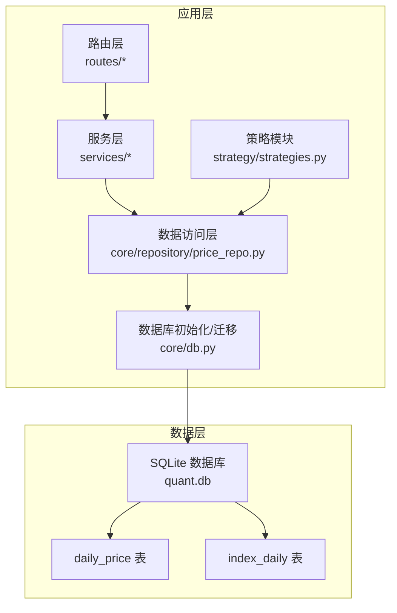
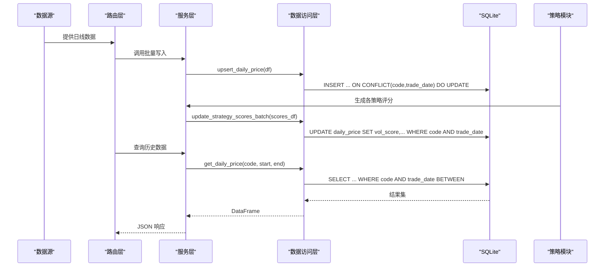
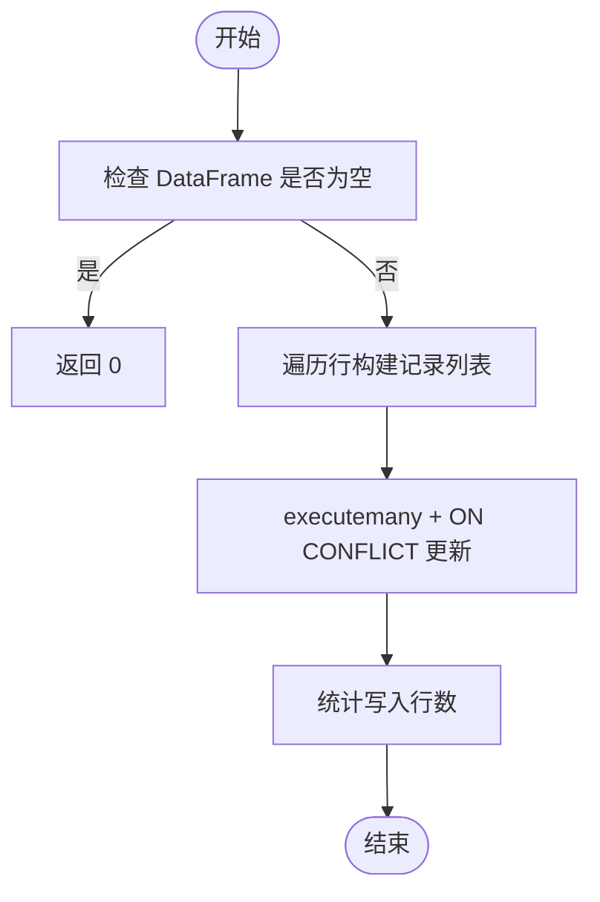
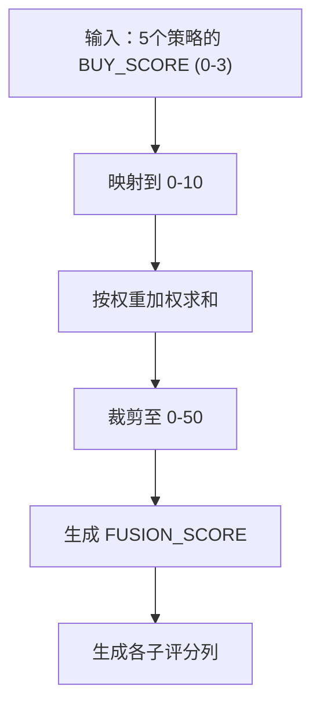
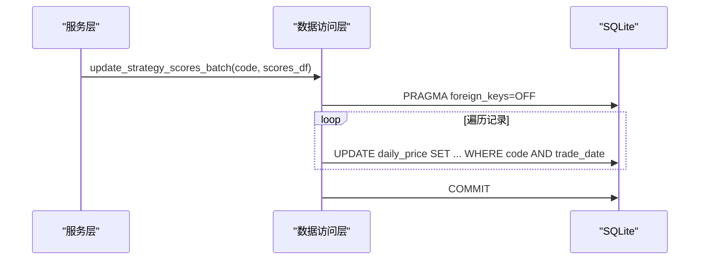
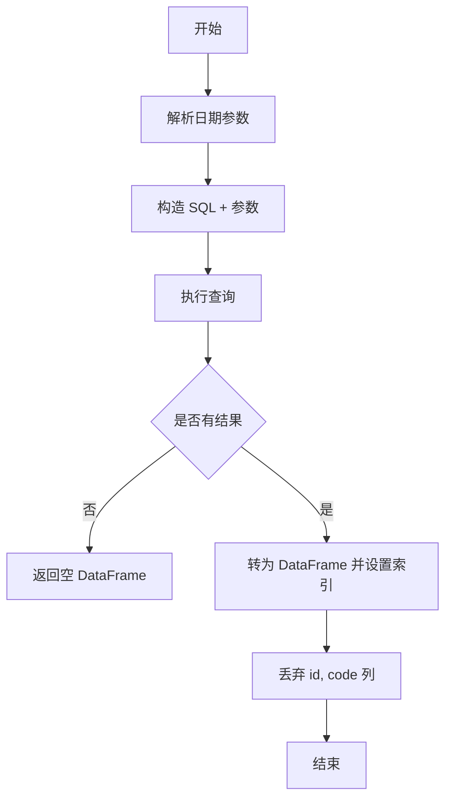
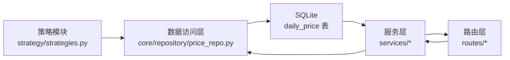

# daily_price 日线行情表

<cite>
**本文引用的文件**
- [core/db.py](file://core/db.py)
- [core/repository/price_repo.py](file://core/repository/price_repo.py)
- [strategy/strategies.py](file://strategy/strategies.py)
- [services/strategy_service.py](file://services/strategy_service.py)
- [services/signal_service.py](file://services/signal_service.py)
- [routes/data_fetch.py](file://routes/data_fetch.py)
- [governance/chancellery/strategy_engine.py](file://governance/chancellery/strategy_engine.py)
- [quant.py](file://quant.py)
</cite>

## 目录
1. [简介](#简介)
2. [项目结构](#项目结构)
3. [核心组件](#核心组件)
4. [架构总览](#架构总览)
5. [详细组件分析](#详细组件分析)
6. [依赖分析](#依赖分析)
7. [性能考量](#性能考量)
8. [故障排查指南](#故障排查指南)
9. [结论](#结论)
10. [附录](#附录)

## 简介
本文件系统性阐述 daily_price 日线行情表的设计与实现，覆盖以下方面：
- 表结构与字段语义（OHLCV 与策略评分字段）
- 复合唯一索引与查询路径
- 批量数据写入、策略评分更新与历史数据查询的实现
- 策略评分字段的设计目的与计算逻辑（vol_score、ma_score、diverge_score、bottom_score、whale_score、fusion_score）
- 数据完整性约束、并发访问控制与错误处理机制
- 性能优化策略与最佳实践

## 项目结构
daily_price 表位于本地 SQLite 数据库中，由核心数据库初始化脚本创建，并通过数据访问层提供统一接口。策略评分由策略模块生成，再通过数据访问层写入表中。

图表来源
- [core/db.py:71-110](file://core/db.py#L71-L110)
- [core/repository/price_repo.py:13-129](file://core/repository/price_repo.py#L13-L129)
- [strategy/strategies.py:368-429](file://strategy/strategies.py#L368-L429)

章节来源
- [core/db.py:71-110](file://core/db.py#L71-L110)
- [core/repository/price_repo.py:13-129](file://core/repository/price_repo.py#L13-L129)

## 核心组件
- daily_price 表：存储股票日线 OHLCV 数据及策略评分字段
- 数据访问层：封装 upsert、批量评分更新、历史查询等操作
- 策略模块：生成各策略评分并融合为 fusion_score
- 服务与路由：对外提供数据拉取、评分写入与查询接口

章节来源
- [core/db.py:71-110](file://core/db.py#L71-L110)
- [core/repository/price_repo.py:13-129](file://core/repository/price_repo.py#L13-L129)
- [strategy/strategies.py:368-429](file://strategy/strategies.py#L368-L429)

## 架构总览
daily_price 的数据流从上游数据源到本地数据库，再到策略评分与查询服务，形成闭环。

图表来源
- [routes/data_fetch.py:17-52](file://routes/data_fetch.py#L17-L52)
- [core/repository/price_repo.py:13-129](file://core/repository/price_repo.py#L13-L129)
- [strategy/strategies.py:368-429](file://strategy/strategies.py#L368-L429)

## 详细组件分析

### 表结构定义
- 主键与唯一性
  - 自增主键 id
  - 复合唯一索引 (code, trade_date)，确保同股票同交易日唯一
- 字段说明
  - code：股票代码
  - trade_date：交易日期
  - open/high/low/close：开盘/最高/最低/收盘价
  - volume/amount：成交量/成交额
  - pct_change/turnover：涨跌幅/换手率
  - vol_score/ma_score/diverge_score/bottom_score/whale_score/fusion_score：策略评分字段（默认 0）

章节来源
- [core/db.py:71-110](file://core/db.py#L71-L110)

### 复合唯一索引设计
- 设计目的
  - 防止重复写入同一股票同一天的数据
  - 保证查询与统计的确定性
- 索引实现
  - 建表时创建 UNIQUE(code, trade_date)
  - 同时建立索引 idx_daily_code_date(code, trade_date) 与 idx_daily_date(trade_date)，以优化按股票与按日期的查询

章节来源
- [core/db.py:90-93](file://core/db.py#L90-L93)

### 批量数据写入（OHLCV）
- 接口与流程
  - upsert_daily_price(code, df)：将 OHLCV 数据批量写入，若冲突则更新
  - 输入 DataFrame 需包含 open/high/low/close/volume/amount/pct_change/turnover 列，索引为日期
- 实现要点
  - 使用 executemany 批量插入
  - ON CONFLICT(code, trade_date) DO UPDATE SET 更新 OHLCV 与换手等字段
  - 返回实际写入行数

图表来源
- [core/repository/price_repo.py:13-47](file://core/repository/price_repo.py#L13-L47)
- [core/db.py:543-578](file://core/db.py#L543-L578)

章节来源
- [core/repository/price_repo.py:13-47](file://core/repository/price_repo.py#L13-L47)
- [core/db.py:543-578](file://core/db.py#L543-L578)

### 策略评分字段设计与计算逻辑
- 设计目的
  - 将多策略信号与评分持久化，便于后续筛选、回测与展示
  - 保持 OHLCV 与评分分离，提高写入吞吐与查询灵活性
- 字段范围
  - vol_score/ma_score/diverge_score/bottom_score/whale_score：各 0-10
  - fusion_score：0-50，由多策略加权融合得到
- 计算流程
  - 各策略输出 BUY_SCORE ∈ [0,3]，经映射到 0-10
  - 按权重加权融合，最终映射到 0-50
  - 生成 VOL_SCORE、MA_SCORE、DIVERGE_SCORE、BOTTOM_SCORE、WHALE_SCORE 与 FUSION_SCORE 列

图表来源
- [strategy/strategies.py:368-429](file://strategy/strategies.py#L368-L429)

章节来源
- [strategy/strategies.py:368-429](file://strategy/strategies.py#L368-L429)

### 批量策略评分更新
- 接口与流程
  - update_strategy_scores_batch(code, scores_df)：批量更新策略评分
  - 仅更新 vol_score/ma_score/diverge_score/bottom_score/whale_score/fusion_score
- 实现要点
  - 关闭外键检查（PRAGMA foreign_keys=OFF）以提升批量更新性能
  - 循环执行 UPDATE WHERE code AND trade_date
  - 采用 round(...) 保留固定精度

图表来源
- [core/repository/price_repo.py:50-92](file://core/repository/price_repo.py#L50-L92)
- [core/db.py:581-628](file://core/db.py#L581-L628)

章节来源
- [core/repository/price_repo.py:50-92](file://core/repository/price_repo.py#L50-L92)
- [core/db.py:581-628](file://core/db.py#L581-L628)

### 历史数据查询
- 接口与流程
  - get_daily_price(code, start_date, end_date, min_rows)：按股票与日期范围查询
  - 支持 YYYY-MM-DD 或 YYYYMMDD 两种日期格式
- 实现要点
  - 构造 WHERE 子句并按 trade_date 升序排序
  - 返回 DataFrame，索引为 trade_date，去除 id、code 列

图表来源
- [core/repository/price_repo.py:95-129](file://core/repository/price_repo.py#L95-L129)
- [core/db.py:631-665](file://core/db.py#L631-L665)

章节来源
- [core/repository/price_repo.py:95-129](file://core/repository/price_repo.py#L95-L129)
- [core/db.py:631-665](file://core/db.py#L631-L665)

### 数据完整性约束
- 复合唯一约束：UNIQUE(code, trade_date)
- 默认值：策略评分字段默认 0
- 迁移增强：初始化时自动为旧表补充策略评分列

章节来源
- [core/db.py:90-93](file://core/db.py#L90-L93)
- [core/db.py:429-437](file://core/db.py#L429-L437)

### 并发访问控制与错误处理
- 连接管理
  - 使用上下文管理器 get_conn()，自动提交/回滚/关闭
  - WAL 模式与 NORMAL 同步级别提升并发写入性能
- 错误处理
  - 事务异常自动回滚并抛出
  - 查询无结果返回空 DataFrame，避免异常传播

章节来源
- [core/db.py:26-39](file://core/db.py#L26-L39)
- [core/db.py:28-30](file://core/db.py#L28-L30)
- [core/repository/price_repo.py:95-129](file://core/repository/price_repo.py#L95-L129)

## 依赖分析
- daily_price 与策略模块的耦合
  - 策略模块生成 VOL_SCORE、MA_SCORE、DIVERGE_SCORE、BOTTOM_SCORE、WHALE_SCORE、FUSION_SCORE 列
  - 数据访问层负责将这些列写入数据库
- 查询侧依赖
  - 服务层与路由层通过数据访问层查询 daily_price，支持按日期范围过滤与排序

图表来源
- [strategy/strategies.py:368-429](file://strategy/strategies.py#L368-L429)
- [core/repository/price_repo.py:13-129](file://core/repository/price_repo.py#L13-L129)
- [services/signal_service.py:76-86](file://services/signal_service.py#L76-L86)

章节来源
- [strategy/strategies.py:368-429](file://strategy/strategies.py#L368-L429)
- [core/repository/price_repo.py:13-129](file://core/repository/price_repo.py#L13-L129)
- [services/signal_service.py:76-86](file://services/signal_service.py#L76-L86)

## 性能考量
- 写入性能
  - 批量插入：executemany + ON CONFLICT 提升吞吐
  - 关闭外键检查：PRAGMA foreign_keys=OFF 降低批量更新开销
  - WAL 模式：提升并发写入能力
- 查询性能
  - 复合索引 (code, trade_date)：加速按股票与日期范围查询
  - 单列索引 (trade_date)：加速按日期过滤
- 数据类型
  - 使用 REAL 存储浮点数值，满足策略评分精度需求
- 建议
  - 批量写入前对 DataFrame 做去重与格式校验
  - 定期维护索引与统计信息（SQLite 通常自动维护）

章节来源
- [core/db.py:28-30](file://core/db.py#L28-L30)
- [core/db.py:90-93](file://core/db.py#L90-L93)
- [core/repository/price_repo.py:36-46](file://core/repository/price_repo.py#L36-L46)
- [core/repository/price_repo.py:80-92](file://core/repository/price_repo.py#L80-L92)

## 故障排查指南
- 写入失败
  - 检查 DataFrame 是否为空或列缺失
  - 确认 trade_date 格式正确（YYYY-MM-DD 或 YYYYMMDD）
- 评分未更新
  - 确认 scores_df 包含 VOL_SCORE、MA_SCORE、DIVERGE_SCORE、BOTTOM_SCORE、WHALE_SCORE、FUSION_SCORE 列
  - 检查 WHERE 条件匹配的记录是否存在
- 查询无结果
  - 确认股票代码与日期范围有效
  - 检查数据库中是否存在该股票的历史数据
- 并发问题
  - 确保使用 get_conn() 上下文管理器
  - 避免在事务中长时间持有连接

章节来源
- [core/repository/price_repo.py:13-47](file://core/repository/price_repo.py#L13-L47)
- [core/repository/price_repo.py:50-92](file://core/repository/price_repo.py#L50-L92)
- [core/repository/price_repo.py:95-129](file://core/repository/price_repo.py#L95-L129)
- [core/db.py:26-39](file://core/db.py#L26-L39)

## 结论
daily_price 表通过清晰的 OHLCV 字段与策略评分字段，结合复合唯一索引与批量写入/更新机制，实现了高性能、可扩展的日线行情数据存储。策略评分与 OHLCV 分离的设计提升了写入吞吐与查询灵活性，配合 SQLite 的 WAL 模式与索引策略，满足中小规模量化系统的数据需求。建议在生产环境中进一步完善数据校验、监控与备份策略。

## 附录

### 表结构与索引定义
- 表：daily_price
  - 字段：id、code、trade_date、open、high、low、close、volume、amount、pct_change、turnover、vol_score、ma_score、diverge_score、bottom_score、whale_score、fusion_score
  - 约束：PRIMARY KEY(id)，UNIQUE(code, trade_date)
  - 索引：idx_daily_code_date(code, trade_date)、idx_daily_date(trade_date)

章节来源
- [core/db.py:71-110](file://core/db.py#L71-L110)
- [core/db.py:90-93](file://core/db.py#L90-L93)

### 策略评分字段映射与融合
- 映射规则：BUY_SCORE ∈ [0,3] → 评分 ∈ [0,10]
- 融合规则：FUSION_SCORE = clip(Σ(策略分_i × 权重_i) × (10/3) × 5, 0, 50)
- 生成列：VOL_SCORE、MA_SCORE、DIVERGE_SCORE、BOTTOM_SCORE、WHALE_SCORE、FUSION_SCORE

章节来源
- [strategy/strategies.py:368-429](file://strategy/strategies.py#L368-L429)

### 数据访问接口一览
- 写入：upsert_daily_price(code, df)
- 评分更新：update_strategy_scores_batch(code, scores_df)
- 查询：get_daily_price(code, start_date, end_date, min_rows)

章节来源
- [core/repository/price_repo.py:13-129](file://core/repository/price_repo.py#L13-L129)
- [core/db.py:543-665](file://core/db.py#L543-L665)