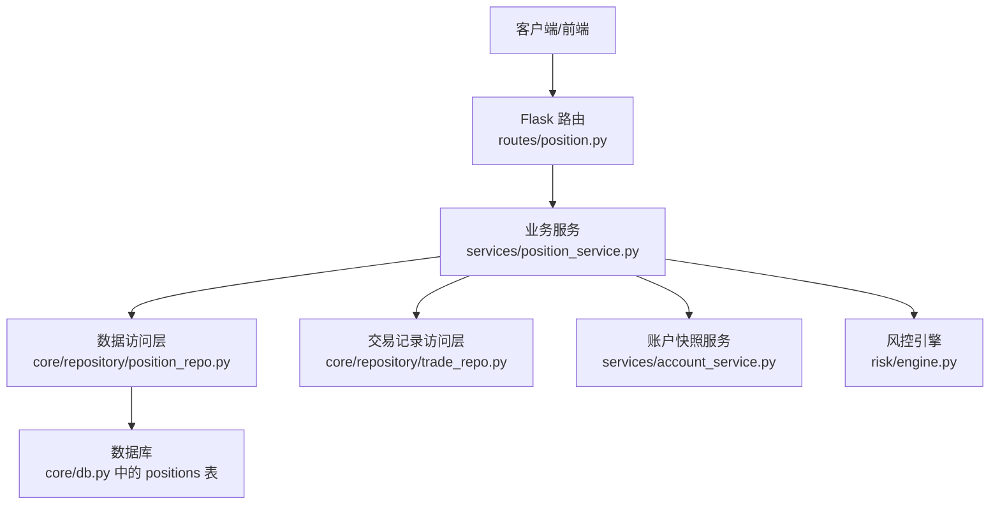
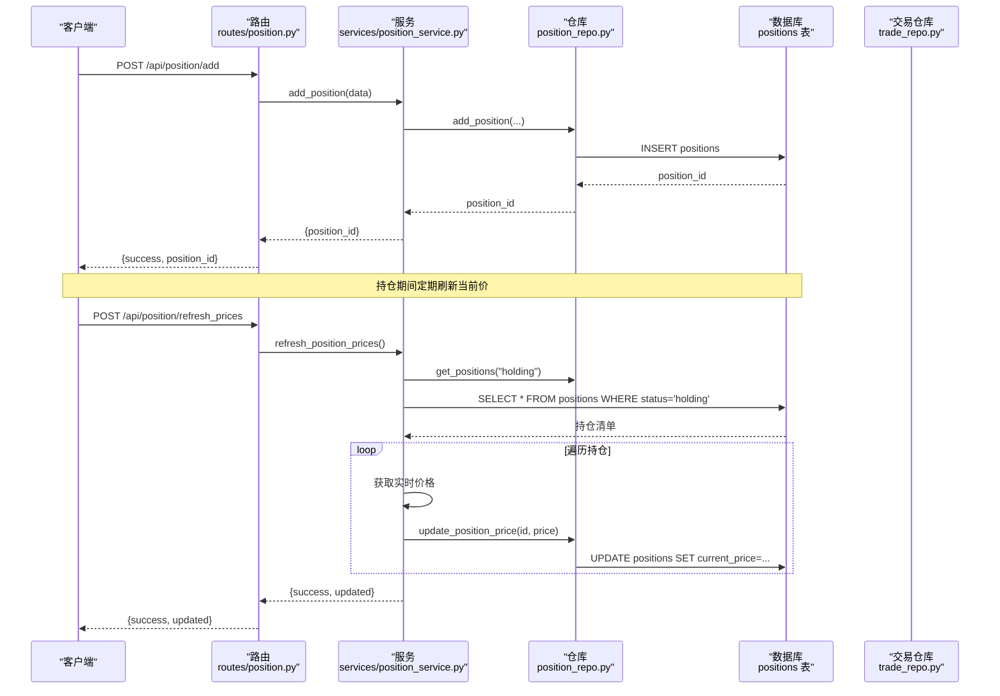
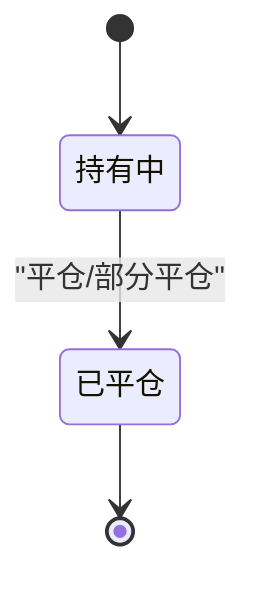
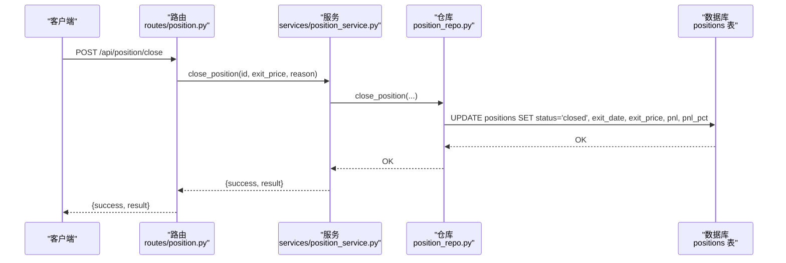
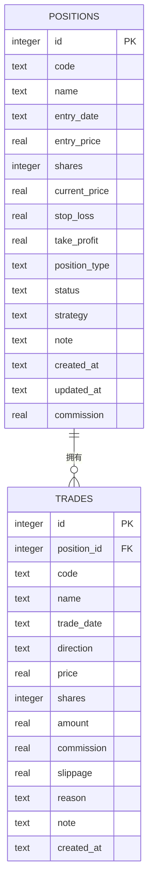
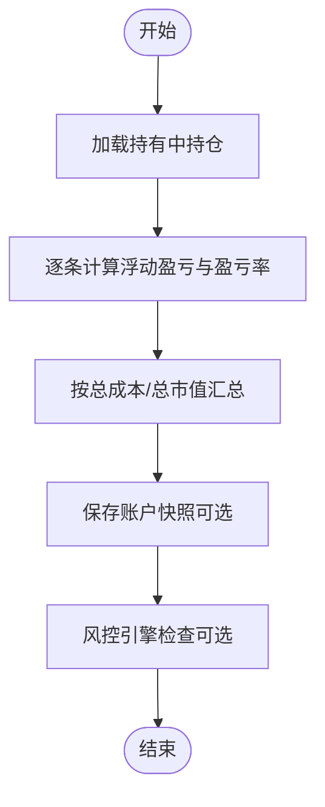
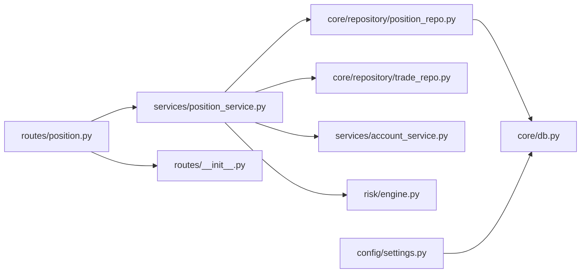

# positions 持仓记录表

<cite>
**本文引用的文件**
- [core/db.py](file://core/db.py)
- [core/repository/position_repo.py](file://core/repository/position_repo.py)
- [services/position_service.py](file://services/position_service.py)
- [routes/position.py](file://routes/position.py)
- [routes/__init__.py](file://routes/__init__.py)
- [core/repository/trade_repo.py](file://core/repository/trade_repo.py)
- [services/account_service.py](file://services/account_service.py)
- [risk/engine.py](file://risk/engine.py)
- [config/settings.py](file://config/settings.py)
</cite>

## 目录
1. [简介](#简介)
2. [项目结构](#项目结构)
3. [核心组件](#核心组件)
4. [架构概览](#架构概览)
5. [详细组件分析](#详细组件分析)
6. [依赖分析](#依赖分析)
7. [性能考虑](#性能考虑)
8. [故障排查指南](#故障排查指南)
9. [结论](#结论)
10. [附录](#附录)

## 简介
本文件系统性阐述 positions 持仓记录表的设计与实现，覆盖以下方面：
- 表结构与字段语义（股票代码、名称、建仓日期/价格、持股数量、当前价格、止损止盈、仓位类型、状态、策略标识、备注、手续费等）
- 持仓状态管理与状态转换机制
- 仓位类型分类与风险控制参数
- 开仓、平仓、部分平仓流程及与 trades 交易记录表的关联
- 价值计算、收益统计与风险监控的实现路径
- 索引策略与性能优化建议

## 项目结构
positions 表位于本地 SQLite 数据库中，由数据库初始化脚本统一创建，并通过三层架构进行访问与使用：
- 数据访问层（Repository）：封装对 positions 表的增删改查与聚合统计
- 业务服务层（Service）：提供对外接口，负责数据清洗、计算与调用数据访问层
- 接口路由层（Route）：暴露 REST API，供前端或外部系统调用

图表来源
- [routes/position.py:15-116](file://routes/position.py#L15-L116)
- [services/position_service.py:12-80](file://services/position_service.py#L12-L80)
- [core/repository/position_repo.py:12-138](file://core/repository/position_repo.py#L12-L138)
- [core/db.py:168-208](file://core/db.py#L168-L208)
- [core/repository/trade_repo.py:12-77](file://core/repository/trade_repo.py#L12-L77)
- [services/account_service.py:10-31](file://services/account_service.py#L10-L31)
- [risk/engine.py:13-168](file://risk/engine.py#L13-L168)

章节来源
- [routes/position.py:15-116](file://routes/position.py#L15-L116)
- [services/position_service.py:12-80](file://services/position_service.py#L12-L80)
- [core/repository/position_repo.py:12-138](file://core/repository/position_repo.py#L12-L138)
- [core/db.py:168-208](file://core/db.py#L168-L208)

## 核心组件
- 数据库层（positions 表）
  - 字段：自增主键、股票代码/名称、建仓日期/价格、持股数量、当前价格、止损/止盈、仓位类型（默认多头）、状态（默认持有）、策略标识、备注、创建/更新时间、手续费
  - 索引：按股票代码、状态建立索引，便于快速查询与过滤
- 数据访问层（position_repo）
  - 提供新增、平仓、部分平仓、更新当前价、按 ID/代码查询、删除、汇总统计等能力
- 业务服务层（position_service）
  - 对外提供统一接口，负责参数校验、实时价格刷新、浮动盈亏计算、汇总统计
- 接口路由层（position.py）
  - 暴露 /list、/add、/close、/partial_close、/update_price、/summary、/delete、/refresh_prices 等 API
- 关联组件
  - trades 交易记录表：每笔交易与 position_id 关联，记录方向、价格、数量、金额、手续费、滑点、原因、备注等
  - account_snapshots 账户快照：记录总资产、现金、持仓价值、总成本、总盈亏、盈亏率等
  - 风控引擎：基于账户状态生成风控事件与状态，影响交易决策

章节来源
- [core/db.py:168-208](file://core/db.py#L168-L208)
- [core/repository/position_repo.py:12-138](file://core/repository/position_repo.py#L12-L138)
- [services/position_service.py:12-80](file://services/position_service.py#L12-L80)
- [routes/position.py:15-116](file://routes/position.py#L15-L116)
- [core/repository/trade_repo.py:12-77](file://core/repository/trade_repo.py#L12-L77)
- [services/account_service.py:10-31](file://services/account_service.py#L10-L31)
- [risk/engine.py:13-168](file://risk/engine.py#L13-L168)

## 架构概览
positions 表作为核心资产数据载体，贯穿“策略信号 → 开仓 → 持仓管理 → 平仓/部分平仓 → 交易记录 → 账户快照 → 风控监控”的完整闭环。

图表来源
- [routes/position.py:25-116](file://routes/position.py#L25-L116)
- [services/position_service.py:25-80](file://services/position_service.py#L25-L80)
- [core/repository/position_repo.py:12-83](file://core/repository/position_repo.py#L12-L83)
- [core/repository/trade_repo.py:12-37](file://core/repository/trade_repo.py#L12-L37)

## 详细组件分析

### 表结构设计与字段语义
- 主键与标识
  - id：自增主键，唯一标识每条持仓记录
  - code/name：股票代码与名称，用于定位标的
- 成本与数量
  - entry_date/entry_price：建仓日期与建仓价格
  - shares：持有数量（整数）
- 当前与风控
  - current_price：当前价格（用于浮动盈亏计算）
  - stop_loss/take_profit：止损/止盈价格（可选）
  - position_type：仓位类型，默认多头（long），未来可扩展为空头等
  - status：持仓状态，默认持有（holding），平仓后变为 closed
- 策略与运营
  - strategy：策略标识，便于回测与归因
  - note：备注
  - created_at/updated_at：记录创建与更新时间
  - commission：手续费（迁移后新增字段）

索引策略
- 按 code 建立索引，加速按股票维度查询
- 按 status 建立索引，加速按状态过滤（如仅查询持有中）

章节来源
- [core/db.py:168-188](file://core/db.py#L168-L188)

### 状态管理与状态转换机制
- 默认状态：新仓默认为 holding
- 平仓转换：close_position 将状态置为 closed，并填充平仓日期、平仓价格、浮动盈亏与盈亏率
- 部分平仓：partial_close_position 在原仓剩余份额基础上减仓，并新增一条已平仓记录，保留原建仓信息以便归因

图表来源
- [core/repository/position_repo.py:27-74](file://core/repository/position_repo.py#L27-L74)

章节来源
- [core/repository/position_repo.py:27-74](file://core/repository/position_repo.py#L27-L74)

### 仓位类型分类与风险控制参数
- 仓位类型：position_type 默认 long（多头），可扩展为 short（空头）等
- 风险控制参数：stop_loss、take_profit 用于触发风控条件；策略标识 strategy 用于区分不同风控阈值与策略行为

章节来源
- [core/db.py:179-185](file://core/db.py#L179-L185)
- [core/repository/position_repo.py:12-24](file://core/repository/position_repo.py#L12-L24)

### 开仓、平仓、调整操作与 API 流程
- 开仓
  - 路由：POST /api/position/add
  - 服务：add_position(data) 调用数据访问层插入记录，状态默认 holding
- 平仓
  - 路由：POST /api/position/close
  - 服务：close_position(position_id, exit_price, reason) 更新状态为 closed，并计算浮动盈亏
- 部分平仓
  - 路由：POST /api/position/partial_close
  - 服务：partial_close_position(position_id, exit_price, shares_to_sell) 原仓减仓，新增一条已平仓记录
- 价格更新
  - 路由：POST /api/position/update_price
  - 服务：update_position_price(position_id, current_price) 更新 current_price
- 批量刷新
  - 路由：POST /api/position/refresh_prices
  - 服务：refresh_position_prices() 获取持有中清单，逐条拉取实时价格并更新

图表来源
- [routes/position.py:35-48](file://routes/position.py#L35-L48)
- [services/position_service.py:41-43](file://services/position_service.py#L41-L43)
- [core/repository/position_repo.py:27-39](file://core/repository/position_repo.py#L27-L39)

章节来源
- [routes/position.py:25-116](file://routes/position.py#L25-L116)
- [services/position_service.py:25-80](file://services/position_service.py#L25-L80)
- [core/repository/position_repo.py:12-83](file://core/repository/position_repo.py#L12-L83)

### 与 trades 交易记录表的关联关系
- 关联字段：trades.position_id 指向 positions.id
- 交易记录内容：方向（买入/卖出）、成交日期、价格、数量、金额、手续费、滑点、原因、备注、创建时间
- 关联意义：每笔开仓/平仓/调整均应产生对应交易记录，便于回放、归因与合规审计

图表来源
- [core/db.py:168-208](file://core/db.py#L168-L208)
- [core/repository/trade_repo.py:12-23](file://core/repository/trade_repo.py#L12-L23)

章节来源
- [core/db.py:168-208](file://core/db.py#L168-L208)
- [core/repository/trade_repo.py:12-37](file://core/repository/trade_repo.py#L12-L37)

### 持仓价值计算、收益统计与风险监控
- 价值计算
  - 浮动盈亏：(current_price - entry_price) × shares
  - 盈亏率：(current_price / entry_price - 1) × 100%
  - 汇总统计：按 status='holding' 聚合，计算总市值、总成本、总盈亏、总盈亏率与持仓数量
- 风险监控
  - 风控引擎根据账户状态（如连续亏损次数、最大回撤、持仓数量、总敞口等）生成风控事件与状态
  - positions 表中的 stop_loss/take_profit 可作为策略层面的风控触发参考

图表来源
- [services/position_service.py:12-22](file://services/position_service.py#L12-L22)
- [core/repository/position_repo.py:120-137](file://core/repository/position_repo.py#L120-L137)
- [services/account_service.py:20-30](file://services/account_service.py#L20-L30)
- [risk/engine.py:19-71](file://risk/engine.py#L19-L71)

章节来源
- [services/position_service.py:12-22](file://services/position_service.py#L12-L22)
- [core/repository/position_repo.py:120-137](file://core/repository/position_repo.py#L120-L137)
- [services/account_service.py:20-30](file://services/account_service.py#L20-L30)
- [risk/engine.py:19-71](file://risk/engine.py#L19-L71)

## 依赖分析
- 组件耦合
  - routes 仅依赖 services，不直接访问数据库，符合分层原则
  - services 依赖 repository 与数据访问工具，负责业务逻辑与计算
  - repository 依赖 core/db 的连接管理与建表脚本
- 外部依赖
  - Flask 蓝图注册于 routes/__init__.py
  - 数据库路径由 config/settings.py 提供

图表来源
- [routes/position.py:15-116](file://routes/position.py#L15-L116)
- [services/position_service.py:12-80](file://services/position_service.py#L12-L80)
- [core/repository/position_repo.py:12-138](file://core/repository/position_repo.py#L12-L138)
- [core/db.py:168-208](file://core/db.py#L168-L208)
- [routes/__init__.py:6-16](file://routes/__init__.py#L6-L16)
- [core/repository/trade_repo.py:12-77](file://core/repository/trade_repo.py#L12-L77)
- [services/account_service.py:10-31](file://services/account_service.py#L10-L31)
- [risk/engine.py:13-168](file://risk/engine.py#L13-L168)
- [config/settings.py:6-8](file://config/settings.py#L6-L8)

章节来源
- [routes/position.py:15-116](file://routes/position.py#L15-L116)
- [services/position_service.py:12-80](file://services/position_service.py#L12-L80)
- [core/repository/position_repo.py:12-138](file://core/repository/position_repo.py#L12-L138)
- [core/db.py:168-208](file://core/db.py#L168-L208)
- [routes/__init__.py:6-16](file://routes/__init__.py#L6-L16)
- [core/repository/trade_repo.py:12-77](file://core/repository/trade_repo.py#L12-L77)
- [services/account_service.py:10-31](file://services/account_service.py#L10-L31)
- [risk/engine.py:13-168](file://risk/engine.py#L13-L168)
- [config/settings.py:6-8](file://config/settings.py#L6-L8)

## 性能考虑
- 索引策略
  - positions 表已建立 code 与 status 索引，满足高频查询场景
  - 若存在大量按策略标识过滤的需求，可考虑为 strategy 建立索引
- 批量刷新
  - refresh_position_prices 会遍历持有中清单并逐条更新，建议在非高峰时段执行或增加并发控制
- 数据库连接
  - 使用 WAL 模式与 NORMAL 同步策略提升并发写入性能，避免长事务阻塞

章节来源
- [core/db.py:187-188](file://core/db.py#L187-L188)
- [services/position_service.py:66-80](file://services/position_service.py#L66-L80)

## 故障排查指南
- 常见问题
  - 缺少必要参数：/close、/partial_close、/update_price、/delete 等接口需校验必填字段，缺失时返回错误码
  - 部分平仓数量异常：shares 必须大于 0，否则拒绝请求
  - 数据库连接异常：确保数据库文件存在且路径正确（config/settings.py）
  - 未建表：首次运行需执行数据库初始化（core/db.py 中的建表脚本）
- 排查步骤
  - 检查路由层返回的错误信息与状态码
  - 核对服务层参数解析与类型转换
  - 核对仓库层 SQL 与字段映射
  - 查看数据库是否存在 positions/trades 表与索引

章节来源
- [routes/position.py:35-116](file://routes/position.py#L35-L116)
- [services/position_service.py:25-80](file://services/position_service.py#L25-L80)
- [core/repository/position_repo.py:12-138](file://core/repository/position_repo.py#L12-L138)
- [config/settings.py:6-8](file://config/settings.py#L6-L8)

## 结论
positions 持仓记录表以清晰的字段设计与分层架构支撑了完整的交易生命周期管理。通过与 trades 交易记录表、账户快照与风控引擎的协同，实现了从开仓到平仓的全链路可观测与可追溯。建议在生产环境中持续完善索引策略、优化批量刷新流程，并结合风控规则动态调整仓位与止盈止损参数，以提升整体稳健性与收益稳定性。

## 附录
- API 列表（路径与用途）
  - GET /api/position/list：按状态查询持仓列表（默认 holding）
  - POST /api/position/add：新增持仓
  - POST /api/position/close：平仓
  - POST /api/position/partial_close：部分平仓
  - POST /api/position/update_price：更新当前价
  - GET /api/position/summary：获取持仓汇总统计
  - POST /api/position/delete：删除持仓记录
  - POST /api/position/refresh_prices：批量刷新当前价

章节来源
- [routes/position.py:15-116](file://routes/position.py#L15-L116)
- [routes/__init__.py:10](file://routes/__init__.py#L10)