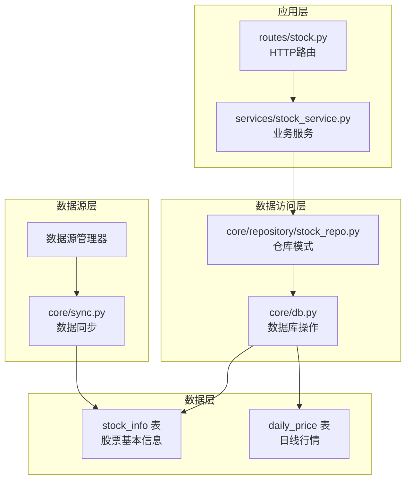
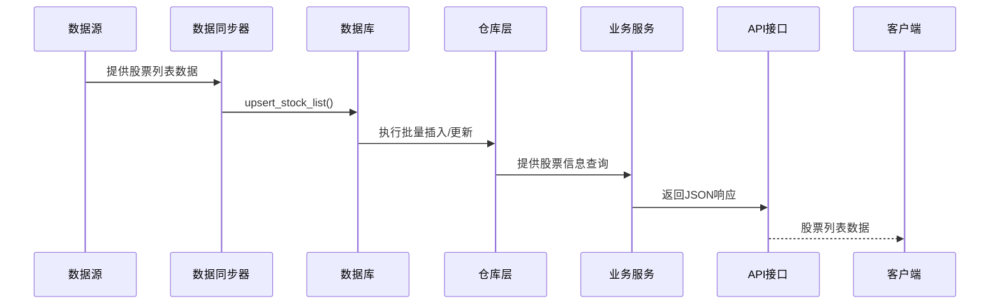
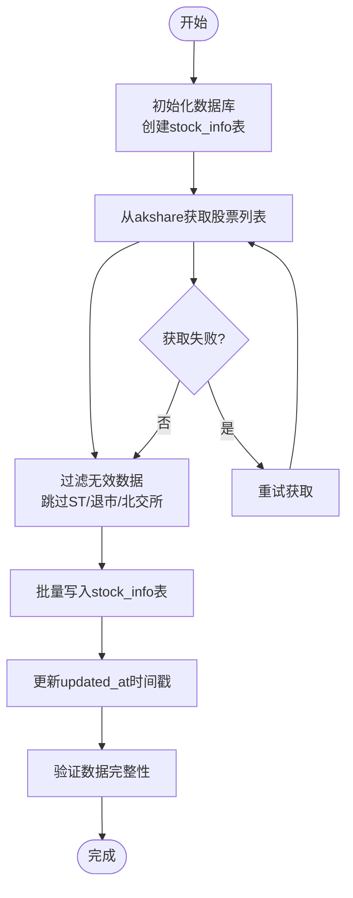
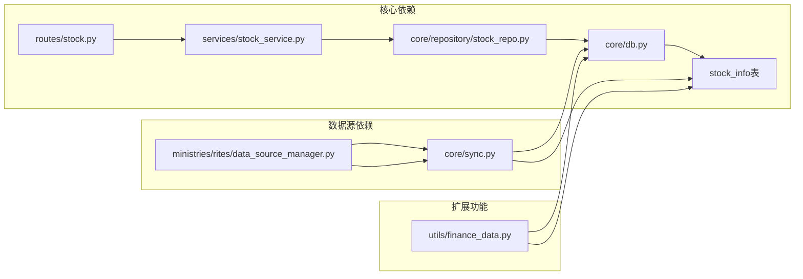

# stock_info 股票基本信息表

<cite>
**本文档引用的文件**
- [core/db.py](file://core/db.py)
- [core/repository/stock_repo.py](file://core/repository/stock_repo.py)
- [core/sync.py](file://core/sync.py)
- [services/stock_service.py](file://services/stock_service.py)
- [routes/stock.py](file://routes/stock.py)
- [ministries/rites/data_source_manager.py](file://ministries/rites/data_source_manager.py)
- [utils/finance_data.py](file://utils/finance_data.py)
</cite>

## 目录
1. [简介](#简介)
2. [项目结构](#项目结构)
3. [核心组件](#核心组件)
4. [架构概览](#架构概览)
5. [详细组件分析](#详细组件分析)
6. [依赖分析](#依赖分析)
7. [性能考虑](#性能考虑)
8. [故障排除指南](#故障排除指南)
9. [结论](#结论)

## 简介
stock_info 是本项目中用于存储A股股票基本信息的核心表，承担着股票元数据管理的重要职责。该表不仅存储股票的基本标识信息，还承载着后续衍生数据的关联纽带作用。本文档将全面解析该表的结构设计、字段语义、约束条件、更新机制以及在整体系统中的集成方式。

## 项目结构
该项目采用分层架构设计，stock_info 表作为数据层的核心组件，贯穿于以下层次：
- 数据访问层：通过 core/db.py 和 core/repository/stock_repo.py 提供统一的数据访问接口
- 业务服务层：services/stock_service.py 基于 stock_info 表进行业务逻辑处理
- 路由接口层：routes/stock.py 提供HTTP接口，对外暴露股票信息服务
- 数据同步层：core/sync.py 负责从外部数据源拉取股票列表并写入 stock_info 表
- 数据源管理层：ministries/rites/data_source_manager.py 管理多种数据源的接入和切换



**图表来源**
- [core/db.py:62-69](file://core/db.py#L62-L69)
- [core/repository/stock_repo.py:13-37](file://core/repository/stock_repo.py#L13-L37)
- [core/sync.py:136-176](file://core/sync.py#L136-L176)

**章节来源**
- [core/db.py:1-800](file://core/db.py#L1-L800)
- [core/repository/stock_repo.py:1-37](file://core/repository/stock_repo.py#L1-L37)
- [core/sync.py:1-760](file://core/sync.py#L1-L760)

## 核心组件
stock_info 表在系统中扮演着多重关键角色：

### 核心职责
1. **股票元数据存储**：维护股票代码、名称、市场类型等基础信息
2. **数据关联枢纽**：作为 daily_price 等其他表的外键参照
3. **状态管理**：通过 is_active 字段控制股票的有效性
4. **更新时间追踪**：通过 updated_at 字段记录最后更新时间

### 关键特性
- **主键设计**：code 字段作为主键，确保每只股票的唯一性
- **自动迁移**：支持动态添加新字段（如市值相关字段）
- **批量操作**：提供 upsert_stock_list 方法支持批量写入
- **查询优化**：配合相关索引实现高效查询

**章节来源**
- [core/db.py:62-69](file://core/db.py#L62-L69)
- [core/repository/stock_repo.py:13-37](file://core/repository/stock_repo.py#L13-L37)
- [core/sync.py:136-176](file://core/sync.py#L136-L176)

## 架构概览
stock_info 表在整个数据流中的位置和作用如下：



**图表来源**
- [core/sync.py:136-176](file://core/sync.py#L136-L176)
- [core/db.py:470-486](file://core/db.py#L470-L486)
- [core/repository/stock_repo.py:13-28](file://core/repository/stock_repo.py#L13-L28)

## 详细组件分析

### 表结构定义
stock_info 表采用简洁而实用的设计，包含以下核心字段：

| 字段名 | 数据类型 | 约束条件 | 业务含义 |
|--------|----------|----------|----------|
| code | TEXT | PRIMARY KEY, NOT NULL | 股票代码，主键 |
| name | TEXT | NOT NULL | 股票名称 |
| market | TEXT | NULL | 市场类型（SH/SZ） |
| is_active | INTEGER | DEFAULT 1 | 激活状态（1=激活，0=停用） |
| updated_at | TEXT | NULL | 最后更新时间戳 |

### 字段详细说明

#### code 字段
- **数据类型**：TEXT
- **约束**：PRIMARY KEY，NOT NULL
- **业务含义**：A股股票的唯一标识符，采用6位数字代码
- **设计考量**：作为主键确保每只股票的唯一性，便于与其他表建立关联

#### name 字段
- **数据类型**：TEXT  
- **约束**：NOT NULL
- **业务含义**：股票的正式名称
- **验证规则**：不能为空，必须为有效的中文或英文名称

#### market 字段
- **数据类型**：TEXT
- **约束**：NULL
- **业务含义**：交易所标识，支持 SH（上交所）、SZ（深交所）
- **数据来源**：从 akshare 数据源获取，自动识别交易所类型

#### is_active 字段
- **数据类型**：INTEGER
- **约束**：DEFAULT 1
- **业务含义**：股票的有效性状态
- **使用场景**：支持股票停用、退市等情况的标记

#### updated_at 字段
- **数据类型**：TEXT
- **约束**：NULL
- **业务含义**：记录最后一次更新的时间戳
- **格式**：ISO 8601 格式字符串

### 主键设计
stock_info 表采用 code 字段作为主键，这种设计具有以下优势：
- **唯一性保证**：确保每只股票在数据库中只有一个记录
- **查询效率**：主键索引提供O(log n)的查询性能
- **外键关联**：为 daily_price 等表提供稳定的关联基础

### 索引策略
虽然 code 字段作为主键自带索引，但系统还提供了以下辅助索引：
- **唯一索引**：确保股票代码的唯一性
- **查询优化**：配合 WHERE 子句实现高效的过滤查询

### 更新机制
stock_info 表支持多种更新方式：

#### 批量写入机制
```sql
INSERT INTO stock_info(code, name, market, updated_at)
VALUES(:code, :name, :market, :updated_at)
ON CONFLICT(code) DO UPDATE SET
    name=excluded.name,
    market=excluded.market,
    updated_at=excluded.updated_at
```

#### 单条更新机制
```sql
UPDATE stock_info 
SET total_shares=?, circ_shares=? 
WHERE code=?
```

### 批量写入操作
系统提供了专门的批量写入函数 `upsert_stock_list`，支持同时处理大量股票记录：

```python
def upsert_stock_list(records: list[dict]):
    """
    批量写入/更新股票列表
    records: [{"code": "000001", "name": "平安银行", "market": "SZ"}, ...]
    """
    now = datetime.now().strftime("%Y-%m-%d %H:%M:%S")
    with get_conn() as conn:
        conn.executemany("""
            INSERT INTO stock_info(code, name, market, updated_at)
            VALUES(:code, :name, :market, :updated_at)
            ON CONFLICT(code) DO UPDATE SET
                name=excluded.name,
                market=excluded.market,
                updated_at=excluded.updated_at
        """, [{**r, "updated_at": now} for r in records])
    print(f"[DB] stock_info 更新 {len(records)} 条")
```

### 查询方法
系统提供了多种查询接口：

#### 获取所有股票列表
```python
def get_all_stocks(active_only=True) -> pd.DataFrame:
    """获取所有股票列表"""
    with get_conn() as conn:
        sql = "SELECT code, name, market FROM stock_info"
        if active_only:
            sql += " WHERE is_active=1"
        sql += " ORDER BY code"
        rows = conn.execute(sql).fetchall()
    return pd.DataFrame([dict(r) for r in rows])
```

#### 根据代码获取名称
```python
def get_stock_name(code: str) -> str:
    """根据代码查名称"""
    with get_conn() as conn:
        row = conn.execute(
            "SELECT name FROM stock_info WHERE code=?", (code,)
        ).fetchone()
    return row["name"] if row else code
```

### 字段验证规则
系统在不同层面实施了字段验证：

#### 数据源层面验证
- **空值检查**：跳过代码或名称为空的记录
- **ST股票过滤**：自动跳过ST、退市等特殊状态的股票
- **交易所过滤**：跳过北交所股票（当前数据源支持限制）

#### 数据库层面约束
- **主键唯一性**：code 字段的唯一性约束
- **NOT NULL 约束**：name 字段不能为空
- **默认值**：is_active 默认为 1

### 数据来源和维护流程
stock_info 表的数据来源于 akshare 数据源，维护流程如下：



**图表来源**
- [core/sync.py:136-176](file://core/sync.py#L136-L176)
- [core/db.py:470-486](file://core/db.py#L470-L486)

### 实际操作示例

#### Python 代码片段
```python
# 批量更新股票列表
records = [
    {"code": "000001", "name": "平安银行", "market": "SZ"},
    {"code": "600036", "name": "招商银行", "market": "SH"}
]
upsert_stock_list(records)

# 获取股票信息
df = get_all_stocks(active_only=True)
print(df.head())

# 获取特定股票名称
name = get_stock_name("000001")
print(name)
```

#### SQL 示例
```sql
-- 插入新股票记录
INSERT INTO stock_info(code, name, market, updated_at)
VALUES('000001', '平安银行', 'SZ', '2024-01-01 12:00:00');

-- 更新现有股票信息
UPDATE stock_info 
SET name='平安银行', market='SZ', updated_at='2024-01-02 12:00:00'
WHERE code='000001';

-- 查询活跃股票
SELECT code, name, market 
FROM stock_info 
WHERE is_active=1 
ORDER BY code;
```

**章节来源**
- [core/db.py:62-69](file://core/db.py#L62-L69)
- [core/db.py:470-486](file://core/db.py#L470-L486)
- [core/repository/stock_repo.py:13-37](file://core/repository/stock_repo.py#L13-L37)
- [core/sync.py:136-176](file://core/sync.py#L136-L176)

## 依赖分析

### 组件耦合关系
stock_info 表与系统其他组件存在以下依赖关系：



**图表来源**
- [core/db.py:1-800](file://core/db.py#L1-L800)
- [core/repository/stock_repo.py:1-37](file://core/repository/stock_repo.py#L1-L37)
- [services/stock_service.py:1-194](file://services/stock_service.py#L1-L194)
- [routes/stock.py:1-88](file://routes/stock.py#L1-L88)
- [ministries/rites/data_source_manager.py:1-190](file://ministries/rites/data_source_manager.py#L1-L190)
- [utils/finance_data.py:1-68](file://utils/finance_data.py#L1-L68)

### 外部依赖
- **akshare**：主要股票列表数据源
- **baostock**：日线行情数据源（间接影响 stock_info 的完整性）
- **SQLite**：本地数据库存储

### 潜在循环依赖
系统采用分层设计，避免了循环依赖问题：
- 路由层不直接依赖服务层
- 服务层不直接依赖路由层  
- 数据访问层独立于业务逻辑层

**章节来源**
- [core/db.py:1-800](file://core/db.py#L1-L800)
- [core/repository/stock_repo.py:1-37](file://core/repository/stock_repo.py#L1-L37)
- [services/stock_service.py:1-194](file://services/stock_service.py#L1-L194)
- [routes/stock.py:1-88](file://routes/stock.py#L1-L88)

## 性能考虑
针对 stock_info 表的性能优化策略：

### 查询性能
- **主键查询**：code 字段的主键索引提供 O(log n) 查询性能
- **批量操作**：使用 executemany 进行批量插入，减少数据库往返
- **索引优化**：配合 WHERE 子句的索引使用

### 写入性能
- **事务管理**：使用上下文管理器确保事务完整性
- **批量写入**：upsert_stock_list 支持批量处理大量记录
- **冲突处理**：利用 SQLite 的 ON CONFLICT 机制避免重复写入

### 内存管理
- **惰性加载**：通过生成器和迭代器处理大数据集
- **连接池**：使用上下文管理器自动管理数据库连接

## 故障排除指南

### 常见问题及解决方案

#### 数据同步失败
**症状**：股票列表无法更新
**原因**：
- akshare 数据源不可用
- 网络连接异常
- 股票代码格式错误

**解决方法**：
1. 检查网络连接状态
2. 验证 akshare 库版本
3. 查看日志输出获取详细错误信息

#### 数据验证失败
**症状**：某些股票记录被跳过
**原因**：
- ST 股票自动过滤
- 退市股票自动过滤
- 北交所股票不支持

**解决方法**：
1. 检查股票状态
2. 确认交易所类型
3. 更新数据源支持范围

#### 数据库连接问题
**症状**：查询超时或连接失败
**原因**：
- 数据库文件损坏
- 权限不足
- 并发访问冲突

**解决方法**：
1. 检查数据库文件完整性
2. 验证文件权限
3. 重启应用进程

**章节来源**
- [core/sync.py:136-176](file://core/sync.py#L136-L176)
- [core/db.py:26-40](file://core/db.py#L26-L40)

## 结论
stock_info 表作为本项目的股票元数据核心，采用了简洁而实用的设计理念。其主键设计确保了数据的唯一性和完整性，批量操作机制支持高效的数据同步，而分层架构则保证了系统的可维护性和扩展性。

通过合理的字段设计、约束条件和更新机制，stock_info 表为整个量化交易系统提供了可靠的数据基础。配合完善的错误处理和性能优化策略，该表能够稳定支持大规模的股票数据管理需求。

未来可以考虑的改进方向包括：
- 增强数据验证规则
- 扩展字段以支持更多股票属性
- 优化批量操作的性能表现
- 增加数据备份和恢复机制