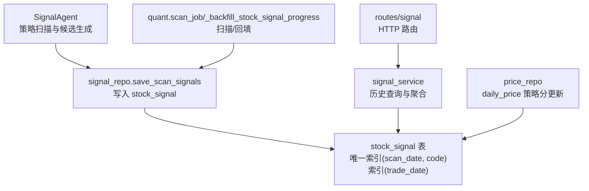
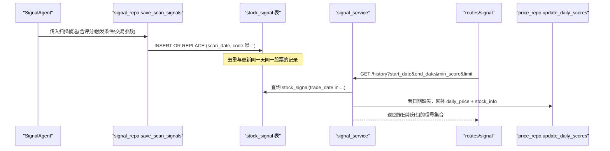
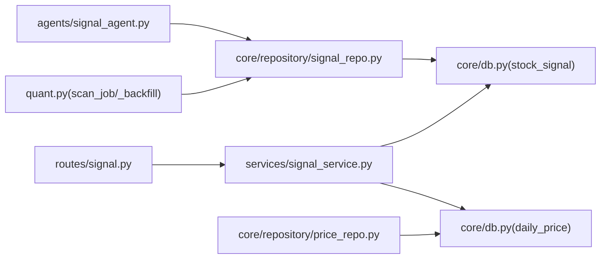

# stock_signal 策略信号表

<cite>
**本文引用的文件**
- [core/db.py](file://core/db.py)
- [core/repository/signal_repo.py](file://core/repository/signal_repo.py)
- [services/signal_service.py](file://services/signal_service.py)
- [routes/signal.py](file://routes/signal.py)
- [agents/signal_agent.py](file://agents/signal_agent.py)
- [quant.py](file://quant.py)
- [routes/system.py](file://routes/system.py)
- [strategy/strategies.py](file://strategy/strategies.py)
- [core/repository/price_repo.py](file://core/repository/price_repo.py)
</cite>

## 目录
1. [简介](#简介)
2. [项目结构与定位](#项目结构与定位)
3. [核心组件](#核心组件)
4. [架构总览](#架构总览)
5. [详细组件分析](#详细组件分析)
6. [依赖关系分析](#依赖关系分析)
7. [性能考量](#性能考量)
8. [故障排查指南](#故障排查指南)
9. [结论](#结论)
10. [附录](#附录)

## 简介
本文件围绕 stock_signal 策略信号表进行系统化文档化，目标是帮助读者全面理解该表的设计意图、字段含义、业务流程、数据流转、索引策略、查询优化、去重机制与历史数据管理。该表用于存储策略扫描产生的买卖信号记录，覆盖扫描日期、交易日期、股票代码、价格信息、各策略评分、触发条件列表、交易参数等关键字段，并通过唯一索引与常规索引保障高效查询与去重一致性。

## 项目结构与定位
stock_signal 表位于数据库层，由数据访问层负责写入与读取，服务层负责聚合与过滤，路由层对外提供查询接口，策略执行层（Agent）负责生成候选并写入该表，量化脚本负责历史回填与扫描任务调度。

图表来源
- [agents/signal_agent.py:47-108](file://agents/signal_agent.py#L47-L108)
- [core/repository/signal_repo.py:46-99](file://core/repository/signal_repo.py#L46-L99)
- [quant.py:433-546](file://quant.py#L433-L546)
- [services/signal_service.py:12-122](file://services/signal_service.py#L12-L122)
- [routes/signal.py:12-45](file://routes/signal.py#L12-L45)
- [core/repository/price_repo.py:79-92](file://core/repository/price_repo.py#L79-L92)

章节来源
- [agents/signal_agent.py:1-213](file://agents/signal_agent.py#L1-L213)
- [core/repository/signal_repo.py:1-119](file://core/repository/signal_repo.py#L1-L119)
- [services/signal_service.py:1-243](file://services/signal_service.py#L1-L243)
- [routes/signal.py:1-46](file://routes/signal.py#L1-L46)
- [quant.py:390-589](file://quant.py#L390-L589)
- [core/repository/price_repo.py:79-132](file://core/repository/price_repo.py#L79-L132)

## 核心组件
- 数据库层定义与迁移
  - 定义 stock_signal 表结构与索引
  - 历史迁移：修正唯一索引（去除 trade_date），确保唯一性基于 scan_date + code
- 数据访问层
  - 提供 save_scan_signals 将策略扫描结果写入 stock_signal
  - 使用 INSERT OR REPLACE 实现去重与更新
- 服务层
  - 提供历史查询接口，按日期范围与评分阈值聚合信号
  - 对缺失日期的信号进行回补（从 daily_price 与 stock_info 联合查询）
- 路由层
  - 提供 /history 与 /history_v4 查询端点
- 策略执行层
  - SignalAgent 运行多策略扫描，生成候选并写入 stock_signal
  - quant.scan_job 负责每日扫描与历史回填
- 策略分更新
  - price_repo.update_daily_scores 将策略分写入 daily_price，供查询回补使用

章节来源
- [core/db.py:112-136](file://core/db.py#L112-L136)
- [core/repository/signal_repo.py:46-99](file://core/repository/signal_repo.py#L46-L99)
- [services/signal_service.py:12-122](file://services/signal_service.py#L12-L122)
- [routes/signal.py:12-45](file://routes/signal.py#L12-L45)
- [agents/signal_agent.py:47-108](file://agents/signal_agent.py#L47-L108)
- [quant.py:433-546](file://quant.py#L433-L546)
- [core/repository/price_repo.py:79-92](file://core/repository/price_repo.py#L79-L92)

## 架构总览
stock_signal 的数据流从策略扫描到入库、再到查询展示，形成闭环。策略扫描生成候选，入库时以 scan_date + code 唯一约束，避免重复；查询时按 trade_date 聚合，必要时回补缺失日期的信号。

图表来源
- [agents/signal_agent.py:85-93](file://agents/signal_agent.py#L85-L93)
- [core/repository/signal_repo.py:86-98](file://core/repository/signal_repo.py#L86-L98)
- [services/signal_service.py:29-122](file://services/signal_service.py#L29-L122)
- [routes/signal.py:12-27](file://routes/signal.py#L12-L27)
- [core/repository/price_repo.py:79-92](file://core/repository/price_repo.py#L79-L92)

## 详细组件分析

### 表结构设计与字段说明
- 字段清单与类型
  - id: 自增主键
  - scan_date: 扫描日期（YYYY-MM-DD）
  - trade_date: 交易日期（YYYY-MM-DD）
  - code: 股票代码
  - name: 股票名称
  - price: 当日收盘价
  - fusion_score: 5策略融合评分
  - vol_score: 放量突破评分
  - ma_score: 均线粘合评分
  - diverge_score: 量价背离评分
  - bottom_score: 抄底评分
  - whale_score: 主力建仓评分
  - trigger_list: JSON字符串，触发条件列表
  - buy_price: 建议买入价
  - stop_loss: 止损价
  - take_profit: 止盈价
  - buy_volume: 建议买入股数
  - buy_money: 建议买入金额
  - sent_wechat: 是否推送微信（0/1）
  - created_at: 记录创建时间
- 设计要点
  - 评分字段均为数值型，便于排序与过滤
  - trigger_list 采用 JSON 存储，便于扩展触发条件
  - 交易参数（价格、数量、金额、止盈止损）直接落地，便于后续执行与风控

章节来源
- [core/db.py:112-134](file://core/db.py#L112-L134)

### 唯一索引策略
- 唯一索引：(scan_date, code)
  - 语义：同一天同一股票只保留一条记录，避免重复扫描导致的数据冗余
  - 迁移历史：早期曾包含 trade_date，现已修正为仅 (scan_date, code)，确保唯一性更贴近“扫描粒度”
- 常规索引：(trade_date)
  - 语义：加速按交易日期范围的查询与聚合
- 索引变更记录
  - 迁移步骤：删除旧索引 -> 创建新索引，保证数据一致性

章节来源
- [core/db.py:135](file://core/db.py#L135)
- [core/db.py:446-456](file://core/db.py#L446-L456)

### 插入、更新与去重机制
- 写入路径
  - SignalAgent 生成候选后调用 save_scan_signals
  - quant.scan_job 在扫描与回填场景中批量写入
  - routes/sync 历史评分补算场景写入
- 去重策略
  - 使用 INSERT OR REPLACE，依据唯一索引 (scan_date, code) 冲突时更新
  - 适用于同一天同一股票的多次扫描结果合并
- 数据清洗
  - 数值字段统一四舍五入到合适精度
  - NaN/None 统一转为 0.0
  - trigger_list 统一序列化为 JSON 字符串

章节来源
- [agents/signal_agent.py:85-93](file://agents/signal_agent.py#L85-L93)
- [quant.py:433-546](file://quant.py#L433-L546)
- [routes/sync.py:115-129](file://routes/sync.py#L115-L129)
- [core/repository/signal_repo.py:46-99](file://core/repository/signal_repo.py#L46-L99)

### 查询与聚合逻辑
- 历史查询接口
  - /history：按日期范围查询 stock_signal，过滤 fusion_score ≥ 指定阈值，排除“超跌反弹”类触发条件
  - /history_v4：查询包含“超跌反弹”的信号，按 bottom_score 等维度回补
- 聚合与回补
  - 若某些日期在 stock_signal 中缺失，则从 daily_price + stock_info 回补，补齐信号
  - 对回补信号根据策略分阈值与条件构造触发标签
- 输出结构
  - 返回按 trade_date 分组的信号列表，每条信号包含评分、触发条件、交易参数等

章节来源
- [services/signal_service.py:12-122](file://services/signal_service.py#L12-L122)
- [services/signal_service.py:125-242](file://services/signal_service.py#L125-L242)
- [routes/signal.py:12-45](file://routes/signal.py#L12-L45)

### 业务流程与数据流转
- 策略扫描
  - SignalAgent 运行多策略（放量突破、均线粘合、量价背离、抄底、主力建仓、超跌反弹）计算评分与触发条件
  - 生成候选列表并写入 stock_signal
- 数据同步
  - price_repo 将策略分写入 daily_price，供查询回补使用
- 查询展示
  - routes/signal 将请求转发至 signal_service，后者按日期聚合并回补缺失信号
- 历史回填
  - quant._backfill_stock_signal_progress 将历史评分补算结果写入 stock_signal，确保历史面板可用

章节来源
- [agents/signal_agent.py:47-108](file://agents/signal_agent.py#L47-L108)
- [strategy/strategies.py:1-200](file://strategy/strategies.py#L1-L200)
- [core/repository/price_repo.py:79-92](file://core/repository/price_repo.py#L79-L92)
- [services/signal_service.py:12-122](file://services/signal_service.py#L12-L122)
- [quant.py:390-430](file://quant.py#L390-L430)

### 字段间关联关系与复杂度分析
- 关联关系
  - stock_signal.trigger_list 与各策略评分字段相互印证，共同决定最终评分与交易参数
  - stock_signal.buy_price/stop_loss/take_profit 与 price 字段存在强关联，用于风控与执行
  - stock_signal.trade_date 与 daily_price.trade_date 用于查询回补
- 时间复杂度
  - 写入：INSERT OR REPLACE 单条记录，索引冲突时 O(log N)
  - 查询：按 trade_date 聚合，SQL 执行复杂度取决于日期跨度与记录数
  - 回补：LEFT JOIN daily_price + stock_info，复杂度与日期跨度与缺失比例相关

章节来源
- [services/signal_service.py:29-122](file://services/signal_service.py#L29-L122)
- [services/signal_service.py:125-242](file://services/signal_service.py#L125-L242)

### 查询优化方案
- 索引优化
  - 已有：(scan_date, code) 唯一索引；(trade_date) 常规索引
  - 建议：若存在高频按 code 聚合场景，可考虑 (code, trade_date) 复合索引
- SQL 优化
  - 使用 IN 子句限定日期范围，避免全表扫描
  - 对 trigger_list 的模糊匹配使用 LIKE 时注意索引利用，必要时拆分字段或建立辅助索引
- 分页与限制
  - 服务层对输出进行 limit 控制，避免一次性返回过多数据
- 数据分片
  - 若数据量持续增长，可按 trade_date 进行分区或归档

章节来源
- [core/db.py:135](file://core/db.py#L135)
- [services/signal_service.py:27-41](file://services/signal_service.py#L27-L41)
- [services/signal_service.py:142-159](file://services/signal_service.py#L142-L159)

### 信号有效性判断与去重机制
- 有效性判断
  - 评分阈值：fusion_score ≥ 指定阈值（如 15.0）
  - 触发条件：排除包含“超跌反弹”的信号（在 /history 中）
  - 回补条件：缺失日期的信号需满足策略分阈值与条件（如 bottom_score < 5）
- 去重机制
  - 唯一索引 (scan_date, code) 保证同一天同一股票仅保留一条记录
  - INSERT OR REPLACE 在冲突时更新，避免重复插入

章节来源
- [services/signal_service.py:29-41](file://services/signal_service.py#L29-L41)
- [services/signal_service.py:148-159](file://services/signal_service.py#L148-L159)
- [core/db.py:135](file://core/db.py#L135)

### 历史数据管理策略
- 历史回填
  - quant._backfill_stock_signal_progress 将历史评分补算结果写入 stock_signal，确保历史面板完整
- 数据清理
  - 服务层按日期范围查询，避免加载过久远的历史
- 任务调度
  - routes/system 检查最新行情日期与扫描完成状态，避免重复扫描与过期数据

章节来源
- [quant.py:390-430](file://quant.py#L390-L430)
- [routes/system.py:91-132](file://routes/system.py#L91-L132)

## 依赖关系分析

图表来源
- [agents/signal_agent.py:17-108](file://agents/signal_agent.py#L17-L108)
- [core/repository/signal_repo.py:9-99](file://core/repository/signal_repo.py#L9-L99)
- [core/db.py:112-136](file://core/db.py#L112-L136)
- [services/signal_service.py:12-122](file://services/signal_service.py#L12-L122)
- [routes/signal.py:12-45](file://routes/signal.py#L12-L45)
- [quant.py:433-546](file://quant.py#L433-L546)
- [core/repository/price_repo.py:79-92](file://core/repository/price_repo.py#L79-L92)

章节来源
- [agents/signal_agent.py:1-213](file://agents/signal_agent.py#L1-L213)
- [core/repository/signal_repo.py:1-119](file://core/repository/signal_repo.py#L1-L119)
- [services/signal_service.py:1-243](file://services/signal_service.py#L1-L243)
- [routes/signal.py:1-46](file://routes/signal.py#L1-L46)
- [quant.py:390-589](file://quant.py#L390-L589)
- [core/repository/price_repo.py:79-132](file://core/repository/price_repo.py#L79-L132)

## 性能考量
- 写入性能
  - 使用 executemany + INSERT OR REPLACE，批量写入提升吞吐
  - 唯一索引冲突时的更新成本较低，适合高频扫描场景
- 查询性能
  - trade_date 索引支持按日期范围快速过滤
  - 回补查询涉及 JOIN daily_price 与 stock_info，建议控制日期跨度与 limit
- 存储与维护
  - 定期检查索引使用情况，必要时重建或调整
  - 对 trigger_list 的 JSON 解析在 Python 层处理，避免数据库侧复杂逻辑

[本节为通用性能建议，无需特定文件引用]

## 故障排查指南
- 常见问题
  - 重复记录：确认唯一索引 (scan_date, code) 是否正确生效
  - 查询无结果：检查 trade_date 是否在预期范围内，是否被评分阈值过滤
  - 回补失败：确认 daily_price 是否存在对应日期与股票数据
- 定位方法
  - 查看写入日志与返回条数
  - 使用 SQL 直接查询 stock_signal/trade_date 范围内的记录
  - 检查 routes/signal 的错误响应与 traceback
- 修复建议
  - 如索引异常，执行迁移脚本重建索引
  - 调整评分阈值与日期范围参数
  - 确保 daily_price 策略分已更新

章节来源
- [routes/signal.py:23-27](file://routes/signal.py#L23-L27)
- [routes/signal.py:41-45](file://routes/signal.py#L41-L45)
- [core/db.py:446-456](file://core/db.py#L446-L456)

## 结论
stock_signal 表通过清晰的字段设计、合理的唯一索引与常规索引，实现了策略扫描结果的高效存储与查询。结合服务层的聚合与回补逻辑，能够稳定支撑历史面板与实时信号展示。建议在数据量增长后评估新增复合索引与分区策略，以进一步提升查询性能与可维护性。

[本节为总结性内容，无需特定文件引用]

## 附录

### 字段定义与类型对照
- scan_date: 文本（YYYY-MM-DD）
- trade_date: 文本（YYYY-MM-DD）
- code: 文本（股票代码）
- name: 文本（股票名称）
- price: 数值（元）
- fusion_score: 数值（评分）
- vol_score: 数值（评分）
- ma_score: 数值（评分）
- diverge_score: 数值（评分）
- bottom_score: 数值（评分）
- whale_score: 数值（评分）
- trigger_list: 文本（JSON数组字符串）
- buy_price: 数值（元）
- stop_loss: 数值（元）
- take_profit: 数值（元）
- buy_volume: 整数（股）
- buy_money: 数值（元）
- sent_wechat: 整数（0/1）
- created_at: 文本（YYYY-MM-DD HH:MM:SS）

章节来源
- [core/db.py:112-134](file://core/db.py#L112-L134)