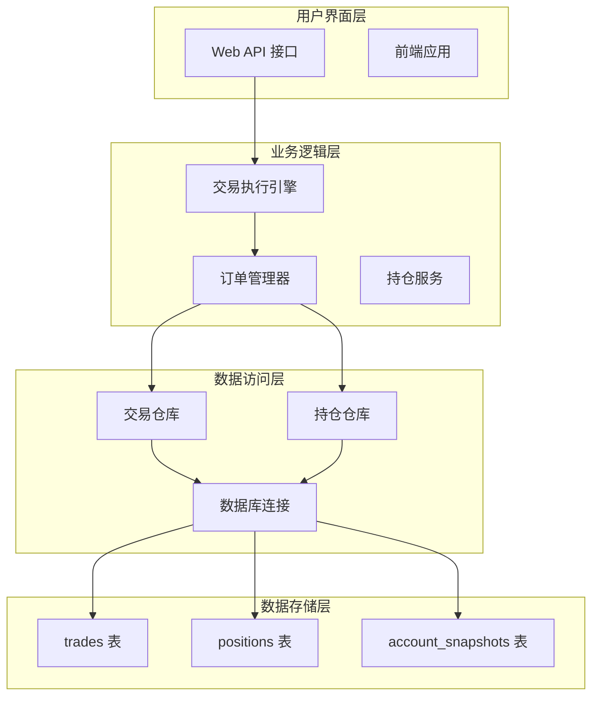
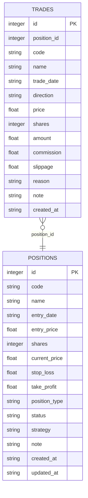
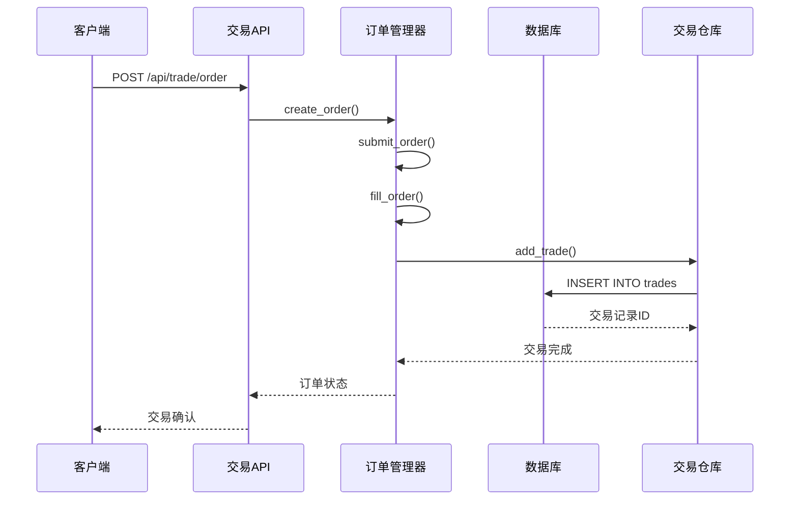
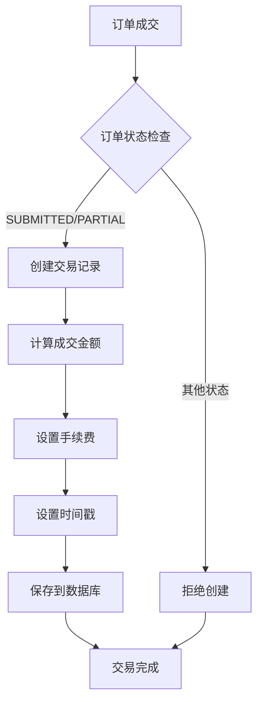
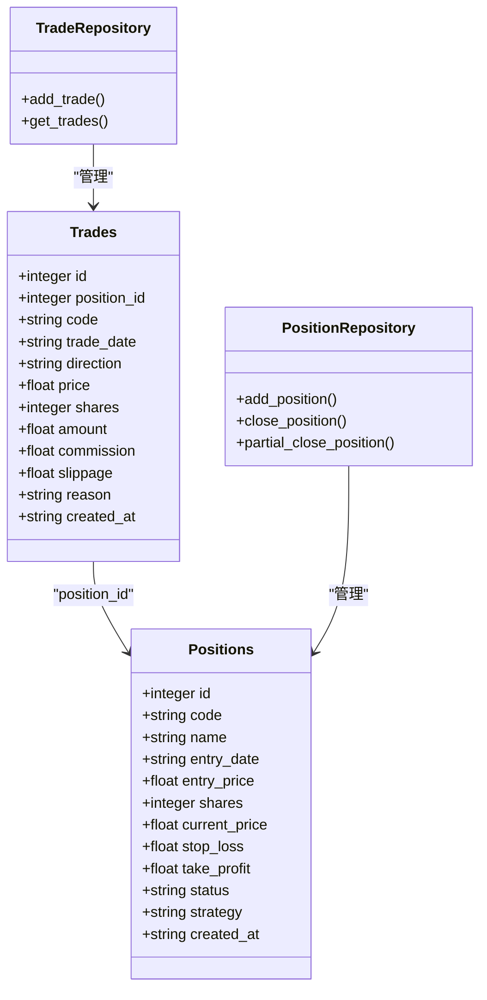
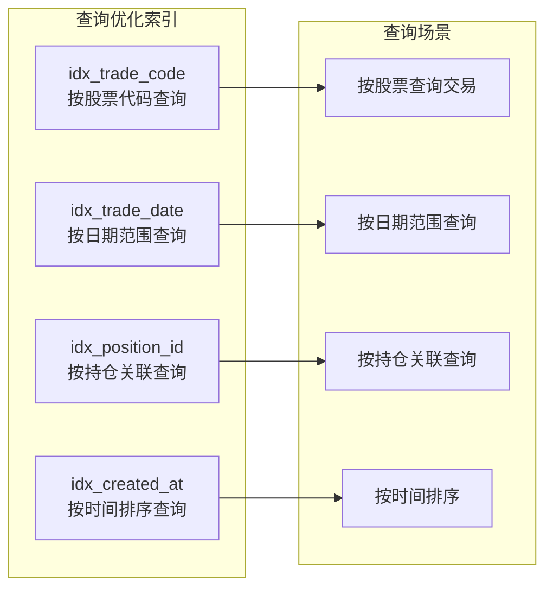
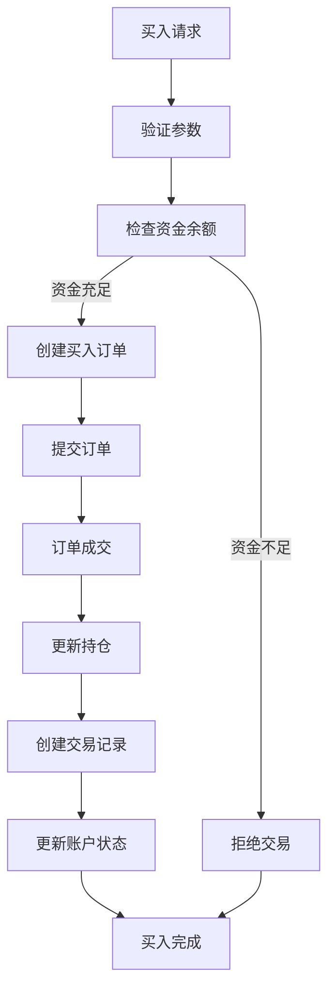
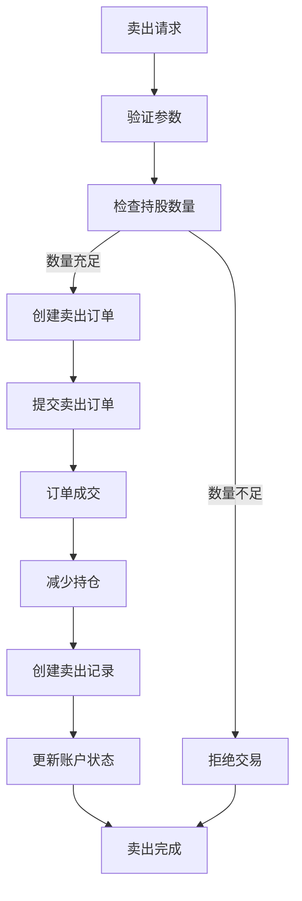
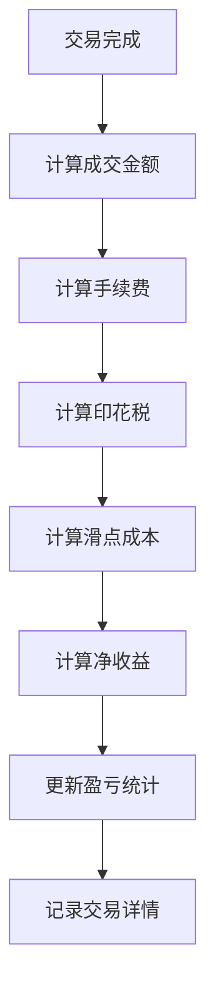
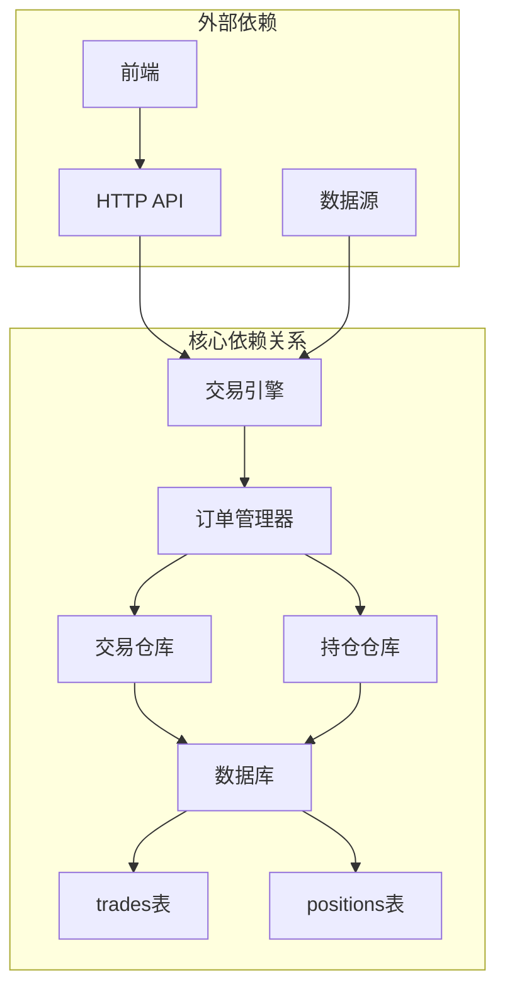

# trades 交易记录表

<cite>
**本文档引用的文件**
- [core/db.py](file://core/db.py)
- [core/repository/trade_repo.py](file://core/repository/trade_repo.py)
- [routes/trade.py](file://routes/trade.py)
- [routes/trade_execution.py](file://routes/trade_execution.py)
- [ministries/war/order_manager.py](file://ministries/war/order_manager.py)
- [services/position_service.py](file://services/position_service.py)
- [backtest/backtest.py](file://backtest/backtest.py)
- [backtest/unified_engine.py](file://backtest/unified_engine.py)
</cite>

## 目录
1. [简介](#简介)
2. [项目结构](#项目结构)
3. [核心组件](#核心组件)
4. [架构概览](#架构概览)
5. [详细组件分析](#详细组件分析)
6. [依赖关系分析](#依赖关系分析)
7. [性能考虑](#性能考虑)
8. [故障排除指南](#故障排除指南)
9. [结论](#结论)

## 简介

trades 交易记录表是 AIQuant 量化交易系统的核心数据表，用于存储所有交易执行记录。该表设计遵循金融交易数据的完整性要求，确保每笔交易都有完整的生命周期追踪。

### 主要用途
- 记录所有买卖交易的详细信息
- 支持交易回溯分析和成本核算
- 提供绩效评估的数据支撑
- 维护交易与持仓的关联关系

### 核心字段说明
- **position_id**: 关联到持仓记录的外键标识
- **code/name**: 股票代码和名称，便于快速检索
- **trade_date**: 交易日期，支持按时间维度分析
- **direction**: 交易方向（买入/卖出），区分交易类型
- **price/shares/amount**: 价格、数量和金额，构成交易价值计算基础
- **commission/slippage**: 手续费和滑点，精确计算交易成本
- **reason/note**: 交易原因和备注，提供业务上下文
- **created_at**: 记录创建时间，用于审计和排序

## 项目结构

AIQuant 项目的交易数据流采用分层架构设计，确保数据的一致性和可维护性：



**图表来源**
- [routes/trade_execution.py:1-217](file://routes/trade_execution.py#L1-L217)
- [ministries/war/order_manager.py:1-211](file://ministries/war/order_manager.py#L1-L211)
- [core/repository/trade_repo.py:1-77](file://core/repository/trade_repo.py#L1-L77)

**章节来源**
- [core/db.py:190-223](file://core/db.py#L190-L223)
- [routes/trade_execution.py:1-217](file://routes/trade_execution.py#L1-L217)

## 核心组件

### 数据表结构设计

trades 表采用 SQLite 原生支持的整数类型作为主键，确保高性能的自增和索引操作：



**图表来源**
- [core/db.py:190-208](file://core/db.py#L190-L208)
- [core/repository/position_repo.py:12-24](file://core/repository/position_repo.py#L12-L24)

### 字段详细说明

| 字段名 | 类型 | 约束 | 描述 | 使用场景 |
|--------|------|------|------|----------|
| id | INTEGER | PRIMARY KEY, AUTOINCREMENT | 主键标识 | 系统内部引用 |
| position_id | INTEGER | FOREIGN KEY | 关联持仓记录 | 交易与持仓关联 |
| code | TEXT | NOT NULL | 股票代码 | 快速检索和过滤 |
| name | TEXT |  | 股票名称 | 用户显示和报表 |
| trade_date | TEXT | NOT NULL | 交易日期 | 时间序列分析 |
| direction | TEXT | NOT NULL | 交易方向 | 买入/卖出区分 |
| price | REAL | NOT NULL | 成交价格 | 成本计算基础 |
| shares | INTEGER | NOT NULL | 成交数量 | 金额和成本计算 |
| amount | REAL |  | 成交金额 | 交易规模统计 |
| commission | REAL | DEFAULT 0 | 手续费 | 成本核算 |
| slippage | REAL | DEFAULT 0 | 滑点成本 | 性能评估 |
| reason | TEXT |  | 交易原因 | 业务分析 |
| note | TEXT |  | 备注信息 | 审计和追踪 |
| created_at | TEXT |  | 记录创建时间 | 排序和审计 |

**章节来源**
- [core/db.py:190-208](file://core/db.py#L190-L208)

## 架构概览

### 交易生命周期流程



**图表来源**
- [routes/trade_execution.py:23-58](file://routes/trade_execution.py#L23-L58)
- [ministries/war/order_manager.py:76-125](file://ministries/war/order_manager.py#L76-L125)
- [core/repository/trade_repo.py:12-24](file://core/repository/trade_repo.py#L12-L24)

### 数据一致性保证机制

系统通过以下机制确保交易数据的一致性：

1. **事务管理**: 所有数据库操作都在连接上下文中执行，自动提交或回滚
2. **外键约束**: position_id 字段确保交易与有效持仓关联
3. **索引优化**: 为高频查询字段建立复合索引
4. **数据验证**: API 层进行参数验证和业务规则检查

**章节来源**
- [core/db.py:26-39](file://core/db.py#L26-L39)
- [routes/trade_execution.py:35-42](file://routes/trade_execution.py#L35-L42)

## 详细组件分析

### 交易记录生成时机

交易记录在以下场景自动生成：

#### 1. 实时交易执行
当订单成功成交时，系统自动创建对应的交易记录：



**图表来源**
- [ministries/war/order_manager.py:102-125](file://ministries/war/order_manager.py#L102-L125)
- [core/repository/trade_repo.py:12-24](file://core/repository/trade_repo.py#L12-L24)

#### 2. 模拟交易场景
在回测和模拟环境中，系统会自动记录模拟成交：

| 场景 | 触发条件 | 生成内容 |
|------|----------|----------|
| 回测模拟 | 调用模拟成交接口 | 生成完整交易记录 |
| 实盘模拟 | 创建模拟订单 | 自动生成成交记录 |
| 批量测试 | 执行测试脚本 | 记录测试交易 |

**章节来源**
- [routes/trade_execution.py:47-52](file://routes/trade_execution.py#L47-L52)
- [backtest/backtest.py:112-119](file://backtest/backtest.py#L112-L119)

### 与持仓表的关联关系

trades 表通过 position_id 字段与 positions 表建立一对一关联关系：



**图表来源**
- [core/repository/trade_repo.py:12-37](file://core/repository/trade_repo.py#L12-L37)
- [core/repository/position_repo.py:12-74](file://core/repository/position_repo.py#L12-L74)

### 查询方法和索引优化

#### 基础查询接口

系统提供多种查询方式满足不同业务需求：

| 查询类型 | 接口路径 | 参数 | 用途 |
|----------|----------|------|------|
| 获取最新交易 | GET /api/trade/trades | code, limit | 实时监控 |
| 添加交易记录 | POST /api/trade/trades/add | 交易参数 | 手动录入 |
| 订单查询 | GET /api/trade/orders | status, limit | 订单管理 |
| 持仓查询 | GET /api/trade/positions |  | 持仓管理 |

#### 索引策略

为优化查询性能，系统建立了以下索引：



**图表来源**
- [core/db.py:207-208](file://core/db.py#L207-L208)

**章节来源**
- [core/repository/trade_repo.py:26-37](file://core/repository/trade_repo.py#L26-L37)
- [routes/trade.py:12-20](file://routes/trade.py#L12-L20)

### 买入卖出交易处理流程

#### 买入交易处理



#### 卖出交易处理



**图表来源**
- [ministries/war/order_manager.py:162-198](file://ministries/war/order_manager.py#L162-L198)
- [core/repository/position_repo.py:42-74](file://core/repository/position_repo.py#L42-L74)

**章节来源**
- [ministries/war/order_manager.py:76-125](file://ministries/war/order_manager.py#L76-L125)
- [core/repository/position_repo.py:27-74](file://core/repository/position_repo.py#L27-L74)

### 费用计算和税务处理

#### 手续费计算模型

系统采用 A 股标准费率模型：

| 项目 | 费率 | 最低收费 | 适用场景 |
|------|------|----------|----------|
| 买入手续费 | 0.0003 | ¥5.00 | 买入交易 |
| 卖出手续费 | 0.0003 | ¥5.00 | 卖出交易 |
| 卖出印花税 | 0.001 | 无 | 卖出交易 |
| 滑点成本 | 0.001 | 无 | 买卖价差 |

#### 税务处理流程



**图表来源**
- [backtest/backtest.py:112-119](file://backtest/backtest.py#L112-L119)
- [routes/trade_execution.py](file://routes/trade_execution.py#L51)

**章节来源**
- [backtest/backtest.py:112-119](file://backtest/backtest.py#L112-L119)
- [routes/trade_execution.py](file://routes/trade_execution.py#L51)

### 交易回溯分析

#### 回溯分析功能

系统提供全面的交易回溯分析能力：

| 分析维度 | 指标类型 | 计算公式 | 用途 |
|----------|----------|----------|------|
| 盈亏分析 | 绝对收益 | 卖出金额 - 买入成本 | 总体表现评估 |
| 盈亏分析 | 百分比收益 | (卖出价格/买入价格 - 1) × 100% | 收益率比较 |
| 风险控制 | 最大回撤 | (峰值 - 谷值)/峰值 | 风险评估 |
| 效率指标 | 胜率 | 盈利交易/总交易 | 策略有效性 |
| 效率指标 | 盈亏比 | 盈利总额/亏损总额 | 盈利效率 |

#### 成本核算方法

系统支持多种成本核算方式：

1. **先进先出(FIFO)**: 按时间顺序匹配买卖
2. **加权平均**: 按成本加权计算
3. **移动平均**: 实时更新持仓成本

**章节来源**
- [backtest/backtest.py:411-471](file://backtest/backtest.py#L411-L471)

### 绩效评估数据支撑

#### 关键绩效指标

系统自动计算以下关键指标：

| 指标名称 | 计算方法 | 合规标准 |
|----------|----------|----------|
| 年化收益率 | (最终资产/初始资产)^(252/交易天数) - 1 | > 15% |
| 最大回撤 | (峰值 - 谷值)/峰值 | < 20% |
| 夏普比率 | 日收益均值/日收益标准差×√252 | > 1.0 |
| 胜率 | 盈利交易数/总交易数 | > 50% |
| 盈亏比 | 盈利总额/亏损总额 | > 1.5 |

#### 数据可视化支持

系统提供多种数据可视化选项：

- 交易时间序列图
- 盈亏分布直方图  
- 累积收益曲线
- 回撤分析图

## 依赖关系分析

### 组件耦合度分析



**图表来源**
- [routes/trade_execution.py:14-21](file://routes/trade_execution.py#L14-L21)
- [ministries/war/order_manager.py:69-75](file://ministries/war/order_manager.py#L69-L75)

### 数据一致性保障

系统通过以下机制确保数据一致性：

1. **ACID事务**: 所有数据库操作都包含在事务中
2. **外键约束**: position_id 确保交易与有效持仓关联
3. **并发控制**: WAL模式支持并发读写
4. **数据校验**: API层进行参数验证

**章节来源**
- [core/db.py:26-39](file://core/db.py#L26-L39)

## 性能考虑

### 查询性能优化

#### 索引策略优化

为提高查询性能，建议重点关注以下索引：

1. **复合索引**: `(code, trade_date)` 用于股票历史查询
2. **单列索引**: `trade_date` 用于时间范围查询
3. **关联索引**: `position_id` 用于交易与持仓关联查询

#### 查询优化建议

| 查询场景 | 优化建议 | 性能提升 |
|----------|----------|----------|
| 按股票查询 | 使用 code 索引 | 10-100倍 |
| 按日期查询 | 使用 trade_date 索引 | 5-50倍 |
| 按持仓查询 | 使用 position_id 索引 | 20-200倍 |
| 排序查询 | 合理使用 LIMIT | 3-30倍 |

### 存储性能优化

#### 数据库配置优化

```sql
-- WAL模式提升并发性能
PRAGMA journal_mode=WAL;
PRAGMA synchronous=NORMAL;

-- 索引优化
CREATE INDEX IF NOT EXISTS idx_trades_code_date ON trades(code, trade_date);
CREATE INDEX IF NOT EXISTS idx_trades_position_date ON trades(position_id, trade_date);
```

#### 数据归档策略

建议实施数据归档机制：

1. **历史数据归档**: 3年前的交易数据归档到历史表
2. **压缩存储**: 使用压缩算法存储历史数据
3. **分区管理**: 按年份或季度分区存储

## 故障排除指南

### 常见问题诊断

#### 交易记录缺失

**症状**: 交易已完成但数据库中无记录

**排查步骤**:
1. 检查订单状态是否为 FILLED
2. 验证数据库连接是否正常
3. 确认事务是否正确提交

**解决方案**:
- 重启应用服务
- 检查数据库权限
- 验证网络连接稳定性

#### 数据不一致问题

**症状**: 交易记录与持仓不匹配

**排查步骤**:
1. 检查 position_id 是否正确
2. 验证交易金额计算
3. 确认手续费记录完整性

**解决方案**:
- 执行数据修复脚本
- 重建相关索引
- 清理异常数据

### 性能问题诊断

#### 查询缓慢

**症状**: 交易查询响应时间过长

**诊断工具**:
```sql
-- 分析查询计划
EXPLAIN QUERY PLAN SELECT * FROM trades WHERE code='000001';

-- 检查索引使用情况
PRAGMA index_info(idx_trades_code);
```

**优化建议**:
- 添加缺失的索引
- 优化WHERE条件
- 使用LIMIT限制结果集

**章节来源**
- [core/db.py:26-39](file://core/db.py#L26-L39)
- [core/repository/trade_repo.py:26-37](file://core/repository/trade_repo.py#L26-L37)

## 结论

trades 交易记录表作为 AIQuant 量化交易系统的核心数据基础设施，具有以下特点：

### 设计优势
1. **完整性**: 全面覆盖交易生命周期的各个环节
2. **可追溯性**: 提供完整的交易审计轨迹
3. **扩展性**: 支持多种交易类型和复杂业务场景
4. **性能**: 通过合理的索引设计确保查询效率

### 应用价值
- 为交易回溯分析提供可靠数据基础
- 支撑成本核算和绩效评估
- 满足监管合规要求
- 便于风险管理和决策支持

### 发展建议
1. **监控告警**: 建立数据质量监控机制
2. **备份策略**: 实施定期数据备份和恢复测试
3. **容量规划**: 根据业务增长制定存储扩容计划
4. **性能调优**: 持续优化查询性能和存储效率

通过完善的架构设计和严格的质量控制，trades 表能够为 AIQuant 系统提供稳定可靠的数据支撑，助力量化交易业务的持续发展。