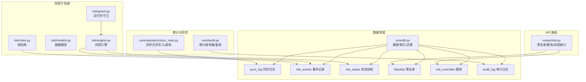
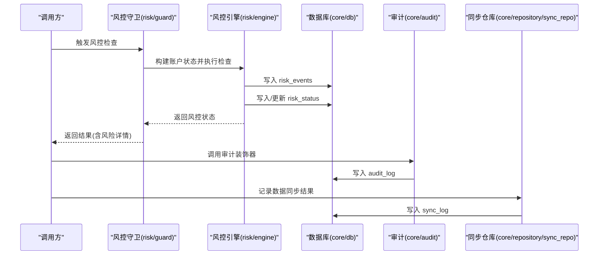
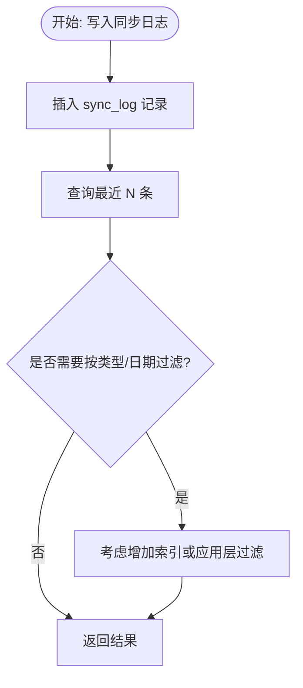
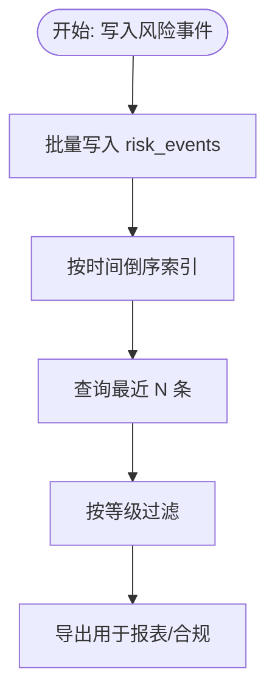
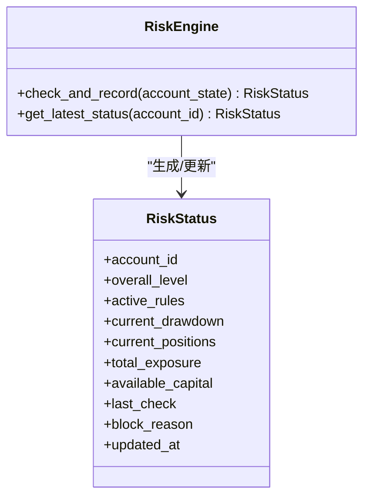
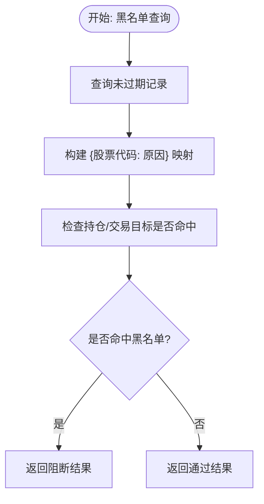
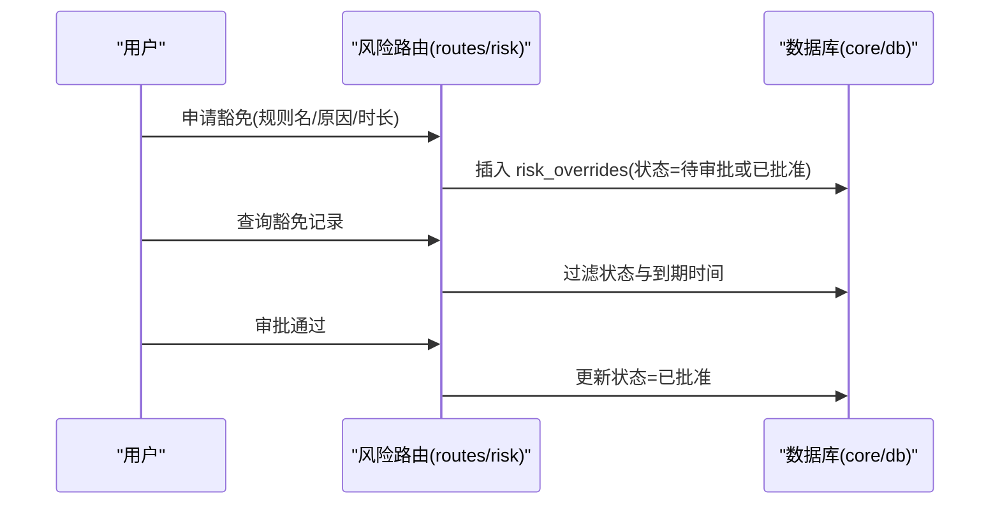
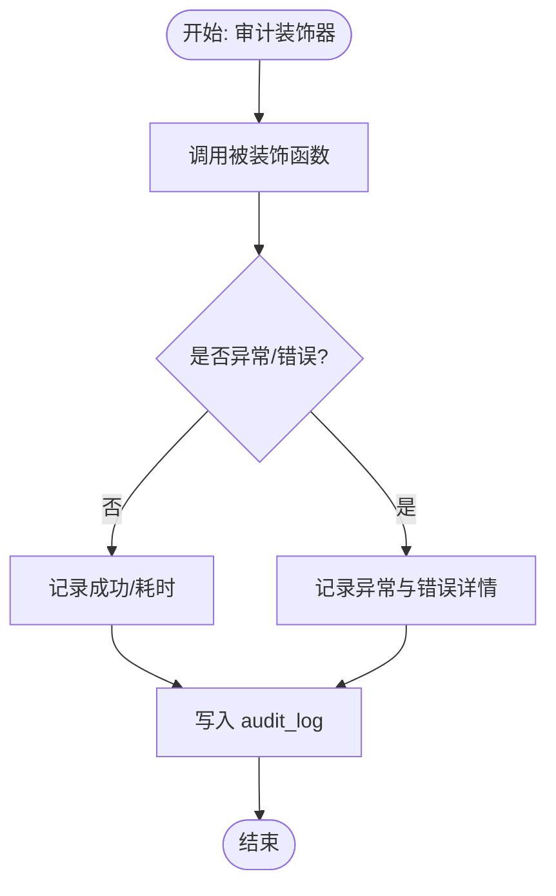
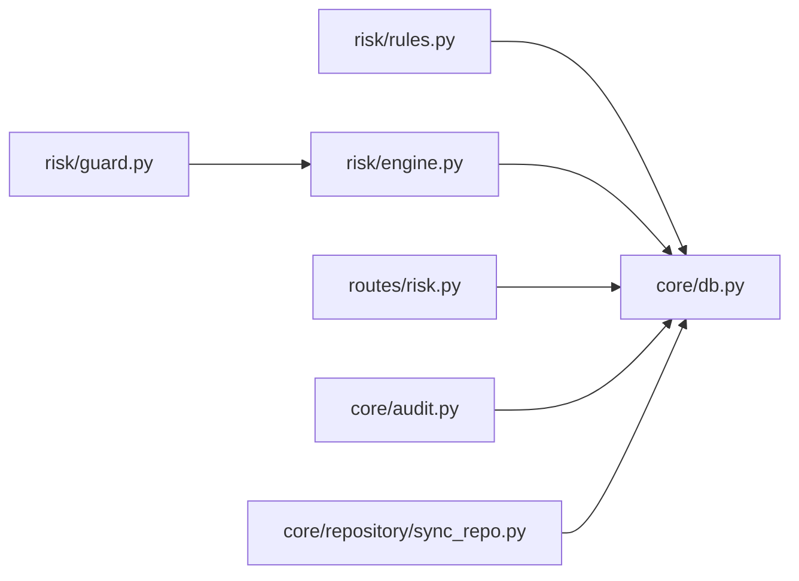

# 其他数据表

<cite>
**本文引用的文件**
- [core/db.py](file://core/db.py)
- [core/audit.py](file://core/audit.py)
- [core/repository/sync_repo.py](file://core/repository/sync_repo.py)
- [risk/engine.py](file://risk/engine.py)
- [risk/models.py](file://risk/models.py)
- [risk/guard.py](file://risk/guard.py)
- [risk/rules.py](file://risk/rules.py)
- [routes/risk.py](file://routes/risk.py)
</cite>

## 目录
1. [简介](#简介)
2. [项目结构](#项目结构)
3. [核心组件](#核心组件)
4. [架构总览](#架构总览)
5. [详细组件分析](#详细组件分析)
6. [依赖分析](#依赖分析)
7. [性能考虑](#性能考虑)
8. [故障排查指南](#故障排查指南)
9. [结论](#结论)
10. [附录](#附录)

## 简介
本文件面向“其他辅助数据表”的设计与实现，围绕以下表展开：sync_log 数据同步日志表、risk_events 风控事件记录表、risk_status 风控状态快照表、blacklist 黑名单表、risk_overrides 风控豁免表、audit_log 审计日志表。内容涵盖表结构、索引策略、查询优化、日志记录机制、审计跟踪、风控流程与合规要点，以及数据生命周期管理、归档策略与性能监控方法。

## 项目结构
这些表分布在数据库初始化脚本、风控引擎与规则、审计模块、同步仓库与风险路由中，形成“数据持久化层 + 风控引擎 + 审计日志 + 同步记录 + API 路由”的协作体系。

图表来源
- [core/db.py:57-427](file://core/db.py#L57-L427)
- [risk/engine.py:51-127](file://risk/engine.py#L51-L127)
- [risk/rules.py:334-387](file://risk/rules.py#L334-L387)
- [core/audit.py:16-146](file://core/audit.py#L16-L146)
- [core/repository/sync_repo.py:18-33](file://core/repository/sync_repo.py#L18-L33)
- [routes/risk.py:112-243](file://routes/risk.py#L112-L243)

章节来源
- [core/db.py:57-427](file://core/db.py#L57-L427)

## 核心组件
- 数据库初始化与表结构
  - 同步日志表：记录数据源同步的批次统计与耗时，便于监控与回溯。
  - 风控事件表：记录每次风控检查的明细，包括规则名、级别、指标值、阈值与建议。
  - 风控状态表：账户级风控状态快照，包含整体等级、活跃规则、头寸与可用资金等。
  - 黑名单表：记录被限制交易的股票代码、原因、有效期等。
  - 风控豁免表：记录豁免申请、审批状态、有效期与审批人。
  - 审计日志表：记录用户行为、资源、结果与时间戳，支撑审计与合规。
- 风控引擎与规则
  - 引擎负责执行规则、聚合结果、写入事件与状态，并提供查询接口。
  - 规则库内置多条风控规则，其中黑名单检查为关键阻断规则。
- 审计模块
  - 提供装饰器自动记录 API 调用的审计日志，支持按动作与用户过滤查询。
- 同步仓库
  - 统一写入与查询同步日志，便于运维侧监控数据同步健康度。
- 风控路由
  - 提供黑名单与豁免的 CRUD 接口，支持按状态过滤与到期时间查询。

章节来源
- [core/db.py:156-426](file://core/db.py#L156-L426)
- [risk/engine.py:51-167](file://risk/engine.py#L51-L167)
- [risk/rules.py:334-387](file://risk/rules.py#L334-L387)
- [core/audit.py:16-146](file://core/audit.py#L16-L146)
- [core/repository/sync_repo.py:18-33](file://core/repository/sync_repo.py#L18-L33)
- [routes/risk.py:112-243](file://routes/risk.py#L112-L243)

## 架构总览
下图展示“风控检查—事件记录—状态快照—黑名单/豁免—审计日志—同步日志”的完整链路。

图表来源
- [risk/guard.py:36-91](file://risk/guard.py#L36-L91)
- [risk/engine.py:51-127](file://risk/engine.py#L51-L127)
- [core/db.py:73-127](file://core/db.py#L73-L127)
- [core/audit.py:16-92](file://core/audit.py#L16-L92)
- [core/repository/sync_repo.py:18-26](file://core/repository/sync_repo.py#L18-L26)

## 详细组件分析

### sync_log 数据同步日志表
- 设计目的
  - 记录数据源同步批次的总量、成功数、失败数、耗时与备注，用于监控与排障。
- 结构要点
  - 关键字段：批次时间、同步类型、总量、成功数、失败数、耗时秒、备注。
  - 主键自增，便于按时间倒序查看最新批次。
- 索引策略
  - 无显式索引；按时间倒序查询常用，可考虑按批次时间建立索引以加速排序与范围查询。
- 查询优化
  - 分页查询时按主键降序取最近 N 条；避免 SELECT *，仅取必要字段。
  - 对“按类型/日期”过滤的场景，可在应用层拼装条件或增加复合索引。
- 生命周期与归档
  - 建议保留 30–90 天，超期归档至冷存储；定期清理过期记录。
- 性能监控
  - 监控失败率、平均耗时、吞吐量；异常告警阈值可按类型设定。

图表来源
- [core/repository/sync_repo.py:18-33](file://core/repository/sync_repo.py#L18-L33)
- [core/db.py:156-166](file://core/db.py#L156-L166)

章节来源
- [core/db.py:156-166](file://core/db.py#L156-L166)
- [core/repository/sync_repo.py:18-33](file://core/repository/sync_repo.py#L18-L33)

### risk_events 风控事件记录表
- 设计目的
  - 记录每次风控检查的明细，便于回溯、统计与报表生成。
- 结构要点
  - 关键字段：流水线 ID、规则名、类别、等级、消息、指标值、阈值、建议、创建时间。
  - 事件按时间倒序，便于查看最新风险事件。
- 索引策略
  - 已建立按创建时间倒序与等级的索引，满足高频查询。
- 查询优化
  - 按等级过滤、按时间范围过滤、按规则名过滤均高效；建议对“规则名+等级+时间”组合查询增加复合索引。
- 生命周期与归档
  - 建议保留 90–180 天；超期归档；保留统计口径一致的历史。
- 合规与审计
  - 事件作为风控决策证据，需确保不可篡改与可追溯。

图表来源
- [risk/engine.py:73-98](file://risk/engine.py#L73-L98)
- [core/db.py:358-372](file://core/db.py#L358-L372)

章节来源
- [core/db.py:358-372](file://core/db.py#L358-L372)
- [risk/engine.py:73-98](file://risk/engine.py#L73-L98)

### risk_status 风控状态快照表
- 设计目的
  - 账户级风控状态快照，用于实时风控拦截与状态查询。
- 结构要点
  - 关键字段：账户 ID、整体等级、活跃规则集合、当前回撤、持仓数、总敞口、可用资金、最后检查时间、阻断原因、更新时间。
  - 主键为账户 ID，支持按账户快速查询最新状态。
- 索引策略
  - 主键索引；建议对“最后检查时间”建立索引以支持按时间排序查询。
- 查询优化
  - 获取最新状态：按账户 ID 查找并按最后检查时间倒序取第一条。
  - 批量查询：可按账户 ID 列表进行 IN 查询。
- 生命周期与归档
  - 通常保留最新一次快照即可；历史快照可归档或删除以节省空间。
- 合规与审计
  - 快照作为风控决策依据，需保证一致性与可追溯性。

图表来源
- [risk/models.py:53-77](file://risk/models.py#L53-L77)
- [risk/engine.py:51-127](file://risk/engine.py#L51-L127)

章节来源
- [core/db.py:374-386](file://core/db.py#L374-L386)
- [risk/models.py:53-77](file://risk/models.py#L53-L77)
- [risk/engine.py:51-127](file://risk/engine.py#L51-L127)

### blacklist 黑名单表
- 设计目的
  - 记录被限制交易的股票代码及其原因、有效期等，风控规则可直接查询黑名单。
- 结构要点
  - 关键字段：股票代码、原因、创建者、创建时间、到期时间、移除时间。
  - 股票代码唯一，避免重复。
- 索引策略
  - 已建立到期时间索引，支持按有效期过滤有效黑名单。
- 查询优化
  - 查询有效黑名单：到期时间大于当前时间；按创建时间倒序。
  - 黑名单检查：在风控规则中按股票代码查询黑名单映射。
- 生命周期与归档
  - 到期自动失效；支持人工移除；建议保留移除记录以便审计。
- 合规与审计
  - 黑名单变更需记录操作人与审批信息，满足合规要求。

图表来源
- [routes/risk.py:112-167](file://routes/risk.py#L112-L167)
- [risk/rules.py:334-370](file://risk/rules.py#L334-L370)
- [core/db.py:388-399](file://core/db.py#L388-L399)

章节来源
- [core/db.py:388-399](file://core/db.py#L388-L399)
- [routes/risk.py:112-167](file://routes/risk.py#L112-L167)
- [risk/rules.py:334-370](file://risk/rules.py#L334-L370)

### risk_overrides 风控豁免表
- 设计目的
  - 记录风控豁免申请、审批状态、有效期与审批人，支持风控规则在有效期内临时放宽。
- 结构要点
  - 关键字段：规则名、原因、操作人、审批人、状态、创建时间、到期时间、审批时间。
  - 状态默认“待审批”，到期自动失效。
- 索引策略
  - 已建立状态与到期时间索引，支持按状态与有效期过滤。
- 查询优化
  - 获取有效豁免：到期时间大于当前时间；按状态过滤（如仅看已批准）。
  - 豁免审批：按 ID 更新状态与审批人。
- 生命周期与归档
  - 到期后自动失效；建议保留历史记录以便审计与复核。
- 合规与审计
  - 豁免需有明确原因与审批流程，审计日志应记录审批动作。

图表来源
- [routes/risk.py:172-243](file://routes/risk.py#L172-L243)
- [core/db.py:401-414](file://core/db.py#L401-L414)

章节来源
- [core/db.py:401-414](file://core/db.py#L401-L414)
- [routes/risk.py:172-243](file://routes/risk.py#L172-L243)

### audit_log 审计日志表
- 设计目的
  - 记录用户行为、资源、结果与时间戳，支撑审计与合规。
- 结构要点
  - 关键字段：用户 ID、操作类型、资源、详情、客户端 IP、创建时间。
  - 按时间倒序查询常用。
- 索引策略
  - 已建立按创建时间倒序索引；可按用户 ID、操作类型建立二级索引以支持多维过滤。
- 查询优化
  - 支持按动作与用户 ID 过滤；分页查询时注意时间范围与条件组合。
- 生命周期与归档
  - 建议保留 90–180 天；超期归档；敏感操作单独留存。
- 合规与审计
  - 审计日志需满足不可篡改与可追溯，建议采用只增不删策略。

图表来源
- [core/audit.py:41-92](file://core/audit.py#L41-L92)
- [core/db.py:416-426](file://core/db.py#L416-L426)

章节来源
- [core/db.py:416-426](file://core/db.py#L416-L426)
- [core/audit.py:16-146](file://core/audit.py#L16-L146)

## 依赖分析
- 组件耦合
  - 风控引擎依赖数据库写入事件与状态；规则库依赖黑名单查询；路由依赖数据库查询黑名单与豁免。
  - 审计模块独立于风控，但被业务调用方广泛使用。
  - 同步仓库与数据库层解耦，通过连接管理封装访问。
- 外部依赖
  - 使用 SQLite 本地数据库，无需外部服务依赖。
- 循环依赖
  - 未发现循环依赖；模块职责清晰。

图表来源
- [risk/rules.py:334-387](file://risk/rules.py#L334-L387)
- [risk/engine.py:73-127](file://risk/engine.py#L73-L127)
- [risk/guard.py:36-91](file://risk/guard.py#L36-L91)
- [routes/risk.py:112-243](file://routes/risk.py#L112-L243)
- [core/audit.py:16-92](file://core/audit.py#L16-L92)
- [core/repository/sync_repo.py:18-33](file://core/repository/sync_repo.py#L18-L33)
- [core/db.py:57-427](file://core/db.py#L57-L427)

章节来源
- [risk/rules.py:334-387](file://risk/rules.py#L334-L387)
- [risk/engine.py:73-127](file://risk/engine.py#L73-L127)
- [risk/guard.py:36-91](file://risk/guard.py#L36-L91)
- [routes/risk.py:112-243](file://routes/risk.py#L112-L243)
- [core/audit.py:16-92](file://core/audit.py#L16-L92)
- [core/repository/sync_repo.py:18-33](file://core/repository/sync_repo.py#L18-L33)
- [core/db.py:57-427](file://core/db.py#L57-L427)

## 性能考虑
- 索引与查询
  - 风控事件与审计日志已具备关键索引；建议对“规则名+等级+时间”、“状态+到期时间”等组合查询增加复合索引。
- 写入路径
  - 风控事件批量写入；建议分批提交，避免长事务。
  - 同步日志写入简单，建议异步化或合并写入以降低锁竞争。
- 读取路径
  - 风控状态按账户 ID 查询；建议缓存热点账户状态以减少数据库压力。
  - 黑名单与豁免查询频繁，建议在应用层缓存有效映射。
- 存储与归档
  - 建议对历史数据进行分区或归档，定期清理过期记录。
- 监控指标
  - 记录写入延迟、查询 QPS、慢查询、索引命中率与数据库大小增长趋势。

## 故障排查指南
- 风控事件缺失
  - 检查风控引擎写入逻辑与数据库连接；确认异常捕获与日志输出。
  - 核对规则启用状态与阈值配置。
- 风控状态不更新
  - 检查状态写入语句与账户 ID；确认最新状态查询逻辑。
- 黑名单不生效
  - 检查黑名单查询 SQL 是否过滤了到期记录；确认规则中黑名单映射构建是否正确。
- 豁免未生效
  - 检查状态与到期时间过滤；确认审批流程与状态更新。
- 审计日志异常
  - 检查装饰器包裹范围与异常处理；确认数据库写入权限。
- 同步日志异常
  - 检查写入参数与连接；确认查询分页与排序。

章节来源
- [risk/engine.py:73-127](file://risk/engine.py#L73-L127)
- [routes/risk.py:112-243](file://routes/risk.py#L112-L243)
- [core/audit.py:16-92](file://core/audit.py#L16-L92)
- [core/repository/sync_repo.py:18-33](file://core/repository/sync_repo.py#L18-L33)

## 结论
上述辅助数据表构成了系统可观测、可审计、可治理的关键基础设施。通过规范的表结构、合理的索引与查询优化、完善的生命周期管理与合规审计，系统能够在高并发与复杂风控场景下保持稳定与透明。建议持续监控关键指标，定期评估索引效果与数据归档策略，确保系统长期健康运行。

## 附录
- 常用查询示例（路径参考）
  - 查询最近 N 条同步日志：[core/repository/sync_repo.py:28-33](file://core/repository/sync_repo.py#L28-L33)
  - 查询最近风控事件：[risk/engine.py:155-167](file://risk/engine.py#L155-L167)
  - 查询最新风控状态：[risk/engine.py:129-153](file://risk/engine.py#L129-L153)
  - 查询有效黑名单：[routes/risk.py:112-126](file://routes/risk.py#L112-L126)
  - 申请/审批豁免：[routes/risk.py:172-243](file://routes/risk.py#L172-L243)
  - 记录审计日志（装饰器）：[core/audit.py:41-92](file://core/audit.py#L41-L92)