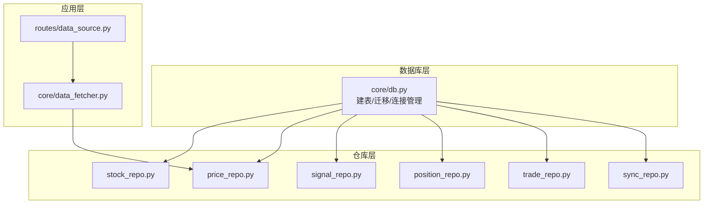
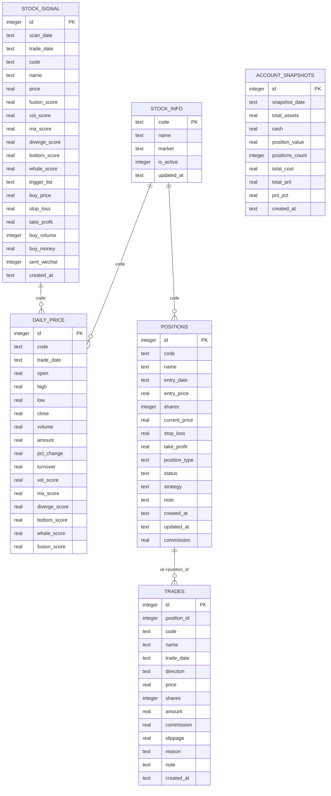
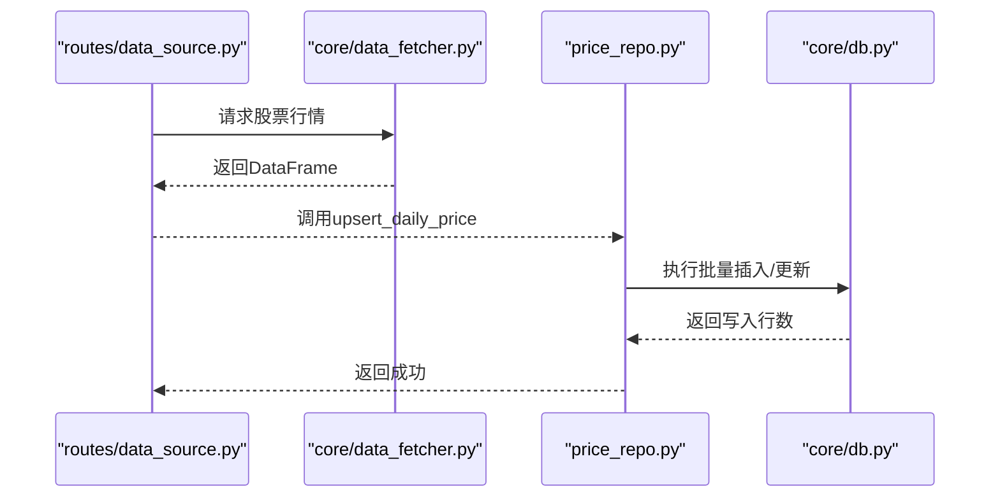

# 核心数据表

<cite>
**本文引用的文件**
- [core/db.py](file://core/db.py)
- [core/repository/stock_repo.py](file://core/repository/stock_repo.py)
- [core/repository/price_repo.py](file://core/repository/price_repo.py)
- [core/repository/signal_repo.py](file://core/repository/signal_repo.py)
- [core/repository/position_repo.py](file://core/repository/position_repo.py)
- [core/repository/trade_repo.py](file://core/repository/trade_repo.py)
- [core/repository/sync_repo.py](file://core/repository/sync_repo.py)
- [core/data_fetcher.py](file://core/data_fetcher.py)
- [routes/data_source.py](file://routes/data_source.py)
</cite>

## 目录
1. [简介](#简介)
2. [项目结构](#项目结构)
3. [核心组件](#核心组件)
4. [架构总览](#架构总览)
5. [详细组件分析](#详细组件分析)
6. [依赖分析](#依赖分析)
7. [性能考虑](#性能考虑)
8. [故障排查指南](#故障排查指南)
9. [结论](#结论)
10. [附录](#附录)

## 简介
本文件面向AIQuant项目的核心数据表，系统性梳理以下关键表的结构设计、字段定义、约束与索引、业务用途、数据来源与更新机制，并给出表间关系与外键约束说明。重点覆盖：
- stock_info：股票基本信息
- daily_price：日线行情与策略评分
- stock_signal：策略扫描推荐
- positions：持仓记录
- trades：交易记录
- account_snapshots：账户资产快照

同时提供表创建语句示例与索引策略建议，帮助开发者与运维人员快速理解与维护数据库层。

## 项目结构
数据库层采用SQLite本地文件数据库，核心建表与迁移逻辑集中在数据库模块中；各表的读写通过对应的Repository层封装，统一对外暴露简洁的函数接口，便于上层业务调用。

图表来源
- [core/db.py:57-466](file://core/db.py#L57-L466)
- [core/repository/stock_repo.py:13-80](file://core/repository/stock_repo.py#L13-L80)
- [core/repository/price_repo.py:13-237](file://core/repository/price_repo.py#L13-L237)
- [core/repository/signal_repo.py:14-119](file://core/repository/signal_repo.py#L14-L119)
- [core/repository/position_repo.py:12-138](file://core/repository/position_repo.py#L12-L138)
- [core/repository/trade_repo.py:12-77](file://core/repository/trade_repo.py#L12-L77)
- [core/repository/sync_repo.py:18-55](file://core/repository/sync_repo.py#L18-L55)
- [routes/data_source.py:25-111](file://routes/data_source.py#L25-L111)
- [core/data_fetcher.py:173-223](file://core/data_fetcher.py#L173-L223)

章节来源
- [core/db.py:57-466](file://core/db.py#L57-L466)
- [core/repository/stock_repo.py:13-80](file://core/repository/stock_repo.py#L13-L80)
- [core/repository/price_repo.py:13-237](file://core/repository/price_repo.py#L13-L237)
- [core/repository/signal_repo.py:14-119](file://core/repository/signal_repo.py#L14-L119)
- [core/repository/position_repo.py:12-138](file://core/repository/position_repo.py#L12-L138)
- [core/repository/trade_repo.py:12-77](file://core/repository/trade_repo.py#L12-L77)
- [core/repository/sync_repo.py:18-55](file://core/repository/sync_repo.py#L18-L55)
- [routes/data_source.py:25-111](file://routes/data_source.py#L25-L111)
- [core/data_fetcher.py:173-223](file://core/data_fetcher.py#L173-L223)

## 核心组件
- stock_info：存储股票基础信息，主键为code，包含是否活跃、更新时间等字段。
- daily_price：存储日线行情与策略评分，联合唯一索引(code, trade_date)，并建立常用查询索引。
- stock_signal：存储策略扫描推荐结果，联合唯一索引(scan_date, code)，并按交易日建立索引。
- positions：存储持仓记录，包含入场价、数量、止盈止损、策略、状态等。
- trades：存储交易执行明细，关联positions表的position_id。
- account_snapshots：存储每日账户资产快照，按snapshot_date建立索引。

章节来源
- [core/db.py:62-223](file://core/db.py#L62-L223)

## 架构总览
下图展示核心表之间的关系与外键约束（基于表结构与使用场景推导）：

图表来源
- [core/db.py:62-223](file://core/db.py#L62-L223)

## 详细组件分析

### stock_info 股票基本信息表
- 字段定义与类型
  - code：文本，主键，唯一标识股票
  - name：文本，股票名称
  - market：文本，交易所或市场标识
  - is_active：整型，是否有效（1/0），默认1
  - updated_at：文本，更新时间戳
- 约束与索引
  - 主键：code
  - 无显式唯一索引（主键即唯一）
- 业务用途
  - 记录股票基础元数据，作为其他表的上游参考
- 数据来源与更新机制
  - 由数据获取模块批量写入/更新，支持ON CONFLICT(code) DO UPDATE
  - 支持批量更新总股本、流通股本字段
- 字段含义与规则
  - code为主键，确保唯一性
  - is_active用于过滤无效股票
  - updated_at用于追踪最后更新时间
- 索引策略
  - 主键索引已由SQLite自动维护
  - 若按名称检索，可考虑增加(name)索引（当前未见该索引）

章节来源
- [core/db.py:62-69](file://core/db.py#L62-L69)
- [core/repository/stock_repo.py:13-80](file://core/repository/stock_repo.py#L13-L80)

### daily_price 日线行情表
- 字段定义与类型
  - id：自增主键
  - code：文本，股票代码
  - trade_date：文本，交易日
  - open/high/low/close：实数，OHLC
  - volume/amount：实数，成交量、成交额
  - pct_change：实数，涨跌幅
  - turnover：实数，换手率
  - vol_score/ma_score/diverge_score/bottom_score/whale_score/fusion_score：实数，策略评分（默认0）
- 约束与索引
  - 唯一索引：(code, trade_date)
  - 查询索引：idx_daily_code_date(code, trade_date)、idx_daily_date(trade_date)
- 业务用途
  - 存储日线行情与策略评分，支撑回测、指标计算与信号生成
- 数据来源与更新机制
  - 通过数据获取模块拉取并批量写入，支持ON CONFLICT(code, trade_date) DO UPDATE
  - 策略评分通过独立批处理更新接口写入
- 字段含义与规则
  - code+trade_date唯一，避免重复写入
  - 策略评分字段用于策略融合与筛选
- 索引策略
  - 联合索引(code, trade_date)用于去重与快速定位
  - 按日期查询的索引用于范围查询优化

章节来源
- [core/db.py:71-93](file://core/db.py#L71-L93)
- [core/repository/price_repo.py:13-237](file://core/repository/price_repo.py#L13-L237)

### stock_signal 策略信号表
- 字段定义与类型
  - id：自增主键
  - scan_date：文本，扫描日期
  - trade_date：文本，交易日
  - code/name/price：文本/实数，标的、名称、价格
  - fusion_score/vol_score/ma_score/diverge_score/bottom_score/whale_score：实数，策略评分
  - trigger_list：文本，JSON字符串，触发策略列表
  - buy_price/stop_loss/take_profit：实数，目标价与风控参数
  - buy_volume/buy_money：整数/实数，买入数量与金额
  - sent_wechat：整型，是否推送微信
  - created_at：文本，创建时间
- 约束与索引
  - 唯一索引：(scan_date, code)
  - 查询索引：idx_sig_trade_date(trade_date)
- 业务用途
  - 存储每日策略扫描推荐，供交易决策与风控使用
- 数据来源与更新机制
  - 通过扫描流程写入，使用INSERT OR REPLACE保证同一天同一标的唯一
- 字段含义与规则
  - scan_date+code唯一，确保同一天不重复
  - trigger_list为JSON数组字符串，便于后续解析
- 索引策略
  - 唯一索引保证幂等写入
  - 按交易日查询索引用于快速筛选当日信号

章节来源
- [core/db.py:112-136](file://core/db.py#L112-L136)
- [core/repository/signal_repo.py:46-119](file://core/repository/signal_repo.py#L46-L119)

### positions 持仓记录表
- 字段定义与类型
  - id：自增主键
  - code/name/entry_date/entry_price/shares：文本/实数，标的、名称、入场日期、入场价、数量
  - current_price：实数，当前价（用于浮盈计算）
  - stop_loss/take_profit：实数，止盈止损
  - position_type：文本，多空类型（默认long）
  - status：文本，状态（默认holding）
  - strategy：文本，策略名称
  - note：文本，备注
  - created_at/updated_at：文本，创建与更新时间
  - commission：实数，默认0
- 约束与索引
  - 无显式唯一索引
  - 查询索引：idx_position_code(code)、idx_position_status(status)
- 业务用途
  - 记录当前持有头寸，支持平仓、部分平仓与实时估值
- 数据来源与更新机制
  - 通过交易执行后写入，支持按ID/代码查询与汇总统计
- 字段含义与规则
  - status控制是否计入当前持仓
  - current_price用于动态估值
- 索引策略
  - 按code与status查询的索引有助于快速筛选

章节来源
- [core/db.py:168-189](file://core/db.py#L168-L189)
- [core/repository/position_repo.py:12-138](file://core/repository/position_repo.py#L12-L138)

### trades 交易记录表
- 字段定义与类型
  - id：自增主键
  - position_id：整数，关联positions表
  - code/name/trade_date/direction：文本，标的、名称、交易日、方向（买/卖）
  - price/shares/amount：实数，成交价、数量、金额
  - commission/slippage：实数，默认0
  - reason/note：文本，原因与备注
  - created_at：文本，创建时间
- 约束与索引
  - 无显式唯一索引
  - 查询索引：idx_trade_code(code)、idx_trade_date(trade_date)
- 业务用途
  - 记录实际成交明细，用于回测与报表
- 数据来源与更新机制
  - 交易执行后写入，支持按标的与日期查询
- 字段含义与规则
  - amount=price*shares
  - position_id用于与持仓关联
- 索引策略
  - 按code与trade_date查询的索引提升检索效率

章节来源
- [core/db.py:190-209](file://core/db.py#L190-L209)
- [core/repository/trade_repo.py:12-77](file://core/repository/trade_repo.py#L12-L77)

### account_snapshots 账户资产快照表
- 字段定义与类型
  - id：自增主键
  - snapshot_date：文本，快照日期
  - total_assets/cash/position_value/positions_count：实数/整数，总资产、现金、持仓市值、持仓数量
  - total_cost/total_pnl/pnl_pct：实数，总成本、总盈亏、盈亏比例
  - created_at：文本，创建时间
- 约束与索引
  - 无显式唯一索引
  - 查询索引：idx_snapshot_date(snapshot_date)
- 业务用途
  - 记录每日账户资产状况，用于收益曲线与风控监控
- 数据来源与更新机制
  - 通过计算后写入，若当天已存在则更新
- 字段含义与规则
  - 以snapshot_date作为日粒度快照键
- 索引策略
  - 按日期查询的索引便于历史回溯

章节来源
- [core/db.py:210-223](file://core/db.py#L210-L223)
- [core/repository/trade_repo.py:42-77](file://core/repository/trade_repo.py#L42-L77)

## 依赖分析
- 表间关系与外键约束
  - stock_info 与 daily_price：code关联，stock_info为主表
  - stock_info 与 positions：code关联，positions为子表
  - positions 与 trades：id->position_id关联，trades为子表
  - stock_signal 与 daily_price：code关联，用于信号与行情对齐
- 仓库层依赖
  - 各仓库函数通过统一连接管理器获取数据库连接
  - 仓库层封装了SQL细节，上层仅需调用函数即可完成读写
- 数据流
  - 数据获取模块负责从外部数据源拉取行情与基础信息
  - 仓库层负责写入数据库
  - 业务层通过仓库接口读取与统计

图表来源
- [routes/data_source.py:89-111](file://routes/data_source.py#L89-L111)
- [core/data_fetcher.py:173-223](file://core/data_fetcher.py#L173-L223)
- [core/repository/price_repo.py:13-47](file://core/repository/price_repo.py#L13-L47)
- [core/db.py:543-578](file://core/db.py#L543-L578)

章节来源
- [core/db.py:57-466](file://core/db.py#L57-L466)
- [core/repository/price_repo.py:13-237](file://core/repository/price_repo.py#L13-L237)
- [routes/data_source.py:25-111](file://routes/data_source.py#L25-L111)
- [core/data_fetcher.py:173-223](file://core/data_fetcher.py#L173-L223)

## 性能考虑
- 索引策略
  - daily_price：(code, trade_date)唯一索引 + (trade_date)索引，满足去重与按日期查询
  - stock_signal：(scan_date, code)唯一索引 + (trade_date)索引，满足幂等与按日筛选
  - positions/trades/account_snapshots：按code/status/date建立索引，提升查询效率
- 并发与事务
  - 连接管理启用WAL模式与NORMAL同步级别，兼顾性能与可靠性
  - 仓库层使用上下文管理器自动提交/回滚，避免长事务
- 批量写入
  - 使用executemany与ON CONFLICT DO UPDATE减少往返与锁竞争
- 数据类型
  - 数值字段统一为REAL，文本字段为TEXT，保持一致性与可读性

[本节为通用性能建议，不直接分析具体文件]

## 故障排查指南
- 常见问题
  - 重复写入导致的唯一约束冲突：确认是否使用了ON CONFLICT或INSERT OR REPLACE
  - 日期格式不一致：统一YYYY-MM-DD格式，避免索引失效
  - 未建立必要索引导致查询慢：按查询模式补充索引
- 排查步骤
  - 检查数据库连接与权限
  - 核对表结构与索引是否存在
  - 使用仓库层提供的统计接口查看数据概况
- 相关接口
  - 数据库状态统计：db_stats
  - 同步日志：log_sync/get_sync_logs
  - 最新日期查询：get_latest_date/get_latest_date_all

章节来源
- [core/repository/sync_repo.py:18-55](file://core/repository/sync_repo.py#L18-L55)
- [core/db.py:921-939](file://core/db.py#L921-L939)

## 结论
本文档系统梳理了AIQuant核心数据表的结构设计、字段定义、约束与索引、业务用途与数据流。通过仓库层抽象，上层业务可专注于策略与交易逻辑，而数据库层承担稳定的持久化职责。建议在生产环境中持续关注索引命中率与查询计划，结合业务查询模式进一步优化索引策略。

[本节为总结性内容，不直接分析具体文件]

## 附录

### 表创建语句示例（基于仓库层建表脚本）
- stock_info
  - 创建语句：参见建表脚本中的CREATE TABLE IF NOT EXISTS stock_info(...)
  - 约束：PRIMARY KEY(code)
- daily_price
  - 创建语句：参见建表脚本中的CREATE TABLE IF NOT EXISTS daily_price(...)
  - 约束：UNIQUE(code, trade_date)
  - 索引：idx_daily_code_date(code, trade_date); idx_daily_date(trade_date)
- stock_signal
  - 创建语句：参见建表脚本中的CREATE TABLE IF NOT EXISTS stock_signal(...)
  - 约束：UNIQUE(scan_date, code)
  - 索引：idx_sig_scan_trade_code(scan_date, code); idx_sig_trade_date(trade_date)
- positions
  - 创建语句：参见建表脚本中的CREATE TABLE IF NOT EXISTS positions(...)
  - 约束：无显式唯一索引
  - 索引：idx_position_code(code); idx_position_status(status)
- trades
  - 创建语句：参见建表脚本中的CREATE TABLE IF NOT EXISTS trades(...)
  - 约束：无显式唯一索引
  - 索引：idx_trade_code(code); idx_trade_date(trade_date)
- account_snapshots
  - 创建语句：参见建表脚本中的CREATE TABLE IF NOT EXISTS account_snapshots(...)
  - 约束：无显式唯一索引
  - 索引：idx_snapshot_date(snapshot_date)

章节来源
- [core/db.py:62-223](file://core/db.py#L62-L223)

### 数据来源与更新机制
- 数据来源
  - 股票列表与基础信息：通过数据获取模块从外部数据源抓取并写入stock_info
  - 日线行情：通过数据获取模块拉取并写入daily_price，支持前复权
  - 策略信号：通过策略扫描流程写入stock_signal
  - 持仓与交易：通过交易执行流程写入positions与trades
  - 账户快照：通过计算流程写入account_snapshots
- 更新机制
  - 批量写入：使用executemany与ON CONFLICT/INSERT OR REPLACE保证幂等
  - 策略评分：单独的批处理接口更新daily_price中的评分字段
  - 日期校验：提供latest_date、has_today_data等工具函数辅助调度

章节来源
- [core/data_fetcher.py:173-223](file://core/data_fetcher.py#L173-L223)
- [core/repository/price_repo.py:13-237](file://core/repository/price_repo.py#L13-L237)
- [core/repository/signal_repo.py:46-119](file://core/repository/signal_repo.py#L46-L119)
- [core/repository/position_repo.py:12-138](file://core/repository/position_repo.py#L12-L138)
- [core/repository/trade_repo.py:12-77](file://core/repository/trade_repo.py#L12-L77)
- [core/db.py:543-578](file://core/db.py#L543-L578)