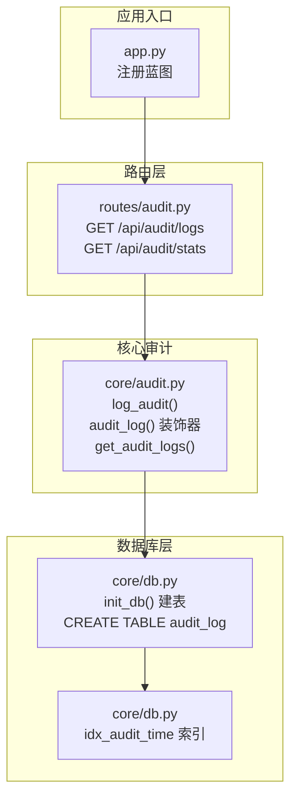
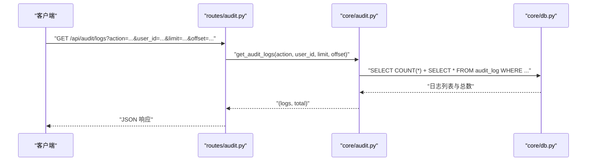
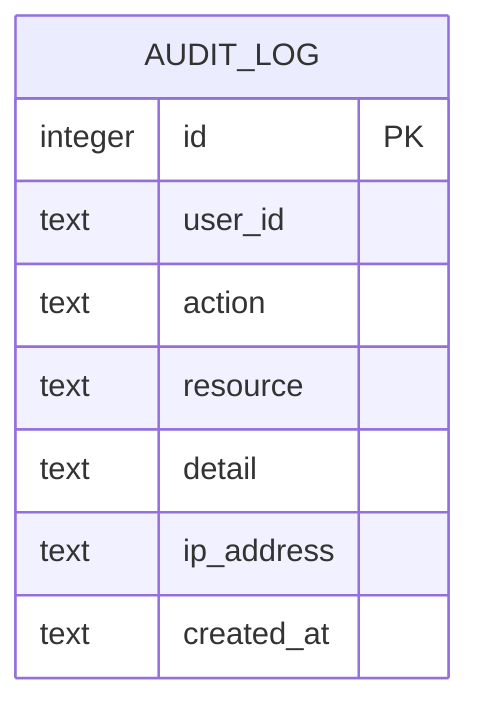
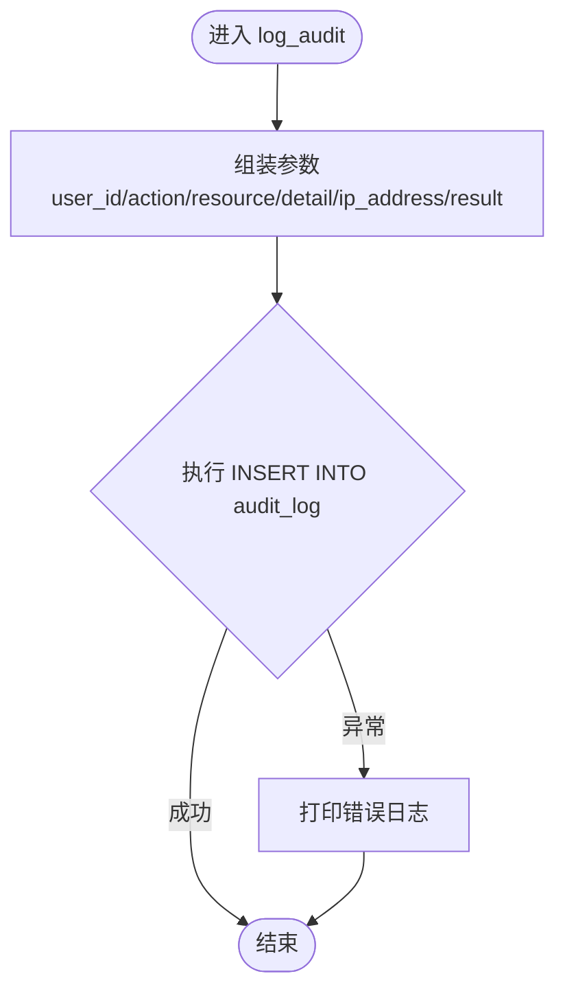
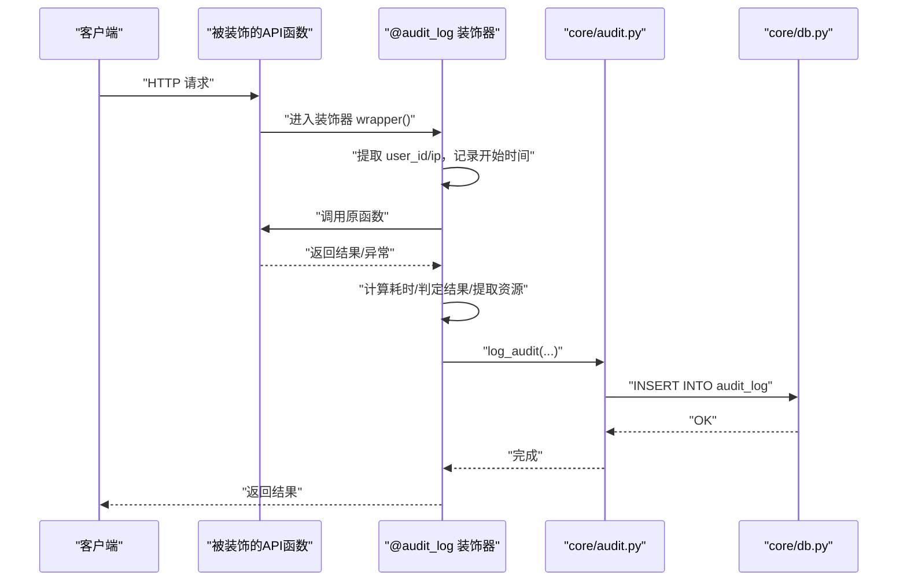
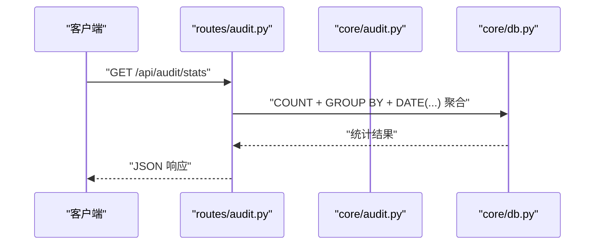

# 审计日志表

<cite>
**本文引用的文件**
- [core/db.py](file://core/db.py)
- [core/audit.py](file://core/audit.py)
- [routes/audit.py](file://routes/audit.py)
- [app.py](file://app.py)
</cite>

## 目录
1. [简介](#简介)
2. [项目结构](#项目结构)
3. [核心组件](#核心组件)
4. [架构总览](#架构总览)
5. [详细组件分析](#详细组件分析)
6. [依赖关系分析](#依赖关系分析)
7. [性能考量](#性能考量)
8. [故障排查指南](#故障排查指南)
9. [结论](#结论)
10. [附录](#附录)

## 简介
本文件面向AIQuant系统的审计日志表（audit_log），系统性说明其表结构设计、字段语义、在系统中的作用与价值，并提供插入审计日志的使用示例、查询与分析方法，以及如何基于审计日志进行安全监控与违规检测。审计日志是保障系统安全性与合规性的关键基础设施，通过对用户操作行为进行可追溯、可分析的记录，支撑风险治理、合规审计与安全运营。

## 项目结构
审计日志相关能力由三层组成：
- 数据库层：负责建表与索引，确保审计日志持久化与高效查询
- 核心审计模块：提供统一的日志记录与查询接口，包含装饰器自动记录API调用
- 路由层：对外暴露审计日志查询与统计接口

图表来源
- [app.py:57](file://app.py#L57)
- [routes/audit.py:13](file://routes/audit.py#L13)
- [core/audit.py:16](file://core/audit.py#L16)
- [core/audit.py:107](file://core/audit.py#L107)
- [core/db.py:416](file://core/db.py#L416)
- [core/db.py:426](file://core/db.py#L426)

章节来源
- [app.py:57](file://app.py#L57)
- [routes/audit.py:13](file://routes/audit.py#L13)
- [core/audit.py:16](file://core/audit.py#L16)
- [core/audit.py:107](file://core/audit.py#L107)
- [core/db.py:416](file://core/db.py#L416)
- [core/db.py:426](file://core/db.py#L426)

## 核心组件
- 审计日志表（audit_log）
  - 字段：id、user_id、action、resource、detail、ip_address、created_at
  - 索引：按 created_at 倒序索引，便于时间序列查询
- 日志记录函数（log_audit）
  - 提供显式插入审计日志的能力，支持传入用户ID、操作类型、资源、详情、IP与结果
- 装饰器（audit_log）
  - 自动包装API函数，记录请求耗时、结果状态、提取资源标识并落库
- 日志查询（get_audit_logs）
  - 支持按 action 与 user_id 过滤、分页与总数统计
- 路由接口（/api/audit/logs、/api/audit/stats）
  - 对外提供审计日志查询与统计接口

章节来源
- [core/db.py:416](file://core/db.py#L416)
- [core/db.py:426](file://core/db.py#L426)
- [core/audit.py:16](file://core/audit.py#L16)
- [core/audit.py:41](file://core/audit.py#L41)
- [core/audit.py:107](file://core/audit.py#L107)
- [routes/audit.py:16](file://routes/audit.py#L16)
- [routes/audit.py:41](file://routes/audit.py#L41)

## 架构总览
审计日志贯穿“路由层-核心审计-数据库层”，形成闭环：
- 路由层接收外部请求，调用核心审计模块
- 核心审计模块解析请求上下文（用户ID、IP）、计算耗时与结果状态，构造日志并写入数据库
- 数据库层提供建表与索引，保证高并发写入与高效查询

图表来源
- [routes/audit.py:16](file://routes/audit.py#L16)
- [routes/audit.py:24](file://routes/audit.py#L24)
- [core/audit.py:107](file://core/audit.py#L107)
- [core/db.py:416](file://core/db.py#L416)

## 详细组件分析

### 审计日志表结构与字段语义
- id：自增主键，用于唯一标识每条审计记录
- user_id：操作人标识，匿名或系统默认值由核心逻辑填充
- action：操作类型，建议采用“模块.动作”命名规范，例如 trade.buy、risk.override、config.update
- resource：操作对象标识，如股票代码、配置项名、订单号等；装饰器会尝试从响应体提取
- detail：详细描述，如耗时、异常信息等
- ip_address：客户端IP，用于溯源与安全分析
- created_at：记录创建时间，UTC格式字符串，用于排序与统计

图表来源
- [core/db.py:416](file://core/db.py#L416)

章节来源
- [core/db.py:416](file://core/db.py#L416)

### 日志记录流程（显式记录）
- 调用 log_audit，传入 user_id、action、resource、detail、ip_address、result
- 使用数据库连接执行插入，异常时打印错误但不中断业务

图表来源
- [core/audit.py:16](file://core/audit.py#L16)
- [core/audit.py:28](file://core/audit.py#L28)

章节来源
- [core/audit.py:16](file://core/audit.py#L16)
- [core/audit.py:28](file://core/audit.py#L28)

### 日志记录流程（装饰器自动记录）
- 在API函数上使用 @audit_log("模块.动作") 装饰
- 装饰器自动提取请求上下文（user_id、remote_addr）、计算耗时
- 根据响应状态码推断结果（成功/失败/异常），尝试从响应体提取资源标识
- 调用 log_audit 写入审计日志

图表来源
- [core/audit.py:41](file://core/audit.py#L41)
- [core/audit.py:52](file://core/audit.py#L52)
- [core/audit.py:72](file://core/audit.py#L72)
- [core/audit.py:16](file://core/audit.py#L16)
- [core/db.py:416](file://core/db.py#L416)

章节来源
- [core/audit.py:41](file://core/audit.py#L41)
- [core/audit.py:52](file://core/audit.py#L52)
- [core/audit.py:72](file://core/audit.py#L72)
- [core/audit.py:16](file://core/audit.py#L16)

### 日志查询与统计
- 查询接口：GET /api/audit/logs
  - 支持参数：action、user_id、limit（上限500）、offset
  - 返回：total、count、logs
- 统计接口：GET /api/audit/stats
  - 今日操作总数
  - 今日各操作类型Top N统计
  - 最近7天趋势

图表来源
- [routes/audit.py:41](file://routes/audit.py#L41)
- [routes/audit.py:48](file://routes/audit.py#L48)
- [routes/audit.py:54](file://routes/audit.py#L54)
- [routes/audit.py:64](file://routes/audit.py#L64)
- [core/audit.py:107](file://core/audit.py#L107)
- [core/db.py:416](file://core/db.py#L416)

章节来源
- [routes/audit.py:16](file://routes/audit.py#L16)
- [routes/audit.py:41](file://routes/audit.py#L41)
- [core/audit.py:107](file://core/audit.py#L107)

### 使用示例（不同操作类型）
以下示例展示如何记录不同类型的审计日志。请根据实际业务替换模块与动作名称，并在合适的位置调用显式记录或使用装饰器自动记录。

- 显式记录（适合非HTTP入口或需要自定义资源标识的场景）
  - 调用 log_audit，传入 user_id、action（如 "trade.buy"）、resource（如股票代码）、detail（如 "耗时 Xms"）、ip_address、result（如 "success"/"failed"/"error"）
  - 参考路径：[core/audit.py:16](file://core/audit.py#L16)

- 装饰器记录（适合HTTP API）
  - 在API函数上添加 @audit_log("模块.动作")，例如 @audit_log("trade.buy")
  - 装饰器会自动提取 user_id、IP、耗时、结果状态与资源标识
  - 参考路径：[core/audit.py:41](file://core/audit.py#L41)

- 资源标识提取
  - 装饰器会尝试从响应体中提取 code/id 作为 resource
  - 参考路径：[core/audit.py:95](file://core/audit.py#L95)

章节来源
- [core/audit.py:16](file://core/audit.py#L16)
- [core/audit.py:41](file://core/audit.py#L41)
- [core/audit.py:95](file://core/audit.py#L95)

### 安全监控与违规检测思路
- 实时告警
  - 监控高频失败操作（如大量 failed 的 trade.buy）
  - 监控异常耗时（如瞬时大量超长耗时）
  - 监控异常IP来源（同一IP短时间内大量操作）
- 行为画像
  - 按 user_id 统计操作频次与分布
  - 按 action 分类统计，识别异常热点
- 回溯分析
  - 结合 created_at 时间序列，定位异常时间段
  - 关联资源标识（如股票代码），复盘具体操作链路

（本节为概念性指导，不直接分析具体文件）

## 依赖关系分析
- 路由层依赖核心审计模块提供的查询接口
- 核心审计模块依赖数据库连接与建表结构
- 数据库层提供审计日志表与索引，支撑高效查询

图表来源
- [routes/audit.py:11](file://routes/audit.py#L11)
- [core/audit.py:13](file://core/audit.py#L13)
- [core/db.py:416](file://core/db.py#L416)
- [core/db.py:426](file://core/db.py#L426)

章节来源
- [routes/audit.py:11](file://routes/audit.py#L11)
- [core/audit.py:13](file://core/audit.py#L13)
- [core/db.py:416](file://core/db.py#L416)
- [core/db.py:426](file://core/db.py#L426)

## 性能考量
- 写入性能
  - 使用 WAL 模式与 NORMAL 同步策略，在性能与可靠性间取得平衡
  - 插入为单条写入，开销较小
- 查询性能
  - 已对 created_at 建立倒序索引，支持高效分页与时间范围查询
  - 查询接口限制最大 limit，避免大页扫描
- 并发与事务
  - 使用上下文管理器确保事务提交/回滚与连接释放

章节来源
- [core/db.py:26](file://core/db.py#L26)
- [core/db.py:426](file://core/db.py#L426)
- [routes/audit.py:27](file://routes/audit.py#L27)
- [core/audit.py:139](file://core/audit.py#L139)

## 故障排查指南
- 记录失败
  - 现象：控制台打印 "[Audit] 记录审计日志失败: ..." 类错误
  - 排查：检查数据库连接、表是否存在、字段类型与约束
  - 参考路径：[core/audit.py:38](file://core/audit.py#L38)
- 查询失败
  - 现象：查询接口返回空列表或总数为0
  - 排查：确认 action/user_id 过滤条件、limit/offset 是否合理；检查数据库连接与权限
  - 参考路径：[core/audit.py:145](file://core/audit.py#L145)
- 资源标识为空
  - 现象：resource 字段为空
  - 排查：确认响应体结构与 code/id 字段是否存在；装饰器仅在响应体为字典时尝试提取
  - 参考路径：[core/audit.py:95](file://core/audit.py#L95)

章节来源
- [core/audit.py:38](file://core/audit.py#L38)
- [core/audit.py:145](file://core/audit.py#L145)
- [core/audit.py:95](file://core/audit.py#L95)

## 结论
审计日志表（audit_log）是AIQuant系统安全与合规的重要基石。通过统一的记录接口、自动化的装饰器埋点与完善的查询统计能力，系统实现了对用户操作行为的全生命周期追踪。建议在关键业务流程中优先采用装饰器自动记录，并结合资源标识提取与时间序列分析，持续完善安全监控与风险治理机制。

## 附录
- 建表与索引
  - 审计日志表建表SQL与索引创建位于数据库初始化函数中
  - 参考路径：[core/db.py:416](file://core/db.py#L416), [core/db.py:426](file://core/db.py#L426)
- 蓝图注册
  - 审计蓝图在应用入口注册
  - 参考路径：[app.py:57](file://app.py#L57)