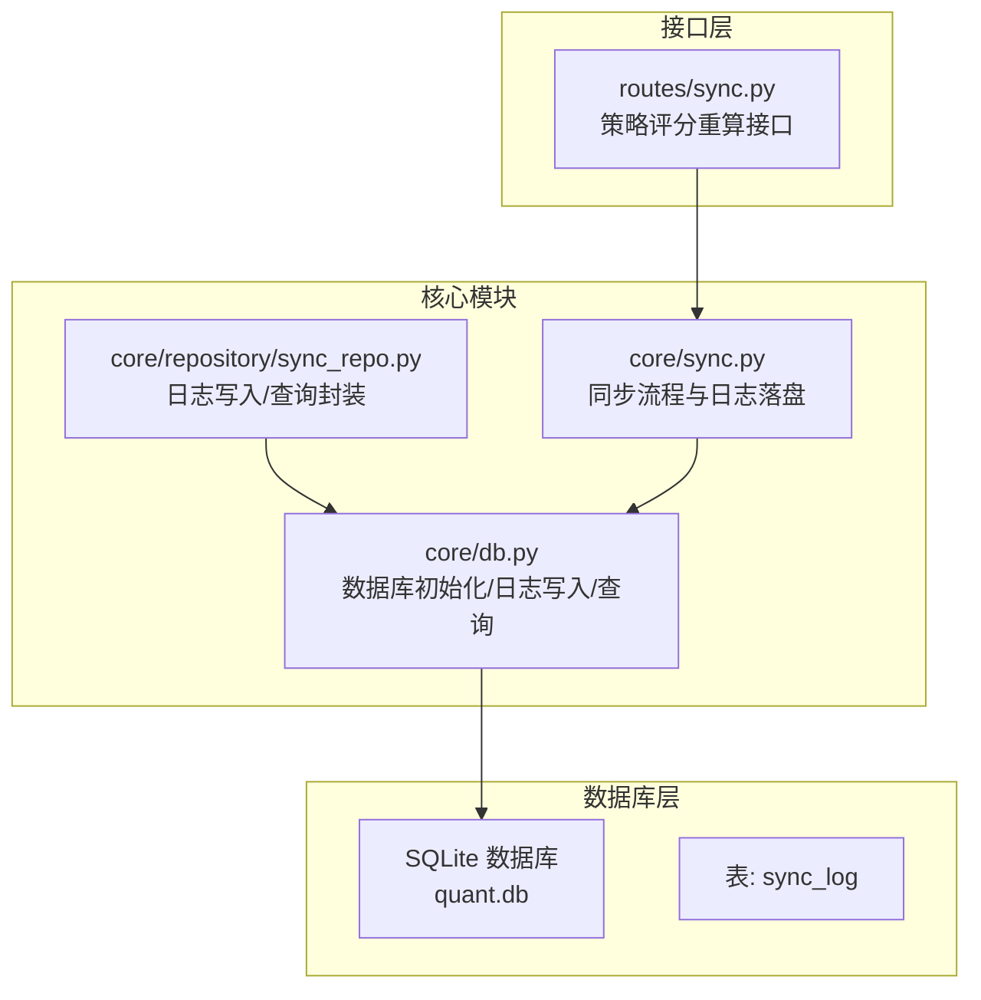
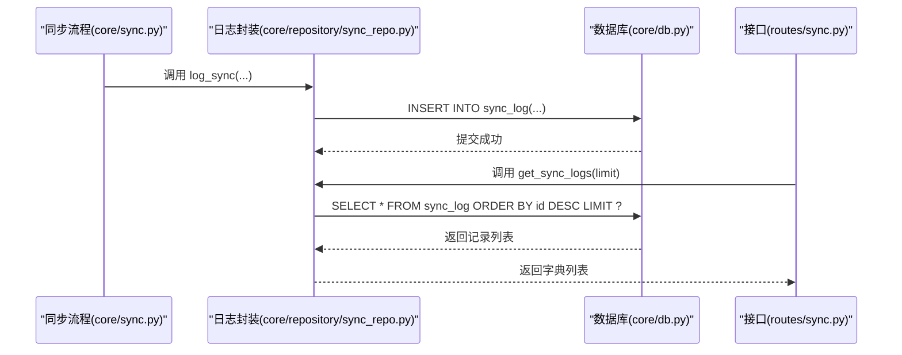
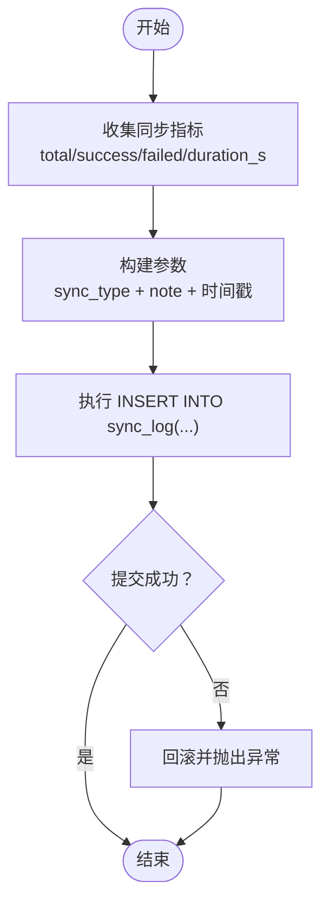
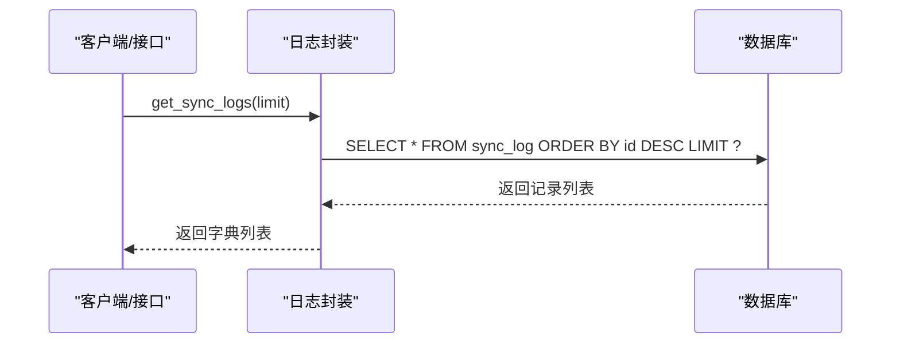
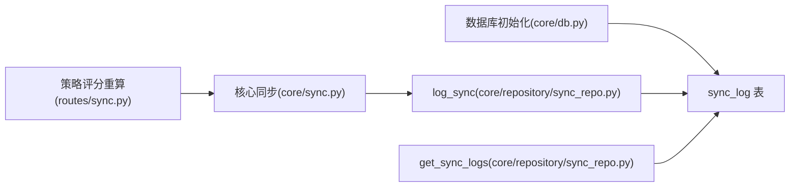

# 数据同步日志表

<cite>
**本文档引用的文件**
- [core/db.py](file://core/db.py)
- [core/repository/sync_repo.py](file://core/repository/sync_repo.py)
- [core/sync.py](file://core/sync.py)
- [routes/sync.py](file://routes/sync.py)
- [tests/test_repository.py](file://tests/test_repository.py)
</cite>

## 目录
1. [简介](#简介)
2. [项目结构](#项目结构)
3. [核心组件](#核心组件)
4. [架构总览](#架构总览)
5. [详细组件分析](#详细组件分析)
6. [依赖关系分析](#依赖关系分析)
7. [性能考量](#性能考量)
8. [故障排查指南](#故障排查指南)
9. [结论](#结论)
10. [附录](#附录)

## 简介
本文件围绕 AIQuant 项目中的数据同步日志表（sync_log）进行系统化说明，涵盖表结构设计、字段语义、在系统中的作用、日志记录与追踪机制、使用示例、查询与统计方法，以及如何基于日志进行系统监控与故障排查。该表用于记录各类数据同步操作的执行状态与结果，是系统可观测性与运维保障的重要组成部分。

## 项目结构
sync_log 表位于本地 SQLite 数据库中，由统一的数据库初始化流程创建；同步逻辑分布在核心模块中，并通过专用的仓库层封装日志写入与查询能力。

图表来源
- [core/db.py:156-166](file://core/db.py#L156-L166)
- [core/repository/sync_repo.py:18-33](file://core/repository/sync_repo.py#L18-L33)
- [core/sync.py:385-389](file://core/sync.py#L385-L389)
- [core/sync.py:664-668](file://core/sync.py#L664-L668)
- [routes/sync.py:23-139](file://routes/sync.py#L23-L139)

章节来源
- [core/db.py:156-166](file://core/db.py#L156-L166)
- [core/repository/sync_repo.py:1-33](file://core/repository/sync_repo.py#L1-L33)
- [core/sync.py:385-389](file://core/sync.py#L385-L389)
- [core/sync.py:664-668](file://core/sync.py#L664-L668)
- [routes/sync.py:23-139](file://routes/sync.py#L23-L139)

## 核心组件
- sync_log 表：记录每次数据同步的元信息与结果，支撑审计、统计与监控。
- 日志写入封装：提供统一的 log_sync 方法，负责将同步结果持久化到表中。
- 日志查询封装：提供 get_sync_logs 方法，支持按时间倒序查询最近若干条记录。
- 同步流程集成：在初始化同步与每日增量同步完成后，自动落盘日志。

章节来源
- [core/db.py:898-914](file://core/db.py#L898-L914)
- [core/repository/sync_repo.py:18-33](file://core/repository/sync_repo.py#L18-L33)
- [core/sync.py:385-389](file://core/sync.py#L385-L389)
- [core/sync.py:664-668](file://core/sync.py#L664-L668)

## 架构总览
sync_log 在系统中的位置如下：核心同步模块在完成同步后调用日志写入接口，随后可通过查询接口获取历史记录，用于展示、统计与告警。

图表来源
- [core/sync.py:385-389](file://core/sync.py#L385-L389)
- [core/sync.py:664-668](file://core/sync.py#L664-L668)
- [core/repository/sync_repo.py:18-33](file://core/repository/sync_repo.py#L18-L33)
- [core/db.py:909-914](file://core/db.py#L909-L914)

## 详细组件分析

### 表结构与字段语义
sync_log 表用于记录数据同步的元信息与结果，字段定义如下：
- id：自增主键，用于标识每条日志记录。
- sync_time：同步时间，记录本次同步完成的时间戳。
- sync_type：同步类型，标识本次同步的类别（例如“initial_sync”“daily_sync”等）。
- total：总数，本次同步涉及的总目标数量（如股票数或指数数）。
- success：成功数，本次同步成功的数量。
- failed：失败数，本次同步失败的数量。
- duration_s：耗时秒数，本次同步的总耗时（单位秒，保留一位小数）。
- note：备注，附加说明（如同步范围、数据源说明等）。

字段设计要点
- 字段命名清晰，便于理解与检索。
- 时间字段采用文本格式存储，便于排序与展示。
- 耗时以秒为单位，保留一定精度，满足性能分析需求。
- 备注字段用于补充上下文信息，便于定位问题。

章节来源
- [core/db.py:156-166](file://core/db.py#L156-L166)

### 日志写入流程
- 调用入口：在核心同步模块完成初始化同步或每日增量同步后，调用 log_sync 方法。
- 参数来源：从同步流程中收集 total、success、failed、duration_s 等指标，并拼接 sync_type 与 note。
- 写入动作：通过数据库连接执行 INSERT 语句，将记录写入 sync_log 表。
- 事务控制：使用统一的连接管理器，保证写入原子性与一致性。

图表来源
- [core/sync.py:385-389](file://core/sync.py#L385-L389)
- [core/sync.py:664-668](file://core/sync.py#L664-L668)
- [core/repository/sync_repo.py:18-25](file://core/repository/sync_repo.py#L18-L25)
- [core/db.py:898-907](file://core/db.py#L898-L907)

章节来源
- [core/sync.py:385-389](file://core/sync.py#L385-L389)
- [core/sync.py:664-668](file://core/sync.py#L664-L668)
- [core/repository/sync_repo.py:18-25](file://core/repository/sync_repo.py#L18-L25)
- [core/db.py:898-907](file://core/db.py#L898-L907)

### 日志查询与统计
- 查询接口：提供 get_sync_logs(limit) 方法，按 id 倒序返回最近 limit 条记录。
- 统计口径：结合数据库统计函数，可计算成功率、平均耗时、历史趋势等。
- 应用场景：前端展示、仪表板、告警阈值、报表生成。

图表来源
- [core/repository/sync_repo.py:28-33](file://core/repository/sync_repo.py#L28-L33)
- [core/db.py:909-914](file://core/db.py#L909-L914)

章节来源
- [core/repository/sync_repo.py:28-33](file://core/repository/sync_repo.py#L28-L33)
- [core/db.py:909-914](file://core/db.py#L909-L914)

### 使用示例

#### 正常同步日志记录
- 场景：完成初始化同步或每日增量同步后，记录本次同步的指标与耗时。
- 关键点：传入 sync_type（如“initial_sync”“daily_sync”）、total、success、failed、duration_s、note。
- 结果：sync_log 中新增一条记录，可用于后续查询与统计。

章节来源
- [core/sync.py:385-389](file://core/sync.py#L385-L389)
- [core/sync.py:664-668](file://core/sync.py#L664-L668)
- [core/repository/sync_repo.py:18-25](file://core/repository/sync_repo.py#L18-L25)

#### 异常情况日志记录
- 场景：同步过程中出现异常（如网络超时、数据源不可用、解析失败等），可在捕获异常后记录失败数与备注信息。
- 关键点：即使部分失败，也应记录 total、success、failed、duration_s 与 note，以便追踪问题根因。
- 结果：sync_log 中新增一条记录，便于后续分析与告警。

章节来源
- [core/sync.py:285-313](file://core/sync.py#L285-L313)
- [core/sync.py:599-641](file://core/sync.py#L599-L641)

### 查询与统计方法
- 最近 N 条日志：通过 get_sync_logs(limit) 获取，按 id 倒序排列。
- 成功率计算：对某类 sync_type 的历史记录，success/total 的均值或趋势分析。
- 耗时分析：对 duration_s 进行统计，识别慢同步时段与异常波动。
- 备注过滤：通过 note 字段筛选特定场景（如“增量 X~Y 单线程”）。

章节来源
- [core/repository/sync_repo.py:28-33](file://core/repository/sync_repo.py#L28-L33)
- [core/db.py:909-914](file://core/db.py#L909-L914)

### 系统监控与故障排查
- 监控维度：成功率、耗时、失败数、同步类型分布。
- 告警建议：当失败率超过阈值、耗时显著上升、连续多次失败时触发告警。
- 故障定位：结合 note 字段与具体同步类型，定位数据源问题、网络问题或解析异常。

章节来源
- [core/sync.py:385-389](file://core/sync.py#L385-L389)
- [core/sync.py:664-668](file://core/sync.py#L664-L668)

## 依赖关系分析
- 表定义：由数据库初始化脚本创建，确保首次运行即具备表结构。
- 写入依赖：核心同步模块依赖日志封装与数据库连接管理。
- 查询依赖：查询接口依赖统一连接管理器与 SQL 查询。
- 接口依赖：策略评分重算接口间接依赖同步模块与数据库统计。

图表来源
- [core/db.py:156-166](file://core/db.py#L156-L166)
- [core/sync.py:385-389](file://core/sync.py#L385-L389)
- [core/sync.py:664-668](file://core/sync.py#L664-L668)
- [core/repository/sync_repo.py:18-33](file://core/repository/sync_repo.py#L18-L33)
- [routes/sync.py:23-139](file://routes/sync.py#L23-L139)

章节来源
- [core/db.py:156-166](file://core/db.py#L156-L166)
- [core/sync.py:385-389](file://core/sync.py#L385-L389)
- [core/sync.py:664-668](file://core/sync.py#L664-L668)
- [core/repository/sync_repo.py:18-33](file://core/repository/sync_repo.py#L18-L33)
- [routes/sync.py:23-139](file://routes/sync.py#L23-L139)

## 性能考量
- 写入性能：日志写入为轻量级 INSERT，对整体同步性能影响较小。
- 查询性能：按 id 倒序查询，适合高频读取最近记录；若需按类型或时间范围统计，可考虑增加索引或视图。
- 事务与并发：统一连接管理器已启用 WAL 模式与 NORMAL 同步级别，兼顾性能与可靠性。

章节来源
- [core/db.py:26-39](file://core/db.py#L26-L39)

## 故障排查指南
- 记录缺失：确认数据库初始化是否成功，确认 log_sync 调用链是否被执行。
- 数据异常：检查 total、success、failed 的一致性，核对同步流程中的异常分支。
- 查询无结果：确认 limit 参数与时间范围设置，核对 sync_type 与 note 的筛选条件。
- 性能异常：关注 duration_s 的趋势变化，结合 note 字段定位数据源或网络问题。

章节来源
- [core/sync.py:385-389](file://core/sync.py#L385-L389)
- [core/sync.py:664-668](file://core/sync.py#L664-L668)
- [core/repository/sync_repo.py:28-33](file://core/repository/sync_repo.py#L28-L33)

## 结论
sync_log 表作为数据同步过程的“审计日志”，提供了完整的执行轨迹与结果记录。通过统一的日志写入与查询封装，系统能够高效地记录、查询与分析同步状态，为监控、告警与故障排查提供可靠依据。建议在生产环境中持续观察成功率与耗时趋势，并结合 note 字段完善问题定位与优化策略。

## 附录
- 测试验证：单元测试覆盖了仓库层函数的可导入性与基本行为，确保日志接口稳定可用。

章节来源
- [tests/test_repository.py:49-51](file://tests/test_repository.py#L49-L51)