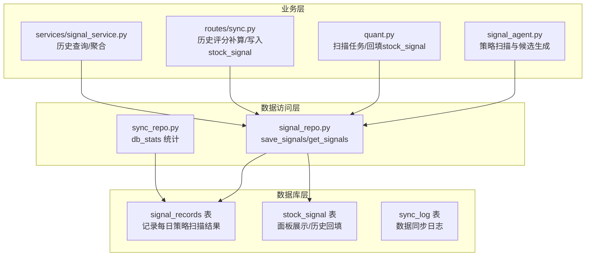
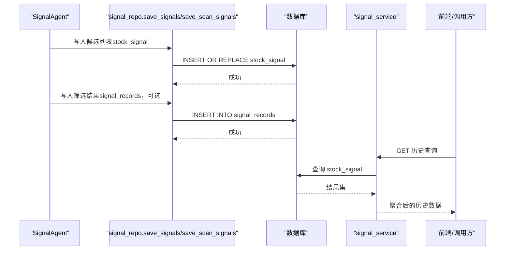
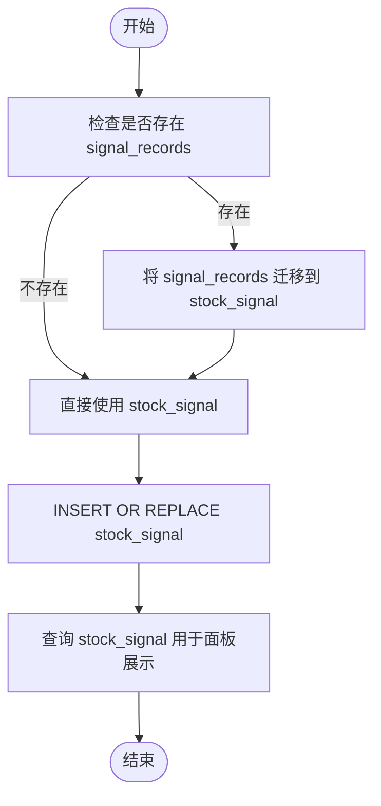
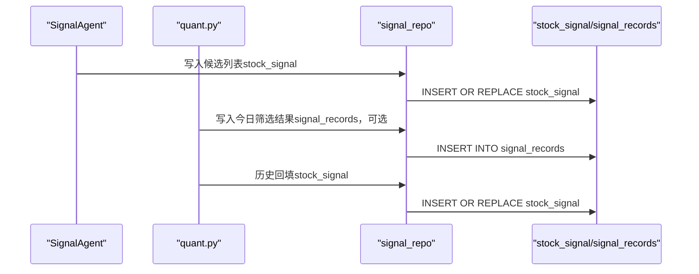
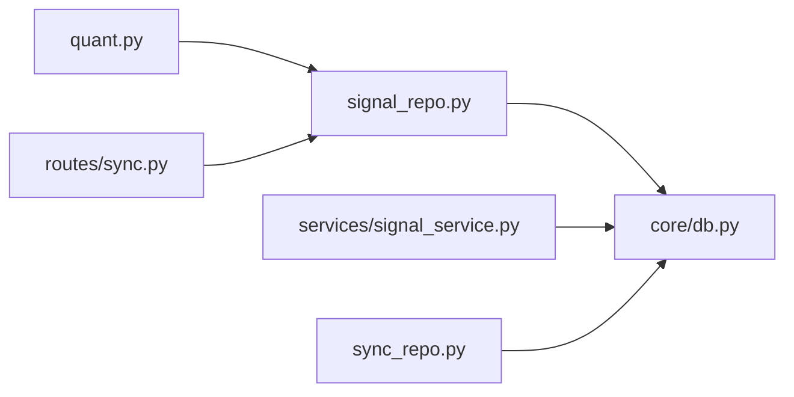

# 策略筛选记录表

<cite>
**本文引用的文件**
- [core/db.py](file://core/db.py)
- [core/repository/signal_repo.py](file://core/repository/signal_repo.py)
- [agents/signal_agent.py](file://agents/signal_agent.py)
- [quant.py](file://quant.py)
- [routes/sync.py](file://routes/sync.py)
- [services/signal_service.py](file://services/signal_service.py)
- [core/repository/sync_repo.py](file://core/repository/sync_repo.py)
</cite>

## 目录
1. [简介](#简介)
2. [项目结构](#项目结构)
3. [核心组件](#核心组件)
4. [架构总览](#架构总览)
5. [详细组件分析](#详细组件分析)
6. [依赖关系分析](#依赖关系分析)
7. [性能考量](#性能考量)
8. [故障排查指南](#故障排查指南)
9. [结论](#结论)
10. [附录](#附录)

## 简介
本文件围绕 AIQuant 系统中的“策略筛选记录表”（signal_records）进行系统化说明，涵盖表结构设计、字段语义、在系统中的作用、与 stock_signal 的兼容性设计、插入与查询方法、以及与策略扫描流程的集成方式。同时提供批量保存筛选结果的实践路径与注意事项，帮助开发者与使用者准确理解并高效使用该表。

## 项目结构
策略筛选记录表（signal_records）属于系统数据库层的一部分，位于核心数据库初始化脚本中，并通过数据访问层（repository）与业务层（agent、service、route）协同工作，支撑策略扫描、信号落库、历史查询与回填等功能。

图表来源
- [core/db.py:138-154](file://core/db.py#L138-L154)
- [core/repository/signal_repo.py:14-43](file://core/repository/signal_repo.py#L14-L43)
- [agents/signal_agent.py:85-93](file://agents/signal_agent.py#L85-L93)
- [quant.py:467-472](file://quant.py#L467-L472)
- [routes/sync.py:115-129](file://routes/sync.py#L115-L129)
- [services/signal_service.py:12-122](file://services/signal_service.py#L12-L122)
- [core/repository/sync_repo.py:36-54](file://core/repository/sync_repo.py#L36-L54)

章节来源
- [core/db.py:138-154](file://core/db.py#L138-L154)
- [core/repository/signal_repo.py:14-43](file://core/repository/signal_repo.py#L14-L43)
- [agents/signal_agent.py:85-93](file://agents/signal_agent.py#L85-L93)
- [quant.py:467-472](file://quant.py#L467-L472)
- [routes/sync.py:115-129](file://routes/sync.py#L115-L129)
- [services/signal_service.py:12-122](file://services/signal_service.py#L12-L122)
- [core/repository/sync_repo.py:36-54](file://core/repository/sync_repo.py#L36-L54)

## 核心组件
- 数据库层：signal_records 与 stock_signal 两张表共同承载策略扫描结果与历史回填数据，前者为兼容旧表，后者为主表。
- 数据访问层：signal_repo 提供批量插入与查询接口；sync_repo 提供数据库统计信息（含 signal_records 计数）。
- 业务层：signal_agent 负责策略扫描与候选生成；quant.py 负责每日扫描任务与历史回填；routes/sync.py 负责历史评分补算并写入 stock_signal；services/signal_service 负责历史查询与聚合。

章节来源
- [core/db.py:138-154](file://core/db.py#L138-L154)
- [core/repository/signal_repo.py:14-43](file://core/repository/signal_repo.py#L14-L43)
- [agents/signal_agent.py:85-93](file://agents/signal_agent.py#L85-L93)
- [quant.py:467-472](file://quant.py#L467-L472)
- [routes/sync.py:115-129](file://routes/sync.py#L115-L129)
- [services/signal_service.py:12-122](file://services/signal_service.py#L12-L122)
- [core/repository/sync_repo.py:36-54](file://core/repository/sync_repo.py#L36-L54)

## 架构总览
策略扫描与记录的整体流程如下：
- 策略扫描：signal_agent 对全市场股票逐个运行策略，生成候选列表。
- 信号落库：将候选列表写入 stock_signal（主表），同时可选地将筛选结果写入 signal_records（兼容旧表）。
- 历史回填：quant.py 与 routes/sync.py 将历史评分补算并写入 stock_signal。
- 历史查询：services/signal_service 从 stock_signal 查询并聚合展示。

图表来源
- [agents/signal_agent.py:85-93](file://agents/signal_agent.py#L85-L93)
- [core/repository/signal_repo.py:14-43](file://core/repository/signal_repo.py#L14-L43)
- [services/signal_service.py:12-122](file://services/signal_service.py#L12-L122)

## 详细组件分析

### 表结构与字段说明
signal_records 是策略筛选记录的兼容表，用于记录每日策略扫描结果与推荐信号。其字段含义如下：
- id：自增主键
- scan_time：扫描时间（记录插入时的时间戳）
- trade_date：交易日期（策略扫描所对应的交易日）
- code：股票代码
- name：股票名称
- price：当前价格
- score：策略评分（整型）
- stop_loss：止损价
- take_profit：止盈价
- buy_volume：买入数量（整型）
- buy_money：买入金额（浮点）
- sent_wechat：微信推送状态（0/1）
- note：备注（文本）

该表还包含一个索引 idx_signal_date(trade_date)，便于按交易日期快速查询。

章节来源
- [core/db.py:138-154](file://core/db.py#L138-L154)

### 在系统中的作用
- 记录每日策略扫描结果：作为兼容旧表，保留筛选阶段的原始记录，便于追溯与审计。
- 支持历史查询：通过 get_signals/get_today_signals 等接口按日期与限制条件查询。
- 与 stock_signal 的关系：stock_signal 为当前主表，signal_records 作为兼容表存在，二者字段语义相近，但 stock_signal 字段更丰富，适合面板展示与历史回填。

章节来源
- [core/repository/signal_repo.py:102-118](file://core/repository/signal_repo.py#L102-L118)
- [core/db.py:138-154](file://core/db.py#L138-L154)

### 插入与查询使用示例
以下为常见使用路径（以代码片段路径代替具体代码内容）：
- 批量保存筛选结果（signal_records）
  - 调用入口：[core/repository/signal_repo.py:14-43](file://core/repository/signal_repo.py#L14-L43)
  - 参数说明：signals 为候选字典列表，每个字典包含 code/name/price/score/stop_loss/take_profit/buy_volume/buy_money 等字段；sent_wechat 控制是否标记微信推送状态。
  - 实现要点：使用 executemany 批量插入，自动填充 scan_time 与 trade_date。
- 查询筛选记录
  - 单日查询：[core/repository/signal_repo.py:116-118](file://core/repository/signal_repo.py#L116-L118)
  - 指定日期查询：[core/repository/signal_repo.py:102-113](file://core/repository/signal_repo.py#L102-L113)
  - 通用查询：支持按 trade_date 过滤与按 scan_time 降序限制条数。
- 与 stock_signal 的兼容写入
  - 主表写入：[core/repository/signal_repo.py:46-99](file://core/repository/signal_repo.py#L46-L99)
  - 历史回填：quant.py 与 routes/sync.py 中均有回填逻辑，使用 INSERT OR REPLACE 幂等写入 stock_signal。

章节来源
- [core/repository/signal_repo.py:14-43](file://core/repository/signal_repo.py#L14-L43)
- [core/repository/signal_repo.py:102-118](file://core/repository/signal_repo.py#L102-L118)
- [core/repository/signal_repo.py:46-99](file://core/repository/signal_repo.py#L46-L99)
- [quant.py:467-472](file://quant.py#L467-L472)
- [routes/sync.py:115-129](file://routes/sync.py#L115-L129)

### 与 stock_signal 的兼容性设计
- 字段映射：signal_records 与 stock_signal 字段语义相近，便于从旧表迁移至新表。
- 写入策略：quant.py 与 routes/sync.py 使用 INSERT OR REPLACE 写入 stock_signal，确保幂等性与历史覆盖。
- 展示与回填：services/signal_service 从 stock_signal 查询并聚合，支持历史面板展示与对比分析。

图表来源
- [core/db.py:138-154](file://core/db.py#L138-L154)
- [quant.py:467-472](file://quant.py#L467-L472)
- [routes/sync.py:115-129](file://routes/sync.py#L115-L129)
- [services/signal_service.py:12-122](file://services/signal_service.py#L12-L122)

章节来源
- [core/db.py:138-154](file://core/db.py#L138-L154)
- [quant.py:467-472](file://quant.py#L467-L472)
- [routes/sync.py:115-129](file://routes/sync.py#L115-L129)
- [services/signal_service.py:12-122](file://services/signal_service.py#L12-L122)

### 与策略扫描流程的集成
- 策略扫描：signal_agent 对全市场股票运行策略，生成候选列表。
- 写入 stock_signal：将候选列表写入 stock_signal，用于面板展示与历史回填。
- 写入 signal_records：可选地将筛选结果写入 signal_records，便于兼容与审计。
- 历史回填：quant.py 与 routes/sync.py 将历史评分补算并写入 stock_signal。

图表来源
- [agents/signal_agent.py:85-93](file://agents/signal_agent.py#L85-L93)
- [quant.py:467-472](file://quant.py#L467-L472)
- [core/repository/signal_repo.py:14-43](file://core/repository/signal_repo.py#L14-L43)
- [routes/sync.py:115-129](file://routes/sync.py#L115-L129)

章节来源
- [agents/signal_agent.py:85-93](file://agents/signal_agent.py#L85-L93)
- [quant.py:467-472](file://quant.py#L467-L472)
- [core/repository/signal_repo.py:14-43](file://core/repository/signal_repo.py#L14-L43)
- [routes/sync.py:115-129](file://routes/sync.py#L115-L129)

## 依赖关系分析
- signal_repo 依赖 core.db 的连接与 SQL 定义。
- quant.py 与 routes/sync.py 依赖 signal_repo 的写入接口。
- services/signal_service 依赖 stock_signal 的查询接口。
- sync_repo 依赖 signal_records 的统计查询。

图表来源
- [core/repository/signal_repo.py:9-11](file://core/repository/signal_repo.py#L9-L11)
- [quant.py:467-472](file://quant.py#L467-L472)
- [routes/sync.py:115-129](file://routes/sync.py#L115-L129)
- [services/signal_service.py:12-122](file://services/signal_service.py#L12-L122)
- [core/repository/sync_repo.py:36-54](file://core/repository/sync_repo.py#L36-L54)

章节来源
- [core/repository/signal_repo.py:9-11](file://core/repository/signal_repo.py#L9-L11)
- [quant.py:467-472](file://quant.py#L467-L472)
- [routes/sync.py:115-129](file://routes/sync.py#L115-L129)
- [services/signal_service.py:12-122](file://services/signal_service.py#L12-L122)
- [core/repository/sync_repo.py:36-54](file://core/repository/sync_repo.py#L36-L54)

## 性能考量
- 批量写入：使用 executemany 或 INSERT OR REPLACE 批量写入，减少事务开销。
- 索引优化：signal_records 已建立按 trade_date 的索引，查询效率较高；stock_signal 已建立 scan_date/code 唯一索引与 trade_date 索引，适合面板展示与回填场景。
- 数据规模：随着策略扫描频率增加，建议定期清理过期记录或归档历史数据，避免表膨胀影响查询性能。

## 故障排查指南
- 写入失败：检查数据库连接与权限，确认表结构与字段类型匹配。
- 查询无结果：确认 trade_date 是否正确传入，limit 是否过大导致截断。
- 历史回填异常：核对 quant.py 与 routes/sync.py 的回填逻辑，确保 INSERT OR REPLACE 幂等性。
- 统计异常：使用 sync_repo 的 db_stats 接口核对 signal_records 的记录总数与数据库大小。

章节来源
- [core/repository/signal_repo.py:14-43](file://core/repository/signal_repo.py#L14-L43)
- [core/repository/sync_repo.py:36-54](file://core/repository/sync_repo.py#L36-L54)

## 结论
signal_records 作为策略筛选记录的兼容表，在系统中承担了历史记录与审计职责；而 stock_signal 作为主表，承载了更丰富的字段与更高的查询性能。通过 signal_repo 的统一接口与各业务模块的协作，实现了从策略扫描到信号落库、历史回填与面板展示的完整闭环。建议优先使用 stock_signal 进行日常展示与回填，signal_records 作为兼容与审计手段保留。

## 附录
- 字段对照与兼容性
  - code/name/price/score/stop_loss/take_profit/buy_volume/buy_money/sent_wechat/note 与 stock_signal 的字段语义一致，便于迁移与对比。
- 常用查询
  - 按交易日查询：get_signals(trade_date=...) 或 get_today_signals()
  - 统计信息：db_stats() 包含 signal_records 的记录总数

章节来源
- [core/db.py:138-154](file://core/db.py#L138-L154)
- [core/repository/signal_repo.py:102-118](file://core/repository/signal_repo.py#L102-L118)
- [core/repository/sync_repo.py:36-54](file://core/repository/sync_repo.py#L36-L54)