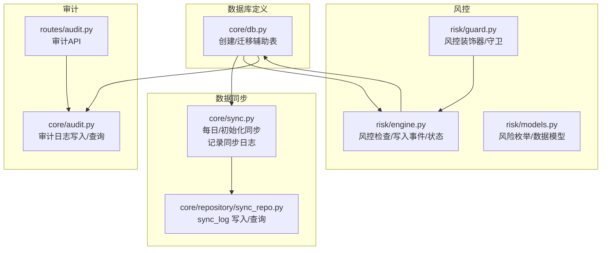
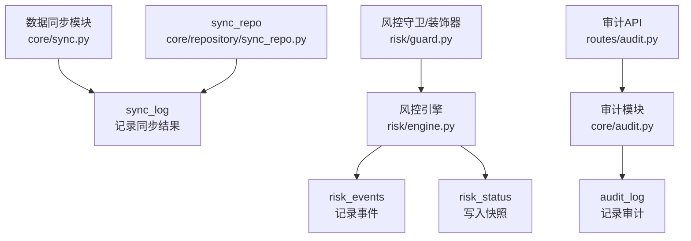
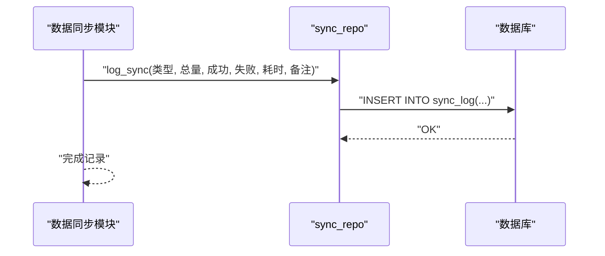
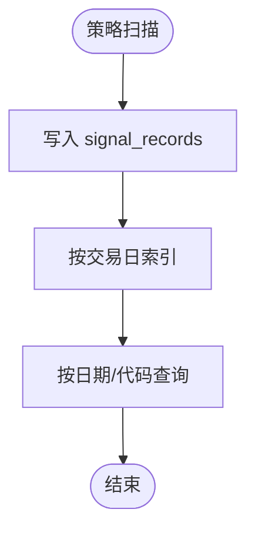
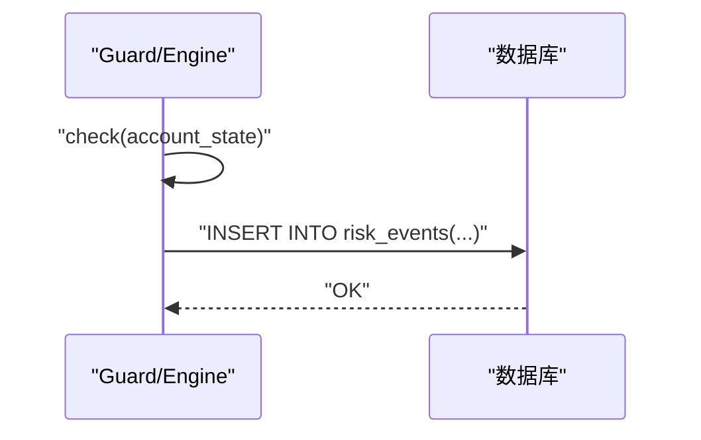
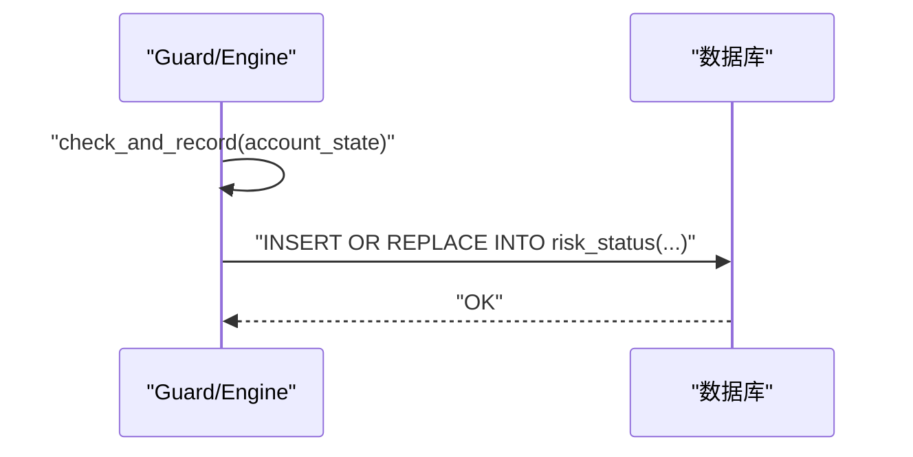
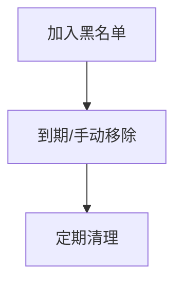
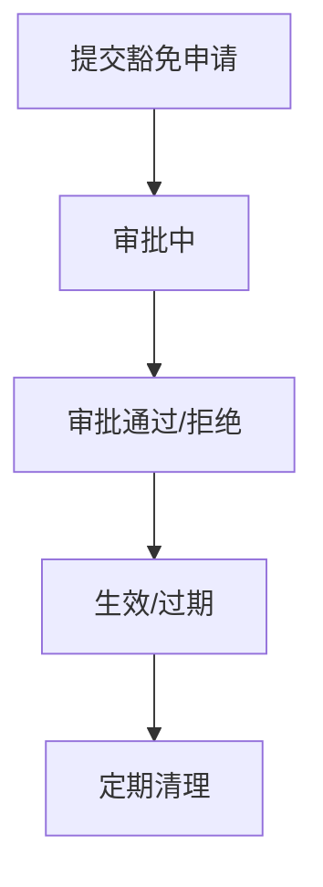
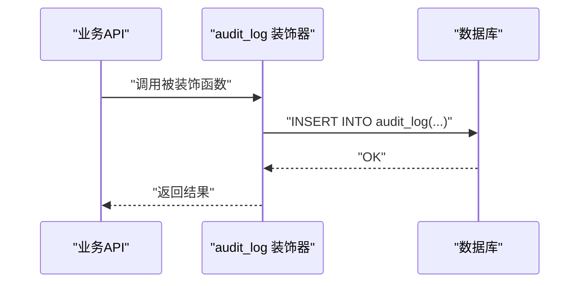
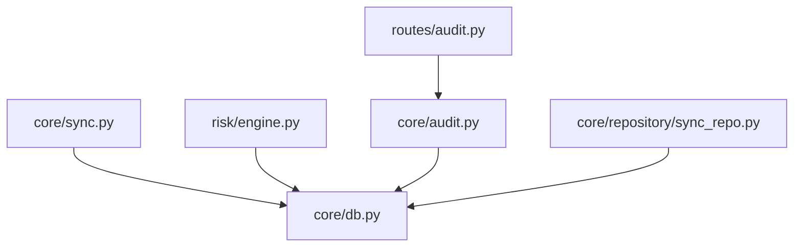

# 辅助数据表

<cite>
**本文引用的文件**
- [core/db.py](file://core/db.py)
- [core/sync.py](file://core/sync.py)
- [core/audit.py](file://core/audit.py)
- [risk/engine.py](file://risk/engine.py)
- [risk/models.py](file://risk/models.py)
- [risk/guard.py](file://risk/guard.py)
- [routes/audit.py](file://routes/audit.py)
- [core/repository/sync_repo.py](file://core/repository/sync_repo.py)
</cite>

## 目录
1. [简介](#简介)
2. [项目结构](#项目结构)
3. [核心组件](#核心组件)
4. [架构总览](#架构总览)
5. [详细组件分析](#详细组件分析)
6. [依赖分析](#依赖分析)
7. [性能考虑](#性能考虑)
8. [故障排查指南](#故障排查指南)
9. [结论](#结论)
10. [附录](#附录)

## 简介
本文件聚焦于AIQuant系统的辅助数据表，包括：
- sync_log 数据同步日志表
- signal_records 策略筛选记录表
- risk_events 风控事件记录表
- risk_status 风控状态快照表
- blacklist 黑名单表
- risk_overrides 风控豁免表
- audit_log 审计日志表

文档将说明这些表的结构设计、字段含义、使用场景、相互关系，并结合代码梳理数据同步机制、风控管理流程与审计跟踪功能，最后给出数据生命周期与清理策略建议。

## 项目结构
以下图展示与辅助数据表相关的核心模块与文件位置：

图表来源
- [core/db.py:138-426](file://core/db.py#L138-L426)
- [core/sync.py:386-388](file://core/sync.py#L386-L388)
- [core/sync.py:665-667](file://core/sync.py#L665-L667)
- [core/repository/sync_repo.py:18-33](file://core/repository/sync_repo.py#L18-L33)
- [risk/engine.py:73-127](file://risk/engine.py#L73-L127)
- [risk/models.py:11-78](file://risk/models.py#L11-L78)
- [risk/guard.py:36-92](file://risk/guard.py#L36-L92)
- [core/audit.py:16-147](file://core/audit.py#L16-L147)
- [routes/audit.py:16-79](file://routes/audit.py#L16-L79)

章节来源
- [core/db.py:138-426](file://core/db.py#L138-L426)
- [core/sync.py:386-388](file://core/sync.py#L386-L388)
- [core/sync.py:665-667](file://core/sync.py#L665-L667)
- [core/repository/sync_repo.py:18-33](file://core/repository/sync_repo.py#L18-L33)
- [risk/engine.py:73-127](file://risk/engine.py#L73-L127)
- [risk/models.py:11-78](file://risk/models.py#L11-L78)
- [risk/guard.py:36-92](file://risk/guard.py#L36-L92)
- [core/audit.py:16-147](file://core/audit.py#L16-L147)
- [routes/audit.py:16-79](file://routes/audit.py#L16-L79)

## 核心组件
本节对各辅助表进行结构与用途说明，并指出其在系统中的关键作用。

- sync_log 数据同步日志表
  - 用途：记录数据同步任务的执行情况，便于监控与排障。
  - 关键字段：同步时间、类型、总量、成功数、失败数、耗时、备注。
  - 写入入口：数据同步模块在完成初始化或每日增量同步后调用日志记录函数。
  - 查询入口：提供分页查询接口，支持按时间倒序查看最近记录。

- signal_records 策略筛选记录表
  - 用途：记录策略扫描产生的候选信号（兼容旧版）。
  - 关键字段：扫描时间、交易日、股票代码、名称、价格、评分、止损止盈、买卖量金额、微信推送标记、备注。
  - 索引：按交易日建立索引，便于按日检索。

- risk_events 风控事件记录表
  - 用途：记录每次风控检查中触发的事件详情，包含规则名、类别、等级、指标值、阈值、建议与时间戳。
  - 关键字段：流水ID、流水号、规则名、类别、等级、消息、指标值、阈值、建议、创建时间。
  - 索引：按创建时间倒序、按等级建立索引，便于快速检索与告警。

- risk_status 风控状态快照表
  - 用途：记录账户的实时风控状态快照，包含整体等级、活跃规则、最大回撤、持仓数、总敞口、可用资金、最近检查时间与拦截原因。
  - 关键字段：账户ID（主键）、整体等级、活跃规则列表、当前回撤、当前持仓数、总敞口、可用资金、最近检查时间、拦截原因、更新时间。
  - 写入策略：每次风控检查后写入或替换最新快照。

- blacklist 黑名单表
  - 用途：记录被限制交易的股票代码及其原因、创建者、创建时间、到期时间、移除时间。
  - 关键字段：ID、股票代码、原因、创建者、创建时间、到期时间、移除时间。
  - 索引：按到期时间建立索引，便于定期清理与查询。

- risk_overrides 风控豁免表
  - 用途：记录风控豁免申请与审批状态，支持过期控制与审批追踪。
  - 关键字段：ID、规则名、原因、操作员、审批人、状态、创建时间、过期时间、审批时间。
  - 索引：按状态、过期时间建立索引，便于状态统计与清理。

- audit_log 审计日志表
  - 用途：统一记录用户行为与系统动作，支持审计与合规追溯。
  - 关键字段：ID、用户ID、操作动作、资源标识、详情、客户端IP、创建时间。
  - 查询入口：提供按动作、用户ID过滤与分页查询，支持统计接口。

章节来源
- [core/db.py:138-166](file://core/db.py#L138-L166)
- [core/db.py:138-154](file://core/db.py#L138-L154)
- [core/db.py:358-372](file://core/db.py#L358-L372)
- [core/db.py:374-386](file://core/db.py#L374-L386)
- [core/db.py:388-399](file://core/db.py#L388-L399)
- [core/db.py:401-414](file://core/db.py#L401-L414)
- [core/db.py:416-426](file://core/db.py#L416-L426)

## 架构总览
下图展示辅助数据表在系统中的角色与交互关系：

图表来源
- [core/sync.py:386-388](file://core/sync.py#L386-L388)
- [core/sync.py:665-667](file://core/sync.py#L665-L667)
- [risk/engine.py:73-127](file://risk/engine.py#L73-L127)
- [risk/guard.py:36-92](file://risk/guard.py#L36-L92)
- [core/audit.py:16-147](file://core/audit.py#L16-L147)
- [routes/audit.py:16-79](file://routes/audit.py#L16-L79)
- [core/repository/sync_repo.py:18-33](file://core/repository/sync_repo.py#L18-L33)

## 详细组件分析

### sync_log 数据同步日志表
- 结构要点
  - 主键自增ID
  - 同步时间、类型、总量、成功数、失败数、耗时（秒）、备注
- 写入流程
  - 初始化同步完成后写入一次
  - 每日增量同步完成后写入一次
- 查询流程
  - 提供分页查询，按ID倒序取最近N条
- 使用场景
  - 监控数据同步健康度
  - 排查某日同步异常
  - 生成同步统计报表

图表来源
- [core/sync.py:386-388](file://core/sync.py#L386-L388)
- [core/sync.py:665-667](file://core/sync.py#L665-L667)
- [core/repository/sync_repo.py:18-26](file://core/repository/sync_repo.py#L18-L26)

章节来源
- [core/db.py:156-166](file://core/db.py#L156-L166)
- [core/sync.py:386-388](file://core/sync.py#L386-L388)
- [core/sync.py:665-667](file://core/sync.py#L665-L667)
- [core/repository/sync_repo.py:18-33](file://core/repository/sync_repo.py#L18-L33)

### signal_records 策略筛选记录表
- 结构要点
  - 主键自增ID
  - 扫描时间、交易日、股票代码、名称、价格、评分、止损止盈、买卖量金额、微信推送标记、备注
- 索引
  - 按交易日建立索引，便于按日检索
- 使用场景
  - 回看历史策略扫描结果
  - 与实盘下单联动（兼容旧流程）

图表来源
- [core/db.py:138-154](file://core/db.py#L138-L154)

章节来源
- [core/db.py:138-154](file://core/db.py#L138-L154)

### risk_events 风控事件记录表
- 结构要点
  - 主键自增ID
  - 流水号、规则名、类别、等级、消息、指标值、阈值、建议、创建时间
- 写入流程
  - 风控引擎每次检查后，将每条规则的结果写入该表
- 查询流程
  - 支持按等级、时间倒序查询，便于告警与回溯

图表来源
- [risk/engine.py:73-98](file://risk/engine.py#L73-L98)
- [core/db.py:358-372](file://core/db.py#L358-L372)

章节来源
- [core/db.py:358-372](file://core/db.py#L358-L372)
- [risk/engine.py:73-98](file://risk/engine.py#L73-L98)

### risk_status 风控状态快照表
- 结构要点
  - 账户ID为主键
  - 整体等级、活跃规则列表、当前回撤、当前持仓数、总敞口、可用资金、最近检查时间、拦截原因、更新时间
- 写入流程
  - 风控引擎每次检查后，将最新状态以“插入或替换”的方式写入
- 查询流程
  - 按账户ID查询最新快照

图表来源
- [risk/engine.py:51-71](file://risk/engine.py#L51-L71)
- [risk/engine.py:101-127](file://risk/engine.py#L101-L127)
- [core/db.py:374-386](file://core/db.py#L374-L386)

章节来源
- [core/db.py:374-386](file://core/db.py#L374-L386)
- [risk/engine.py:51-71](file://risk/engine.py#L51-L71)
- [risk/engine.py:101-127](file://risk/engine.py#L101-L127)

### blacklist 黑名单表
- 结构要点
  - 主键自增ID
  - 股票代码、原因、创建者、创建时间、到期时间、移除时间
- 索引
  - 按到期时间建立索引，便于定期清理
- 使用场景
  - 在风控检查中作为阻断条件之一
  - 与风控规则联动，阻止特定股票交易

图表来源
- [core/db.py:388-399](file://core/db.py#L388-L399)

章节来源
- [core/db.py:388-399](file://core/db.py#L388-L399)

### risk_overrides 风控豁免表
- 结构要点
  - 主键自增ID
  - 规则名、原因、操作员、审批人、状态、创建时间、过期时间、审批时间
- 索引
  - 按状态、过期时间建立索引
- 使用场景
  - 人工发起豁免申请，经审批后生效
  - 豁免期内绕过特定风控规则

图表来源
- [core/db.py:401-414](file://core/db.py#L401-L414)

章节来源
- [core/db.py:401-414](file://core/db.py#L401-L414)

### audit_log 审计日志表
- 结构要点
  - 主键自增ID
  - 用户ID、操作动作、资源标识、详情、客户端IP、创建时间
- 写入流程
  - 通过装饰器自动记录API调用，或手动调用记录函数
- 查询流程
  - 支持按动作、用户ID过滤与分页查询
  - 提供统计接口，统计当日操作数、各动作分布与近7天趋势

图表来源
- [core/audit.py:41-92](file://core/audit.py#L41-L92)
- [core/audit.py:107-147](file://core/audit.py#L107-L147)
- [routes/audit.py:16-79](file://routes/audit.py#L16-L79)

章节来源
- [core/db.py:416-426](file://core/db.py#L416-L426)
- [core/audit.py:16-147](file://core/audit.py#L16-L147)
- [routes/audit.py:16-79](file://routes/audit.py#L16-L79)

## 依赖分析
- 表间关系
  - sync_log 与 risk_events/risk_status 无直接外键关联，但可通过业务上下文（如流水号）进行关联
  - blacklist 与 risk_overrides 与风控检查逻辑耦合，不直接依赖其他辅助表
  - audit_log 与业务API强耦合，记录用户行为与系统动作
- 模块依赖
  - 数据同步模块依赖数据库连接与日志写入
  - 风控引擎依赖数据库连接与配置加载
  - 审计模块依赖数据库连接与Flask请求上下文

图表来源
- [core/sync.py:17-21](file://core/sync.py#L17-L21)
- [risk/engine.py:76-77](file://risk/engine.py#L76-L77)
- [core/audit.py:13](file://core/audit.py#L13)
- [core/repository/sync_repo.py:8-15](file://core/repository/sync_repo.py#L8-L15)
- [routes/audit.py:11](file://routes/audit.py#L11)

章节来源
- [core/sync.py:17-21](file://core/sync.py#L17-L21)
- [risk/engine.py:76-77](file://risk/engine.py#L76-L77)
- [core/audit.py:13](file://core/audit.py#L13)
- [core/repository/sync_repo.py:8-15](file://core/repository/sync_repo.py#L8-L15)
- [routes/audit.py:11](file://routes/audit.py#L11)

## 性能考虑
- 索引优化
  - risk_events：按创建时间倒序、按等级建立索引，满足高频查询与告警需求
  - blacklist：按到期时间建立索引，便于定期清理
  - audit_log：按创建时间倒序建立索引，满足分页与趋势统计
  - signal_records：按交易日建立索引，满足按日检索
- 写入策略
  - 风控事件采用批量写入，减少事务开销
  - 风控状态采用“插入或替换”，避免重复写入
  - 审计日志采用异步化或装饰器自动记录，降低侵入性
- 查询策略
  - 分页查询限制最大条数，避免大结果集导致性能问题
  - 统计接口仅查询必要字段，减少IO

## 故障排查指南
- 数据同步异常
  - 检查 sync_log 最近记录，确认同步类型、总量、成功/失败数与耗时
  - 若失败较多，检查数据源接口与网络状况
- 风控拦截频繁
  - 查看 risk_events 最近事件，定位触发规则与阈值
  - 检查 risk_status 最新快照，关注整体等级与活跃规则
  - 核对 blacklist 与 risk_overrides 是否存在误判或过期未清理
- 审计日志缺失
  - 确认装饰器是否正确使用
  - 检查 audit_log 查询条件与分页参数
  - 核对数据库连接与权限

章节来源
- [core/db.py:358-372](file://core/db.py#L358-L372)
- [core/db.py:374-386](file://core/db.py#L374-L386)
- [core/db.py:388-399](file://core/db.py#L388-L399)
- [core/db.py:401-414](file://core/db.py#L401-L414)
- [core/db.py:416-426](file://core/db.py#L416-L426)
- [core/sync.py:386-388](file://core/sync.py#L386-L388)
- [core/sync.py:665-667](file://core/sync.py#L665-L667)
- [core/audit.py:107-147](file://core/audit.py#L107-L147)
- [routes/audit.py:16-79](file://routes/audit.py#L16-L79)

## 结论
辅助数据表在AIQuant系统中承担着“可观测、可审计、可治理”的关键角色。通过规范化的表结构、完善的索引策略与清晰的写入/查询流程，系统实现了对数据同步、风控管理与审计跟踪的全面支撑。建议持续完善生命周期管理与清理策略，保障系统长期稳定运行。

## 附录
- 数据生命周期与清理策略建议
  - sync_log：按月归档，保留最近3个月；超过期限归档至冷存储
  - risk_events：按规则与等级分级保留，一般保留3-6个月；超期归档
  - risk_status：保留最新快照；历史快照可归档
  - blacklist：到期自动清理；支持手动移除
  - risk_overrides：按状态与过期时间清理；审批未通过及时清理
  - audit_log：按日/周/月统计，保留最近3-6个月；超期归档
  - signal_records：按策略周期清理，一般保留1个月