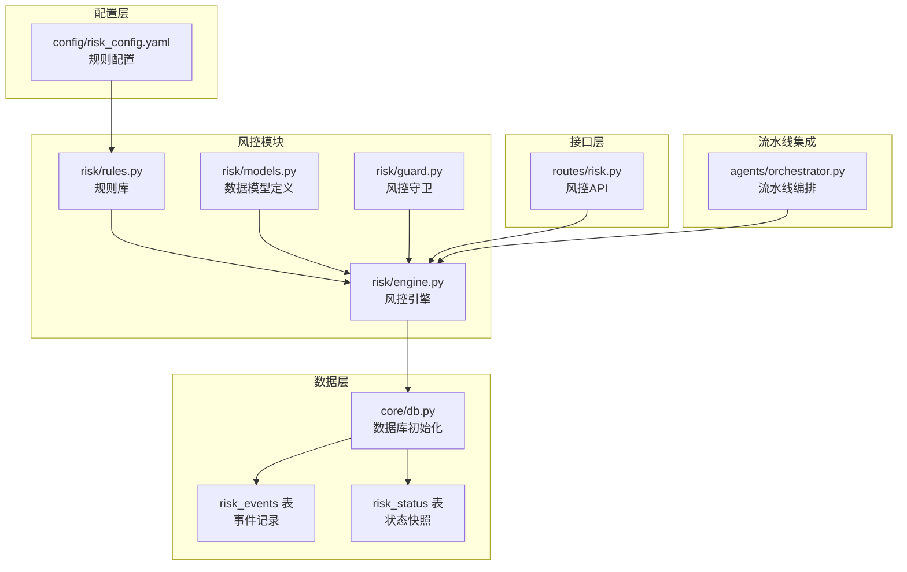
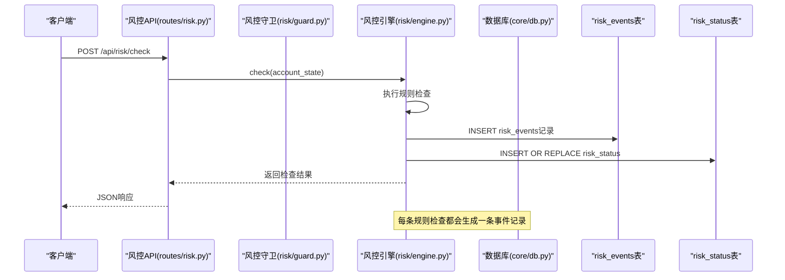
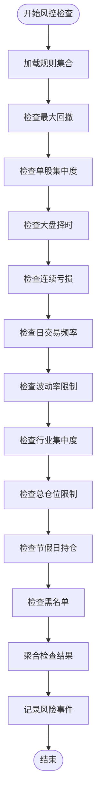
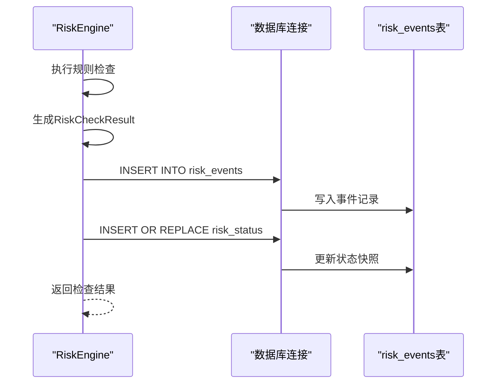
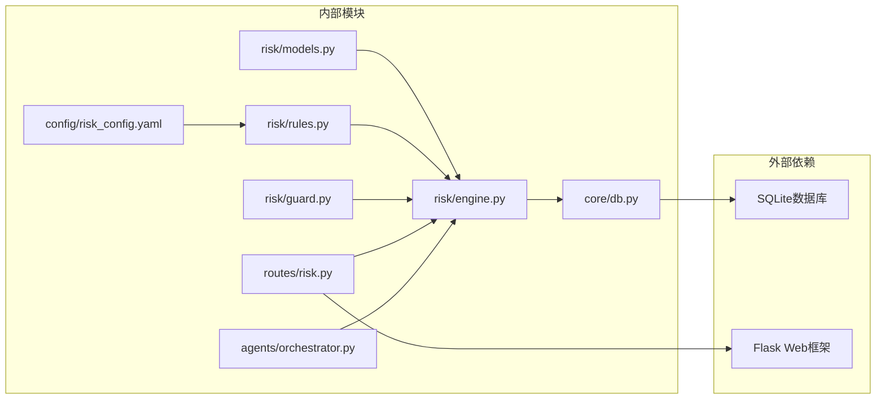

# 风控事件记录表

<cite>
**本文档引用的文件**
- [risk/models.py](file://risk/models.py)
- [risk/engine.py](file://risk/engine.py)
- [risk/guard.py](file://risk/guard.py)
- [risk/rules.py](file://risk/rules.py)
- [core/db.py](file://core/db.py)
- [routes/risk.py](file://routes/risk.py)
- [config/risk_config.yaml](file://config/risk_config.yaml)
- [agents/orchestrator.py](file://agents/orchestrator.py)
</cite>

## 目录
1. [简介](#简介)
2. [项目结构](#项目结构)
3. [核心组件](#核心组件)
4. [架构概览](#架构概览)
5. [详细组件分析](#详细组件分析)
6. [依赖关系分析](#依赖关系分析)
7. [性能考量](#性能考量)
8. [故障排除指南](#故障排除指南)
9. [结论](#结论)

## 简介
本文件详细说明AIQuant系统中风控事件记录表(risk_events)的设计与使用。该表用于记录和追踪所有风控检查过程中产生的事件和警告，为风险监控、审计和策略优化提供数据支撑。文档涵盖表结构设计、字段含义、插入流程、查询方法以及基于事件记录的风险分析实践。

## 项目结构
风控事件记录表位于系统的核心数据库层，与风控引擎、规则库、API路由和配置文件协同工作，形成完整的风控事件生命周期管理。

**图表来源**
- [risk/models.py:11-78](file://risk/models.py#L11-L78)
- [risk/engine.py:13-168](file://risk/engine.py#L13-L168)
- [risk/guard.py:15-92](file://risk/guard.py#L15-L92)
- [risk/rules.py:1-388](file://risk/rules.py#L1-L388)
- [core/db.py:358-386](file://core/db.py#L358-L386)
- [routes/risk.py:1-298](file://routes/risk.py#L1-L298)
- [agents/orchestrator.py:36-175](file://agents/orchestrator.py#L36-L175)

**章节来源**
- [core/db.py:358-386](file://core/db.py#L358-L386)
- [risk/engine.py:73-100](file://risk/engine.py#L73-L100)

## 核心组件
风控事件记录表由以下核心组件构成：

### 数据模型层
- **RiskLevel枚举**: 定义风险等级(PASS/WARNING/RESTRICT/BLOCK)
- **RiskCategory枚举**: 定义风险类别(drawdown/concentration/volatility/market_timing/position_limit/cooldown/blacklist)
- **RiskCheckResult类**: 单条风控规则检查结果的数据结构
- **RiskStatus类**: 账户实时风控状态快照

### 风控引擎层
- **RiskEngine类**: 核心风控执行引擎，负责规则检查、事件记录和状态管理
- **DEFAULT_RULES**: 预定义的风控规则集合

### API接口层
- **routes/risk.py**: 提供风控状态查询、事件查询、手动检查等REST接口
- **risk/guard.py**: 风控装饰器和直接检查函数

**章节来源**
- [risk/models.py:11-78](file://risk/models.py#L11-L78)
- [risk/engine.py:13-168](file://risk/engine.py#L13-L168)
- [risk/guard.py:15-92](file://risk/guard.py#L15-L92)
- [routes/risk.py:1-298](file://routes/risk.py#L1-L298)

## 架构概览
风控事件记录表在整个系统中的作用和位置如下：

**图表来源**
- [routes/risk.py:67-81](file://routes/risk.py#L67-L81)
- [risk/guard.py:77-92](file://risk/guard.py#L77-L92)
- [risk/engine.py:19-71](file://risk/engine.py#L19-L71)
- [core/db.py:358-386](file://core/db.py#L358-L386)

## 详细组件分析

### 表结构设计详解

#### 基本字段说明

| 字段名 | 类型 | 允许为空 | 约束 | 描述 |
|--------|------|----------|------|------|
| id | INTEGER | 否 | 主键, 自增 | 事件记录唯一标识符 |
| pipeline_id | TEXT | 是 |  | 流水线ID，用于关联业务流程 |
| rule_name | TEXT | 否 |  | 规则名称，对应具体风控规则 |
| category | TEXT | 否 |  | 风险类别，枚举值 |
| level | TEXT | 否 |  | 风险等级，枚举值 |
| message | TEXT | 否 |  | 事件描述信息 |
| metric_value | REAL | 是 |  | 实际指标值 |
| threshold | REAL | 是 |  | 阈值 |
| suggestion | TEXT | 是 |  | 处理建议 |
| created_at | TEXT | 否 |  | 创建时间戳 |

#### 字段作用与含义

**pipeline_id(流水线ID)**: 
- 用于关联具体的业务流水线执行，便于追踪事件来源
- 在流水线编排中自动生成，格式为"pipe-YYYYMMDD-hex"

**rule_name(规则名称)**:
- 对应具体风控规则的标识符
- 与规则库中的函数名保持一致

**category(类别)**:
- 风险类型分类，包括回撤、集中度、波动率、择时、仓位限制、冷却期、黑名单等

**level(级别)**:
- 风险严重程度，从低到高依次为PASS、WARNING、RESTRICT、BLOCK

**message(消息)**:
- 详细的事件描述，包含具体的指标值和阈值信息

**metric_value(指标值)**:
- 实际计算得到的指标数值，用于量化风险程度

**threshold(阈值)**:
- 规则设定的阈值，用于与指标值比较判断风险级别

**suggestion(建议)**:
- 基于风险级别的处理建议和应对措施

**created_at(创建时间)**:
- 事件发生的时间戳，用于排序和统计分析

### 风控规则与事件生成

系统内置10个风控规则，每个规则都会产生相应的事件记录：

**图表来源**
- [risk/rules.py:376-387](file://risk/rules.py#L376-L387)
- [risk/engine.py:19-49](file://risk/engine.py#L19-L49)

### 事件插入流程

**图表来源**
- [risk/engine.py:73-100](file://risk/engine.py#L73-L100)
- [core/db.py:358-386](file://core/db.py#L358-L386)

**章节来源**
- [risk/models.py:28-50](file://risk/models.py#L28-L50)
- [risk/rules.py:34-61](file://risk/rules.py#L34-L61)
- [risk/engine.py:73-100](file://risk/engine.py#L73-L100)

### 事件查询与分类统计

#### API查询接口

系统提供多种查询方式：

1. **最近事件查询**: GET /api/risk/events
   - 支持limit参数限制返回数量
   - 支持level参数按风险级别过滤

2. **手动检查**: POST /api/risk/check
   - 手动触发风控检查
   - 返回整体风险等级和详细结果

3. **状态查询**: GET /api/risk/status
   - 获取最新风控状态
   - 包含当前回撤、持仓数量等关键指标

#### 分类统计方法

基于事件记录可以进行以下统计分析：

1. **按风险级别统计**: 统计不同风险级别的事件数量分布
2. **按规则类型统计**: 分析各类别规则的触发频率
3. **时间趋势分析**: 观察风险事件的时间分布和变化趋势
4. **规则有效性评估**: 基于事件频率和影响程度评估规则效果

**章节来源**
- [routes/risk.py:52-81](file://routes/risk.py#L52-L81)
- [risk/engine.py:155-167](file://risk/engine.py#L155-L167)

### 风险分析与改进实践

#### 基于事件记录的风险分析

1. **异常检测**: 通过分析事件模式识别潜在风险
2. **规则优化**: 基于事件统计调整阈值和权重
3. **策略改进**: 结合事件背景优化交易策略
4. **监控告警**: 建立基于事件的自动化监控体系

#### 事件记录的使用示例

虽然不能提供具体代码示例，但可以说明典型使用场景：

1. **流水线集成**: 在Agent流水线中自动记录风控事件
2. **实时监控**: 通过API接口实时查询风险事件
3. **批量分析**: 导出事件数据进行深度分析
4. **审计追溯**: 通过事件记录进行合规审计

**章节来源**
- [agents/orchestrator.py:99-104](file://agents/orchestrator.py#L99-L104)
- [routes/risk.py:52-81](file://routes/risk.py#L52-L81)

## 依赖关系分析

**图表来源**
- [risk/engine.py:8-10](file://risk/engine.py#L8-L10)
- [risk/rules.py:9-11](file://risk/rules.py#L9-L11)
- [routes/risk.py:19-24](file://routes/risk.py#L19-L24)
- [agents/orchestrator.py:29-30](file://agents/orchestrator.py#L29-L30)

**章节来源**
- [core/db.py:19-39](file://core/db.py#L19-L39)
- [routes/risk.py:19-24](file://routes/risk.py#L19-L24)

## 性能考量
- **索引优化**: 表已建立按时间戳和风险级别的索引，支持高效查询
- **批量写入**: 事件记录采用批量插入，减少数据库I/O开销
- **连接池**: 使用SQLite WAL模式提升并发性能
- **内存管理**: 事件查询支持限制返回数量，避免内存溢出

## 故障排除指南

### 常见问题及解决方案

1. **事件记录失败**
   - 检查数据库连接状态
   - 验证表结构完整性
   - 查看错误日志输出

2. **查询结果异常**
   - 确认查询参数格式正确
   - 检查时间范围设置
   - 验证风险级别过滤条件

3. **性能问题**
   - 适当调整limit参数
   - 优化查询条件
   - 检查数据库文件大小

**章节来源**
- [risk/engine.py:98-100](file://risk/engine.py#L98-L100)
- [routes/risk.py:106-107](file://routes/risk.py#L106-L107)

## 结论
风控事件记录表(risk_events)作为AIQuant系统的重要组成部分，通过标准化的事件记录机制实现了对所有风控检查过程的完整追踪。其设计充分考虑了实用性、可扩展性和可维护性，为系统的风险管控提供了坚实的数据基础。通过合理的查询和分析方法，用户可以基于事件记录持续优化风控策略，提升系统的稳定性和可靠性。