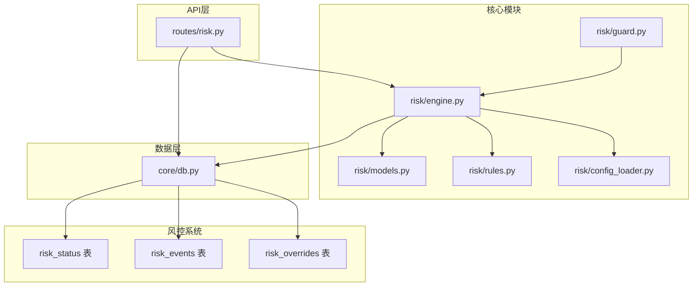
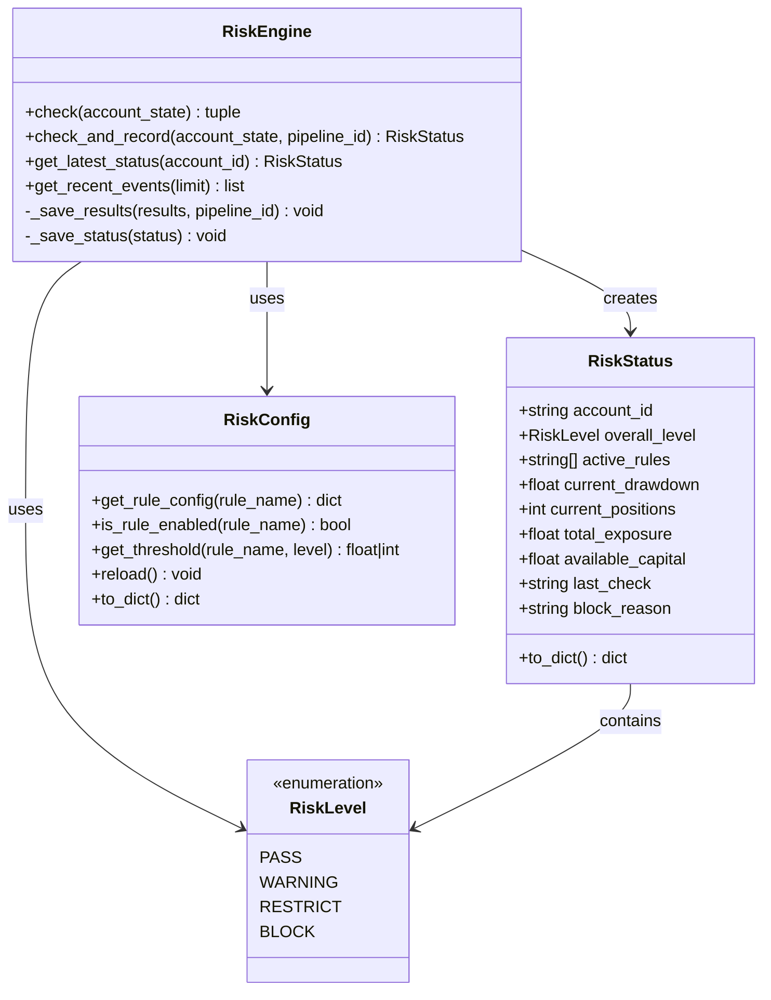
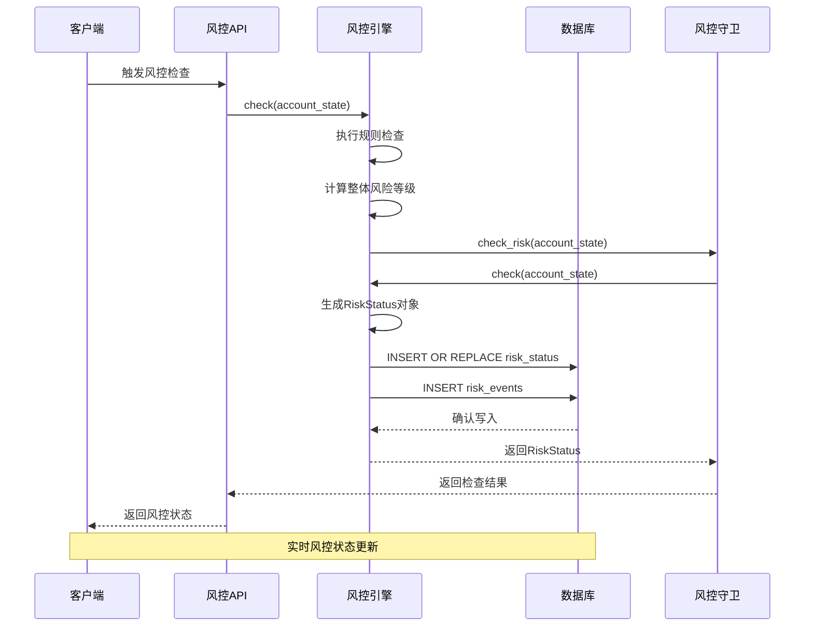
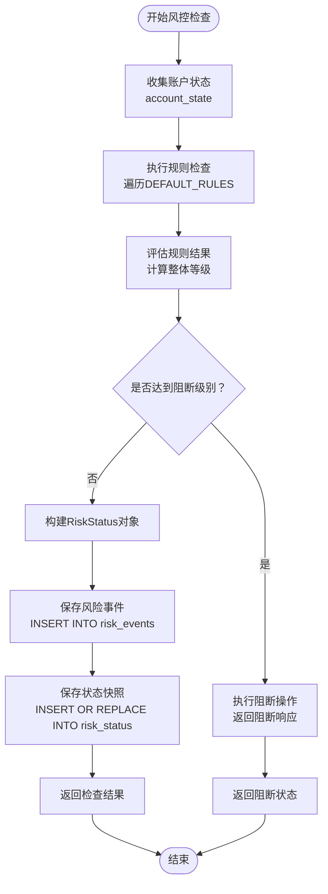
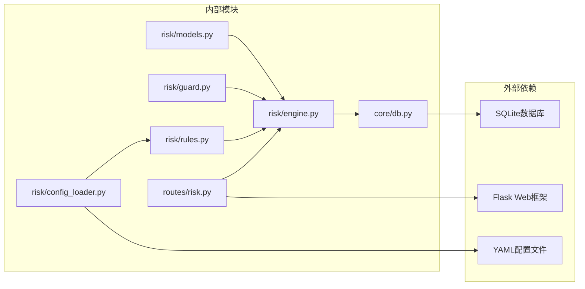

# 风控状态快照表

<cite>
**本文档引用的文件**
- [risk/models.py](file://risk/models.py)
- [risk/engine.py](file://risk/engine.py)
- [core/db.py](file://core/db.py)
- [routes/risk.py](file://routes/risk.py)
- [risk/guard.py](file://risk/guard.py)
- [risk/rules.py](file://risk/rules.py)
- [risk/config_loader.py](file://risk/config_loader.py)
</cite>

## 目录
1. [简介](#简介)
2. [项目结构](#项目结构)
3. [核心组件](#核心组件)
4. [架构概览](#架构概览)
5. [详细组件分析](#详细组件分析)
6. [依赖关系分析](#依赖关系分析)
7. [性能考虑](#性能考虑)
8. [故障排除指南](#故障排除指南)
9. [结论](#结论)

## 简介

风控状态快照表（risk_status）是AIQuant风控系统的核心数据存储组件，用于实时记录和反映系统的整体风控状态。该表采用SQLite数据库实现，提供了完整的风控状态持久化能力，支持实时监控、历史追踪和风险控制决策支持。

该表的设计遵循了以下核心原则：
- **实时性**：每次风控检查后立即更新状态
- **完整性**：包含账户的所有关键风控指标
- **可追溯性**：保留完整的检查历史和事件记录
- **可扩展性**：支持动态规则配置和阈值调整

## 项目结构

风控状态快照表在整个AIQuant系统中的位置如下：



**图表来源**
- [risk/engine.py:13-168](file://risk/engine.py#L13-L168)
- [core/db.py:374-386](file://core/db.py#L374-L386)
- [routes/risk.py:1-298](file://routes/risk.py#L1-L298)

**章节来源**
- [risk/engine.py:13-168](file://risk/engine.py#L13-L168)
- [core/db.py:374-386](file://core/db.py#L374-L386)

## 核心组件

### 数据模型定义

风控状态快照表的数据模型由多个核心组件构成：



**图表来源**
- [risk/models.py:53-78](file://risk/models.py#L53-L78)
- [risk/engine.py:13-168](file://risk/engine.py#L13-L168)
- [risk/config_loader.py:20-131](file://risk/config_loader.py#L20-L131)

### 数据库表结构

风控状态快照表采用以下SQL结构定义：

| 字段名 | 数据类型 | 约束条件 | 描述 |
|--------|----------|----------|------|
| account_id | TEXT | PRIMARY KEY | 账户ID，主键标识 |
| overall_level | TEXT | NOT NULL | 整体风险等级 |
| active_rules | TEXT | NULL | 活跃规则列表（逗号分隔） |
| current_drawdown | REAL | DEFAULT 0 | 当前回撤百分比 |
| current_positions | INTEGER | DEFAULT 0 | 当前持仓数量 |
| total_exposure | REAL | DEFAULT 0 | 总敞口金额 |
| available_capital | REAL | DEFAULT 0 | 可用资金余额 |
| last_check | TEXT | NOT NULL | 最后检查时间戳 |
| block_reason | TEXT | NULL | 阻断原因描述 |
| updated_at | TEXT | NULL | 记录更新时间 |

**章节来源**
- [core/db.py:374-386](file://core/db.py#L374-L386)
- [risk/models.py:53-78](file://risk/models.py#L53-L78)

## 架构概览

风控状态快照表在整个系统中的工作流程如下：



**图表来源**
- [risk/engine.py:51-71](file://risk/engine.py#L51-L71)
- [risk/guard.py:77-92](file://risk/guard.py#L77-L92)
- [routes/risk.py:67-81](file://routes/risk.py#L67-L81)

## 详细组件分析

### 风控状态快照表字段详解

#### account_id（账户ID）
- **类型**：TEXT（主键）
- **作用**：唯一标识每个账户的风险状态
- **特点**：作为PRIMARY KEY，确保每个账户只有一个最新的风控状态记录
- **使用场景**：多账户并行风控监控的基础标识符

#### overall_level（总体级别）
- **类型**：TEXT（枚举值）
- **可能值**：pass、warning、restrict、block
- **作用**：表示账户的整体风险状况
- **优先级**：BLOCK > RESTRICT > WARNING > PASS
- **计算方式**：所有规则检查结果中的最严格等级

#### active_rules（活跃规则）
- **类型**：TEXT（逗号分隔字符串）
- **作用**：记录当前触发的风控规则名称列表
- **格式**：以逗号分隔的规则名称字符串
- **用途**：快速识别导致风险状态的具体规则

#### current_drawdown（当前回撤）
- **类型**：REAL（浮点数）
- **单位**：百分比（0-1表示0%-100%）
- **作用**：反映账户当前的最大回撤幅度
- **阈值参考**：通常设置为15%（阻断）、10%（限制）、5%（警告）

#### current_positions（当前持仓数）
- **类型**：INTEGER（整数）
- **作用**：统计账户当前持有的证券数量
- **监控意义**：反映投资组合的分散程度和市场暴露

#### total_exposure（总敞口）
- **类型**：REAL（金额）
- **单位**：人民币元
- **作用**：计算账户所有持仓的总价值
- **风险评估**：与可用资金的比例决定杠杆水平

#### available_capital（可用资金）
- **类型**：REAL（金额）
- **单位**：人民币元
- **作用**：账户可用于新交易的资金余额
- **流动性监控**：直接影响交易能力和风险承受

#### last_check（最后检查）
- **类型**：TEXT（ISO 8601时间戳）
- **格式**：YYYY-MM-DDTHH:MM:SS.mmmmmm
- **作用**：记录本次风控检查的时间
- **更新策略**：每次检查都会更新此字段

#### block_reason（阻断原因）
- **类型**：TEXT（描述性字符串）
- **作用**：详细说明导致阻断的具体原因
- **格式**：多个原因用分号分隔
- **应用场景**：为风控决策提供明确依据

#### updated_at（更新时间）
- **类型**：TEXT（ISO 8601时间戳）
- **作用**：记录数据库记录的最终更新时间
- **用途**：审计和监控的重要时间戳

### 风控检查流程



**图表来源**
- [risk/engine.py:19-49](file://risk/engine.py#L19-L49)
- [risk/engine.py:51-71](file://risk/engine.py#L51-L71)

**章节来源**
- [risk/engine.py:19-71](file://risk/engine.py#L19-L71)
- [risk/models.py:53-78](file://risk/models.py#L53-L78)

### 风控守卫机制

风控守卫提供了两种使用方式：

#### 装饰器模式
```python
@risk_guard(action="scan")
def scan_trading_opportunities():
    # 函数逻辑
    pass
```

#### 直接调用模式
```python
account_state = build_account_state(...)
result = check_risk(account_state)
```

守卫机制的核心功能：
- 自动构建账户状态数据
- 执行风控检查
- 对阻断级别直接拦截请求
- 对其他级别注入风控检查结果

**章节来源**
- [risk/guard.py:36-92](file://risk/guard.py#L36-L92)

### API接口集成

风控状态快照表通过RESTful API提供访问：

#### 主要接口
- `GET /api/risk/status` - 获取当前风控状态
- `GET /api/risk/events` - 获取最近风控事件
- `POST /api/risk/check` - 手动触发风控检查
- `GET /api/risk/config` - 获取风控配置
- `POST /api/risk/config/reload` - 热加载配置

#### 状态查询响应格式
```json
{
  "success": true,
  "status": {
    "overall_level": "warning",
    "blocked": false,
    "current_drawdown": 0.08,
    "current_positions": 15,
    "active_rules": ["max_drawdown", "single_stock_limit"],
    "block_reason": "",
    "last_check": "2024-01-15T10:30:45.123456"
  }
}
```

**章节来源**
- [routes/risk.py:31-81](file://routes/risk.py#L31-L81)

## 依赖关系分析

风控状态快照表涉及多个模块的协作：



**图表来源**
- [risk/engine.py:8-11](file://risk/engine.py#L8-L11)
- [routes/risk.py:19-24](file://routes/risk.py#L19-L24)

### 关键依赖关系

1. **数据模型依赖**：RiskStatus类依赖RiskLevel枚举
2. **业务逻辑依赖**：RiskEngine依赖DEFAULT_RULES规则集
3. **配置管理依赖**：规则阈值来自RiskConfig配置
4. **持久化依赖**：通过core.db模块进行数据库操作
5. **接口依赖**：Flask蓝图提供RESTful API

**章节来源**
- [risk/engine.py:8-11](file://risk/engine.py#L8-L11)
- [risk/models.py:11-16](file://risk/models.py#L11-L16)

## 性能考虑

### 数据库优化策略

1. **索引设计**
   - 主键索引：account_id（自动创建）
   - 时间索引：last_check（用于排序查询）

2. **查询优化**
   - 使用LIMIT 1获取最新状态
   - 通过ORDER BY last_check DESC优化排序

3. **内存管理**
   - 使用with语句确保连接正确关闭
   - 异常处理避免连接泄漏

### 并发处理

风控系统采用以下并发控制策略：
- **连接池**：通过get_conn函数管理数据库连接
- **事务隔离**：每个操作在独立事务中执行
- **异常恢复**：捕获数据库异常并记录错误

### 监控指标

建议监控的关键指标：
- 数据库连接成功率
- 风控检查平均耗时
- 状态更新频率
- 规则执行成功率

## 故障排除指南

### 常见问题及解决方案

#### 数据库连接问题
**症状**：风控检查失败，数据库操作异常
**原因**：SQLite连接池问题或权限不足
**解决方案**：
1. 检查数据库文件权限
2. 验证数据库文件完整性
3. 查看应用日志中的具体错误信息

#### 配置加载失败
**症状**：风控规则无法正确加载
**原因**：YAML配置文件格式错误或路径问题
**解决方案**：
1. 验证risk_config.yaml文件格式
2. 检查配置文件编码（UTF-8）
3. 确认配置文件路径正确

#### 状态更新异常
**症状**：风控状态未及时更新
**原因**：INSERT OR REPLACE语句执行失败
**解决方案**：
1. 检查数据库写权限
2. 验证字段约束条件
3. 查看异常堆栈信息

### 调试方法

1. **启用详细日志**
   ```python
   import logging
   logging.basicConfig(level=logging.DEBUG)
   ```

2. **单元测试**
   ```bash
   python -m pytest tests/test_risk.py -v
   ```

3. **API测试**
   ```bash
   curl http://localhost:5000/api/risk/status
   ```

**章节来源**
- [risk/engine.py:98-127](file://risk/engine.py#L98-L127)
- [risk/engine.py:151-167](file://risk/engine.py#L151-L167)

## 结论

风控状态快照表（risk_status）作为AIQuant风控系统的核心组件，实现了以下关键功能：

### 设计优势
1. **实时性**：每次风控检查后立即更新状态
2. **完整性**：涵盖账户所有关键风控指标
3. **可追溯性**：完整的检查历史和事件记录
4. **可扩展性**：支持动态规则配置和阈值调整

### 应用价值
- **风险监控**：提供实时的风险状态可视化
- **决策支持**：为交易决策提供数据支撑
- **合规要求**：满足监管和审计需求
- **系统稳定性**：防止过度风险暴露

### 发展方向
1. **性能优化**：考虑添加复合索引提升查询效率
2. **监控增强**：增加更详细的性能指标监控
3. **扩展功能**：支持多维度风险分析和预测
4. **集成优化**：与其他风控组件的深度集成

该表的设计充分体现了现代量化交易系统对风险管理的重视，为AIQuant的稳定运行提供了坚实的技术基础。