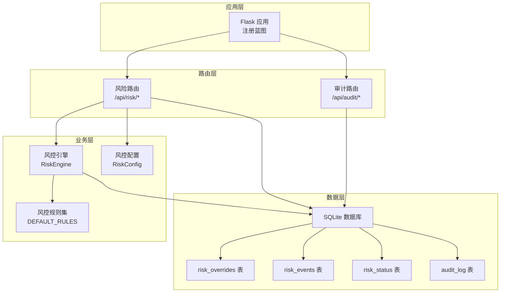
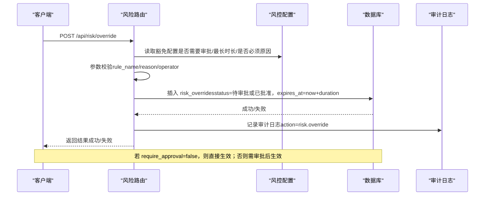
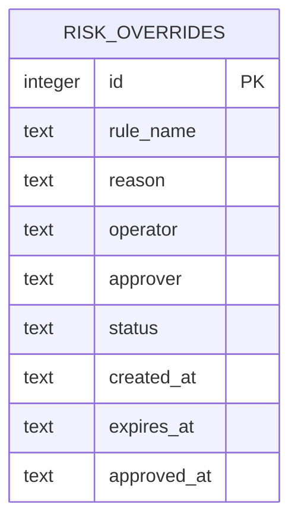
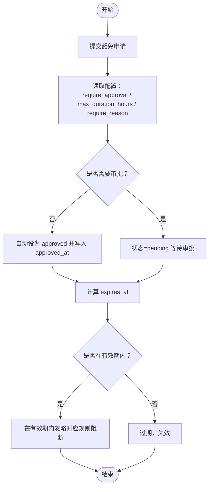
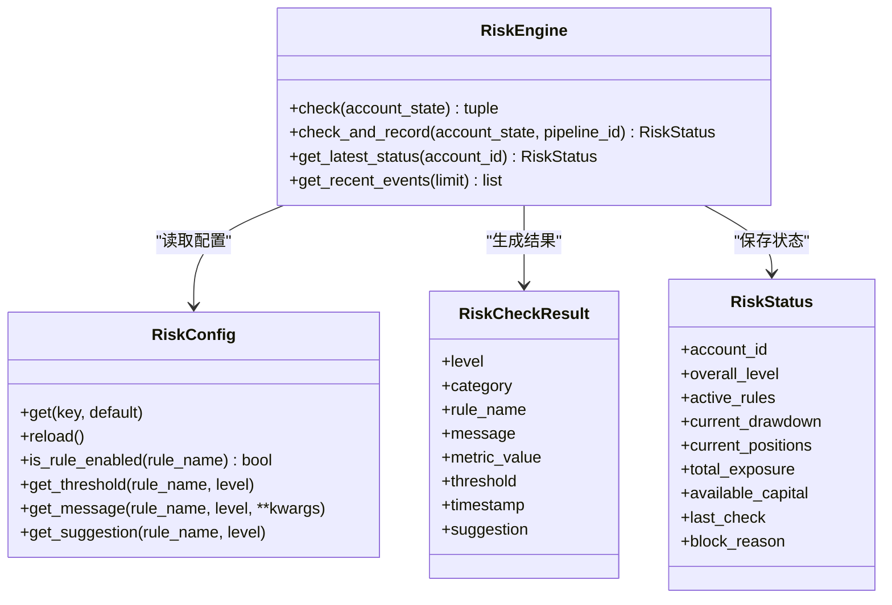

# 风控豁免表

<cite>
**本文引用的文件**
- [risk/models.py](file://risk/models.py)
- [risk/engine.py](file://risk/engine.py)
- [risk/rules.py](file://risk/rules.py)
- [routes/risk.py](file://routes/risk.py)
- [core/db.py](file://core/db.py)
- [config/risk_config.yaml](file://config/risk_config.yaml)
- [core/audit.py](file://core/audit.py)
- [routes/audit.py](file://routes/audit.py)
- [app.py](file://app.py)
</cite>

## 目录
1. [简介](#简介)
2. [项目结构](#项目结构)
3. [核心组件](#核心组件)
4. [架构概览](#架构概览)
5. [详细组件分析](#详细组件分析)
6. [依赖关系分析](#依赖关系分析)
7. [性能考量](#性能考量)
8. [故障排查指南](#故障排查指南)
9. [结论](#结论)
10. [附录](#附录)

## 简介
本文件围绕 AIQuant 系统中的“风控豁免表（risk_overrides）”进行深入说明，涵盖表结构设计、字段语义、在系统中的作用与流程、提交与审批方法、查询与管理手段，以及安全与可追溯性的保障机制。同时提供关键流程的时序图与类图，帮助读者快速理解并正确使用该功能。

## 项目结构
与风控豁免相关的核心位置如下：
- 数据库层：定义了 risk_overrides 表及索引，并包含审计日志表 audit_log。
- 风控引擎与规则：提供风控检查能力，规则结果持久化到 risk_events 与 risk_status。
- 路由层：提供豁免申请、审批、查询等 API。
- 配置层：通过 risk_config.yaml 控制豁免行为（是否需要审批、最长有效期、是否必须填写原因等）。
- 审计日志：提供统一审计日志记录与查询能力，用于安全与可追溯性。

图表来源
- [app.py:44-72](file://app.py#L44-L72)
- [routes/risk.py:26](file://routes/risk.py#L26)
- [routes/audit.py:13](file://routes/audit.py#L13)
- [risk/engine.py:13-168](file://risk/engine.py#L13-L168)
- [core/db.py:401-427](file://core/db.py#L401-L427)

章节来源
- [app.py:44-72](file://app.py#L44-L72)
- [core/db.py:401-427](file://core/db.py#L401-L427)

## 核心组件
- 风控引擎（RiskEngine）：负责执行规则检查、聚合结果、持久化风险事件与状态。
- 风控规则集（DEFAULT_RULES）：内置多条风控规则，规则函数统一返回 RiskCheckResult。
- 风控模型（RiskCheckResult/RiskStatus）：定义检查结果与账户风控状态的数据结构。
- 风控配置（RiskConfig）：从 risk_config.yaml 加载配置，支持热加载；控制豁免相关策略。
- 风控路由（/api/risk/*）：提供豁免申请、审批、查询等接口。
- 数据库（SQLite）：存储 risk_overrides、risk_events、risk_status、audit_log 等。
- 审计日志（audit_log）：统一记录操作行为，支持查询与统计。

章节来源
- [risk/engine.py:13-168](file://risk/engine.py#L13-L168)
- [risk/rules.py:376-387](file://risk/rules.py#L376-L387)
- [risk/models.py:28-77](file://risk/models.py#L28-L77)
- [config/risk_config.yaml:164-169](file://config/risk_config.yaml#L164-L169)
- [routes/risk.py:172-244](file://routes/risk.py#L172-L244)
- [core/db.py:401-427](file://core/db.py#L401-L427)
- [core/audit.py:16-147](file://core/audit.py#L16-L147)

## 架构概览
风控豁免贯穿“配置-路由-引擎-数据库-审计”的完整链路。配置决定豁免是否需要审批、最长有效期与是否必须填写原因；路由负责接收请求、校验参数并写入数据库；引擎负责规则计算与结果持久化；审计日志负责记录操作行为，确保安全与可追溯。

图表来源
- [routes/risk.py:172-204](file://routes/risk.py#L172-L204)
- [config/risk_config.yaml:164-169](file://config/risk_config.yaml#L164-L169)
- [core/audit.py:16-39](file://core/audit.py#L16-L39)

## 详细组件分析

### 风控豁免表结构设计与字段语义
- id：自增主键，用于唯一标识一条豁免记录。
- rule_name：规则名称，标识被豁免的风控规则。
- reason：豁免原因，用于说明为何需要豁免。
- operator：操作员，提交豁免申请的操作者标识。
- approver：审批人，当 require_approval=true 时，审批通过后写入。
- status：状态，枚举值（如 pending/approved/denied），默认 pending。
- created_at：创建时间，记录豁免申请的时间戳。
- expires_at：到期时间，记录豁免的有效截止时间。
- approved_at：审批时间，当状态变为 approved 时写入。

图表来源
- [core/db.py:401-414](file://core/db.py#L401-L414)

章节来源
- [core/db.py:401-414](file://core/db.py#L401-L414)

### 风控豁免在系统中的作用与流程
- 作用：允许在特定条件下对某条风控规则进行临时豁免，避免误伤正常交易场景。
- 流程：
  - 提交豁免申请：填写 rule_name、reason、duration_hours、operator。
  - 配置决策：根据 risk_config.yaml 的 override.* 配置决定是否需要审批。
  - 审批流程：若 require_approval=true，则需要管理员通过 /api/risk/override/{id}/approve 审批；否则自动生效。
  - 生效与到期：状态为 approved 且未过期时，系统在有效期内忽略对应规则的阻断效果。
  - 查询与管理：通过 /api/risk/overrides 查询当前有效（未过期）的豁免记录，支持按 status 过滤。

图表来源
- [routes/risk.py:172-204](file://routes/risk.py#L172-L204)
- [routes/risk.py:228-244](file://routes/risk.py#L228-L244)
- [config/risk_config.yaml:164-169](file://config/risk_config.yaml#L164-L169)

章节来源
- [routes/risk.py:172-204](file://routes/risk.py#L172-L204)
- [routes/risk.py:228-244](file://routes/risk.py#L228-L244)
- [config/risk_config.yaml:164-169](file://config/risk_config.yaml#L164-L169)

### 提交与审批豁免申请的使用示例
- 提交豁免申请（无需审批）：
  - 请求：POST /api/risk/override
  - 参数：rule_name、reason、duration_hours、operator
  - 结果：若 require_approval=false，则 status=approved 直接生效
- 提交豁免申请（需要审批）：
  - 请求：POST /api/risk/override
  - 参数：rule_name、reason、duration_hours、operator
  - 结果：status=pending，等待审批
- 审批通过：
  - 请求：POST /api/risk/override/{id}/approve
  - 参数：approver
  - 结果：更新状态为 approved，并写入 approver 与 approved_at
- 查询豁免：
  - 请求：GET /api/risk/overrides?status=...
  - 结果：返回未过期的豁免记录，支持按 status 过滤

章节来源
- [routes/risk.py:172-204](file://routes/risk.py#L172-L204)
- [routes/risk.py:228-244](file://routes/risk.py#L228-L244)
- [routes/risk.py:207-225](file://routes/risk.py#L207-L225)

### 豁免查询与管理方法
- 查询当前有效豁免：GET /api/risk/overrides
  - 支持查询未过期的记录，默认按 created_at 降序排列
  - 可选参数：status（如 pending/approved）
- 查询历史与统计：结合审计日志 /api/audit/logs 与 /api/audit/stats
  - 审计日志：按 action、user_id、时间范围过滤
  - 统计：今日操作数、各操作类型统计、最近7天趋势

章节来源
- [routes/risk.py:207-225](file://routes/risk.py#L207-L225)
- [routes/audit.py:16-78](file://routes/audit.py#L16-L78)

### 安全性与可追溯性保障
- 审计日志记录：
  - 所有风险相关操作均通过审计日志记录，包括风险检查、豁免申请、审批等
  - 记录字段：user_id、action、resource、detail、ip_address、created_at
- 审计查询：
  - 支持按 action 与 user_id 过滤，支持分页与总数统计
- 配置驱动的安全策略：
  - 通过 risk_config.yaml 控制是否需要审批、最长有效期、是否必须填写原因
  - 配置热加载，无需重启即可生效

章节来源
- [core/audit.py:16-147](file://core/audit.py#L16-L147)
- [routes/audit.py:16-78](file://routes/audit.py#L16-L78)
- [config/risk_config.yaml:164-169](file://config/risk_config.yaml#L164-L169)

## 依赖关系分析
- 风控引擎依赖规则集与配置，规则函数统一返回 RiskCheckResult，引擎负责聚合与持久化。
- 风控路由依赖数据库连接与配置，负责参数校验与 SQL 操作。
- 审计日志独立于业务逻辑，通过装饰器或显式调用记录操作行为。
- 数据库层提供 risk_overrides、risk_events、risk_status、audit_log 等表，支撑风控与审计需求。

图表来源
- [risk/engine.py:13-168](file://risk/engine.py#L13-L168)
- [risk/config_loader.py:20-131](file://risk/config_loader.py#L20-L131)
- [risk/models.py:28-77](file://risk/models.py#L28-L77)

章节来源
- [risk/engine.py:13-168](file://risk/engine.py#L13-L168)
- [risk/config_loader.py:20-131](file://risk/config_loader.py#L20-L131)
- [risk/models.py:28-77](file://risk/models.py#L28-L77)

## 性能考量
- 风控检查为同步阻塞操作，规则数量较多时建议：
  - 合理拆分规则，避免单次检查耗时过长
  - 使用索引优化数据库查询（如 risk_overrides.status、expires_at）
- 配置热加载采用文件时间戳检测，建议：
  - 控制热加载频率，避免频繁 IO
  - 将高频读取的配置项缓存于内存
- 审计日志写入为异步风格（装饰器内记录），建议：
  - 对高并发场景增加批量写入策略
  - 控制 detail 字段长度，避免冗余日志

## 故障排查指南
- 提交豁免失败：
  - 检查必填字段：rule_name、reason（当 require_reason=true 时）
  - 检查配置：max_duration_hours 是否合理
  - 查看数据库插入是否成功
- 审批未生效：
  - 确认审批接口是否被调用，状态是否更新为 approved
  - 检查 expires_at 是否已过期
- 查询不到豁免记录：
  - 确认 status 参数是否正确
  - 确认是否已过期（默认查询未过期记录）
- 审计日志缺失：
  - 检查审计日志表是否存在
  - 检查审计记录是否被异常捕获导致未写入

章节来源
- [routes/risk.py:172-204](file://routes/risk.py#L172-L204)
- [routes/risk.py:207-225](file://routes/risk.py#L207-L225)
- [routes/risk.py:228-244](file://routes/risk.py#L228-L244)
- [core/audit.py:16-147](file://core/audit.py#L16-L147)

## 结论
风控豁免表（risk_overrides）为 AIQuant 提供了灵活而可控的风险规则临时豁免能力。通过配置驱动的审批策略、完善的审计日志与查询接口，系统在保证安全与可追溯的前提下，提升了风控系统的适应性与可运维性。建议在生产环境中严格遵循“最小权限、最长时效、及时审批”的原则，并定期审查豁免记录与审计日志。

## 附录
- 关键接口清单
  - POST /api/risk/override：提交豁免申请
  - GET /api/risk/overrides：查询当前有效豁免
  - POST /api/risk/override/{id}/approve：审批豁免
  - GET /api/audit/logs：查询审计日志
  - GET /api/audit/stats：审计统计

章节来源
- [routes/risk.py:172-244](file://routes/risk.py#L172-L244)
- [routes/audit.py:16-78](file://routes/audit.py#L16-L78)