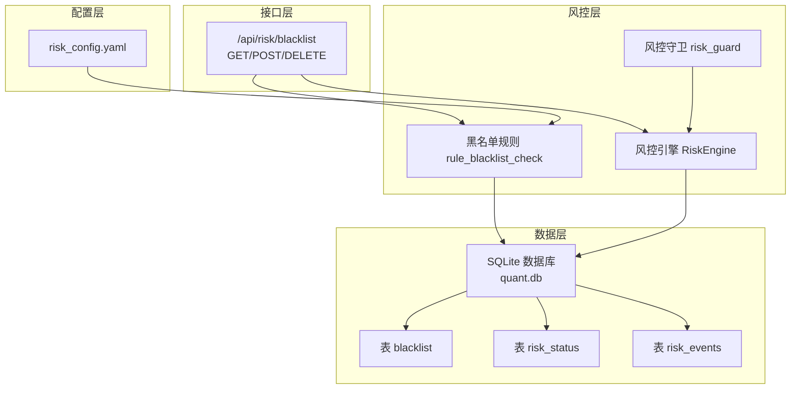
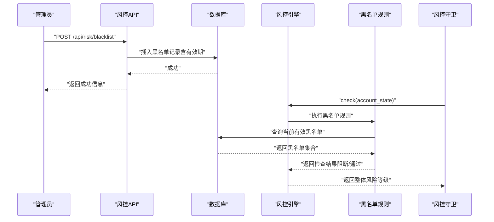
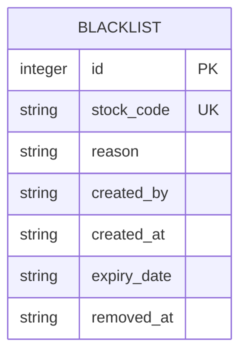
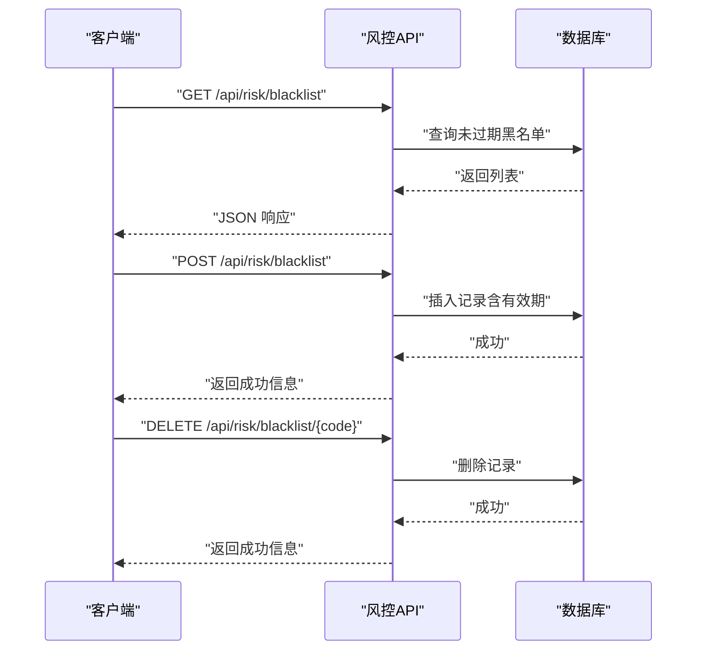
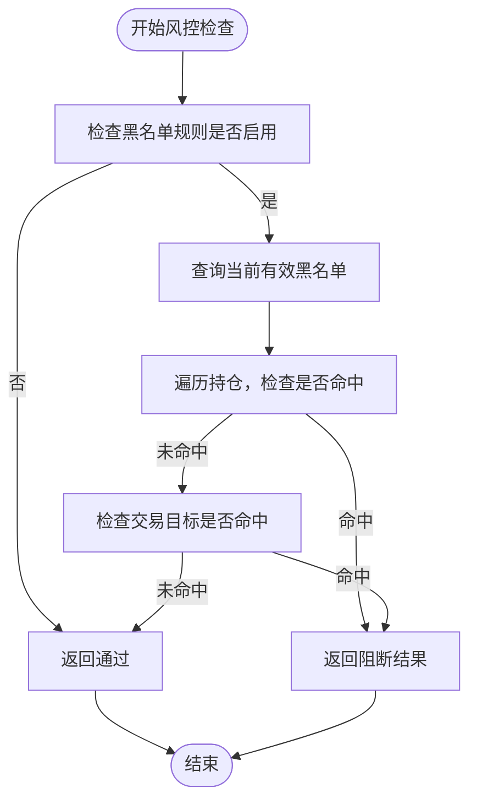
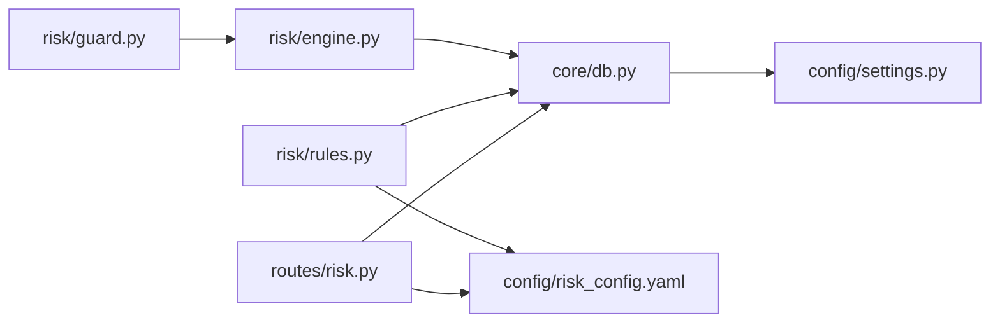

# 黑名单表

<cite>
**本文引用的文件**
- [routes/risk.py](file://routes/risk.py)
- [core/db.py](file://core/db.py)
- [risk/rules.py](file://risk/rules.py)
- [risk/engine.py](file://risk/engine.py)
- [risk/guard.py](file://risk/guard.py)
- [risk/models.py](file://risk/models.py)
- [config/risk_config.yaml](file://config/risk_config.yaml)
- [config/settings.py](file://config/settings.py)
</cite>

## 目录
1. [简介](#简介)
2. [项目结构](#项目结构)
3. [核心组件](#核心组件)
4. [架构总览](#架构总览)
5. [详细组件分析](#详细组件分析)
6. [依赖分析](#依赖分析)
7. [性能考量](#性能考量)
8. [故障排查指南](#故障排查指南)
9. [结论](#结论)
10. [附录](#附录)

## 简介
本文件围绕 AIQuant 的“黑名单表”进行系统性说明，涵盖表结构设计、字段语义、在风控体系中的作用、管理与维护流程、查询与校验方法，以及在交易执行前进行黑名单检查的实践方式。同时提供添加与移除黑名单的操作示例，覆盖临时黑名单与永久黑名单的管理策略。

## 项目结构
黑名单功能涉及如下关键模块：
- 路由层：提供黑名单的查询、添加、移除接口
- 风控规则：在风控检查中对持仓与交易目标进行黑名单校验
- 风控引擎：统一执行风控规则并生成结果
- 数据库：持久化黑名单、风控状态与事件
- 配置：黑名单默认有效期等参数通过配置文件热加载

图表来源
- [routes/risk.py:112-167](file://routes/risk.py#L112-L167)
- [risk/rules.py:334-369](file://risk/rules.py#L334-L369)
- [risk/engine.py:19-71](file://risk/engine.py#L19-L71)
- [risk/guard.py:36-92](file://risk/guard.py#L36-L92)
- [core/db.py:388-399](file://core/db.py#L388-L399)
- [config/risk_config.yaml:154-160](file://config/risk_config.yaml#L154-L160)

章节来源
- [routes/risk.py:112-167](file://routes/risk.py#L112-L167)
- [core/db.py:388-399](file://core/db.py#L388-L399)
- [risk/rules.py:334-369](file://risk/rules.py#L334-L369)
- [risk/engine.py:19-71](file://risk/engine.py#L19-L71)
- [risk/guard.py:36-92](file://risk/guard.py#L36-L92)
- [config/risk_config.yaml:154-160](file://config/risk_config.yaml#L154-L160)

## 核心组件
- 黑名单表结构与字段
  - id：自增主键
  - stock_code：股票代码，唯一约束
  - reason：列入黑名单的原因
  - created_by：创建者（默认 system）
  - created_at：创建时间
  - expiry_date：到期时间（为空表示永久有效）
  - removed_at：移除时间（用于审计追踪）
  - 索引：按 expiry_date 建立索引，加速查询与清理

- 黑名单管理接口
  - GET /api/risk/blacklist：查询当前有效的黑名单（未过期）
  - POST /api/risk/blacklist：添加股票到黑名单，支持设置有效期天数
  - DELETE /api/risk/blacklist/<stock_code>：移除指定股票的黑名单记录

- 黑名单规则
  - 在风控检查中加载当前有效的黑名单，检查持仓与交易目标是否命中
  - 命中则返回阻断级结果，阻止交易或提示移除

- 配置
  - blacklist.enabled：是否启用黑名单规则
  - blacklist.default_expiry_days：默认有效期（天），用于 POST 接口计算 expiry_date

章节来源
- [core/db.py:388-399](file://core/db.py#L388-L399)
- [routes/risk.py:112-167](file://routes/risk.py#L112-L167)
- [risk/rules.py:334-369](file://risk/rules.py#L334-L369)
- [config/risk_config.yaml:154-160](file://config/risk_config.yaml#L154-L160)

## 架构总览
黑名单在系统中的工作流如下：
- 管理端通过 API 对黑名单进行维护
- 风控引擎在每次风控检查时加载有效黑名单
- 风控规则对持仓与交易目标进行匹配，若命中则阻断
- 结果写入风控事件与风控状态表，便于审计与可视化

图表来源
- [routes/risk.py:129-152](file://routes/risk.py#L129-L152)
- [risk/rules.py:340-369](file://risk/rules.py#L340-L369)
- [risk/engine.py:19-49](file://risk/engine.py#L19-L49)
- [risk/guard.py:36-74](file://risk/guard.py#L36-L74)

## 详细组件分析

### 组件一：黑名单表结构与字段语义
- 字段说明
  - stock_code：唯一标识黑名单中的股票，作为规则匹配的关键键
  - reason：记录列入黑名单的原因，便于审计与复核
  - created_by：记录操作人，默认 system，可覆盖
  - created_at：记录创建时间，用于排序与审计
  - expiry_date：记录到期时间；为空表示永久有效；查询时仅返回未过期项
  - removed_at：记录移除时间，用于审计追踪
- 约束与索引
  - UNIQUE(stock_code)：确保同一股票不会重复列入黑名单
  - idx_blacklist_expiry(expiry_date)：加速查询与清理

图表来源
- [core/db.py:388-399](file://core/db.py#L388-L399)

章节来源
- [core/db.py:388-399](file://core/db.py#L388-L399)

### 组件二：黑名单管理接口
- 查询黑名单
  - GET /api/risk/blacklist：返回当前未过期的黑名单列表，按创建时间倒序
- 添加黑名单
  - POST /api/risk/blacklist：必填 stock_code 与 reason；可选 expiry_days（默认来自配置）
  - 插入时 expiry_date 通过 created_at 加上有效期天数组成
- 移除黑名单
  - DELETE /api/risk/blacklist/<stock_code>：删除对应记录

图表来源
- [routes/risk.py:112-167](file://routes/risk.py#L112-L167)

章节来源
- [routes/risk.py:112-167](file://routes/risk.py#L112-L167)

### 组件三：黑名单规则与风控检查
- 规则逻辑
  - 若黑名单规则未启用，直接 PASS
  - 从数据库加载当前有效黑名单（expiry_date > now）
  - 检查账户持仓中的每只股票是否在黑名单
  - 检查交易目标（trade_target）是否在黑名单
  - 命中则返回阻断级结果，给出建议与提示
- 风控引擎
  - 统一执行规则集，聚合结果并写入风控事件与风控状态表
- 风控守卫
  - 提供装饰器与直接调用两种方式，自动拦截阻断级风险

图表来源
- [risk/rules.py:334-369](file://risk/rules.py#L334-L369)
- [risk/engine.py:19-49](file://risk/engine.py#L19-L49)
- [risk/guard.py:36-74](file://risk/guard.py#L36-L74)

章节来源
- [risk/rules.py:334-369](file://risk/rules.py#L334-L369)
- [risk/engine.py:19-49](file://risk/engine.py#L19-L49)
- [risk/guard.py:36-74](file://risk/guard.py#L36-L74)

### 组件四：配置与默认行为
- 配置项
  - blacklist.enabled：控制是否启用黑名单规则
  - blacklist.default_expiry_days：默认有效期（天），用于 POST 接口计算 expiry_date
- 配置加载
  - 通过 RiskConfig 单例支持热加载，无需重启服务

章节来源
- [config/risk_config.yaml:154-160](file://config/risk_config.yaml#L154-L160)
- [risk/config_loader.py:73-126](file://risk/config_loader.py#L73-L126)

### 组件五：数据库与持久化
- 数据库路径
  - DB_PATH：指向 core/quant.db
- 关键表
  - blacklist：黑名单记录
  - risk_status：风控状态快照
  - risk_events：风控事件明细
- 索引
  - idx_blacklist_expiry：按到期时间建立索引，优化查询与清理

章节来源
- [config/settings.py:7-8](file://config/settings.py#L7-L8)
- [core/db.py:388-399](file://core/db.py#L388-L399)

## 依赖分析
- 组件耦合
  - 路由层依赖数据库连接与配置
  - 风控规则依赖数据库与配置
  - 风控引擎与守卫依赖规则集合
- 外部依赖
  - SQLite 数据库（quant.db）
  - Flask 蓝图（Blueprint）

图表来源
- [routes/risk.py:112-167](file://routes/risk.py#L112-L167)
- [risk/rules.py:334-369](file://risk/rules.py#L334-L369)
- [risk/engine.py:19-49](file://risk/engine.py#L19-L49)
- [risk/guard.py:36-74](file://risk/guard.py#L36-L74)
- [core/db.py:388-399](file://core/db.py#L388-L399)
- [config/risk_config.yaml:154-160](file://config/risk_config.yaml#L154-L160)
- [config/settings.py:7-8](file://config/settings.py#L7-L8)

## 性能考量
- 查询效率
  - 使用 idx_blacklist_expiry 索引，避免全表扫描
  - 查询时仅取未过期项，减少无效数据处理
- 写入效率
  - 使用上下文管理器与事务封装，保证一致性
- 规则执行
  - 黑名单规则仅在启用时执行，避免不必要的数据库访问
- 配置热加载
  - 通过文件修改时间检测，按需重新加载，降低开销

## 故障排查指南
- 常见问题
  - 添加黑名单时报错：检查 stock_code 与 reason 是否为空，确认 operator 与 expiry_days 参数
  - 查询不到黑名单：确认 expiry_date 是否已过期，或数据库连接是否正确
  - 风控未拦截：确认 blacklist.enabled 是否为 true，且规则已注册
- 审计与定位
  - 查看 risk_events 与 risk_status 表，定位具体规则与时间点
  - 检查 created_by 与 created_at 字段，确认操作人与时间

章节来源
- [routes/risk.py:137-152](file://routes/risk.py#L137-L152)
- [risk/engine.py:73-127](file://risk/engine.py#L73-L127)

## 结论
黑名单表为 AIQuant 的风控体系提供了基础而关键的能力：通过明确的字段定义、完善的接口与规则集成，实现了对违规或高风险股票的快速封禁与动态管理。配合配置热加载与数据库索引，系统在可用性与性能之间取得良好平衡。建议在生产环境中结合业务需求合理设置默认有效期，并完善审计与告警机制。

## 附录

### 使用示例与最佳实践
- 添加临时黑名单
  - 请求：POST /api/risk/blacklist
  - 参数：stock_code、reason、expiry_days（如 7 表示一周）
  - 效果：记录有效期为 7 天的黑名单
- 添加永久黑名单
  - 请求：POST /api/risk/blacklist
  - 参数：stock_code、reason、expiry_days 传空或 0
  - 效果：不设置到期时间，视为永久有效
- 移除黑名单
  - 请求：DELETE /api/risk/blacklist/<stock_code>
  - 效果：删除对应记录，恢复交易权限
- 交易前黑名单检查
  - 方式一：使用风控守卫装饰器，自动拦截阻断级风险
  - 方式二：直接调用风控检查接口，获取整体风险等级与详情
  - 方式三：在下单前手动构建 account_state 并调用风控引擎

章节来源
- [routes/risk.py:112-167](file://routes/risk.py#L112-L167)
- [risk/guard.py:36-92](file://risk/guard.py#L36-L92)
- [risk/engine.py:51-71](file://risk/engine.py#L51-L71)
- [config/risk_config.yaml:154-160](file://config/risk_config.yaml#L154-L160)