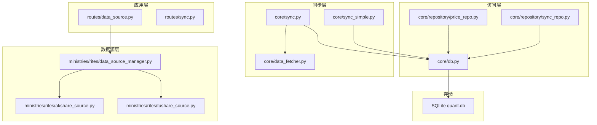
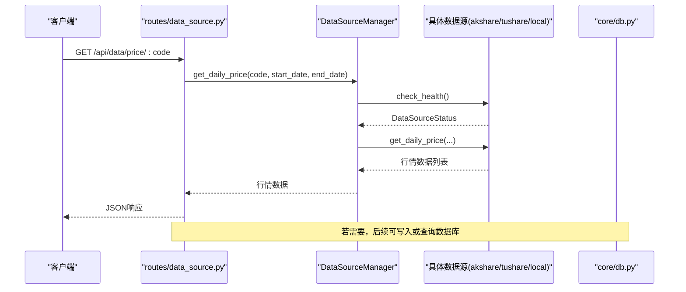
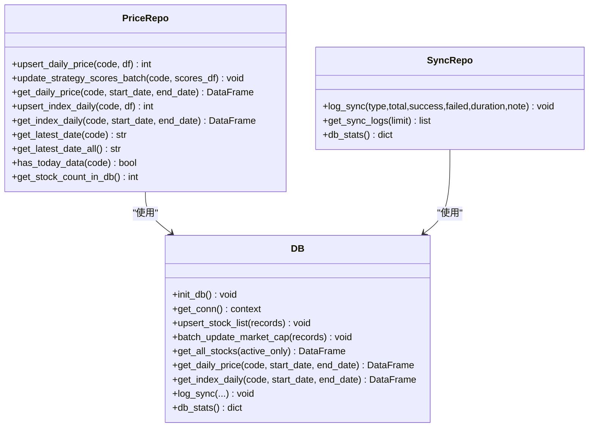
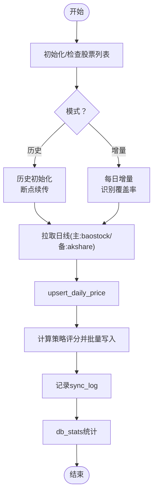
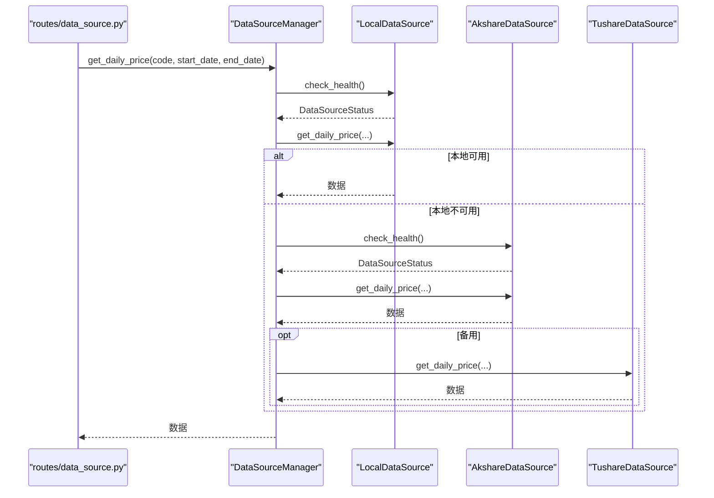
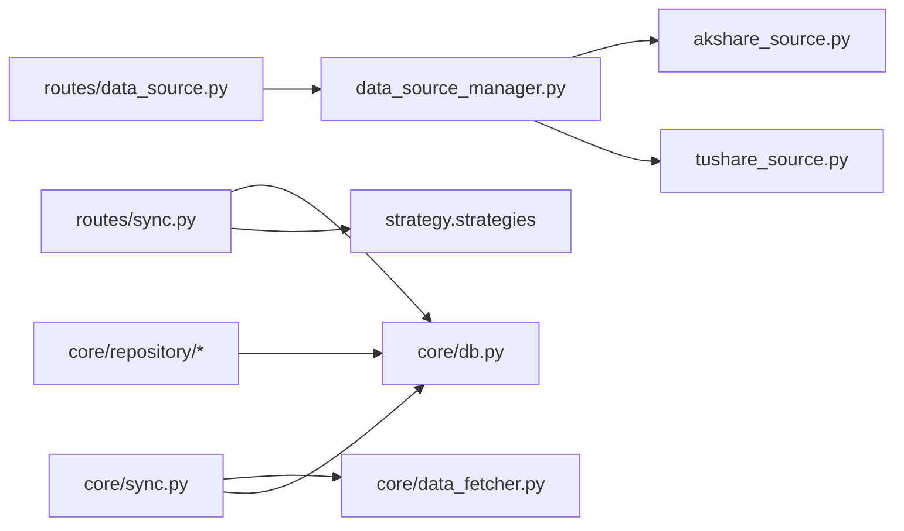

# 数据管理

<cite>
**本文引用的文件**
- [core/db.py](file://core/db.py)
- [core/sync.py](file://core/sync.py)
- [core/sync_simple.py](file://core/sync_simple.py)
- [core/data_fetcher.py](file://core/data_fetcher.py)
- [core/audit.py](file://core/audit.py)
- [core/repository/price_repo.py](file://core/repository/price_repo.py)
- [core/repository/sync_repo.py](file://core/repository/sync_repo.py)
- [ministries/rites/data_source_manager.py](file://ministries/rites/data_source_manager.py)
- [ministries/rites/akshare_source.py](file://ministries/rites/akshare_source.py)
- [ministries/rites/tushare_source.py](file://ministries/rites/tushare_source.py)
- [routes/data_source.py](file://routes/data_source.py)
- [routes/sync.py](file://routes/sync.py)
- [config/settings.py](file://config/settings.py)
</cite>

## 目录
1. [简介](#简介)
2. [项目结构](#项目结构)
3. [核心组件](#核心组件)
4. [架构总览](#架构总览)
5. [详细组件分析](#详细组件分析)
6. [依赖分析](#依赖分析)
7. [性能考量](#性能考量)
8. [故障排查指南](#故障排查指南)
9. [结论](#结论)
10. [附录](#附录)

## 简介
本文件面向AIQuant的数据管理系统，系统采用本地SQLite作为主存储，围绕“数据源接入-数据同步-数据访问层-策略评分-审计日志”构建完整闭环。文档覆盖数据库设计、仓库模式实现、数据同步与质量保障、生命周期管理、实体关系与索引设计、数据访问与缓存策略、迁移与版本管理、安全与隐私、ETL与验证规则、备份恢复与监控告警等主题。

## 项目结构
- 存储层：SQLite数据库，位于core目录下，包含多张业务表（股票基础、日线行情、指数、信号、风控、审计等）。
- 数据源层：支持baostock为主、akshare/tushare为辅的多源接入，并提供统一的DataSourceManager。
- 同步层：提供历史初始化与每日增量同步，具备断点续传、覆盖率校验、缓存与重试。
- 访问层：提供Repository按表拆分的数据访问层，同时保留core.db作为兼容层。
- 路由层：对外暴露数据源健康检查、主数据源切换、行情查询、策略评分补算等API。
- 配置层：集中管理数据库路径、定时任务时间、同步批大小等。



图表来源
- [routes/data_source.py:1-112](file://routes/data_source.py#L1-L112)
- [ministries/rites/data_source_manager.py:1-190](file://ministries/rites/data_source_manager.py#L1-L190)
- [ministries/rites/akshare_source.py:1-135](file://ministries/rites/akshare_source.py#L1-L135)
- [ministries/rites/tushare_source.py:1-167](file://ministries/rites/tushare_source.py#L1-L167)
- [core/sync.py:1-760](file://core/sync.py#L1-L760)
- [core/sync_simple.py:1-173](file://core/sync_simple.py#L1-L173)
- [core/data_fetcher.py:1-578](file://core/data_fetcher.py#L1-L578)
- [core/repository/price_repo.py:1-237](file://core/repository/price_repo.py#L1-L237)
- [core/repository/sync_repo.py:1-55](file://core/repository/sync_repo.py#L1-L55)
- [core/db.py:1-1213](file://core/db.py#L1-L1213)

章节来源
- [config/settings.py:1-25](file://config/settings.py#L1-L25)

## 核心组件
- 数据库与Schema：定义了股票基础、日线行情、指数、信号、风控、审计、账户快照、融资融券、北向资金、指数期货、龙虎榜、高管持股等表及索引。
- 仓库模式：按表拆分的Repository层，封装CRUD与常用查询，降低耦合。
- 数据同步：历史初始化与每日增量同步，支持断点续传、覆盖率校验、缓存与重试。
- 数据源管理：统一抽象与健康检查，支持主备切换与自动降级。
- 审计日志：统一记录用户行为、结果与耗时，便于合规与追踪。
- ETL与策略评分：从原始行情计算策略评分并落库，支持全量补算与写入信号表。

章节来源
- [core/db.py:57-467](file://core/db.py#L57-L467)
- [core/repository/price_repo.py:1-237](file://core/repository/price_repo.py#L1-L237)
- [core/repository/sync_repo.py:1-55](file://core/repository/sync_repo.py#L1-L55)
- [core/sync.py:319-760](file://core/sync.py#L319-L760)
- [ministries/rites/data_source_manager.py:111-190](file://ministries/rites/data_source_manager.py#L111-L190)
- [core/audit.py:16-147](file://core/audit.py#L16-L147)

## 架构总览
系统采用“路由-数据源管理-同步-访问-存储”的分层架构。路由层负责对外服务，数据源管理器统一对接多数据源并提供健康检查与主备切换；同步层负责历史与增量数据拉取、策略评分计算与落库；访问层提供Repository与兼容层db接口；存储层为SQLite本地数据库。



图表来源
- [routes/data_source.py:89-112](file://routes/data_source.py#L89-L112)
- [ministries/rites/data_source_manager.py:153-178](file://ministries/rites/data_source_manager.py#L153-L178)

## 详细组件分析

### 数据库设计与表结构
- stock_info：股票基础信息，主键为code，包含is_active与updated_at。
- daily_price：日线行情，复合唯一索引(code, trade_date)，并建立(code, trade_date)与(trade_date)索引。
- index_daily：指数日线，复合唯一索引(code, trade_date)，并建立索引。
- stock_signal：策略扫描推荐记录，包含触发因子列表与买卖建议，唯一索引(scan_date, code)。
- signal_records：历史信号表（兼容）。
- sync_log：同步日志，记录每次同步的总量、成功、失败、耗时与备注。
- positions/trades/account_snapshots：持仓、交易与账户快照。
- stock_margin/stock_margin_detail/stock_hsgt_north/index_futures：融资融券、北向资金、指数期货。
- stock_lhb_detail/stock_mgmt_holding：龙虎榜与高管持股。
- risk_events/risk_status/risk_overrides/blacklist：风控事件、风控状态、风控豁免与黑名单。
- audit_log：审计日志。

```mermaid
erDiagram
STOCK_INFO {
text code PK
text name
text market
integer is_active
text updated_at
}
DAILY_PRICE {
integer id PK
text code
text trade_date
real open
real high
real low
real close
real volume
real amount
real pct_change
real turnover
real vol_score
real ma_score
real diverge_score
real bottom_score
real whale_score
real fusion_score
unique code trade_date
}
INDEX_DAILY {
integer id PK
text code
text trade_date
real open
real high
real low
real close
real volume
real amount
real pct_change
unique code trade_date
}
STOCK_SIGNAL {
integer id PK
text scan_date
text trade_date
text code
text name
real price
real fusion_score
real vol_score
real ma_score
real diverge_score
real bottom_score
real whale_score
text trigger_list
real buy_price
real stop_loss
real take_profit
integer buy_volume
real buy_money
integer sent_wechat
text created_at
unique scan_date code
}
SYNC_LOG {
integer id PK
text sync_time
text sync_type
integer total
integer success
integer failed
real duration_s
text note
}
POSITIONS {
integer id PK
text code
text name
text entry_date
real entry_price
integer shares
real current_price
real stop_loss
real take_profit
text position_type
text status
text strategy
text note
text created_at
text updated_at
real commission
}
TRADES {
integer id PK
integer position_id
text code
text name
text trade_date
text direction
real price
integer shares
real amount
real commission
real slippage
text reason
text note
text created_at
}
ACCOUNT_SNAPSHOTS {
integer id PK
text snapshot_date
real total_assets
real cash
real position_value
integer positions_count
real total_cost
real total_pnl
real pnl_pct
text created_at
}
STOCK_MARGIN {
integer id PK
text trade_date
real sse_margin_balance
real sse_margin_buy
real sse_short_balance
real sse_short_volume
real szse_margin_balance
real szse_margin_buy
real szse_short_balance
real szse_short_volume
real szse_margin_ratio
real total_margin_balance
real total_margin_buy
real total_short_balance
real total_margin
unique trade_date
}
STOCK_MARGIN_DETAIL {
integer id PK
text code
text trade_date
text name
text exchange
real margin_balance
real margin_buy
real margin_repay
real short_volume
real short_sell
real short_repay
real short_balance
real total_balance
unique code trade_date
}
STOCK_HSGT_NORTH {
integer id PK
text trade_date
real north_net_buy
real north_buy_amt
real north_sell_amt
real north_cum_net
real north_daily_flow
real north_balance
real north_market_cap
real hgt_net_buy
real hgt_buy_amt
real hgt_sell_amt
real hgt_cum_net
real hgt_daily_flow
real sgt_net_buy
real sgt_buy_amt
real sgt_sell_amt
real sgt_cum_net
real sgt_daily_flow
unique trade_date
}
INDEX_FUTURES {
integer id PK
text trade_date
text symbol
text variety
real open
real high
real low
real close
real volume
real open_interest
real turnover
real settle
real pre_settle
unique trade_date symbol
}
STOCK_LHB_DETAIL {
integer id PK
text trade_date
text code
text name
real close_price
real pct_change
real net_buy
real buy_amt
real sell_amt
real total_amt
real mkt_total_amt
real net_buy_ratio
real turnover_rate
real float_mkt_cap
text reason
real perf_1d
real perf_2d
real perf_5d
real perf_10d
unique trade_date code
}
STOCK_MGMT_HOLDING {
integer id PK
text trade_date
text code
text name
text changer
real change_shares
real avg_price
real change_amount
text change_reason
real change_ratio
real shares_after
text share_type
text executive_name
text position
text relation
unique trade_date code changer change_shares avg_price
}
RISK_EVENTS {
integer id PK
text pipeline_id
text rule_name
text category
text level
text message
real metric_value
real threshold
text suggestion
text created_at
}
RISK_STATUS {
text account_id PK
text overall_level
text active_rules
real current_drawdown
integer current_positions
real total_exposure
real available_capital
text last_check
text block_reason
text updated_at
}
RISK_OVERRIDES {
integer id PK
text rule_name
text reason
text operator
text approver
text status
text created_at
text expires_at
text approved_at
}
BLACKLIST {
integer id PK
text stock_code
text reason
text created_by
text created_at
text expiry_date
text removed_at
unique stock_code
}
AUDIT_LOG {
integer id PK
text user_id
text action
text resource
text detail
text ip_address
text created_at
}
STOCK_INFO ||--o{ DAILY_PRICE : "拥有"
STOCK_INFO ||--o{ STOCK_MARGIN_DETAIL : "对应"
STOCK_INFO ||--o{ STOCK_LHB_DETAIL : "对应"
STOCK_INFO ||--o{ STOCK_MGMT_HOLDING : "对应"
DAILY_PRICE ||--o{ TRADES : "被交易"
POSITIONS ||--o{ TRADES : "关联"
```

图表来源
- [core/db.py:61-427](file://core/db.py#L61-L427)

章节来源
- [core/db.py:57-467](file://core/db.py#L57-L467)

### 仓库模式与数据访问层
- Repository按表拆分，提供upsert、查询、统计等方法，屏蔽SQL细节。
- price_repo：封装daily_price与index_daily的写入、查询与统计。
- sync_repo：封装sync_log写入与数据库统计查询。
- 兼容层core.db：提供历史接口，新代码优先使用repository。



图表来源
- [core/repository/price_repo.py:13-237](file://core/repository/price_repo.py#L13-L237)
- [core/repository/sync_repo.py:18-55](file://core/repository/sync_repo.py#L18-L55)
- [core/db.py:57-800](file://core/db.py#L57-L800)

章节来源
- [core/repository/price_repo.py:1-237](file://core/repository/price_repo.py#L1-L237)
- [core/repository/sync_repo.py:1-55](file://core/repository/sync_repo.py#L1-L55)
- [core/db.py:57-800](file://core/db.py#L57-L800)

### 数据同步机制与质量保证
- 历史初始化：基于baostock主数据源，支持断点续传与覆盖率校验，自动跳过ST/退市/北交所不支持股票。
- 每日增量：单线程（baostock不支持多线程），自动识别最近交易日并补齐缺失日期，支持最小覆盖率阈值。
- 策略评分：对历史全量计算5策略评分与融合分，批量写入daily_price，便于回测直接读取。
- 缓存与重试：同步缓存文件用于断点续传，失败重试与降级（akshare/tushare）。
- 质量监控：sync_log记录每次同步的统计信息，db_stats提供数据库概览。



图表来源
- [core/sync.py:319-760](file://core/sync.py#L319-L760)
- [core/sync_simple.py:24-91](file://core/sync_simple.py#L24-L91)
- [core/repository/sync_repo.py:18-55](file://core/repository/sync_repo.py#L18-L55)

章节来源
- [core/sync.py:39-760](file://core/sync.py#L39-L760)
- [core/sync_simple.py:1-173](file://core/sync_simple.py#L1-L173)
- [core/repository/sync_repo.py:1-55](file://core/repository/sync_repo.py#L1-L55)

### 数据源集成与ETL流程
- 数据源抽象：BaseDataSource定义统一接口，Local/Akshare/Tushare分别实现。
- 健康检查：DataSourceManager对所有数据源执行check_health，记录可用性与质量等级。
- ETL流程：从数据源获取原始数据→标准化列名→写入数据库→计算策略评分→生成信号记录。
- 主数据源切换：支持通过API动态切换主数据源并记录审计日志。



图表来源
- [routes/data_source.py:89-112](file://routes/data_source.py#L89-L112)
- [ministries/rites/data_source_manager.py:153-178](file://ministries/rites/data_source_manager.py#L153-L178)
- [ministries/rites/akshare_source.py:45-82](file://ministries/rites/akshare_source.py#L45-L82)
- [ministries/rites/tushare_source.py:65-104](file://ministries/rites/tushare_source.py#L65-L104)

章节来源
- [ministries/rites/data_source_manager.py:1-190](file://ministries/rites/data_source_manager.py#L1-L190)
- [ministries/rites/akshare_source.py:1-135](file://ministries/rites/akshare_source.py#L1-L135)
- [ministries/rites/tushare_source.py:1-167](file://ministries/rites/tushare_source.py#L1-L167)
- [routes/data_source.py:1-112](file://routes/data_source.py#L1-L112)

### 数据生命周期管理
- 创建：init_db自动建表与索引，迁移辅助函数安全添加列。
- 更新：upsert写入/更新，批量更新市值、策略评分。
- 归档/清理：通过索引与查询优化，结合策略评分阈值筛选有效信号。
- 统计：db_stats提供股票数、记录数、最早/最晚日期、数据库大小。

章节来源
- [core/db.py:57-467](file://core/db.py#L57-L467)
- [core/repository/sync_repo.py:36-55](file://core/repository/sync_repo.py#L36-L55)

### 数据模型与索引设计
- 主键与唯一约束：多数表采用自增主键；关键维度组合采用唯一索引，避免重复。
- 查询索引：按高频查询维度建立索引，如daily_price(code, trade_date)、index_daily(code, trade_date)、stock_signal(scan_date, code)等。
- 复合唯一：如daily_price、index_daily、stock_signal、stock_margin、stock_hsgt_north、index_futures、stock_lhb_detail、stock_mgmt_holding等。

章节来源
- [core/db.py:92-427](file://core/db.py#L92-L427)

### 数据访问模式与缓存策略
- 访问模式：Repository按表封装CRUD，统一返回DataFrame或字典列表；兼容层提供便捷函数。
- 缓存策略：本地CSV缓存导入、数据源接口缓存文件、同步缓存断点续传。
- 性能优化：批量写入executemany、PRAGMA WAL与同步级别、索引覆盖查询。

章节来源
- [core/repository/price_repo.py:13-237](file://core/repository/price_repo.py#L13-L237)
- [core/sync_simple.py:24-91](file://core/sync_simple.py#L24-L91)
- [core/sync.py:422-460](file://core/sync.py#L422-L460)

### 数据迁移路径与版本管理
- 迁移辅助：_safe_add_column安全添加列，避免重复执行报错。
- 唯一索引重建：修正stock_signal唯一索引，确保幂等。
- 字段演进：为daily_price与positions补充策略评分与手续费字段，兼容历史数据。

章节来源
- [core/db.py:45-467](file://core/db.py#L45-L467)

### 数据安全、隐私与访问控制
- 审计日志：统一记录操作、资源、详情、IP与结果，支持查询与分页。
- 访问控制：路由层可结合Flask中间件实现鉴权，审计日志记录操作人与结果。
- 隐私保护：不存储敏感个人身份信息，仅记录必要审计元数据。

章节来源
- [core/audit.py:16-147](file://core/audit.py#L16-L147)

### 数据验证规则
- 数据源质量：DataSourceStatus记录可用性与质量等级，支持健康检查。
- 同步质量：覆盖率阈值与断点续传，避免部分股票缺失。
- 行情完整性：过滤空值与异常值，确保close>0、dropna等。

章节来源
- [ministries/rites/data_source_manager.py:136-152](file://ministries/rites/data_source_manager.py#L136-L152)
- [core/sync.py:494-522](file://core/sync.py#L494-L522)
- [core/data_fetcher.py:129-133](file://core/data_fetcher.py#L129-L133)

### 备份恢复、监控告警与故障排查
- 备份恢复：SQLite为单文件，可直接复制quant.db进行备份；生产环境建议定期归档。
- 监控告警：sync_log记录耗时与成功率；db_stats输出数据库规模与覆盖度；可结合外部监控系统上报。
- 故障排查：查看同步日志、健康检查结果、审计日志；定位数据源可用性与网络问题；核对索引与唯一约束。

章节来源
- [core/repository/sync_repo.py:18-55](file://core/repository/sync_repo.py#L18-L55)
- [core/audit.py:107-147](file://core/audit.py#L107-L147)

## 依赖分析
- 路由依赖：routes/data_source.py依赖DataSourceManager；routes/sync.py依赖策略与db接口。
- 数据源依赖：DataSourceManager依赖akshare/tushare实现；LocalDataSource依赖core.db。
- 同步依赖：core/sync.py依赖core/data_fetcher与core/db；支持baostock与akshare双源。
- 访问层依赖：Repository依赖core/db连接与SQL；兼容层提供统一接口。



图表来源
- [routes/data_source.py:1-112](file://routes/data_source.py#L1-L112)
- [routes/sync.py:1-140](file://routes/sync.py#L1-L140)
- [core/sync.py:1-760](file://core/sync.py#L1-L760)
- [core/data_fetcher.py:1-578](file://core/data_fetcher.py#L1-L578)
- [ministries/rites/data_source_manager.py:1-190](file://ministries/rites/data_source_manager.py#L1-L190)
- [ministries/rites/akshare_source.py:1-135](file://ministries/rites/akshare_source.py#L1-L135)
- [ministries/rites/tushare_source.py:1-167](file://ministries/rites/tushare_source.py#L1-L167)
- [core/repository/price_repo.py:1-237](file://core/repository/price_repo.py#L1-L237)

## 性能考量
- 并发与锁：SQLite使用WAL与适度同步级别平衡性能与一致性；批量写入优于逐条插入。
- 索引优化：针对高频查询建立复合索引，减少全表扫描。
- 数据源降级：主数据源失败自动降级至备用，保障可用性。
- 缓存利用：本地CSV缓存与接口缓存文件减少网络请求。
- 批处理：同步批大小与批次间隔控制请求频率，避免触发限流。

## 故障排查指南
- 数据源不可用：检查DataSourceManager健康检查结果，确认token与网络。
- 同步失败：查看sync_log与db_stats，核对覆盖率与断点缓存；检查baostock登录状态。
- 查询慢：确认索引是否存在，避免在未索引列上过滤；使用批量查询与分页。
- 审计日志异常：确认审计装饰器使用正确，检查IP与用户ID提取逻辑。

章节来源
- [core/audit.py:41-92](file://core/audit.py#L41-L92)
- [core/repository/sync_repo.py:28-34](file://core/repository/sync_repo.py#L28-L34)

## 结论
AIQuant数据管理系统以SQLite为核心，通过多数据源接入与统一管理、完善的仓库模式与ETL流程、严格的同步与质量保障机制，实现了从数据采集到策略评分与信号落地的全链路闭环。配合审计日志与监控指标，满足合规与运维需求。建议持续完善主数据源稳定性与索引策略，加强异常告警与自动化修复能力。

## 附录
- 配置项参考：数据库路径、API监听、定时任务、同步批大小、日志级别等。

章节来源
- [config/settings.py:1-25](file://config/settings.py#L1-L25)