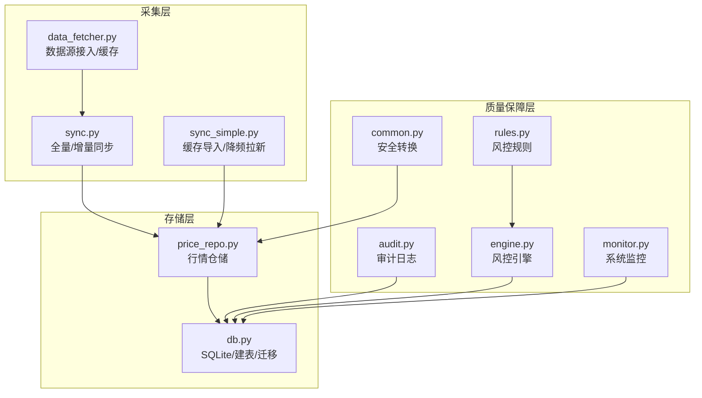
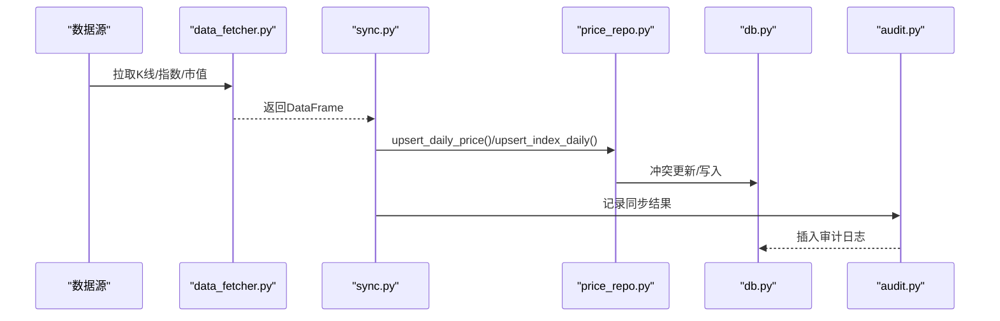
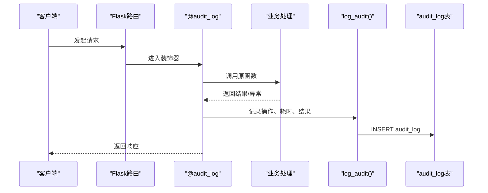
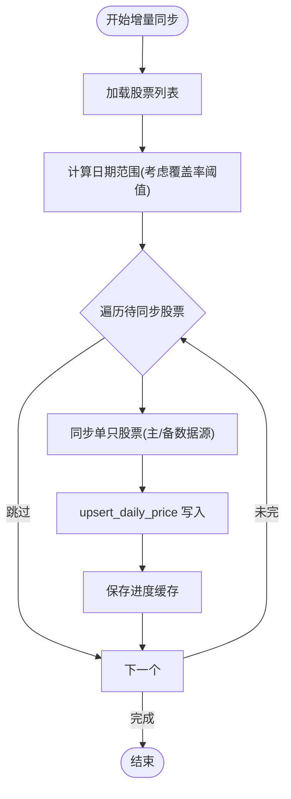
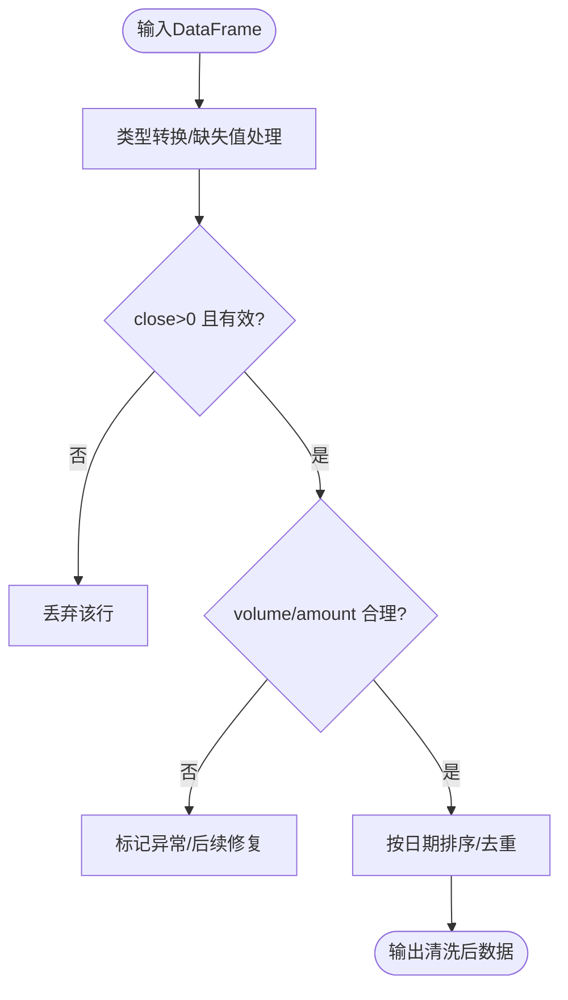
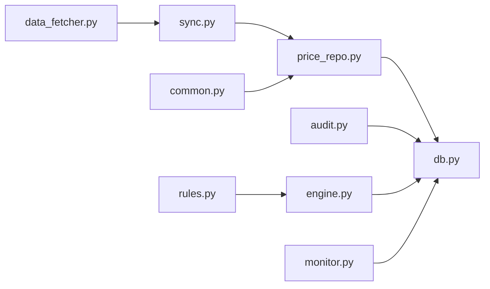

# 数据质量保证

<cite>
**本文档引用的文件**
- [core/audit.py](file://core/audit.py)
- [routes/audit.py](file://routes/audit.py)
- [core/db.py](file://core/db.py)
- [core/data_fetcher.py](file://core/data_fetcher.py)
- [core/sync.py](file://core/sync.py)
- [core/sync_simple.py](file://core/sync_simple.py)
- [core/repository/price_repo.py](file://core/repository/price_repo.py)
- [utils/finance_data.py](file://utils/finance_data.py)
- [risk/rules.py](file://risk/rules.py)
- [risk/engine.py](file://risk/engine.py)
- [ministries/works/monitor.py](file://ministries/works/monitor.py)
- [routes/common.py](file://routes/common.py)
- [config/settings.py](file://config/settings.py)
</cite>

## 目录
1. [简介](#简介)
2. [项目结构](#项目结构)
3. [核心组件](#核心组件)
4. [架构总览](#架构总览)
5. [详细组件分析](#详细组件分析)
6. [依赖分析](#依赖分析)
7. [性能考虑](#性能考虑)
8. [故障排查指南](#故障排查指南)
9. [结论](#结论)
10. [附录](#附录)

## 简介
本文件面向AIQuant项目的“数据质量保证体系”，围绕以下目标展开：建立数据完整性、一致性与异常检测机制；设计并实现审计日志（AuditLog）以满足操作追踪与合规需求；制定金融数据验证规则（价格范围、成交量合理性、时间序列完整性）；给出数据清洗与修复策略（缺失值、异常值、标准化）；明确数据版本与变更控制；定义数据质量指标与监控仪表板；提供问题定位、分析与解决流程；并总结改进建议与最佳实践。

## 项目结构
AIQuant采用分层架构，数据质量相关能力分布在如下层次：
- 数据采集层：数据源接入与缓存（baostock/akshare），本地CSV缓存导入
- 数据存储层：SQLite本地数据库，统一建表与迁移
- 数据服务层：数据同步与策略评分写入，数据仓库（Repository）封装
- 质量保障层：审计日志、风控规则、系统监控、通用安全转换工具
- 风险与治理：风控引擎与规则库，质量评分引擎（治理中枢）

图示来源
- [core/data_fetcher.py:1-578](file://core/data_fetcher.py#L1-L578)
- [core/sync.py:1-760](file://core/sync.py#L1-L760)
- [core/sync_simple.py:1-173](file://core/sync_simple.py#L1-L173)
- [core/db.py:1-800](file://core/db.py#L1-L800)
- [core/repository/price_repo.py:1-237](file://core/repository/price_repo.py#L1-L237)
- [core/audit.py:1-147](file://core/audit.py#L1-L147)
- [risk/rules.py:1-388](file://risk/rules.py#L1-L388)
- [risk/engine.py:1-71](file://risk/engine.py#L1-L71)
- [ministries/works/monitor.py:1-113](file://ministries/works/monitor.py#L1-L113)
- [routes/common.py:1-31](file://routes/common.py#L1-L31)

章节来源
- [core/data_fetcher.py:1-578](file://core/data_fetcher.py#L1-L578)
- [core/sync.py:1-760](file://core/sync.py#L1-L760)
- [core/sync_simple.py:1-173](file://core/sync_simple.py#L1-L173)
- [core/db.py:1-800](file://core/db.py#L1-L800)
- [core/repository/price_repo.py:1-237](file://core/repository/price_repo.py#L1-L237)
- [core/audit.py:1-147](file://core/audit.py#L1-L147)
- [risk/rules.py:1-388](file://risk/rules.py#L1-L388)
- [risk/engine.py:1-71](file://risk/engine.py#L1-L71)
- [ministries/works/monitor.py:1-113](file://ministries/works/monitor.py#L1-L113)
- [routes/common.py:1-31](file://routes/common.py#L1-L31)

## 核心组件
- 审计日志（AuditLog）：统一记录用户操作、资源、结果与耗时，支持查询与统计
- 数据同步与校验：主/备数据源、断点续传、覆盖率阈值、策略评分写入
- 仓储层（Repository）：统一写入/读取，冲突更新，日期一致性
- 风控规则与引擎：集中化阈值配置，分级告警，事件落库
- 系统监控：CPU/内存/磁盘/数据库大小等指标采集与告警
- 金融数据工具：财务字段懒创建、换手率计算、安全数值转换

章节来源
- [core/audit.py:16-147](file://core/audit.py#L16-L147)
- [routes/audit.py:1-79](file://routes/audit.py#L1-L79)
- [core/sync.py:39-769](file://core/sync.py#L39-L769)
- [core/repository/price_repo.py:13-237](file://core/repository/price_repo.py#L13-L237)
- [risk/rules.py:34-387](file://risk/rules.py#L34-L387)
- [risk/engine.py:13-71](file://risk/engine.py#L13-L71)
- [ministries/works/monitor.py:29-113](file://ministries/works/monitor.py#L29-L113)
- [utils/finance_data.py:87-262](file://utils/finance_data.py#L87-L262)
- [routes/common.py:9-31](file://routes/common.py#L9-L31)

## 架构总览
数据质量保证贯穿“采集-存储-服务-监控-治理”全链路，形成闭环：
- 采集阶段：多源降级、缓存优先、断点续传
- 存储阶段：唯一约束、冲突更新、索引优化
- 服务阶段：策略评分写入、安全转换、审计埋点
- 监控阶段：系统指标、风控事件、审计统计
- 治理阶段：规则配置化、分级处置、合规留痕

图示来源
- [core/data_fetcher.py:173-424](file://core/data_fetcher.py#L173-L424)
- [core/sync.py:549-668](file://core/sync.py#L549-L668)
- [core/repository/price_repo.py:13-167](file://core/repository/price_repo.py#L13-L167)
- [core/db.py:543-774](file://core/db.py#L543-L774)
- [core/audit.py:16-39](file://core/audit.py#L16-L39)

## 详细组件分析

### 审计日志（AuditLog）设计与实现
- 记录要素：用户ID、操作动作、资源、详情、IP、时间、结果
- 装饰器模式：对API自动埋点，自动提取结果状态与耗时
- 查询接口：支持按动作/用户过滤、分页、总数统计
- 存储位置：独立审计日志表，带时间索引

图示来源
- [core/audit.py:41-92](file://core/audit.py#L41-L92)
- [core/audit.py:16-39](file://core/audit.py#L16-L39)
- [routes/audit.py:16-79](file://routes/audit.py#L16-L79)

章节来源
- [core/audit.py:16-147](file://core/audit.py#L16-L147)
- [routes/audit.py:1-79](file://routes/audit.py#L1-L79)

### 数据完整性检查与一致性验证
- 唯一约束：按(code, trade_date)去重，避免重复写入
- 断点续传：缓存文件与进度记录，失败可恢复
- 覆盖率阈值：每日增量同步时，按全市场覆盖比例决定日期窗口
- 日期一致性：统一格式转换、排序、索引，保证时间序列连续性

图示来源
- [core/sync.py:462-668](file://core/sync.py#L462-L668)
- [core/repository/price_repo.py:13-47](file://core/repository/price_repo.py#L13-L47)

章节来源
- [core/sync.py:39-769](file://core/sync.py#L39-L769)
- [core/repository/price_repo.py:13-237](file://core/repository/price_repo.py#L13-L237)

### 金融数据验证规则
- 价格范围检查：剔除close<=0、NaN/Inf等无效值
- 成交量合理性：volume/amount非负，turnover>0时进行一致性校验
- 时间序列完整性：按交易日排序，缺失日期补零或标记，索引唯一
- 换手率计算：基于流通股本，若未知则返回None，避免误用

图示来源
- [core/data_fetcher.py:113-133](file://core/data_fetcher.py#L113-L133)
- [routes/common.py:9-31](file://routes/common.py#L9-L31)
- [utils/finance_data.py:145-162](file://utils/finance_data.py#L145-L162)

章节来源
- [core/data_fetcher.py:79-167](file://core/data_fetcher.py#L79-L167)
- [routes/common.py:9-31](file://routes/common.py#L9-L31)
- [utils/finance_data.py:145-162](file://utils/finance_data.py#L145-L162)

### 数据清洗与修复策略
- 缺失值处理：数值列NaN转默认值或丢弃，列存在性惰性探测
- 异常值检测：基于风控规则阈值（如最大回撤、单股集中度、波动率）识别异常
- 数据标准化：统一列名、日期格式、数值精度，安全转换工具保障JSON序列化
- 修复建议：对缺失/异常数据打标，结合历史窗口与跨源数据进行插补或替换

章节来源
- [routes/common.py:9-31](file://routes/common.py#L9-L31)
- [utils/finance_data.py:36-81](file://utils/finance_data.py#L36-L81)
- [risk/rules.py:34-387](file://risk/rules.py#L34-L387)

### 数据版本管理与变更控制
- 版本演进：通过迁移脚本（ALTER TABLE）安全增加列，兼容旧版本
- 变更记录：同步日志表记录每次同步的总量、成功、失败、耗时
- 审计追踪：审计日志记录每次写入/更新的资源与结果，便于回溯

章节来源
- [core/db.py:429-466](file://core/db.py#L429-L466)
- [core/db.py:156-166](file://core/db.py#L156-L166)
- [core/audit.py:16-39](file://core/audit.py#L16-L39)

### 数据质量指标与监控仪表板
- 指标定义
  - 数据完整性：覆盖率（按交易日覆盖比例）、缺失率、异常率
  - 数据一致性：重复记录比率、字段缺失率、格式错误率
  - 数据可用性：同步成功率、平均耗时、数据库大小
  - 风控事件：规则触发次数、级别分布、阻断率
- 监控仪表板建议
  - 实时看板：CPU/内存/磁盘/数据库大小、同步成功率、风控事件趋势
  - 历史趋势：近7日同步量、异常事件、覆盖率变化
  - 合规看板：审计日志检索、操作统计、合规性报告

章节来源
- [ministries/works/monitor.py:29-113](file://ministries/works/monitor.py#L29-L113)
- [routes/audit.py:41-79](file://routes/audit.py#L41-L79)
- [risk/engine.py:51-71](file://risk/engine.py#L51-L71)

### 数据质量问题定位、分析与解决流程
- 定位
  - 通过审计日志定位操作人、动作、时间、结果
  - 通过风控事件查看规则触发详情与建议
  - 通过系统监控发现异常指标（CPU/内存/磁盘）
- 分析
  - 结合同步日志与仓储层写入记录，确认数据来源与写入路径
  - 使用安全转换工具与数值清洗，排除异常值干扰
- 解决
  - 修复数据源问题（切换备用源、重试）
  - 补充缺失数据（历史回补、缓存导入）
  - 调整规则阈值或临时豁免，配合合规审批

章节来源
- [core/audit.py:107-147](file://core/audit.py#L107-L147)
- [risk/engine.py:13-71](file://risk/engine.py#L13-L71)
- [ministries/works/monitor.py:62-101](file://ministries/works/monitor.py#L62-L101)
- [routes/common.py:9-31](file://routes/common.py#L9-L31)

## 依赖分析
- 组件耦合
  - 数据同步依赖仓储层与数据库；仓储层依赖数据库连接
  - 审计日志被路由层与同步过程共同使用
  - 风控引擎依赖规则库与数据库（事件落库）
- 外部依赖
  - 数据源：baostock/akshare
  - 存储：SQLite
  - 监控：psutil

图示来源
- [core/data_fetcher.py:1-578](file://core/data_fetcher.py#L1-L578)
- [core/sync.py:1-760](file://core/sync.py#L1-L760)
- [core/repository/price_repo.py:1-237](file://core/repository/price_repo.py#L1-L237)
- [core/db.py:1-800](file://core/db.py#L1-L800)
- [core/audit.py:1-147](file://core/audit.py#L1-L147)
- [risk/rules.py:1-388](file://risk/rules.py#L1-L388)
- [risk/engine.py:1-71](file://risk/engine.py#L1-L71)
- [ministries/works/monitor.py:1-113](file://ministries/works/monitor.py#L1-L113)
- [routes/common.py:1-31](file://routes/common.py#L1-L31)

章节来源
- [core/sync.py:17-26](file://core/sync.py#L17-L26)
- [core/repository/price_repo.py:8-10](file://core/repository/price_repo.py#L8-L10)
- [core/db.py:19-39](file://core/db.py#L19-L39)
- [core/audit.py:13-13](file://core/audit.py#L13-L13)
- [risk/engine.py:8-10](file://risk/engine.py#L8-L10)
- [ministries/works/monitor.py:38-53](file://ministries/works/monitor.py#L38-L53)

## 性能考虑
- 写入性能
  - 使用冲突更新（ON CONFLICT）减少重复写入
  - WAL模式与索引优化提升并发写入吞吐
- 读取性能
  - 为常用查询字段建立索引（code+date、date等）
  - 分页查询与总数统计分离，避免大结果集扫描
- 同步性能
  - 断点续传与缓存文件减少重复网络请求
  - 覆盖率阈值动态调整同步窗口，避免无效全量

章节来源
- [core/db.py:26-40](file://core/db.py#L26-L40)
- [core/repository/price_repo.py:92-130](file://core/repository/price_repo.py#L92-L130)
- [core/sync.py:494-527](file://core/sync.py#L494-L527)

## 故障排查指南
- 审计日志查询
  - 使用路由接口按动作/用户过滤，分页查看
  - 关注异常与失败条目，结合业务上下文定位
- 同步失败排查
  - 检查主/备数据源可用性与错误码
  - 查看同步日志与进度缓存，确认断点位置
- 数据异常排查
  - 使用安全转换工具过滤NaN/Inf
  - 核对清洗逻辑与字段映射，确认异常是否来自上游
- 风控告警排查
  - 查看风控事件表，核对规则阈值与建议
  - 结合审计日志确认人工干预记录

章节来源
- [routes/audit.py:16-79](file://routes/audit.py#L16-L79)
- [core/audit.py:107-147](file://core/audit.py#L107-L147)
- [core/sync.py:529-668](file://core/sync.py#L529-L668)
- [routes/common.py:9-31](file://routes/common.py#L9-L31)
- [risk/engine.py:51-71](file://risk/engine.py#L51-L71)

## 结论
AIQuant通过“多源降级+缓存优先+断点续传”的采集策略、“唯一约束+冲突更新+索引优化”的存储策略、“规则配置化+分级处置+事件落库”的风控策略，以及“审计日志+系统监控+安全转换”的质量保障体系，形成了覆盖采集、存储、服务、监控与治理的闭环。建议持续完善指标体系与仪表板，强化自动化修复与告警联动，并定期评审规则阈值与数据质量策略。

## 附录
- 配置参考
  - 定时任务时间、批量大小、日志级别等基础配置
- 最佳实践
  - 优先使用缓存文件导入，再进行降频增量拉新
  - 严格区分“数据异常”与“规则触发”，避免误判
  - 审计日志与风控事件双轨留痕，满足合规要求

章节来源
- [config/settings.py:15-25](file://config/settings.py#L15-L25)