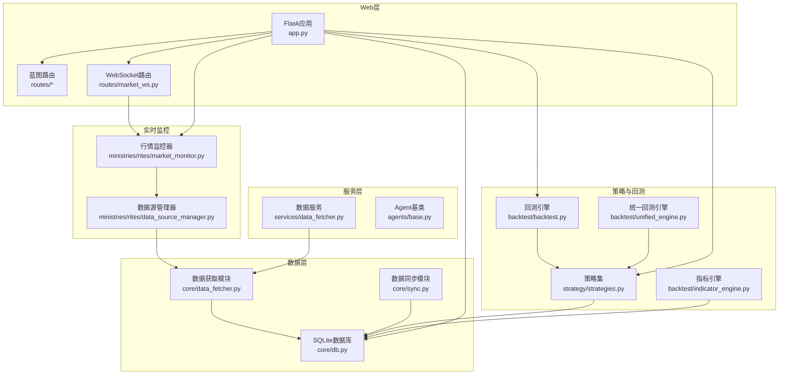
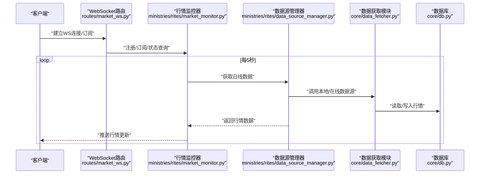
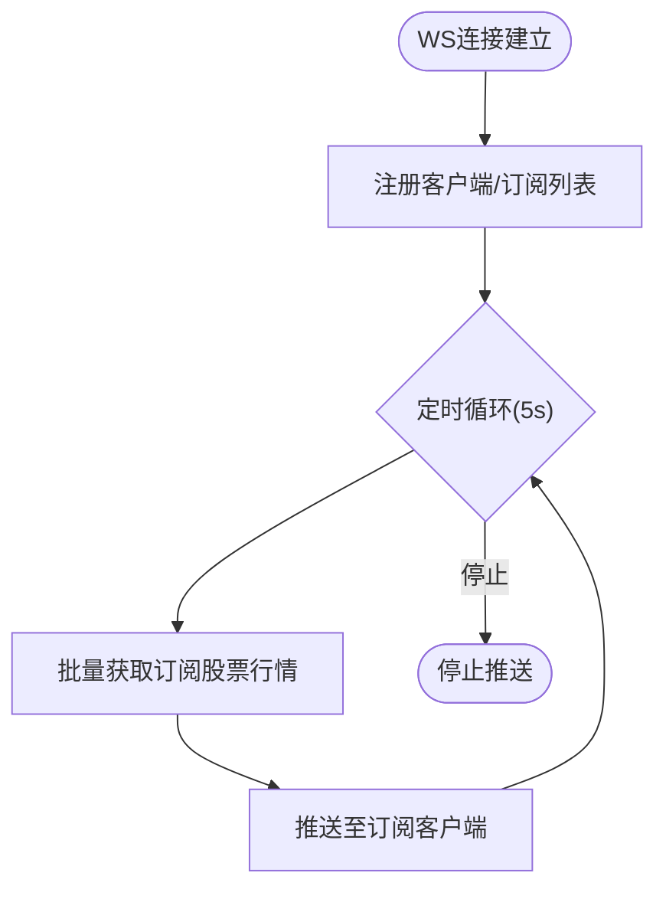
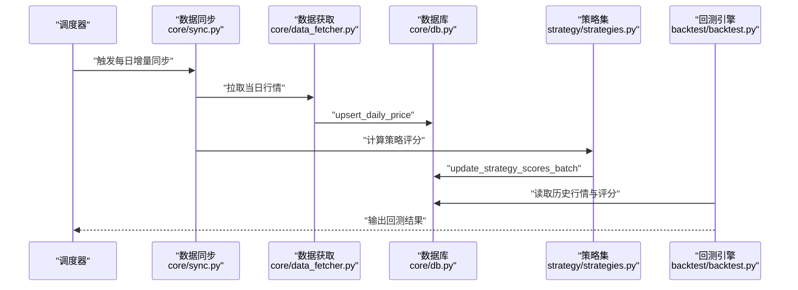
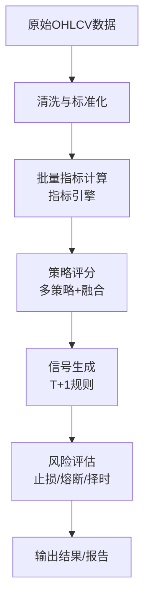
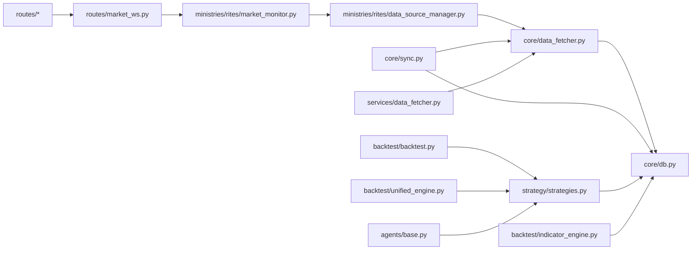

# 数据流设计

<cite>
**本文引用的文件**
- [app.py](file://app.py)
- [quant.py](file://quant.py)
- [routes/market_ws.py](file://routes/market_ws.py)
- [core/data_fetcher.py](file://core/data_fetcher.py)
- [backtest/backtest.py](file://backtest/backtest.py)
- [ministries/rites/market_monitor.py](file://ministries/rites/market_monitor.py)
- [core/db.py](file://core/db.py)
- [strategy/strategies.py](file://strategy/strategies.py)
- [backtest/unified_engine.py](file://backtest/unified_engine.py)
- [services/data_fetcher.py](file://services/data_fetcher.py)
- [ministries/rites/data_source_manager.py](file://ministries/rites/data_source_manager.py)
- [core/sync.py](file://core/sync.py)
- [agents/base.py](file://agents/base.py)
- [backtest/indicator_engine.py](file://backtest/indicator_engine.py)
</cite>

## 目录
1. [简介](#简介)
2. [项目结构](#项目结构)
3. [核心组件](#核心组件)
4. [架构总览](#架构总览)
5. [详细组件分析](#详细组件分析)
6. [依赖关系分析](#依赖关系分析)
7. [性能考量](#性能考量)
8. [故障排查指南](#故障排查指南)
9. [结论](#结论)
10. [附录](#附录)

## 简介
本文件面向AIQuant系统，系统性梳理从数据采集、存储、处理到输出的完整数据流，覆盖实时数据流（WebSocket行情推送）与批量数据流（历史数据回测）。重点说明数据转换与标准化过程（技术指标计算、信号生成、风险评估）、数据缓存策略、数据一致性保障与性能优化措施，并提供数据流图与处理管道图，帮助开发者与使用者理解系统运作机制。

## 项目结构
AIQuant采用模块化分层设计：
- Web后端与路由：Flask应用与蓝图路由，提供REST API与WebSocket服务
- 数据层：SQLite本地数据库，统一存储股票行情、指数、策略评分、信号、风控等
- 数据源：baostock为主、akshare为备，支持指数与个股数据
- 策略与回测：多策略评分与融合，回测引擎与指标引擎
- 实时监控：行情WebSocket推送与订阅管理
- 同步与缓存：每日增量同步、断点续传、缓存清理

图表来源
- [app.py:1-164](file://app.py#L1-L164)
- [routes/market_ws.py:1-142](file://routes/market_ws.py#L1-L142)
- [ministries/rites/market_monitor.py:1-244](file://ministries/rites/market_monitor.py#L1-L244)
- [ministries/rites/data_source_manager.py:1-190](file://ministries/rites/data_source_manager.py#L1-L190)
- [core/db.py:1-800](file://core/db.py#L1-L800)
- [core/sync.py:1-760](file://core/sync.py#L1-L760)
- [core/data_fetcher.py:1-578](file://core/data_fetcher.py#L1-L578)
- [services/data_fetcher.py:1-106](file://services/data_fetcher.py#L1-L106)
- [strategy/strategies.py:1-431](file://strategy/strategies.py#L1-L431)
- [backtest/indicator_engine.py:1-433](file://backtest/indicator_engine.py#L1-L433)
- [backtest/backtest.py:1-517](file://backtest/backtest.py#L1-L517)
- [backtest/unified_engine.py:1-143](file://backtest/unified_engine.py#L1-L143)
- [agents/base.py:1-120](file://agents/base.py#L1-L120)

章节来源
- [app.py:1-164](file://app.py#L1-L164)
- [core/db.py:1-800](file://core/db.py#L1-L800)

## 核心组件
- Flask后端与路由：提供REST API与WebSocket服务，注册多个蓝图，承载仪表板与多Agent控制台
- 数据源管理器：抽象数据源接口，支持本地数据库、akshare、baostock等，负责健康检查与自动切换
- 数据获取模块：封装baostock/akshare数据拉取、格式转换、缓存与降级
- 数据同步模块：每日增量同步、断点续传、指数同步、策略评分批量写入
- 数据库：SQLite，统一存储行情、指数、信号、风控等，提供事务与索引优化
- 策略与指标：多策略评分与融合，指标引擎批量计算常用技术指标
- 回测引擎：T+1交易、手续费/滑点、止损止盈、回撤熔断、动态仓位、大盘择时
- 实时监控：WebSocket行情推送、订阅管理、客户端生命周期管理
- Agent基类：统一的流水线上下文与结果封装，便于扩展多Agent流水线

章节来源
- [app.py:1-164](file://app.py#L1-L164)
- [ministries/rites/data_source_manager.py:1-190](file://ministries/rites/data_source_manager.py#L1-L190)
- [core/data_fetcher.py:1-578](file://core/data_fetcher.py#L1-L578)
- [core/sync.py:1-760](file://core/sync.py#L1-L760)
- [core/db.py:1-800](file://core/db.py#L1-L800)
- [strategy/strategies.py:1-431](file://strategy/strategies.py#L1-L431)
- [backtest/indicator_engine.py:1-433](file://backtest/indicator_engine.py#L1-L433)
- [backtest/backtest.py:1-517](file://backtest/backtest.py#L1-L517)
- [routes/market_ws.py:1-142](file://routes/market_ws.py#L1-L142)
- [ministries/rites/market_monitor.py:1-244](file://ministries/rites/market_monitor.py#L1-L244)
- [agents/base.py:1-120](file://agents/base.py#L1-L120)

## 架构总览
系统数据流分为两条主线：
- 实时数据流：WebSocket行情推送，客户端订阅股票，监控器定时拉取并推送
- 批量数据流：每日增量同步与策略评分计算，回测引擎读取数据库进行历史回测

图表来源
- [routes/market_ws.py:1-142](file://routes/market_ws.py#L1-L142)
- [ministries/rites/market_monitor.py:1-244](file://ministries/rites/market_monitor.py#L1-L244)
- [ministries/rites/data_source_manager.py:1-190](file://ministries/rites/data_source_manager.py#L1-L190)
- [core/data_fetcher.py:1-578](file://core/data_fetcher.py#L1-L578)
- [core/db.py:1-800](file://core/db.py#L1-L800)

## 详细组件分析

### 实时数据流（WebSocket行情推送）
- 客户端通过WS路由建立连接，发送订阅/取消订阅/心跳等消息
- 监控器维护客户端与订阅关系，定时批量拉取行情并推送
- 数据源管理器优先使用本地数据库，失败时自动切换在线数据源
- 行情推送包含OHLCV、涨跌幅等字段，客户端按订阅列表接收

图表来源
- [routes/market_ws.py:67-142](file://routes/market_ws.py#L67-L142)
- [ministries/rites/market_monitor.py:108-193](file://ministries/rites/market_monitor.py#L108-L193)
- [ministries/rites/data_source_manager.py:153-177](file://ministries/rites/data_source_manager.py#L153-L177)

章节来源
- [routes/market_ws.py:1-142](file://routes/market_ws.py#L1-L142)
- [ministries/rites/market_monitor.py:1-244](file://ministries/rites/market_monitor.py#L1-L244)
- [ministries/rites/data_source_manager.py:1-190](file://ministries/rites/data_source_manager.py#L1-L190)

### 批量数据流（历史数据回测）
- 每日增量同步：从baostock/akshare拉取当日行情，断点续传，写入数据库
- 策略评分：对历史数据运行多策略，融合评分批量写入数据库
- 回测引擎：读取数据库行情与评分，执行T+1交易、风控与绩效评估

图表来源
- [core/sync.py:462-668](file://core/sync.py#L462-L668)
- [core/data_fetcher.py:173-223](file://core/data_fetcher.py#L173-L223)
- [core/db.py:543-665](file://core/db.py#L543-L665)
- [strategy/strategies.py:367-431](file://strategy/strategies.py#L367-L431)
- [backtest/backtest.py:121-409](file://backtest/backtest.py#L121-L409)

章节来源
- [core/sync.py:1-760](file://core/sync.py#L1-L760)
- [core/data_fetcher.py:1-578](file://core/data_fetcher.py#L1-L578)
- [core/db.py:1-800](file://core/db.py#L1-L800)
- [strategy/strategies.py:1-431](file://strategy/strategies.py#L1-L431)
- [backtest/backtest.py:1-517](file://backtest/backtest.py#L1-L517)

### 数据转换与标准化流程
- 数据获取与清洗：统一列名、数值类型转换、缺失值处理、复权调整
- 指标计算：指标引擎批量计算常用技术指标，支持扩展注册
- 策略评分：多策略独立评分与融合评分，标准化到0-50范围
- 信号生成：基于评分与规则生成买入/卖出信号，支持T+1执行
- 风险评估：回测引擎内置止损止盈、回撤熔断、动态仓位、大盘择时等

图表来源
- [backtest/indicator_engine.py:287-358](file://backtest/indicator_engine.py#L287-L358)
- [strategy/strategies.py:367-431](file://strategy/strategies.py#L367-L431)
- [backtest/backtest.py:121-409](file://backtest/backtest.py#L121-L409)

章节来源
- [backtest/indicator_engine.py:1-433](file://backtest/indicator_engine.py#L1-L433)
- [strategy/strategies.py:1-431](file://strategy/strategies.py#L1-L431)
- [backtest/backtest.py:1-517](file://backtest/backtest.py#L1-L517)

### 数据缓存策略
- 本地CSV缓存：历史数据拉取时写入data_cache目录，命中即返回
- 同步缓存：每日同步过程使用.json缓存已同步股票集合，支持断点续传
- 数据库缓存：SQLite WAL模式与索引优化，提升并发与查询性能
- WebSocket缓存：监控器按订阅批量推送，避免过度请求

章节来源
- [core/data_fetcher.py:194-223](file://core/data_fetcher.py#L194-L223)
- [core/sync.py:422-450](file://core/sync.py#L422-L450)
- [core/db.py:26-40](file://core/db.py#L26-L40)

### 数据一致性保证
- 事务与回滚：数据库连接封装上下文，异常自动回滚
- 唯一约束：行情与指数表使用联合唯一索引，避免重复写入
- 断点续传：同步缓存记录已处理股票，失败后可继续
- 健康检查：数据源管理器定期检查可用性，自动切换

章节来源
- [core/db.py:26-40](file://core/db.py#L26-L40)
- [core/db.py:90-93](file://core/db.py#L90-L93)
- [core/sync.py:422-450](file://core/sync.py#L422-L450)
- [ministries/rites/data_source_manager.py:136-151](file://ministries/rites/data_source_manager.py#L136-L151)

### 性能优化措施
- 单线程登录与批量查询：baostock登录后批量查询，减少握手开销
- 批量写入：upsert与批量更新策略，减少IO次数
- 索引优化：按code/trade_date与日期建立索引，加速查询
- 指标预计算：指标引擎一次性计算常用指标，避免重复计算
- 回测优化：T+1执行、滑点与手续费建模，避免未来数据泄露

章节来源
- [core/sync.py:549-644](file://core/sync.py#L549-L644)
- [core/db.py:90-93](file://core/db.py#L90-L93)
- [backtest/indicator_engine.py:287-358](file://backtest/indicator_engine.py#L287-L358)
- [backtest/backtest.py:121-409](file://backtest/backtest.py#L121-L409)

## 依赖关系分析
- 路由依赖：WebSocket路由依赖监控器，监控器依赖数据源管理器
- 数据层依赖：同步模块依赖数据获取模块与数据库，服务层依赖数据获取模块
- 策略与回测：策略集依赖数据库读取历史数据，回测引擎依赖策略集与数据库
- Agent基类：为多Agent流水线提供统一上下文与结果封装

图表来源
- [routes/market_ws.py:1-142](file://routes/market_ws.py#L1-L142)
- [ministries/rites/market_monitor.py:1-244](file://ministries/rites/market_monitor.py#L1-L244)
- [ministries/rites/data_source_manager.py:1-190](file://ministries/rites/data_source_manager.py#L1-L190)
- [core/data_fetcher.py:1-578](file://core/data_fetcher.py#L1-L578)
- [core/db.py:1-800](file://core/db.py#L1-L800)
- [core/sync.py:1-760](file://core/sync.py#L1-L760)
- [services/data_fetcher.py:1-106](file://services/data_fetcher.py#L1-L106)
- [strategy/strategies.py:1-431](file://strategy/strategies.py#L1-L431)
- [backtest/indicator_engine.py:1-433](file://backtest/indicator_engine.py#L1-L433)
- [backtest/backtest.py:1-517](file://backtest/backtest.py#L1-L517)
- [backtest/unified_engine.py:1-143](file://backtest/unified_engine.py#L1-L143)
- [agents/base.py:1-120](file://agents/base.py#L1-L120)

章节来源
- [app.py:1-164](file://app.py#L1-L164)
- [core/sync.py:1-760](file://core/sync.py#L1-L760)
- [strategy/strategies.py:1-431](file://strategy/strategies.py#L1-L431)
- [backtest/backtest.py:1-517](file://backtest/backtest.py#L1-L517)

## 性能考量
- 数据源选择：baostock为主，akshare为备，避免限流与失败
- 批量处理：同步与指标计算均采用批量写入与预计算，减少IO与重复计算
- 索引与查询：合理索引与SQL查询优化，避免全表扫描
- 回测效率：T+1执行与滑点建模，避免未来数据泄露导致的过拟合
- 缓存策略：本地CSV缓存与同步缓存，显著降低重复拉取成本

## 故障排查指南
- WebSocket连接异常：检查监控器状态与客户端订阅列表，确认数据源可用性
- 同步失败：查看同步日志与缓存文件，确认baostock登录与akshare备用接口
- 数据库异常：检查事务上下文与唯一索引，确认写入冲突与重复数据
- 回测结果异常：核对T+1执行、滑点与手续费配置，检查信号生成与风控参数

章节来源
- [routes/market_ws.py:26-64](file://routes/market_ws.py#L26-L64)
- [ministries/rites/market_monitor.py:214-231](file://ministries/rites/market_monitor.py#L214-L231)
- [core/sync.py:665-668](file://core/sync.py#L665-L668)
- [core/db.py:26-40](file://core/db.py#L26-L40)
- [backtest/backtest.py:121-409](file://backtest/backtest.py#L121-L409)

## 结论
AIQuant系统通过清晰的数据流设计实现了从实时行情到历史回测的完整闭环。实时流强调低延迟与可靠性，批量流强调一致性与可追溯性。通过数据源管理、数据库索引、批量处理与缓存策略，系统在性能与稳定性之间取得良好平衡。建议持续优化指标计算与回测参数，结合Agent流水线扩展多维度分析能力。

## 附录
- 关键流程路径参考
  - 实时推送：[routes/market_ws.py:67-142](file://routes/market_ws.py#L67-L142) → [ministries/rites/market_monitor.py:108-193](file://ministries/rites/market_monitor.py#L108-L193)
  - 增量同步：[core/sync.py:462-668](file://core/sync.py#L462-L668) → [core/data_fetcher.py:173-223](file://core/data_fetcher.py#L173-L223)
  - 策略评分：[strategy/strategies.py:367-431](file://strategy/strategies.py#L367-L431) → [core/db.py:581-628](file://core/db.py#L581-L628)
  - 回测执行：[backtest/backtest.py:121-409](file://backtest/backtest.py#L121-L409)