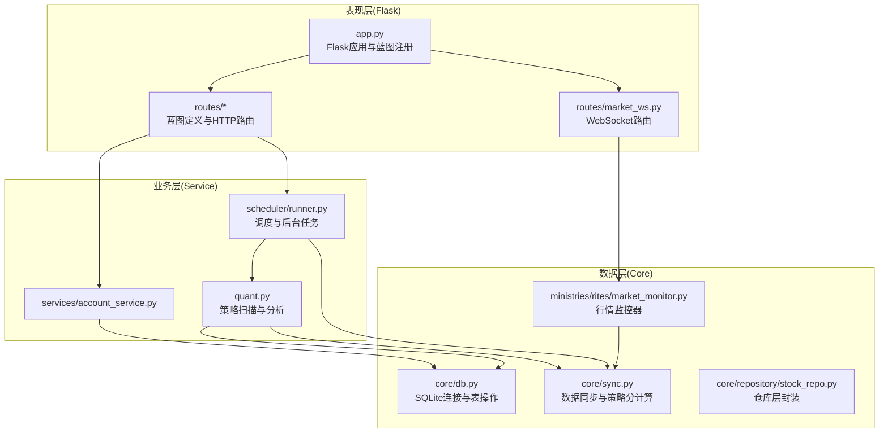
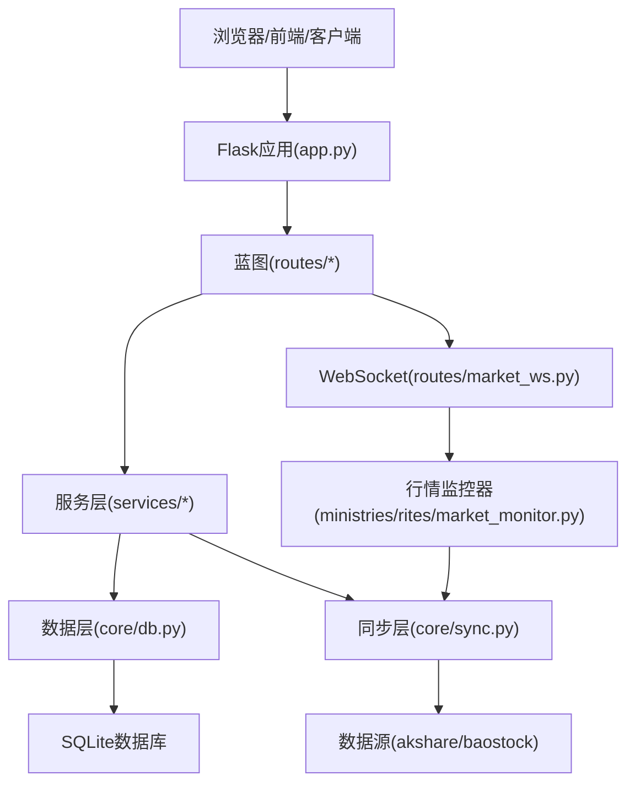
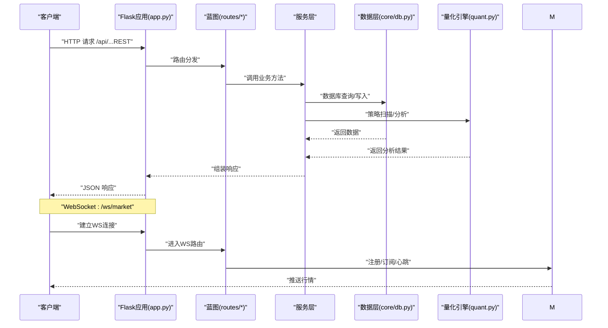
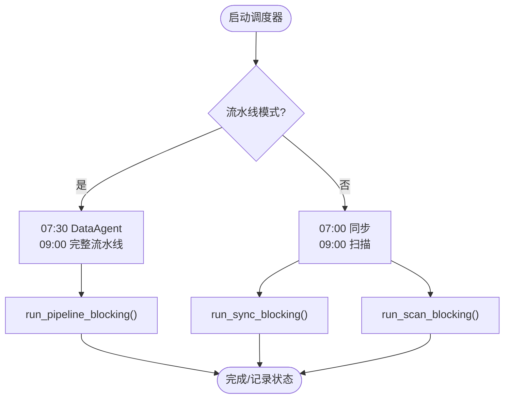
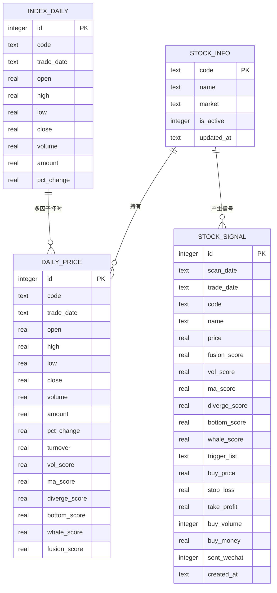
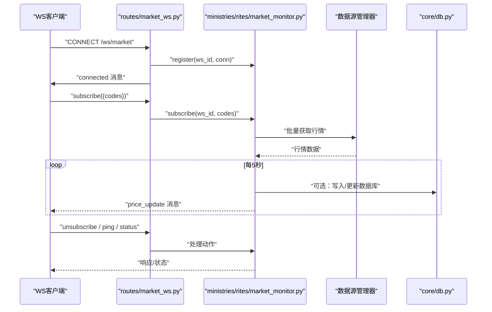
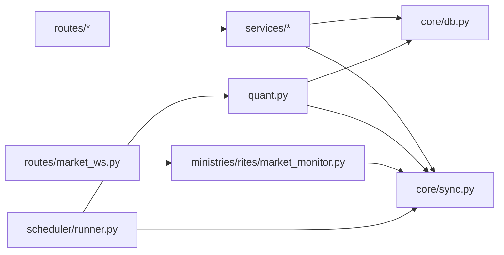

# 整体架构

<cite>
**本文引用的文件**
- [app.py](file://app.py)
- [quant.py](file://quant.py)
- [routes/__init__.py](file://routes/__init__.py)
- [routes/system.py](file://routes/system.py)
- [routes/market_ws.py](file://routes/market_ws.py)
- [ministries/rites/market_monitor.py](file://ministries/rites/market_monitor.py)
- [scheduler/runner.py](file://scheduler/runner.py)
- [core/db.py](file://core/db.py)
- [core/sync.py](file://core/sync.py)
- [core/repository/stock_repo.py](file://core/repository/stock_repo.py)
- [services/account_service.py](file://services/account_service.py)
- [README.md](file://README.md)
</cite>

## 目录
1. [简介](#简介)
2. [项目结构](#项目结构)
3. [核心组件](#核心组件)
4. [架构总览](#架构总览)
5. [详细组件分析](#详细组件分析)
6. [依赖分析](#依赖分析)
7. [性能考虑](#性能考虑)
8. [故障排查指南](#故障排查指南)
9. [结论](#结论)
10. [附录](#附录)

## 简介
本文件面向AIQuant系统，提供整体架构文档，聚焦分层架构设计与模块化组织，涵盖表现层（Flask Web API）、业务层（Service层）、数据层（Core层）的职责划分与交互关系。同时解释模块化设计原则、组件依赖、蓝图注册机制、全局错误处理、WebSocket支持等，并给出从HTTP请求到数据库查询的完整数据流。

## 项目结构
系统采用“表现层-业务层-数据层”的清晰分层，配合蓝图（Blueprint）进行路由模块化，结合调度器与监控器实现后台任务与实时行情推送。

图表来源
- [app.py:1-164](file://app.py#L1-L164)
- [routes/__init__.py:1-16](file://routes/__init__.py#L1-L16)
- [routes/market_ws.py:1-142](file://routes/market_ws.py#L1-L142)
- [scheduler/runner.py:1-212](file://scheduler/runner.py#L1-L212)
- [core/db.py:1-800](file://core/db.py#L1-L800)
- [core/sync.py:1-760](file://core/sync.py#L1-L760)
- [core/repository/stock_repo.py:1-80](file://core/repository/stock_repo.py#L1-L80)
- [ministries/rites/market_monitor.py:1-244](file://ministries/rites/market_monitor.py#L1-L244)

章节来源
- [app.py:1-164](file://app.py#L1-L164)
- [routes/__init__.py:1-16](file://routes/__init__.py#L1-L16)
- [routes/market_ws.py:1-142](file://routes/market_ws.py#L1-L142)
- [scheduler/runner.py:1-212](file://scheduler/runner.py#L1-L212)
- [core/db.py:1-800](file://core/db.py#L1-L800)
- [core/sync.py:1-760](file://core/sync.py#L1-L760)
- [core/repository/stock_repo.py:1-80](file://core/repository/stock_repo.py#L1-L80)
- [ministries/rites/market_monitor.py:1-244](file://ministries/rites/market_monitor.py#L1-L244)

## 核心组件
- Flask应用实例与蓝图注册：集中于app.py，统一注册系统内所有蓝图，提供静态资源与健康检查接口，并配置CORS与WebSocket。
- 蓝图模块化：routes目录下按功能域拆分蓝图，如system、stock、backtest、market_ws等，URL前缀明确，便于扩展。
- 业务服务层：services目录承载业务逻辑，路由层仅负责协议转换与参数校验，业务下沉至服务层。
- 数据层：core/db.py提供SQLite连接与表级操作；core/sync.py负责数据同步、策略分计算与指数同步；仓库层（repository）进一步封装表级CRUD。
- 调度与监控：scheduler/runner.py提供定时任务与流水线模式；ministries/rites/market_monitor.py提供WebSocket行情推送与订阅管理。
- 全局错误处理：统一返回JSON错误响应，保证前后端一致性。

章节来源
- [app.py:1-164](file://app.py#L1-L164)
- [routes/__init__.py:1-16](file://routes/__init__.py#L1-L16)
- [services/account_service.py:1-31](file://services/account_service.py#L1-L31)
- [core/db.py:1-800](file://core/db.py#L1-L800)
- [core/sync.py:1-760](file://core/sync.py#L1-L760)
- [scheduler/runner.py:1-212](file://scheduler/runner.py#L1-L212)
- [ministries/rites/market_monitor.py:1-244](file://ministries/rites/market_monitor.py#L1-L244)

## 架构总览
系统采用三层架构与模块化设计：
- 表现层：Flask + 蓝图 + WebSocket，负责HTTP与WS接入、静态资源与健康检查。
- 业务层：服务层封装策略扫描、账户快照、调度控制等业务逻辑。
- 数据层：Core层提供数据库连接、表级操作、数据同步与策略分计算；仓库层进一步抽象CRUD。

图表来源
- [app.py:1-164](file://app.py#L1-L164)
- [routes/market_ws.py:1-142](file://routes/market_ws.py#L1-L142)
- [ministries/rites/market_monitor.py:1-244](file://ministries/rites/market_monitor.py#L1-L244)
- [core/db.py:1-800](file://core/db.py#L1-L800)
- [core/sync.py:1-760](file://core/sync.py#L1-L760)

## 详细组件分析

### Flask应用与蓝图注册
- 应用初始化：创建Flask实例，启用CORS与WebSocket（flask_sock），注册所有蓝图，暴露静态页面与健康检查接口。
- 蓝图注册：routes/__init__.py集中定义各蓝图的URL前缀，app.py统一注册，形成清晰的REST命名空间。
- 全局错误处理：统一404/500错误返回JSON，保证前后端一致的错误契约。
- WebSocket：routes/market_ws.py注册/ws/market路由，通过sock.route装饰器绑定，配合ministries/rites/market_monitor.py实现订阅管理与推送。

图表来源
- [app.py:1-164](file://app.py#L1-L164)
- [routes/market_ws.py:1-142](file://routes/market_ws.py#L1-L142)
- [ministries/rites/market_monitor.py:1-244](file://ministries/rites/market_monitor.py#L1-L244)
- [core/db.py:1-800](file://core/db.py#L1-L800)
- [quant.py:1-631](file://quant.py#L1-L631)

章节来源
- [app.py:1-164](file://app.py#L1-L164)
- [routes/__init__.py:1-16](file://routes/__init__.py#L1-L16)
- [routes/market_ws.py:1-142](file://routes/market_ws.py#L1-L142)
- [ministries/rites/market_monitor.py:1-244](file://ministries/rites/market_monitor.py#L1-L244)

### 业务层：服务与调度
- 服务层：services/account_service.py演示了典型的Service层职责，将业务调用委托给core.db，保持路由层轻薄。
- 调度器：scheduler/runner.py提供两种模式：
  - 传统模式：07:00同步，09:00扫描。
  - 多Agent流水线模式：07:30 DataAgent，09:00完整流水线。
- 任务执行：run_sync_blocking/run_scan_blocking在后台线程中执行，避免阻塞主线程；状态通过共享字典维护。

图表来源
- [scheduler/runner.py:158-212](file://scheduler/runner.py#L158-L212)
- [scheduler/runner.py:29-101](file://scheduler/runner.py#L29-L101)

章节来源
- [scheduler/runner.py:1-212](file://scheduler/runner.py#L1-L212)
- [services/account_service.py:1-31](file://services/account_service.py#L1-L31)

### 数据层：数据库与同步
- 数据库连接：core/db.py提供上下文管理的SQLite连接，设置journal_mode=WAL与synchronous=NORMAL以提升并发与性能；提供建表、索引、查询与写入等通用方法。
- 仓库层：core/repository/stock_repo.py以表为单位封装CRUD，复用core/db的连接，降低耦合。
- 数据同步：core/sync.py负责股票列表、单只股票与指数数据的拉取、清洗与入库；支持断点续传与缓存；提供策略分批量写入，支撑回测与面板展示。
- 量化分析：quant.py提供策略扫描与分析，依赖core.db读取行情，调用策略模块计算信号，最终写入数据库。

图表来源
- [core/db.py:61-427](file://core/db.py#L61-L427)

章节来源
- [core/db.py:1-800](file://core/db.py#L1-L800)
- [core/repository/stock_repo.py:1-80](file://core/repository/stock_repo.py#L1-L80)
- [core/sync.py:1-760](file://core/sync.py#L1-L760)
- [quant.py:1-631](file://quant.py#L1-L631)

### WebSocket与实时行情
- WebSocket路由：routes/market_ws.py定义/ws/market，处理连接、订阅、取消订阅、心跳与状态查询。
- 行情监控器：ministries/rites/market_monitor.py管理客户端连接与订阅，定时拉取数据并通过WS推送；支持批量拉取与并发推送。
- 与同步层协作：行情监控器通过数据源管理器获取最新行情，写入数据库后由前端订阅消费。

图表来源
- [routes/market_ws.py:67-142](file://routes/market_ws.py#L67-L142)
- [ministries/rites/market_monitor.py:108-244](file://ministries/rites/market_monitor.py#L108-L244)
- [core/db.py:543-737](file://core/db.py#L543-L737)

章节来源
- [routes/market_ws.py:1-142](file://routes/market_ws.py#L1-L142)
- [ministries/rites/market_monitor.py:1-244](file://ministries/rites/market_monitor.py#L1-L244)
- [core/db.py:1-800](file://core/db.py#L1-L800)

### 系统路由与状态
- 系统路由：routes/system.py提供同步、扫描、状态查询与调度开关等接口，配合scheduler/runner.py实现后台任务的触发与状态反馈。
- 自动检查：系统可自动判断是否需要扫描，避免重复执行与过期数据。

章节来源
- [routes/system.py:1-152](file://routes/system.py#L1-L152)
- [scheduler/runner.py:1-212](file://scheduler/runner.py#L1-L212)

## 依赖分析
- 路由到服务：routes/*依赖services/*；services/*依赖core/db.py与core/sync.py。
- 服务到数据：services/account_service.py依赖core.db；量化扫描依赖quant.py与core.db、core/sync.py。
- 蓝图到监控：routes/market_ws.py依赖ministries/rites/market_monitor.py；监控器依赖core/sync.py与数据源。
- 调度到业务：scheduler/runner.py触发quant.py与core/sync.py，维护状态字典。

图表来源
- [routes/system.py:1-152](file://routes/system.py#L1-L152)
- [services/account_service.py:1-31](file://services/account_service.py#L1-L31)
- [core/db.py:1-800](file://core/db.py#L1-L800)
- [core/sync.py:1-760](file://core/sync.py#L1-L760)
- [quant.py:1-631](file://quant.py#L1-L631)
- [routes/market_ws.py:1-142](file://routes/market_ws.py#L1-L142)
- [ministries/rites/market_monitor.py:1-244](file://ministries/rites/market_monitor.py#L1-L244)
- [scheduler/runner.py:1-212](file://scheduler/runner.py#L1-L212)

章节来源
- [routes/system.py:1-152](file://routes/system.py#L1-L152)
- [services/account_service.py:1-31](file://services/account_service.py#L1-L31)
- [core/db.py:1-800](file://core/db.py#L1-L800)
- [core/sync.py:1-760](file://core/sync.py#L1-L760)
- [quant.py:1-631](file://quant.py#L1-L631)
- [routes/market_ws.py:1-142](file://routes/market_ws.py#L1-L142)
- [ministries/rites/market_monitor.py:1-244](file://ministries/rites/market_monitor.py#L1-L244)
- [scheduler/runner.py:1-212](file://scheduler/runner.py#L1-L212)

## 性能考虑
- 数据库并发：WAL模式与NORMAL同步策略提升写入吞吐；批量写入与事务提交减少锁竞争。
- 策略分计算：批量计算并一次性写入，避免重复计算；断点续传与缓存减少重复拉取。
- WebSocket推送：批量拉取与限频推送，避免过载；客户端订阅去重，降低无效推送。
- 调度与线程：后台线程执行长耗时任务，避免阻塞主线程；状态字典保护并发访问。

## 故障排查指南
- 健康检查：访问/api/health确认服务运行状态。
- 错误处理：404/500错误统一返回JSON，便于前端捕获与提示。
- 调度状态：通过/routes/system.py的状态接口查看同步/扫描状态与调度开关。
- WebSocket：使用/api/market/status与/api/market/clients检查监控器状态与客户端列表；确认/ws/market连接与订阅动作。
- 数据库：核对core/db.py中的建表与索引；检查唯一约束与冲突更新逻辑。

章节来源
- [app.py:131-144](file://app.py#L131-L144)
- [routes/system.py:46-152](file://routes/system.py#L46-L152)
- [routes/market_ws.py:26-64](file://routes/market_ws.py#L26-L64)

## 结论
AIQuant系统通过Flask蓝图实现模块化路由，业务逻辑下沉至服务层，数据访问抽象为仓库层与Core层，辅以调度器与WebSocket监控器，形成清晰、可扩展、可维护的分层架构。蓝图模式提升了可维护性与可测试性；WebSocket支持实现了前后端分离的实时数据推送；SQLite与批量写入策略兼顾性能与可靠性。

## 附录
- 项目简述：README.md表明项目为AI选股助手，体现系统定位与目标。

章节来源
- [README.md:1-3](file://README.md#L1-L3)