# 架构设计

<cite>
**本文引用的文件**   
- [README.md](file://README.md)
- [app.py](file://app.py)
- [quant.py](file://quant.py)
- [requirements.txt](file://requirements.txt)
- [config/settings.py](file://config/settings.py)
- [core/db.py](file://core/db.py)
- [core/repository/__init__.py](file://core/repository/__init__.py)
- [strategy/strategies.py](file://strategy/strategies.py)
- [routes/__init__.py](file://routes/__init__.py)
- [agents/orchestrator.py](file://agents/orchestrator.py)
- [risk/engine.py](file://risk/engine.py)
- [backtest/engine.py](file://backtest/engine.py)
- [services/strategy_service.py](file://services/strategy_service.py)
- [ministries/rites/data_source_manager.py](file://ministries/rites/data_source_manager.py)
- [governance/chancellery/scoring_engine.py](file://governance/chancellery/scoring_engine.py)
</cite>

## 目录
1. [简介](#简介)
2. [项目结构](#项目结构)
3. [核心组件](#核心组件)
4. [架构总览](#架构总览)
5. [详细组件分析](#详细组件分析)
6. [依赖关系分析](#依赖关系分析)
7. [性能考虑](#性能考虑)
8. [故障排查指南](#故障排查指南)
9. [结论](#结论)
10. [附录](#附录)

## 简介
本文件面向AIQuant系统，提供全面的架构设计文档。系统采用分层架构与模块化设计，结合插件化扩展能力，围绕“数据-策略-回测-风控-流水线”的主线构建。系统通过表现层（Flask API + WebSocket）、业务层（策略引擎、回测引擎、风控引擎、评分引擎、数据源管理）、数据层（SQLite本地数据库）协同工作，并通过三省六部制流水线编排器实现跨Agent的有序协作。

## 项目结构
系统采用按功能域划分的模块化组织方式：
- 表现层：Flask应用与蓝图路由，提供REST API与WebSocket接口
- 业务层：策略、回测、风控、评分、数据源管理、流水线编排等
- 数据层：SQLite数据库与仓储层封装
- 运维与调度：定时任务、部署与监控

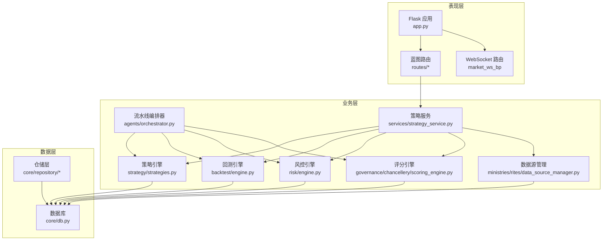

图表来源
- [app.py:1-164](file://app.py#L1-L164)
- [routes/__init__.py:1-16](file://routes/__init__.py#L1-L16)
- [strategy/strategies.py:1-431](file://strategy/strategies.py#L1-L431)
- [backtest/engine.py:1-174](file://backtest/engine.py#L1-L174)
- [risk/engine.py:1-168](file://risk/engine.py#L1-L168)
- [governance/chancellery/scoring_engine.py:1-370](file://governance/chancellery/scoring_engine.py#L1-L370)
- [ministries/rites/data_source_manager.py:1-190](file://ministries/rites/data_source_manager.py#L1-L190)
- [agents/orchestrator.py:1-263](file://agents/orchestrator.py#L1-L263)
- [services/strategy_service.py:1-325](file://services/strategy_service.py#L1-L325)
- [core/db.py:1-800](file://core/db.py#L1-L800)

章节来源
- [README.md:1-3](file://README.md#L1-L3)
- [app.py:1-164](file://app.py#L1-L164)
- [routes/__init__.py:1-16](file://routes/__init__.py#L1-L16)

## 核心组件
- Flask后端与蓝图路由：统一对外API入口，注册系统内各功能蓝图
- 策略引擎：多策略评分与融合，支持v4超跌反弹与五策略融合
- 回测引擎：基于Backtrader的回测与参数优化封装
- 风控引擎：规则驱动的风险检查与状态记录
- 评分引擎：多因子评分与推荐
- 数据源管理：抽象数据源接口与主备切换
- 流水线编排器：三省六部制跨Agent编排与并行执行
- 数据库与仓储：SQLite建表、迁移、CRUD与索引管理

章节来源
- [strategy/strategies.py:1-431](file://strategy/strategies.py#L1-L431)
- [backtest/engine.py:1-174](file://backtest/engine.py#L1-L174)
- [risk/engine.py:1-168](file://risk/engine.py#L1-L168)
- [governance/chancellery/scoring_engine.py:1-370](file://governance/chancellery/scoring_engine.py#L1-L370)
- [ministries/rites/data_source_manager.py:1-190](file://ministries/rites/data_source_manager.py#L1-L190)
- [agents/orchestrator.py:1-263](file://agents/orchestrator.py#L1-L263)
- [core/db.py:1-800](file://core/db.py#L1-L800)

## 架构总览
系统采用分层架构：
- 表现层：Flask + 蓝图 + WebSocket，负责请求接入与实时行情推送
- 业务层：策略、回测、风控、评分、数据源管理、流水线编排
- 数据层：SQLite本地数据库，仓储层抽象各表CRUD

核心架构模式：
- 仓库模式：以表为单位的仓储层，封装CRUD与索引
- 流水线模式：三省六部制编排，串行与并行混合，门下省一票否决
- 策略模式：策略函数与评分函数可插拔，支持融合与独立运行

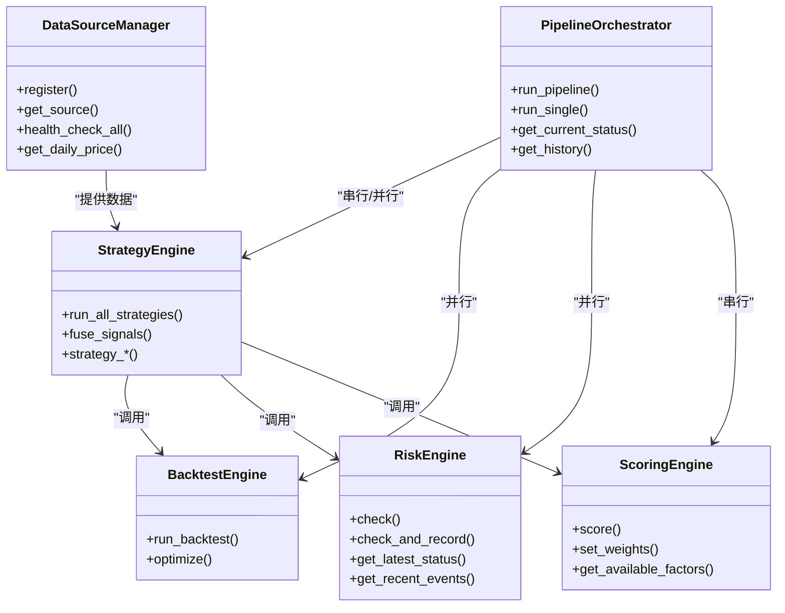

图表来源
- [strategy/strategies.py:1-431](file://strategy/strategies.py#L1-L431)
- [backtest/engine.py:1-174](file://backtest/engine.py#L1-L174)
- [risk/engine.py:1-168](file://risk/engine.py#L1-L168)
- [governance/chancellery/scoring_engine.py:1-370](file://governance/chancellery/scoring_engine.py#L1-L370)
- [ministries/rites/data_source_manager.py:1-190](file://ministries/rites/data_source_manager.py#L1-L190)
- [agents/orchestrator.py:1-263](file://agents/orchestrator.py#L1-L263)

## 详细组件分析

### 表现层与路由
- Flask应用集中注册系统蓝图，统一处理CORS与错误
- 蓝图按功能域划分，覆盖系统、股票、回测、策略、信号、交易、账户、风控、治理、数据源、WS等
- 提供仪表板与多Agent控制台页面，WebSocket推送实时行情

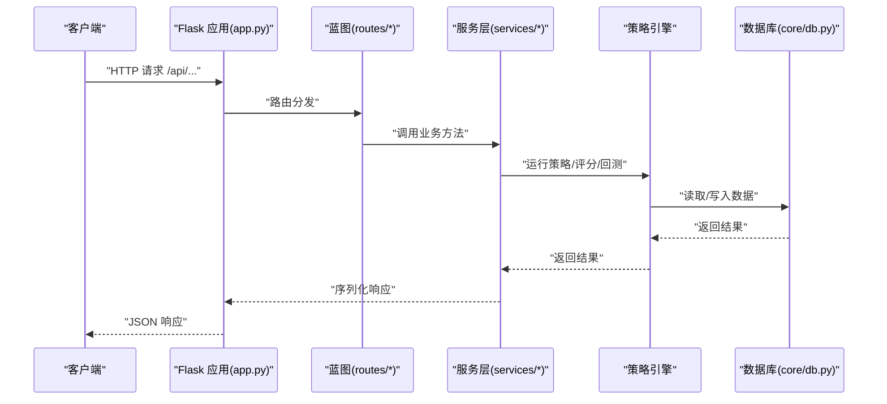

图表来源
- [app.py:1-164](file://app.py#L1-L164)
- [routes/__init__.py:1-16](file://routes/__init__.py#L1-L16)
- [services/strategy_service.py:1-325](file://services/strategy_service.py#L1-L325)
- [core/db.py:1-800](file://core/db.py#L1-L800)

章节来源
- [app.py:1-164](file://app.py#L1-L164)
- [routes/__init__.py:1-16](file://routes/__init__.py#L1-L16)

### 策略引擎与融合
- 提供五类技术信号策略与v4超跌反弹策略，统一输出BUY/SELL信号与评分
- 融合策略将各策略评分映射到0-10后加权求和，得到0-50融合分
- 支持独立运行与批量筛选，生成SSE流式结果

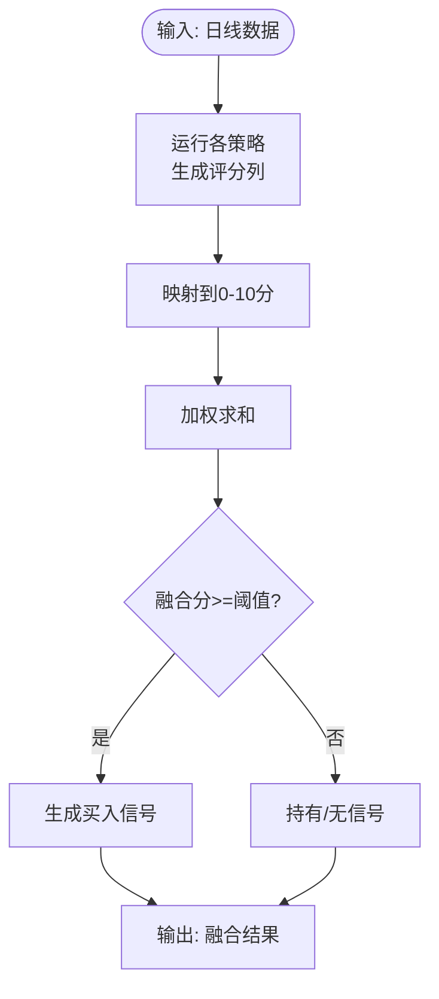

图表来源
- [strategy/strategies.py:1-431](file://strategy/strategies.py#L1-L431)

章节来源
- [strategy/strategies.py:1-431](file://strategy/strategies.py#L1-L431)
- [services/strategy_service.py:1-325](file://services/strategy_service.py#L1-L325)

### 回测引擎
- 封装Backtrader回测流程，支持参数优化与分析器
- 提供策略适配器与结果数据结构，便于与策略引擎对接

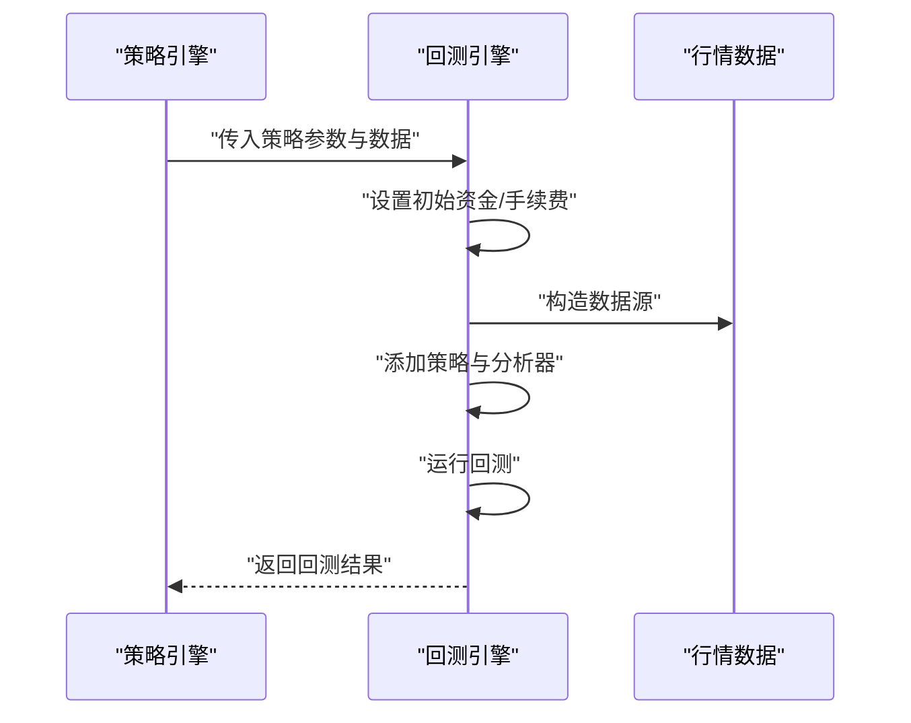

图表来源
- [backtest/engine.py:1-174](file://backtest/engine.py#L1-L174)

章节来源
- [backtest/engine.py:1-174](file://backtest/engine.py#L1-L174)

### 风控引擎
- 规则集合驱动的风险检查，聚合最严格等级
- 记录风险事件与风控状态至数据库，支持查询

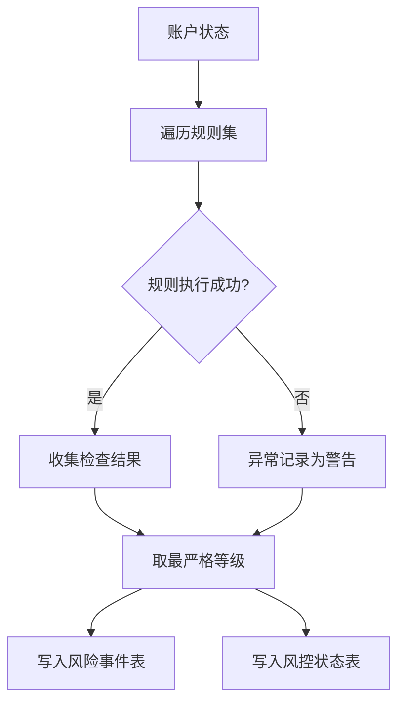

图表来源
- [risk/engine.py:1-168](file://risk/engine.py#L1-L168)

章节来源
- [risk/engine.py:1-168](file://risk/engine.py#L1-L168)

### 评分引擎（多因子）
- 提供趋势、动量、波动率、成交量、质量五大因子评分
- 支持权重配置与推荐语义化输出

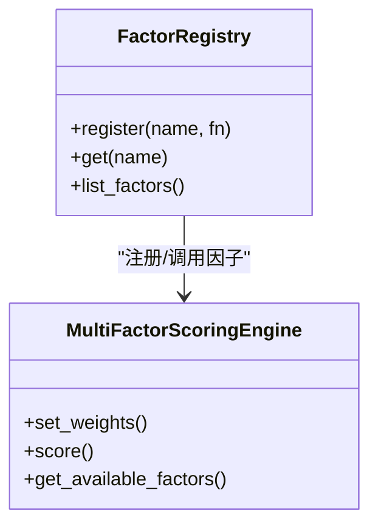

图表来源
- [governance/chancellery/scoring_engine.py:1-370](file://governance/chancellery/scoring_engine.py#L1-L370)

章节来源
- [governance/chancellery/scoring_engine.py:1-370](file://governance/chancellery/scoring_engine.py#L1-L370)

### 数据源管理
- 抽象数据源接口，支持本地数据库、AkShare、Tushare等
- 提供健康检查、主备切换与统一接口

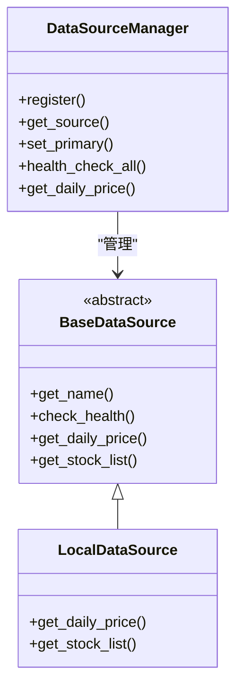

图表来源
- [ministries/rites/data_source_manager.py:1-190](file://ministries/rites/data_source_manager.py#L1-L190)

章节来源
- [ministries/rites/data_source_manager.py:1-190](file://ministries/rites/data_source_manager.py#L1-L190)

### 流水线编排器（三省六部制）
- 串行：太子院（数据）→中书省（信号）
- 并行：尚书省（回测）+门下省（风控）
- 门下省一票否决：风控BLOCK则跳过报表
- 支持状态持久化与历史记录

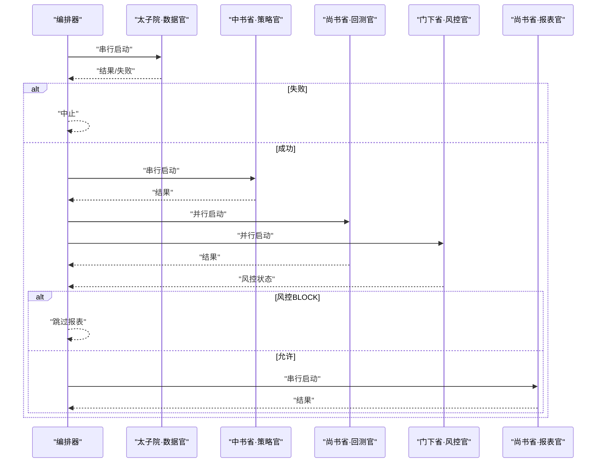

图表来源
- [agents/orchestrator.py:1-263](file://agents/orchestrator.py#L1-L263)

章节来源
- [agents/orchestrator.py:1-263](file://agents/orchestrator.py#L1-L263)

### 数据层与仓储
- SQLite建表与索引，支持策略评分、指数行情、信号、风控事件、审计日志等
- 连接管理与事务封装，提供upsert、批量更新、查询等
- 仓储层按表拆分，新代码优先使用仓储层

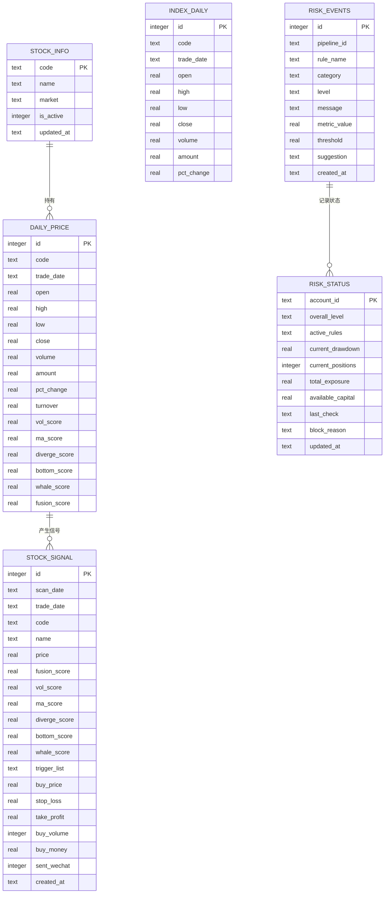

图表来源
- [core/db.py:1-800](file://core/db.py#L1-L800)

章节来源
- [core/db.py:1-800](file://core/db.py#L1-L800)
- [core/repository/__init__.py:1-7](file://core/repository/__init__.py#L1-L7)

## 依赖关系分析
- 技术栈与版本：Python生态，Flask、Pandas、Plotly、Backtrader、SQLite
- 第三方依赖：requests、streamlit、flask-sock、simple-websocket、scikit-learn、joblib
- 版本兼容性：Pandas ≥ 2.0.0，Flask-sock ≥ 0.7.0，scikit-learn ≥ 1.5.0

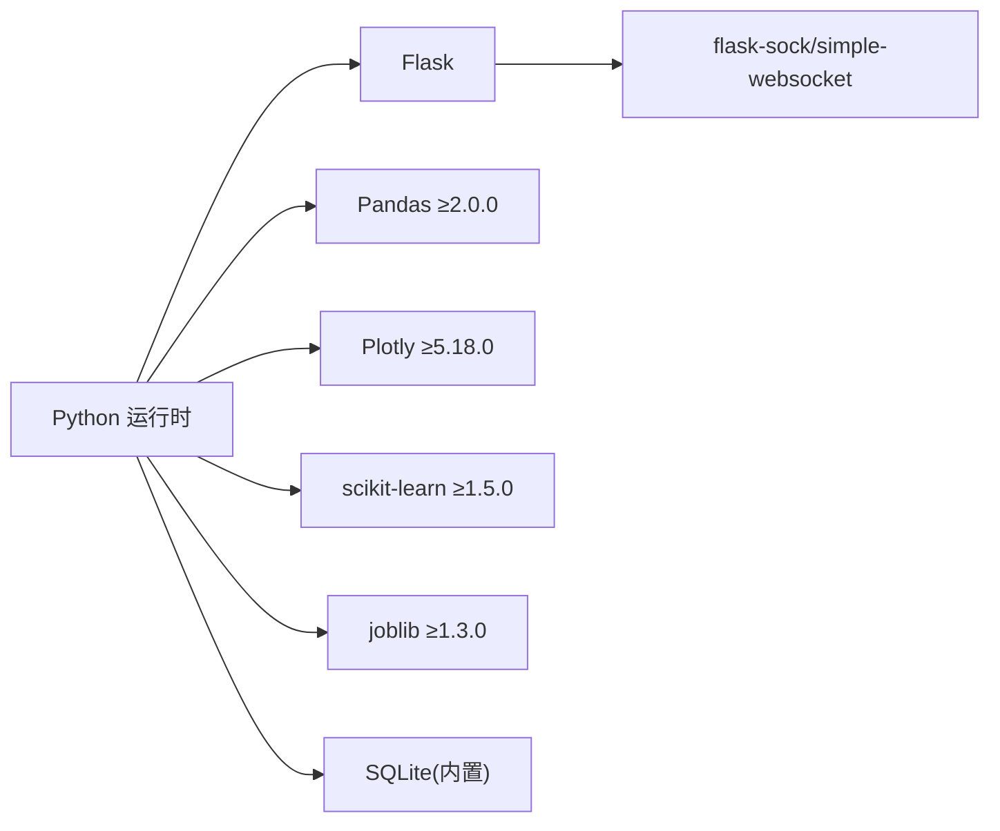

图表来源
- [requirements.txt:1-9](file://requirements.txt#L1-L9)

章节来源
- [requirements.txt:1-9](file://requirements.txt#L1-L9)
- [config/settings.py:1-25](file://config/settings.py#L1-L25)

## 性能考虑
- 数据库层面：WAL模式、NORMAL同步、唯一索引与复合索引，减少锁竞争
- 策略层面：批量评分与融合，避免逐行计算；SSE流式输出降低内存峰值
- 并行执行：流水线中回测与风控并行，缩短总耗时
- 缓存与清理：数据同步后清理旧缓存文件，控制磁盘占用

## 故障排查指南
- API错误处理：统一404/500返回JSON，便于前端与自动化诊断
- 数据库异常：连接上下文自动提交/回滚，异常打印与继续执行
- 风控异常：规则执行异常记录为警告级别，不影响整体风控判定
- 数据源异常：主数据源失败自动切换备用数据源

章节来源
- [app.py:136-145](file://app.py#L136-L145)
- [core/db.py:26-40](file://core/db.py#L26-L40)
- [risk/engine.py:29-39](file://risk/engine.py#L29-L39)
- [ministries/rites/data_source_manager.py:153-177](file://ministries/rites/data_source_manager.py#L153-L177)

## 结论
AIQuant系统通过清晰的分层架构、模块化设计与插件化扩展，实现了从数据接入到策略评分、回测、风控与报表的完整闭环。三省六部制流水线编排器提升了跨Agent协作效率，仓库模式与仓储层增强了数据访问的一致性与可维护性。系统在性能、可运维性与可扩展性方面具备良好基础，适合进一步引入更多策略因子、优化参数搜索与增强监控告警体系。

## 附录
- 系统边界：表现层对外提供API与WS；业务层内部协作；数据层提供统一持久化
- 跨领域关注点：安全（CORS、错误统一）、监控（健康检查、风控事件）、灾备（本地SQLite、可扩展到远程备份）