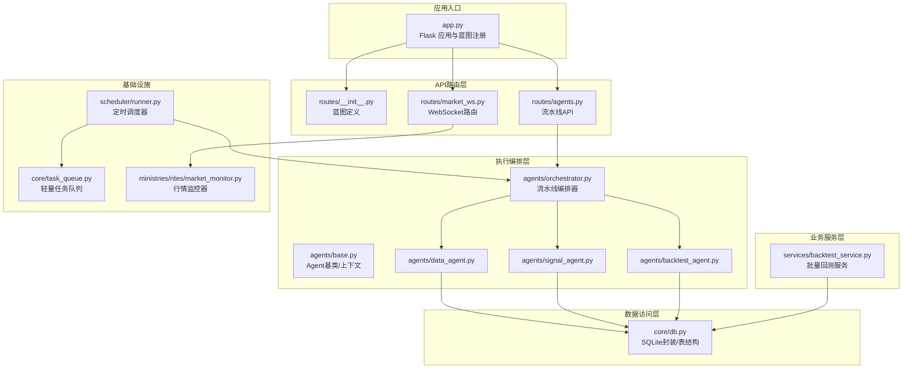
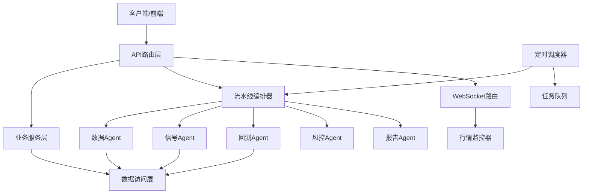
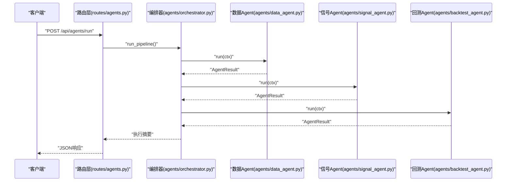
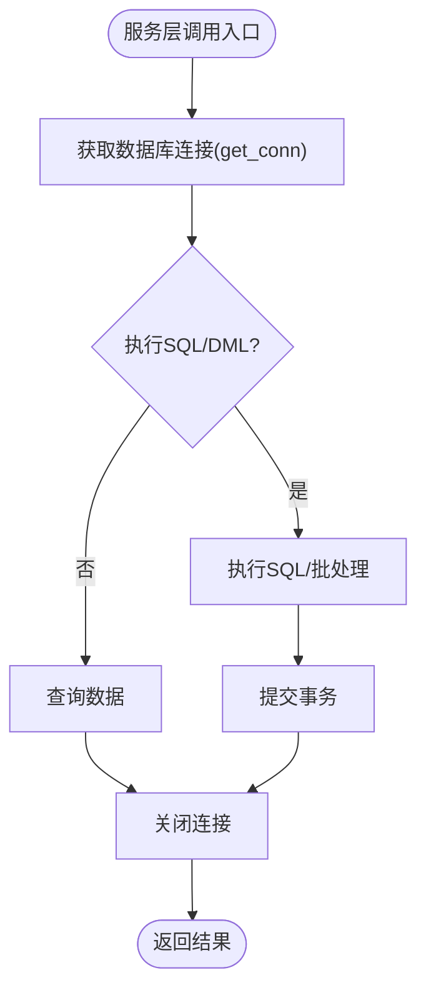
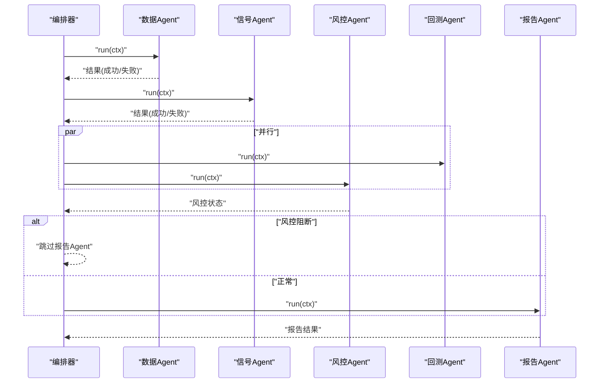
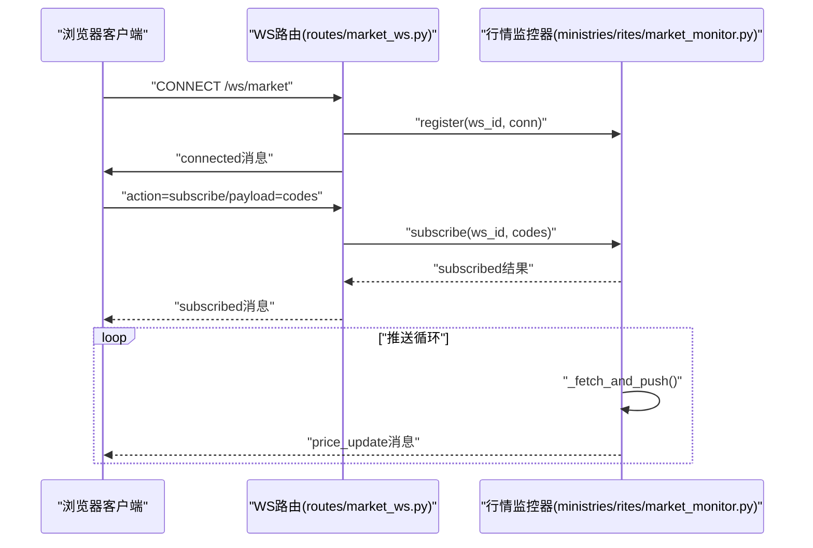
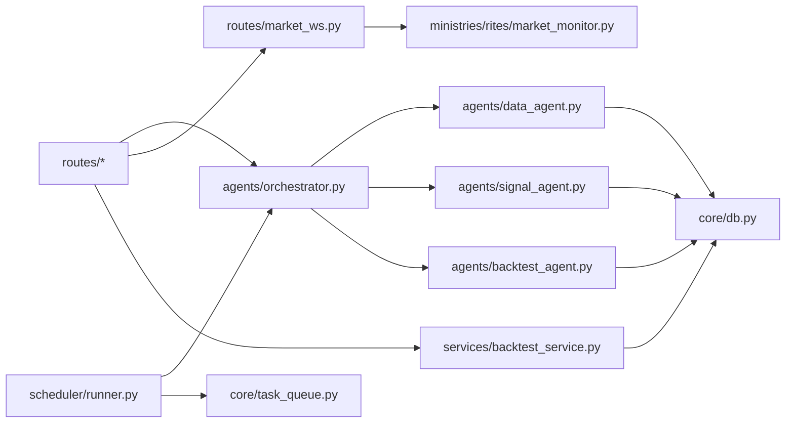

# 组件交互

<cite>
**本文引用的文件**
- [app.py](file://app.py)
- [routes/__init__.py](file://routes/__init__.py)
- [routes/agents.py](file://routes/agents.py)
- [routes/market_ws.py](file://routes/market_ws.py)
- [agents/base.py](file://agents/base.py)
- [agents/orchestrator.py](file://agents/orchestrator.py)
- [agents/data_agent.py](file://agents/data_agent.py)
- [agents/signal_agent.py](file://agents/signal_agent.py)
- [agents/backtest_agent.py](file://agents/backtest_agent.py)
- [services/backtest_service.py](file://services/backtest_service.py)
- [core/db.py](file://core/db.py)
- [core/task_queue.py](file://core/task_queue.py)
- [scheduler/runner.py](file://scheduler/runner.py)
- [ministries/rites/market_monitor.py](file://ministries/rites/market_monitor.py)
</cite>

## 目录
1. [简介](#简介)
2. [项目结构](#项目结构)
3. [核心组件](#核心组件)
4. [架构总览](#架构总览)
5. [详细组件分析](#详细组件分析)
6. [依赖分析](#依赖分析)
7. [性能考虑](#性能考虑)
8. [故障排查指南](#故障排查指南)
9. [结论](#结论)
10. [附录](#附录)

## 简介
本文件面向AIQuant系统，聚焦“组件交互”主题，系统化阐述以下内容：
- API路由层如何与服务层交互
- 服务层如何调用数据访问层
- 多Agent流水线如何协调各个执行单元
- 组件间的数据传递格式、错误传播机制和状态同步方式
- 异步通信机制：WebSocket消息处理、定时任务调度与后台进程管理
- 组件解耦策略与依赖注入机制

目标是帮助读者快速理解系统在不同层次上的职责边界、调用关系与数据流，并提供序列图与时序图以直观展示典型业务流程。

## 项目结构
AIQuant采用分层架构：API路由层（Flask Blueprints）、业务服务层（Services）、数据访问层（Core DB/Repository）、执行编排层（Agents/Orc）与基础设施（WebSocket、定时调度、任务队列）。蓝图在应用入口集中注册，形成统一的REST接口面；WebSocket独立蓝图负责实时行情推送；调度器在后台线程中按计划触发任务或流水线。

图表来源
- [app.py:1-164](file://app.py#L1-L164)
- [routes/__init__.py:1-16](file://routes/__init__.py#L1-L16)
- [routes/agents.py:1-128](file://routes/agents.py#L1-L128)
- [routes/market_ws.py:1-142](file://routes/market_ws.py#L1-L142)
- [agents/orchestrator.py:1-263](file://agents/orchestrator.py#L1-L263)
- [agents/base.py:1-120](file://agents/base.py#L1-L120)
- [agents/data_agent.py:1-167](file://agents/data_agent.py#L1-L167)
- [agents/signal_agent.py:1-213](file://agents/signal_agent.py#L1-L213)
- [agents/backtest_agent.py:1-181](file://agents/backtest_agent.py#L1-L181)
- [services/backtest_service.py:1-135](file://services/backtest_service.py#L1-L135)
- [core/db.py:1-1213](file://core/db.py#L1-L1213)
- [core/task_queue.py:1-222](file://core/task_queue.py#L1-L222)
- [scheduler/runner.py:1-212](file://scheduler/runner.py#L1-L212)
- [ministries/rites/market_monitor.py:1-244](file://ministries/rites/market_monitor.py#L1-L244)

章节来源
- [app.py:1-164](file://app.py#L1-L164)
- [routes/__init__.py:1-16](file://routes/__init__.py#L1-L16)

## 核心组件
- API路由层（Flask Blueprints）
  - 负责HTTP协议转换与请求分发，统一前缀与命名空间，便于扩展与维护。
  - 关键蓝图：系统、股票、回测、策略、信号、仓位、交易、账户、优化、同步、代理、风控、治理、数据源、实时行情、评分、交易执行、报告、直播、意图、任务、AI、券商、LLM、部署、数据抓取等。
- 业务服务层（Services）
  - 聚合领域逻辑，封装复杂流程，屏蔽底层细节，供路由层调用。
  - 示例：批量回测服务封装策略执行与统计聚合。
- 数据访问层（Core DB/Repository）
  - 提供数据库连接、事务管理、表结构定义与常用CRUD操作。
  - 统一封装SQLite WAL模式、超时与回滚，保证一致性与并发安全。
- 执行编排层（Agents/Orchestrator）
  - 以“三省六部制”组织Agent流水线，支持串行与并行组合、状态持久化、错误处理与重试。
  - 上下文（AgentContext）作为共享数据容器，贯穿流水线各环节。
- 基础设施
  - WebSocket：行情推送、客户端订阅管理、心跳与状态查询。
  - 定时调度：基于schedule的后台线程，按计划触发数据同步、扫描与流水线。
  - 轻量任务队列：线程池驱动的异步任务提交、状态跟踪与回调通知。

章节来源
- [routes/agents.py:1-128](file://routes/agents.py#L1-L128)
- [services/backtest_service.py:1-135](file://services/backtest_service.py#L1-L135)
- [core/db.py:1-1213](file://core/db.py#L1-L1213)
- [agents/orchestrator.py:1-263](file://agents/orchestrator.py#L1-L263)
- [agents/base.py:1-120](file://agents/base.py#L1-L120)
- [routes/market_ws.py:1-142](file://routes/market_ws.py#L1-L142)
- [scheduler/runner.py:1-212](file://scheduler/runner.py#L1-L212)
- [core/task_queue.py:1-222](file://core/task_queue.py#L1-L222)

## 架构总览
系统采用“路由-服务-数据-执行”的分层设计，配合WebSocket与定时调度，形成“请求驱动 + 计划驱动”的双通道执行模型。流水线编排器作为中枢，串联数据采集、信号生成、并行风控与回测验证、最终生成报告。

图表来源
- [app.py:1-164](file://app.py#L1-L164)
- [routes/agents.py:1-128](file://routes/agents.py#L1-L128)
- [routes/market_ws.py:1-142](file://routes/market_ws.py#L1-L142)
- [agents/orchestrator.py:1-263](file://agents/orchestrator.py#L1-L263)
- [agents/data_agent.py:1-167](file://agents/data_agent.py#L1-L167)
- [agents/signal_agent.py:1-213](file://agents/signal_agent.py#L1-L213)
- [agents/backtest_agent.py:1-181](file://agents/backtest_agent.py#L1-L181)
- [core/db.py:1-1213](file://core/db.py#L1-L1213)
- [ministries/rites/market_monitor.py:1-244](file://ministries/rites/market_monitor.py#L1-L244)
- [scheduler/runner.py:1-212](file://scheduler/runner.py#L1-L212)
- [core/task_queue.py:1-222](file://core/task_queue.py#L1-L222)

## 详细组件分析

### API路由层与服务层交互
- 路由层职责
  - 定义REST接口，进行参数校验与响应封装，将业务逻辑委托给服务层。
  - 例如流水线API：状态查询、手动触发、历史查询、治理信息等。
- 服务层职责
  - 封装复杂业务：如批量回测服务，内部调用脚本执行器并聚合统计指标。
- 数据传递
  - 请求体/查询参数经路由层解析后传入服务层；服务层返回标准化字典或结构化对象，路由层统一转为JSON响应。
- 错误传播
  - 路由层捕获异常并返回标准错误结构；服务层抛出的异常在路由层被捕获并转换为HTTP错误码与错误信息。

图表来源
- [routes/agents.py:34-69](file://routes/agents.py#L34-L69)
- [agents/orchestrator.py:81-175](file://agents/orchestrator.py#L81-L175)
- [agents/data_agent.py:31-86](file://agents/data_agent.py#L31-L86)
- [agents/signal_agent.py:47-108](file://agents/signal_agent.py#L47-L108)
- [agents/backtest_agent.py:37-68](file://agents/backtest_agent.py#L37-L68)

章节来源
- [routes/agents.py:1-128](file://routes/agents.py#L1-L128)
- [services/backtest_service.py:1-135](file://services/backtest_service.py#L1-L135)

### 服务层与数据访问层交互
- 服务层通过核心DB模块访问数据库，避免直接依赖具体ORM或第三方库。
- DB模块提供：
  - 连接管理（上下文管理器，自动提交/回滚/关闭）
  - 表结构定义与迁移
  - 常用读写方法（批量插入/更新、查询、统计）
- 服务层调用示例：批量回测服务在内部调用脚本执行器，同时依赖DB进行数据读取与结果落库。

图表来源
- [core/db.py:26-39](file://core/db.py#L26-L39)
- [services/backtest_service.py:20-38](file://services/backtest_service.py#L20-L38)

章节来源
- [core/db.py:1-1213](file://core/db.py#L1-L1213)
- [services/backtest_service.py:1-135](file://services/backtest_service.py#L1-L135)

### 多Agent流水线协调
- 编排器职责
  - 管理执行顺序与依赖：数据Agent（串行）→ 信号Agent（串行）→ 并行（回测Agent、风控Agent）→ 报告Agent（串行）
  - 门下省一票否决：若风控Agent判定阻断，跳过报告Agent
  - 状态持久化：执行摘要、历史记录、当前状态
- 上下文与回调
  - AgentContext作为共享存储，Agent通过set/get读写数据
  - 编排器提供Agent开始/完成回调，用于状态上报与UI联动
- 并行执行
  - 使用线程池并行启动多个Agent，统一join等待完成

图表来源
- [agents/orchestrator.py:81-175](file://agents/orchestrator.py#L81-L175)
- [agents/data_agent.py:31-86](file://agents/data_agent.py#L31-L86)
- [agents/signal_agent.py:47-108](file://agents/signal_agent.py#L47-L108)
- [agents/backtest_agent.py:37-68](file://agents/backtest_agent.py#L37-L68)

章节来源
- [agents/orchestrator.py:1-263](file://agents/orchestrator.py#L1-L263)
- [agents/base.py:1-120](file://agents/base.py#L1-L120)

### 组件间数据传递格式
- AgentResult
  - 字段：agent_name、success、data、error、started_at、finished_at、elapsed_sec
  - 用于承载单个Agent的执行结果与元信息
- AgentContext
  - 字段：pipeline_id、run_date、results、_store
  - 用于跨Agent共享数据与结果汇总
- 路由层响应
  - 统一返回JSON对象，包含success、message、data、error等键，便于前端消费
- WebSocket消息
  - 类型：connected、subscribed、unsubscribed、price_update、system、pong、error
  - 结构：包含type、data、timestamp等字段

章节来源
- [agents/base.py:20-86](file://agents/base.py#L20-L86)
- [routes/agents.py:22-31](file://routes/agents.py#L22-L31)
- [routes/market_ws.py:125-142](file://routes/market_ws.py#L125-L142)

### 错误传播机制与状态同步
- 错误传播
  - 路由层：全局错误处理器捕获404/500，统一返回JSON
  - Agent层：BaseAgent在run中捕获异常，填充error字段并记录耗时
  - 编排器：记录每个Agent的执行摘要，汇总overall_success
- 状态同步
  - 编排器：维护_history与_current_ctx，提供历史查询与当前状态查询
  - 调度器：PIPELINE_STATUS、SYNC_STATUS、SCAN_STATUS等全局状态字典
  - WebSocket：客户端通过action/status查询监控状态与订阅列表

章节来源
- [app.py:136-145](file://app.py#L136-L145)
- [agents/base.py:93-114](file://agents/base.py#L93-L114)
- [agents/orchestrator.py:67-76](file://agents/orchestrator.py#L67-L76)
- [scheduler/runner.py:17-22](file://scheduler/runner.py#L17-L22)

### 异步通信机制
- WebSocket消息处理
  - 客户端通过/ws/market建立连接，发送subscribe/unsubscribe/ping/status等动作
  - 服务端解析消息，调用行情监控器进行订阅管理与推送
- 定时任务调度
  - 基于schedule的后台线程循环，按计划触发数据同步、扫描与流水线
  - 支持传统模式与流水线模式，通过环境变量切换
- 后台进程管理
  - 调度器以守护线程运行，避免阻塞主线程
  - 任务队列提供线程池异步执行能力，支持任务状态跟踪与回调

图表来源
- [routes/market_ws.py:72-123](file://routes/market_ws.py#L72-L123)
- [ministries/rites/market_monitor.py:124-193](file://ministries/rites/market_monitor.py#L124-L193)

章节来源
- [routes/market_ws.py:1-142](file://routes/market_ws.py#L1-L142)
- [ministries/rites/market_monitor.py:1-244](file://ministries/rites/market_monitor.py#L1-L244)
- [scheduler/runner.py:158-212](file://scheduler/runner.py#L158-L212)
- [core/task_queue.py:51-100](file://core/task_queue.py#L51-L100)

### 组件解耦策略与依赖注入
- 解耦策略
  - 蓝图与应用分离：app.py集中注册，路由层仅负责协议与参数
  - 延迟导入：编排器按需导入Agent类，避免缺失外部依赖导致启动失败
  - 单例模式：编排器、行情监控器、任务队列均提供get_xxx()单例，减少全局状态散落
  - 上下文传递：Agent间通过AgentContext解耦，避免直接耦合
- 依赖注入
  - 编排器通过字符串映射注册Agent模块，运行时动态导入，便于替换与扩展
  - 路由层通过工厂函数（get_orchestrator）获取实例，便于测试替身

章节来源
- [agents/orchestrator.py:46-58](file://agents/orchestrator.py#L46-L58)
- [agents/orchestrator.py:257-262](file://agents/orchestrator.py#L257-L262)
- [routes/market_ws.py:23-23](file://routes/market_ws.py#L23-L23)
- [core/task_queue.py:216-221](file://core/task_queue.py#L216-L221)

## 依赖分析
- 路由层对编排器与监控器的依赖
  - 流水线API依赖编排器单例；WebSocket路由依赖行情监控器单例
- 编排器对Agent与DB的依赖
  - 数据Agent负责交易日判断、全量/增量同步与质量检查
  - 信号Agent运行策略融合与v4扫描，生成候选列表并保存至DB
  - 回测Agent对候选进行历史回测验证
- 服务层对DB的依赖
  - 批量回测服务在内部调用脚本执行器，同时依赖DB进行数据读取与结果落库
- 基础设施对第三方库的依赖
  - WebSocket依赖flask_sock；调度依赖schedule；任务队列依赖concurrent.futures

图表来源
- [routes/agents.py:1-128](file://routes/agents.py#L1-L128)
- [routes/market_ws.py:1-142](file://routes/market_ws.py#L1-L142)
- [agents/orchestrator.py:1-263](file://agents/orchestrator.py#L1-L263)
- [agents/data_agent.py:1-167](file://agents/data_agent.py#L1-L167)
- [agents/signal_agent.py:1-213](file://agents/signal_agent.py#L1-L213)
- [agents/backtest_agent.py:1-181](file://agents/backtest_agent.py#L1-L181)
- [services/backtest_service.py:1-135](file://services/backtest_service.py#L1-L135)
- [core/db.py:1-1213](file://core/db.py#L1-L1213)
- [scheduler/runner.py:1-212](file://scheduler/runner.py#L1-L212)
- [core/task_queue.py:1-222](file://core/task_queue.py#L1-L222)

章节来源
- [app.py:1-164](file://app.py#L1-L164)

## 性能考虑
- 数据库并发
  - SQLite启用WAL模式与NORMAL同步，提升并发写入性能；连接超时设置避免阻塞
- 线程与并行
  - 编排器并行执行回测与风控，缩短整体时延；任务队列限制最大工作线程数，避免资源争用
- 网络与IO
  - WebSocket批量推送，按批次拉取行情，避免一次性压力过大
- 调度策略
  - 交易日跳过与收盘后全量同步，盘中增量同步，降低重复工作量

## 故障排查指南
- 路由层错误
  - 404/500错误：检查URL路径与蓝图注册；查看全局错误处理器返回的错误信息
- Agent执行失败
  - 检查AgentResult.error字段，定位异常堆栈；确认上下文数据是否正确传递
- 数据库问题
  - 检查DB连接是否正常、事务是否回滚；核对表结构与索引是否存在
- WebSocket异常
  - 检查客户端连接状态与订阅列表；查看行情监控器状态与推送循环日志
- 调度器未运行
  - 确认定时任务是否被阻塞；检查PIPELINE_STATUS/SYNC_STATUS/SCAN_STATUS状态

章节来源
- [app.py:136-145](file://app.py#L136-L145)
- [agents/base.py:107-110](file://agents/base.py#L107-L110)
- [core/db.py:26-39](file://core/db.py#L26-L39)
- [routes/market_ws.py:119-122](file://routes/market_ws.py#L119-L122)
- [scheduler/runner.py:158-182](file://scheduler/runner.py#L158-L182)

## 结论
AIQuant通过清晰的分层与编排机制，实现了从API到数据的稳定流转与从请求到计划的双重驱动。流水线编排器将多Agent解耦为可观察、可扩展的执行单元，结合WebSocket与定时调度，满足实时监控与周期性任务的双重需求。建议在扩展新Agent或服务时，遵循现有约定：使用AgentContext传递数据、通过单例获取实例、在路由层统一响应格式，以维持系统的可维护性与一致性。

## 附录
- 关键流程参考
  - 典型流水线执行：见“API路由层与服务层交互”与“多Agent流水线协调”
  - 实时行情推送：见“异步通信机制”
  - 批量回测服务：见“服务层与数据访问层交互”