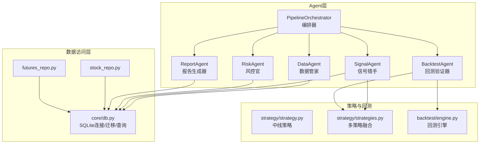
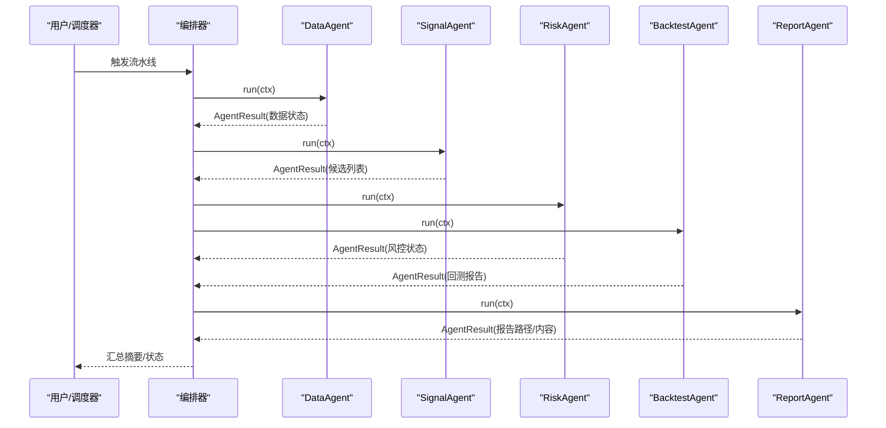
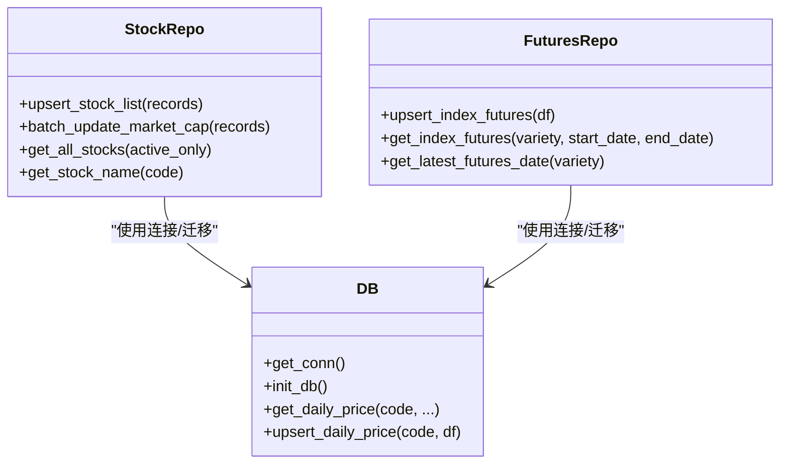
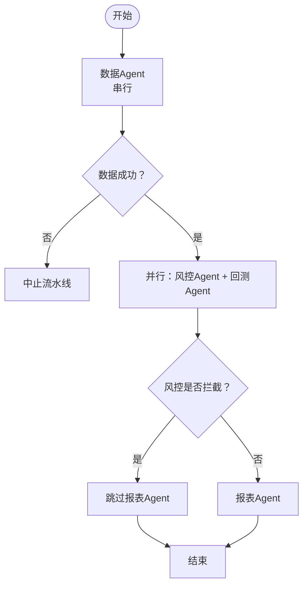
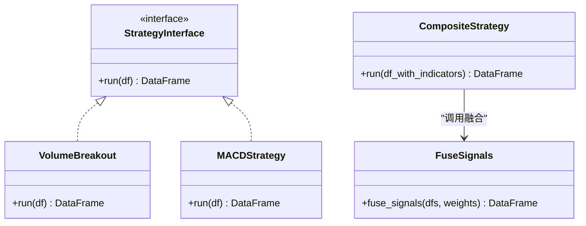
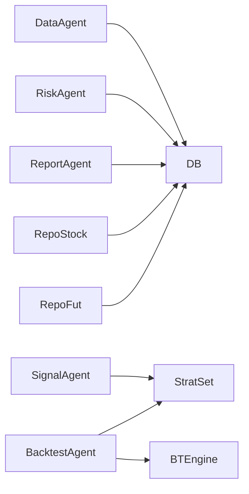

# 设计模式

<cite>
**本文引用的文件**
- [agents/base.py](file://agents/base.py)
- [agents/orchestrator.py](file://agents/orchestrator.py)
- [agents/data_agent.py](file://agents/data_agent.py)
- [agents/signal_agent.py](file://agents/signal_agent.py)
- [agents/risk_agent.py](file://agents/risk_agent.py)
- [agents/backtest_agent.py](file://agents/backtest_agent.py)
- [agents/report_agent.py](file://agents/report_agent.py)
- [core/db.py](file://core/db.py)
- [core/repository/futures_repo.py](file://core/repository/futures_repo.py)
- [core/repository/stock_repo.py](file://core/repository/stock_repo.py)
- [backtest/engine.py](file://backtest/engine.py)
- [strategy/strategy.py](file://strategy/strategy.py)
- [strategy/strategies.py](file://strategy/strategies.py)
- [quant.py](file://quant.py)
</cite>

## 目录
1. [简介](#简介)
2. [项目结构](#项目结构)
3. [核心组件](#核心组件)
4. [架构总览](#架构总览)
5. [详细组件分析](#详细组件分析)
6. [依赖分析](#依赖分析)
7. [性能考量](#性能考量)
8. [故障排查指南](#故障排查指南)
9. [结论](#结论)
10. [附录](#附录)

## 简介
本设计模式文档聚焦于AIQuant系统中三种关键设计模式的应用与协同：
- 仓库模式（Repository Pattern）：在数据访问层对不同表进行职责分离，屏蔽底层SQL与连接细节，统一CRUD接口。
- 流水线模式（Pipeline Pattern）：在多Agent系统中以“三省六部制”组织Agent执行顺序与依赖，支持串行与并行，具备错误处理与状态持久化能力。
- 策略模式（Strategy Pattern）：在量化策略引擎中以统一接口封装不同策略，便于组合、扩展与测试。

这些模式共同提升了系统的可维护性、可扩展性与可测试性，并通过清晰的边界与协作关系降低耦合、增强模块内聚。

## 项目结构
AIQuant采用“按职责分层 + 按功能模块划分”的组织方式：
- agents：多Agent流水线的执行单元，负责数据采集、信号生成、风控、回测与报告输出。
- core：核心基础设施，包含数据库连接与迁移、仓库层、同步工具等。
- strategy/backtest：策略与回测引擎，提供多策略融合与回测能力。
- routes/services/governance/ministries：对外接口、服务层与治理模块（与设计模式关联较弱，本文重点在agents与core）。

图表来源
- [agents/orchestrator.py:36-175](file://agents/orchestrator.py#L36-L175)
- [agents/data_agent.py:25-86](file://agents/data_agent.py#L25-L86)
- [agents/signal_agent.py:41-108](file://agents/signal_agent.py#L41-L108)
- [agents/risk_agent.py:25-96](file://agents/risk_agent.py#L25-L96)
- [agents/backtest_agent.py:31-68](file://agents/backtest_agent.py#L31-L68)
- [agents/report_agent.py:20-90](file://agents/report_agent.py#L20-L90)
- [strategy/strategies.py:366-430](file://strategy/strategies.py#L366-L430)
- [backtest/engine.py:72-174](file://backtest/engine.py#L72-L174)
- [core/repository/stock_repo.py:13-80](file://core/repository/stock_repo.py#L13-L80)
- [core/repository/futures_repo.py:27-109](file://core/repository/futures_repo.py#L27-L109)
- [core/db.py:26-40](file://core/db.py#L26-L40)

章节来源
- [agents/orchestrator.py:36-175](file://agents/orchestrator.py#L36-L175)
- [core/db.py:26-40](file://core/db.py#L26-L40)

## 核心组件
- Agent基类与上下文：统一Agent接口、结果封装与执行计时/异常捕获；上下文提供跨Agent共享数据与结果存储。
- 编排器：负责流水线阶段划分、串并行执行、依赖校验、错误处理与状态持久化。
- 仓库层：面向表的CRUD封装，隐藏连接与SQL细节，提供类型化方法。
- 策略引擎：统一策略接口，支持多策略融合与评分，便于扩展与测试。

章节来源
- [agents/base.py:20-120](file://agents/base.py#L20-L120)
- [agents/orchestrator.py:36-175](file://agents/orchestrator.py#L36-L175)
- [core/repository/stock_repo.py:13-80](file://core/repository/stock_repo.py#L13-L80)
- [strategy/strategies.py:366-430](file://strategy/strategies.py#L366-L430)

## 架构总览
AIQuant采用“流水线驱动 + 数据仓库 + 策略引擎”的三层架构：
- 流水线层：以编排器为核心，串联数据、信号、风控、回测、报告Agent。
- 数据层：以仓库模式隔离不同表的访问，统一接口与事务管理。
- 策略层：以策略模式抽象不同策略，支持融合与评分，便于参数化与回测。

图表来源
- [agents/orchestrator.py:81-175](file://agents/orchestrator.py#L81-L175)
- [agents/data_agent.py:31-86](file://agents/data_agent.py#L31-L86)
- [agents/signal_agent.py:47-108](file://agents/signal_agent.py#L47-L108)
- [agents/risk_agent.py:31-96](file://agents/risk_agent.py#L31-L96)
- [agents/backtest_agent.py:37-68](file://agents/backtest_agent.py#L37-L68)
- [agents/report_agent.py:63-90](file://agents/report_agent.py#L63-L90)

## 详细组件分析

### 仓库模式（Repository Pattern）在数据访问层的应用
- 设计要点
  - 每个仓库专注单一表的CRUD，方法命名语义化，参数类型化，返回DataFrame或记录数。
  - 通过统一连接工厂管理SQLite连接，启用WAL与合理同步策略，保障并发与一致性。
  - 提供批量写入/更新、条件查询、索引利用与日期格式化等实用工具。
- 代码示例路径
  - 批量写入股票列表与市值信息：[core/repository/stock_repo.py:13-50](file://core/repository/stock_repo.py#L13-L50)
  - 查询股票列表与名称：[core/repository/stock_repo.py:62-80](file://core/repository/stock_repo.py#L62-L80)
  - 指数期货批量Upsert与查询：[core/repository/futures_repo.py:27-98](file://core/repository/futures_repo.py#L27-L98)
  - 数据库连接与迁移：[core/db.py:26-40](file://core/db.py#L26-L40)、[core/db.py:57-428](file://core/db.py#L57-L428)
- 优势
  - 解耦业务与数据访问，便于替换存储后端。
  - 统一事务与错误处理，减少重复代码。
  - 易于测试：可注入Mock仓库替代真实数据库。

图表来源
- [core/repository/stock_repo.py:13-80](file://core/repository/stock_repo.py#L13-L80)
- [core/repository/futures_repo.py:27-109](file://core/repository/futures_repo.py#L27-L109)
- [core/db.py:26-40](file://core/db.py#L26-L40)

章节来源
- [core/repository/stock_repo.py:13-80](file://core/repository/stock_repo.py#L13-L80)
- [core/repository/futures_repo.py:27-109](file://core/repository/futures_repo.py#L27-L109)
- [core/db.py:26-40](file://core/db.py#L26-L40)

### 流水线模式（Pipeline Pattern）在多Agent系统中的实现
- 设计要点
  - 三省六部制：太子院（数据）、中书省（信号）、门下省（风控）、尚书省（回测/报表）。
  - 串行与并行结合：数据完成后并行执行风控与回测，风控拦截后跳过报表。
  - 上下文共享：Agent通过AgentContext读写共享数据，统一结果收集与摘要。
  - 错误处理：捕获异常、记录错误、统计耗时，保证流水线可观测性。
- 代码示例路径
  - 编排器核心流程与并行执行：[agents/orchestrator.py:81-175](file://agents/orchestrator.py#L81-L175)
  - Agent基类与上下文：[agents/base.py:88-120](file://agents/base.py#L88-L120)
  - 数据Agent（串行前置）：[agents/data_agent.py:31-86](file://agents/data_agent.py#L31-L86)
  - 风控Agent（门下省一票否决）：[agents/risk_agent.py:31-96](file://agents/risk_agent.py#L31-L96)
  - 回测Agent（并行阶段）：[agents/backtest_agent.py:37-68](file://agents/backtest_agent.py#L37-L68)
  - 报告Agent（最终汇总）：[agents/report_agent.py:63-90](file://agents/report_agent.py#L63-L90)
- 优势
  - 易于扩展新阶段：新增Agent只需注册与依赖声明。
  - 易于监控与排障：统一结果与摘要，异常可定位到具体Agent。
  - 并行加速：并行阶段显著缩短整体耗时。

图表来源
- [agents/orchestrator.py:112-175](file://agents/orchestrator.py#L112-L175)
- [agents/risk_agent.py:60-67](file://agents/risk_agent.py#L60-L67)

章节来源
- [agents/orchestrator.py:81-175](file://agents/orchestrator.py#L81-L175)
- [agents/base.py:88-120](file://agents/base.py#L88-L120)
- [agents/data_agent.py:31-86](file://agents/data_agent.py#L31-L86)
- [agents/risk_agent.py:31-96](file://agents/risk_agent.py#L31-L96)
- [agents/backtest_agent.py:37-68](file://agents/backtest_agent.py#L37-L68)
- [agents/report_agent.py:63-90](file://agents/report_agent.py#L63-L90)

### 策略模式（Strategy Pattern）在量化策略引擎中的使用
- 设计要点
  - 统一接口：不同策略函数接收相同输入（DataFrame OHLCV），返回包含BUY_SIGNAL/SELL_SIGNAL/SCORE等列的DataFrame。
  - 可插拔组合：多策略独立实现，通过融合函数进行加权合成，形成综合评分。
  - 参数化与可测试：策略参数集中配置，便于回测与A/B对比。
- 代码示例路径
  - 多策略融合与评分：[strategy/strategies.py:366-430](file://strategy/strategies.py#L366-L430)
  - 中线综合评分策略：[strategy/strategy.py:180-245](file://strategy/strategy.py#L180-L245)
  - 回测Agent调用策略与回测：[agents/backtest_agent.py:114-161](file://agents/backtest_agent.py#L114-L161)
  - 量化核心扫描与阈值：[quant.py:71-143](file://quant.py#L71-L143)
- 优势
  - 易于新增策略：遵循统一输出格式即可无缝接入。
  - 易于参数化与回测：策略参数集中，便于网格搜索与敏感性分析。
  - 易于可视化与解释：评分与触发条件可直接展示。

图表来源
- [strategy/strategies.py:366-430](file://strategy/strategies.py#L366-L430)
- [strategy/strategy.py:180-245](file://strategy/strategy.py#L180-L245)

章节来源
- [strategy/strategies.py:366-430](file://strategy/strategies.py#L366-L430)
- [strategy/strategy.py:180-245](file://strategy/strategy.py#L180-L245)
- [agents/backtest_agent.py:114-161](file://agents/backtest_agent.py#L114-L161)
- [quant.py:71-143](file://quant.py#L71-L143)

## 依赖分析
- 组件耦合与内聚
  - Agent之间通过上下文解耦，仅依赖统一接口与共享数据键。
  - 仓库层与策略层分别面向“数据”和“算法”，边界清晰，内聚度高。
- 直接与间接依赖
  - Agent依赖仓库与策略模块；回测Agent依赖策略与回测引擎；报告Agent依赖上游Agent结果。
- 外部依赖与集成点
  - SQLite连接与迁移脚本；Backtrader回测框架；Pandas/Numpy数据处理。
- 接口契约与实现细节
  - Agent基类约定统一执行流程；策略函数约定输出列；仓库函数约定参数与返回。

图表来源
- [agents/data_agent.py:17-22](file://agents/data_agent.py#L17-L22)
- [agents/signal_agent.py:18-28](file://agents/signal_agent.py#L18-L28)
- [agents/backtest_agent.py:17-28](file://agents/backtest_agent.py#L17-L28)
- [agents/risk_agent.py:20-22](file://agents/risk_agent.py#L20-L22)
- [agents/report_agent.py:17-18](file://agents/report_agent.py#L17-L18)
- [core/repository/stock_repo.py:8-10](file://core/repository/stock_repo.py#L8-L10)
- [core/repository/futures_repo.py:7-9](file://core/repository/futures_repo.py#L7-L9)
- [backtest/engine.py:10-14](file://backtest/engine.py#L10-L14)

章节来源
- [agents/data_agent.py:17-22](file://agents/data_agent.py#L17-L22)
- [agents/signal_agent.py:18-28](file://agents/signal_agent.py#L18-L28)
- [agents/backtest_agent.py:17-28](file://agents/backtest_agent.py#L17-L28)
- [agents/risk_agent.py:20-22](file://agents/risk_agent.py#L20-L22)
- [agents/report_agent.py:17-18](file://agents/report_agent.py#L17-L18)
- [core/repository/stock_repo.py:8-10](file://core/repository/stock_repo.py#L8-L10)
- [core/repository/futures_repo.py:7-9](file://core/repository/futures_repo.py#L7-L9)
- [backtest/engine.py:10-14](file://backtest/engine.py#L10-L14)

## 性能考量
- 仓库层
  - WAL模式与NORMAL同步提升并发写入性能；批量Upsert减少往返次数。
  - 索引覆盖常用查询（如code+date、trade_date），降低查询成本。
- Agent流水线
  - 并行阶段（风控+回测）显著缩短端到端耗时；串行阶段（数据）确保数据就绪。
  - 上下文共享避免重复IO，结果缓存与摘要便于快速诊断。
- 策略引擎
  - 向量化计算（Pandas/Numpy）提升策略执行效率；融合权重与阈值集中配置，便于快速迭代。
- 回测引擎
  - 参数网格回测需注意资源占用，建议限制并发与参数规模；分析器提取结果时避免重复计算。

## 故障排查指南
- Agent异常与耗时
  - 统一捕获异常并记录堆栈，便于定位具体Agent与时间点。
  - 通过上下文摘要查看各Agent成功/失败与耗时，快速定位瓶颈。
- 数据问题
  - 仓库层异常通常与连接、约束冲突或数据格式有关；检查Upsert参数与日期格式化。
  - 数据质量检查（缺失率、停盘检测）有助于发现上游数据异常。
- 策略与回测
  - 策略阈值与权重不当可能导致无信号或信号过多；通过量化核心扫描与回测Agent逐步调整。
  - 回测引擎异常需检查输入数据完整性与参数合法性。

章节来源
- [agents/base.py:101-113](file://agents/base.py#L101-L113)
- [agents/data_agent.py:122-157](file://agents/data_agent.py#L122-L157)
- [agents/backtest_agent.py:162-169](file://agents/backtest_agent.py#L162-L169)

## 结论
AIQuant通过仓库模式、流水线模式与策略模式的有机结合，实现了：
- 数据访问的职责分离与可替换性；
- 多Agent流水线的有序执行与可观测性；
- 策略的可插拔组合与参数化回测。

这些设计模式共同提升了系统的可维护性、可扩展性与可测试性，并为未来引入更多策略、Agent与数据源提供了清晰的演进路径。

## 附录
- 最佳实践建议
  - 新增Agent：遵循BaseAgent接口，使用AgentContext传递数据，必要时注册到编排器。
  - 新增策略：保持输入/输出格式一致，通过融合函数参与综合评分。
  - 新增仓库：遵循单一职责，提供类型化参数与清晰返回值，复用连接工厂。
  - 参数化与回测：集中管理策略参数，使用网格搜索与敏感性分析优化阈值。
  - 监控与日志：利用上下文摘要与AgentResult记录关键指标，便于问题定位与性能分析。