# 业务服务层

<cite>
**本文引用的文件**   
- [services/account_service.py](file://services/account_service.py)
- [services/backtest_service.py](file://services/backtest_service.py)
- [services/data_fetcher.py](file://services/data_fetcher.py)
- [services/optimizer_service.py](file://services/optimizer_service.py)
- [services/position_service.py](file://services/position_service.py)
- [services/signal_service.py](file://services/signal_service.py)
- [services/stock_service.py](file://services/stock_service.py)
- [services/strategy_service.py](file://services/strategy_service.py)
- [core/db.py](file://core/db.py)
- [quant.py](file://quant.py)
- [strategy/strategies.py](file://strategy/strategies.py)
- [backtest/backtest.py](file://backtest/backtest.py)
- [routes/account.py](file://routes/account.py)
- [routes/position.py](file://routes/position.py)
- [routes/strategy.py](file://routes/strategy.py)
- [routes/backtest.py](file://routes/backtest.py)
</cite>

## 目录
1. [简介](#简介)
2. [项目结构](#项目结构)
3. [核心组件](#核心组件)
4. [架构总览](#架构总览)
5. [详细组件分析](#详细组件分析)
6. [依赖分析](#依赖分析)
7. [性能考虑](#性能考虑)
8. [故障排查指南](#故障排查指南)
9. [结论](#结论)
10. [附录](#附录)

## 简介
本文件面向AIQuant业务服务层，系统化梳理账户、回测、数据、优化、位置、信号、股票与策略八大服务的职责边界、接口设计、数据流与错误处理机制，并给出服务间依赖关系图、调用序列图、典型流程图与性能优化建议。文档同时提供集成与扩展指南，帮助开发者快速理解与二次开发。

## 项目结构
服务层位于services目录，围绕“策略-数据-回测-风控-执行”主线组织，配合core/db.py进行本地SQLite持久化，配合routes层暴露REST接口，配合quant.py与strategy/strategies.py提供策略分析与扫描能力，配合backtest/backtest.py提供回测引擎。

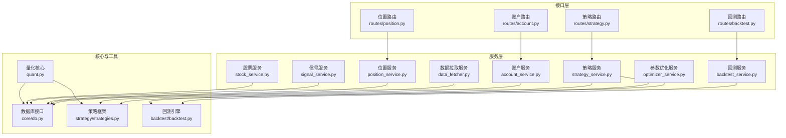

图表来源
- [services/account_service.py:1-31](file://services/account_service.py#L1-L31)
- [services/backtest_service.py:1-135](file://services/backtest_service.py#L1-L135)
- [services/data_fetcher.py:1-106](file://services/data_fetcher.py#L1-L106)
- [services/optimizer_service.py:1-92](file://services/optimizer_service.py#L1-L92)
- [services/position_service.py:1-80](file://services/position_service.py#L1-L80)
- [services/signal_service.py:1-243](file://services/signal_service.py#L1-L243)
- [services/stock_service.py:1-194](file://services/stock_service.py#L1-L194)
- [services/strategy_service.py:1-325](file://services/strategy_service.py#L1-L325)
- [core/db.py:1-1213](file://core/db.py#L1-L1213)
- [quant.py:1-631](file://quant.py#L1-L631)
- [strategy/strategies.py:1-431](file://strategy/strategies.py#L1-L431)
- [backtest/backtest.py:1-517](file://backtest/backtest.py#L1-L517)
- [routes/account.py:1-38](file://routes/account.py#L1-L38)
- [routes/position.py:1-116](file://routes/position.py#L1-L116)
- [routes/strategy.py:1-87](file://routes/strategy.py#L1-L87)
- [routes/backtest.py:1-45](file://routes/backtest.py#L1-L45)

章节来源
- [services/account_service.py:1-31](file://services/account_service.py#L1-L31)
- [services/backtest_service.py:1-135](file://services/backtest_service.py#L1-L135)
- [services/data_fetcher.py:1-106](file://services/data_fetcher.py#L1-L106)
- [services/optimizer_service.py:1-92](file://services/optimizer_service.py#L1-L92)
- [services/position_service.py:1-80](file://services/position_service.py#L1-L80)
- [services/signal_service.py:1-243](file://services/signal_service.py#L1-L243)
- [services/stock_service.py:1-194](file://services/stock_service.py#L1-L194)
- [services/strategy_service.py:1-325](file://services/strategy_service.py#L1-L325)
- [core/db.py:1-1213](file://core/db.py#L1-L1213)
- [quant.py:1-631](file://quant.py#L1-L631)
- [strategy/strategies.py:1-431](file://strategy/strategies.py#L1-L431)
- [backtest/backtest.py:1-517](file://backtest/backtest.py#L1-L517)
- [routes/account.py:1-38](file://routes/account.py#L1-L38)
- [routes/position.py:1-116](file://routes/position.py#L1-L116)
- [routes/strategy.py:1-87](file://routes/strategy.py#L1-L87)
- [routes/backtest.py:1-45](file://routes/backtest.py#L1-L45)

## 核心组件
- 账户服务：封装账户快照的查询与保存，对接本地数据库。
- 回测服务：封装批量回测流程，负责配对交易、统计指标与结果聚合。
- 数据拉取服务：封装从在线源批量抓取日线数据并入库。
- 参数优化服务：封装策略参数网格/遗传搜索与步行优化。
- 位置服务：封装持仓的增删改查、实时价格刷新与汇总。
- 信号服务：封装信号历史查询与v4超跌反弹信号查询。
- 股票服务：封装K线、综合分析、单股回测与指标输出。
- 策略服务：封装多策略运行、全市场筛选（SSE流）、多策略并联回测与对比。

章节来源
- [services/account_service.py:10-31](file://services/account_service.py#L10-L31)
- [services/backtest_service.py:10-135](file://services/backtest_service.py#L10-L135)
- [services/data_fetcher.py:17-106](file://services/data_fetcher.py#L17-L106)
- [services/optimizer_service.py:9-92](file://services/optimizer_service.py#L9-L92)
- [services/position_service.py:12-80](file://services/position_service.py#L12-L80)
- [services/signal_service.py:12-243](file://services/signal_service.py#L12-L243)
- [services/stock_service.py:23-194](file://services/stock_service.py#L23-L194)
- [services/strategy_service.py:46-325](file://services/strategy_service.py#L46-L325)

## 架构总览
服务层通过路由层对外提供HTTP接口，内部通过core/db.py与策略/回测引擎协作，形成“策略分析-信号生成-回测评估-执行落地”的闭环。

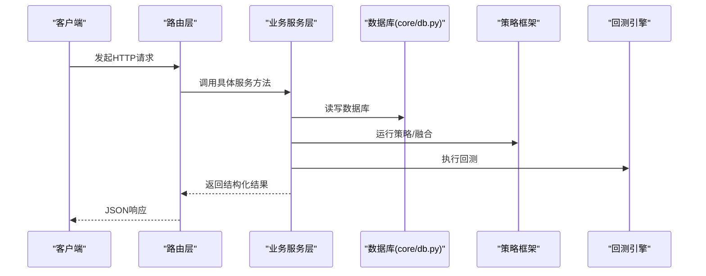

图表来源
- [routes/account.py:11-38](file://routes/account.py#L11-L38)
- [routes/position.py:15-116](file://routes/position.py#L15-L116)
- [routes/strategy.py:14-87](file://routes/strategy.py#L14-L87)
- [routes/backtest.py:12-45](file://routes/backtest.py#L12-L45)
- [services/account_service.py:10-31](file://services/account_service.py#L10-L31)
- [services/position_service.py:12-80](file://services/position_service.py#L12-L80)
- [services/strategy_service.py:46-325](file://services/strategy_service.py#L46-L325)
- [services/backtest_service.py:10-135](file://services/backtest_service.py#L10-L135)
- [core/db.py:26-40](file://core/db.py#L26-L40)
- [strategy/strategies.py:367-431](file://strategy/strategies.py#L367-L431)
- [backtest/backtest.py:56-495](file://backtest/backtest.py#L56-L495)

## 详细组件分析

### 账户服务
- 职责：提供账户快照历史查询、最新快照查询与保存。
- 关键接口：
  - 获取历史快照：按天数返回列表
  - 获取最新快照：返回字典
  - 保存快照：接收资产、现金、持仓价值等字段
- 错误处理：直接抛出底层异常，由路由层捕获并返回500。
- 事务与并发：依赖core/db.py的连接管理与WAL模式，保证并发写入安全。

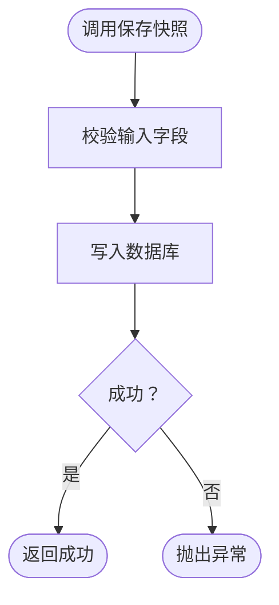

图表来源
- [services/account_service.py:20-31](file://services/account_service.py#L20-L31)
- [core/db.py:26-40](file://core/db.py#L26-L40)

章节来源
- [services/account_service.py:10-31](file://services/account_service.py#L10-L31)
- [routes/account.py:11-38](file://routes/account.py#L11-L38)
- [core/db.py:26-40](file://core/db.py#L26-L40)

### 回测服务
- 职责：批量回测（v4超跌反弹策略），配对买卖交易，计算胜率、盈亏比、收益曲线等。
- 关键接口：
  - run_batch_backtest：传入时间窗、资金、风控参数与权重，返回汇总指标与逐笔交易。
  - _pair_trades：按股票代码将原始交易按时间序配对为完整多头头寸。
- 错误处理：当回测返回错误字段时抛出ValueError，由路由层返回400。
- 依赖：调用scripts脚本执行回测（此处为服务层封装），内部统计指标。

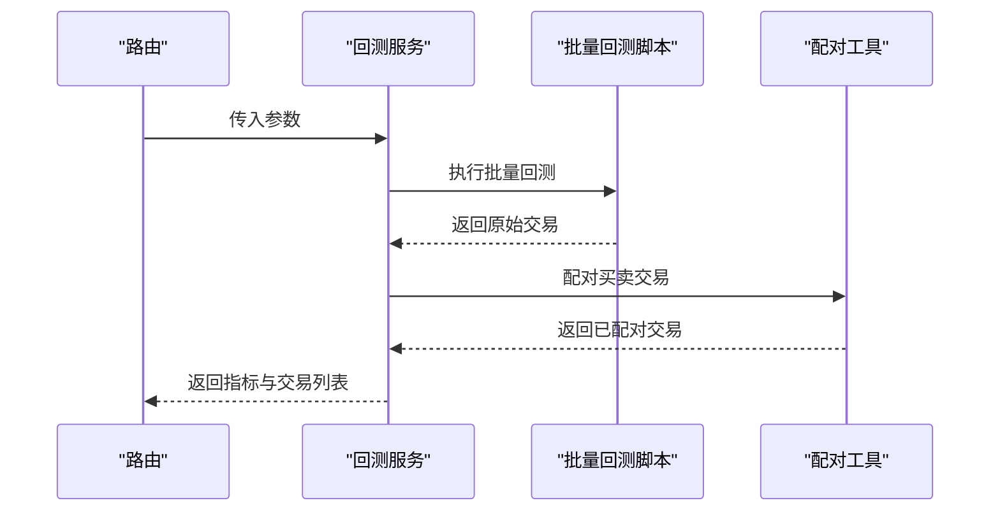

图表来源
- [services/backtest_service.py:10-135](file://services/backtest_service.py#L10-L135)

章节来源
- [services/backtest_service.py:10-135](file://services/backtest_service.py#L10-L135)
- [routes/backtest.py:12-45](file://routes/backtest.py#L12-L45)

### 数据拉取服务
- 职责：从在线源批量抓取日线数据，清洗与入库，支持单股与批量。
- 关键接口：
  - fetch_and_save_daily：单股拉取并入库，返回成功/失败与影响行数。
  - batch_fetch_and_save：批量拉取，支持进度回调。
- 错误处理：异常转为错误字典，便于路由层统一返回。
- 依赖：依赖akshare与core/db.py的upsert_daily_price。

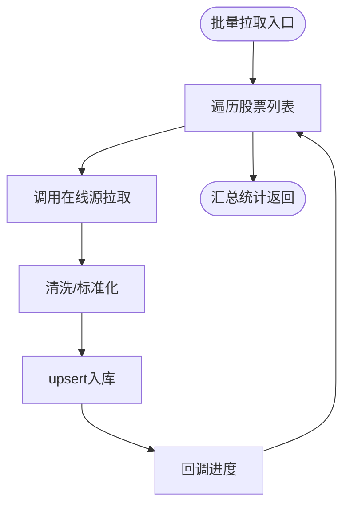

图表来源
- [services/data_fetcher.py:17-106](file://services/data_fetcher.py#L17-L106)
- [core/db.py:543-579](file://core/db.py#L543-L579)

章节来源
- [services/data_fetcher.py:17-106](file://services/data_fetcher.py#L17-L106)
- [core/db.py:543-579](file://core/db.py#L543-L579)

### 参数优化服务
- 职责：对指定策略在指定股票上进行网格搜索或遗传算法优化，或进行步行优化。
- 关键接口：
  - run_optimizer：支持网格/遗传两种方法，返回最佳参数与评分。
  - run_walkforward：对指定策略进行多折交叉验证。
- 依赖：依赖core.data_fetcher获取历史数据，依赖strategy/strategies与backtest.param_optimizer。

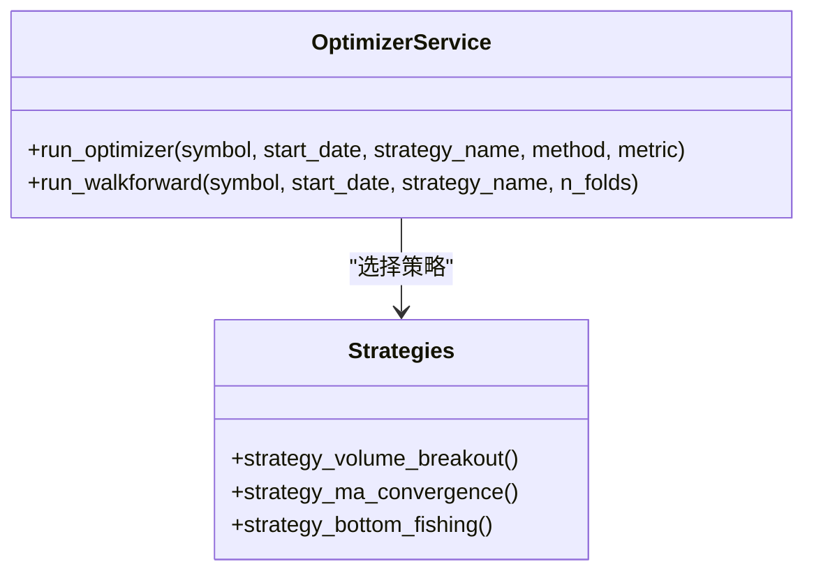

图表来源
- [services/optimizer_service.py:9-92](file://services/optimizer_service.py#L9-L92)
- [strategy/strategies.py:36-256](file://strategy/strategies.py#L36-L256)

章节来源
- [services/optimizer_service.py:9-92](file://services/optimizer_service.py#L9-L92)
- [strategy/strategies.py:36-256](file://strategy/strategies.py#L36-L256)

### 位置服务
- 职责：管理持仓的增删改查、实时价格刷新与汇总。
- 关键接口：
  - get_positions：按状态返回持仓并计算盈亏
  - add_position/close_position/partial_close_position/update_price/get_position_summary/delete_position/refresh_position_prices
- 错误处理：异常由路由层捕获返回500。
- 依赖：依赖core/db与实时行情接口。

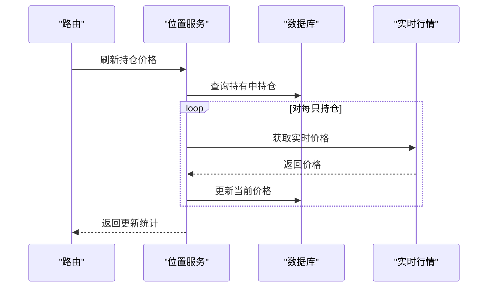

图表来源
- [services/position_service.py:66-80](file://services/position_service.py#L66-L80)
- [core/db.py:26-40](file://core/db.py#L26-L40)

章节来源
- [services/position_service.py:12-80](file://services/position_service.py#L12-L80)
- [routes/position.py:15-116](file://routes/position.py#L15-L116)
- [core/db.py:26-40](file://core/db.py#L26-L40)

### 信号服务
- 职责：查询历史信号（融合与v4两类），支持分页与限制。
- 关键接口：
  - get_signal_history：融合策略历史信号
  - get_signal_history_v4：v4超跌反弹历史信号
- 依赖：直接查询stock_signal与daily_price表，构造分组与触发器列表。

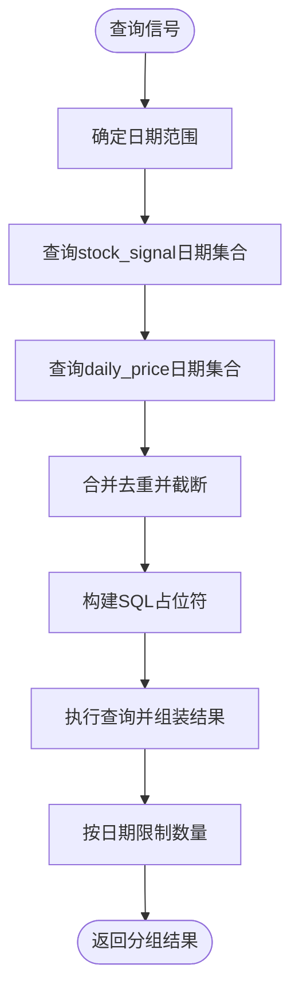

图表来源
- [services/signal_service.py:12-243](file://services/signal_service.py#L12-L243)
- [core/db.py:26-40](file://core/db.py#L26-L40)

章节来源
- [services/signal_service.py:12-243](file://services/signal_service.py#L12-L243)

### 股票服务
- 职责：提供股票列表、K线、综合分析（含指标与买卖信号）、单股回测。
- 关键接口：
  - get_stock_list：返回最新行情与可选评分
  - get_kline_data：返回K线序列
  - analyze_stock：综合分析（K线+指标+信号）
  - run_single_backtest：单股策略回测
- 依赖：依赖quant.py策略分析与backtest/backtest.py回测引擎。

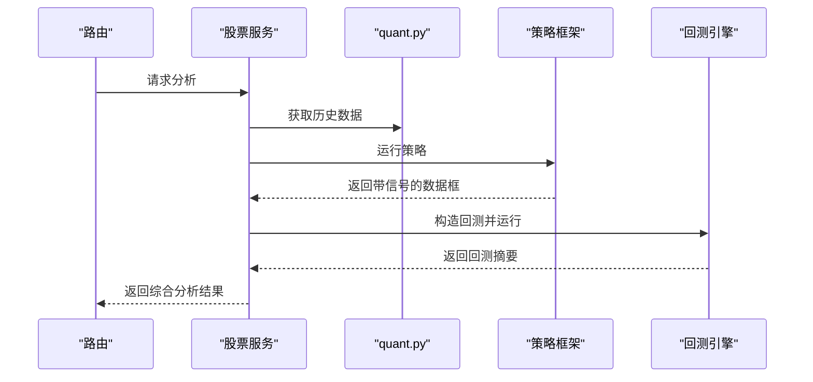

图表来源
- [services/stock_service.py:70-194](file://services/stock_service.py#L70-L194)
- [quant.py:71-142](file://quant.py#L71-L142)
- [strategy/strategies.py:367-431](file://strategy/strategies.py#L367-L431)
- [backtest/backtest.py:56-495](file://backtest/backtest.py#L56-L495)

章节来源
- [services/stock_service.py:23-194](file://services/stock_service.py#L23-L194)
- [quant.py:71-142](file://quant.py#L71-L142)
- [strategy/strategies.py:367-431](file://strategy/strategies.py#L367-L431)
- [backtest/backtest.py:56-495](file://backtest/backtest.py#L56-L495)

### 策略服务
- 职责：多策略运行、全市场筛选（SSE流）、多策略并联回测、策略对比。
- 关键接口：
  - run_all_strategies：运行五策略并融合，返回各策略信号与融合结果
  - screen_stocks_generator：SSE流式返回筛选结果
  - multi_strategy_backtest：多策略并联回测
  - compare_strategies：批量比较策略表现
- 依赖：依赖quant.py与strategy/strategies，回测依赖backtest/backtest.py。

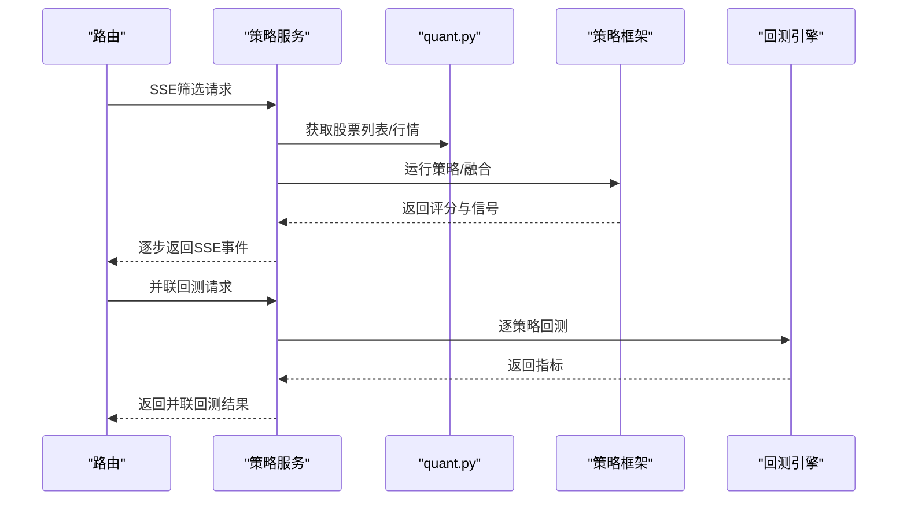

图表来源
- [services/strategy_service.py:110-268](file://services/strategy_service.py#L110-L268)
- [quant.py:289-337](file://quant.py#L289-L337)
- [strategy/strategies.py:367-431](file://strategy/strategies.py#L367-L431)
- [backtest/backtest.py:56-495](file://backtest/backtest.py#L56-L495)

章节来源
- [services/strategy_service.py:46-325](file://services/strategy_service.py#L46-L325)
- [routes/strategy.py:14-87](file://routes/strategy.py#L14-L87)
- [quant.py:289-337](file://quant.py#L289-L337)
- [strategy/strategies.py:367-431](file://strategy/strategies.py#L367-L431)
- [backtest/backtest.py:56-495](file://backtest/backtest.py#L56-L495)

## 依赖分析
- 服务到数据库：账户、位置、信号、股票、策略均通过core/db.py访问SQLite；回测服务通过回测脚本间接使用。
- 服务到策略：策略服务、股票服务、参数优化服务依赖strategy/strategies；量化核心quant.py提供策略分析与扫描。
- 服务到回测：策略服务与股票服务依赖backtest/backtest.py；回测服务封装批量回测。
- 路由到服务：routes层薄封装，统一异常捕获与HTTP状态码返回。

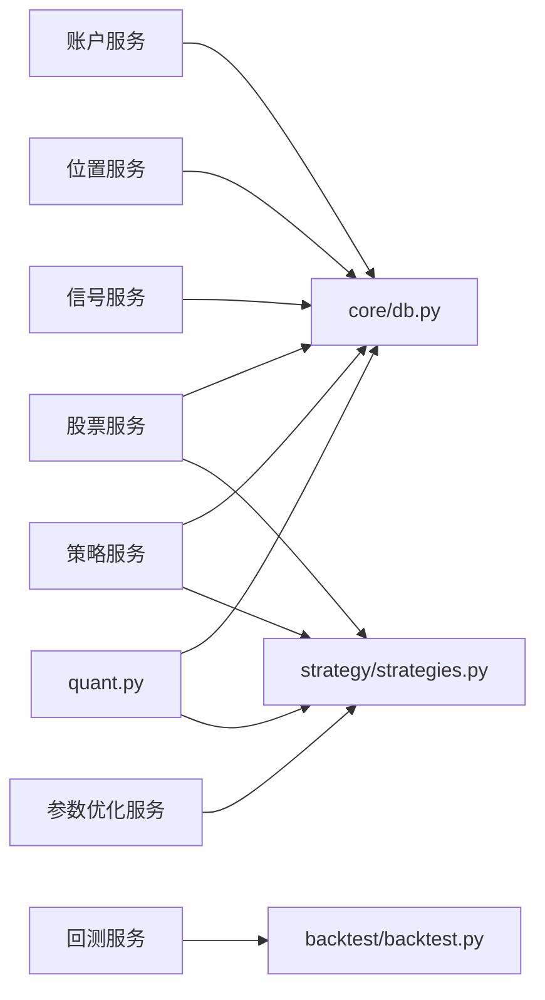

图表来源
- [services/account_service.py:7-8](file://services/account_service.py#L7-L8)
- [services/position_service.py:8-9](file://services/position_service.py#L8-L9)
- [services/signal_service.py:9-9](file://services/signal_service.py#L9-L9)
- [services/stock_service.py:7-11](file://services/stock_service.py#L7-L11)
- [services/strategy_service.py:9-22](file://services/strategy_service.py#L9-L22)
- [services/optimizer_service.py:6-6](file://services/optimizer_service.py#L6-L6)
- [backtest/backtest.py:56-517](file://backtest/backtest.py#L56-L517)
- [strategy/strategies.py:36-256](file://strategy/strategies.py#L36-L256)
- [quant.py:23-35](file://quant.py#L23-L35)
- [core/db.py:26-40](file://core/db.py#L26-L40)

章节来源
- [core/db.py:26-40](file://core/db.py#L26-L40)
- [strategy/strategies.py:36-256](file://strategy/strategies.py#L36-L256)
- [backtest/backtest.py:56-517](file://backtest/backtest.py#L56-L517)
- [quant.py:23-35](file://quant.py#L23-L35)

## 性能考虑
- 数据库并发：WAL模式与NORMAL同步策略提升写入吞吐；建议批量写入（如upsert_daily_price）减少往返。
- 策略融合：融合前尽量复用中间列，避免重复计算；SSE流式返回降低内存峰值。
- 回测引擎：T+1执行、延迟队列与滑点成本计算在回测中一次性完成，减少多次遍历。
- 实时刷新：位置服务批量刷新时异常容忍，避免单点失败影响整体。
- 参数优化：网格搜索与遗传算法可配置并行度，结合缓存与早停策略。

## 故障排查指南
- 路由层异常：所有服务异常由路由层捕获并返回500；若出现400，检查参数格式（如weights长度）。
- 数据库锁：若出现写入冲突，检查WAL模式与连接池；确保同一进程内复用连接。
- 策略异常：当策略返回空或长度不足时，服务会抛出异常；检查数据源与时间窗。
- 回测异常：当回测返回error字段时，服务抛出ValueError；检查参数与数据完整性。

章节来源
- [routes/account.py:14-18](file://routes/account.py#L14-L18)
- [routes/position.py:40-48](file://routes/position.py#L40-L48)
- [routes/strategy.py:17-32](file://routes/strategy.py#L17-L32)
- [routes/backtest.py:40-44](file://routes/backtest.py#L40-L44)
- [services/backtest_service.py:40-41](file://services/backtest_service.py#L40-L41)
- [core/db.py:26-40](file://core/db.py#L26-L40)

## 结论
业务服务层以清晰的职责划分与稳定的接口设计支撑了策略分析、信号生成、回测评估与执行落地的全流程。通过统一的数据库抽象、策略与回测引擎集成以及SSE流式输出，既保证了易用性也兼顾了性能与可扩展性。建议在生产环境中结合监控与缓存策略进一步增强稳定性与可观测性。

## 附录
- 服务调用示例（路径指引）
  - 获取账户快照：GET /api/account/snapshots?days=30
  - 保存账户快照：POST /api/account/snapshot/save
  - 获取最新持仓：GET /api/position/list?status=holding
  - 新增持仓：POST /api/position/add
  - SSE全市场筛选：GET /api/strategy/screen?use_v4=true&min_score=22.5&limit=50
  - 多策略并联回测：GET /api/strategy/backtest?symbol=000001
  - 批量回测：GET /api/backtest/batch?start_date=2025-04-03&end_date=2026-04-03
- 扩展指南
  - 新增服务：在services目录创建*.py，实现业务方法，注册到routes层，确保异常捕获与返回格式一致。
  - 自定义策略：在strategy/strategies.py中新增策略函数，遵循统一返回列；在quant.py或strategy_service中接入。
  - 自定义回测：在backtest/backtest.py中调整参数或规则，保持BacktestResult结构不变。
  - 数据源扩展：在services/data_fetcher.py中新增抓取逻辑，确保入库一致性与异常处理。