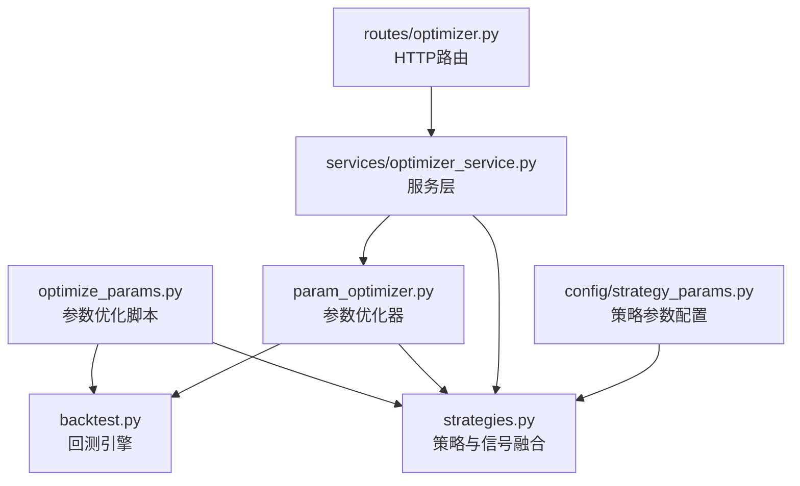
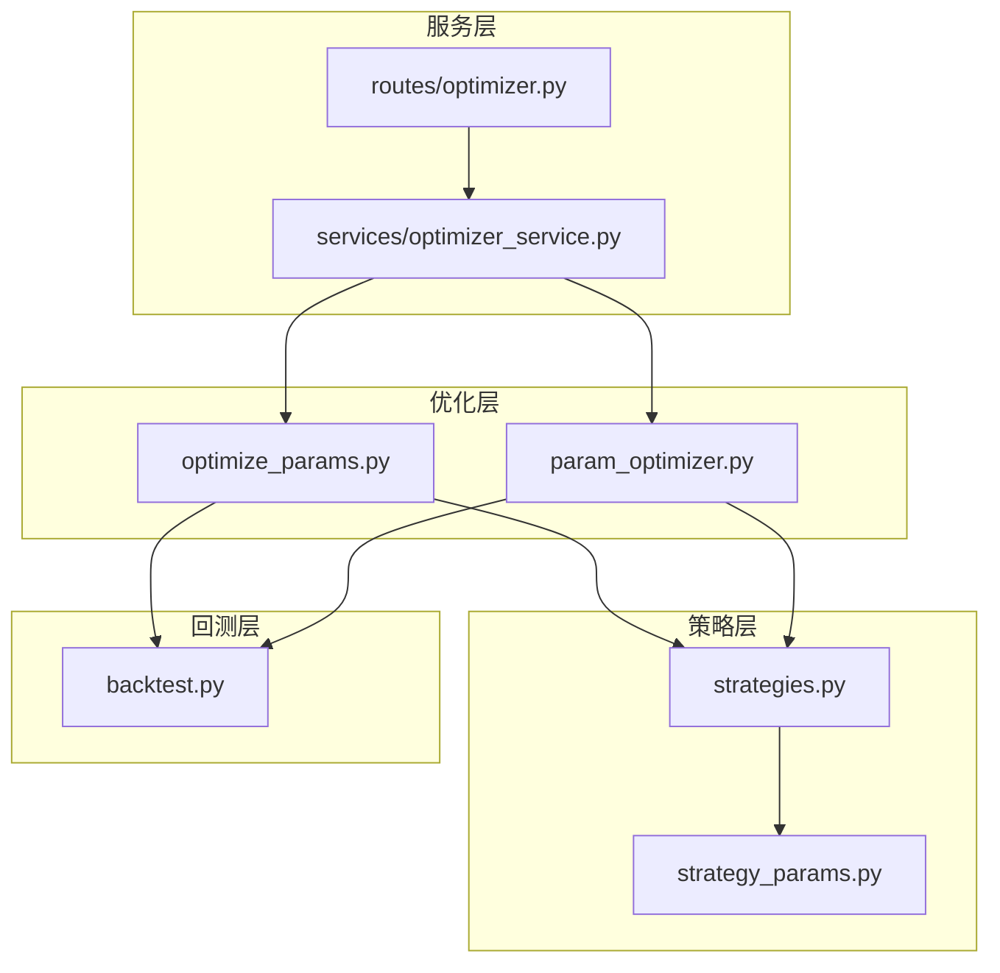
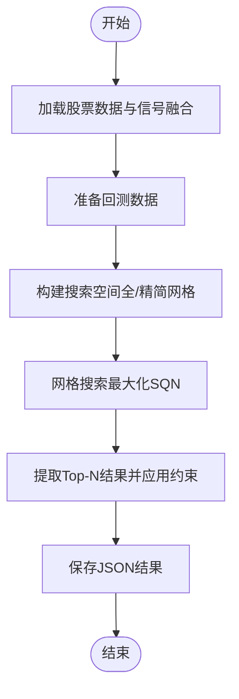
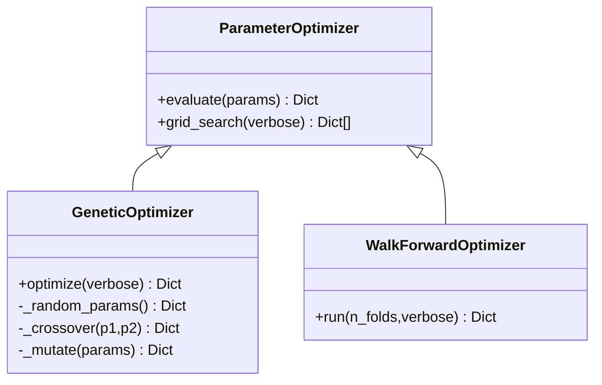
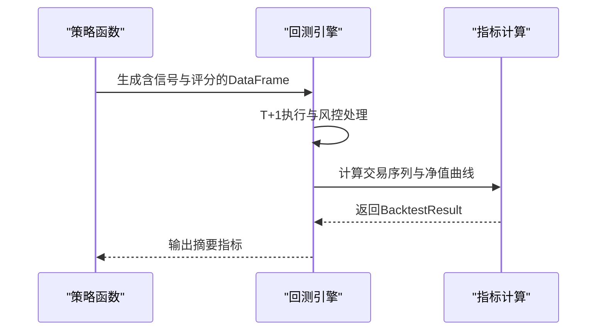
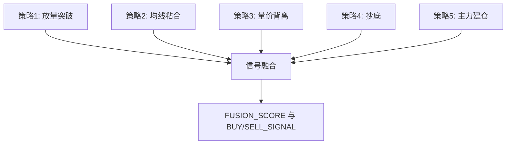
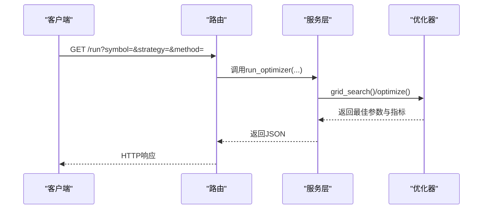
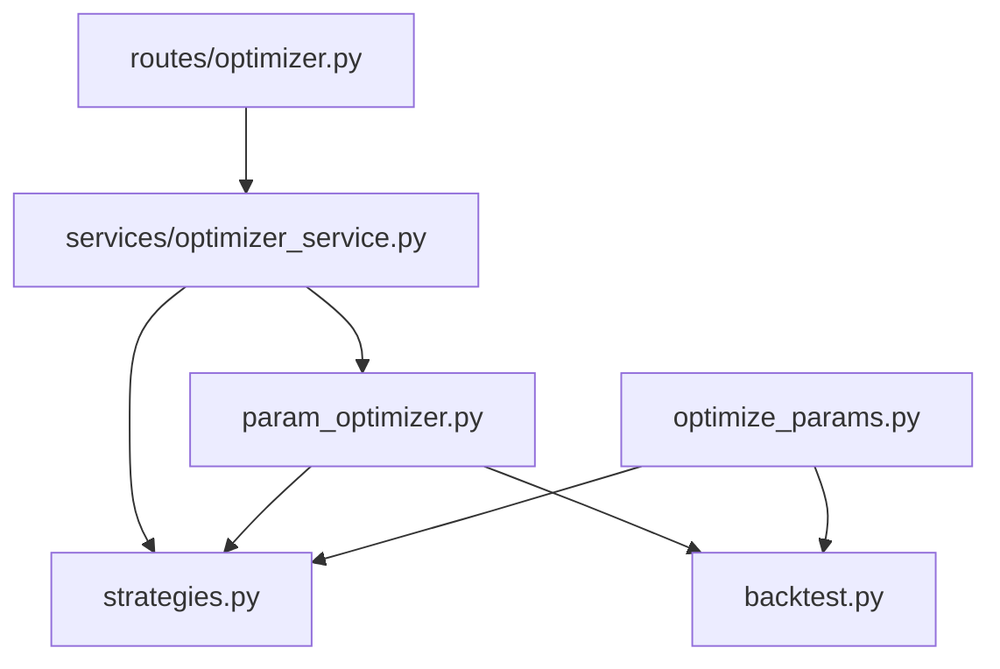

# 参数优化系统

<cite>
**本文引用的文件**
- [optimize_params.py](file://backtest/optimize_params.py)
- [param_optimizer.py](file://backtest\param_optimizer.py)
- [backtest.py](file://backtest/backtest.py)
- [strategies.py](file://strategy/strategies.py)
- [optimizer.py](file://routes/optimizer.py)
- [optimizer_service.py](file://services/optimizer_service.py)
- [strategy_params.py](file://config/strategy_params.py)
- [_任务总结_20260424.md](file://backtest/archive/_任务总结_20260424.md)
</cite>

## 目录
1. [简介](#简介)
2. [项目结构](#项目结构)
3. [核心组件](#核心组件)
4. [架构概览](#架构概览)
5. [详细组件分析](#详细组件分析)
6. [依赖分析](#依赖分析)
7. [性能考虑](#性能考虑)
8. [故障排查指南](#故障排查指南)
9. [结论](#结论)
10. [附录](#附录)

## 简介
本文件面向AIQuant参数优化系统，系统性阐述参数网格搜索算法、优化策略与性能评估方法，深入解释参数空间定义、搜索策略选择与收敛条件设置，并扩展至多目标优化、约束处理与并行优化的实现细节。文档提供具体参数优化配置示例，涵盖搜索范围设定、步长控制与停止条件；解释优化结果分析方法、参数敏感性评估与最优参数选择策略；同时给出性能优化技巧、内存管理与大规模参数空间处理能力建议。

## 项目结构
参数优化系统主要由以下模块构成：
- 参数优化脚本：负责单/多股票参数优化、结果提取与持久化
- 参数优化器：封装网格搜索、遗传算法与步行优化
- 回测引擎：提供统一的策略回测与指标计算
- 策略模块：多策略信号生成与融合
- 服务与路由：参数优化API接口
- 配置模块：策略默认参数与参数网格

**图表来源**
- [optimize_params.py:1-462](file://backtest/optimize_params.py#L1-L462)
- [param_optimizer.py:1-369](file://backtest\param_optimizer.py#L1-L369)
- [backtest.py:1-517](file://backtest/backtest.py#L1-L517)
- [strategies.py:1-431](file://strategy/strategies.py#L1-L431)
- [optimizer.py:1-48](file://routes/optimizer.py#L1-L48)
- [optimizer_service.py:1-92](file://services/optimizer_service.py#L1-L92)
- [strategy_params.py:1-76](file://config/strategy_params.py#L1-L76)

**章节来源**
- [optimize_params.py:1-462](file://backtest/optimize_params.py#L1-L462)
- [param_optimizer.py:1-369](file://backtest\param_optimizer.py#L1-L369)
- [backtest.py:1-517](file://backtest/backtest.py#L1-L517)
- [strategies.py:1-431](file://strategy/strategies.py#L1-L431)
- [optimizer.py:1-48](file://routes/optimizer.py#L1-L48)
- [optimizer_service.py:1-92](file://services/optimizer_service.py#L1-L92)
- [strategy_params.py:1-76](file://config/strategy_params.py#L1-L76)

## 核心组件
- 参数优化脚本（optimize_params.py）
  - 单/多股票参数优化流程封装，支持“全网格”与“精简网格”两种搜索模式
  - 搜索空间与固定参数、约束条件集中定义
  - 基于外部回测框架的网格搜索与结果提取
- 参数优化器（param_optimizer.py）
  - 网格搜索：遍历参数网格，评估每组参数的回测指标
  - 遗传算法：基于评分的锦标赛选择、交叉与变异，迭代优化
  - 步行优化：滚动训练/测试划分，模拟真实交易的参数优化与验证
- 回测引擎（backtest.py）
  - 提供统一回测接口，计算总收益、年化收益、最大回撤、夏普比率、胜率、盈亏比等指标
  - 支持滑点、手续费、止损止盈、动态仓位、熔断等风控机制
- 策略模块（strategies.py）
  - 多策略信号生成与融合，输出BUY/SELL信号与评分列
  - 融合策略权重可配置，便于参数优化时调整各策略权重
- 服务与路由（optimizer_service.py, routes/optimizer.py）
  - 提供HTTP接口，封装参数优化与步行优化的调用
- 策略参数配置（strategy_params.py）
  - 各策略默认参数与参数网格，便于快速切换与扩展

**章节来源**
- [optimize_params.py:63-86](file://backtest/optimize_params.py#L63-L86)
- [param_optimizer.py:19-107](file://backtest\param_optimizer.py#L19-L107)
- [param_optimizer.py:110-210](file://backtest\param_optimizer.py#L110-L210)
- [param_optimizer.py:213-296](file://backtest\param_optimizer.py#L213-L296)
- [backtest.py:56-494](file://backtest/backtest.py#L56-L494)
- [strategies.py:36-431](file://strategy/strategies.py#L36-L431)
- [optimizer_service.py:9-61](file://services/optimizer_service.py#L9-L61)
- [optimizer.py:11-47](file://routes/optimizer.py#L11-L47)
- [strategy_params.py:65-76](file://config/strategy_params.py#L65-L76)

## 架构概览
参数优化系统采用“策略-回测-优化器-服务/路由”的分层架构：
- 策略层：生成信号与评分
- 回测层：统一回测与指标计算
- 优化层：网格搜索、遗传算法、步行优化
- 服务层：HTTP接口封装
- 配置层：参数网格与默认参数

**图表来源**
- [optimize_params.py:1-462](file://backtest/optimize_params.py#L1-L462)
- [param_optimizer.py:1-369](file://backtest\param_optimizer.py#L1-L369)
- [backtest.py:1-517](file://backtest/backtest.py#L1-L517)
- [strategies.py:1-431](file://strategy/strategies.py#L1-L431)
- [optimizer.py:1-48](file://routes/optimizer.py#L1-L48)
- [optimizer_service.py:1-92](file://services/optimizer_service.py#L1-L92)
- [strategy_params.py:1-76](file://config/strategy_params.py#L1-L76)

## 详细组件分析

### 组件A：参数优化脚本（optimize_params.py）
- 搜索空间与固定参数
  - score_threshold、stop_loss_mult、take_profit_mult、max_holding_days、position_pct
  - 固定参数包括严格模式、回撤熔断、市场择时、动态仓位等
- 约束条件
  - 最少交易次数、最大回撤上限、最低夏普比率
- 优化流程
  - 加载数据与信号融合
  - 构造回测对象，执行网格搜索
  - 提取Top-N结果并格式化输出
- 结果持久化
  - 保存JSON结果，包含时间戳、方法、约束、搜索空间与所有结果

**图表来源**
- [optimize_params.py:94-176](file://backtest/optimize_params.py#L94-L176)
- [optimize_params.py:179-240](file://backtest/optimize_params.py#L179-L240)
- [optimize_params.py:418-427](file://backtest/optimize_params.py#L418-L427)

**章节来源**
- [optimize_params.py:63-86](file://backtest/optimize_params.py#L63-L86)
- [optimize_params.py:120-176](file://backtest/optimize_params.py#L120-L176)
- [optimize_params.py:179-240](file://backtest/optimize_params.py#L179-L240)
- [optimize_params.py:418-427](file://backtest/optimize_params.py#L418-L427)

### 组件B：参数优化器（param_optimizer.py）
- 网格搜索
  - 生成参数组合，逐一评估，按目标指标排序
- 遗传算法
  - 随机初始化种群，锦标赛选择精英，交叉与变异产生下一代
  - 支持整数/浮点参数范围
- 步行优化
  - 按训练比例划分滚动窗口，在训练集上优化参数并在测试集上验证
- 评估指标
  - 支持夏普比率、总收益、胜率、最大回撤、卡玛比率等

**图表来源**
- [param_optimizer.py:19-107](file://backtest\param_optimizer.py#L19-L107)
- [param_optimizer.py:110-210](file://backtest\param_optimizer.py#L110-L210)
- [param_optimizer.py:213-296](file://backtest\param_optimizer.py#L213-L296)

**章节来源**
- [param_optimizer.py:19-107](file://backtest\param_optimizer.py#L19-L107)
- [param_optimizer.py:110-210](file://backtest\param_optimizer.py#L110-L210)
- [param_optimizer.py:213-296](file://backtest\param_optimizer.py#L213-L296)

### 组件C：回测引擎（backtest.py）
- 回测特性
  - T+1执行规则、滑点与手续费、止损止盈、最大持仓天数
  - 回撤熔断、市场择时、动态仓位（基于ATR）
- 指标计算
  - 总/年化收益、最大回撤、夏普比率、胜率、盈亏比、平均持仓天数、基准收益与Alpha

**图表来源**
- [backtest.py:121-494](file://backtest/backtest.py#L121-L494)

**章节来源**
- [backtest.py:56-494](file://backtest/backtest.py#L56-L494)

### 组件D：策略模块（strategies.py）
- 多策略信号生成
  - 放量突破、均线粘合、量价背离、抄底、主力建仓
- 信号融合
  - 多策略加权融合，输出融合分与买卖信号

**图表来源**
- [strategies.py:36-255](file://strategy/strategies.py#L36-L255)
- [strategies.py:368-431](file://strategy/strategies.py#L368-L431)

**章节来源**
- [strategies.py:36-255](file://strategy/strategies.py#L36-L255)
- [strategies.py:368-431](file://strategy/strategies.py#L368-L431)

### 组件E：服务与路由（optimizer_service.py, routes/optimizer.py）
- HTTP路由
  - GET /run：运行参数优化
  - GET /walkforward：运行步行优化
- 服务层
  - 根据策略名称选择参数网格，调用优化器并返回结果

**图表来源**
- [optimizer.py:11-47](file://routes/optimizer.py#L11-L47)
- [optimizer_service.py:9-61](file://services/optimizer_service.py#L9-L61)

**章节来源**
- [optimizer.py:11-47](file://routes/optimizer.py#L11-L47)
- [optimizer_service.py:9-61](file://services/optimizer_service.py#L9-L61)

## 依赖分析
- 组件耦合
  - optimize_params.py 依赖 strategies.py 与 backtest.py
  - param_optimizer.py 依赖 strategies.py 与 backtest.py
  - 服务层与路由层解耦，便于扩展与替换
- 外部依赖
  - 回测框架（外部库）用于网格搜索与约束过滤
  - pandas/numpy 用于数据处理与指标计算

**图表来源**
- [optimize_params.py:1-462](file://backtest/optimize_params.py#L1-L462)
- [param_optimizer.py:1-369](file://backtest\param_optimizer.py#L1-L369)
- [backtest.py:1-517](file://backtest/backtest.py#L1-L517)
- [strategies.py:1-431](file://strategy/strategies.py#L1-L431)
- [optimizer_service.py:1-92](file://services/optimizer_service.py#L1-L92)
- [optimizer.py:1-48](file://routes/optimizer.py#L1-L48)

**章节来源**
- [optimize_params.py:1-462](file://backtest/optimize_params.py#L1-L462)
- [param_optimizer.py:1-369](file://backtest\param_optimizer.py#L1-L369)
- [backtest.py:1-517](file://backtest/backtest.py#L1-L517)
- [strategies.py:1-431](file://strategy/strategies.py#L1-L431)
- [optimizer_service.py:1-92](file://services/optimizer_service.py#L1-L92)
- [optimizer.py:1-48](file://routes/optimizer.py#L1-L48)

## 性能考虑
- 网格搜索规模控制
  - 通过“精简网格”模式减少评估组合数，提升探索速度
  - 对大参数空间采用遗传算法或步行优化降低计算复杂度
- 内存与数据处理
  - 使用pandas/numpy向量化计算，避免显式循环
  - 控制回测数据长度与列数，减少中间DataFrame体积
- 并行优化
  - 多股票批量优化时可结合线程池并行执行，缩短总耗时
  - 注意共享资源竞争与回测状态隔离
- 指标计算优化
  - 使用滚动窗口与向量化函数计算最大回撤、夏普比率等指标
  - 避免重复计算，缓存中间结果

[本节为通用性能指导，无需特定文件引用]

## 故障排查指南
- 约束与过滤
  - bt.optimize() 的constraint仅支持参数范围过滤，无法对运行后指标过滤
  - 实际评估数可能远小于搜索空间，因信号不足导致0笔交易被SQN排除
- 结果解析
  - bt.optimize() 返回类型可能为Series，最优参数通过stats._strategy获取
- 常见问题
  - buy(limit=price)为跨K线限价单，无法当天close买入
  - fuse_signals()接收List[DataFrame]，需先调用各策略函数
  - 返回列名为大写（如FUSION_SCORE、VOL_SCORE等）

**章节来源**
- [optimize_params.py:156-168](file://backtest/optimize_params.py#L156-L168)
- [optimize_params.py:252-264](file://backtest/optimize_params.py#L252-L264)
- [_任务总结_20260424.md:108-117](file://backtest/archive/_任务总结_20260424.md#L108-L117)

## 结论
AIQuant参数优化系统提供了从策略信号生成、统一回测到多种优化策略的完整链路。通过网格搜索、遗传算法与步行优化，系统能够高效探索参数空间并评估性能。结合约束与多目标指标（如SQN），可在鲁棒性与收益之间取得平衡。建议在大规模参数空间场景下优先采用遗传算法与步行优化，并配合并行化与内存优化策略，以提升整体效率与稳定性。

[本节为总结性内容，无需特定文件引用]

## 附录

### 参数优化配置示例
- 搜索范围设定
  - score_threshold：离散取值（如若干整数值）
  - stop_loss_mult、take_profit_mult：步长控制（如0.01~0.02）
  - max_holding_days：步长控制（如5天递增）
  - position_pct：步长控制（如0.1）
- 步长控制
  - 使用列表枚举离散值，或在遗传算法中使用范围（min, max）
- 停止条件
  - 遗传算法：代数限制、最佳评分收敛
  - 步行优化：滚动折数与最小测试集长度
- 约束处理
  - 最少交易次数、最大回撤上限、最低夏普比率
- 多目标优化
  - 目标函数可选择夏普比率、总收益、胜率或卡玛比率
  - SQN作为综合质量指标，平衡收益、交易数与稳定性

**章节来源**
- [optimize_params.py:63-86](file://backtest/optimize_params.py#L63-L86)
- [optimize_params.py:156-168](file://backtest/optimize_params.py#L156-L168)
- [param_optimizer.py:55-67](file://backtest\param_optimizer.py#L55-L67)
- [param_optimizer.py:116-129](file://backtest\param_optimizer.py#L116-L129)
- [param_optimizer.py:237-249](file://backtest\param_optimizer.py#L237-L249)

### 优化结果分析与参数敏感性评估
- 结果分析
  - 提取Top-N参数组合，应用约束（最少交易、最大回撤、最低夏普）
  - 比较总收益、年化收益、最大回撤、夏普比率、胜率、盈亏比等指标
- 参数敏感性
  - 通过观察不同参数组合的指标差异，识别对收益影响显著的参数
  - 结合策略拆分统计，了解各策略评分分布与主导性
- 最优参数选择策略
  - 在满足约束的前提下，优先选择收益稳定且风险可控的参数组合
  - 对于多股票场景，关注参数的一致性与鲁棒性

**章节来源**
- [optimize_params.py:179-240](file://backtest/optimize_params.py#L179-L240)
- [optimize_params.py:399-416](file://backtest/optimize_params.py#L399-L416)
- [_任务总结_20260424.md:45-87](file://backtest/archive/_任务总结_20260424.md#L45-L87)