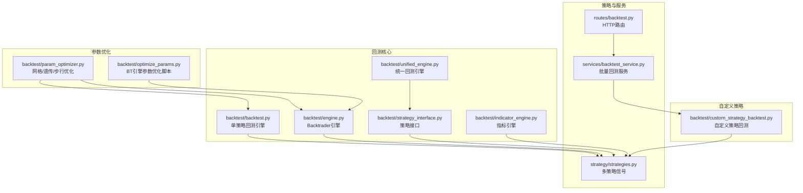
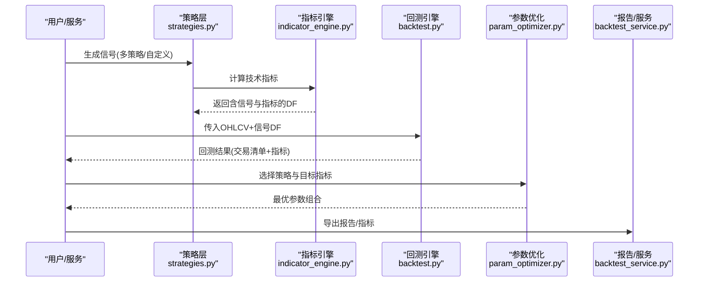
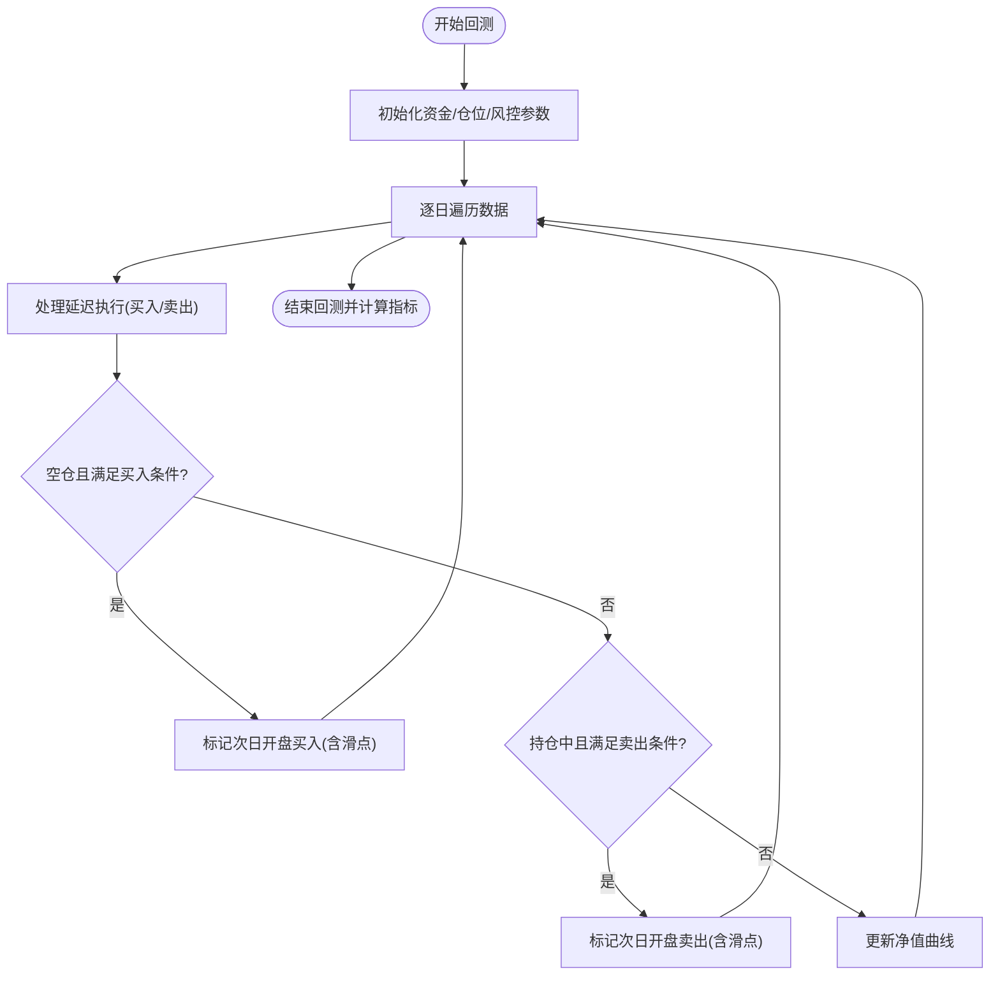
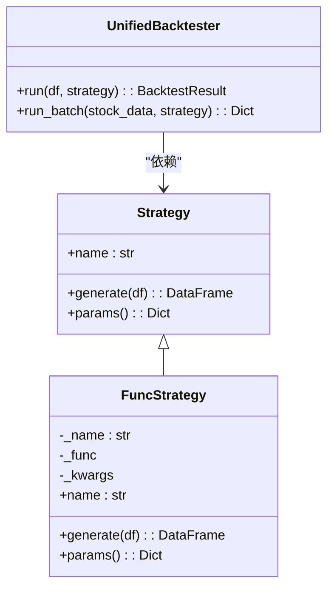
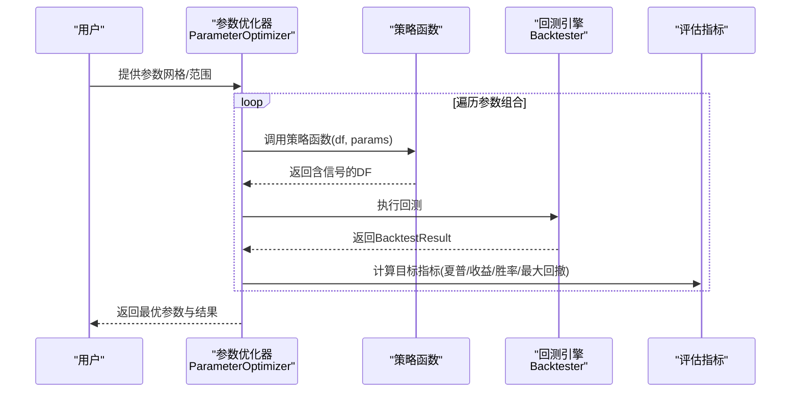
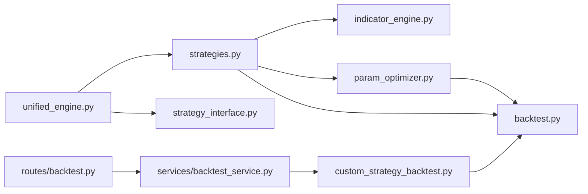

# 回测引擎

<cite>
**本文引用的文件**
- [backtest.py](file://backtest/backtest.py)
- [engine.py](file://backtest/engine.py)
- [unified_engine.py](file://backtest/unified_engine.py)
- [param_optimizer.py](file://backtest/param_optimizer.py)
- [optimize_params.py](file://backtest/optimize_params.py)
- [custom_strategy_backtest.py](file://backtest/custom_strategy_backtest.py)
- [strategy_interface.py](file://backtest/strategy_interface.py)
- [indicator_engine.py](file://backtest/indicator_engine.py)
- [backtest_bt.py](file://backtest/archive/backtest_bt.py)
- [backtest_quant.py](file://backtest/archive/backtest_quant.py)
- [backtest_v3.py](file://backtest/archive/backtest_v3.py)
- [strategies.py](file://strategy/strategies.py)
- [backtest.py](file://routes/backtest.py)
- [backtest_service.py](file://services/backtest_service.py)
</cite>

## 目录
1. [简介](#简介)
2. [项目结构](#项目结构)
3. [核心组件](#核心组件)
4. [架构总览](#架构总览)
5. [详细组件分析](#详细组件分析)
6. [依赖分析](#依赖分析)
7. [性能考虑](#性能考虑)
8. [故障排查指南](#故障排查指南)
9. [结论](#结论)
10. [附录](#附录)

## 简介
本文件面向AIQuant回测引擎，系统化阐述其设计理念、单策略回测与多策略融合回测的实现机制，参数优化算法、统一接口设计与自定义策略支持，回测数据处理流程、交易成本与收益统计，以及可视化展示、性能指标与报告生成。文档同时给出配置示例、优化策略与性能优化建议，并覆盖大规模数据处理能力。

## 项目结构
回测相关代码主要分布在backtest包与策略、服务、路由层：
- backtest包：核心回测引擎、策略接口、参数优化、指标引擎、历史实现
- strategy包：多策略信号生成与融合
- services/routes：对外服务与HTTP路由封装
- backtest/archive：历史版本与对比实现

图表来源
- [backtest.py:56-409](file://backtest/backtest.py#L56-L409)
- [engine.py:72-140](file://backtest/engine.py#L72-L140)
- [unified_engine.py:59-132](file://backtest/unified_engine.py#L59-L132)
- [strategy_interface.py:23-86](file://backtest/strategy_interface.py#L23-L86)
- [indicator_engine.py:287-358](file://backtest/indicator_engine.py#L287-L358)
- [param_optimizer.py:19-107](file://backtest/param_optimizer.py#L19-L107)
- [optimize_params.py:120-176](file://backtest/optimize_params.py#L120-L176)
- [custom_strategy_backtest.py:196-613](file://backtest/custom_strategy_backtest.py#L196-L613)
- [strategies.py:36-91](file://strategy/strategies.py#L36-L91)
- [backtest_service.py:10-74](file://services/backtest_service.py#L10-L74)
- [backtest.py:12-44](file://routes/backtest.py#L12-L44)

章节来源
- [backtest.py:1-517](file://backtest/backtest.py#L1-L517)
- [engine.py:1-174](file://backtest/engine.py#L1-L174)
- [unified_engine.py:1-143](file://backtest/unified_engine.py#L1-L143)
- [param_optimizer.py:1-369](file://backtest/param_optimizer.py#L1-L369)
- [optimize_params.py:1-462](file://backtest/optimize_params.py#L1-L462)
- [custom_strategy_backtest.py:1-669](file://backtest/custom_strategy_backtest.py#L1-L669)
- [strategy_interface.py:1-86](file://backtest/strategy_interface.py#L1-L86)
- [indicator_engine.py:1-433](file://backtest/indicator_engine.py#L1-L433)
- [strategies.py:1-200](file://strategy/strategies.py#L1-L200)
- [backtest_service.py:1-135](file://services/backtest_service.py#L1-L135)
- [backtest.py:1-45](file://routes/backtest.py#L1-L45)

## 核心组件
- 单策略回测引擎：支持T+1执行、滑点、手续费、止损止盈、熔断、大盘择时、动态仓位、信号溯源等特性，输出交易清单与绩效指标。
- 多策略融合回测：通过策略接口与指标引擎，统一生成BUY/SELL信号与评分，支持批量与多股票回测。
- 参数优化：网格搜索、遗传算法、步行优化，支持多种目标指标（夏普、收益、胜率、最大回撤等）。
- 自定义策略回测：用户以函数形式编写策略，返回signal列即可参与全市场/指定股票回测。
- 统一接口：Strategy抽象与FuncStrategy适配器，屏蔽具体策略差异，便于扩展与替换。
- 指标引擎：集中计算常用技术指标，避免重复计算，提升性能。

章节来源
- [backtest.py:56-409](file://backtest/backtest.py#L56-L409)
- [unified_engine.py:59-132](file://backtest/unified_engine.py#L59-L132)
- [param_optimizer.py:19-107](file://backtest/param_optimizer.py#L19-L107)
- [custom_strategy_backtest.py:196-613](file://backtest/custom_strategy_backtest.py#L196-L613)
- [strategy_interface.py:23-86](file://backtest/strategy_interface.py#L23-L86)
- [indicator_engine.py:287-358](file://backtest/indicator_engine.py#L287-L358)

## 架构总览
回测引擎采用“策略生成 + 回测执行 + 指标计算 + 报告输出”的分层架构。策略层负责信号生成；回测层负责资金曲线、交易成本、风控与绩效统计；优化层提供参数寻优；服务层提供HTTP接口与批量调度。

图表来源
- [strategies.py:36-91](file://strategy/strategies.py#L36-L91)
- [indicator_engine.py:287-358](file://backtest/indicator_engine.py#L287-L358)
- [backtest.py:121-409](file://backtest/backtest.py#L121-L409)
- [param_optimizer.py:39-107](file://backtest/param_optimizer.py#L39-L107)
- [backtest_service.py:10-74](file://services/backtest_service.py#L10-L74)

## 详细组件分析

### 单策略回测引擎（backtest.py）
- 设计要点
  - T+1交易：信号日标记，次日开盘价执行，避免未来数据泄露
  - 交易成本：万三双向手续费、千一印花税、千一滑点
  - 风控：回撤熔断、连续亏损限制、大盘择时、动态仓位（ATR波动率）
  - 信号溯源：记录触发策略名称，便于回测复盘
- 数据流
  - 输入：含open/high/low/close/volume与信号列的DataFrame
  - 执行：逐日检查买入/卖出条件，延迟执行，更新资金曲线
  - 输出：交易清单、净值曲线、绩效指标（总收益、年化、最大回撤、夏普、胜率、盈亏比等）

图表来源
- [backtest.py:121-409](file://backtest/backtest.py#L121-L409)

章节来源
- [backtest.py:56-409](file://backtest/backtest.py#L56-L409)

### 多策略融合与统一回测（unified_engine.py + strategy_interface.py）
- 策略接口
  - Strategy抽象：name与generate(df)两个核心方法
  - FuncStrategy适配器：将函数式策略包装为Strategy实例
- 统一回测
  - 接收Strategy实例列表，统一生成信号
  - 支持单股票与多股票批量回测
  - 逐步替代历史回测逻辑，统一资金曲线与风控

图表来源
- [strategy_interface.py:23-86](file://backtest/strategy_interface.py#L23-L86)
- [unified_engine.py:59-132](file://backtest/unified_engine.py#L59-L132)

章节来源
- [strategy_interface.py:1-86](file://backtest/strategy_interface.py#L1-L86)
- [unified_engine.py:1-143](file://backtest/unified_engine.py#L1-L143)

### 参数优化（param_optimizer.py + optimize_params.py）
- 网格搜索：遍历参数组合，评估策略在回测上的表现
- 遗传算法：适用于大空间参数搜索，迭代选择、交叉、变异
- 步行优化：滚动训练/验证，模拟真实交易的参数漂移
- BT引擎优化：基于backtesting.py的优化器，支持约束与目标最大化

图表来源
- [param_optimizer.py:39-107](file://backtest/param_optimizer.py#L39-L107)
- [backtest.py:121-409](file://backtest/backtest.py#L121-L409)

章节来源
- [param_optimizer.py:1-369](file://backtest/param_optimizer.py#L1-L369)
- [optimize_params.py:120-176](file://backtest/optimize_params.py#L120-L176)

### 自定义策略回测（custom_strategy_backtest.py）
- 用户以strategy_function(df, **params)形式编写策略，返回含signal列的DataFrame
- 支持全市场/指定股票池回测，内置静态过滤（ST/科创/创业板等）
- 支持T+1与收盘价买入两种模式，内置滑点、手续费、止损止盈、最大持仓天数等风控
- 生成每日信号清单、交易清单与综合统计

章节来源
- [custom_strategy_backtest.py:1-669](file://backtest/custom_strategy_backtest.py#L1-L669)

### 指标引擎（indicator_engine.py）
- 提供常用技术指标计算（MA/EMA/RSI/KDJ/MACD/BOLL/ATR/WR/CCI/OBV/量能/波动等）
- 批量计算并注入DataFrame，支持截面排名与分位
- 通过注册表统一管理指标定义，避免重复计算

章节来源
- [indicator_engine.py:1-433](file://backtest/indicator_engine.py#L1-L433)

### 历史实现与对比（archive）
- backtest_bt.py：基于backtesting.py的策略与数据转换，等价于backtest.py的Backtester
- backtest_quant.py：基于数据库的简单策略回测与HTML报告生成
- backtest_v3.py：超跌反弹v3完整回测引擎，包含基本面过滤与复杂止盈止损规则

章节来源
- [backtest_bt.py:1-800](file://backtest/archive/backtest_bt.py#L1-L800)
- [backtest_quant.py:1-596](file://backtest/archive/backtest_quant.py#L1-L596)
- [backtest_v3.py:1-676](file://backtest/archive/backtest_v3.py#L1-L676)

## 依赖分析
- 策略到回测：策略生成信号后，统一进入回测引擎；指标引擎在策略阶段先行计算，减少重复计算
- 参数优化到回测：优化器调用策略函数生成信号，再由回测引擎评估
- 服务到回测：HTTP路由调用服务层，服务层封装批量回测与配对交易记录

图表来源
- [strategies.py:36-91](file://strategy/strategies.py#L36-L91)
- [indicator_engine.py:287-358](file://backtest/indicator_engine.py#L287-L358)
- [param_optimizer.py:39-107](file://backtest/param_optimizer.py#L39-L107)
- [backtest.py:121-409](file://backtest/backtest.py#L121-L409)
- [custom_strategy_backtest.py:196-613](file://backtest/custom_strategy_backtest.py#L196-L613)
- [unified_engine.py:59-132](file://backtest/unified_engine.py#L59-L132)
- [strategy_interface.py:23-86](file://backtest/strategy_interface.py#L23-L86)
- [backtest_service.py:10-74](file://services/backtest_service.py#L10-L74)
- [backtest.py:12-44](file://routes/backtest.py#L12-L44)

章节来源
- [strategies.py:1-200](file://strategy/strategies.py#L1-L200)
- [backtest.py:1-517](file://backtest/backtest.py#L1-L517)
- [param_optimizer.py:1-369](file://backtest/param_optimizer.py#L1-L369)
- [custom_strategy_backtest.py:1-669](file://backtest/custom_strategy_backtest.py#L1-L669)
- [unified_engine.py:1-143](file://backtest/unified_engine.py#L1-L143)
- [strategy_interface.py:1-86](file://backtest/strategy_interface.py#L1-L86)
- [backtest_service.py:1-135](file://services/backtest_service.py#L1-L135)
- [backtest.py:1-45](file://routes/backtest.py#L1-L45)

## 性能考虑
- 指标计算集中化：通过指标引擎批量计算，避免策略内部重复计算
- T+1延迟执行：仅在次日开盘价执行，减少跨日数据对齐与索引开销
- 滑点与手续费：统一在成交时计算，避免多次重复计算
- 批量回测：支持多股票并行与进度回调，便于大规模数据处理
- 参数优化：网格搜索与遗传算法可结合，先粗后精；步行优化模拟真实参数漂移

## 故障排查指南
- 信号列缺失：自定义策略需返回含signal列的DataFrame；若缺失会报错
- 日期索引问题：确保DataFrame索引为DatetimeIndex或提供日期列
- 指标覆盖：compute_indicators会重置列，注意保留必要列（如trade_date）
- 参数越界：优化器会捕获异常并记录错误，检查参数范围与目标指标
- 数据不足：部分策略需要足够的历史期（如ATR/均线），确保数据长度足够

章节来源
- [custom_strategy_backtest.py:314-320](file://backtest/custom_strategy_backtest.py#L314-L320)
- [indicator_engine.py:337-340](file://backtest/indicator_engine.py#L337-L340)
- [param_optimizer.py:45-48](file://backtest/param_optimizer.py#L45-L48)

## 结论
AIQuant回测引擎以策略接口与指标引擎为核心，构建了可插拔、可扩展、可优化的统一回测体系。单策略与多策略融合回测、参数优化与自定义策略支持共同构成了完整的量化研究闭环。通过严格的T+1执行、完善的风控与成本模型、丰富的性能指标与报告能力，引擎能够支撑从策略研发到实盘验证的全流程需求。

## 附录

### 回测配置示例
- 单策略回测（示例路径）
  - [回测主流程:121-409](file://backtest/backtest.py#L121-L409)
  - [交易成本计算:112-119](file://backtest/backtest.py#L112-L119)
- 多策略融合（示例路径）
  - [策略接口定义:23-57](file://backtest/strategy_interface.py#L23-L57)
  - [统一回测入口:108-132](file://backtest/unified_engine.py#L108-L132)
- 自定义策略（示例路径）
  - [策略函数约定:9-18](file://backtest/custom_strategy_backtest.py#L9-L18)
  - [回测参数:36-91](file://backtest/custom_strategy_backtest.py#L36-L91)
- 参数优化（示例路径）
  - [网格搜索:80-107](file://backtest/param_optimizer.py#L80-L107)
  - [遗传算法:110-210](file://backtest/param_optimizer.py#L110-L210)
  - [步行优化:213-296](file://backtest/param_optimizer.py#L213-L296)
  - [BT引擎优化:120-176](file://backtest/optimize_params.py#L120-L176)

### 回测数据处理流程
- 策略生成信号：多策略信号融合或自定义策略返回signal列
- 指标计算：集中计算常用技术指标与截面排名
- 回测执行：T+1延迟执行、风控与成本模型、资金曲线更新
- 绩效统计：总收益、年化、最大回撤、夏普、胜率、盈亏比等

章节来源
- [strategies.py:36-91](file://strategy/strategies.py#L36-L91)
- [indicator_engine.py:287-358](file://backtest/indicator_engine.py#L287-L358)
- [backtest.py:121-409](file://backtest/backtest.py#L121-L409)

### 交易成本与收益统计
- 成本模型：万三双向手续费、千一印花税、千一滑点
- 统计指标：总收益、年化收益、最大回撤、夏普比率、胜率、盈亏比、平均持仓天数、基准收益与Alpha

章节来源
- [backtest.py:112-119](file://backtest/backtest.py#L112-L119)
- [backtest.py:411-471](file://backtest/backtest.py#L411-L471)

### 可视化与报告
- HTML报告：基于ECharts生成收益对比、胜率与最大回撤、资金曲线、退出原因分布与交易盈亏分布
- 服务封装：HTTP路由与服务层将回测结果标准化并导出

章节来源
- [backtest_quant.py:266-569](file://backtest/archive/backtest_quant.py#L266-L569)
- [backtest_service.py:10-74](file://services/backtest_service.py#L10-L74)
- [backtest.py:12-44](file://routes/backtest.py#L12-L44)