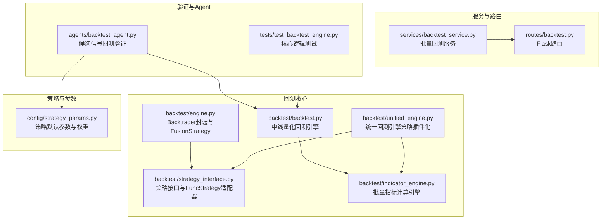
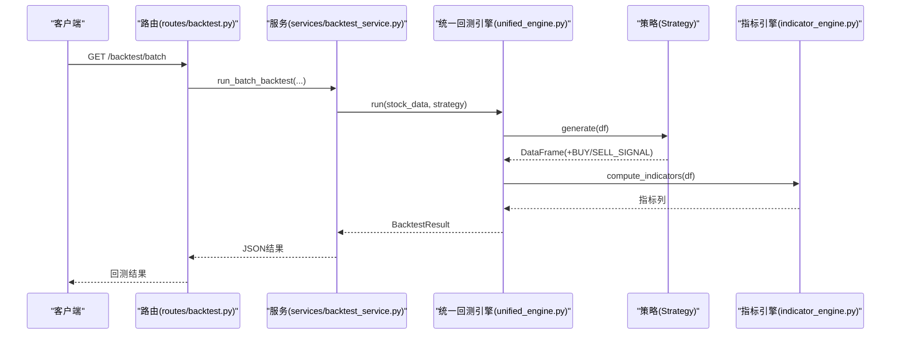
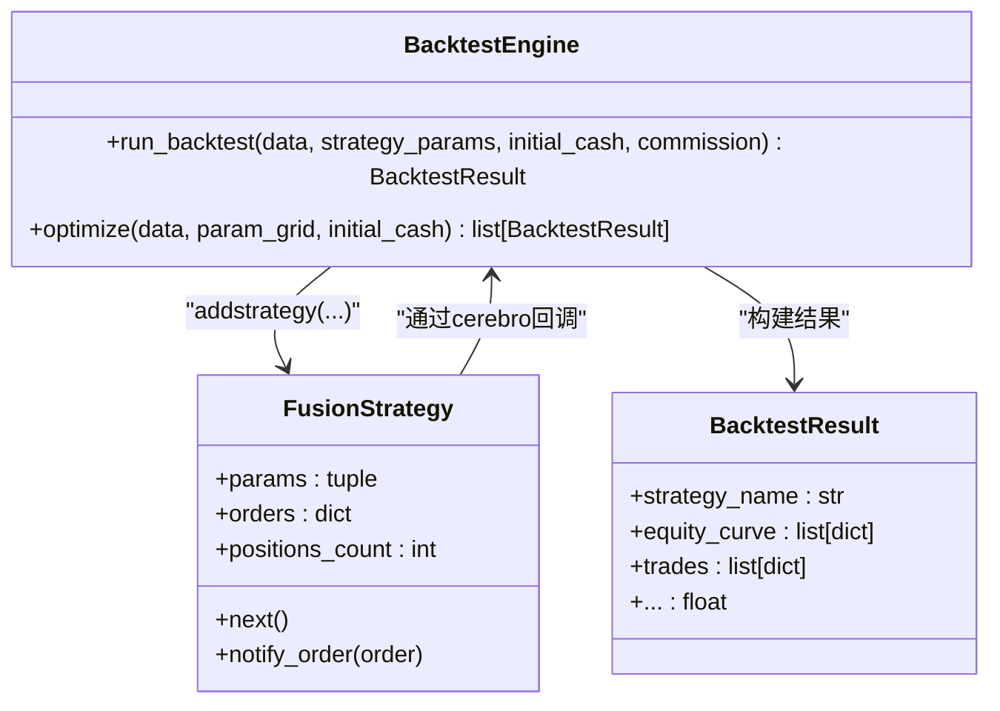
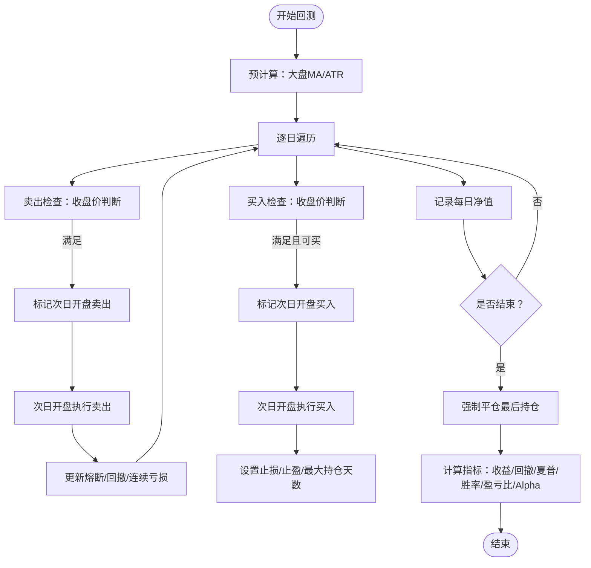
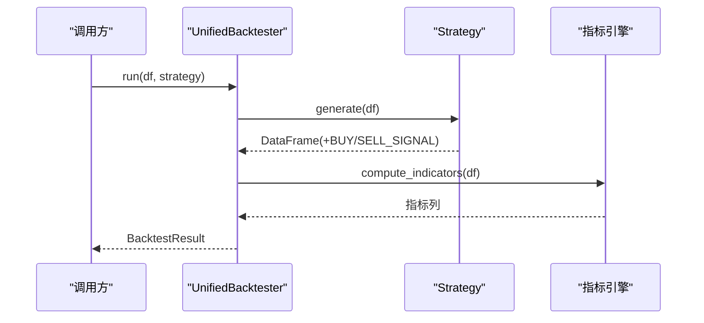
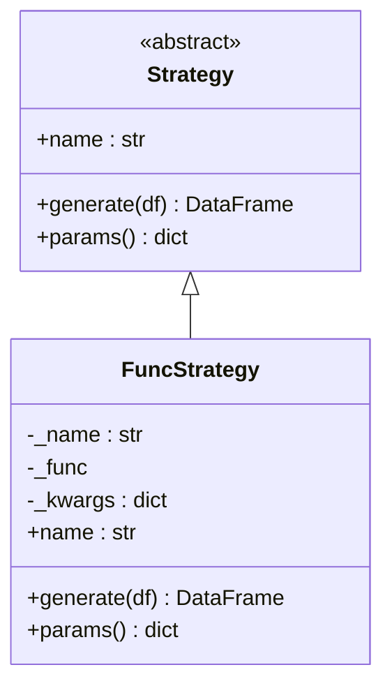
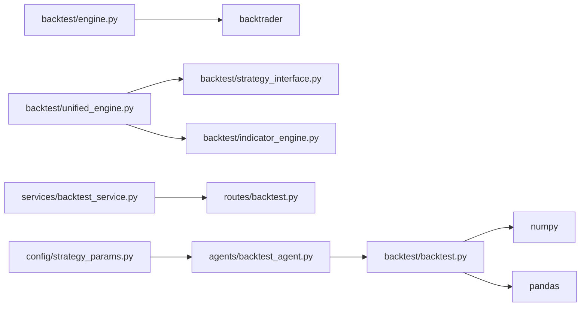

# 回测核心引擎

<cite>
**本文档引用的文件**
- [backtest/engine.py](file://backtest/engine.py)
- [backtest/backtest.py](file://backtest/backtest.py)
- [backtest/unified_engine.py](file://backtest/unified_engine.py)
- [backtest/strategy_interface.py](file://backtest/strategy_interface.py)
- [backtest/backtest_v4.py](file://backtest/backtest_v4.py)
- [backtest/custom_strategy_backtest.py](file://backtest/custom_strategy_backtest.py)
- [backtest/indicator_engine.py](file://backtest/indicator_engine.py)
- [config/strategy_params.py](file://config/strategy_params.py)
- [services/backtest_service.py](file://services/backtest_service.py)
- [routes/backtest.py](file://routes/backtest.py)
- [agents/backtest_agent.py](file://agents/backtest_agent.py)
- [tests/test_backtest_engine.py](file://tests/test_backtest_engine.py)
</cite>

## 目录
1. [简介](#简介)
2. [项目结构](#项目结构)
3. [核心组件](#核心组件)
4. [架构总览](#架构总览)
5. [详细组件分析](#详细组件分析)
6. [依赖关系分析](#依赖关系分析)
7. [性能考量](#性能考量)
8. [故障排查指南](#故障排查指南)
9. [结论](#结论)
10. [附录](#附录)

## 简介
本文件面向AIQuant回测核心引擎，系统化梳理从数据加载、策略适配、订单管理到结果分析的全流程实现。重点覆盖：
- Backtrader封装实现与FusionStrategy策略适配器设计
- BacktestResult数据结构与策略参数配置
- 订单管理机制与风控参数
- 回测流程完整实现与配置示例
- 回测结果数据结构与性能指标计算方法
- 错误处理、异常恢复与调试技巧

## 项目结构
回测相关模块分布于backtest目录，配合策略接口、指标引擎、服务层与路由层协同工作，形成“策略插件化 + 统一回测引擎”的架构。

图表来源
- [backtest/engine.py:1-174](file://backtest/engine.py#L1-L174)
- [backtest/backtest.py:1-517](file://backtest/backtest.py#L1-L517)
- [backtest/unified_engine.py:1-143](file://backtest/unified_engine.py#L1-L143)
- [backtest/strategy_interface.py:1-86](file://backtest/strategy_interface.py#L1-L86)
- [backtest/indicator_engine.py:1-433](file://backtest/indicator_engine.py#L1-L433)
- [config/strategy_params.py:1-76](file://config/strategy_params.py#L1-L76)
- [services/backtest_service.py:1-135](file://services/backtest_service.py#L1-L135)
- [routes/backtest.py:1-45](file://routes/backtest.py#L1-L45)
- [agents/backtest_agent.py:1-181](file://agents/backtest_agent.py#L1-L181)
- [tests/test_backtest_engine.py:1-130](file://tests/test_backtest_engine.py#L1-L130)

章节来源
- [backtest/engine.py:1-174](file://backtest/engine.py#L1-L174)
- [backtest/backtest.py:1-517](file://backtest/backtest.py#L1-L517)
- [backtest/unified_engine.py:1-143](file://backtest/unified_engine.py#L1-L143)
- [backtest/strategy_interface.py:1-86](file://backtest/strategy_interface.py#L1-L86)
- [backtest/indicator_engine.py:1-433](file://backtest/indicator_engine.py#L1-L433)
- [config/strategy_params.py:1-76](file://config/strategy_params.py#L1-L76)
- [services/backtest_service.py:1-135](file://services/backtest_service.py#L1-L135)
- [routes/backtest.py:1-45](file://routes/backtest.py#L1-L45)
- [agents/backtest_agent.py:1-181](file://agents/backtest_agent.py#L1-L181)
- [tests/test_backtest_engine.py:1-130](file://tests/test_backtest_engine.py#L1-L130)

## 核心组件
- Backtrader封装与FusionStrategy适配器：提供基于Backtrader的回测入口、参数注入与结果抽取。
- 中线量化回测引擎：纯Python实现，支持T+1执行、滑点、手续费、风控熔断、动态仓位等。
- 统一回测引擎：策略插件化，接收Strategy实例列表，抽象出通用资金曲线与风控逻辑。
- 策略接口与适配器：定义Strategy接口，提供FuncStrategy适配器以兼容既有函数式策略。
- 指标引擎：批量计算常用技术指标，供策略与回测复用。
- 服务与路由：批量回测服务封装与HTTP接口暴露。
- 验证与Agent：对候选信号进行快速历史回测验证，并汇总统计。

章节来源
- [backtest/engine.py:72-174](file://backtest/engine.py#L72-L174)
- [backtest/backtest.py:56-495](file://backtest/backtest.py#L56-L495)
- [backtest/unified_engine.py:59-143](file://backtest/unified_engine.py#L59-L143)
- [backtest/strategy_interface.py:23-86](file://backtest/strategy_interface.py#L23-L86)
- [backtest/indicator_engine.py:287-358](file://backtest/indicator_engine.py#L287-L358)
- [services/backtest_service.py:10-135](file://services/backtest_service.py#L10-L135)
- [routes/backtest.py:12-45](file://routes/backtest.py#L12-L45)
- [agents/backtest_agent.py:31-181](file://agents/backtest_agent.py#L31-L181)

## 架构总览
回测架构分为三层：
- 策略层：Strategy接口与FuncStrategy适配器，统一策略输入输出规范。
- 引擎层：Backtrader封装、中线量化引擎、统一引擎，负责执行与风控。
- 服务层：批量回测服务与HTTP路由，对外提供回测能力。

图表来源
- [routes/backtest.py:12-45](file://routes/backtest.py#L12-L45)
- [services/backtest_service.py:10-74](file://services/backtest_service.py#L10-L74)
- [backtest/unified_engine.py:108-132](file://backtest/unified_engine.py#L108-L132)
- [backtest/indicator_engine.py:287-358](file://backtest/indicator_engine.py#L287-L358)
- [backtest/strategy_interface.py:38-53](file://backtest/strategy_interface.py#L38-L53)

## 详细组件分析

### Backtrader封装与FusionStrategy适配器
- 职责
  - 封装Backtrader回测流程，设置初始资金、手续费、数据源与分析器。
  - 提供FusionStrategy适配器，承载策略参数与订单状态管理。
- 关键点
  - 使用PandasData作为数据源，支持OHLCV列。
  - 注册SharpeRatio、DrawDown、TradeAnalyzer、Returns等分析器。
  - 通过notify_order回调维护持仓计数，便于风控与统计。
- 设计要点
  - 参数通过策略构造函数注入，便于参数网格优化。
  - 结果封装为BacktestResult，统一字段与计算口径。

图表来源
- [backtest/engine.py:72-174](file://backtest/engine.py#L72-L174)

章节来源
- [backtest/engine.py:72-174](file://backtest/engine.py#L72-L174)

### 中线量化回测引擎（Backtester）
- 职责
  - 纯Python实现的回测引擎，支持T+1执行、滑点、手续费、风控熔断、动态仓位等。
- 关键流程
  - 预计算：大盘均线（可选）、ATR波动率（可选）。
  - T+1延迟执行：买入信号当日不成交，次日开盘价执行；卖出在当日收盘后标记，次日开盘价执行。
  - 风控：熔断（回撤阈值/连续亏损）、止损止盈、最大持仓天数、大盘择时。
  - 交易成本：双向手续费、卖出印花税、最低佣金。
  - 指标与统计：总收益、年化收益、最大回撤、夏普比率、胜率、盈亏比、平均持仓天数、基准收益与Alpha。
- 数据结构
  - Trade：单笔交易记录，包含入场/出场时间、价格、方向、原因、盈亏、滑点、触发策略等。
  - BacktestResult：汇总指标与明细列表。

图表来源
- [backtest/backtest.py:121-409](file://backtest/backtest.py#L121-L409)
- [backtest/backtest.py:411-471](file://backtest/backtest.py#L411-L471)

章节来源
- [backtest/backtest.py:56-495](file://backtest/backtest.py#L56-L495)

### 统一回测引擎（策略插件化）
- 职责
  - 接收Strategy实例列表，统一执行T+1交易、手续费、滑点、风控等。
  - 作为框架占位，逐步替代现有重复的资金曲线逻辑。
- 关键点
  - 策略必须提供generate(df)接口，返回含BUY_SIGNAL/SELL_SIGNAL/SCORE的DataFrame。
  - 严格要求包含open列以支持T+1执行。
  - 支持批量回测多只股票，异常捕获与聚合。

图表来源
- [backtest/unified_engine.py:108-132](file://backtest/unified_engine.py#L108-L132)
- [backtest/strategy_interface.py:38-53](file://backtest/strategy_interface.py#L38-L53)
- [backtest/indicator_engine.py:287-358](file://backtest/indicator_engine.py#L287-L358)

章节来源
- [backtest/unified_engine.py:59-143](file://backtest/unified_engine.py#L59-L143)
- [backtest/strategy_interface.py:23-86](file://backtest/strategy_interface.py#L23-L86)

### 策略接口与适配器（Strategy/FuncStrategy）
- Strategy接口
  - name：策略名称
  - generate(df)：输入OHLCV，输出含BUY_SIGNAL/SELL_SIGNAL/SCORE的DataFrame
  - params()：返回策略参数字典
- FuncStrategy适配器
  - 将函数式策略包装为Strategy接口，自动映射列名（如BUY_SCORE→SCORE）

图表来源
- [backtest/strategy_interface.py:23-86](file://backtest/strategy_interface.py#L23-L86)

章节来源
- [backtest/strategy_interface.py:23-86](file://backtest/strategy_interface.py#L23-L86)

### 指标引擎（批量指标计算）
- 职责
  - 提供大量技术指标计算函数（RSI、KDJ、MACD、布林带、ATR、OBV等）。
  - 统一注册与分类，支持批量计算与截面排名。
- 关键点
  - IndicatorRegistry集中管理指标定义与分类。
  - compute_indicators批量计算并可选计算截面排名分位。

章节来源
- [backtest/indicator_engine.py:140-358](file://backtest/indicator_engine.py#L140-L358)

### 服务与路由（批量回测）
- 服务层
  - run_batch_backtest：封装批量回测调用，参数透传至底层实现。
  - _pair_trades：将原始交易记录按代码配对为买入/卖出，补充持有天数与盈亏。
- 路由层
  - /backtest/batch：接收查询参数，校验权重格式，调用服务并返回JSON。

章节来源
- [services/backtest_service.py:10-135](file://services/backtest_service.py#L10-L135)
- [routes/backtest.py:12-45](file://routes/backtest.py#L12-L45)

### 验证与Agent（候选信号回测）
- BacktestAgent
  - 对融合策略与v4候选做快速历史回测，统计近90天信号触发次数与后续收益。
  - 汇总平均胜率、平均收益、最大回撤等指标。

章节来源
- [agents/backtest_agent.py:31-181](file://agents/backtest_agent.py#L31-L181)

## 依赖关系分析
- 组件耦合
  - BacktestEngine依赖Backtrader与FusionStrategy，结果依赖BacktestResult。
  - Backtester独立实现，依赖指标引擎与风控参数。
  - UnifiedBacktester依赖Strategy接口与指标引擎，强调策略插件化。
  - 服务与路由层解耦业务逻辑，便于扩展与测试。
- 外部依赖
  - Backtrader：用于回测流程与分析器。
  - Pandas/Numpy：数据处理与指标计算。
  - Flask：HTTP接口暴露。

图表来源
- [backtest/engine.py:10-14](file://backtest/engine.py#L10-L14)
- [backtest/backtest.py:9-14](file://backtest/backtest.py#L9-L14)
- [backtest/unified_engine.py:16](file://backtest/unified_engine.py#L16)
- [services/backtest_service.py:20](file://services/backtest_service.py#L20)
- [routes/backtest.py:9](file://routes/backtest.py#L9)
- [agents/backtest_agent.py:17-27](file://agents/backtest_agent.py#L17-L27)
- [config/strategy_params.py:6-8](file://config/strategy_params.py#L6-L8)

## 性能考量
- 指标计算
  - 批量指标计算通过IndicatorRegistry集中实现，避免重复计算，提升策略与回测效率。
- T+1执行
  - 延迟执行队列减少跨日数据对齐复杂度，提高稳定性。
- 动态仓位
  - 基于ATR的动态仓位在波动率上升时降低仓位，有助于控制回撤。
- 并行与缓存
  - 可结合外部工具进行多进程/多线程加速（建议在服务层扩展）。

## 故障排查指南
- T+1执行验证
  - 信号日不应成交，次日开盘价成交；滑点应用于次日开盘价。
- 资金曲线延续估值
  - 持仓股无数据日应使用最近可用收盘价延续估值，避免pos_value虚假归零。
- 手续费与税费
  - 买入+卖出双向手续费、卖出印花税，最低佣金约束。
- NaN与0处理
  - 使用pd.isna()判断NaN，避免np.nan或0的等值判断陷阱。
- 统一引擎占位
  - 当前为框架占位，后续迭代完善统一引擎逻辑。

章节来源
- [tests/test_backtest_engine.py:19-130](file://tests/test_backtest_engine.py#L19-L130)
- [backtest/backtest.py:43-91](file://backtest/backtest.py#L43-L91)

## 结论
回测核心引擎通过策略插件化与统一回测引擎，实现了从Backtrader封装到纯Python引擎的双轨并行。指标引擎提供高效复用，服务与路由层保证对外能力开放。建议在统一引擎完善后，逐步迁移现有逻辑，提升一致性与可维护性。

## 附录

### 回测流程配置示例
- 初始资金设置
  - Backtrader封装：通过initial_cash参数设置。
  - 中线量化引擎：通过initial_capital参数设置。
- 手续费计算
  - 双向手续费率、最低佣金、卖出印花税。
- 风险控制参数
  - 止损止盈、最大持仓天数、熔断阈值、连续亏损限制、大盘择时、动态仓位（可选）。

章节来源
- [backtest/engine.py:79-95](file://backtest/engine.py#L79-L95)
- [backtest/backtest.py:66-119](file://backtest/backtest.py#L66-L119)
- [backtest/backtest_v4.py:218-240](file://backtest/backtest_v4.py#L218-L240)
- [backtest/custom_strategy_backtest.py:36-91](file://backtest/custom_strategy_backtest.py#L36-L91)

### 回测结果数据结构与性能指标
- BacktestResult字段
  - 总收益、年化收益、最大回撤、夏普比率、胜率、盈亏比、总交易次数、盈利/亏损交易次数、平均持仓天数、平均盈利/亏损幅度、最终资金、基准收益（买入持有）、Alpha、交易明细、资金曲线与日期。
- 指标计算方法
  - 年化收益：基于交易日数换算年化。
  - 最大回撤：滚动峰值回撤百分比。
  - 夏普比率：日收益均值/标准差×√252。
  - 胜率：盈利交易数/总交易数。
  - 盈亏比：总盈利/总亏损绝对值。
  - Alpha：总收益-基准收益。

章节来源
- [backtest/backtest.py:33-54](file://backtest/backtest.py#L33-L54)
- [backtest/backtest.py:411-471](file://backtest/backtest.py#L411-L471)

### 超跌反弹v4策略参数
- 默认参数与参数扫描网格
  - 包括score_threshold、stop_loss、trailing_pct、single_pos_ratio、use_market_timing等。

章节来源
- [config/strategy_params.py:46-76](file://config/strategy_params.py#L46-L76)
- [backtest/backtest_v4.py:587-620](file://backtest/backtest_v4.py#L587-L620)