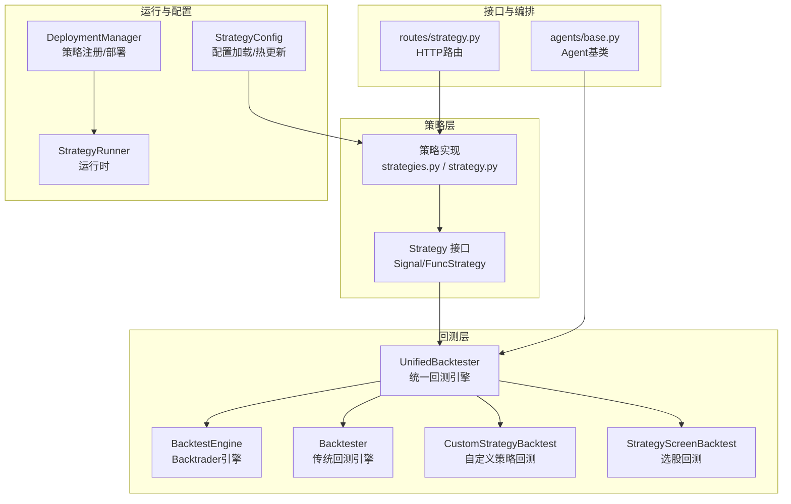
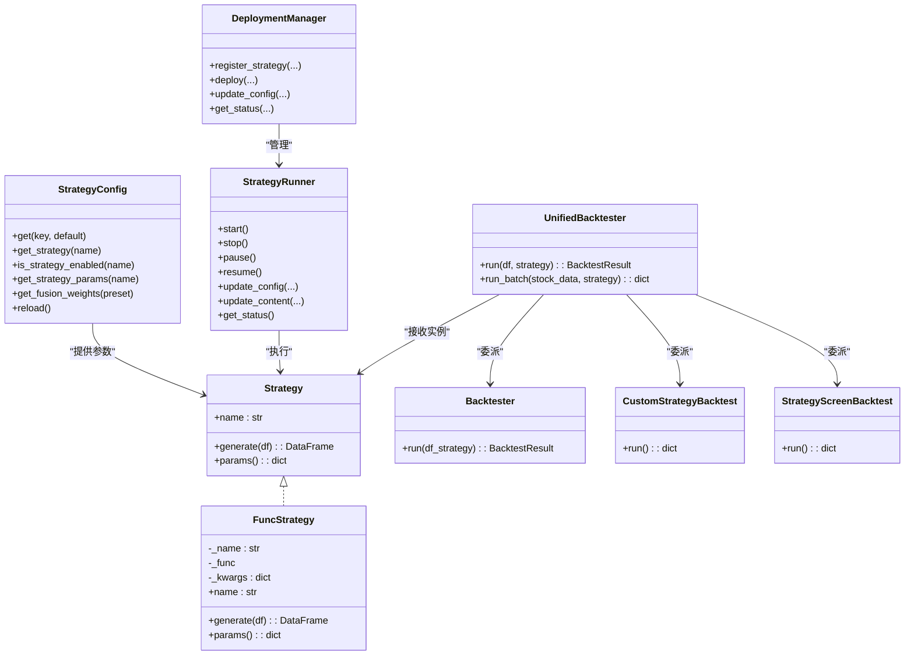
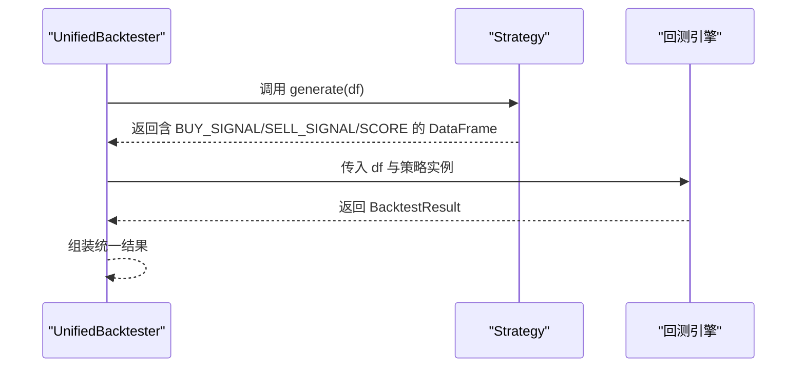
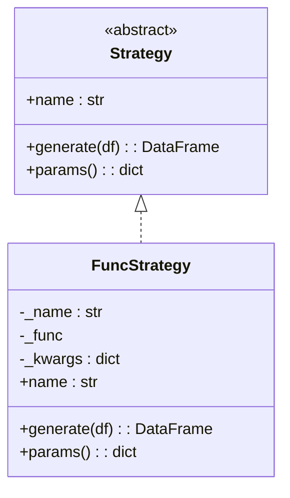
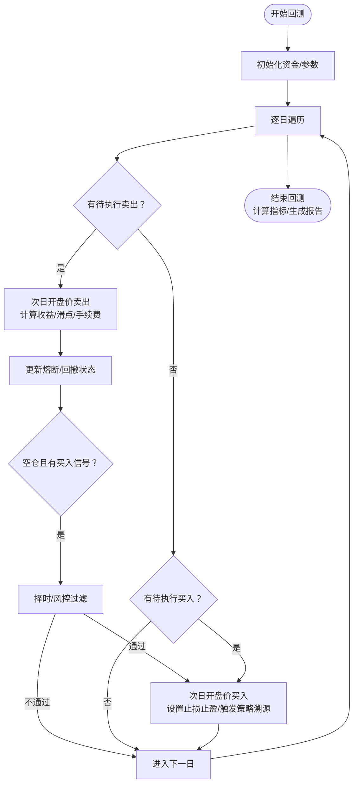
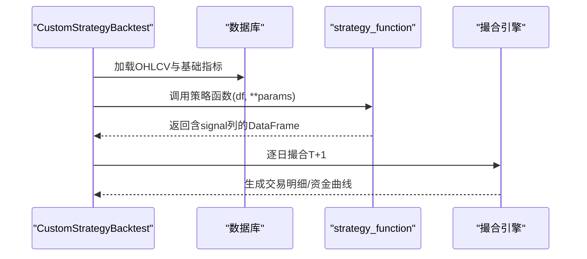
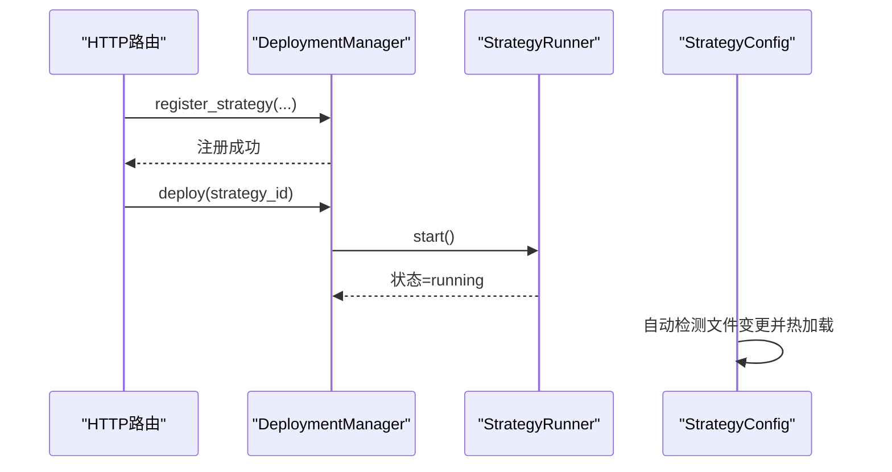
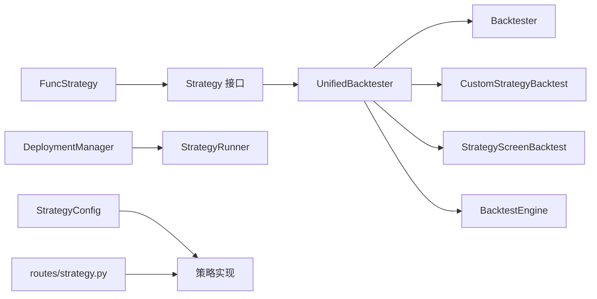

# 统一回测接口

<cite>
**本文引用的文件**
- [backtest/unified_engine.py](file://backtest/unified_engine.py)
- [backtest/strategy_interface.py](file://backtest/strategy_interface.py)
- [backtest/engine.py](file://backtest/engine.py)
- [backtest/backtest.py](file://backtest/backtest.py)
- [backtest/backtest_v4.py](file://backtest/backtest_v4.py)
- [backtest/custom_strategy_backtest.py](file://backtest/custom_strategy_backtest.py)
- [backtest/strategy_screen_backtest.py](file://backtest/strategy_screen_backtest.py)
- [strategy/strategies.py](file://strategy/strategies.py)
- [strategy/strategy.py](file://strategy/strategy.py)
- [deployment/manager.py](file://deployment/manager.py)
- [deployment/runner.py](file://deployment/runner.py)
- [strategy/config.py](file://strategy/config.py)
- [routes/strategy.py](file://routes/strategy.py)
- [agents/base.py](file://agents/base.py)
</cite>

## 目录
1. [简介](#简介)
2. [项目结构](#项目结构)
3. [核心组件](#核心组件)
4. [架构总览](#架构总览)
5. [详细组件分析](#详细组件分析)
6. [依赖分析](#依赖分析)
7. [性能考量](#性能考量)
8. [故障排查指南](#故障排查指南)
9. [结论](#结论)
10. [附录](#附录)

## 简介
本文件面向AIQuant统一回测接口的设计与实现，聚焦以下目标：
- 策略接口标准化：定义统一的Strategy接口，屏蔽不同策略实现差异，支持多策略并行运行与融合。
- 统一数据格式：约定OHLCV输入与信号输出格式，确保回测引擎与策略解耦。
- 跨策略兼容：通过适配器与列名映射，兼容既有函数式策略与新接口策略。
- 策略注册与动态加载：提供策略注册、热更新与运行时管理能力，支撑策略即插即用。
- 自定义策略开发规范：给出接口实现要求、参数传递方式与状态管理建议。
- 策略协作与通信：通过统一接口与适配器，实现多策略协同与数据共享。

## 项目结构
AIQuant围绕“策略接口 + 多回测引擎 + 策略配置与部署”构建统一回测能力：
- backtest：统一回测引擎与历史回测实现（含Backtrader适配、传统回测、自定义策略回测、选股回测等）。
- strategy：多策略实现与融合，提供标准化信号输出。
- deployment：策略注册、部署与运行时管理。
- strategy/config：策略配置加载与热更新。
- routes：策略相关HTTP路由。
- agents：Agent流水线基类，便于扩展策略编排与协作。

**图表来源**
- [backtest/unified_engine.py:59-143](file://backtest/unified_engine.py#L59-L143)
- [backtest/strategy_interface.py:23-86](file://backtest/strategy_interface.py#L23-L86)
- [backtest/backtest.py:56-495](file://backtest/backtest.py#L56-L495)
- [backtest/custom_strategy_backtest.py:196-669](file://backtest/custom_strategy_backtest.py#L196-L669)
- [backtest/strategy_screen_backtest.py:305-747](file://backtest/strategy_screen_backtest.py#L305-L747)
- [deployment/manager.py:24-184](file://deployment/manager.py#L24-L184)
- [deployment/runner.py:44-182](file://deployment/runner.py#L44-L182)
- [strategy/config.py:20-132](file://strategy/config.py#L20-L132)
- [routes/strategy.py:1-87](file://routes/strategy.py#L1-L87)
- [agents/base.py:88-120](file://agents/base.py#L88-L120)

**章节来源**
- [backtest/unified_engine.py:1-143](file://backtest/unified_engine.py#L1-L143)
- [backtest/strategy_interface.py:1-86](file://backtest/strategy_interface.py#L1-L86)
- [backtest/backtest.py:1-517](file://backtest/backtest.py#L1-L517)
- [backtest/custom_strategy_backtest.py:1-669](file://backtest/custom_strategy_backtest.py#L1-L669)
- [backtest/strategy_screen_backtest.py:1-803](file://backtest/strategy_screen_backtest.py#L1-L803)
- [strategy/strategies.py:1-431](file://strategy/strategies.py#L1-L431)
- [strategy/strategy.py:1-349](file://strategy/strategy.py#L1-L349)
- [deployment/manager.py:1-184](file://deployment/manager.py#L1-L184)
- [deployment/runner.py:1-182](file://deployment/runner.py#L1-L182)
- [strategy/config.py:1-132](file://strategy/config.py#L1-L132)
- [routes/strategy.py:1-87](file://routes/strategy.py#L1-L87)
- [agents/base.py:1-120](file://agents/base.py#L1-L120)

## 核心组件
- 统一回测引擎（UnifiedBacktester）
  - 接收Strategy实例列表，支持多策略并行与统一资金曲线管理。
  - 提供单股票与批量回测接口，预留T+1执行、手续费、滑点、风控等扩展点。
- 策略接口（Strategy）
  - 规范generate(df)输入输出，统一列名与语义，屏蔽策略实现差异。
  - 提供params()用于回测报告记录策略参数。
- 适配器（FuncStrategy）
  - 将既有函数式策略包装为Strategy接口，自动列名映射与参数透传。
- 传统回测引擎（Backtester）
  - 完整的资金曲线、手续费、滑点、止损止盈、风控与指标计算。
- 自定义策略回测（CustomStrategyBacktest）
  - 支持沙盒执行用户策略代码，提供信号列约定与T+1撮合。
- 选股回测（StrategyScreenBacktest）
  - 每日截面选股、排序、T+1买入与风控退出。
- 部署与运行（DeploymentManager/StrategyRunner）
  - 策略注册、部署、暂停/恢复、热更新与运行统计。
- 策略配置（StrategyConfig）
  - YAML配置热加载，支持策略开关、参数与融合权重管理。

**章节来源**
- [backtest/unified_engine.py:59-143](file://backtest/unified_engine.py#L59-L143)
- [backtest/strategy_interface.py:23-86](file://backtest/strategy_interface.py#L23-L86)
- [backtest/backtest.py:56-495](file://backtest/backtest.py#L56-L495)
- [backtest/custom_strategy_backtest.py:196-669](file://backtest/custom_strategy_backtest.py#L196-L669)
- [backtest/strategy_screen_backtest.py:305-747](file://backtest/strategy_screen_backtest.py#L305-L747)
- [deployment/manager.py:24-184](file://deployment/manager.py#L24-L184)
- [deployment/runner.py:44-182](file://deployment/runner.py#L44-L182)
- [strategy/config.py:20-132](file://strategy/config.py#L20-L132)

## 架构总览
统一回测接口通过“策略接口 + 适配器 + 多回测引擎”的分层设计，实现策略标准化与回测多样化：
- 策略层：Strategy接口统一信号输出；FuncStrategy适配既有函数式策略。
- 引擎层：UnifiedBacktester作为统一入口，委派至传统回测、自定义回测、选股回测或Backtrader引擎。
- 运行层：DeploymentManager/StrategyRunner负责策略生命周期管理与热更新。
- 配置层：StrategyConfig提供策略配置热加载与参数管理。

**图表来源**
- [backtest/strategy_interface.py:23-86](file://backtest/strategy_interface.py#L23-L86)
- [backtest/unified_engine.py:59-143](file://backtest/unified_engine.py#L59-L143)
- [backtest/backtest.py:56-495](file://backtest/backtest.py#L56-L495)
- [backtest/custom_strategy_backtest.py:196-669](file://backtest/custom_strategy_backtest.py#L196-L669)
- [backtest/strategy_screen_backtest.py:305-747](file://backtest/strategy_screen_backtest.py#L305-L747)
- [deployment/manager.py:24-184](file://deployment/manager.py#L24-L184)
- [deployment/runner.py:44-182](file://deployment/runner.py#L44-L182)
- [strategy/config.py:20-132](file://strategy/config.py#L20-L132)

## 详细组件分析

### 统一回测引擎（UnifiedBacktester）
- 职责
  - 接收Strategy实例，生成信号并驱动统一回测流程。
  - 支持单股票与批量回测，预留T+1执行、风控与资金曲线扩展。
- 关键点
  - 输入：OHLCV DataFrame（含open/high/low/close/volume）。
  - 输出：BacktestResult（包含总收益、年化、最大回撤、胜率、盈亏比、交易明细、资金曲线等）。
  - 与策略接口解耦，支持多策略并行与融合。

**图表来源**
- [backtest/unified_engine.py:108-132](file://backtest/unified_engine.py#L108-L132)
- [backtest/strategy_interface.py:38-53](file://backtest/strategy_interface.py#L38-L53)

**章节来源**
- [backtest/unified_engine.py:59-143](file://backtest/unified_engine.py#L59-L143)
- [backtest/strategy_interface.py:23-57](file://backtest/strategy_interface.py#L23-L57)

### 策略接口与适配器
- Strategy接口
  - name：策略唯一标识。
  - generate(df)：输入OHLCV，输出含BUY_SIGNAL/SELL_SIGNAL/SCORE列的DataFrame。
  - params()：返回策略参数字典，便于回测报告记录。
- FuncStrategy适配器
  - 将函数式策略包装为Strategy，自动将“BUY_SCORE”映射为“SCORE”，并透传参数。

**图表来源**
- [backtest/strategy_interface.py:23-86](file://backtest/strategy_interface.py#L23-L86)

**章节来源**
- [backtest/strategy_interface.py:23-86](file://backtest/strategy_interface.py#L23-L86)

### 传统回测引擎（Backtester）
- 特性
  - T+1执行模型：信号日触发，次日开盘价执行。
  - 支持手续费、滑点、止损止盈、最大持仓天数、回撤熔断、大盘择时、动态仓位等。
- 关键流程
  - 逐日扫描信号，维护持仓与交易队列，计算每日净值与绩效指标。

**图表来源**
- [backtest/backtest.py:121-409](file://backtest/backtest.py#L121-L409)

**章节来源**
- [backtest/backtest.py:56-495](file://backtest/backtest.py#L56-L495)

### 自定义策略回测（CustomStrategyBacktest）
- 设计要点
  - 支持沙盒执行用户策略代码，约定strategy_function(df, **params)。
  - 严格约束输出列：必须包含signal列（1=买入，-1=卖出，0=持有），并保留trade_date列。
  - 提供T+1撮合、排序与风控参数配置。
- 数据加载与预处理
  - 自动注入财务工具函数命名空间，预计算技术指标与排名列。

**图表来源**
- [backtest/custom_strategy_backtest.py:212-613](file://backtest/custom_strategy_backtest.py#L212-L613)

**章节来源**
- [backtest/custom_strategy_backtest.py:1-669](file://backtest/custom_strategy_backtest.py#L1-L669)

### 选股回测（StrategyScreenBacktest）
- 特性
  - 每日截面选股：根据ScreenCondition过滤与排序，T+1买入与风控退出。
  - 支持多种排序字段与排名列，便于UI展示与分析。
- 关键流程
  - 指标计算（均线、成交量、ATR等）→ 逐日筛选 → T+1买入 → 风控/到期卖出 → 记录资金曲线。

**章节来源**
- [backtest/strategy_screen_backtest.py:1-803](file://backtest/strategy_screen_backtest.py#L1-L803)

### 策略融合与多策略协作
- 策略融合
  - 多策略独立打分（0-3）→ 映射到0-10 → 加权求和 → 融合分0-50 → 生成FUSION_SCORE与BUY_SIGNAL。
  - 支持权重热加载与预设权重集。
- 多策略并行
  - UnifiedBacktester接收Strategy实例列表，统一调度与资金曲线管理。

**章节来源**
- [strategy/strategies.py:368-431](file://strategy/strategies.py#L368-L431)
- [strategy/strategy.py:180-245](file://strategy/strategy.py#L180-L245)
- [strategy/config.py:103-105](file://strategy/config.py#L103-L105)

### 策略注册与动态加载
- DeploymentManager
  - 注册策略（仅注册，不启动）、部署启动、停止、注销、状态查询、热更新配置与内容。
- StrategyRunner
  - 独立线程运行策略，定时触发，记录日志与统计，支持暂停/恢复。
- 配置热加载
  - StrategyConfig支持YAML热加载，按需自动检测文件变更并更新配置。

**图表来源**
- [deployment/manager.py:67-128](file://deployment/manager.py#L67-L128)
- [deployment/runner.py:111-131](file://deployment/runner.py#L111-L131)
- [strategy/config.py:63-71](file://strategy/config.py#L63-L71)

**章节来源**
- [deployment/manager.py:24-184](file://deployment/manager.py#L24-L184)
- [deployment/runner.py:44-182](file://deployment/runner.py#L44-L182)
- [strategy/config.py:20-132](file://strategy/config.py#L20-L132)

## 依赖分析
- 组件耦合
  - UnifiedBacktester与Strategy强耦合（接口契约），与各回测引擎弱耦合（委派关系）。
  - FuncStrategy与既有策略函数弱耦合（适配器模式）。
  - DeploymentManager与StrategyRunner强耦合（生命周期管理）。
- 外部依赖
  - Backtrader（BacktestEngine）。
  - 数据库与SQL查询（自定义回测与选股回测）。
  - Flask路由（策略HTTP接口）。

**图表来源**
- [backtest/unified_engine.py:59-143](file://backtest/unified_engine.py#L59-L143)
- [backtest/strategy_interface.py:23-86](file://backtest/strategy_interface.py#L23-L86)
- [backtest/backtest.py:56-495](file://backtest/backtest.py#L56-L495)
- [backtest/custom_strategy_backtest.py:196-669](file://backtest/custom_strategy_backtest.py#L196-L669)
- [backtest/strategy_screen_backtest.py:305-747](file://backtest/strategy_screen_backtest.py#L305-L747)
- [deployment/manager.py:24-184](file://deployment/manager.py#L24-L184)
- [deployment/runner.py:44-182](file://deployment/runner.py#L44-L182)
- [strategy/config.py:20-132](file://strategy/config.py#L20-L132)
- [routes/strategy.py:1-87](file://routes/strategy.py#L1-L87)

**章节来源**
- [backtest/unified_engine.py:59-143](file://backtest/unified_engine.py#L59-L143)
- [backtest/strategy_interface.py:23-86](file://backtest/strategy_interface.py#L23-L86)
- [backtest/backtest.py:56-495](file://backtest/backtest.py#L56-L495)
- [backtest/custom_strategy_backtest.py:196-669](file://backtest/custom_strategy_backtest.py#L196-L669)
- [backtest/strategy_screen_backtest.py:305-747](file://backtest/strategy_screen_backtest.py#L305-L747)
- [deployment/manager.py:24-184](file://deployment/manager.py#L24-L184)
- [deployment/runner.py:44-182](file://deployment/runner.py#L44-L182)
- [strategy/config.py:20-132](file://strategy/config.py#L20-L132)
- [routes/strategy.py:1-87](file://routes/strategy.py#L1-L87)

## 性能考量
- 数据预处理
  - 指标计算采用groupby与滚动窗口，避免O(n^2)扫描；自定义回测预计算技术指标与排名列。
- 回测执行
  - 逐日遍历与延迟执行（T+1）减少未来数据泄露风险；批量回测支持并发扩展（当前为串行）。
- 风控与成本
  - 手续费、滑点与动态仓位在回测中精确模拟，避免偏差。
- 配置热加载
  - YAML配置文件变更自动检测与热加载，降低运维成本。

[本节为通用指导，无需特定文件引用]

## 故障排查指南
- 策略未生成信号
  - 检查generate(df)输出是否包含BUY_SIGNAL/SELL_SIGNAL/SCORE列；确认列名映射（FuncStrategy会将BUY_SCORE映射为SCORE）。
- 自定义策略回测失败
  - 确认strategy_function返回的DataFrame包含signal列与trade_date列；检查参数传递与沙盒命名空间。
- 回撤熔断与风控触发频繁
  - 调整回撤阈值、连续亏损限制、止损止盈与动态仓位参数。
- 部署与运行异常
  - 查看DeploymentManager/StrategyRunner日志与状态；确认策略内容与配置已更新。

**章节来源**
- [backtest/strategy_interface.py:77-82](file://backtest/strategy_interface.py#L77-L82)
- [backtest/custom_strategy_backtest.py:253-276](file://backtest/custom_strategy_backtest.py#L253-L276)
- [deployment/runner.py:148-157](file://deployment/runner.py#L148-L157)
- [deployment/manager.py:130-152](file://deployment/manager.py#L130-L152)

## 结论
AIQuant统一回测接口通过标准化策略接口、适配器与多回测引擎委派，实现了策略的跨兼容与可扩展性。结合策略注册、运行时管理与配置热加载，形成从“策略开发 → 注册部署 → 回测验证 → 实盘运行”的闭环。建议在实际工程中：
- 严格遵循Strategy接口与信号输出约定；
- 使用FuncStrategy快速适配既有策略；
- 通过StrategyConfig集中管理参数与权重；
- 在统一回测引擎下进行多策略融合与对比分析。

[本节为总结性内容，无需特定文件引用]

## 附录

### 自定义策略开发规范与最佳实践
- 接口实现要求
  - 实现Strategy接口或使用FuncStrategy适配器。
  - generate(df)必须返回包含BUY_SIGNAL/SELL_SIGNAL/SCORE列的DataFrame，并保留open列用于T+1执行。
- 参数传递方式
  - 通过params()返回策略参数字典；或在FuncStrategy构造时传入kwargs。
- 状态管理
  - 回测引擎不管理策略内部状态，策略应保持纯函数特性；如需状态，应在DataFrame中显式输出列。
- 数据输入输出格式
  - 输入：OHLCV（含open/high/low/close/volume）。
  - 输出：BUY_SIGNAL/SELL_SIGNAL/SCORE（以及可选metadata列）。
- 策略协作与通信
  - 多策略可通过统一接口并行运行；融合策略通过策略融合模块生成FUSION_SCORE。

**章节来源**
- [backtest/strategy_interface.py:23-57](file://backtest/strategy_interface.py#L23-L57)
- [strategy/strategies.py:368-431](file://strategy/strategies.py#L368-L431)
- [backtest/unified_engine.py:108-132](file://backtest/unified_engine.py#L108-L132)

### 回测引擎对比与选择
- UnifiedBacktester：统一入口，适合多策略并行与融合。
- Backtester：功能完备的传统引擎，适合复杂风控与指标计算。
- CustomStrategyBacktest：适合快速验证用户策略代码。
- StrategyScreenBacktest：适合截面选股与T+1模拟。

**章节来源**
- [backtest/unified_engine.py:59-143](file://backtest/unified_engine.py#L59-L143)
- [backtest/backtest.py:56-495](file://backtest/backtest.py#L56-L495)
- [backtest/custom_strategy_backtest.py:196-669](file://backtest/custom_strategy_backtest.py#L196-L669)
- [backtest/strategy_screen_backtest.py:305-747](file://backtest/strategy_screen_backtest.py#L305-L747)