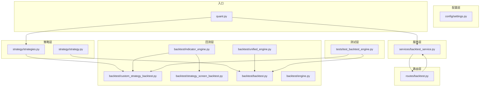
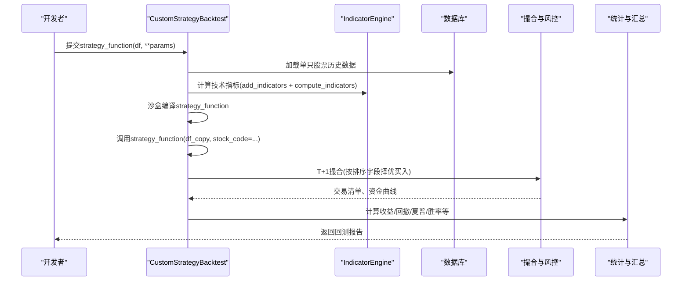
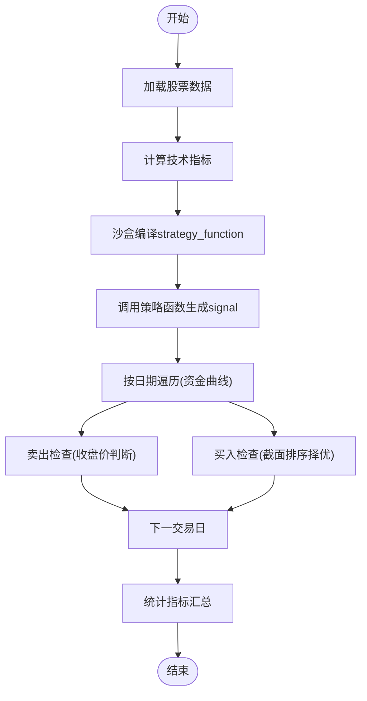
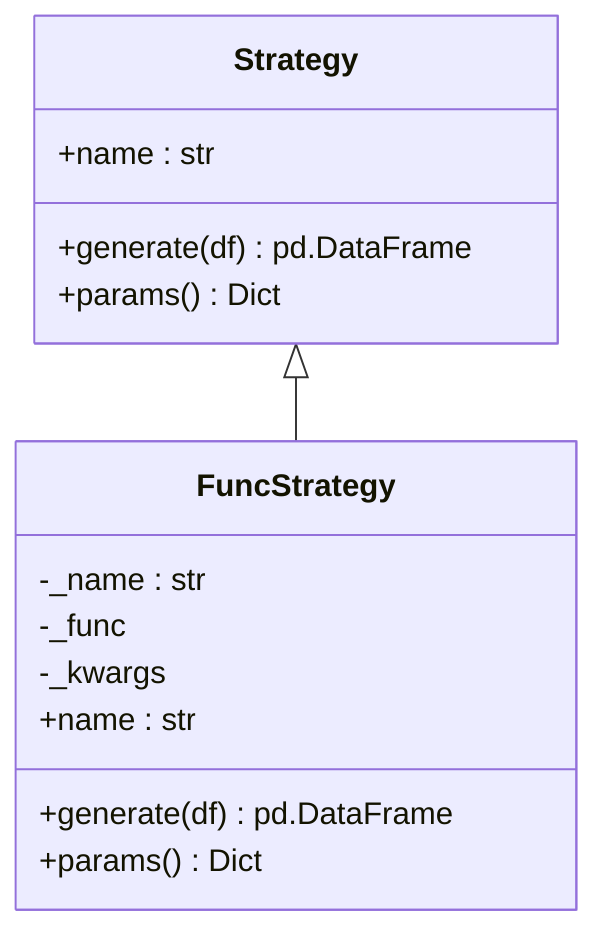
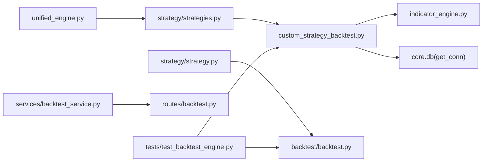

# 自定义策略回测

<cite>
**本文档引用的文件**
- [custom_strategy_backtest.py](file://backtest/custom_strategy_backtest.py)
- [strategy_interface.py](file://backtest/strategy_interface.py)
- [backtest.py](file://backtest/backtest.py)
- [engine.py](file://backtest/engine.py)
- [indicator_engine.py](file://backtest/indicator_engine.py)
- [strategy_screen_backtest.py](file://backtest/strategy_screen_backtest.py)
- [strategies.py](file://strategy/strategies.py)
- [strategy.py](file://strategy/strategy.py)
- [backtest_service.py](file://services/backtest_service.py)
- [backtest.py](file://routes/backtest.py)
- [unified_engine.py](file://backtest/unified_engine.py)
- [test_backtest_engine.py](file://tests/test_backtest_engine.py)
- [settings.py](file://config/settings.py)
- [quant.py](file://quant.py)
</cite>

## 目录
1. [简介](#简介)
2. [项目结构](#项目结构)
3. [核心组件](#核心组件)
4. [架构总览](#架构总览)
5. [详细组件分析](#详细组件分析)
6. [依赖关系分析](#依赖关系分析)
7. [性能考量](#性能考量)
8. [故障排查指南](#故障排查指南)
9. [结论](#结论)
10. [附录](#附录)

## 简介
本文件面向AIQuant自定义策略回测系统，提供从策略开发、测试到部署的全流程技术文档。内容覆盖：
- 自定义策略开发流程与模板设计
- 策略接口与继承体系
- 回测引擎与测试框架
- 自动化测试、批量验证与结果对比
- 策略开发最佳实践、代码规范与性能优化
- 常见问题与调试技巧

## 项目结构
AIQuant采用模块化组织，围绕“策略”“回测”“服务”“路由”“测试”五大维度构建。核心目录与职责概览：
- backtest：回测引擎与策略适配层
- strategy：策略实现与指标计算
- services：业务服务封装（批量回测等）
- routes：HTTP路由与API入口
- tests：单元测试与核心逻辑验证
- config：系统配置
- quant.py：策略扫描与参数常量定义

图表来源
- [custom_strategy_backtest.py:1-669](file://backtest/custom_strategy_backtest.py#L1-L669)
- [strategy_screen_backtest.py:1-803](file://backtest/strategy_screen_backtest.py#L1-L803)
- [indicator_engine.py:1-433](file://backtest/indicator_engine.py#L1-L433)
- [unified_engine.py:1-143](file://backtest/unified_engine.py#L1-L143)
- [backtest.py:1-517](file://backtest/backtest.py#L1-L517)
- [engine.py:1-174](file://backtest/engine.py#L1-L174)
- [strategies.py:1-431](file://strategy/strategies.py#L1-L431)
- [strategy.py:1-349](file://strategy/strategy.py#L1-L349)
- [backtest_service.py:1-135](file://services/backtest_service.py#L1-L135)
- [backtest.py:1-45](file://routes/backtest.py#L1-L45)
- [test_backtest_engine.py:1-130](file://tests/test_backtest_engine.py#L1-L130)
- [settings.py:1-25](file://config/settings.py#L1-L25)
- [quant.py:1-631](file://quant.py#L1-L631)

章节来源
- [custom_strategy_backtest.py:1-669](file://backtest/custom_strategy_backtest.py#L1-L669)
- [strategy_screen_backtest.py:1-803](file://backtest/strategy_screen_backtest.py#L1-L803)
- [strategies.py:1-431](file://strategy/strategies.py#L1-L431)
- [backtest.py:1-517](file://backtest/backtest.py#L1-L517)
- [unified_engine.py:1-143](file://backtest/unified_engine.py#L1-L143)
- [backtest_service.py:1-135](file://services/backtest_service.py#L1-L135)
- [backtest.py:1-45](file://routes/backtest.py#L1-L45)
- [test_backtest_engine.py:1-130](file://tests/test_backtest_engine.py#L1-L130)
- [settings.py:1-25](file://config/settings.py#L1-L25)
- [quant.py:1-631](file://quant.py#L1-L631)

## 核心组件
- 自定义策略回测引擎：支持用户以函数式策略直接回测，自动注入指标、沙盒编译、T+1撮合、风控与统计。
- 策略接口与适配器：Strategy抽象与FuncStrategy适配器，统一策略输入输出，便于与回测引擎对接。
- 多策略框架：内置5种经典策略与融合评分，支持独立运行与组合回测。
- 指标引擎：集中计算常用技术指标，支持批量与注册式扩展。
- 统一回测引擎：面向Strategy实例的通用回测框架，逐步替代现有引擎。
- 批量回测服务与路由：提供HTTP接口，支持参数化批量回测与结果聚合。
- 测试框架：针对T+1执行、资金曲线延续估值、手续费计算与统一引擎框架的单元测试。

章节来源
- [custom_strategy_backtest.py:196-669](file://backtest/custom_strategy_backtest.py#L196-L669)
- [strategy_interface.py:23-86](file://backtest/strategy_interface.py#L23-L86)
- [strategies.py:1-431](file://strategy/strategies.py#L1-L431)
- [indicator_engine.py:140-358](file://backtest/indicator_engine.py#L140-L358)
- [unified_engine.py:59-143](file://backtest/unified_engine.py#L59-L143)
- [backtest_service.py:10-135](file://services/backtest_service.py#L10-L135)
- [backtest.py:12-45](file://routes/backtest.py#L12-L45)
- [test_backtest_engine.py:19-130](file://tests/test_backtest_engine.py#L19-L130)

## 架构总览
自定义策略回测系统采用“策略-指标-引擎-服务-路由”的分层架构。策略通过接口或函数式模板接入，指标引擎统一计算，回测引擎负责资金曲线、交易执行与风控，服务层封装批量回测，路由层暴露HTTP接口，测试层保障核心逻辑正确性。

图表来源
- [custom_strategy_backtest.py:212-614](file://backtest/custom_strategy_backtest.py#L212-L614)
- [indicator_engine.py:287-358](file://backtest/indicator_engine.py#L287-L358)

章节来源
- [custom_strategy_backtest.py:196-669](file://backtest/custom_strategy_backtest.py#L196-L669)
- [indicator_engine.py:1-433](file://backtest/indicator_engine.py#L1-L433)

## 详细组件分析

### 自定义策略回测引擎（CustomStrategyBacktest）
- 设计要点
  - 支持用户以strategy_function(df, **params)形式提交策略，自动注入指标列与财务工具函数。
  - T+1交易执行：信号日触发，次日开盘价买入/卖出，避免未来数据泄露。
  - 风控与费用：支持止损止盈、最大持仓天数、佣金与印花税、滑点模拟。
  - 排序与择优：按配置字段对当日候选股进行截面排序，择优买入。
  - 统计与汇总：计算总收益、年化收益、最大回撤、夏普比率、胜率、盈亏比等。
- 关键流程
  - 数据加载：按股票池加载OHLCV与评分列，补充市值、别名列。
  - 指标计算：add_indicators与compute_indicators统一计算。
  - 策略执行：沙盒编译strategy_function，校验返回列（必须含signal与trade_date）。
  - 撮合执行：按日期遍历，先卖出后买入，资金曲线按收盘价延续估值。
  - 结果汇总：标准化输出字段，兼容UI层。

图表来源
- [custom_strategy_backtest.py:212-614](file://backtest/custom_strategy_backtest.py#L212-L614)

章节来源
- [custom_strategy_backtest.py:36-91](file://backtest/custom_strategy_backtest.py#L36-L91)
- [custom_strategy_backtest.py:97-131](file://backtest/custom_strategy_backtest.py#L97-L131)
- [custom_strategy_backtest.py:148-190](file://backtest/custom_strategy_backtest.py#L148-L190)
- [custom_strategy_backtest.py:212-614](file://backtest/custom_strategy_backtest.py#L212-L614)
- [custom_strategy_backtest.py:615-669](file://backtest/custom_strategy_backtest.py#L615-L669)

### 策略接口与适配器（Strategy/FuncStrategy）
- Strategy接口
  - name：策略唯一标识
  - generate(df)：输入OHLCV，输出含BUY_SIGNAL/SELL_SIGNAL/SCORE的DataFrame
  - params()：返回策略参数字典
- FuncStrategy适配器
  - 将现有函数式策略包装为Strategy接口，自动列名映射（如将BUY_SCORE映射为SCORE）

图表来源
- [strategy_interface.py:23-86](file://backtest/strategy_interface.py#L23-L86)

章节来源
- [strategy_interface.py:13-86](file://backtest/strategy_interface.py#L13-L86)

### 多策略框架与融合评分
- 内置策略
  - 放量突破、均线粘合、量价背离、抄底、主力建仓、超跌反弹v3
- 融合评分
  - 将各策略原始分(0-3)映射至(0-10)，按权重加权求和，得到0-50融合分
  - 默认权重与阈值在quant.py中定义，便于扫描与回测一致性

章节来源
- [strategies.py:36-431](file://strategy/strategies.py#L36-L431)
- [quant.py:43-51](file://quant.py#L43-L51)

### 指标引擎（IndicatorEngine）
- 注册式指标：统一注册与计算，支持批量计算与类别分组
- 批量计算：compute_indicators一次性计算所有指标，避免重复计算
- 条件评估：eval_condition支持点位、窗口、统计等多种条件表达

章节来源
- [indicator_engine.py:140-358](file://backtest/indicator_engine.py#L140-L358)
- [indicator_engine.py:361-433](file://backtest/indicator_engine.py#L361-L433)

### 统一回测引擎（UnifiedBacktester）
- 目标：统一策略插件化回测，逐步替换现有引擎重复逻辑
- 当前状态：框架占位，后续将迁移核心回测逻辑

章节来源
- [unified_engine.py:59-143](file://backtest/unified_engine.py#L59-L143)

### 批量回测服务与路由
- 服务层：run_batch_backtest封装批量回测，聚合交易对并计算关键指标
- 路由层：/batch接口解析参数，调用服务层并返回JSON结果

章节来源
- [backtest_service.py:10-135](file://services/backtest_service.py#L10-L135)
- [backtest.py:12-45](file://routes/backtest.py#L12-L45)

### 传统回测引擎（Backtester）
- 支持T+1执行、滑点、手续费、止损止盈、最大持仓天数、回撤熔断、大盘择时、动态仓位等
- 计算年化收益、最大回撤、夏普比率、胜率、盈亏比等指标

章节来源
- [backtest.py:56-495](file://backtest/backtest.py#L56-L495)

### 选股回测引擎（StrategyScreenBacktest）
- 支持每日选股条件筛选、截面排序、T+1买入、风控与统计
- 提供预设策略模板（如5日线突破、均线多头+放量、超跌反弹等）

章节来源
- [strategy_screen_backtest.py:305-747](file://backtest/strategy_screen_backtest.py#L305-L747)

## 依赖关系分析
- 自定义策略回测引擎依赖指标引擎与数据库连接，统一计算技术指标并加载OHLCV数据。
- 策略接口与适配器解耦策略实现与回测引擎，便于扩展与复用。
- 统一回测引擎作为未来发展方向，逐步替代现有引擎重复逻辑。
- 服务层与路由层提供批量回测能力，便于自动化测试与部署。

图表来源
- [custom_strategy_backtest.py:28-29](file://backtest/custom_strategy_backtest.py#L28-L29)
- [indicator_engine.py:1-433](file://backtest/indicator_engine.py#L1-L433)
- [strategies.py:1-431](file://strategy/strategies.py#L1-L431)
- [strategy.py:1-349](file://strategy/strategy.py#L1-L349)
- [unified_engine.py:1-143](file://backtest/unified_engine.py#L1-L143)
- [backtest_service.py:1-135](file://services/backtest_service.py#L1-L135)
- [backtest.py:1-45](file://routes/backtest.py#L1-L45)
- [test_backtest_engine.py:1-130](file://tests/test_backtest_engine.py#L1-L130)

章节来源
- [custom_strategy_backtest.py:1-669](file://backtest/custom_strategy_backtest.py#L1-L669)
- [indicator_engine.py:1-433](file://backtest/indicator_engine.py#L1-L433)
- [strategies.py:1-431](file://strategy/strategies.py#L1-L431)
- [strategy.py:1-349](file://strategy/strategy.py#L1-L349)
- [unified_engine.py:1-143](file://backtest/unified_engine.py#L1-L143)
- [backtest_service.py:1-135](file://services/backtest_service.py#L1-L135)
- [backtest.py:1-45](file://routes/backtest.py#L1-L45)
- [test_backtest_engine.py:1-130](file://tests/test_backtest_engine.py#L1-L130)

## 性能考量
- 指标计算优化
  - 使用批量计算与注册式指标，避免重复计算与跨策略重复计算
  - compute_indicators统一索引与列名，减少对齐与覆盖风险
- 数据访问优化
  - 预加载股票池与交易日列表，使用字典索引实现O(1)查询
  - 指标计算按分组进行，避免O(n^2)扫描
- 内存与IO
  - 控制回测区间与股票池规模，避免一次性加载过多数据
  - 使用最小佣金与滑点设置，降低交易成本对回测的影响
- 并发与批处理
  - 批量回测服务支持多参数组合并行回测（待完善）
  - 建议在服务层引入任务队列与并发控制

## 故障排查指南
- T+1执行验证
  - 信号日不应成交，次日开盘价成交；滑点应作用于次日开盘价
- 资金曲线延续估值
  - 持仓股无数据日应使用最近可用收盘价延续估值，避免pos_value虚假归零
- 手续费与税费
  - 买入+卖出双向费用与卖出印花税需正确计算
- NaN与0处理
  - 使用pd.isna()判断NaN，避免np.nan或0的误判
- 统一引擎框架
  - FuncStrategy适配器能正确包装现有函数，确保SCORE列存在

章节来源
- [test_backtest_engine.py:19-130](file://tests/test_backtest_engine.py#L19-L130)
- [backtest.py:121-409](file://backtest/backtest.py#L121-L409)
- [custom_strategy_backtest.py:346-600](file://backtest/custom_strategy_backtest.py#L346-L600)

## 结论
AIQuant自定义策略回测系统提供了从策略开发到部署的完整闭环：通过Strategy接口与FuncStrategy适配器实现策略插件化；借助IndicatorEngine统一指标计算；以CustomStrategyBacktest实现函数式策略的全市场/指定股票回测；通过服务与路由提供批量回测能力；并通过测试框架保障核心逻辑正确性。建议在实际使用中遵循最佳实践，关注性能与稳定性，并结合自动化测试与批量验证持续优化策略效果。

## 附录

### 自定义策略开发示例（步骤指引）
- 策略模板
  - 函数签名：strategy_function(df, **params)
  - 输入：单只股票历史DataFrame（含OHLCV与指标列）
  - 输出：包含signal列（1=买入，-1=卖出，0=持有）与trade_date列
- 开发流程
  - 在策略函数中使用OHLCV与指标列（由add_indicators与compute_indicators提供）
  - 严格遵守T+1规则：信号日不成交，次日开盘价执行
  - 控制交易成本与风控参数（佣金、印花税、止损止盈、最大持仓天数）
  - 返回修改后的DataFrame，确保trade_date列未被删除
- 验证方法
  - 使用自定义策略回测引擎进行全市场或指定股票回测
  - 对比不同参数组合下的收益、回撤、夏普比率与胜率
  - 结合测试框架验证T+1执行、资金曲线延续估值与手续费计算

章节来源
- [custom_strategy_backtest.py:9-18](file://backtest/custom_strategy_backtest.py#L9-L18)
- [custom_strategy_backtest.py:253-271](file://backtest/custom_strategy_backtest.py#L253-L271)
- [custom_strategy_backtest.py:309-614](file://backtest/custom_strategy_backtest.py#L309-L614)

### 策略测试生命周期（开发-测试-部署）
- 开发阶段
  - 使用Strategy接口或FuncStrategy适配器实现策略
  - 在本地进行单元测试，验证T+1执行、资金曲线延续估值与手续费计算
- 测试阶段
  - 使用自定义策略回测引擎进行全市场回测
  - 通过服务层批量回测，对比不同参数组合与策略权重
  - 生成回测报告并导出交易清单与资金曲线
- 部署阶段
  - 通过路由层对外提供批量回测API
  - 结合策略扫描与参数常量（quant.py）进行实盘或模拟交易

章节来源
- [test_backtest_engine.py:19-130](file://tests/test_backtest_engine.py#L19-L130)
- [backtest_service.py:10-135](file://services/backtest_service.py#L10-L135)
- [backtest.py:12-45](file://routes/backtest.py#L12-L45)
- [quant.py:43-51](file://quant.py#L43-L51)