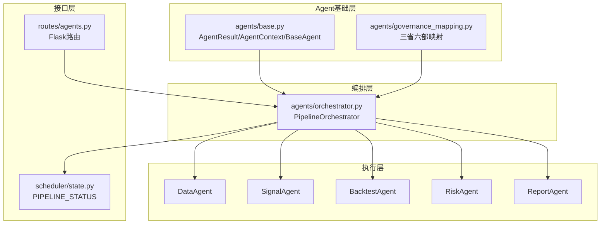
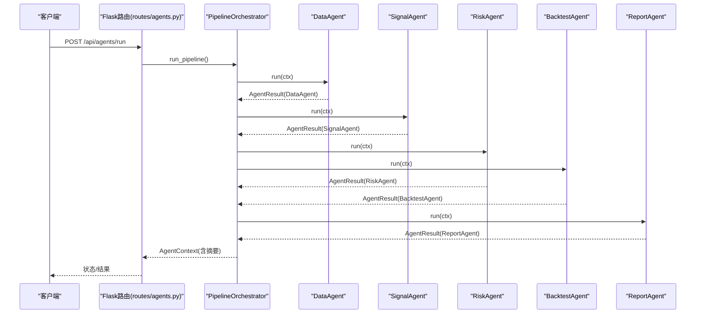
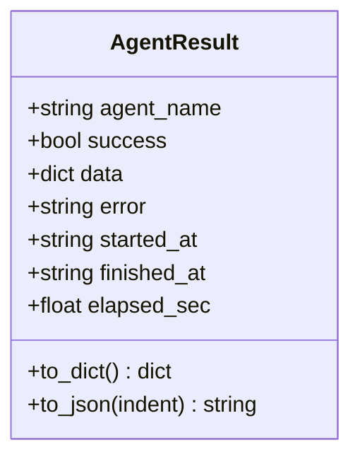
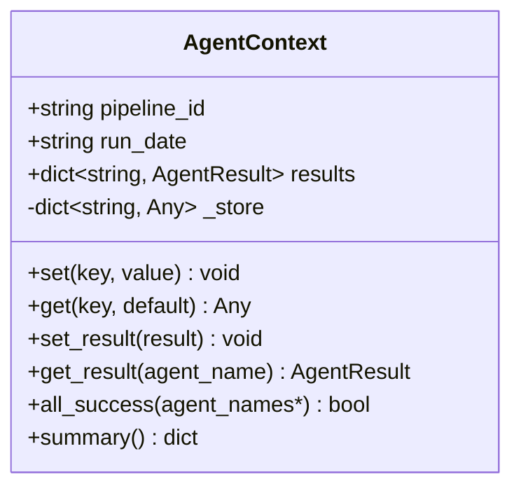
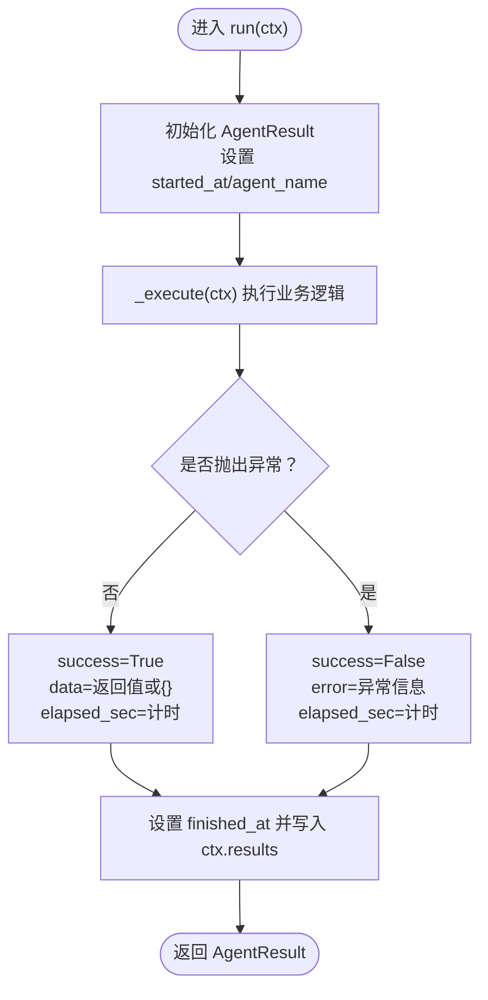
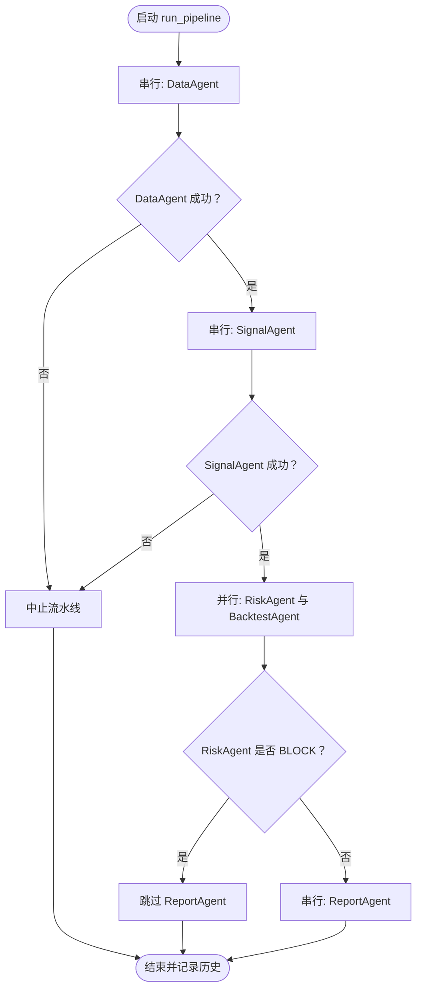
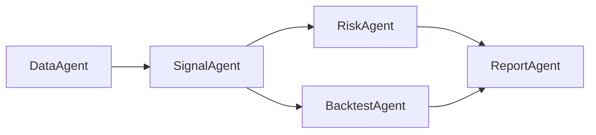
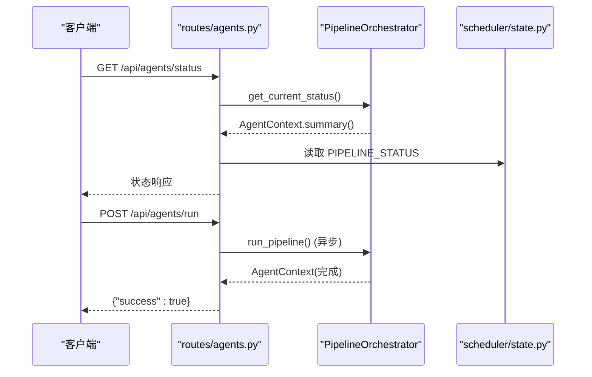
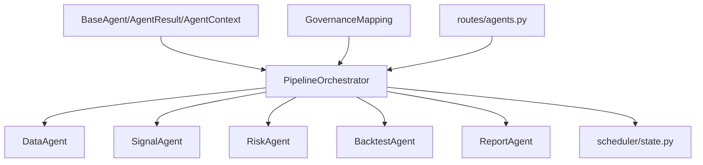

# Agent基础框架

<cite>
**本文引用的文件**
- [agents/base.py](file://agents/base.py)
- [agents/orchestrator.py](file://agents/orchestrator.py)
- [agents/__init__.py](file://agents/__init__.py)
- [agents/data_agent.py](file://agents/data_agent.py)
- [agents/signal_agent.py](file://agents/signal_agent.py)
- [agents/backtest_agent.py](file://agents/backtest_agent.py)
- [agents/risk_agent.py](file://agents/risk_agent.py)
- [agents/report_agent.py](file://agents/report_agent.py)
- [agents/governance_mapping.py](file://agents/governance_mapping.py)
- [routes/agents.py](file://routes/agents.py)
- [scheduler/state.py](file://scheduler/state.py)
</cite>

## 目录
1. [简介](#简介)
2. [项目结构](#项目结构)
3. [核心组件](#核心组件)
4. [架构总览](#架构总览)
5. [详细组件分析](#详细组件分析)
6. [依赖分析](#依赖分析)
7. [性能考虑](#性能考虑)
8. [故障排查指南](#故障排查指南)
9. [结论](#结论)
10. [附录](#附录)

## 简介
本文件系统化阐述 AIQuant 的 Agent 基础框架，覆盖以下主题：
- AgentContext 上下文管理机制：共享数据区、结果聚合、摘要生成
- AgentResult 结果封装格式：字段语义、序列化与反序列化路径
- Agent 基类设计模式与生命周期：run 包装、异常捕获、计时与结果落盘
- 标准化接口定义、状态管理策略、错误处理机制与性能监控
- 上下文数据传递机制、结果序列化与反序列化过程
- 扩展开发最佳实践与自定义 Agent 实现指南

## 项目结构
Agent 基础框架位于 agents 子目录，围绕“三省六部制”流水线组织，包含：
- 基础设施：Agent 基类、上下文、结果封装、治理映射
- 流水线编排：PipelineOrchestrator，负责阶段顺序、并行执行、状态持久化
- 具体 Agent：DataAgent、SignalAgent、BacktestAgent、RiskAgent、ReportAgent
- API 层：/api/agents 路由，提供状态查询、手动触发、历史查询、报告查看
- 调度状态：进程内流水线状态记录与更新

**图表来源**
- [agents/base.py:1-120](file://agents/base.py#L1-L120)
- [agents/orchestrator.py:1-263](file://agents/orchestrator.py#L1-L263)
- [agents/governance_mapping.py:1-155](file://agents/governance_mapping.py#L1-L155)
- [routes/agents.py:1-128](file://routes/agents.py#L1-L128)
- [scheduler/state.py:1-44](file://scheduler/state.py#L1-L44)

**章节来源**
- [agents/__init__.py:1-27](file://agents/__init__.py#L1-L27)
- [agents/base.py:1-120](file://agents/base.py#L1-L120)
- [agents/orchestrator.py:1-263](file://agents/orchestrator.py#L1-L263)
- [routes/agents.py:1-128](file://routes/agents.py#L1-L128)
- [scheduler/state.py:1-44](file://scheduler/state.py#L1-L44)

## 核心组件
- AgentResult：统一的结果载体，包含执行者名称、成功标志、数据载荷、错误信息、起止时间与耗时，并提供字典与 JSON 序列化能力
- AgentContext：流水线共享上下文，提供键值存储、结果登记、跨 Agent 数据传递、批量成功判定与流水线摘要
- BaseAgent：抽象基类，定义标准化 run 生命周期，自动计时、异常捕获、结果落盘与上下文更新
- PipelineOrchestrator：三省六部制流水线编排器，支持串行与并行阶段、延迟导入 Agent、状态持久化、历史记录与回调钩子
- 治理映射：将 Agent 名称映射到三省六部角色，提供显示格式化与流水线流程描述

**章节来源**
- [agents/base.py:20-120](file://agents/base.py#L20-L120)
- [agents/orchestrator.py:36-263](file://agents/orchestrator.py#L36-L263)
- [agents/governance_mapping.py:21-155](file://agents/governance_mapping.py#L21-L155)

## 架构总览
Agent 基础框架采用“编排驱动”的流水线架构：
- 编排器负责阶段编排、并行执行与状态管理
- 各 Agent 通过 BaseAgent 统一接口实现业务逻辑
- AgentContext 在阶段间传递数据与中间结果
- API 层对外暴露状态查询、手动触发与报告查看

**图表来源**
- [routes/agents.py:34-70](file://routes/agents.py#L34-L70)
- [agents/orchestrator.py:81-175](file://agents/orchestrator.py#L81-L175)
- [agents/data_agent.py:25-87](file://agents/data_agent.py#L25-L87)
- [agents/signal_agent.py:41-109](file://agents/signal_agent.py#L41-L109)
- [agents/risk_agent.py:25-96](file://agents/risk_agent.py#L25-L96)
- [agents/backtest_agent.py:31-68](file://agents/backtest_agent.py#L31-L68)
- [agents/report_agent.py:20-90](file://agents/report_agent.py#L20-L90)

## 详细组件分析

### AgentResult 结果封装
- 字段语义
  - agent_name：执行的 Agent 名称
  - success：是否成功
  - data：业务数据载荷（字典）
  - error：错误信息字符串
  - started_at/finished_at：UTC 时间字符串
  - elapsed_sec：执行耗时（秒）
- 序列化
  - to_dict：dataclass 转字典
  - to_json：字典转 JSON 字符串（默认 str 处理器）

**图表来源**
- [agents/base.py:20-36](file://agents/base.py#L20-L36)

**章节来源**
- [agents/base.py:20-36](file://agents/base.py#L20-L36)

### AgentContext 上下文管理
- 共享数据区：_store 键值存储，提供 set/get
- 结果聚合：results 以 agent_name 为键收集 AgentResult
- 摘要生成：summary 输出流水线整体状态与各 Agent 耗时与错误片段
- 成功判定：all_success 支持多 Agent 成功联合判定

**图表来源**
- [agents/base.py:38-86](file://agents/base.py#L38-L86)

**章节来源**
- [agents/base.py:38-86](file://agents/base.py#L38-L86)

### BaseAgent 生命周期与 run 包装
- run(ctx)：自动计时、捕获异常、填充 AgentResult、写入 ctx.results
- _execute(ctx)：子类实现具体业务逻辑，返回字典数据
- 异常处理：记录异常类型、消息与堆栈，同时记录耗时
- 结果落盘：无论成功与否，最终都会将 AgentResult 写入上下文

**图表来源**
- [agents/base.py:88-120](file://agents/base.py#L88-L120)

**章节来源**
- [agents/base.py:88-120](file://agents/base.py#L88-L120)

### PipelineOrchestrator 编排与状态
- 延迟导入：通过注册表按需导入 Agent 类，避免外部依赖导致加载失败
- 阶段编排：DataAgent（串行）→ SignalAgent（串行）→ [RiskAgent, BacktestAgent]（并行）→ ReportAgent（串行）
- 门下省一票否决：若 RiskAgent 返回 BLOCK，跳过 ReportAgent
- 状态持久化：历史记录与当前摘要，支持 API 查询
- 回调钩子：on_agent_start/on_agent_finish 便于观测与监控

**图表来源**
- [agents/orchestrator.py:81-175](file://agents/orchestrator.py#L81-L175)

**章节来源**
- [agents/orchestrator.py:36-263](file://agents/orchestrator.py#L36-L263)

### 具体 Agent 实现要点
- DataAgent：交易日判断、全量/增量同步、质量检查、缓存清理
- SignalAgent：多策略融合与 v4 超跌策略扫描，候选排序与保存
- BacktestAgent：对候选进行快速历史回测，统计胜率、收益与最大回撤
- RiskAgent：大盘趋势、波动率、个股筛查、仓位建议与系统化风控检查
- ReportAgent：整合上游结果，生成 HTML 与 JSON 报告，微信推送文本

**图表来源**
- [agents/data_agent.py:25-87](file://agents/data_agent.py#L25-L87)
- [agents/signal_agent.py:41-109](file://agents/signal_agent.py#L41-L109)
- [agents/backtest_agent.py:31-68](file://agents/backtest_agent.py#L31-L68)
- [agents/risk_agent.py:25-96](file://agents/risk_agent.py#L25-L96)
- [agents/report_agent.py:20-90](file://agents/report_agent.py#L20-L90)

**章节来源**
- [agents/data_agent.py:25-167](file://agents/data_agent.py#L25-L167)
- [agents/signal_agent.py:41-213](file://agents/signal_agent.py#L41-L213)
- [agents/backtest_agent.py:31-181](file://agents/backtest_agent.py#L31-L181)
- [agents/risk_agent.py:25-262](file://agents/risk_agent.py#L25-L262)
- [agents/report_agent.py:20-393](file://agents/report_agent.py#L20-L393)

### API 与状态持久化
- /api/agents/status：查询流水线运行状态与当前摘要
- /api/agents/run：手动触发完整流水线（异步线程）
- /api/agents/run/<name>：手动触发单个 Agent
- /api/agents/history：查询最近执行历史
- /api/agents/report：查看最新生成的报告
- /api/agents/governance：获取三省六部制架构信息
- PIPELINE_STATUS：进程内流水线状态（运行中、最后结果、各 Agent 实时状态）

**图表来源**
- [routes/agents.py:22-98](file://routes/agents.py#L22-L98)
- [scheduler/state.py:15-44](file://scheduler/state.py#L15-L44)

**章节来源**
- [routes/agents.py:1-128](file://routes/agents.py#L1-L128)
- [scheduler/state.py:1-44](file://scheduler/state.py#L1-L44)

## 依赖分析
- 组件耦合
  - BaseAgent 与 AgentContext 是所有 Agent 的共同依赖
  - PipelineOrchestrator 依赖治理映射与各具体 Agent 的延迟导入
  - API 层依赖编排器与调度状态
- 外部依赖
  - 数据与回测：core/db、backtest.*、strategy.*
  - 风控：risk.engine、risk.models
- 循环依赖规避
  - 通过延迟导入与注册表避免编排器与具体 Agent 的直接相互依赖

**图表来源**
- [agents/base.py:88-120](file://agents/base.py#L88-L120)
- [agents/orchestrator.py:36-58](file://agents/orchestrator.py#L36-L58)
- [agents/governance_mapping.py:31-108](file://agents/governance_mapping.py#L31-L108)
- [routes/agents.py:13-17](file://routes/agents.py#L13-L17)
- [scheduler/state.py:15-44](file://scheduler/state.py#L15-L44)

**章节来源**
- [agents/base.py:88-120](file://agents/base.py#L88-L120)
- [agents/orchestrator.py:36-58](file://agents/orchestrator.py#L36-L58)
- [agents/governance_mapping.py:31-108](file://agents/governance_mapping.py#L31-L108)
- [routes/agents.py:13-17](file://routes/agents.py#L13-L17)
- [scheduler/state.py:15-44](file://scheduler/state.py#L15-L44)

## 性能考虑
- 计时精度：run 使用 perf_counter 记录内部耗时，finished_at 使用 datetime.now，确保跨阶段统计稳定
- 并行执行：门下省与尚书省并行阶段提升吞吐，注意资源竞争与数据库连接池
- 序列化成本：AgentResult.to_json 仅在需要时调用（如 API 返回），避免频繁序列化
- 数据访问优化：SignalAgent 与 BacktestAgent 对数据库/回测引擎的调用尽量复用与批量化
- 状态持久化：历史记录限制数量，避免内存膨胀

[本节为通用指导，无需列出具体文件来源]

## 故障排查指南
- 常见问题
  - 流水线已在运行中：API 返回 409，等待当前执行完成
  - 非交易日跳过：DataAgent 返回 trading_day=False，Orchestrator 中止后续阶段
  - 门下省拦截：RiskAgent 返回 BLOCK，Orchestrator 跳过 ReportAgent 并记录中断原因
  - Agent 执行异常：AgentResult.error 包含异常类型与堆栈，可在 API 状态中查看
- 调试建议
  - 使用 /api/agents/run/<name> 单独执行某 Agent，缩小定位范围
  - 查看 /api/agents/history 获取最近执行摘要，结合 AgentResult.error 分析
  - 检查数据库与外部数据源连通性，确认 core/db 与 backtest.* 可用

**章节来源**
- [routes/agents.py:34-70](file://routes/agents.py#L34-L70)
- [agents/orchestrator.py:111-151](file://agents/orchestrator.py#L111-L151)
- [agents/base.py:101-113](file://agents/base.py#L101-L113)

## 结论
Agent 基础框架通过统一的上下文与结果封装、标准化的生命周期与错误处理、以及“三省六部制”的流水线编排，实现了可扩展、可观测、可维护的自动化策略流水线。开发者可基于 BaseAgent 快速实现新 Agent，并通过 PipelineOrchestrator 与治理映射无缝融入整体架构。

[本节为总结性内容，无需列出具体文件来源]

## 附录

### 标准化接口与最佳实践
- 接口定义
  - BaseAgent.run(ctx: AgentContext) -> AgentResult
  - 子类实现 BaseAgent._execute(ctx: AgentContext) -> dict
- 上下文传递
  - 使用 ctx.set/get 在 Agent 间共享数据
  - 使用 ctx.set_result 由编排器统一收集结果
- 结果序列化
  - 使用 AgentResult.to_dict 或 to_json 输出
  - API 层通过 routes/agents.py 提供 JSON 报告与状态
- 错误处理
  - run 自动捕获异常并记录 error
  - 编排器根据 AgentResult.success 控制后续阶段
- 性能监控
  - 关注 AgentResult.elapsed_sec 与 ctx.summary
  - 利用 API /api/agents/status 与 PIPELINE_STATUS 观测运行状态

**章节来源**
- [agents/base.py:88-120](file://agents/base.py#L88-L120)
- [agents/base.py:20-36](file://agents/base.py#L20-L36)
- [routes/agents.py:22-31](file://routes/agents.py#L22-L31)
- [scheduler/state.py:24-44](file://scheduler/state.py#L24-L44)

### 自定义 Agent 开发指南
- 继承 BaseAgent，设置 name 与 governance_role
- 实现 _execute(ctx)，返回字典作为 data 字段
- 通过 ctx.set 传递给下游 Agent，通过 ctx.get 获取上游数据
- 如需并行执行，参考 Orchestrator 的并行模式并在治理映射中正确标注
- 通过 /api/agents/run/<name> 进行独立调试，完成后加入流水线

**章节来源**
- [agents/data_agent.py:25-87](file://agents/data_agent.py#L25-L87)
- [agents/signal_agent.py:41-109](file://agents/signal_agent.py#L41-L109)
- [agents/risk_agent.py:25-96](file://agents/risk_agent.py#L25-L96)
- [agents/backtest_agent.py:31-68](file://agents/backtest_agent.py#L31-L68)
- [agents/report_agent.py:20-90](file://agents/report_agent.py#L20-L90)
- [agents/governance_mapping.py:88-155](file://agents/governance_mapping.py#L88-L155)