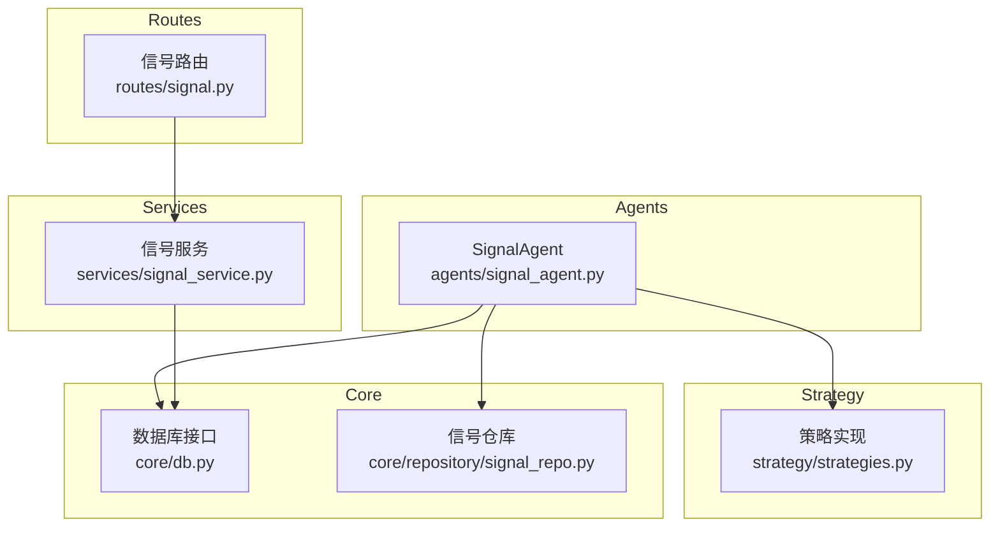
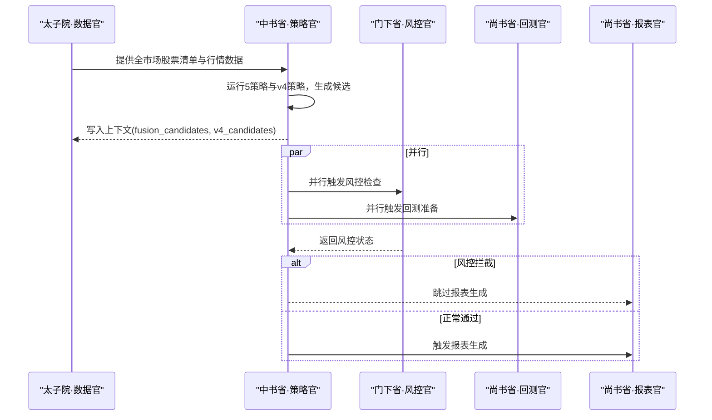
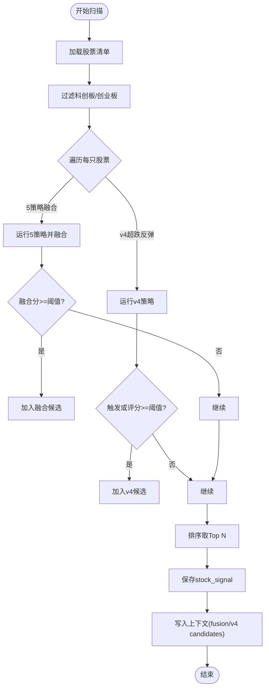
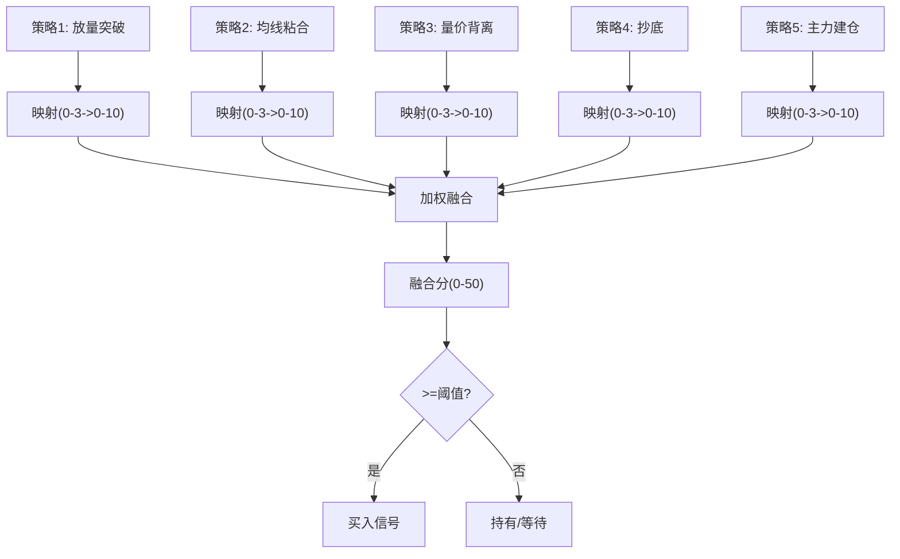
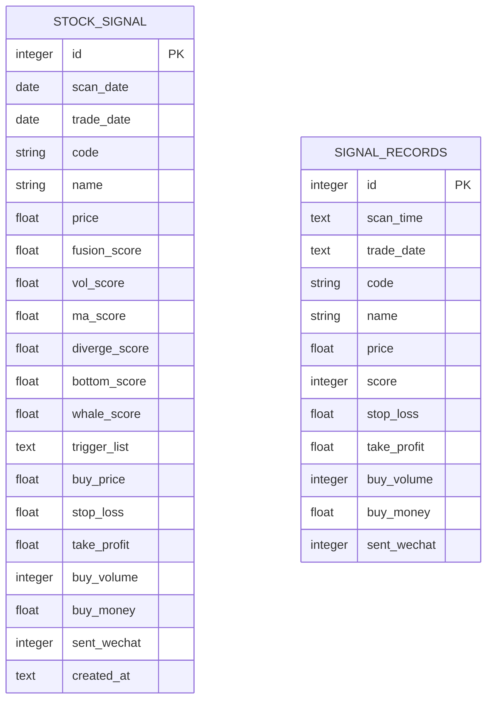
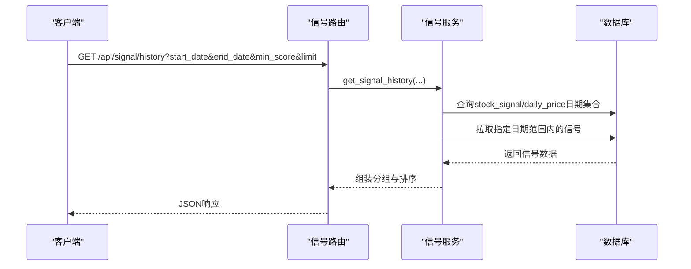
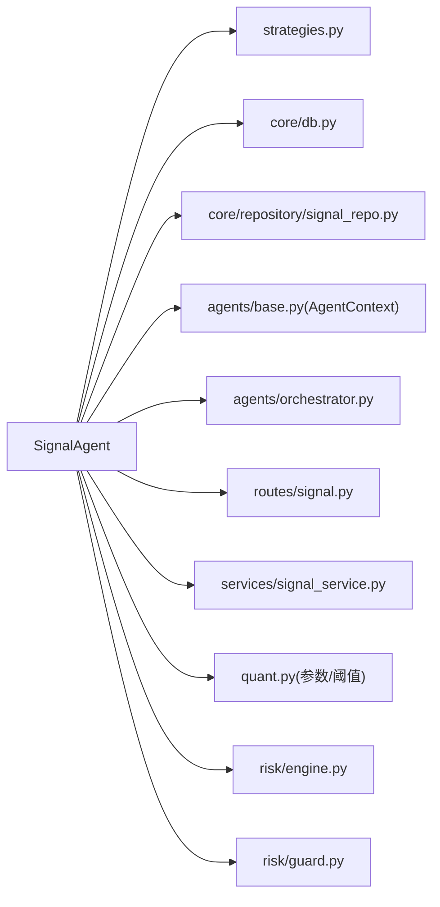

# 信号Agent

<cite>
**本文引用的文件**
- [agents/signal_agent.py](file://agents/signal_agent.py)
- [strategy/strategies.py](file://strategy/strategies.py)
- [core/db.py](file://core/db.py)
- [core/repository/signal_repo.py](file://core/repository/signal_repo.py)
- [services/signal_service.py](file://services/signal_service.py)
- [routes/signal.py](file://routes/signal.py)
- [quant.py](file://quant.py)
- [agents/base.py](file://agents/base.py)
- [agents/orchestrator.py](file://agents/orchestrator.py)
- [risk/engine.py](file://risk/engine.py)
- [risk/guard.py](file://risk/guard.py)
</cite>

## 目录
1. [简介](#简介)
2. [项目结构](#项目结构)
3. [核心组件](#核心组件)
4. [架构总览](#架构总览)
5. [详细组件分析](#详细组件分析)
6. [依赖分析](#依赖分析)
7. [性能考虑](#性能考虑)
8. [故障排查指南](#故障排查指南)
9. [结论](#结论)
10. [附录](#附录)

## 简介
信号Agent（中书省·策略官）负责在全市场范围内运行5种量化策略与超跌反弹策略，生成买卖信号并进行信号融合与筛选，最终输出候选股票列表，并将结果持久化至数据库供面板展示与历史回放。其核心职责包括：
- 基于策略分析生成买卖信号
- 信号质量评估与信号融合
- 信号过滤规则与阈值管理
- 信号权重计算与时间窗口管理
- 信号数据结构设计与持久化
- 信号回放与质量监控
- 参数配置、性能调优与信号验证
- 与策略引擎、风控系统的协作

## 项目结构
信号Agent位于“agents”目录，围绕策略实现、数据访问层、服务层与路由层协同工作，形成从策略计算到信号持久化与回放的闭环。

图表来源
- [agents/signal_agent.py:1-213](file://agents/signal_agent.py#L1-L213)
- [strategy/strategies.py:1-431](file://strategy/strategies.py#L1-L431)
- [core/db.py:1-800](file://core/db.py#L1-L800)
- [core/repository/signal_repo.py:1-119](file://core/repository/signal_repo.py#L1-L119)
- [services/signal_service.py:1-243](file://services/signal_service.py#L1-L243)
- [routes/signal.py:1-46](file://routes/signal.py#L1-L46)

章节来源
- [agents/signal_agent.py:1-213](file://agents/signal_agent.py#L1-L213)
- [strategy/strategies.py:1-431](file://strategy/strategies.py#L1-L431)
- [core/db.py:1-800](file://core/db.py#L1-L800)
- [core/repository/signal_repo.py:1-119](file://core/repository/signal_repo.py#L1-L119)
- [services/signal_service.py:1-243](file://services/signal_service.py#L1-L243)
- [routes/signal.py:1-46](file://routes/signal.py#L1-L46)

## 核心组件
- 信号Agent：负责全市场扫描、策略运行、信号融合、阈值过滤、上下文传递与结果持久化。
- 策略实现：提供5种独立策略与融合算法，统一返回包含买卖信号与评分的DataFrame。
- 数据访问层：封装数据库连接、建表、批量写入与查询。
- 信号仓库：专门处理signal_records与stock_signal两张表的插入与更新。
- 信号服务：提供历史信号查询与回放能力。
- 信号路由：对外暴露历史信号查询API。
- 参数配置与阈值：集中于quant.py中的策略参数与阈值常量。
- 上下文与编排：AgentContext提供跨Agent的数据共享，Orchestrator协调流水线执行。
- 风控集成：RiskEngine与risk_guard在信号生成后参与风控检查，决定是否拦截后续流程。

章节来源
- [agents/signal_agent.py:41-108](file://agents/signal_agent.py#L41-L108)
- [strategy/strategies.py:36-431](file://strategy/strategies.py#L36-L431)
- [core/db.py:57-467](file://core/db.py#L57-L467)
- [core/repository/signal_repo.py:14-119](file://core/repository/signal_repo.py#L14-L119)
- [services/signal_service.py:12-243](file://services/signal_service.py#L12-L243)
- [routes/signal.py:12-46](file://routes/signal.py#L12-L46)
- [quant.py:37-52](file://quant.py#L37-L52)
- [agents/base.py:20-120](file://agents/base.py#L20-L120)
- [agents/orchestrator.py:36-175](file://agents/orchestrator.py#L36-L175)
- [risk/engine.py:13-168](file://risk/engine.py#L13-L168)
- [risk/guard.py:36-92](file://risk/guard.py#L36-L92)

## 架构总览
信号Agent在三省六部制流水线中处于“中书省·策略官”，其上游为“太子院·数据官”，下游为“门下省·风控官”和“尚书省·回测官”。风控官具有“一票否决权”，若整体风险等级为BLOCK，则跳过报表生成。

图表来源
- [agents/orchestrator.py:112-153](file://agents/orchestrator.py#L112-L153)
- [agents/signal_agent.py:47-108](file://agents/signal_agent.py#L47-L108)
- [risk/engine.py:51-71](file://risk/engine.py#L51-L71)

## 详细组件分析

### 信号Agent（中书省·策略官）
职责与流程
- 读取全市场股票清单，排除科创板与创业板
- 对每只股票运行5策略融合与v4超跌反弹策略
- 依据阈值筛选候选，排序取Top N
- 将融合与v4结果分别保存至stock_signal表，便于面板展示与历史回放
- 将候选写入AgentContext，供下游Agent使用

关键实现要点
- 融合策略：调用fuse_signals对5个策略评分进行加权融合，阈值FUSION_THRESHOLD过滤
- v4策略：调用strategy_oversold_rebound，结合大盘择时MA5>MA20进行过滤
- 触发列表：当各策略评分≥2.0时，加入触发列表，用于面板展示
- 仓位与止盈止损：基于START_CAPITAL、POSITION_PER_STOCK、STOP_LOSS、TAKE_PROFIT计算

图表来源
- [agents/signal_agent.py:47-108](file://agents/signal_agent.py#L47-L108)
- [agents/signal_agent.py:110-212](file://agents/signal_agent.py#L110-L212)

章节来源
- [agents/signal_agent.py:47-108](file://agents/signal_agent.py#L47-L108)
- [agents/signal_agent.py:110-212](file://agents/signal_agent.py#L110-L212)

### 策略实现与信号融合
策略类型与评分
- 放量突破：量能、多头排列、3日涨幅连续打分，满分为3分
- 均线粘合：粘合度、向上发散强度、量能稳定度连续打分，满分为3分
- 量价背离：底背离强度、反弹强度、趋势确认连续打分，满分为3分
- 抄底：下跌深度、反弹强度、放量强度连续打分，满分为3分
- 主力建仓：低位程度、放量程度、涨幅受控连续打分，满分为3分

融合算法
- 将各策略原始分（0-3）映射到0-10
- 使用权重对映射后的分值加权求和
- 最终融合分范围0-50，阈值20触发买入

v4超跌反弹
- 原生连续打分0-4，映射到0-50用于面板展示
- 条件包括：20日跌幅≥12%、站上MA5、温和放量、RSI区间、不创N日新低
- 大盘择时：MA5>MA20才推荐

图表来源
- [strategy/strategies.py:36-431](file://strategy/strategies.py#L36-L431)

章节来源
- [strategy/strategies.py:36-431](file://strategy/strategies.py#L36-L431)

### 信号数据结构与持久化
数据模型
- stock_signal表：保存每日扫描推荐，包含融合分与各策略分、触发列表、入场与风控价格等
- signal_records表：保存策略筛选记录（兼容旧表）

持久化流程
- 信号Agent将融合与v4结果写入stock_signal，使用INSERT OR REPLACE保证幂等
- 信号服务提供历史查询接口，支持按日期范围与最小融合分筛选

图表来源
- [core/db.py:113-154](file://core/db.py#L113-L154)
- [core/repository/signal_repo.py:14-119](file://core/repository/signal_repo.py#L14-L119)

章节来源
- [core/db.py:113-154](file://core/db.py#L113-L154)
- [core/repository/signal_repo.py:14-119](file://core/repository/signal_repo.py#L14-L119)

### 信号回放与历史查询
- 信号服务按日期范围查询stock_signal与daily_price，合并缺失日期的信号
- 支持过滤掉“超跌反弹”类型的融合信号，聚焦5策略融合
- 支持v4超跌反弹专用查询，按触发列表筛选

图表来源
- [routes/signal.py:12-46](file://routes/signal.py#L12-L46)
- [services/signal_service.py:12-122](file://services/signal_service.py#L12-L122)

章节来源
- [routes/signal.py:12-46](file://routes/signal.py#L12-L46)
- [services/signal_service.py:12-122](file://services/signal_service.py#L12-L122)

### 信号质量评估与监控
- 触发列表：当各策略评分≥2.0时，加入触发列表，用于面板直观展示
- v4评分映射：将原生0-4分映射到0-50分，与融合分体系一致
- 阈值管理：融合阈值28，v4阈值1.8；历史回填使用15门槛以丰富面板
- 大盘择时：v4策略引入MA5>MA20过滤，避免空头市场下的信号误导

章节来源
- [agents/signal_agent.py:138-170](file://agents/signal_agent.py#L138-L170)
- [quant.py:37-51](file://quant.py#L37-L51)
- [quant.py:177-282](file://quant.py#L177-L282)

### 参数配置与性能调优
关键参数
- 资金与仓位：START_CAPITAL、POSITION_PER_STOCK、POSITION_NUM
- 止损止盈：STOP_LOSS、TAKE_PROFIT
- 融合阈值：FUSION_THRESHOLD、SIG_BACKFILL_THRESHOLD
- v4阈值：V4_SCORE_THRESHOLD
- 策略权重：DEFAULT_WEIGHTS（当前为纯抄底策略权重）

调优建议
- 融合阈值：在回测验证基础上设定，兼顾信号质量与覆盖面
- 权重分配：根据回测结果动态调整，关注最大回撤与胜率
- v4择时：在空头市场下提高过滤严格度，减少误报
- 批量回填：利用历史回填功能补齐stock_signal，提升面板数据完整性

章节来源
- [quant.py:37-52](file://quant.py#L37-L52)
- [strategy/strategies.py:258-271](file://strategy/strategies.py#L258-L271)

### 信号验证流程
- 数据一致性：确保daily_price包含必要列（close、volume等），并具备至少30日数据
- 策略评分：各策略返回BUY_SCORE与BUY_SIGNAL，融合后校验FUSION_SCORE
- v4条件：20日跌幅、站上MA5、温和放量、RSI区间、不创新低、大盘择时
- 阈值过滤：融合分与v4评分均需达到阈值
- 持久化校验：stock_signal幂等插入，避免重复覆盖

章节来源
- [agents/signal_agent.py:110-212](file://agents/signal_agent.py#L110-L212)
- [quant.py:84-142](file://quant.py#L84-L142)
- [quant.py:177-282](file://quant.py#L177-L282)

### 与策略引擎和风控系统的关系
- 与策略引擎：信号Agent直接调用策略实现与融合算法，产出信号供风控与回测使用
- 与风控系统：在并行阶段由风控Agent执行风控检查，若整体等级为BLOCK则中断流水线，避免生成报表
- 与编排器：通过AgentContext共享候选列表，Orchestrator协调执行顺序与依赖关系

章节来源
- [agents/orchestrator.py:140-153](file://agents/orchestrator.py#L140-L153)
- [risk/engine.py:51-71](file://risk/engine.py#L51-L71)
- [risk/guard.py:77-92](file://risk/guard.py#L77-L92)

## 依赖分析
信号Agent的依赖关系如下：

图表来源
- [agents/signal_agent.py:16-28](file://agents/signal_agent.py#L16-L28)
- [agents/base.py:39-86](file://agents/base.py#L39-L86)
- [agents/orchestrator.py:36-52](file://agents/orchestrator.py#L36-L52)
- [routes/signal.py:9](file://routes/signal.py#L9)
- [services/signal_service.py:9](file://services/signal_service.py#L9)
- [quant.py:23-35](file://quant.py#L23-L35)
- [risk/engine.py:8-10](file://risk/engine.py#L8-L10)
- [risk/guard.py:11](file://risk/guard.py#L11)

章节来源
- [agents/signal_agent.py:16-28](file://agents/signal_agent.py#L16-L28)
- [agents/base.py:39-86](file://agents/base.py#L39-L86)
- [agents/orchestrator.py:36-52](file://agents/orchestrator.py#L36-L52)
- [routes/signal.py:9](file://routes/signal.py#L9)
- [services/signal_service.py:9](file://services/signal_service.py#L9)
- [quant.py:23-35](file://quant.py#L23-L35)
- [risk/engine.py:8-10](file://risk/engine.py#L8-L10)
- [risk/guard.py:11](file://risk/guard.py#L11)

## 性能考虑
- 扫描效率：对全市场股票逐只运行策略，建议在非交易时段执行，或分批并行处理
- 数据访问：批量写入stock_signal，使用INSERT OR REPLACE与JSON序列化触发列表，注意I/O瓶颈
- 过滤策略：合理设置阈值与触发条件，减少无效信号写入
- 回放查询：按日期范围与最小分值筛选，避免全表扫描
- 风控检查：并行阶段的风控检查应尽量轻量，避免阻塞主线程

## 故障排查指南
常见问题与定位
- 无股票数据：检查get_all_stocks是否为空，确认数据同步已完成
- 策略评分缺失：确认daily_price包含策略评分列，或执行批量评分更新
- 阈值过滤过严：适当降低FUSION_THRESHOLD或SIG_BACKFILL_THRESHOLD
- v4信号为空：检查大盘择时MA5>MA20条件与RSI区间
- 持久化异常：核对stock_signal唯一索引与INSERT OR REPLACE逻辑
- 风控拦截：查看risk_events与risk_status表，确认拦截原因

章节来源
- [core/db.py:519-527](file://core/db.py#L519-L527)
- [core/db.py:581-629](file://core/db.py#L581-L629)
- [core/repository/signal_repo.py:14-119](file://core/repository/signal_repo.py#L14-L119)
- [risk/engine.py:73-127](file://risk/engine.py#L73-L127)

## 结论
信号Agent通过标准化的策略实现、严格的阈值过滤与完善的持久化机制，实现了从策略分析到信号生成、回放到风控拦截的全流程闭环。配合参数化配置与历史回放能力，能够有效支撑策略验证与实盘决策。建议在生产环境中持续优化阈值与权重，并强化风控检查与监控告警，确保系统稳定与信号质量。

## 附录
- API参考
  - GET /api/signal/history：查询5策略融合历史信号
  - GET /api/signal/history_v4：查询v4超跌反弹历史信号
- 关键参数位置
  - 融合阈值：quant.py
  - v4阈值：quant.py
  - 策略权重：strategy/strategies.py
- 数据表
  - stock_signal：面板展示与回放
  - signal_records：兼容旧表

章节来源
- [routes/signal.py:12-46](file://routes/signal.py#L12-L46)
- [quant.py:37-52](file://quant.py#L37-L52)
- [strategy/strategies.py:258-271](file://strategy/strategies.py#L258-L271)
- [core/db.py:113-154](file://core/db.py#L113-L154)