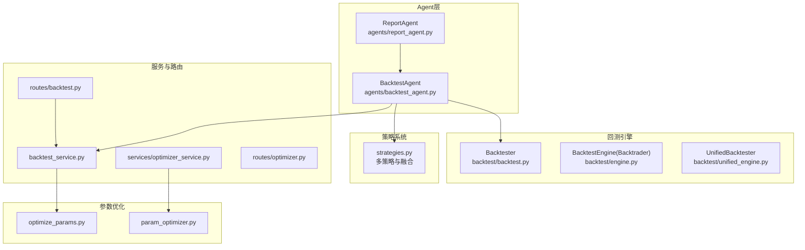
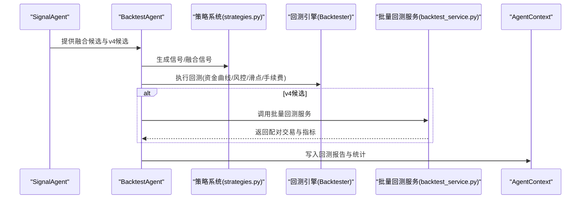
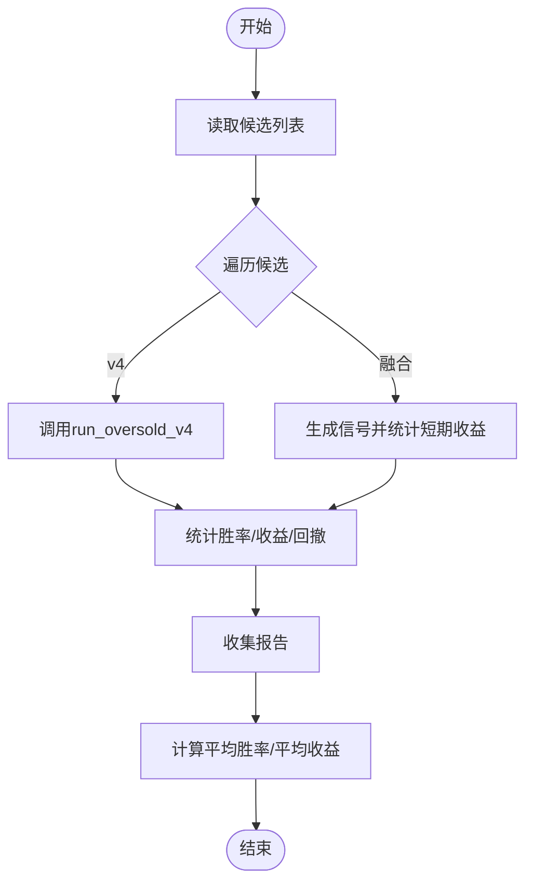
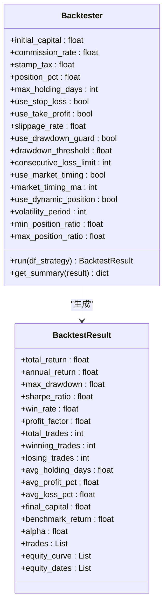
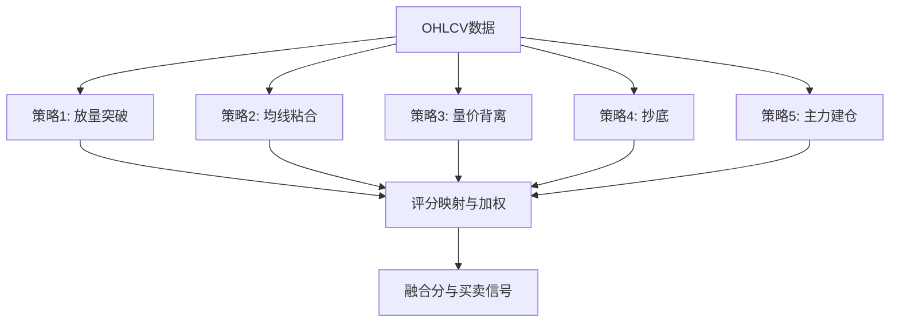
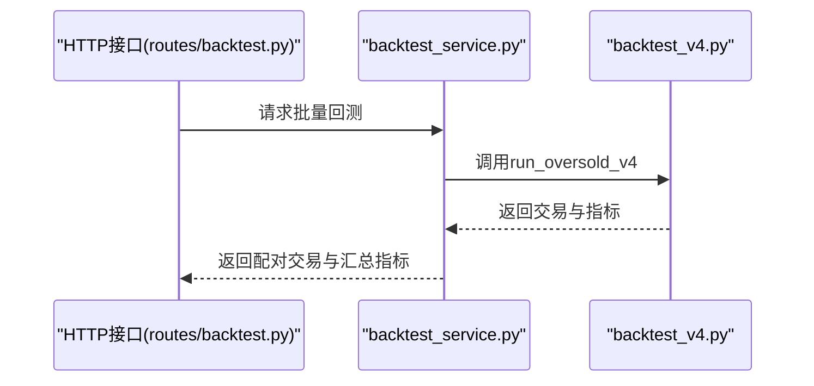
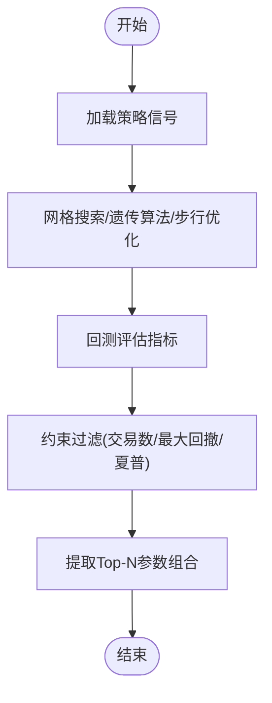
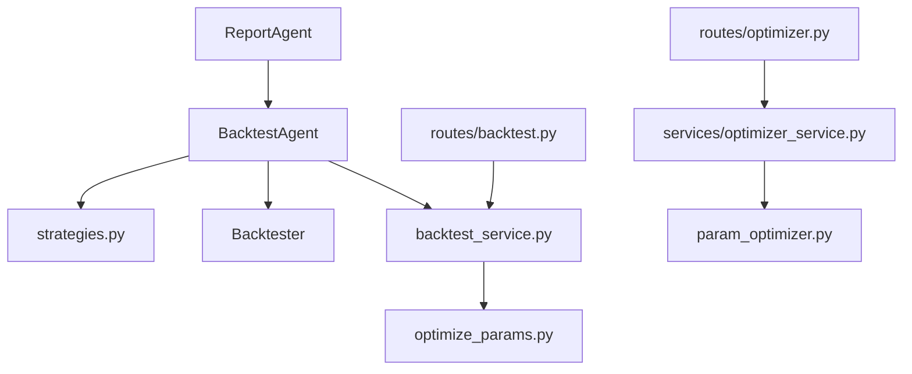

# 回测Agent

<cite>
**本文引用的文件**
- [agents/backtest_agent.py](file://agents/backtest_agent.py)
- [backtest/backtest.py](file://backtest/backtest.py)
- [backtest/engine.py](file://backtest/engine.py)
- [backtest/unified_engine.py](file://backtest/unified_engine.py)
- [backtest/backtest_v4.py](file://backtest/backtest_v4.py)
- [backtest/strategy_screen_backtest.py](file://backtest/strategy_screen_backtest.py)
- [strategy/strategies.py](file://strategy/strategies.py)
- [services/backtest_service.py](file://services/backtest_service.py)
- [routes/backtest.py](file://routes/backtest.py)
- [agents/base.py](file://agents/base.py)
- [agents/report_agent.py](file://agents/report_agent.py)
- [backtest/optimize_params.py](file://backtest/optimize_params.py)
- [backtest/param_optimizer.py](file://backtest/param_optimizer.py)
- [services/optimizer_service.py](file://services/optimizer_service.py)
- [routes/optimizer.py](file://routes/optimizer.py)
</cite>

## 目录
1. [简介](#简介)
2. [项目结构](#项目结构)
3. [核心组件](#核心组件)
4. [架构总览](#架构总览)
5. [详细组件分析](#详细组件分析)
6. [依赖关系分析](#依赖关系分析)
7. [性能考量](#性能考量)
8. [故障排查指南](#故障排查指南)
9. [结论](#结论)
10. [附录](#附录)

## 简介
本文件面向AIQuant回测Agent，系统化阐述其在Alpha流水线中的职责与能力边界：对候选信号进行快速历史回测验证、计算关键绩效指标、汇总统计与报告生成，并与策略系统、报告系统协同工作。重点覆盖回测引擎集成、交易成本建模、滑点处理、手续费计算、最大回撤统计；以及参数优化、样本外测试、交叉验证与回测结果可视化。文档同时给出配置选项、性能基准设定与回测质量控制要点，帮助读者快速理解并高效使用。

## 项目结构
围绕回测Agent的关键文件组织如下：
- Agent层：agents/backtest_agent.py负责执行回测、聚合统计并写入上下文
- 回测引擎：backtest/backtest.py提供统一资金曲线、手续费、滑点、止损止盈、风控熔断、择时与动态仓位等核心逻辑
- 策略系统：strategy/strategies.py提供多策略与融合策略信号生成
- 批量回测服务：services/backtest_service.py封装v4策略批量回测
- 路由与接口：routes/backtest.py提供HTTP接口
- 报告Agent：agents/report_agent.py整合回测结果生成报告
- 参数优化：backtest/optimize_params.py与backtest/param_optimizer.py提供网格搜索、遗传算法与步行优化
- 统一引擎：backtest/unified_engine.py为策略插件化回测提供框架

**图表来源**
- [agents/backtest_agent.py:31-68](file://agents/backtest_agent.py#L31-L68)
- [backtest/backtest.py:56-409](file://backtest/backtest.py#L56-L409)
- [backtest/engine.py:72-140](file://backtest/engine.py#L72-L140)
- [backtest/unified_engine.py:59-132](file://backtest/unified_engine.py#L59-L132)
- [strategy/strategies.py:36-431](file://strategy/strategies.py#L36-L431)
- [services/backtest_service.py:10-74](file://services/backtest_service.py#L10-L74)
- [routes/backtest.py:12-44](file://routes/backtest.py#L12-L44)
- [agents/report_agent.py:63-90](file://agents/report_agent.py#L63-L90)
- [backtest/optimize_params.py:120-176](file://backtest/optimize_params.py#L120-L176)
- [backtest/param_optimizer.py:19-107](file://backtest/param_optimizer.py#L19-L107)
- [services/optimizer_service.py:9-61](file://services/optimizer_service.py#L9-L61)
- [routes/optimizer.py:11-47](file://routes/optimizer.py#L11-L47)

**章节来源**
- [agents/backtest_agent.py:31-68](file://agents/backtest_agent.py#L31-L68)
- [backtest/backtest.py:56-409](file://backtest/backtest.py#L56-L409)
- [strategy/strategies.py:36-431](file://strategy/strategies.py#L36-L431)
- [services/backtest_service.py:10-74](file://services/backtest_service.py#L10-L74)
- [routes/backtest.py:12-44](file://routes/backtest.py#L12-L44)
- [agents/report_agent.py:63-90](file://agents/report_agent.py#L63-L90)
- [backtest/optimize_params.py:120-176](file://backtest/optimize_params.py#L120-L176)
- [backtest/param_optimizer.py:19-107](file://backtest/param_optimizer.py#L19-L107)
- [services/optimizer_service.py:9-61](file://services/optimizer_service.py#L9-L61)
- [routes/optimizer.py:11-47](file://routes/optimizer.py#L11-L47)

## 核心组件
- 回测Agent（BacktestAgent）
  - 输入：融合策略候选与v4候选（来自上游Agent上下文）
  - 处理：对每只股票执行快速回测，统计胜率、平均收益、最大回撤、年化收益等
  - 输出：回测报告列表、平均胜率与平均收益，写入上下文供报告Agent使用
- 回测引擎（Backtester）
  - 资金曲线、手续费（双向）、印花税、滑点、止损止盈、最大持仓天数
  - 风控熔断（回撤阈值与连续亏损限制）、大盘择时（均线过滤）、动态仓位（基于ATR波动率）
  - 绩效指标：总收益、年化收益、最大回撤、夏普比率、胜率、盈亏比、平均持仓天数等
- 策略系统（strategies.py）
  - 五策略：放量突破、均线粘合、量价背离、抄底、主力建仓
  - 融合策略：多策略加权融合，输出融合分与买卖信号
- 批量回测服务（backtest_service.py）
  - v4超跌反弹策略批量回测，配对原始交易记录为成对买卖，统计关键指标
- 参数优化（optimize_params.py、param_optimizer.py）
  - 网格搜索、遗传算法、步行优化（Walk-Forward），约束最大回撤、最小交易数、夏普比率等
- 报告Agent（ReportAgent）
  - 整合回测、信号、风控Agent输出，生成HTML报告与微信推送文本

**章节来源**
- [agents/backtest_agent.py:37-68](file://agents/backtest_agent.py#L37-L68)
- [backtest/backtest.py:56-471](file://backtest/backtest.py#L56-L471)
- [strategy/strategies.py:36-431](file://strategy/strategies.py#L36-L431)
- [services/backtest_service.py:10-74](file://services/backtest_service.py#L10-L74)
- [backtest/optimize_params.py:120-176](file://backtest/optimize_params.py#L120-L176)
- [backtest/param_optimizer.py:19-107](file://backtest/param_optimizer.py#L19-L107)
- [agents/report_agent.py:63-90](file://agents/report_agent.py#L63-L90)

## 架构总览
回测Agent位于Alpha流水线的“尚书省·回测官”角色，承接信号Agent的候选，调用策略系统生成信号，驱动回测引擎计算指标，汇总统计后写入上下文，供报告Agent生成最终报告。

**图表来源**
- [agents/backtest_agent.py:37-68](file://agents/backtest_agent.py#L37-L68)
- [strategy/strategies.py:36-431](file://strategy/strategies.py#L36-L431)
- [backtest/backtest.py:121-409](file://backtest/backtest.py#L121-L409)
- [services/backtest_service.py:10-74](file://services/backtest_service.py#L10-L74)

**章节来源**
- [agents/backtest_agent.py:37-68](file://agents/backtest_agent.py#L37-L68)
- [backtest/backtest.py:121-409](file://backtest/backtest.py#L121-L409)
- [services/backtest_service.py:10-74](file://services/backtest_service.py#L10-L74)

## 详细组件分析

### 回测Agent（BacktestAgent）
- 职责
  - 对融合策略候选与v4候选分别执行快速回测
  - 统计每只股票的胜率、平均收益、最大回撤、年化收益等
  - 汇总平均胜率与平均收益，写入上下文供报告Agent使用
- 关键流程
  - v4回测：调用run_oversold_v4，过滤特定股票交易记录，统计胜率与收益
  - 融合策略回测：调用策略系统生成信号，统计最近信号触发后的短期收益与胜率
- 输出
  - 每只股票的回测报告（含策略类型、交易次数、胜率、平均收益、最大回撤、年化收益等）
  - 汇总统计（报告数量、平均胜率、平均收益）

**图表来源**
- [agents/backtest_agent.py:37-68](file://agents/backtest_agent.py#L37-L68)
- [backtest/backtest_v4.py:218-581](file://backtest/backtest_v4.py#L218-L581)
- [strategy/strategies.py:36-431](file://strategy/strategies.py#L36-L431)

**章节来源**
- [agents/backtest_agent.py:37-68](file://agents/backtest_agent.py#L37-L68)
- [backtest/backtest_v4.py:218-581](file://backtest/backtest_v4.py#L218-L581)
- [strategy/strategies.py:36-431](file://strategy/strategies.py#L36-L431)

### 回测引擎（Backtester）
- 交易成本建模
  - 手续费：双向，按成交金额的万分之三，最低5元
  - 印花税：卖出单向，千分之一
  - 滑点：买入加滑点、卖出减滑点，千分之一
- 风控与择时
  - 回撤熔断：达到阈值或连续亏损达到限制时暂停开仓
  - 大盘择时：以指数均线过滤，仅在多头时开仓
  - 动态仓位：基于ATR波动率调整有效仓位比例
- 绩效指标
  - 总收益、年化收益、最大回撤、夏普比率、胜率、盈亏比、平均持仓天数、基准收益与Alpha

**图表来源**
- [backtest/backtest.py:56-494](file://backtest/backtest.py#L56-L494)

**章节来源**
- [backtest/backtest.py:56-494](file://backtest/backtest.py#L56-L494)

### 策略系统（strategies.py）
- 五策略
  - 放量突破、均线粘合、量价背离、抄底、主力建仓
- 融合策略
  - 多策略评分加权融合，输出融合分与买卖信号，便于统一回测

**图表来源**
- [strategy/strategies.py:36-431](file://strategy/strategies.py#L36-L431)

**章节来源**
- [strategy/strategies.py:36-431](file://strategy/strategies.py#L36-L431)

### 批量回测服务（backtest_service.py）
- 面向v4超跌反弹策略的批量回测
- 将原始交易记录按股票配对为买入/卖出，计算胜率、盈亏比、平均持有天数等
- 输出标准化指标与资金曲线

**图表来源**
- [routes/backtest.py:12-44](file://routes/backtest.py#L12-L44)
- [services/backtest_service.py:10-74](file://services/backtest_service.py#L10-L74)
- [backtest/backtest_v4.py:218-581](file://backtest/backtest_v4.py#L218-L581)

**章节来源**
- [routes/backtest.py:12-44](file://routes/backtest.py#L12-L44)
- [services/backtest_service.py:10-74](file://services/backtest_service.py#L10-L74)
- [backtest/backtest_v4.py:218-581](file://backtest/backtest_v4.py#L218-L581)

### 参数优化（optimize_params.py、param_optimizer.py）
- 网格搜索
  - 搜索空间：融合分门槛、止损倍数、止盈倍数、最大持仓天数、仓位比例
  - 约束：至少5笔交易、最大回撤<25%、夏普比率>0
- 遗传算法
  - 适用于参数空间较大场景，支持锦标赛选择、交叉与变异
- 步行优化（Walk-Forward）
  - 将数据划分为训练集与测试集，训练集优化参数，测试集验证收益与稳定性

**图表来源**
- [backtest/optimize_params.py:120-176](file://backtest/optimize_params.py#L120-L176)
- [backtest/param_optimizer.py:19-107](file://backtest/param_optimizer.py#L19-L107)

**章节来源**
- [backtest/optimize_params.py:120-176](file://backtest/optimize_params.py#L120-L176)
- [backtest/param_optimizer.py:19-107](file://backtest/param_optimizer.py#L19-L107)

### 报告Agent（ReportAgent）
- 整合回测、信号、风控Agent输出
- 生成HTML报告与微信推送文本，包含推荐列表、风险提示与市场环境摘要

**章节来源**
- [agents/report_agent.py:63-90](file://agents/report_agent.py#L63-L90)

## 依赖关系分析
- 回测Agent依赖策略系统生成信号，依赖回测引擎计算指标，依赖批量回测服务处理v4候选
- 报告Agent依赖回测Agent输出，整合风控与信号Agent结果
- 参数优化服务与路由为策略参数优化提供统一入口

**图表来源**
- [agents/backtest_agent.py:31-68](file://agents/backtest_agent.py#L31-L68)
- [strategy/strategies.py:36-431](file://strategy/strategies.py#L36-L431)
- [backtest/backtest.py:56-494](file://backtest/backtest.py#L56-L494)
- [services/backtest_service.py:10-74](file://services/backtest_service.py#L10-L74)
- [agents/report_agent.py:63-90](file://agents/report_agent.py#L63-L90)
- [backtest/optimize_params.py:120-176](file://backtest/optimize_params.py#L120-L176)
- [backtest/param_optimizer.py:19-107](file://backtest/param_optimizer.py#L19-L107)
- [services/optimizer_service.py:9-61](file://services/optimizer_service.py#L9-L61)
- [routes/backtest.py:12-44](file://routes/backtest.py#L12-L44)
- [routes/optimizer.py:11-47](file://routes/optimizer.py#L11-L47)

**章节来源**
- [agents/backtest_agent.py:31-68](file://agents/backtest_agent.py#L31-L68)
- [agents/report_agent.py:63-90](file://agents/report_agent.py#L63-L90)
- [services/backtest_service.py:10-74](file://services/backtest_service.py#L10-L74)
- [backtest/optimize_params.py:120-176](file://backtest/optimize_params.py#L120-L176)
- [backtest/param_optimizer.py:19-107](file://backtest/param_optimizer.py#L19-L107)
- [services/optimizer_service.py:9-61](file://services/optimizer_service.py#L9-L61)
- [routes/backtest.py:12-44](file://routes/backtest.py#L12-L44)
- [routes/optimizer.py:11-47](file://routes/optimizer.py#L11-L47)

## 性能考量
- 回测效率
  - 使用T+1延迟执行避免未来数据泄露，确保实盘一致性
  - 资金曲线与交易记录按日更新，减少内存占用
- 成本建模
  - 手续费与印花税采用最小5元起步与卖出单向收取，贴近A股实盘成本
  - 滑点按千分之一建模，兼顾真实冲击与回测稳定性
- 风控与择时
  - 回撤熔断与连续亏损限制降低系统性风险暴露
  - 大盘择时与动态仓位提升在不同市场环境下的适应性
- 参数优化
  - 约束条件（最小交易数、最大回撤、夏普比率）防止过拟合
  - 步行优化在多个滚动窗口上验证参数稳定性

[本节为通用指导，无需特定文件引用]

## 故障排查指南
- 回测无数据
  - 检查候选列表是否为空，确认上游信号Agent是否正常产出
  - 确认策略信号生成是否成功（融合策略需确保各策略评分列存在）
- 回测异常
  - 检查回测引擎初始化参数（初始资金、手续费、滑点、风控阈值等）
  - 核对输入数据是否包含open列（T+1执行需要）
- 批量回测失败
  - 检查接口参数（开始/结束日期、权重、仓位等）
  - 确认v4策略回测返回结构与字段是否符合预期
- 报告生成异常
  - 检查Agent上下文是否包含回测Agent输出
  - 确认报告Agent依赖的上游Agent结果是否存在

**章节来源**
- [agents/backtest_agent.py:37-68](file://agents/backtest_agent.py#L37-L68)
- [backtest/backtest.py:108-120](file://backtest/backtest.py#L108-L120)
- [services/backtest_service.py:10-74](file://services/backtest_service.py#L10-L74)
- [routes/backtest.py:12-44](file://routes/backtest.py#L12-L44)
- [agents/report_agent.py:63-90](file://agents/report_agent.py#L63-L90)

## 结论
回测Agent在AIQuant流水线中承担“快速验证与汇总”的关键角色，结合统一的回测引擎与策略系统，能够高效地对候选信号进行历史回测与统计分析，并通过报告Agent形成可读性强的交易计划。配合参数优化与步行验证，进一步提升策略鲁棒性与泛化能力。建议在生产环境中严格设置风控阈值与成本模型，持续监控最大回撤与胜率变化，确保回测质量与实盘一致性。

[本节为总结性内容，无需特定文件引用]

## 附录

### 回测Agent配置选项与最佳实践
- 输入候选
  - 融合策略候选：包含股票代码、名称、评分与触发列表
  - v4候选：包含股票代码、名称与策略评分
- 回测参数（v4）
  - 初始资金、最大持仓数、最大持有天数、最小持有天数、止损、移动止盈比例、单股上限、是否启用大盘择时
- 统计指标
  - 胜率、平均收益、最大回撤、年化收益、交易次数、盈亏比、平均持仓天数
- 输出
  - 每只股票的回测报告与汇总统计，写入Agent上下文

**章节来源**
- [agents/backtest_agent.py:37-68](file://agents/backtest_agent.py#L37-L68)
- [backtest/backtest_v4.py:218-581](file://backtest/backtest_v4.py#L218-L581)

### 回测质量控制清单
- 数据完整性：确保OHLCV与open列齐全，避免T+1执行异常
- 成本模型：确认手续费、印花税与滑点参数合理
- 风控阈值：设置合适的回撤熔断与连续亏损限制
- 指标校验：核对最大回撤、胜率、夏普比率是否符合预期
- 参数约束：最小交易数、最大回撤上限、夏普比率下限

**章节来源**
- [backtest/backtest.py:56-494](file://backtest/backtest.py#L56-L494)
- [backtest/optimize_params.py:80-85](file://backtest/optimize_params.py#L80-L85)