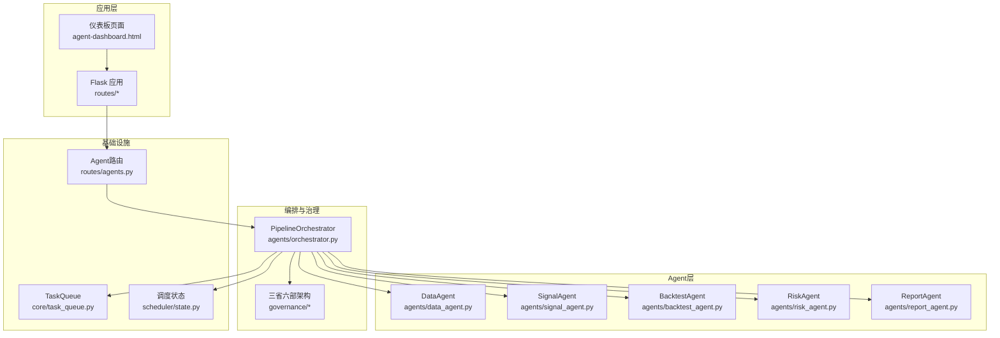
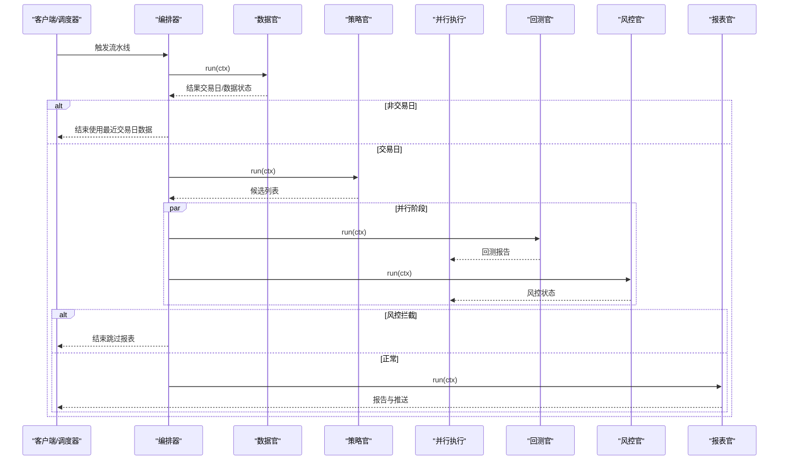
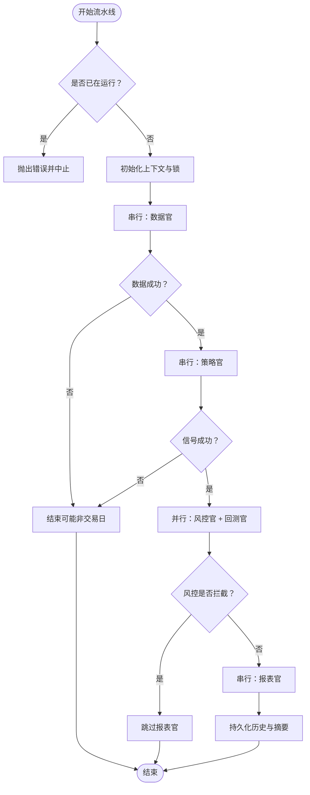
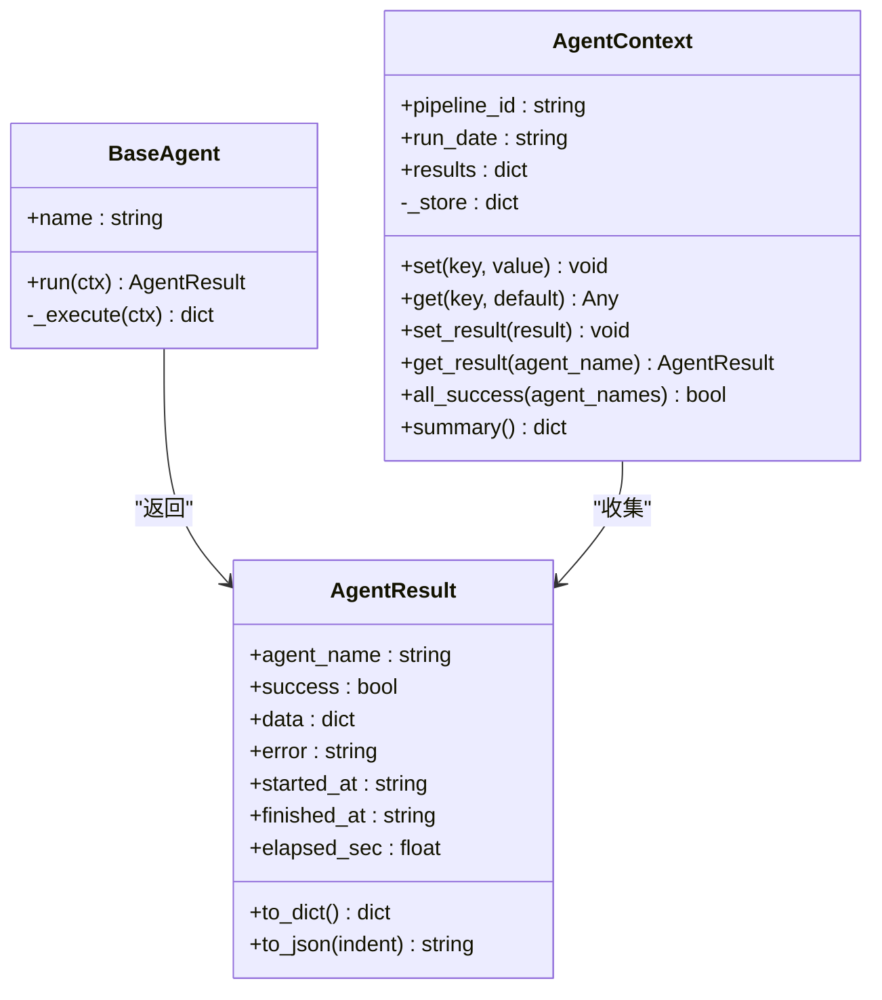
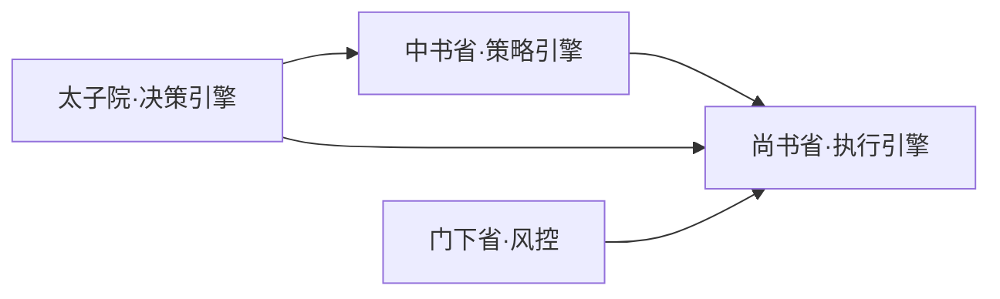
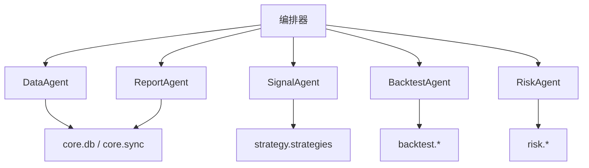

# 多Agent编排系统

<cite>
**本文档引用的文件**
- [agents/orchestrator.py](file://agents/orchestrator.py)
- [agents/base.py](file://agents/base.py)
- [agents/data_agent.py](file://agents/data_agent.py)
- [agents/signal_agent.py](file://agents/signal_agent.py)
- [agents/backtest_agent.py](file://agents/backtest_agent.py)
- [agents/risk_agent.py](file://agents/risk_agent.py)
- [agents/report_agent.py](file://agents/report_agent.py)
- [governance/__init__.py](file://governance/__init__.py)
- [governance/chancellery/scoring_engine.py](file://governance/chancellery/scoring_engine.py)
- [governance/crown_prince/decision_engine.py](file://governance/crown_prince/decision_engine.py)
- [governance/secretariat/execution_engine.py](file://governance/secretariat/execution_engine.py)
- [core/task_queue.py](file://core/task_queue.py)
- [scheduler/state.py](file://scheduler/state.py)
- [routes/agents.py](file://routes/agents.py)
- [app.py](file://app.py)
- [quant.py](file://quant.py)
</cite>

## 目录
1. [简介](#简介)
2. [项目结构](#项目结构)
3. [核心组件](#核心组件)
4. [架构总览](#架构总览)
5. [详细组件分析](#详细组件分析)
6. [依赖分析](#依赖分析)
7. [性能考虑](#性能考虑)
8. [故障排查指南](#故障排查指南)
9. [结论](#结论)
10. [附录](#附录)

## 简介
本项目为“AIQuant多Agent编排系统”，采用“三省六部制”组织Agent流水线，形成从数据采集、信号生成、风险控制、回测验证到报告输出的完整自动化工作流。系统通过统一的编排器协调各Agent的执行顺序、并行度、状态同步与错误处理，并提供REST API与前端仪表板进行可视化控制与状态查询。

## 项目结构
系统采用按职责分层与按功能模块划分相结合的组织方式：
- agents：多Agent实现与编排器
- governance：三省六部治理架构（决策、策略、执行）
- core：核心基础设施（任务队列、数据库、同步等）
- routes：Flask API路由
- scheduler：进程内调度状态
- backtest、strategy、risk、ministries等：策略、回测、风控、执行等子系统

图表来源
- [app.py:1-164](file://app.py#L1-L164)
- [routes/agents.py:1-128](file://routes/agents.py#L1-L128)
- [agents/orchestrator.py:1-263](file://agents/orchestrator.py#L1-L263)
- [core/task_queue.py:1-222](file://core/task_queue.py#L1-L222)
- [scheduler/state.py:1-45](file://scheduler/state.py#L1-L45)

章节来源
- [app.py:1-164](file://app.py#L1-L164)
- [routes/agents.py:1-128](file://routes/agents.py#L1-L128)

## 核心组件
- 编排器（PipelineOrchestrator）：负责流水线的执行顺序、并行度、状态持久化、错误处理与历史记录。
- Agent基类与上下文（BaseAgent、AgentContext）：统一Agent接口、结果封装、上下文共享与汇总。
- 三省六部治理引擎：决策（太子院）、策略（中书省）、执行（尚书省）与风控（门下省）的协同。
- 任务队列（TaskQueue）：轻量异步任务执行与状态跟踪。
- 调度状态（SchedulerState）：进程内流水线状态共享。

章节来源
- [agents/orchestrator.py:36-263](file://agents/orchestrator.py#L36-L263)
- [agents/base.py:20-120](file://agents/base.py#L20-L120)
- [governance/crown_prince/decision_engine.py:61-157](file://governance/crown_prince/decision_engine.py#L61-L157)
- [governance/chancellery/scoring_engine.py:246-370](file://governance/chancellery/scoring_engine.py#L246-L370)
- [governance/secretariat/execution_engine.py:57-183](file://governance/secretariat/execution_engine.py#L57-L183)
- [core/task_queue.py:51-222](file://core/task_queue.py#L51-L222)
- [scheduler/state.py:24-45](file://scheduler/state.py#L24-L45)

## 架构总览
系统采用“三省六部制”流水线模型：
- 太子院·数据官（DataAgent）：串行，负责交易日判断、全量/增量数据同步、质量检查与缓存清理。
- 中书省·策略官（SignalAgent）：串行，负责策略扫描与候选生成。
- 门下省·风控官（RiskAgent）与尚书省·回测官（BacktestAgent）：并行，分别进行风控检查与回测验证。
- 尚书省·报表官（ReportAgent）：串行，负责整合上游结果、生成报告与微信推送。

图表来源
- [agents/orchestrator.py:81-175](file://agents/orchestrator.py#L81-L175)
- [agents/data_agent.py:31-86](file://agents/data_agent.py#L31-L86)
- [agents/signal_agent.py:47-108](file://agents/signal_agent.py#L47-L108)
- [agents/backtest_agent.py:37-68](file://agents/backtest_agent.py#L37-L68)
- [agents/risk_agent.py:31-96](file://agents/risk_agent.py#L31-L96)
- [agents/report_agent.py:63-90](file://agents/report_agent.py#L63-L90)

## 详细组件分析

### 编排器（PipelineOrchestrator）
- 职责：管理Agent执行顺序、并行执行、状态查询、历史记录、错误处理与重试策略（通过外部重试机制实现）。
- 关键特性：
  - 串行阶段：DataAgent → SignalAgent
  - 并行阶段：BacktestAgent 与 RiskAgent
  - 风控拦截：若RiskAgent标记BLOCK，则跳过ReportAgent
  - 状态持久化：将每次执行摘要写入历史，支持查询
  - 回调钩子：on_agent_start/on_agent_finish用于外部观察

图表来源
- [agents/orchestrator.py:81-175](file://agents/orchestrator.py#L81-L175)

章节来源
- [agents/orchestrator.py:36-263](file://agents/orchestrator.py#L36-L263)

### Agent基类与上下文（BaseAgent、AgentContext）
- BaseAgent：统一run接口，自动计时、异常捕获与结果封装。
- AgentContext：跨Agent共享数据区，支持set/get与结果聚合，提供summary生成。

图表来源
- [agents/base.py:20-120](file://agents/base.py#L20-L120)

章节来源
- [agents/base.py:20-120](file://agents/base.py#L20-L120)

### 数据Agent（DataAgent）
- 职责：交易日判断、全量/增量数据同步、质量检查、缓存清理。
- 特性：在非交易日时，尝试使用最近交易日数据继续执行。

章节来源
- [agents/data_agent.py:25-167](file://agents/data_agent.py#L25-L167)

### 信号Agent（SignalAgent）
- 职责：运行5策略融合与v4超跌反弹扫描，生成候选列表并保存至数据库。
- 特性：对候选进行排序与去重，写入上下文供下游Agent使用。

章节来源
- [agents/signal_agent.py:41-213](file://agents/signal_agent.py#L41-L213)

### 回测Agent（BacktestAgent）
- 职责：对候选股票进行快速历史回测，统计胜率、平均收益与最大回撤等指标。
- 特性：区分融合策略与v4策略的回测逻辑，聚合报告并写入上下文。

章节来源
- [agents/backtest_agent.py:31-181](file://agents/backtest_agent.py#L31-L181)

### 风控Agent（RiskAgent）
- 职责：大盘趋势与波动率评估、个股风险筛查、仓位建议、系统化风控检查。
- 特性：将风控状态写入上下文，供编排器拦截与后续流程使用。

章节来源
- [agents/risk_agent.py:25-262](file://agents/risk_agent.py#L25-L262)

### 报表Agent（ReportAgent）
- 职责：整合上游结果，生成HTML与JSON报告，构建微信推送文本。
- 特性：合并候选、映射回测与风险信息、排序与风险标记翻译。

章节来源
- [agents/report_agent.py:20-393](file://agents/report_agent.py#L20-L393)

### 三省六部制治理架构
- 太子院（决策引擎）：接收策略意图，动态生成执行计划。
- 中书省（策略引擎）：多因子评分与策略生成。
- 门下省（风控）：系统化风控检查与拦截。
- 尚书省（执行引擎）：订单生成与执行调度。

图表来源
- [governance/crown_prince/decision_engine.py:61-157](file://governance/crown_prince/decision_engine.py#L61-L157)
- [governance/chancellery/scoring_engine.py:246-370](file://governance/chancellery/scoring_engine.py#L246-L370)
- [governance/secretariat/execution_engine.py:57-183](file://governance/secretariat/execution_engine.py#L57-L183)

章节来源
- [governance/__init__.py:1-10](file://governance/__init__.py#L1-L10)
- [governance/crown_prince/decision_engine.py:61-157](file://governance/crown_prince/decision_engine.py#L61-L157)
- [governance/chancellery/scoring_engine.py:246-370](file://governance/chancellery/scoring_engine.py#L246-L370)
- [governance/secretariat/execution_engine.py:57-183](file://governance/secretariat/execution_engine.py#L57-L183)

### 任务队列与调度状态
- TaskQueue：线程池异步任务执行、状态跟踪与回调通知。
- SchedulerState：进程内流水线状态共享，支持运行中标志、最后结果与各Agent状态。

章节来源
- [core/task_queue.py:51-222](file://core/task_queue.py#L51-L222)
- [scheduler/state.py:24-45](file://scheduler/state.py#L24-L45)

## 依赖分析
- 组件耦合：
  - 编排器通过字符串注册表延迟导入各Agent类，降低启动时对外部依赖的耦合。
  - Agent之间通过AgentContext共享数据，耦合度低、扩展性强。
- 外部依赖：
  - 数据库与行情数据源（通过core.db与core.sync暴露）。
  - 回测与策略模块（backtest.*、strategy.*）。
  - 风控模块（risk.*）。
- 可能的循环依赖：
  - 编排器与Agent通过延迟导入避免直接循环依赖。
  - 治理模块与Agent解耦，通过上下文与结果交互。

图表来源
- [agents/orchestrator.py:46-52](file://agents/orchestrator.py#L46-L52)
- [agents/data_agent.py:18-22](file://agents/data_agent.py#L18-L22)
- [agents/signal_agent.py:18-28](file://agents/signal_agent.py#L18-L28)
- [agents/backtest_agent.py:17-28](file://agents/backtest_agent.py#L17-L28)
- [agents/risk_agent.py:21-22](file://agents/risk_agent.py#L21-L22)
- [agents/report_agent.py:17](file://agents/report_agent.py#L17)

## 性能考虑
- 并行执行：在风控与回测阶段并行，缩短端到端时延。
- 轻量异步：TaskQueue线程池执行异步任务，避免阻塞主线程。
- 数据复用：AgentContext共享数据，减少重复IO与计算。
- 非交易日短路：在非交易日直接使用最近交易日数据，避免无效计算。
- 建议：
  - 合理设置线程池大小与并行度，避免资源争用。
  - 对耗时操作（如回测）考虑分批或缓存中间结果。
  - 监控数据库连接与索引，确保高频查询性能。

## 故障排查指南
- 常见问题
  - 流水线已在运行：编排器会拒绝并发启动，需等待上次执行结束。
  - 非交易日无数据：检查交易日判断与最近交易日缓存。
  - 风控拦截：查看RiskAgent输出的风险级别与拦截原因。
  - Agent异常：查看AgentResult中的error字段与堆栈信息。
- API与状态
  - 查询流水线状态与历史：/api/agents/status 与 /api/agents/history
  - 手动触发流水线或单Agent：/api/agents/run 与 /api/agents/run/<name>
  - 查看三省六部架构信息：/api/agents/governance

章节来源
- [routes/agents.py:22-127](file://routes/agents.py#L22-L127)
- [agents/orchestrator.py:64-76](file://agents/orchestrator.py#L64-L76)

## 结论
本系统通过“三省六部制”流水线将数据、策略、风控、回测与报告有机串联，具备清晰的职责分工、良好的扩展性与可观测性。编排器统一调度、并行加速、状态持久化与拦截机制确保了生产级的可靠性。治理模块与Agent解耦设计便于未来引入更多专业Agent与策略。

## 附录

### Agent生命周期与消息传递
- 生命周期：初始化上下文 → 串行阶段 → 并行阶段 → 汇总与报告 → 持久化历史。
- 消息传递：通过AgentContext共享数据，AgentResult作为结果载体，编排器负责汇总与拦截。

章节来源
- [agents/orchestrator.py:81-175](file://agents/orchestrator.py#L81-L175)
- [agents/base.py:38-86](file://agents/base.py#L38-L86)

### 错误处理与重试机制
- 自动异常捕获：BaseAgent在run中捕获异常并记录。
- 编排器层面：通过外部重试（例如API再次触发）与历史记录追踪问题。
- 建议：对易失败步骤（网络/外部数据源）增加指数退避与熔断保护。

章节来源
- [agents/base.py:93-114](file://agents/base.py#L93-L114)
- [agents/orchestrator.py:155-158](file://agents/orchestrator.py#L155-L158)

### 扩展开发指南与自定义Agent实现示例
- 扩展步骤
  - 继承BaseAgent，实现name与_execute方法。
  - 在agents/orchestrator.py的注册表中登记模块与类名。
  - 在编排流程中插入或替换相应阶段。
  - 通过AgentContext读写共享数据，必要时提供回调钩子。
- 示例路径
  - 自定义Agent模板参考：[agents/base.py:88-120](file://agents/base.py#L88-L120)
  - 编排器注册表参考：[agents/orchestrator.py:46-52](file://agents/orchestrator.py#L46-L52)
  - 并行执行参考：[agents/orchestrator.py:213-238](file://agents/orchestrator.py#L213-L238)

章节来源
- [agents/base.py:88-120](file://agents/base.py#L88-L120)
- [agents/orchestrator.py:46-52](file://agents/orchestrator.py#L46-L52)
- [agents/orchestrator.py:213-238](file://agents/orchestrator.py#L213-L238)

### 与策略与回测的关系
- 策略参数与阈值：在quant.py中集中维护，确保Agent与历史回测一致性。
- 策略扫描：SignalAgent与quant.py扫描逻辑互补，前者面向实时流水线，后者面向历史回填与面板。

章节来源
- [quant.py:43-52](file://quant.py#L43-L52)
- [quant.py:433-546](file://quant.py#L433-L546)
- [agents/signal_agent.py:47-108](file://agents/signal_agent.py#L47-L108)