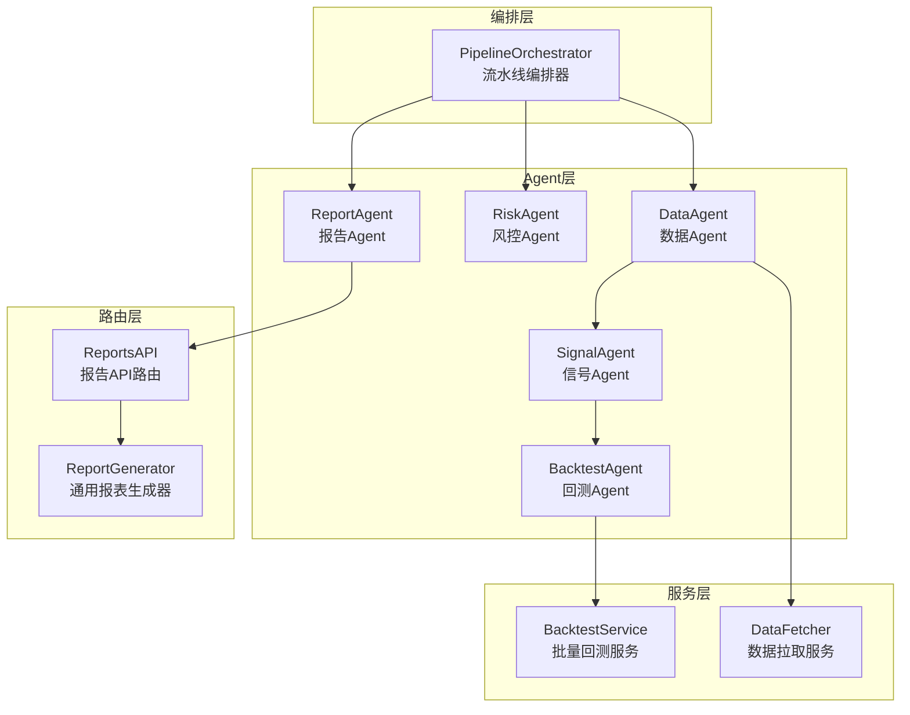
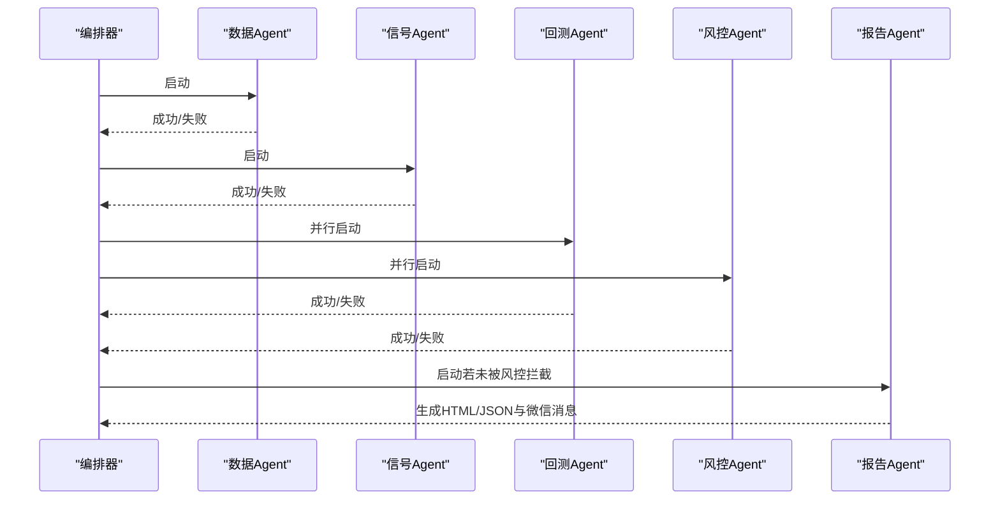
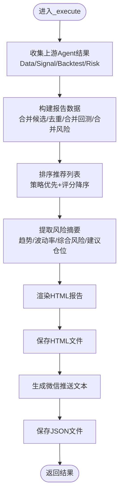
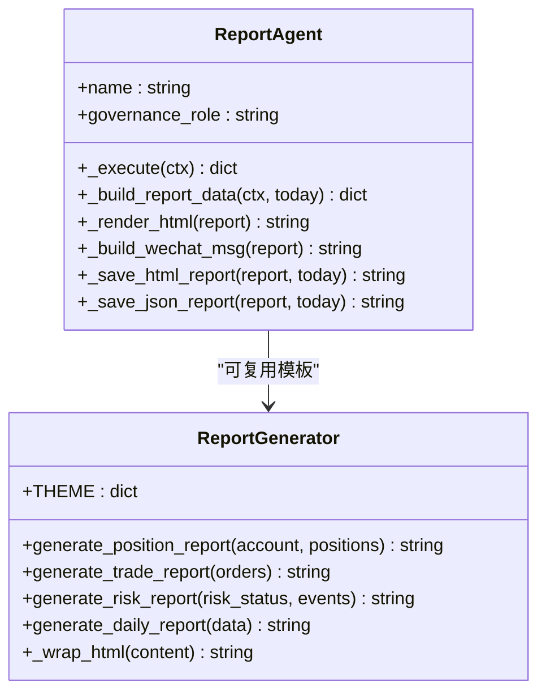
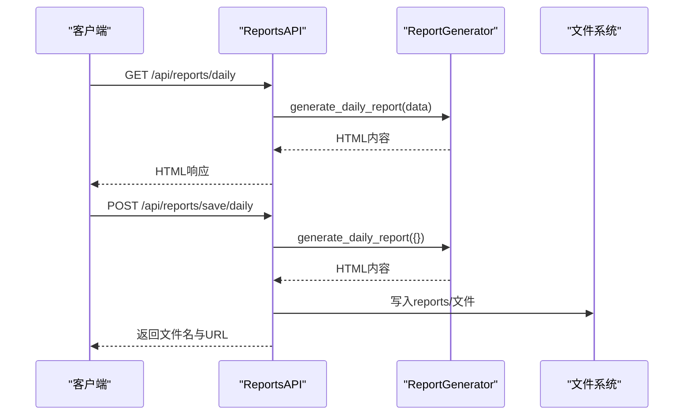
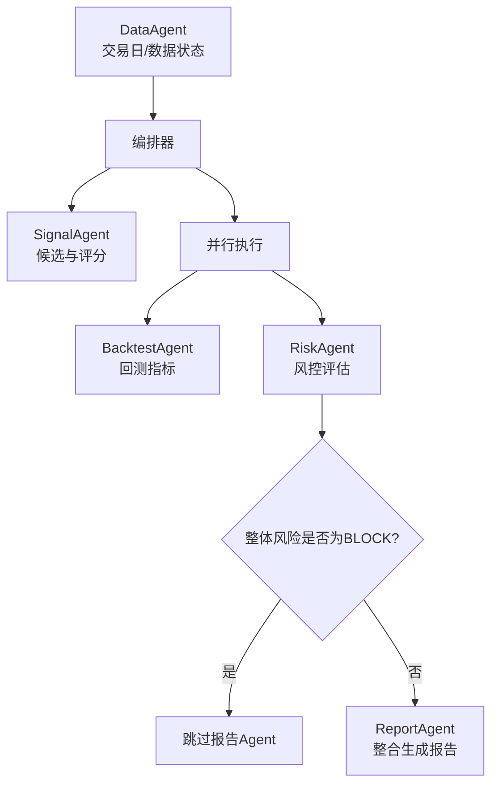
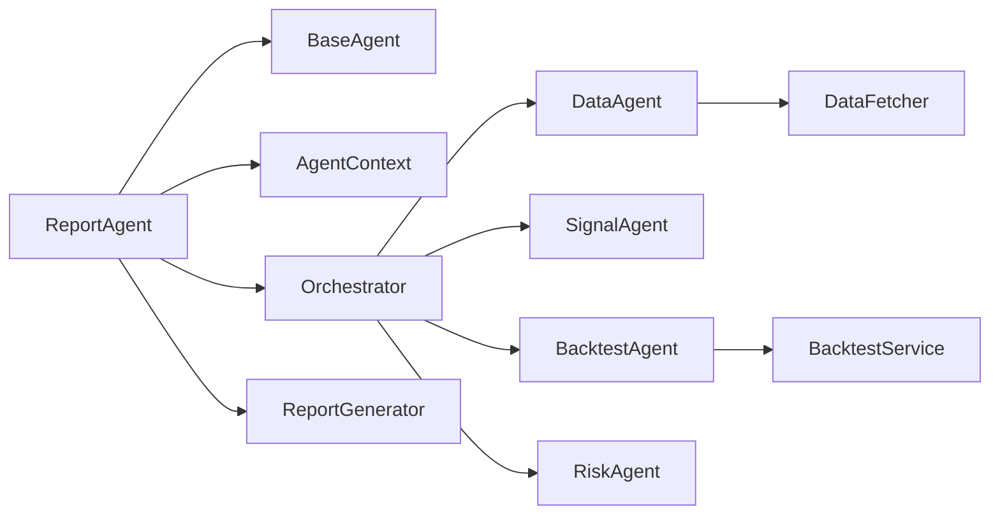

# 报告Agent

<cite>
**本文引用的文件**
- [agents/report_agent.py](file://agents/report_agent.py)
- [agents/base.py](file://agents/base.py)
- [agents/orchestrator.py](file://agents/orchestrator.py)
- [routes/reports.py](file://routes/reports.py)
- [ministries/libu/report_generator.py](file://ministries/libu/report_generator.py)
- [services/backtest_service.py](file://services/backtest_service.py)
- [services/data_fetcher.py](file://services/data_fetcher.py)
- [test_pipeline.py](file://test_pipeline.py)
- [config/settings.py](file://config/settings.py)
</cite>

## 目录
1. [简介](#简介)
2. [项目结构](#项目结构)
3. [核心组件](#核心组件)
4. [架构总览](#架构总览)
5. [详细组件分析](#详细组件分析)
6. [依赖分析](#依赖分析)
7. [性能考虑](#性能考虑)
8. [故障排查指南](#故障排查指南)
9. [结论](#结论)
10. [附录](#附录)

## 简介
报告Agent是“三省六部制”量化流水线中的最终环节，负责整合上游各Agent（数据、信号、回测、风控）的输出，生成综合分析报告、微信推送文本，并将HTML与JSON格式的报告持久化到磁盘。其职责包括：
- 整合上游Agent结果，构建统一报告数据结构
- 生成HTML综合日报与JSON明细数据
- 生成面向微信的简明交易计划文本
- 提供报告下载与API访问能力
- 支持非交易日数据回填与有效交易日标注

## 项目结构
报告Agent位于agents子目录，配合编排器、路由层与通用报表生成器协同工作。关键文件与职责如下：
- agents/report_agent.py：报告Agent主体，负责数据聚合、HTML/JSON生成与微信消息构建
- agents/base.py：Agent基类与上下文定义，提供统一的执行框架与结果封装
- agents/orchestrator.py：流水线编排器，定义三省六部的执行顺序与依赖关系
- routes/reports.py：报告API路由，提供持仓、交易、风控、综合日报的HTML生成与下载
- ministries/libu/report_generator.py：通用报表生成器，提供多种标准HTML报告模板
- services/backtest_service.py：批量回测服务，为报告提供回测指标
- services/data_fetcher.py：数据拉取服务，为数据Agent提供数据源支持
- test_pipeline.py：端到端测试脚本，验证流水线与报告Agent的集成效果
- config/settings.py：系统基础配置，包含API端口、定时任务等

**图表来源**
- [agents/orchestrator.py:11-16](file://agents/orchestrator.py#L11-L16)
- [agents/report_agent.py:63-90](file://agents/report_agent.py#L63-L90)
- [routes/reports.py:21-27](file://routes/reports.py#L21-L27)
- [ministries/libu/report_generator.py:13-303](file://ministries/libu/report_generator.py#L13-L303)
- [services/backtest_service.py:10-15](file://services/backtest_service.py#L10-L15)
- [services/data_fetcher.py:17-26](file://services/data_fetcher.py#L17-L26)

**章节来源**
- [agents/report_agent.py:1-393](file://agents/report_agent.py#L1-L393)
- [agents/base.py:1-120](file://agents/base.py#L1-L120)
- [agents/orchestrator.py:1-263](file://agents/orchestrator.py#L1-L263)
- [routes/reports.py:1-188](file://routes/reports.py#L1-L188)
- [ministries/libu/report_generator.py:1-304](file://ministries/libu/report_generator.py#L1-L304)
- [services/backtest_service.py:1-135](file://services/backtest_service.py#L1-L135)
- [services/data_fetcher.py:1-106](file://services/data_fetcher.py#L1-L106)
- [test_pipeline.py:1-392](file://test_pipeline.py#L1-L392)
- [config/settings.py:1-25](file://config/settings.py#L1-L25)

## 核心组件
- 报告Agent（ReportAgent）
  - 职责：整合上游Agent结果，生成HTML/JSON报告与微信推送文本，保存至reports目录
  - 关键方法：_execute、_build_report_data、_render_html、_build_wechat_msg、_save_html_report、_save_json_report
  - 数据来源：DataAgent、SignalAgent、BacktestAgent、RiskAgent
- Agent基类与上下文（BaseAgent、AgentContext）
  - 提供统一的执行框架、异常捕获、耗时统计与结果封装
  - 上下文支持跨Agent共享数据与结果汇总
- 流水线编排器（PipelineOrchestrator）
  - 定义三省六部执行顺序：DataAgent → SignalAgent → {BacktestAgent, RiskAgent} → ReportAgent
  - 支持并行执行BacktestAgent与RiskAgent；风控拦截机制在门下省生效
- 报告API与通用报表生成器
  - routes/reports.py：提供持仓、交易、风控、综合日报的HTML生成与下载
  - ministries/libu/report_generator.py：提供主题化HTML模板与样式封装
- 批量回测服务与数据拉取服务
  - services/backtest_service.py：为报告提供回测指标（胜率、平均收益等）
  - services/data_fetcher.py：为数据Agent提供数据拉取与入库能力

**章节来源**
- [agents/report_agent.py:20-90](file://agents/report_agent.py#L20-L90)
- [agents/base.py:20-120](file://agents/base.py#L20-L120)
- [agents/orchestrator.py:36-175](file://agents/orchestrator.py#L36-L175)
- [routes/reports.py:21-188](file://routes/reports.py#L21-L188)
- [ministries/libu/report_generator.py:13-303](file://ministries/libu/report_generator.py#L13-L303)
- [services/backtest_service.py:10-135](file://services/backtest_service.py#L10-L135)
- [services/data_fetcher.py:17-106](file://services/data_fetcher.py#L17-L106)

## 架构总览
报告Agent在流水线中的位置与交互如下：
- DataAgent负责数据准备与交易日判断
- SignalAgent产出候选池与评分
- BacktestAgent与RiskAgent并行计算回测指标与风控评估
- ReportAgent整合上述结果，生成综合报告与微信推送
- 编排器控制执行顺序与错误处理，支持非交易日数据回填

**图表来源**
- [agents/orchestrator.py:112-153](file://agents/orchestrator.py#L112-L153)
- [agents/report_agent.py:63-90](file://agents/report_agent.py#L63-L90)

**章节来源**
- [agents/orchestrator.py:81-175](file://agents/orchestrator.py#L81-L175)
- [agents/report_agent.py:63-90](file://agents/report_agent.py#L63-L90)

## 详细组件分析

### 报告Agent（ReportAgent）
- 数据聚合与去重
  - 合并融合策略与v4超跌策略的候选，按股票代码去重
  - 构建推荐列表，合并回测与风险信息
- 风险摘要与排序
  - 提取市场趋势、波动率等级、综合风险与建议仓位
  - 按策略优先级与评分排序
- HTML报告渲染
  - 生成综合日报HTML，包含摘要卡片、推荐表格与风险状态
  - 支持非交易日提示与有效交易日标注
- JSON报告与微信推送
  - 保存JSON明细数据，便于二次加工或API消费
  - 生成简洁的微信推送文本，包含市场环境、建议仓位与前N条推荐

**图表来源**
- [agents/report_agent.py:63-90](file://agents/report_agent.py#L63-L90)
- [agents/report_agent.py:92-174](file://agents/report_agent.py#L92-L174)
- [agents/report_agent.py:228-250](file://agents/report_agent.py#L228-L250)
- [agents/report_agent.py:176-226](file://agents/report_agent.py#L176-L226)

**章节来源**
- [agents/report_agent.py:63-174](file://agents/report_agent.py#L63-L174)
- [agents/report_agent.py:176-250](file://agents/report_agent.py#L176-L250)

### 报告模板与渲染
- 报告Agent内部HTML渲染
  - 内置HTML模板，包含摘要卡片、推荐表格、风险状态与页脚
  - 支持非交易日提示与风险等级颜色标识
- 通用报表生成器（用于其他报告类型）
  - ministries/libu/report_generator.py提供主题化HTML模板
  - 支持持仓报告、交易报告、风控报告、综合日报等
  - 采用CSS变量主题，适配深色背景与打印样式

**图表来源**
- [agents/report_agent.py:20-90](file://agents/report_agent.py#L20-L90)
- [ministries/libu/report_generator.py:13-303](file://ministries/libu/report_generator.py#L13-L303)

**章节来源**
- [agents/report_agent.py:228-388](file://agents/report_agent.py#L228-L388)
- [ministries/libu/report_generator.py:27-293](file://ministries/libu/report_generator.py#L27-L293)

### 报告API与下载
- routes/reports.py提供以下接口：
  - GET /api/reports/position：生成持仓报告（HTML）
  - GET /api/reports/trade：生成交易报告（HTML）
  - GET /api/reports/risk：生成风控报告（HTML）
  - GET /api/reports/daily：生成综合日报（HTML）
  - POST /api/reports/save/<type>：保存指定类型报告为HTML文件
- 报告文件默认保存在reports目录，支持直接下载

**图表来源**
- [routes/reports.py:29-150](file://routes/reports.py#L29-L150)
- [ministries/libu/report_generator.py:174-216](file://ministries/libu/report_generator.py#L174-L216)

**章节来源**
- [routes/reports.py:29-150](file://routes/reports.py#L29-L150)
- [ministries/libu/report_generator.py:27-216](file://ministries/libu/report_generator.py#L27-L216)

### 与数据Agent和回测Agent的整合
- 数据Agent（DataAgent）
  - 提供交易日状态与最近交易日数据回填能力
  - 非交易日时，编排器设置有效交易日并继续执行
- 回测Agent（BacktestAgent）
  - 通过批量回测服务生成回测指标（胜率、平均收益等）
  - 报告Agent将回测指标合并到推荐列表中
- 风控Agent（RiskAgent）
  - 提供市场趋势、波动率等级、综合风险与建议仓位
  - 门下省一票否决：若整体风险等级为BLOCK，跳过报告生成

**图表来源**
- [agents/orchestrator.py:112-153](file://agents/orchestrator.py#L112-L153)
- [services/backtest_service.py:10-74](file://services/backtest_service.py#L10-L74)
- [agents/report_agent.py:92-174](file://agents/report_agent.py#L92-L174)

**章节来源**
- [agents/orchestrator.py:112-153](file://agents/orchestrator.py#L112-L153)
- [services/backtest_service.py:10-74](file://services/backtest_service.py#L10-L74)
- [agents/report_agent.py:92-174](file://agents/report_agent.py#L92-L174)

## 依赖分析
- 组件耦合与内聚
  - ReportAgent高度内聚于报告生成逻辑，依赖上游Agent结果与编排器提供的上下文
  - 与编排器弱耦合，通过AgentContext读取上游结果
  - 与通用报表生成器解耦，既可复用模板，也可自定义HTML
- 外部依赖
  - 无外部第三方库依赖，便于部署与维护
  - 与数据拉取服务、批量回测服务通过接口调用，保持松耦合
- 潜在循环依赖
  - 未发现循环依赖，模块边界清晰

**图表来源**
- [agents/report_agent.py:17-21](file://agents/report_agent.py#L17-L21)
- [agents/base.py:88-120](file://agents/base.py#L88-L120)
- [agents/orchestrator.py:36-52](file://agents/orchestrator.py#L36-L52)
- [services/backtest_service.py:10-15](file://services/backtest_service.py#L10-L15)
- [services/data_fetcher.py:17-26](file://services/data_fetcher.py#L17-L26)

**章节来源**
- [agents/report_agent.py:17-21](file://agents/report_agent.py#L17-L21)
- [agents/base.py:88-120](file://agents/base.py#L88-L120)
- [agents/orchestrator.py:36-52](file://agents/orchestrator.py#L36-L52)
- [services/backtest_service.py:10-15](file://services/backtest_service.py#L10-L15)
- [services/data_fetcher.py:17-26](file://services/data_fetcher.py#L17-L26)

## 性能考虑
- 数据聚合复杂度
  - 候选合并与去重：O(n+m)，其中n、m为两策略候选数量
  - 推荐列表构建：O(n+m)，随后按策略优先级与评分排序
- I/O开销
  - HTML/JSON文件写入：受磁盘吞吐影响，建议在独立磁盘或SSD上部署
- 并行执行
  - 回测与风控并行执行，缩短整体等待时间
- 非交易日处理
  - 使用最近交易日数据回填，避免流水线阻塞

[本节为通用性能讨论，无需特定文件来源]

## 故障排查指南
- 报告未生成或为空
  - 检查上游Agent是否全部成功：通过编排器上下文摘要确认
  - 非交易日：确认是否设置了有效交易日并继续执行
- HTML/JSON文件未保存
  - 检查reports目录权限与磁盘空间
  - 查看Agent执行日志与错误信息
- 微信推送异常
  - 检查风险标志与市场趋势翻译映射是否正确
  - 确认推荐列表为空时的兜底文案
- API无法访问报告
  - 确认Flask服务已启动，端口与主机配置正确
  - 检查路由是否正确注册

**章节来源**
- [agents/orchestrator.py:67-85](file://agents/orchestrator.py#L67-L85)
- [agents/report_agent.py:228-250](file://agents/report_agent.py#L228-L250)
- [routes/reports.py:126-150](file://routes/reports.py#L126-L150)
- [config/settings.py:10-14](file://config/settings.py#L10-L14)

## 结论
报告Agent作为流水线的“出口”，承担着整合上游智能体输出、生成标准化报告与推送的关键职责。其设计强调：
- 清晰的数据聚合与去重策略
- 可扩展的HTML模板与微信推送
- 与编排器、通用报表生成器的解耦协作
- 对非交易日与风控拦截的稳健处理
通过以上机制，报告Agent实现了自动化、可审计、可扩展的综合分析报告生成体系。

[本节为总结性内容，无需特定文件来源]

## 附录

### 报告自动化生成与调度
- 建议通过定时任务触发编排器执行流水线，确保每日自动产出报告
- 可结合配置文件中的定时参数进行统一调度

**章节来源**
- [config/settings.py:15-18](file://config/settings.py#L15-L18)

### 报告质量检查与版本管理
- 质量检查
  - 上下文摘要：检查各Agent执行状态与耗时
  - 风控拦截：若整体风险等级为BLOCK，记录拦截事件
  - 数据完整性：校验推荐列表、回测指标与风险摘要字段
- 版本管理
  - HTML/JSON文件命名包含日期，便于版本追踪
  - 可在报告头部添加生成时间戳与版本信息

**章节来源**
- [agents/orchestrator.py:144-150](file://agents/orchestrator.py#L144-L150)
- [agents/report_agent.py:160-174](file://agents/report_agent.py#L160-L174)

### 报告存储策略
- 存储位置：reports目录
- 文件格式：HTML（可直接浏览）、JSON（便于二次加工）
- 建议定期清理旧报告，保留最近N期以控制磁盘占用

**章节来源**
- [agents/report_agent.py:228-250](file://agents/report_agent.py#L228-L250)
- [routes/reports.py:126-150](file://routes/reports.py#L126-L150)

### 配置选项与自定义
- 报告模板
  - 可在ReportAgent内部修改HTML模板，或复用通用报表生成器
- 微信推送
  - 可调整推送文案长度与字段展示
- 性能优化
  - 减少不必要的字段渲染与样式计算
  - 对大列表分页或截断显示

**章节来源**
- [agents/report_agent.py:252-388](file://agents/report_agent.py#L252-L388)
- [ministries/libu/report_generator.py:218-293](file://ministries/libu/report_generator.py#L218-L293)

### 端到端测试参考
- test_pipeline.py展示了如何在Mock与真实数据场景下验证流水线与报告Agent的集成效果
- 可据此编写自动化测试，确保报告生成稳定性

**章节来源**
- [test_pipeline.py:119-246](file://test_pipeline.py#L119-L246)
- [test_pipeline.py:249-345](file://test_pipeline.py#L249-L345)