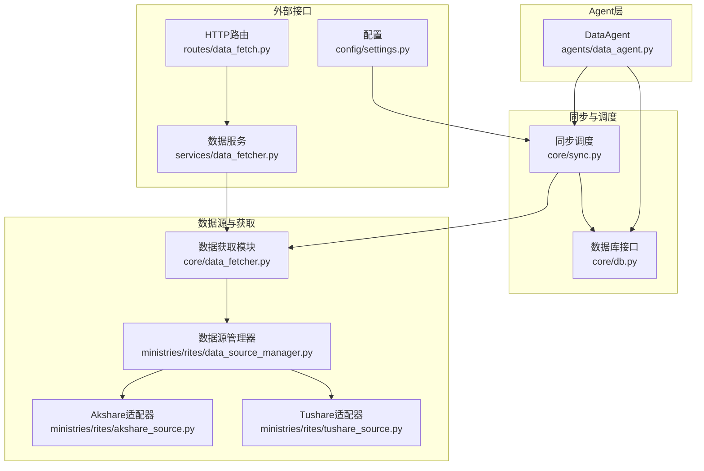
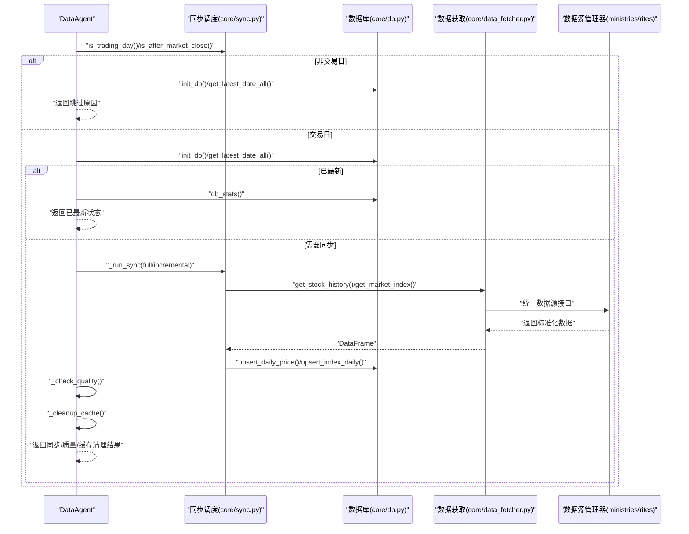
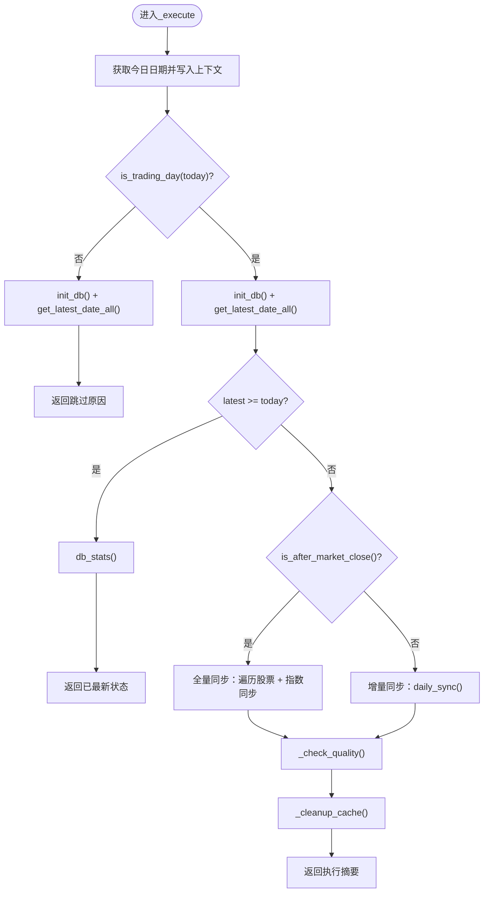
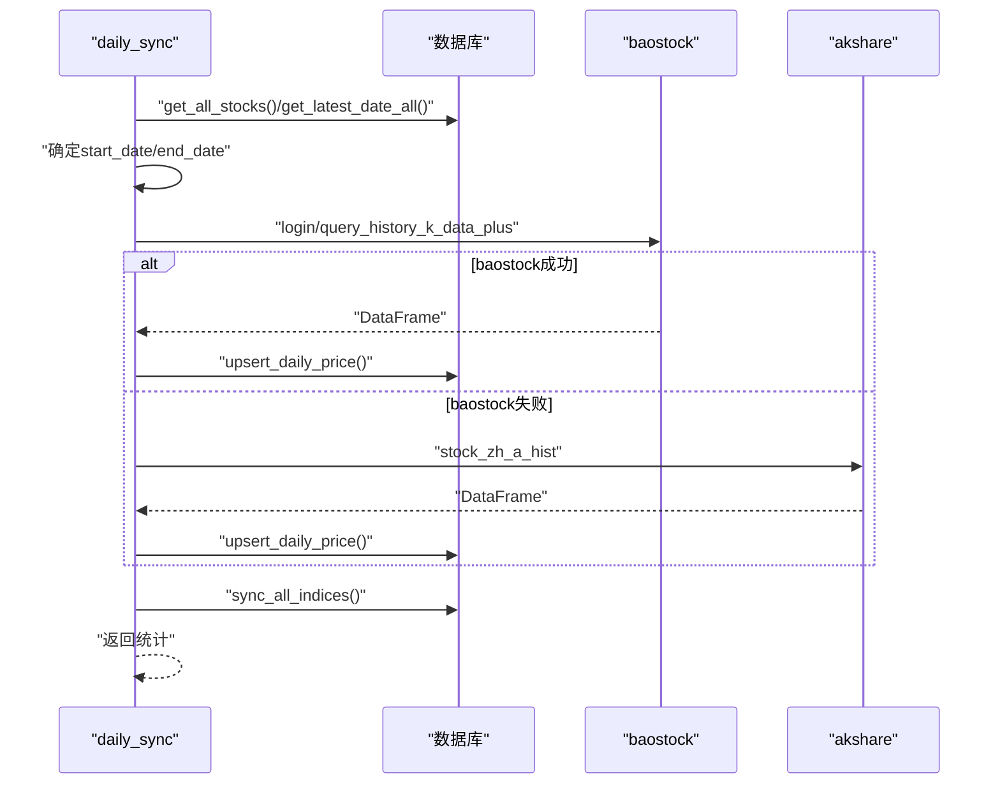
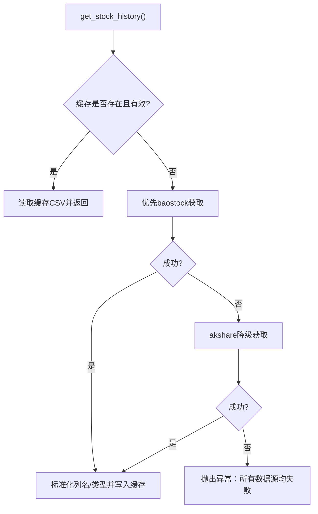
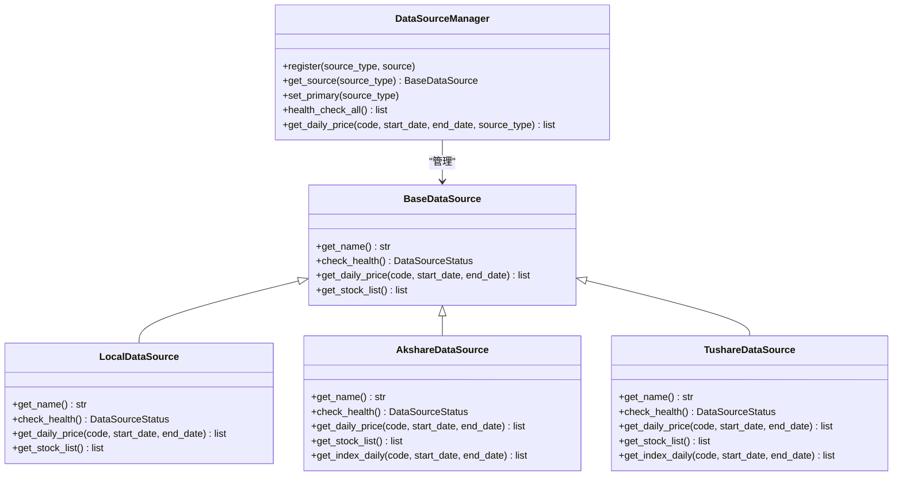
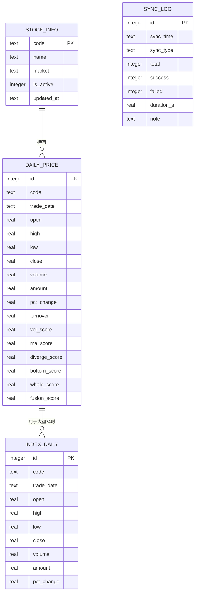
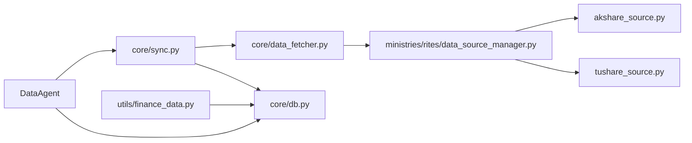

# 数据Agent

<cite>
**本文引用的文件**
- [agents/data_agent.py](file://agents/data_agent.py)
- [core/sync.py](file://core/sync.py)
- [core/data_fetcher.py](file://core/data_fetcher.py)
- [core/db.py](file://core/db.py)
- [ministries/rites/data_source_manager.py](file://ministries/rites/data_source_manager.py)
- [ministries/rites/akshare_source.py](file://ministries/rites/akshare_source.py)
- [ministries/rites/tushare_source.py](file://ministries/rites/tushare_source.py)
- [services/data_fetcher.py](file://services/data_fetcher.py)
- [routes/data_fetch.py](file://routes/data_fetch.py)
- [config/settings.py](file://config/settings.py)
- [utils/finance_data.py](file://utils/finance_data.py)
</cite>

## 目录
1. [简介](#简介)
2. [项目结构](#项目结构)
3. [核心组件](#核心组件)
4. [架构总览](#架构总览)
5. [详细组件分析](#详细组件分析)
6. [依赖分析](#依赖分析)
7. [性能考虑](#性能考虑)
8. [故障排查指南](#故障排查指南)
9. [结论](#结论)
10. [附录](#附录)

## 简介
数据Agent是AIQuant系统中的“数据管家”，负责全市场股票日线行情、指数数据、股票基本信息与市值数据的获取、同步、质量检查与缓存清理。其核心目标包括：
- 交易日判断与跳过逻辑
- 收盘后全量同步与盘中增量同步
- 指数数据同步
- 数据质量检查（缺失率、最新日期校验）
- 旧缓存清理
- 与策略评分的联动更新

数据Agent通过统一的同步调度模块协调多数据源（baostock为主、akshare为备），并写入本地SQLite数据库；同时提供面向策略与回测的财务数据接口。

## 项目结构
围绕数据Agent的关键目录与文件如下：
- agents/data_agent.py：数据Agent主体，封装执行流程与质量检查
- core/sync.py：数据同步调度、交易日判断、指数同步、策略评分写入
- core/data_fetcher.py：底层数据获取（baostock/akshare）、缓存与格式标准化
- core/db.py：SQLite数据库初始化、表结构、读写接口
- ministries/rites/*：数据源管理器与多数据源适配器（akshare、tushare）
- services/data_fetcher.py 与 routes/data_fetch.py：对外HTTP接口与批量拉取服务
- config/settings.py：基础配置（定时任务、API、同步参数）
- utils/finance_data.py：财务数据接口（基于stock_info与daily_price）

**图表来源**
- [agents/data_agent.py:1-167](file://agents/data_agent.py#L1-L167)
- [core/sync.py:1-760](file://core/sync.py#L1-L760)
- [core/data_fetcher.py:1-578](file://core/data_fetcher.py#L1-L578)
- [core/db.py:1-800](file://core/db.py#L1-L800)
- [ministries/rites/data_source_manager.py:1-190](file://ministries/rites/data_source_manager.py#L1-L190)
- [ministries/rites/akshare_source.py:1-135](file://ministries/rites/akshare_source.py#L1-L135)
- [ministries/rites/tushare_source.py:1-167](file://ministries/rites/tushare_source.py#L1-L167)
- [services/data_fetcher.py:1-106](file://services/data_fetcher.py#L1-L106)
- [routes/data_fetch.py:1-82](file://routes/data_fetch.py#L1-L82)
- [config/settings.py:1-25](file://config/settings.py#L1-L25)

**章节来源**
- [agents/data_agent.py:1-167](file://agents/data_agent.py#L1-L167)
- [core/sync.py:1-760](file://core/sync.py#L1-L760)
- [core/data_fetcher.py:1-578](file://core/data_fetcher.py#L1-L578)
- [core/db.py:1-800](file://core/db.py#L1-L800)
- [ministries/rites/data_source_manager.py:1-190](file://ministries/rites/data_source_manager.py#L1-L190)
- [ministries/rites/akshare_source.py:1-135](file://ministries/rites/akshare_source.py#L1-L135)
- [ministries/rites/tushare_source.py:1-167](file://ministries/rites/tushare_source.py#L1-L167)
- [services/data_fetcher.py:1-106](file://services/data_fetcher.py#L1-L106)
- [routes/data_fetch.py:1-82](file://routes/data_fetch.py#L1-L82)
- [config/settings.py:1-25](file://config/settings.py#L1-L25)

## 核心组件
- DataAgent：封装每日执行流程，包括交易日判断、全量/增量同步、质量检查、缓存清理，并输出执行摘要
- 同步调度模块：提供交易日判断、每日增量同步、指数同步、策略评分写入、断点续传与缓存
- 数据获取模块：统一baostock/akshare接口，缓存CSV文件，标准化列名与数据类型
- 数据源管理器：抽象数据源接口，支持本地数据库、akshare、tushare等，自动健康检查与主备切换
- 数据库接口：SQLite建表、索引、upsert、查询与统计
- 财务数据接口：从stock_info与daily_price读取或反推财务指标，提供缓存与降级策略

**章节来源**
- [agents/data_agent.py:25-167](file://agents/data_agent.py#L25-L167)
- [core/sync.py:39-760](file://core/sync.py#L39-L760)
- [core/data_fetcher.py:1-578](file://core/data_fetcher.py#L1-L578)
- [ministries/rites/data_source_manager.py:111-190](file://ministries/rites/data_source_manager.py#L111-L190)
- [core/db.py:57-467](file://core/db.py#L57-L467)
- [utils/finance_data.py:87-262](file://utils/finance_data.py#L87-L262)

## 架构总览
数据Agent的执行流从“交易日判断”开始，依据是否为交易日、是否已最新，决定全量同步或增量同步；同步完成后进行质量检查与缓存清理。数据源采用baostock为主、akshare为备的降级策略，并通过数据源管理器实现统一接口与健康检查。

**图表来源**
- [agents/data_agent.py:31-86](file://agents/data_agent.py#L31-L86)
- [core/sync.py:39-131](file://core/sync.py#L39-L131)
- [core/data_fetcher.py:173-223](file://core/data_fetcher.py#L173-L223)
- [ministries/rites/data_source_manager.py:153-178](file://ministries/rites/data_source_manager.py#L153-L178)

## 详细组件分析

### DataAgent组件
职责与流程
- 交易日判断：若非交易日或节假日，直接返回跳过信息
- 已最新检查：若数据库最新日期等于今日，直接返回已最新状态
- 同步执行：收盘后全量同步，盘中则增量同步
- 质量检查：随机抽样100只股票，检查缺失与最新日期滞后
- 缓存清理：清理超过7天的缓存文件

**图表来源**
- [agents/data_agent.py:31-121](file://agents/data_agent.py#L31-L121)
- [core/sync.py:56-131](file://core/sync.py#L56-L131)

**章节来源**
- [agents/data_agent.py:25-167](file://agents/data_agent.py#L25-L167)

### 同步调度模块
- 交易日判断与收盘后判断：基于外部接口与工作日fallback
- 指数同步：支持主要指数（上证、深成、沪深300、中证500、中证1000）
- 单只股票同步：baostock为主、akshare为备，统一列名与数据类型
- 增量同步：断点续传、缓存文件、覆盖率阈值控制
- 策略评分：对历史全量计算并写入数据库

**图表来源**
- [core/sync.py:462-668](file://core/sync.py#L462-L668)
- [core/data_fetcher.py:173-223](file://core/data_fetcher.py#L173-L223)

**章节来源**
- [core/sync.py:39-760](file://core/sync.py#L39-L760)

### 数据获取模块
- 主数据源：baostock（免费、稳定、无频率限制），统一列名与数据类型
- 备用数据源：akshare（多接口降级），统一列名与索引
- 缓存策略：按日期区间生成缓存文件，命中则直接读取
- 代码格式转换：支持sh/sz/bj前缀与纯数字代码互转

**图表来源**
- [core/data_fetcher.py:173-223](file://core/data_fetcher.py#L173-L223)
- [core/data_fetcher.py:136-167](file://core/data_fetcher.py#L136-L167)

**章节来源**
- [core/data_fetcher.py:1-578](file://core/data_fetcher.py#L1-L578)

### 数据源管理器与适配器
- 抽象基类：统一名称、健康检查、日线与股票列表接口
- 本地数据源：基于本地数据库的stock_info与daily_price
- Akshare适配器：标准化列名与日期格式
- Tushare适配器：基于token认证，标准化列名与指数映射

**图表来源**
- [ministries/rites/data_source_manager.py:48-190](file://ministries/rites/data_source_manager.py#L48-L190)
- [ministries/rites/akshare_source.py:15-135](file://ministries/rites/akshare_source.py#L15-L135)
- [ministries/rites/tushare_source.py:16-167](file://ministries/rites/tushare_source.py#L16-L167)

**章节来源**
- [ministries/rites/data_source_manager.py:1-190](file://ministries/rites/data_source_manager.py#L1-L190)
- [ministries/rites/akshare_source.py:1-135](file://ministries/rites/akshare_source.py#L1-L135)
- [ministries/rites/tushare_source.py:1-167](file://ministries/rites/tushare_source.py#L1-L167)

### 数据库接口
- 初始化：自动建表、索引、迁移（策略评分列、市值字段等）
- 写入：upsert_daily_price、upsert_index_daily、批量更新市值
- 读取：get_daily_price、get_index_daily、get_all_stocks、统计查询
- 日志：sync_log记录每次同步的耗时与结果

**图表来源**
- [core/db.py:57-467](file://core/db.py#L57-L467)

**章节来源**
- [core/db.py:1-800](file://core/db.py#L1-L800)

### 财务数据接口
- 优先从stock_info读取财务字段（总股本、流通股本、EPS、PE_TTM、PB）
- 若字段缺失，提供降级策略：从daily_price的amount/volume反推换手率等
- 内置进程内缓存，避免重复查询

**章节来源**
- [utils/finance_data.py:87-262](file://utils/finance_data.py#L87-L262)

## 依赖分析
- DataAgent依赖同步调度与数据库接口，间接依赖数据获取模块与数据源管理器
- 同步调度模块依赖数据获取模块与数据库接口
- 数据获取模块依赖baostock/akshare与缓存目录
- 数据源管理器依赖具体适配器（akshare/tushare/local）
- 财务数据接口依赖数据库表结构与缓存

**图表来源**
- [agents/data_agent.py:17-22](file://agents/data_agent.py#L17-L22)
- [core/sync.py:16-21](file://core/sync.py#L16-L21)
- [core/data_fetcher.py:12-23](file://core/data_fetcher.py#L12-L23)
- [ministries/rites/data_source_manager.py:114-131](file://ministries/rites/data_source_manager.py#L114-L131)

**章节来源**
- [agents/data_agent.py:17-22](file://agents/data_agent.py#L17-L22)
- [core/sync.py:16-21](file://core/sync.py#L16-L21)
- [core/data_fetcher.py:12-23](file://core/data_fetcher.py#L12-L23)
- [ministries/rites/data_source_manager.py:111-135](file://ministries/rites/data_source_manager.py#L111-L135)

## 性能考虑
- baostock无频率限制，适合全量初始化与批量处理；盘中增量同步采用单线程登录，避免并发问题
- 断点续传与缓存文件减少重复请求，提升增量同步效率
- 数据库采用WAL模式与索引优化，upsert使用ON CONFLICT提升写入吞吐
- 财务数据接口内置缓存，降低重复查询成本
- 建议：在高并发场景下，可考虑将策略评分计算异步化或分批执行

[本节为通用性能建议，无需特定文件引用]

## 故障排查指南
常见问题与定位步骤
- 交易日判断失败：确认网络与外部接口可用性，查看fallback逻辑
- 同步失败：检查baostock登录状态与akshare降级是否生效；查看断点续传缓存文件
- 数据库写入异常：检查表结构与索引是否正确；确认upsert冲突处理
- 财务字段缺失：确认是否已添加列；检查stock_info中对应字段是否填充
- 缓存失效：确认缓存目录权限与文件命名规则；清理旧缓存后重试

**章节来源**
- [core/sync.py:462-668](file://core/sync.py#L462-L668)
- [core/data_fetcher.py:173-223](file://core/data_fetcher.py#L173-L223)
- [core/db.py:57-467](file://core/db.py#L57-L467)
- [utils/finance_data.py:51-81](file://utils/finance_data.py#L51-L81)

## 结论
数据Agent通过清晰的职责划分与稳健的多数据源策略，实现了全市场数据的自动化获取、同步与质量保障。结合断点续传、缓存与健康检查机制，能够在不同网络与业务场景下稳定运行。配合财务数据接口与策略评分写入，为后续回测与风控提供了高质量的基础数据支撑。

[本节为总结性内容，无需特定文件引用]

## 附录

### 数据源配置与数据格式标准化
- 数据源类型：LOCAL、AKSHARE、TUSHARE、BAOSTOCK、YFINANCE、LOCAL
- 数据格式：统一列名（date/open/high/low/close/volume/amount/pct_change/turnover），索引为日期
- 代码格式：支持sh/sz/bj前缀与纯数字代码互转
- 指数代码：支持baostock与akshare两种格式

**章节来源**
- [ministries/rites/data_source_manager.py:18-46](file://ministries/rites/data_source_manager.py#L18-L46)
- [core/data_fetcher.py:50-72](file://core/data_fetcher.py#L50-L72)
- [core/data_fetcher.py:371-423](file://core/data_fetcher.py#L371-L423)

### 数据完整性验证与更新频率控制
- 完整性验证：随机抽样检查缺失与最新日期滞后
- 更新频率：交易日收盘后全量，盘中增量；指数每日同步
- 覆盖率阈值：增量同步可根据覆盖率阈值调整同步范围

**章节来源**
- [agents/data_agent.py:122-157](file://agents/data_agent.py#L122-L157)
- [core/sync.py:462-668](file://core/sync.py#L462-L668)

### 配置选项与性能优化
- 定时任务时间：SCHEDULE_SYNC_TIME、SCHEDULE_SCAN_TIME
- 同步批大小与详细程度：SYNC_BATCH_SIZE、SYNC_VERBOSE
- API主机与端口：API_HOST、API_PORT
- 性能优化建议：合理设置批大小、启用断点续传、使用索引查询、缓存策略

**章节来源**
- [config/settings.py:15-25](file://config/settings.py#L15-L25)
- [core/sync.py:31-35](file://core/sync.py#L31-L35)

### 与其他Agent的数据依赖关系
- DataAgent为上游数据提供者，为SignalAgent、RiskAgent、BacktestAgent等提供基础数据
- 与Orchestrator协作，按治理角色调度各Agent执行
- 财务数据接口为AI模型与特征工程提供基础字段

[本节为概念性说明，无需特定文件引用]