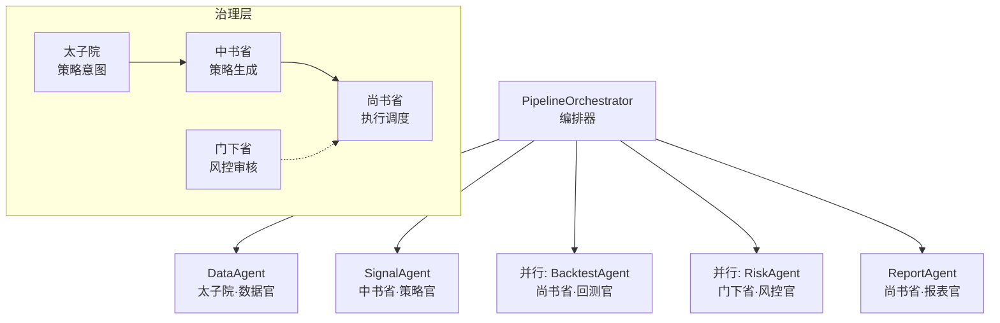
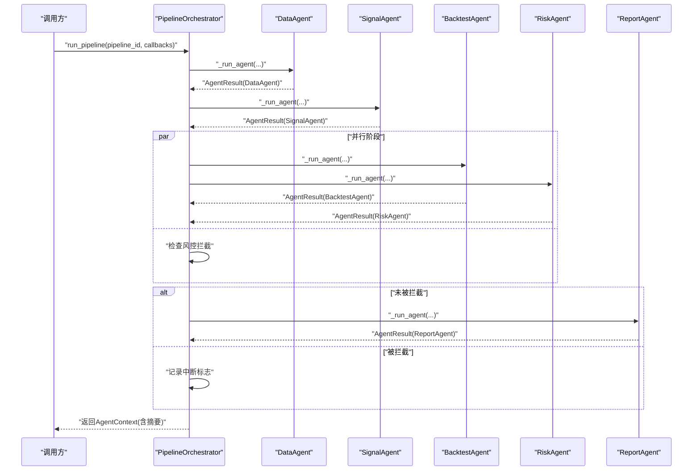
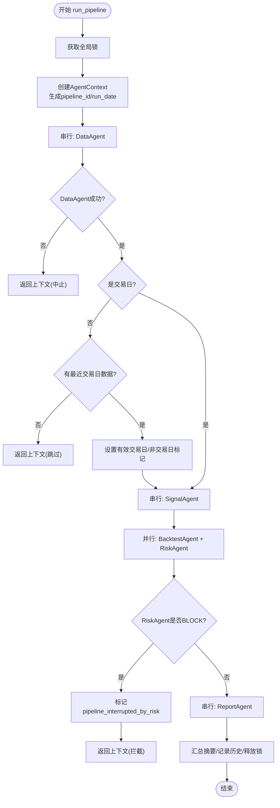
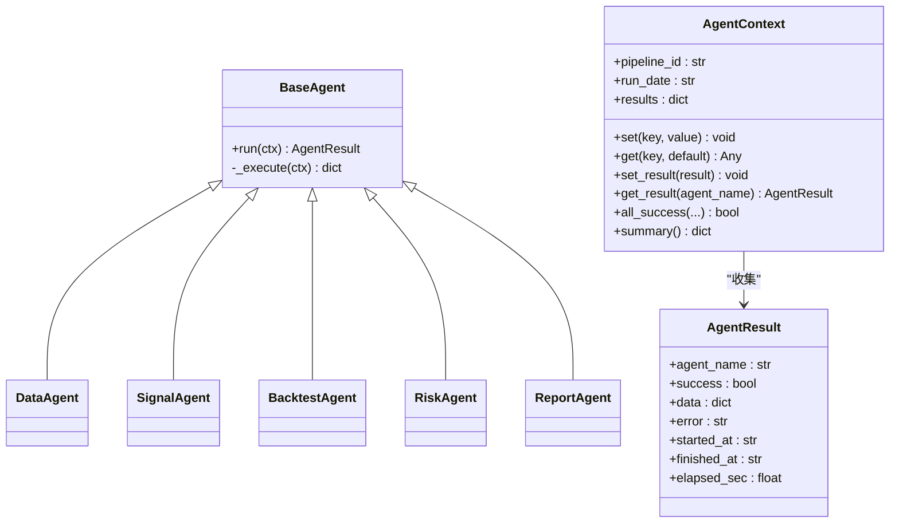
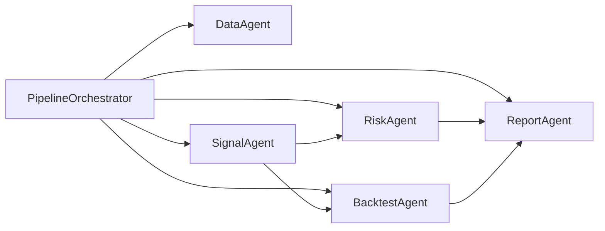

# 编排器核心

<cite>
**本文引用的文件**
- [agents/orchestrator.py](file://agents/orchestrator.py)
- [agents/base.py](file://agents/base.py)
- [agents/data_agent.py](file://agents/data_agent.py)
- [agents/signal_agent.py](file://agents/signal_agent.py)
- [agents/backtest_agent.py](file://agents/backtest_agent.py)
- [agents/risk_agent.py](file://agents/risk_agent.py)
- [agents/report_agent.py](file://agents/report_agent.py)
- [governance/__init__.py](file://governance/__init__.py)
- [governance/chancellery/__init__.py](file://governance/chancellery/__init__.py)
- [governance/chancellery/scoring_engine.py](file://governance/chancellery/scoring_engine.py)
- [governance/chancellery/strategy_engine.py](file://governance/chancellery/strategy_engine.py)
- [governance/crown_prince/__init__.py](file://governance/crown_prince/__init__.py)
- [governance/crown_prince/decision_engine.py](file://governance/crown_prince/decision_engine.py)
- [governance/secretariat/__init__.py](file://governance/secretariat/__init__.py)
- [governance/secretariat/execution_engine.py](file://governance/secretariat/execution_engine.py)
</cite>

## 目录
1. [引言](#引言)
2. [项目结构](#项目结构)
3. [核心组件](#核心组件)
4. [架构总览](#架构总览)
5. [详细组件分析](#详细组件分析)
6. [依赖分析](#依赖分析)
7. [性能考虑](#性能考虑)
8. [故障排查指南](#故障排查指南)
9. [结论](#结论)
10. [附录](#附录)

## 引言
本文件面向AIQuant编排器核心，系统化阐述PipelineOrchestrator的架构设计、流水线执行机制、并行处理策略与状态管理。重点解释“三省六部制”执行流程、Agent之间的依赖关系、错误处理与重试机制、流水线生命周期管理、并发控制、资源调度与性能监控，并提供配置选项、扩展机制与调试工具说明，以及与各Agent的协调机制与数据流转控制。

## 项目结构
AIQuant采用“三省六部制”的治理与执行架构，将策略意图、策略生成、风控审核与执行调度分层解耦。编排器位于顶层，负责组织各Agent的串并行执行、状态持久化与历史记录管理。

图表来源
- [agents/orchestrator.py:36-175](file://agents/orchestrator.py#L36-L175)
- [agents/data_agent.py:25-86](file://agents/data_agent.py#L25-L86)
- [agents/signal_agent.py:41-108](file://agents/signal_agent.py#L41-L108)
- [agents/backtest_agent.py:31-68](file://agents/backtest_agent.py#L31-L68)
- [agents/risk_agent.py:25-96](file://agents/risk_agent.py#L25-L96)
- [agents/report_agent.py:20-90](file://agents/report_agent.py#L20-L90)

章节来源
- [governance/__init__.py:1-10](file://governance/__init__.py#L1-L10)
- [governance/crown_prince/__init__.py:1-10](file://governance/crown_prince/__init__.py#L1-L10)
- [governance/chancellery/__init__.py:1-10](file://governance/chancellery/__init__.py#L1-L10)
- [governance/secretariat/__init__.py:1-11](file://governance/secretariat/__init__.py#L1-L11)

## 核心组件
- PipelineOrchestrator：三省六部制流水线编排器，负责串并行调度、状态管理、历史记录与全局锁控制。
- AgentContext/AgentResult：流水线共享上下文与结果容器，统一记录执行时间、异常与耗时。
- 各Agent：DataAgent、SignalAgent、BacktestAgent、RiskAgent、ReportAgent，分别对应三省六部职责。

章节来源
- [agents/orchestrator.py:36-263](file://agents/orchestrator.py#L36-L263)
- [agents/base.py:20-120](file://agents/base.py#L20-L120)

## 架构总览
编排器以“三省六部制”为执行蓝图，严格定义依赖与拦截点：
- 太子院·数据官（串行，前置依赖）：负责交易日判断、数据同步、质量检查与缓存清理。
- 中书省·策略官（串行，依赖数据）：运行多策略融合扫描，生成候选列表。
- 门下省·风控官 + 尚书省·回测官（并行）：并行执行风控与回测，风控结果作为一票否决点。
- 尚书省·报表官（串行，依赖全部）：整合上游输出，生成报告与微信推送。

图表来源
- [agents/orchestrator.py:81-175](file://agents/orchestrator.py#L81-L175)
- [agents/data_agent.py:31-86](file://agents/data_agent.py#L31-L86)
- [agents/signal_agent.py:47-108](file://agents/signal_agent.py#L47-L108)
- [agents/backtest_agent.py:37-68](file://agents/backtest_agent.py#L37-L68)
- [agents/risk_agent.py:31-96](file://agents/risk_agent.py#L31-L96)
- [agents/report_agent.py:63-90](file://agents/report_agent.py#L63-L90)

## 详细组件分析

### PipelineOrchestrator（编排器）
- 线程安全：使用全局锁防止并发重复执行；运行状态字段确保幂等。
- Agent注册表：延迟导入各Agent类，避免外部依赖缺失导致启动失败。
- 生命周期管理：
  - run_pipeline：生成流水线ID与上下文，串并行执行，最终汇总摘要、记录历史并释放锁。
  - run_single：单Agent快捷执行，便于调试。
- 并行策略：_run_parallel通过多线程并行启动多个Agent，统一等待完成。
- 状态查询：is_running、get_current_status、get_history，支持API查询。
- 非交易日处理：若数据源提示非交易日且无历史数据则跳过后续阶段；若有历史数据则使用最近交易日数据继续执行。
- 风控拦截：门下省一票否决，若RiskAgent返回BLOCK级别，则跳过ReportAgent并在上下文中记录中断标志。

图表来源
- [agents/orchestrator.py:81-175](file://agents/orchestrator.py#L81-L175)

章节来源
- [agents/orchestrator.py:36-263](file://agents/orchestrator.py#L36-L263)

### Agent基类与上下文
- BaseAgent：统一run入口，自动计时、捕获异常、封装结果并写入上下文。
- AgentResult：标准化结果结构，包含成功标志、数据、错误、起止时间与耗时。
- AgentContext：共享存储与结果集合，提供set/get、set_result/get_result、all_success与summary方法，支持流水线摘要生成。

图表来源
- [agents/base.py:20-120](file://agents/base.py#L20-L120)

章节来源
- [agents/base.py:20-120](file://agents/base.py#L20-L120)

### DataAgent（太子院·数据官）
- 交易日判断：非交易日返回最近交易日数据提示，避免后续阶段执行。
- 数据同步：收盘后全量同步或盘中增量同步，支持策略评分同步。
- 质量检查：抽样检查缺失与陈旧，输出健康度指标。
- 缓存清理：定期清理旧缓存文件。

章节来源
- [agents/data_agent.py:25-167](file://agents/data_agent.py#L25-L167)

### SignalAgent（中书省·策略官）
- 多策略融合扫描：对全市场股票运行5策略融合与v4超跌反弹策略，生成候选列表。
- 排序与截断：按评分排序并限制数量，同时保存至数据库供面板展示。
- 上下文写入：将融合与v4候选写入上下文，供下游Agent使用。

章节来源
- [agents/signal_agent.py:41-213](file://agents/signal_agent.py#L41-L213)

### BacktestAgent（尚书省·回测官）
- 快速历史回测：对候选股执行近90天回测，统计胜率、平均收益与最大回撤等指标。
- 上下文写入：将回测报告写入上下文，供报表阶段整合。

章节来源
- [agents/backtest_agent.py:31-181](file://agents/backtest_agent.py#L31-L181)

### RiskAgent（门下省·风控官）
- 大盘风险评估：沪深300趋势与回撤评估。
- 波动率评估：基于涨跌幅的标准差估算年化波动率。
- 个股风险筛查：连续涨停、放量大跌、接近20日低点、RSI超买等风险标记。
- 仓位建议：基于趋势、波动率与回撤给出建议仓位与最大持仓数。
- 系统化风控：调用风险引擎进行规则检查，支持BLOCK级拦截，并在上下文中记录拦截原因。

章节来源
- [agents/risk_agent.py:25-262](file://agents/risk_agent.py#L25-L262)

### ReportAgent（尚书省·报表官）
- 数据整合：合并Signal、Backtest、Risk输出，去重并排序。
- 报告生成：生成HTML与JSON报告，构建微信推送文本。
- 风控摘要：输出市场趋势、波动率、总体风险与建议仓位。

章节来源
- [agents/report_agent.py:20-393](file://agents/report_agent.py#L20-L393)

### 三省六部制与治理层
- 太子院：策略意图与执行计划生成，动态调整权重与风险偏好。
- 中书省：策略生成与信号发现，多因子评分与信号输出。
- 门下省：风控审核与合规检查，一票否决拦截。
- 尚书省：执行调度与订单管理，汇报执行结果。

章节来源
- [governance/crown_prince/decision_engine.py:61-145](file://governance/crown_prince/decision_engine.py#L61-L145)
- [governance/chancellery/scoring_engine.py:246-370](file://governance/chancellery/scoring_engine.py#L246-L370)
- [governance/chancellery/strategy_engine.py:32-103](file://governance/chancellery/strategy_engine.py#L32-L103)
- [governance/secretariat/execution_engine.py:57-183](file://governance/secretariat/execution_engine.py#L57-L183)

## 依赖分析
- 编排器对Agent采用延迟导入，降低启动时对外部依赖的耦合。
- Agent之间通过AgentContext进行数据传递，形成清晰的单向依赖链。
- 并行阶段仅限BacktestAgent与RiskAgent，受风控拦截点约束，保证整体安全性。
- 治理层与执行层分离，策略意图与执行细节解耦，便于扩展与替换。

图表来源
- [agents/orchestrator.py:46-52](file://agents/orchestrator.py#L46-L52)
- [agents/data_agent.py:25-86](file://agents/data_agent.py#L25-L86)
- [agents/signal_agent.py:41-108](file://agents/signal_agent.py#L41-L108)
- [agents/backtest_agent.py:31-68](file://agents/backtest_agent.py#L31-L68)
- [agents/risk_agent.py:25-96](file://agents/risk_agent.py#L25-L96)
- [agents/report_agent.py:20-90](file://agents/report_agent.py#L20-L90)

章节来源
- [agents/orchestrator.py:46-52](file://agents/orchestrator.py#L46-L52)

## 性能考虑
- 并发控制：并行阶段使用多线程，线程数等于并行Agent数量；可通过调整并行策略减少竞争与资源争用。
- I/O密集优化：数据同步与回测阶段可能涉及大量磁盘与网络I/O，建议结合缓存与批处理策略。
- 上下文访问：通过上下文键值访问避免跨模块耦合，减少重复计算。
- 资源调度：在高负载场景下，可引入线程池大小限制与队列排队策略，避免过度并发导致系统抖动。
- 监控与可观测性：利用AgentResult中的耗时与错误字段，结合历史记录进行性能画像与异常定位。

## 故障排查指南
- 并发冲突：确认编排器未重复运行，检查is_running与全局锁状态。
- Agent异常：查看AgentResult.error字段，结合BaseAgent的异常捕获定位问题。
- 风控拦截：若流水线提前结束，检查RiskAgent的拦截原因与上下文中的中断标志。
- 非交易日：确认DataAgent返回的最近交易日数据是否正确注入上下文。
- 历史记录：通过get_history(limit)获取最近执行摘要，核对各Agent耗时与成功率。

章节来源
- [agents/orchestrator.py:64-76](file://agents/orchestrator.py#L64-L76)
- [agents/base.py:93-114](file://agents/base.py#L93-L114)
- [agents/risk_agent.py:63-67](file://agents/risk_agent.py#L63-L67)

## 结论
PipelineOrchestrator以“三省六部制”为核心，实现了清晰的职责划分与严格的依赖控制。通过串并行混合执行、状态持久化与风控拦截机制，保障了流水线的安全与高效。结合治理层的策略意图与执行计划，系统具备良好的扩展性与可维护性。建议在生产环境中进一步完善并发上限、资源配额与监控告警，以提升稳定性与可观测性。

## 附录
- 配置选项
  - 流水线ID与运行日期：由编排器自动生成或传入。
  - 回调钩子：on_agent_start/on_agent_finish，便于外部观察Agent生命周期。
  - 风控拦截：RiskAgent返回BLOCK级别时自动终止后续阶段。
- 扩展机制
  - 新增Agent：在编排器注册表中添加模块与类名映射，遵循BaseAgent接口。
  - 修改执行顺序：调整run_pipeline中的阶段顺序与并行组合。
  - 替换策略引擎：中书省策略引擎与多因子评分引擎可独立替换与扩展。
- 调试工具
  - run_single：单独执行某Agent，便于定位问题。
  - get_current_status/get_history：实时查询当前状态与历史摘要。
  - 日志输出：编排器打印每个Agent的启动、完成与耗时信息。

章节来源
- [agents/orchestrator.py:81-92](file://agents/orchestrator.py#L81-L92)
- [agents/orchestrator.py:244-250](file://agents/orchestrator.py#L244-L250)
- [agents/base.py:93-114](file://agents/base.py#L93-L114)