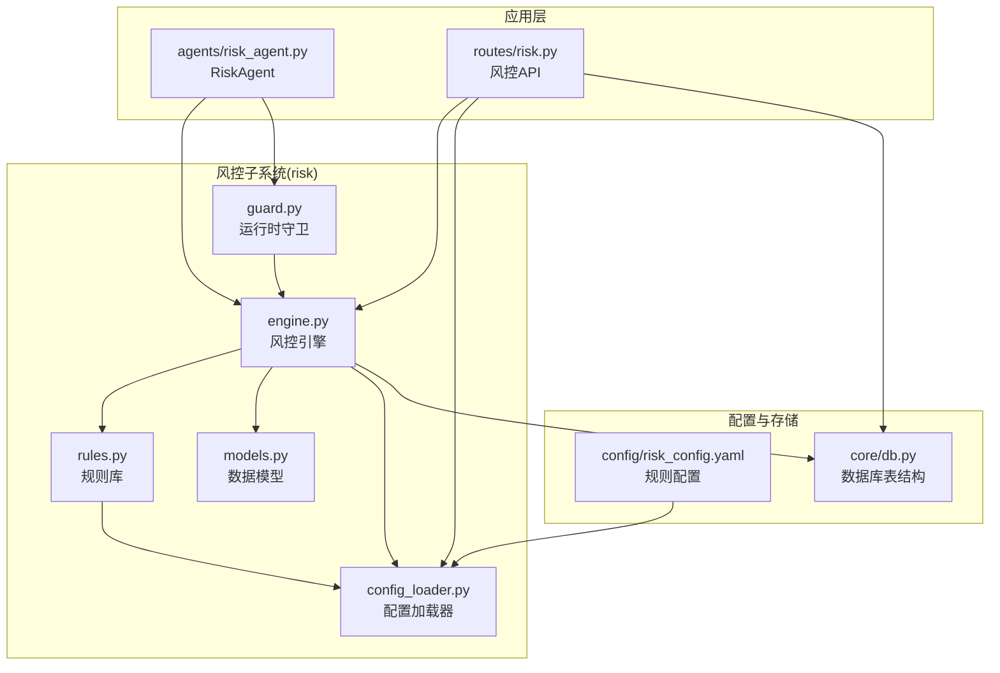
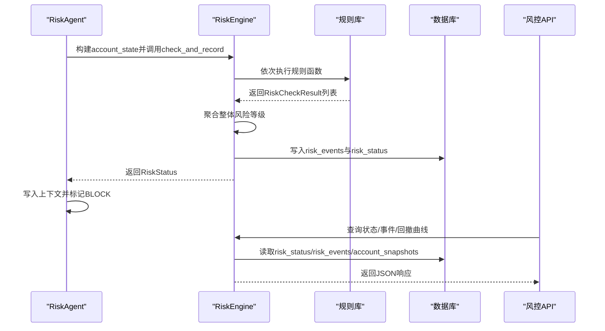
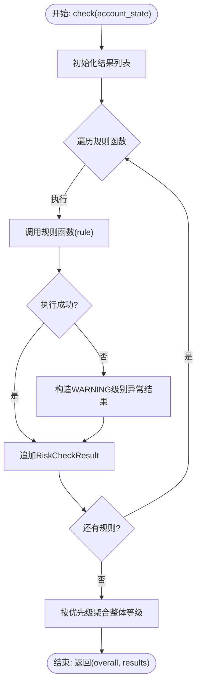
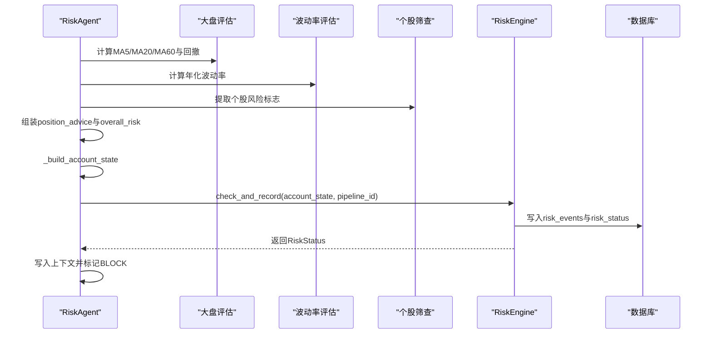
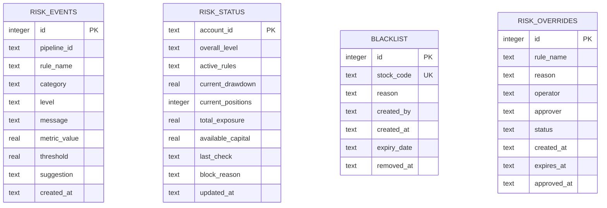
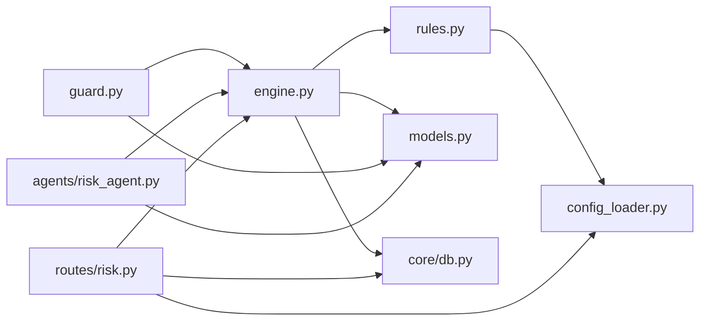

# 风控Agent

<cite>
**本文档引用的文件**
- [risk/engine.py](file://risk/engine.py)
- [risk/guard.py](file://risk/guard.py)
- [risk/rules.py](file://risk/rules.py)
- [risk/models.py](file://risk/models.py)
- [risk/config_loader.py](file://risk/config_loader.py)
- [agents/risk_agent.py](file://agents/risk_agent.py)
- [routes/risk.py](file://routes/risk.py)
- [config/risk_config.yaml](file://config/risk_config.yaml)
- [core/db.py](file://core/db.py)
</cite>

## 目录
1. [简介](#简介)
2. [项目结构](#项目结构)
3. [核心组件](#核心组件)
4. [架构概览](#架构概览)
5. [详细组件分析](#详细组件分析)
6. [依赖分析](#依赖分析)
7. [性能考量](#性能考量)
8. [故障排查指南](#故障排查指南)
9. [结论](#结论)
10. [附录](#附录)

## 简介
本文件面向AIQuant风控Agent，系统性阐述其核心职责与实现：风险规则检查、风险状态评估、风险拦截机制与风控事件记录；详解风控规则配置、风险阈值设定、风险等级划分与风险缓解策略；覆盖实时风险监控、批量风险检查、风险预警机制与风控策略调整；并说明与风险控制系统及流水线编排的关系。目标是帮助技术与非技术读者全面理解风控Agent的设计与运行机制。

## 项目结构
风控Agent位于risk子系统，并与agents、routes、config等模块协同工作：
- risk子系统：规则定义、引擎、守卫、配置加载、数据模型
- agents：业务Agent层，RiskAgent负责整合风控与市场分析
- routes：对外暴露风控API，支持状态查询、事件查询、手动检查、配置热加载、黑名单与豁免管理
- config：YAML配置文件，支持热加载
- core/db：数据库表结构，存储风控事件、状态、黑名单、豁免等

图表来源
- [risk/engine.py:13-168](file://risk/engine.py#L13-L168)
- [risk/guard.py:36-92](file://risk/guard.py#L36-L92)
- [risk/rules.py:376-388](file://risk/rules.py#L376-L388)
- [risk/config_loader.py:20-131](file://risk/config_loader.py#L20-L131)
- [agents/risk_agent.py:25-262](file://agents/risk_agent.py#L25-L262)
- [routes/risk.py:26-298](file://routes/risk.py#L26-L298)
- [config/risk_config.yaml:1-170](file://config/risk_config.yaml#L1-L170)
- [core/db.py:358-414](file://core/db.py#L358-L414)

章节来源
- [risk/engine.py:13-168](file://risk/engine.py#L13-L168)
- [agents/risk_agent.py:25-262](file://agents/risk_agent.py#L25-L262)
- [routes/risk.py:26-298](file://routes/risk.py#L26-L298)
- [config/risk_config.yaml:1-170](file://config/risk_config.yaml#L1-L170)
- [core/db.py:358-414](file://core/db.py#L358-L414)

## 核心组件
- 风控引擎（RiskEngine）：执行规则检查、聚合风险等级、持久化风控事件与状态、查询最新状态与最近事件
- 风控规则库（rules.py）：内置多条规则，从配置文件读取阈值与消息模板，支持热加载
- 风控守卫（guard.py）：装饰器与直接检查接口，封装风控拦截逻辑
- 风控数据模型（models.py）：定义风险等级、类别、检查结果与状态快照
- 配置加载器（config_loader.py）：YAML配置热加载，提供规则开关、阈值、消息与建议
- RiskAgent（agents/risk_agent.py）：整合大盘趋势、波动率、个股筛查、系统化风控检查，并将结果写入上下文
- 风控API（routes/risk.py）：提供状态查询、事件查询、手动检查、配置热加载、黑名单与豁免管理
- 数据库表（core/db.py）：risk_events、risk_status、blacklist、risk_overrides

章节来源
- [risk/engine.py:13-168](file://risk/engine.py#L13-L168)
- [risk/rules.py:30-388](file://risk/rules.py#L30-L388)
- [risk/guard.py:36-92](file://risk/guard.py#L36-L92)
- [risk/models.py:11-78](file://risk/models.py#L11-L78)
- [risk/config_loader.py:20-131](file://risk/config_loader.py#L20-L131)
- [agents/risk_agent.py:25-262](file://agents/risk_agent.py#L25-L262)
- [routes/risk.py:26-298](file://routes/risk.py#L26-L298)
- [core/db.py:358-414](file://core/db.py#L358-L414)

## 架构概览
风控Agent采用“规则驱动 + 引擎调度 + 守卫拦截 + API对外”的分层设计。RiskAgent在流水线中负责系统化风控检查并将结果注入上下文，供Orchestrator与其他Agent使用。风控API提供外部可观测性与运维能力。

图表来源
- [agents/risk_agent.py:52-96](file://agents/risk_agent.py#L52-L96)
- [risk/engine.py:51-168](file://risk/engine.py#L51-L168)
- [risk/rules.py:34-388](file://risk/rules.py#L34-L388)
- [routes/risk.py:31-298](file://routes/risk.py#L31-L298)
- [core/db.py:358-414](file://core/db.py#L358-L414)

## 详细组件分析

### 风控引擎（RiskEngine）
- 职责
  - 执行规则集合，返回整体风险等级与明细结果
  - 将检查结果与状态持久化到数据库
  - 提供查询最新状态与最近事件的能力
- 关键行为
  - check：遍历规则，捕获异常并生成警告级别结果
  - check_and_record：聚合整体等级，构造RiskStatus并写入数据库
  - _save_results/_save_status：分别写入风险事件与状态快照
  - get_latest_status/get_recent_events：查询接口
- 风险等级聚合
  - 优先级：BLOCK > RESTRICT > WARNING > PASS
  - 选择最严格的风险等级作为整体等级

图表来源
- [risk/engine.py:19-49](file://risk/engine.py#L19-L49)

章节来源
- [risk/engine.py:13-168](file://risk/engine.py#L13-L168)

### 风控规则库（rules.py）
- 规则类型与阈值来源
  - 所有规则阈值与消息模板来自risk_config.yaml，支持热加载
  - 规则函数签名：rule_name(account_state: dict) -> RiskCheckResult
- 规则清单（默认启用）
  - 最大回撤限制（drawdown）
  - 单股集中度限制（concentration）
  - 大盘择时（MA5/MA20）（market_timing）
  - 连续亏损冷却期（cooldown）
  - 日交易频率限制（position_limit）
  - 个股波动率限制（volatility）
  - 行业集中度限制（concentration）
  - 总仓位限制（position_limit）
  - 节假日/周末持仓提醒（market_timing）
  - 黑名单检查（blacklist）
- 风险等级与建议
  - 每条规则返回对应等级（PASS/WARNING/RESTRICT/BLOCK），并附带指标值、阈值、消息与建议
  - 配置层提供消息模板与建议文本，便于本地化与定制

章节来源
- [risk/rules.py:30-388](file://risk/rules.py#L30-L388)
- [config/risk_config.yaml:1-170](file://config/risk_config.yaml#L1-L170)

### 风控守卫（guard.py）
- 职责
  - 装饰器形式：对被装饰函数进行风控前置检查，若整体等级为BLOCK则直接拦截
  - 直接调用：check_risk(account_state, pipeline_id)返回检查结果字典
  - 构建账户状态：build_account_state从上下文/参数组装account_state
- 拦截逻辑
  - 整体等级为BLOCK时，返回success=False并携带block原因
  - 否则执行原函数，并在返回字典中注入risk_check详情

章节来源
- [risk/guard.py:36-92](file://risk/guard.py#L36-L92)

### 风控数据模型（models.py）
- 风险等级（RiskLevel）：pass、warning、restrict、block
- 风险类别（RiskCategory）：drawdown、concentration、volatility、market_timing、position_limit、cooldown、blacklist
- 数据结构
  - RiskCheckResult：规则检查结果，含等级、类别、规则名、消息、指标值、阈值、时间戳、建议
  - RiskStatus：账户风控状态快照，含整体等级、活跃规则、回撤、持仓数量、总敞口、可用资金、最后检查时间、阻断原因

章节来源
- [risk/models.py:11-78](file://risk/models.py#L11-L78)

### 配置加载器（config_loader.py）
- 功能
  - 单例模式，支持YAML配置热加载（自动检测文件修改）
  - 提供规则开关、阈值、消息模板、建议文本的读取接口
- 接口要点
  - get_rule_config(rule_name)：获取规则完整配置
  - is_rule_enabled(rule_name)：检查规则是否启用
  - get_threshold(rule_name, level)：获取指定等级阈值
  - get_message/get_suggestion：格式化消息与建议
- 热加载机制
  - 访问属性时自动检测mtime变化并reload

章节来源
- [risk/config_loader.py:20-131](file://risk/config_loader.py#L20-L131)

### RiskAgent（agents/risk_agent.py）
- 职责
  - 大盘风险评估（沪深300 MA5/MA20/MA60趋势、最大回撤）
  - 波动率评估（VIX近似：涨跌幅标准差）
  - 个股风险筛查（近期是否ST、退市风险、停牌等）
  - 仓位建议（基于大盘环境）
  - 系统化风控检查（接入risk/模块）
  - 若被BLOCK，在上下文中标记，供Orchestrator拦截
- 关键流程
  - _assess_market/_assess_volatility：计算趋势与波动率
  - _screen_stocks：个股风险标志提取
  - _position_advice：基于趋势、波动率与回撤给出建议仓位
  - _build_account_state：从上下文与市场评估构建account_state
  - 调用RiskEngine.check_and_record并写入上下文

图表来源
- [agents/risk_agent.py:31-96](file://agents/risk_agent.py#L31-L96)
- [risk/engine.py:51-71](file://risk/engine.py#L51-L71)

章节来源
- [agents/risk_agent.py:25-262](file://agents/risk_agent.py#L25-L262)

### 风控API（routes/risk.py）
- 路由
  - GET /api/risk/status：获取当前风控状态
  - GET /api/risk/events：获取最近风控事件（支持limit与level过滤）
  - POST /api/risk/check：手动触发风控检查
  - GET /api/risk/config：获取当前风控配置
  - POST /api/risk/config/reload：热加载风控配置
  - GET/POST /api/risk/blacklist：黑名单列表与增删
  - POST /api/risk/override：申请风控豁免
  - GET /api/risk/overrides：豁免记录
  - POST /api/risk/override/<id>/approve：审批豁免
  - GET /api/risk/drawdown：账户资产回撤曲线（基于account_snapshots）
- 数据持久化
  - 使用core.db访问数据库，读写risk_events、risk_status、blacklist、risk_overrides

章节来源
- [routes/risk.py:26-298](file://routes/risk.py#L26-L298)

### 数据模型与数据库表
- 风控事件表（risk_events）
  - 字段：pipeline_id、rule_name、category、level、message、metric_value、threshold、suggestion、created_at
  - 索引：按时间降序、按等级
- 风控状态表（risk_status）
  - 字段：account_id（主键）、overall_level、active_rules、current_drawdown、current_positions、total_exposure、available_capital、last_check、block_reason、updated_at
- 黑名单表（blacklist）
  - 字段：stock_code（唯一）、reason、created_by、created_at、expiry_date、removed_at
- 豁免表（risk_overrides）
  - 字段：rule_name、reason、operator、approver、status、created_at、expires_at、approved_at
  - 索引：status、expires_at

图表来源
- [core/db.py:358-414](file://core/db.py#L358-L414)

章节来源
- [core/db.py:358-414](file://core/db.py#L358-L414)

## 依赖分析
- 组件耦合
  - RiskEngine依赖RiskCheckResult/RiskLevel/RiskStatus、DEFAULT_RULES、RiskConfig
  - RiskAgent依赖RiskEngine、RiskLevel、市场数据接口
  - routes/risk依赖RiskEngine、RiskConfig、数据库接口
  - rules依赖RiskConfig与RiskCheckResult
- 外部依赖
  - 配置文件：config/risk_config.yaml
  - 数据库：SQLite（通过core.db连接）
- 循环依赖
  - 未发现循环依赖

图表来源
- [risk/engine.py:8-10](file://risk/engine.py#L8-L10)
- [risk/rules.py:10-11](file://risk/rules.py#L10-L11)
- [risk/guard.py:11-12](file://risk/guard.py#L11-L12)
- [agents/risk_agent.py:20-22](file://agents/risk_agent.py#L20-L22)
- [routes/risk.py:21-24](file://routes/risk.py#L21-L24)
- [core/db.py:358-414](file://core/db.py#L358-L414)

章节来源
- [risk/engine.py:8-10](file://risk/engine.py#L8-L10)
- [risk/rules.py:10-11](file://risk/rules.py#L10-L11)
- [risk/guard.py:11-12](file://risk/guard.py#L11-L12)
- [agents/risk_agent.py:20-22](file://agents/risk_agent.py#L20-L22)
- [routes/risk.py:21-24](file://routes/risk.py#L21-L24)
- [core/db.py:358-414](file://core/db.py#L358-L414)

## 性能考量
- 规则执行
  - 风控引擎顺序执行规则，异常被捕获并记录为警告级别，避免单规则异常影响整体
  - 聚合策略为最严格等级，确保风险不被低估
- 数据库写入
  - check_and_record在一次事务内写入risk_events与risk_status，保证一致性
  - 查询接口使用索引（按时间降序、按等级），提升检索效率
- 配置热加载
  - RiskConfig在访问属性时检测文件mtime，避免频繁I/O
- API查询
  - events接口支持limit与level过滤，drawdown接口限制天数，避免大数据集扫描
- 建议优化
  - 对高频规则可考虑缓存中间计算结果（如MA序列）
  - 批量写入时合并SQL语句，减少往返
  - 对黑名单查询可增加内存缓存与定期刷新

[本节为通用性能讨论，不直接分析具体文件，故无章节来源]

## 故障排查指南
- 风控拦截
  - 现象：函数被装饰器拦截，返回blocked=True
  - 排查：查看risk_check.details，定位触发规则与阈值
  - 处理：根据建议调整策略或等待冷却期
- 配置问题
  - 现象：规则未生效或阈值不生效
  - 排查：确认risk_config.yaml存在且格式正确；调用POST /api/risk/config/reload热加载
  - 处理：修复配置后重载
- 数据库异常
  - 现象：风控事件或状态写入失败
  - 排查：检查数据库连接与表结构；查看控制台打印的错误信息
  - 处理：修复数据库权限与表结构
- API查询异常
  - 现象：状态或事件查询返回空或报错
  - 排查：确认数据库中存在对应记录；检查参数（如limit、level、days）
  - 处理：调整查询参数或检查数据源

章节来源
- [risk/engine.py:73-127](file://risk/engine.py#L73-L127)
- [routes/risk.py:96-107](file://routes/risk.py#L96-L107)
- [routes/risk.py:246-298](file://routes/risk.py#L246-L298)

## 结论
风控Agent通过“规则驱动 + 引擎调度 + 守卫拦截 + API可观测”的架构，实现了从规则配置到实时拦截再到事件记录的闭环。RiskAgent在流水线中承担系统化风控检查职责，将风控状态写入上下文，支撑上层编排决策。配合热加载配置、完善的数据库表与API接口，风控Agent具备良好的可运维性与扩展性。

[本节为总结性内容，不直接分析具体文件，故无章节来源]

## 附录

### 风控规则配置要点
- 风险等级划分
  - PASS：通过
  - WARNING：预警
  - RESTRICT：限制
  - BLOCK：禁止
- 阈值与消息
  - 阈值与消息模板均来自risk_config.yaml，支持热加载
  - 不同等级的消息与建议可本地化定制
- 风险缓解策略
  - 建议文本用于指导用户采取行动（如减仓、暂停交易、等待冷却）

章节来源
- [config/risk_config.yaml:1-170](file://config/risk_config.yaml#L1-L170)
- [risk/models.py:11-26](file://risk/models.py#L11-L26)

### 风控事件记录与状态快照
- 事件记录
  - 包含规则名、类别、等级、消息、指标值、阈值、建议、时间戳
- 状态快照
  - 包含账户ID、整体等级、活跃规则、回撤、持仓数量、总敞口、可用资金、最后检查时间、阻断原因

章节来源
- [risk/engine.py:73-127](file://risk/engine.py#L73-L127)
- [core/db.py:358-414](file://core/db.py#L358-L414)

### 与风险控制系统和流水线编排的关系
- 与风险控制系统
  - RiskEngine与rules构成风险控制系统的核心，负责规则执行与状态管理
  - routes/risk提供外部接口，便于运维与审计
- 与流水线编排
  - RiskAgent在流水线中执行系统化风控检查，将结果写入上下文
  - 若整体等级为BLOCK，RiskAgent在上下文中标记risk_blocked，供Orchestrator拦截后续步骤

章节来源
- [agents/risk_agent.py:52-96](file://agents/risk_agent.py#L52-L96)
- [risk/guard.py:36-74](file://risk/guard.py#L36-L74)