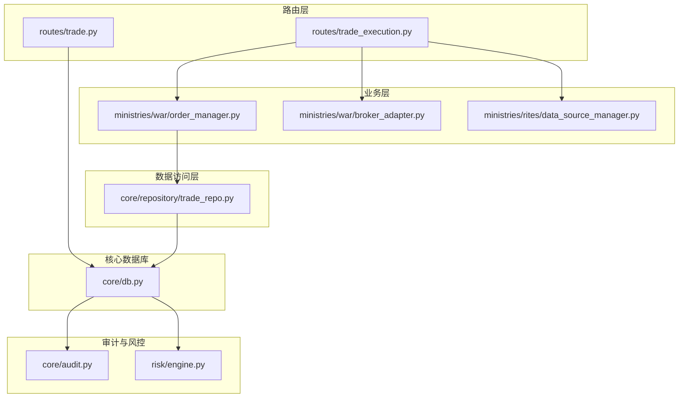
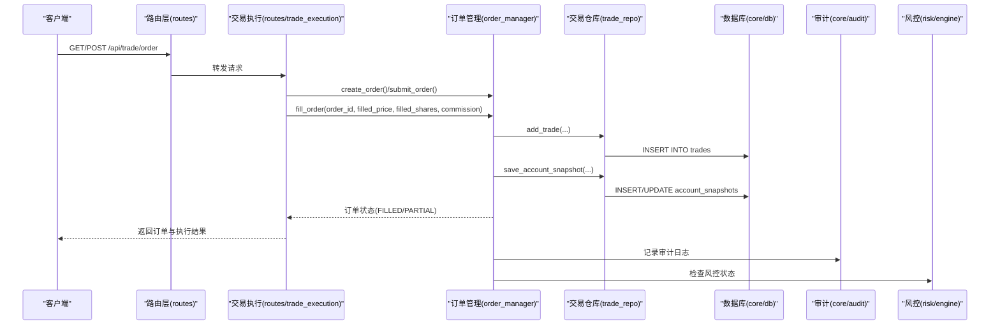
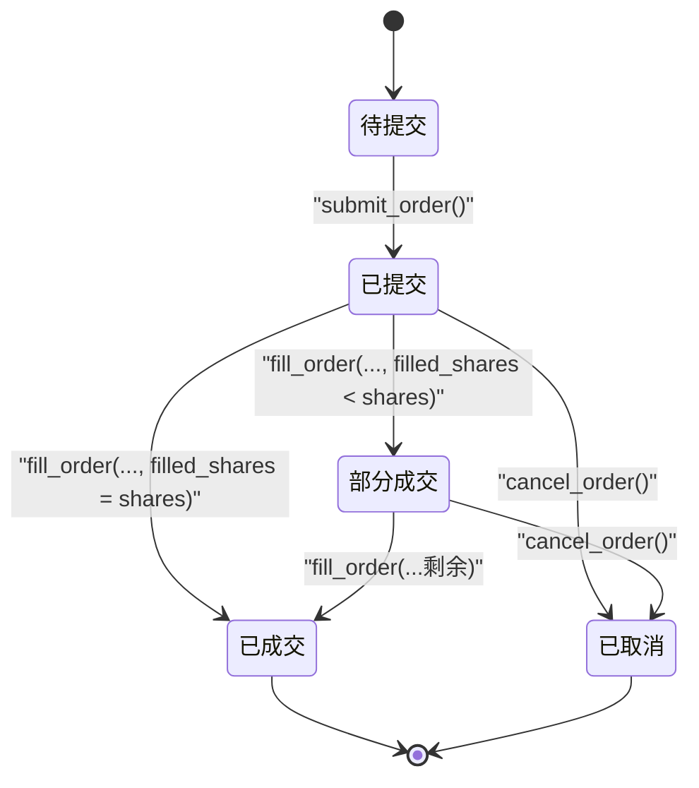
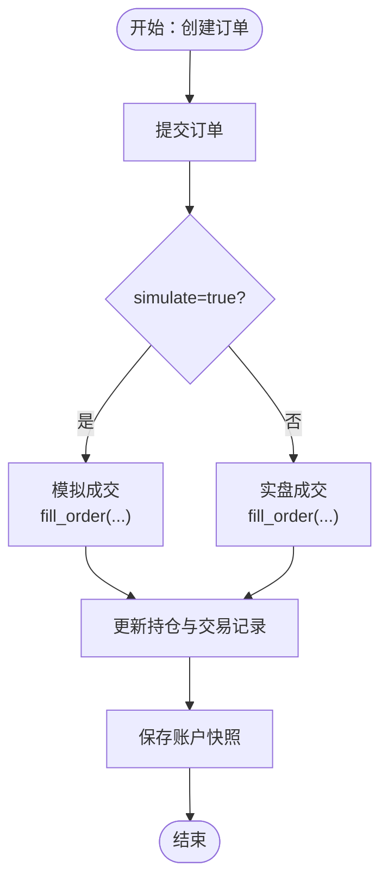
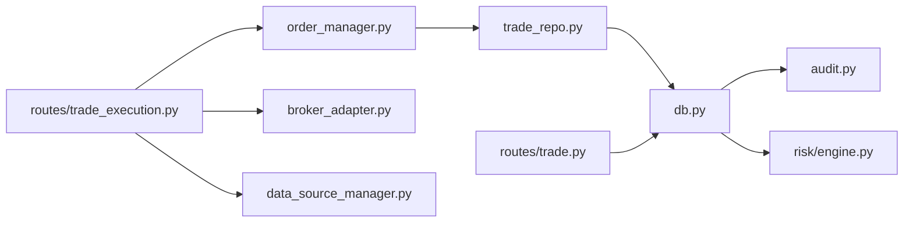

# 交易记录仓库

<cite>
**本文引用的文件**
- [trade_repo.py](file://core/repository/trade_repo.py)
- [db.py](file://core/db.py)
- [trade.py](file://routes/trade.py)
- [trade_execution.py](file://routes/trade_execution.py)
- [order_manager.py](file://ministries/war/order_manager.py)
- [broker_adapter.py](file://ministries/war/broker_adapter.py)
- [data_source_manager.py](file://ministries/rites/data_source_manager.py)
- [audit.py](file://core/audit.py)
- [engine.py](file://risk/engine.py)
- [backtest.py](file://backtest/backtest.py)
</cite>

## 目录
1. [简介](#简介)
2. [项目结构](#项目结构)
3. [核心组件](#核心组件)
4. [架构总览](#架构总览)
5. [详细组件分析](#详细组件分析)
6. [依赖分析](#依赖分析)
7. [性能考虑](#性能考虑)
8. [故障排查指南](#故障排查指南)
9. [结论](#结论)
10. [附录](#附录)

## 简介
本文件面向AIQuant交易记录仓库TradeRepo，系统性阐述其在交易执行系统中的核心地位与数据安全保障机制。TradeRepo负责交易记录与账户快照的持久化，是回测、风控、审计与合规链路的关键数据来源。本文将从数据结构设计、状态生命周期管理、批量导入事务与一致性、审计追踪与合规、交易回放与模拟交易支持、费用与收益统计集成，以及API使用与备份策略等方面进行深入解析。

## 项目结构
TradeRepo位于core/repository目录下，采用按表拆分的数据访问层设计，与核心数据库模块core.db协同工作，并通过routes层对外提供REST接口。交易执行链路由routes/trade_execution.py驱动，内部通过ministries/war/order_manager.py管理订单与持仓状态，并与ministries/war/broker_adapter.py抽象的交易接口交互。数据源由ministries/rites/data_source_manager.py统一管理，审计与风控分别由core/audit.py与risk/engine.py保障。

图表来源
- [trade_repo.py:1-77](file://core/repository/trade_repo.py#L1-L77)
- [db.py:190-223](file://core/db.py#L190-L223)
- [trade.py:1-43](file://routes/trade.py#L1-L43)
- [trade_execution.py:1-217](file://routes/trade_execution.py#L1-L217)
- [order_manager.py:1-211](file://ministries/war/order_manager.py#L1-L211)
- [broker_adapter.py:1-413](file://ministries/war/broker_adapter.py#L1-L413)
- [data_source_manager.py:1-190](file://ministries/rites/data_source_manager.py#L1-L190)
- [audit.py:1-147](file://core/audit.py#L1-L147)
- [engine.py:1-168](file://risk/engine.py#L1-L168)

章节来源
- [trade_repo.py:1-77](file://core/repository/trade_repo.py#L1-L77)
- [db.py:190-223](file://core/db.py#L190-L223)

## 核心组件
- 交易记录表(trades)与账户快照表(account_snapshots)：定义交易记录的完整字段集，覆盖订单ID、成交价格、数量、手续费、滑点、原因、备注与时间戳等关键要素；账户快照提供每日资产、现金、持仓价值、总盈亏与百分比等聚合视图。
- 数据访问层TradeRepo：提供add_trade、get_trades、save_account_snapshot、get_account_snapshots、get_latest_snapshot等方法，封装SQL细节与事务语义。
- 路由层：routes/trade.py提供交易记录查询与新增接口；routes/trade_execution.py提供订单创建、取消、成交、持仓与账户概览接口，贯穿模拟/实盘切换。
- 订单与持仓管理：ministries/war/order_manager.py维护订单状态机与持仓变更，fill_order等关键路径会联动交易记录生成。
- 交易接口抽象：ministries/war/broker_adapter.py提供模拟/实盘接口抽象，统一订单结构与状态。
- 数据源与价格：ministries/rites/data_source_manager.py提供本地数据库数据源，用于实时价格更新与回测。
- 审计与风控：core/audit.py记录审计日志；risk/engine.py提供风控检查与状态落库，二者共同保障合规与安全。

章节来源
- [trade_repo.py:12-37](file://core/repository/trade_repo.py#L12-L37)
- [trade_repo.py:42-76](file://core/repository/trade_repo.py#L42-L76)
- [db.py:1015-1044](file://core/db.py#L1015-L1044)
- [db.py:1051-1101](file://core/db.py#L1051-L1101)
- [trade.py:12-42](file://routes/trade.py#L12-L42)
- [trade_execution.py:23-178](file://routes/trade_execution.py#L23-L178)
- [order_manager.py:76-125](file://ministries/war/order_manager.py#L76-L125)
- [broker_adapter.py:41-71](file://ministries/war/broker_adapter.py#L41-L71)
- [data_source_manager.py:72-108](file://ministries/rites/data_source_manager.py#L72-L108)
- [audit.py:16-39](file://core/audit.py#L16-L39)
- [engine.py:51-71](file://risk/engine.py#L51-L71)

## 架构总览
TradeRepo处于“路由层-业务层-数据访问层-核心数据库”的分层结构中，承担交易记录与账户快照的持久化职责。交易执行流程从路由层进入，经订单管理器与交易接口抽象，最终在fill_order等关键节点生成交易记录并更新账户快照，同时触发审计与风控。

图表来源
- [trade_execution.py:23-58](file://routes/trade_execution.py#L23-L58)
- [order_manager.py:76-125](file://ministries/war/order_manager.py#L76-L125)
- [trade_repo.py:12-23](file://core/repository/trade_repo.py#L12-L23)
- [db.py:1015-1044](file://core/db.py#L1015-L1044)
- [db.py:1051-1081](file://core/db.py#L1051-L1081)
- [audit.py:16-39](file://core/audit.py#L16-L39)
- [engine.py:51-71](file://risk/engine.py#L51-L71)

## 详细组件分析

### 交易记录数据结构设计
- 关键字段
  - position_id：关联持仓ID，便于交易与持仓的关联分析
  - code/name：标的代码与名称
  - trade_date：交易日期
  - direction：方向（buy/sell）
  - price/shares：成交价格与数量
  - amount：成交金额（price × shares）
  - commission：手续费（默认0，可在fill_order时填充）
  - slippage：滑点成本（默认0）
  - reason/note：原因与备注
  - created_at：记录创建时间
- 设计要点
  - amount与commission分离，便于收益与费用统计
  - slippage独立字段，支持对冲与回测场景的成本建模
  - created_at确保时序与审计追溯

章节来源
- [db.py:190-208](file://core/db.py#L190-L208)
- [order_manager.py:102-125](file://ministries/war/order_manager.py#L102-L125)
- [trade_repo.py:12-23](file://core/repository/trade_repo.py#L12-L23)

### 交易状态生命周期与转换逻辑
- 订单状态机
  - PENDING → SUBMITTED → PARTIAL/FILLED 或 CANCELLED/REJECTED
- 转换规则
  - submit_order：PENDING → SUBMITTED
  - fill_order：SUBMITTED/PARTIAL → PARTIAL（部分成交）或 FILLED（全部成交），同时更新commission与filled_at
  - cancel_order：PENDING/SUBMITTED → CANCELLED
- 持仓联动
  - buy方向：增加持仓（加权成本、份额累加）
  - sell方向：减少持仓（直至清仓并标记closed）

图表来源
- [order_manager.py:16-24](file://ministries/war/order_manager.py#L16-L24)
- [order_manager.py:93-133](file://ministries/war/order_manager.py#L93-L133)
- [order_manager.py:162-198](file://ministries/war/order_manager.py#L162-L198)

章节来源
- [order_manager.py:16-24](file://ministries/war/order_manager.py#L16-L24)
- [order_manager.py:93-133](file://ministries/war/order_manager.py#L93-L133)
- [order_manager.py:162-198](file://ministries/war/order_manager.py#L162-L198)

### 批量交易记录导入与事务一致性
- 事务模型
  - 使用core/db.py提供的上下文管理器，确保每个操作在单连接内commit/rollback，避免部分写入
- 批量写入
  - trades表支持批量插入（例如回测或历史数据导入场景），配合ON CONFLICT策略保证幂等
- 一致性保障
  - fill_order在内存状态更新与数据库写入之间保持原子性，避免脏读
  - 账户快照按日去重更新，防止重复写入导致的统计偏差

章节来源
- [db.py:26-39](file://core/db.py#L26-L39)
- [db.py:57-466](file://core/db.py#L57-L466)
- [order_manager.py:102-125](file://ministries/war/order_manager.py#L102-L125)
- [db.py:1051-1081](file://core/db.py#L1051-L1081)

### 审计追踪与合规要求
- 审计日志
  - 提供log_audit与audit_log装饰器，自动记录操作、资源、耗时、结果与IP等信息
  - 支持按action与user_id查询审计日志
- 合规要点
  - 保留完整的交易与风控事件日志，满足监管与内部审计需求
  - 通过IP地址与user_id绑定，实现责任可追溯

章节来源
- [audit.py:16-39](file://core/audit.py#L16-L39)
- [audit.py:41-92](file://core/audit.py#L41-L92)
- [audit.py:107-146](file://core/audit.py#L107-L146)
- [engine.py:73-127](file://risk/engine.py#L73-L127)

### 交易回放与模拟交易的数据支持
- 模拟交易
  - routes/trade_execution.py支持simulate参数，默认模拟成交，自动提交并撮合
  - ministries/war/broker_adapter.py提供SimulationBroker，模拟资金占用、成交与持仓更新
- 回放支持
  - backtest/backtest.py内置交易成本计算（手续费、印花税、滑点），可复现历史交易成本
  - 交易记录表提供逐笔成交明细，支撑回测引擎的逐笔回放

图表来源
- [trade_execution.py:33-58](file://routes/trade_execution.py#L33-L58)
- [order_manager.py:102-125](file://ministries/war/order_manager.py#L102-L125)
- [broker_adapter.py:134-194](file://ministries/war/broker_adapter.py#L134-L194)
- [db.py:1051-1081](file://core/db.py#L1051-L1081)

章节来源
- [trade_execution.py:33-58](file://routes/trade_execution.py#L33-L58)
- [broker_adapter.py:134-194](file://ministries/war/broker_adapter.py#L134-L194)
- [backtest.py:112-119](file://backtest/backtest.py#L112-L119)

### 交易费用计算与收益统计集成
- 费用计算
  - fill_order时可传入commission，统一计入trades.commission
  - 回测引擎提供手续费、印花税与滑点的统一计算接口
- 收益统计
  - routes/trade_execution.py提供账户概览接口，汇总现金、市值、总资产、总收益、总手续费等
  - 账户快照表提供每日资产聚合，支持收益曲线与回撤分析

章节来源
- [order_manager.py:102-125](file://ministries/war/order_manager.py#L102-L125)
- [backtest.py:112-119](file://backtest/backtest.py#L112-L119)
- [trade_execution.py:128-160](file://routes/trade_execution.py#L128-L160)
- [db.py:1051-1081](file://core/db.py#L1051-L1081)

### 交易数据API使用示例
- 获取交易记录
  - GET /api/trade/trades?code={股票代码}&limit={条数}
  - 返回trades数组
- 新增交易记录
  - POST /api/trade/trades/add
  - 请求体包含position_id、code、name、trade_date、direction、price、shares、commission、reason、note等
- 订单相关
  - POST /api/trade/order：创建订单（支持simulate）
  - GET /api/trade/orders：查询订单列表
  - POST /api/trade/order/{id}/cancel：撤销订单
  - GET /api/trade/positions：查询持仓
  - POST /api/trade/position/update：批量更新持仓价格
  - GET /api/trade/account：查询账户概览
  - POST /api/trade/simulate/fill：手动模拟成交

章节来源
- [trade.py:12-42](file://routes/trade.py#L12-L42)
- [trade_execution.py:23-178](file://routes/trade_execution.py#L23-L178)

### 数据备份策略
- 文件级备份
  - SQLite数据库文件位于core/db.py中定义的DB_PATH，建议定期复制该文件作为备份
- 增量备份
  - 结合WAL模式与定期checkpoint，降低锁竞争并提高并发性能
- 备份验证
  - 备份后执行完整性校验与基本查询验证，确保可恢复性

章节来源
- [db.py:19-39](file://core/db.py#L19-L39)
- [db.py:57-466](file://core/db.py#L57-L466)

## 依赖分析
- TradeRepo依赖core/db.py提供的连接管理与表结构定义
- 路由层routes/trade.py与routes/trade_execution.py分别对接TradeRepo与OrderManager
- OrderManager依赖BrokerAdapter进行模拟/实盘交易
- 审计与风控模块通过数据库表进行日志与状态存储

图表来源
- [trade_repo.py:1-77](file://core/repository/trade_repo.py#L1-L77)
- [db.py:190-223](file://core/db.py#L190-L223)
- [trade.py:1-43](file://routes/trade.py#L1-L43)
- [trade_execution.py:1-217](file://routes/trade_execution.py#L1-L217)
- [order_manager.py:1-211](file://ministries/war/order_manager.py#L1-L211)
- [broker_adapter.py:1-413](file://ministries/war/broker_adapter.py#L1-L413)
- [data_source_manager.py:1-190](file://ministries/rites/data_source_manager.py#L1-L190)
- [audit.py:1-147](file://core/audit.py#L1-L147)
- [engine.py:1-168](file://risk/engine.py#L1-L168)

章节来源
- [trade_repo.py:1-77](file://core/repository/trade_repo.py#L1-L77)
- [db.py:190-223](file://core/db.py#L190-L223)
- [trade_execution.py:1-217](file://routes/trade_execution.py#L1-L217)
- [order_manager.py:1-211](file://ministries/war/order_manager.py#L1-L211)

## 性能考虑
- WAL模式与NORMAL同步
  - 提升并发写入性能，适合高频交易记录写入场景
- 索引优化
  - trades表按code与trade_date建立索引，加速查询与回放
- 分页与限制
  - 默认limit控制返回量，避免大结果集带来的网络与内存压力
- 事务批处理
  - 批量导入时尽量合并为单事务，减少commit次数

章节来源
- [db.py:26-39](file://core/db.py#L26-L39)
- [db.py:207-208](file://core/db.py#L207-L208)
- [trade.py:14-15](file://routes/trade.py#L14-L15)

## 故障排查指南
- 交易记录缺失
  - 检查fill_order是否被调用，确认commission与amount是否正确传入
  - 核对created_at与trade_date是否一致
- 订单状态异常
  - 确认submit_order与cancel_order调用时机，避免重复取消
  - 检查PARTIAL/FILLED边界条件
- 账户快照不更新
  - 确认save_account_snapshot是否按日调用，注意重复日期的更新逻辑
- 审计日志未记录
  - 检查audit_log装饰器是否正确包裹API，确认IP与user_id提取
- 风控阻断
  - 查看risk_events与risk_status表，定位触发规则与阈值

章节来源
- [order_manager.py:93-133](file://ministries/war/order_manager.py#L93-L133)
- [db.py:1051-1081](file://core/db.py#L1051-L1081)
- [audit.py:41-92](file://core/audit.py#L41-L92)
- [engine.py:73-127](file://risk/engine.py#L73-L127)

## 结论
TradeRepo作为交易执行系统的核心数据枢纽，通过清晰的数据结构、严谨的状态机与事务一致性保障、完善的审计与风控集成，为回测、模拟交易、费用与收益统计提供了坚实基础。结合WAL模式与索引优化，系统在高并发写入场景下具备良好的稳定性与可扩展性。建议在生产环境中持续监控审计与风控日志，定期备份数据库文件，并在批量导入时采用事务批处理以确保数据一致性。

## 附录
- 交易记录表结构
  - 字段：id、position_id、code、name、trade_date、direction、price、shares、amount、commission、slippage、reason、note、created_at
  - 索引：idx_trade_code、idx_trade_date
- 账户快照表结构
  - 字段：id、snapshot_date、total_assets、cash、position_value、positions_count、total_cost、total_pnl、pnl_pct、created_at
  - 索引：idx_snapshot_date

章节来源
- [db.py:190-223](file://core/db.py#L190-L223)
- [db.py:1051-1101](file://core/db.py#L1051-L1101)