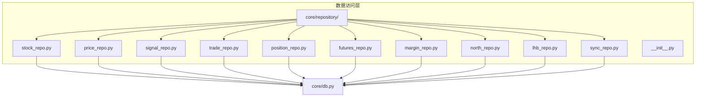
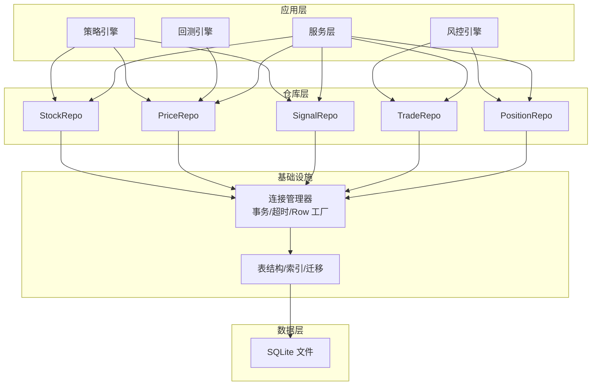
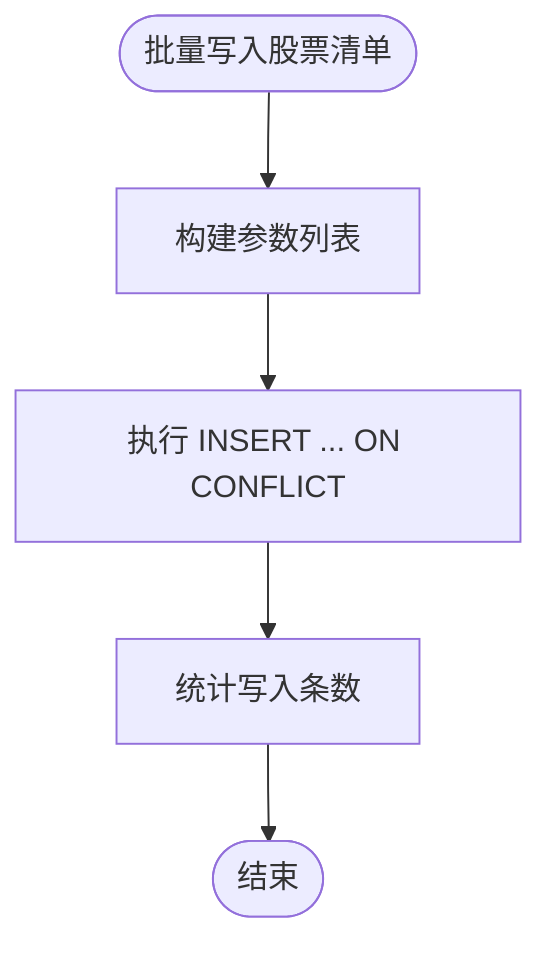
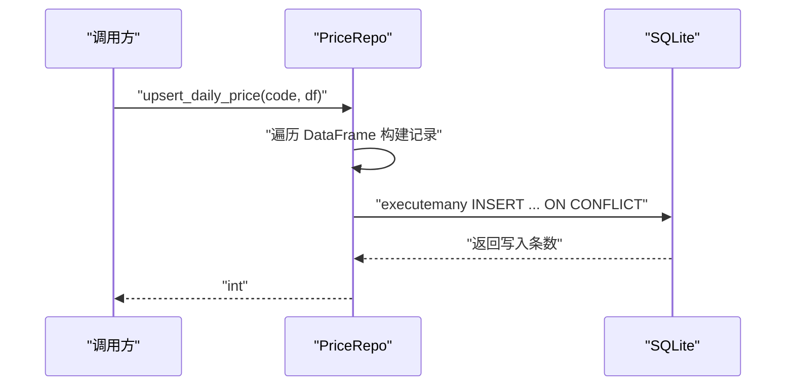
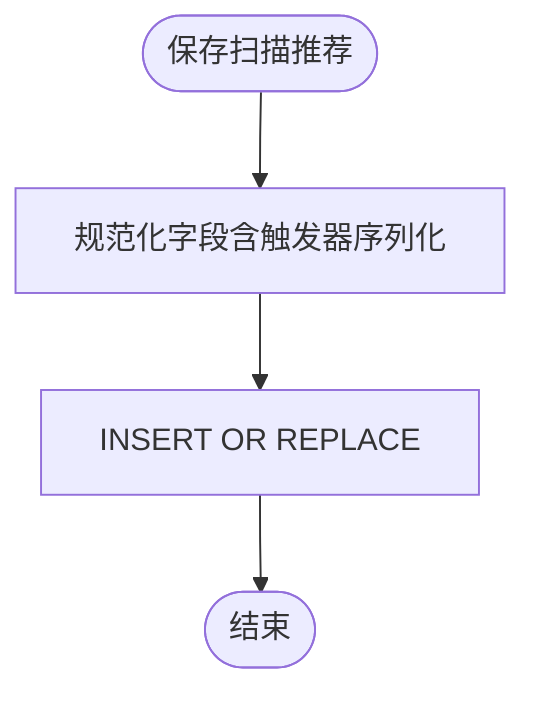
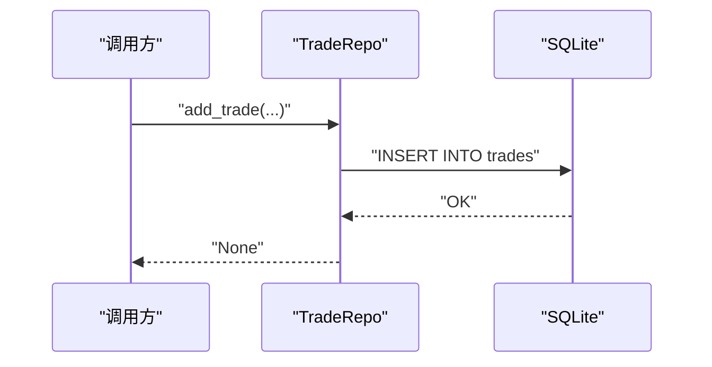
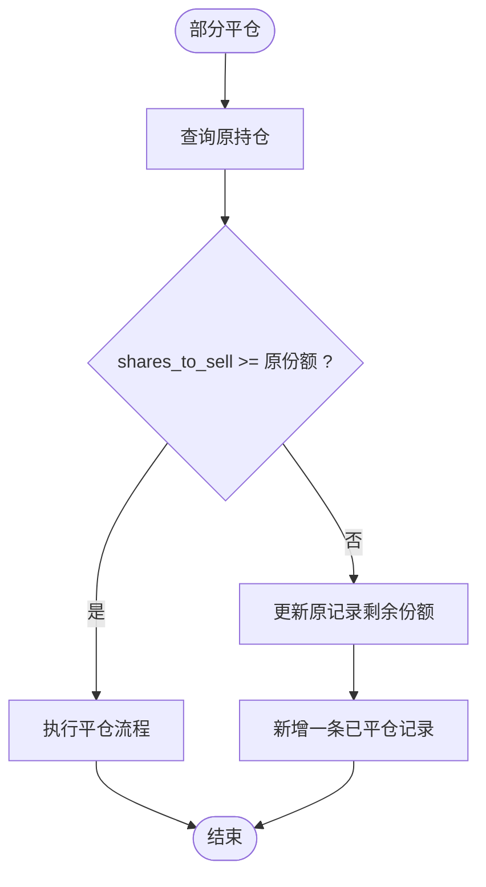
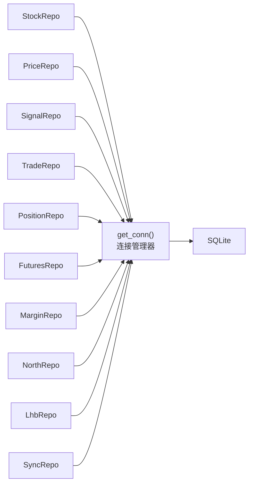
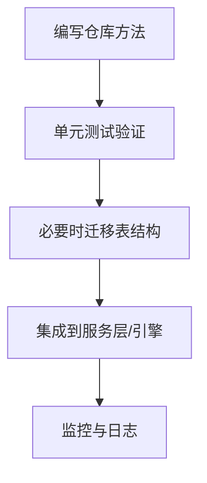

# 仓库模式实现

<cite>
**本文引用的文件**
- [core/repository/__init__.py](file://core/repository/__init__.py)
- [core/db.py](file://core/db.py)
- [core/repository/stock_repo.py](file://core/repository/stock_repo.py)
- [core/repository/price_repo.py](file://core/repository/price_repo.py)
- [core/repository/signal_repo.py](file://core/repository/signal_repo.py)
- [core/repository/trade_repo.py](file://core/repository/trade_repo.py)
- [core/repository/position_repo.py](file://core/repository/position_repo.py)
- [core/repository/futures_repo.py](file://core/repository/futures_repo.py)
- [core/repository/margin_repo.py](file://core/repository/margin_repo.py)
- [core/repository/north_repo.py](file://core/repository/north_repo.py)
- [core/repository/lhb_repo.py](file://core/repository/lhb_repo.py)
- [core/repository/sync_repo.py](file://core/repository/sync_repo.py)
- [tests/test_repository.py](file://tests/test_repository.py)
</cite>

## 目录
1. [简介](#简介)
2. [项目结构](#项目结构)
3. [核心组件](#核心组件)
4. [架构总览](#架构总览)
5. [详细组件分析](#详细组件分析)
6. [依赖分析](#依赖分析)
7. [性能考量](#性能考量)
8. [故障排查指南](#故障排查指南)
9. [结论](#结论)
10. [附录](#附录)

## 简介
本技术文档围绕 AIQuant 项目的“仓库模式”实现展开，系统阐述数据访问层的职责划分、方法设计、参数与返回值规范、批量处理优化与扩展指南。仓库模式将每个表的 CRUD 操作封装为独立模块，统一通过连接管理器进行数据库访问，既保证了领域模型与数据持久化的解耦，也便于单元测试与横向扩展。

仓库模式在量化系统中的典型场景包括：
- 股票基本信息管理：维护股票代码、名称、市场及股本信息
- 行情数据操作：写入/读取日线行情与指数行情，并支持策略评分的批量更新
- 策略信号管理：记录策略扫描与筛选结果，支持微信推送标记
- 交易记录处理：记录每笔交易的细节与账户快照
- 持仓状态维护：开仓、平仓、部分平仓、当前价更新与汇总统计

## 项目结构
仓库模式位于 core/repository 目录下，每个文件对应一张表或一类业务域的数据访问逻辑；核心数据库初始化与连接管理位于 core/db.py。测试文件 tests/test_repository.py 验证仓库模块的可导入性与基础行为。

图表来源
- [core/repository/__init__.py:1-6](file://core/repository/__init__.py#L1-L6)
- [core/db.py:1-800](file://core/db.py#L1-L800)
- [core/repository/stock_repo.py:1-80](file://core/repository/stock_repo.py#L1-L80)
- [core/repository/price_repo.py:1-237](file://core/repository/price_repo.py#L1-L237)
- [core/repository/signal_repo.py:1-119](file://core/repository/signal_repo.py#L1-L119)
- [core/repository/trade_repo.py:1-77](file://core/repository/trade_repo.py#L1-L77)
- [core/repository/position_repo.py:1-138](file://core/repository/position_repo.py#L1-L138)
- [core/repository/futures_repo.py:1-109](file://core/repository/futures_repo.py#L1-L109)
- [core/repository/margin_repo.py:1-186](file://core/repository/margin_repo.py#L1-L186)
- [core/repository/north_repo.py:1-117](file://core/repository/north_repo.py#L1-L117)
- [core/repository/lhb_repo.py:1-99](file://core/repository/lhb_repo.py#L1-L99)
- [core/repository/sync_repo.py:1-55](file://core/repository/sync_repo.py#L1-L55)

章节来源
- [core/repository/__init__.py:1-6](file://core/repository/__init__.py#L1-L6)
- [core/db.py:1-800](file://core/db.py#L1-L800)

## 核心组件
本节对五个核心仓库类进行职责与接口梳理，涵盖参数设计、返回值格式与典型调用路径。

- StockRepo（股票信息）
  - 职责：维护股票基本信息、股本数据；提供股票列表查询、名称查询等
  - 关键方法：upsert_stock_list、batch_update_market_cap、get_all_stocks、get_stock_name、get_market_cap_map
  - 返回值：批量写入返回写入条数；查询返回 DataFrame 或字典映射
  - 典型用途：初始化/更新股票清单、计算市值口径

- PriceRepo（行情数据）
  - 职责：日线行情与指数行情的写入与查询；策略评分的批量更新
  - 关键方法：upsert_daily_price、get_daily_price、update_strategy_scores_batch、upsert_index_daily、get_index_daily、get_latest_date、get_latest_date_all、has_today_data、get_stock_count_in_db
  - 返回值：写入返回写入条数；查询返回带日期索引的 DataFrame
  - 典型用途：回测引擎数据源、指标计算、策略评分注入

- SignalRepo（策略信号）
  - 职责：记录策略筛选与扫描结果；支持今日信号查询
  - 关键方法：save_signals、save_scan_signals、get_signals、get_today_signals
  - 返回值：写入无返回；查询返回字典列表
  - 典型用途：信号推送、复盘与报表

- TradeRepo（交易记录）
  - 职责：记录交易明细与账户快照
  - 关键方法：add_trade、get_trades、save_account_snapshot、get_account_snapshots、get_latest_snapshot
  - 返回值：写入无返回；查询返回字典列表或单条快照
  - 典型用途：实盘/回测交易流水、风控与收益归因

- PositionRepo（持仓状态）
  - 职责：开仓、平仓、部分平仓、当前价更新、按条件查询与汇总统计
  - 关键方法：add_position、close_position、partial_close_position、update_position_price、get_positions、get_position_by_id、get_position_by_code、delete_position、get_position_summary
  - 返回值：add_position 返回新增持仓 ID；查询返回字典或列表；汇总返回字典
  - 典型用途：实时风控、组合估值与损益计算

章节来源
- [core/repository/stock_repo.py:1-80](file://core/repository/stock_repo.py#L1-L80)
- [core/repository/price_repo.py:1-237](file://core/repository/price_repo.py#L1-L237)
- [core/repository/signal_repo.py:1-119](file://core/repository/signal_repo.py#L1-L119)
- [core/repository/trade_repo.py:1-77](file://core/repository/trade_repo.py#L1-L77)
- [core/repository/position_repo.py:1-138](file://core/repository/position_repo.py#L1-L138)

## 架构总览
仓库模式采用“按表拆分”的数据访问层，每个仓库模块内部通过统一的连接管理器获取数据库连接，执行 SQL 并返回标准化结果。核心数据库初始化在 core/db.py 中完成，包含建表、索引与迁移逻辑，确保表结构稳定演进。

图表来源
- [core/db.py:26-40](file://core/db.py#L26-L40)
- [core/db.py:57-467](file://core/db.py#L57-L467)

## 详细组件分析

### StockRepo（股票信息）
- 设计要点
  - 使用 ON CONFLICT 更新策略避免重复主键异常
  - 批量写入使用 executemany 提升吞吐
  - 提供股本映射与活跃股票列表查询，支撑市值口径与筛选范围
- 方法与参数
  - upsert_stock_list(records: list[dict])：批量写入/更新股票清单
  - batch_update_market_cap(records: list[dict])：批量更新总股本与流通股本
  - get_all_stocks(active_only: bool) -> pd.DataFrame：查询股票列表
  - get_stock_name(code: str) -> str：查询股票名称（不存在时回退为代码）
  - get_market_cap_map() -> dict：返回股本映射
- 返回值与复杂度
  - 写入返回写入条数；查询返回 DataFrame 或字典映射
  - 批量写入时间复杂度 O(n)，单次查询受索引影响

图表来源
- [core/repository/stock_repo.py:13-28](file://core/repository/stock_repo.py#L13-L28)

章节来源
- [core/repository/stock_repo.py:1-80](file://core/repository/stock_repo.py#L1-L80)

### PriceRepo（行情数据）
- 设计要点
  - 日线与指数行情分别维护，均支持 upsert 与查询
  - 策略评分单独批量更新，避免与 OHLCV 冲突
  - 查询支持起止日期过滤与最小行数约束
- 方法与参数
  - upsert_daily_price(code: str, df: pd.DataFrame) -> int：写入日线行情
  - update_strategy_scores_batch(code: str, scores_df: pd.DataFrame)：批量更新策略评分
  - get_daily_price(code: str, start_date: str, end_date: str, min_rows: int) -> pd.DataFrame：查询日线行情
  - upsert_index_daily(code: str, df: pd.DataFrame) -> int：写入指数行情
  - get_index_daily(code: str, start_date: str, end_date: str) -> pd.DataFrame：查询指数行情
  - get_latest_date(code: str) -> str | None：获取最新交易日
  - get_latest_date_all() -> str | None：获取全市场最新交易日
  - has_today_data(code: str) -> bool：判断当日是否有数据
  - get_stock_count_in_db() -> int：统计有行情数据的股票数
- 返回值与复杂度
  - 写入返回写入条数；查询返回带日期索引的 DataFrame
  - 批量更新策略评分采用逐条 UPDATE，适合高频写入场景

图表来源
- [core/repository/price_repo.py:13-47](file://core/repository/price_repo.py#L13-L47)

章节来源
- [core/repository/price_repo.py:1-237](file://core/repository/price_repo.py#L1-L237)

### SignalRepo（策略信号）
- 设计要点
  - 两套记录表：signal_records（历史筛选记录）、stock_signal（扫描推荐）
  - 支持触发器列表序列化存储，便于后续规则匹配
  - 提供今日信号便捷查询
- 方法与参数
  - save_signals(signals: list[dict], sent_wechat: bool)：保存筛选结果
  - save_scan_signals(scan_results: list[dict], sent_wechat: bool)：保存扫描推荐
  - get_signals(trade_date: str, limit: int) -> list[dict]：查询筛选记录
  - get_today_signals() -> list[dict]：查询今日筛选记录
- 返回值与复杂度
  - 写入无返回；查询返回字典列表

图表来源
- [core/repository/signal_repo.py:46-98](file://core/repository/signal_repo.py#L46-L98)

章节来源
- [core/repository/signal_repo.py:1-119](file://core/repository/signal_repo.py#L1-L119)

### TradeRepo（交易记录）
- 设计要点
  - 交易记录与账户快照分离，便于审计与可视化
  - 交易记录包含方向、价格、份额、手续费与滑点等字段
- 方法与参数
  - add_trade(position_id: int, code: str, name: str, trade_date: str, direction: str, price: float, shares: int, pnl: float, strategy: str, remark: str)：添加交易记录
  - get_trades(code: str, limit: int) -> list[dict]：查询交易记录
  - save_account_snapshot(total_assets: float, cash: float, position_value: float, total_pnl: float, pnl_pct: float)：保存账户快照
  - get_account_snapshots(days: int) -> list[dict]：查询最近 N 天快照
  - get_latest_snapshot() -> dict | None：查询最新快照
- 返回值与复杂度
  - 写入无返回；查询返回字典列表或单条快照

图表来源
- [core/repository/trade_repo.py:12-24](file://core/repository/trade_repo.py#L12-L24)

章节来源
- [core/repository/trade_repo.py:1-77](file://core/repository/trade_repo.py#L1-L77)

### PositionRepo（持仓状态）
- 设计要点
  - 支持开仓、平仓、部分平仓；部分平仓会新增一条已平仓记录并更新原记录剩余份额
  - 当前价用于浮动盈亏计算；状态字段区分持有与已平仓
  - 汇总统计包含总价值、总盈亏、总盈亏百分比与持仓数量
- 方法与参数
  - add_position(code: str, name: str, entry_date: str, entry_price: float, shares: int, strategy: str, stop_loss: float, take_profit: float) -> int：添加持仓并返回 position_id
  - close_position(position_id: int, exit_price: float, exit_date: str, pnl: float, pnl_pct: float)：平仓
  - partial_close_position(position_id: int, exit_price: float, shares_to_sell: int, exit_date: str, pnl: float, pnl_pct: float)：部分平仓
  - update_position_price(position_id: int, current_price: float)：更新当前价
  - get_positions(status: str) -> list[dict]：查询持仓列表
  - get_position_by_id(position_id: int) -> dict | None：按 ID 查询
  - get_position_by_code(code: str, status: str) -> dict | None：按代码查询最新持仓
  - delete_position(position_id: int)：删除持仓
  - get_position_summary() -> dict：持仓汇总统计
- 返回值与复杂度
  - add_position 返回新增 ID；查询返回字典或列表；汇总返回字典

图表来源
- [core/repository/position_repo.py:42-73](file://core/repository/position_repo.py#L42-L73)

章节来源
- [core/repository/position_repo.py:1-138](file://core/repository/position_repo.py#L1-L138)

### 其他仓库（扩展参考）
除五大核心仓库外，还提供了多类主题数据的仓库，便于在量化系统中扩展使用：
- FuturesRepo（指数期货）
- MarginRepo（融资融券）
- NorthRepo（北向资金）
- LhbRepo（龙虎榜）
- SyncRepo（同步日志与数据库统计）

这些仓库遵循相同的模式：统一连接管理、参数清洗与日期格式化、批量写入与 upsert、查询过滤与索引利用。

章节来源
- [core/repository/futures_repo.py:1-109](file://core/repository/futures_repo.py#L1-L109)
- [core/repository/margin_repo.py:1-186](file://core/repository/margin_repo.py#L1-L186)
- [core/repository/north_repo.py:1-117](file://core/repository/north_repo.py#L1-L117)
- [core/repository/lhb_repo.py:1-99](file://core/repository/lhb_repo.py#L1-L99)
- [core/repository/sync_repo.py:1-55](file://core/repository/sync_repo.py#L1-L55)

## 依赖分析
- 组件内聚与耦合
  - 各仓库模块内部高度内聚，仅依赖 core.db 的连接管理器
  - 仓库之间无直接相互依赖，通过核心数据库进行数据交互
- 外部依赖
  - SQLite 作为本地存储，使用 WAL 模式与 NORMAL 同步策略提升并发与性能
  - pandas 用于 DataFrame 与数据库之间的高效转换
- 可能的循环依赖
  - 仓库模块之间无循环依赖风险，均为单向依赖于 core.db

图表来源
- [core/db.py:26-40](file://core/db.py#L26-L40)

章节来源
- [core/db.py:1-800](file://core/db.py#L1-L800)

## 性能考量
- 连接与事务
  - 使用上下文管理器确保事务提交与回滚，减少资源泄漏
  - PRAGMA 设置 WAL 与 NORMAL 同步，兼顾写入并发与可靠性
- 批量操作
  - executemany 与 ON CONFLICT DO UPDATE 降低网络往返与重复插入成本
  - 策略评分批量更新关闭外键检查并逐条更新，避免大事务锁竞争
- 索引与查询
  - 为高频查询字段建立复合索引与单列索引，如 code+date、trade_date 等
  - 查询时使用参数绑定，避免 SQL 注入并利于计划缓存
- I/O 与内存
  - DataFrame 与数据库间的数据转换尽量在仓库层完成，避免上层重复处理
  - 对于大规模查询，建议分页或限制返回行数

## 故障排查指南
- 常见问题定位
  - 写入失败：检查连接是否成功、参数类型是否正确、日期格式是否符合预期
  - 查询为空：确认起止日期格式、股票代码是否存在、索引是否生效
  - 批量更新未生效：确认是否关闭外键检查、逐条更新是否执行
- 调试建议
  - 在仓库层打印关键 SQL 与参数，便于定位问题
  - 使用测试用例验证函数签名与基本行为
- 单元测试参考
  - 验证仓库模块可导入与函数签名正确性
  - 验证核心函数（如 get_stock_name、has_today_data）签名一致性

章节来源
- [tests/test_repository.py:1-86](file://tests/test_repository.py#L1-L86)

## 结论
仓库模式在 AIQuant 中实现了清晰的职责边界与可扩展的数据访问层。通过按表拆分、统一连接管理与批量优化，既满足了回测与实盘的高性能需求，也为未来扩展更多主题数据提供了标准范式。建议在新增仓库时遵循现有命名与参数风格，保持返回值与错误处理的一致性。

## 附录

### 扩展指南与自定义仓库开发示例
- 开发步骤
  - 新建文件：core/repository/<your_table>_repo.py
  - 实现 _get_conn() 获取连接
  - 编写 CRUD 方法：参数类型注解、返回值标准化
  - 批量写入使用 executemany，必要时使用 ON CONFLICT
  - 查询方法支持日期过滤与分页
  - 在 core/db.py 中补充表结构与索引（如需）
- 示例流程（概念图）

[本节为概念性内容，不直接对应具体源码文件]