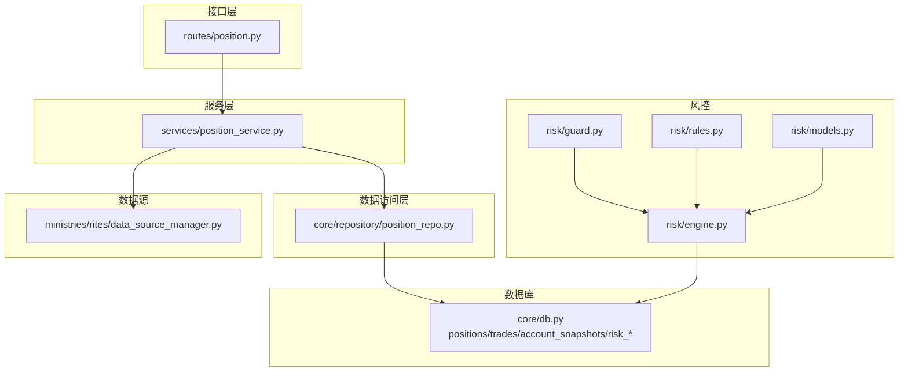
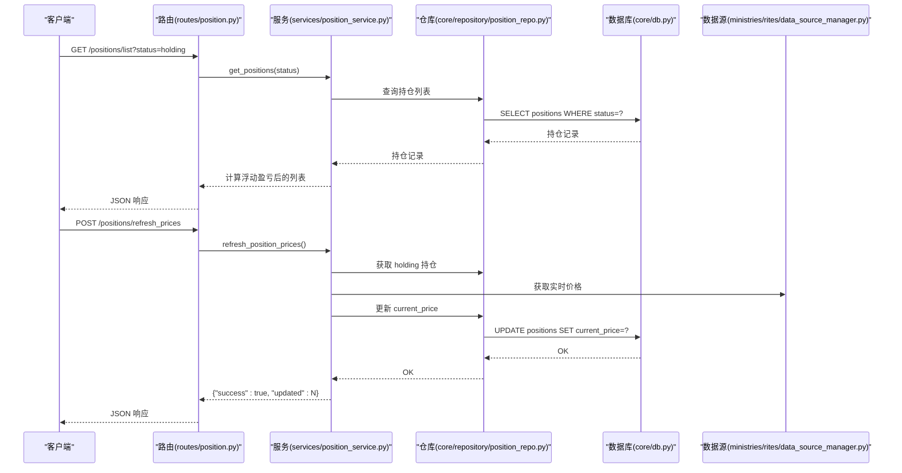
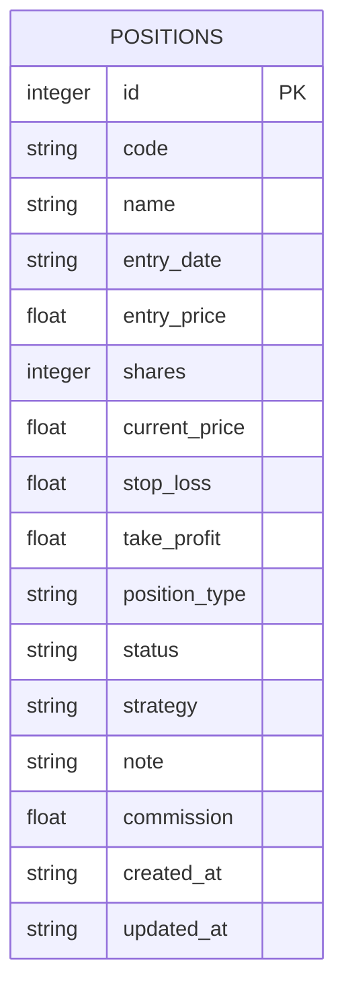
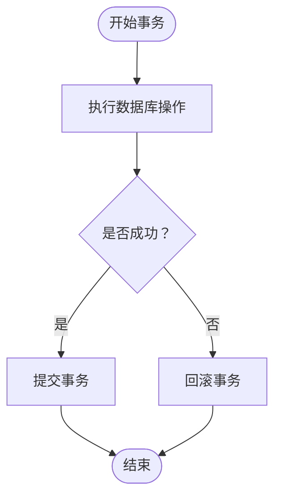
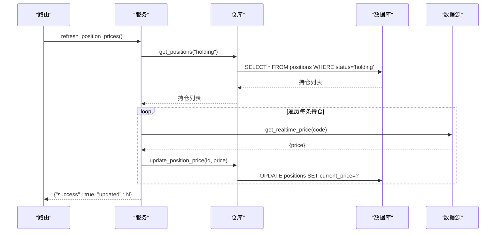
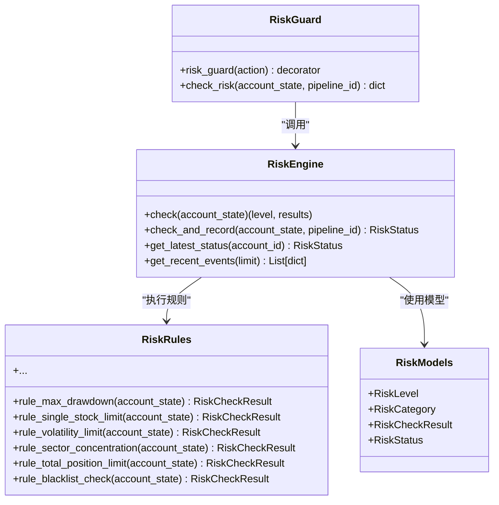
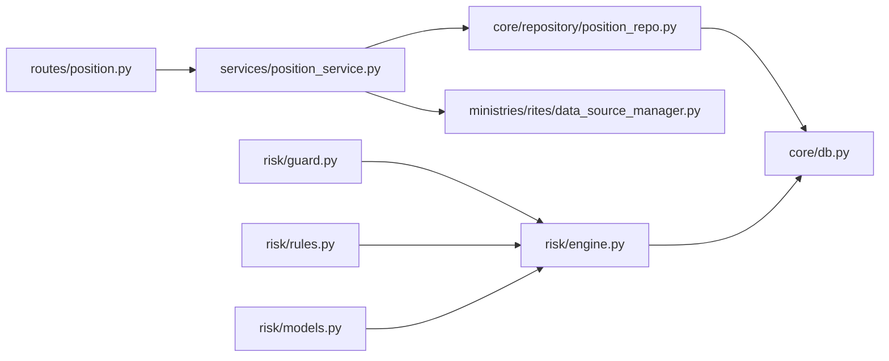

# 持仓状态仓库

<cite>
**本文引用的文件**
- [core/repository/position_repo.py](file://core/repository/position_repo.py)
- [services/position_service.py](file://services/position_service.py)
- [routes/position.py](file://routes/position.py)
- [core/db.py](file://core/db.py)
- [risk/engine.py](file://risk/engine.py)
- [risk/guard.py](file://risk/guard.py)
- [risk/models.py](file://risk/models.py)
- [risk/rules.py](file://risk/rules.py)
- [ministries/rites/data_source_manager.py](file://ministries/rites/data_source_manager.py)
- [tests/test_repository.py](file://tests/test_repository.py)
</cite>

## 目录
1. [简介](#简介)
2. [项目结构](#项目结构)
3. [核心组件](#核心组件)
4. [架构总览](#架构总览)
5. [详细组件分析](#详细组件分析)
6. [依赖分析](#依赖分析)
7. [性能考虑](#性能考虑)
8. [故障排查指南](#故障排查指南)
9. [结论](#结论)
10. [附录](#附录)

## 简介
本技术文档围绕 AIQuant 的“持仓状态仓库”展开，系统阐述 PositionRepo 在风险管理中的作用、实时性要求、数据结构设计、并发控制策略、多账户多品种统一管理、快照与历史追踪、风险计算集成与预警阈值、平仓与强制平仓支持，以及完整的 API 使用示例与数据一致性保障措施。目标是帮助开发者与运维人员快速理解并高效使用该模块。

## 项目结构
围绕“持仓状态仓库”的代码主要分布在以下层次：
- 数据访问层：core/repository/position_repo.py
- 业务服务层：services/position_service.py
- 接口路由层：routes/position.py
- 数据库与表结构：core/db.py（含 positions 表定义）
- 风控引擎与规则：risk/engine.py、risk/guard.py、risk/models.py、risk/rules.py
- 数据源管理与实时价格：ministries/rites/data_source_manager.py
- 单元测试：tests/test_repository.py

图表来源
- [routes/position.py:1-116](file://routes/position.py#L1-L116)
- [services/position_service.py:1-80](file://services/position_service.py#L1-L80)
- [core/repository/position_repo.py:1-138](file://core/repository/position_repo.py#L1-L138)
- [core/db.py:168-222](file://core/db.py#L168-L222)
- [risk/engine.py:1-168](file://risk/engine.py#L1-L168)
- [risk/guard.py:1-92](file://risk/guard.py#L1-L92)
- [risk/models.py:1-78](file://risk/models.py#L1-L78)
- [risk/rules.py:1-388](file://risk/rules.py#L1-L388)
- [ministries/rites/data_source_manager.py:1-190](file://ministries/rites/data_source_manager.py#L1-L190)

章节来源
- [routes/position.py:1-116](file://routes/position.py#L1-L116)
- [services/position_service.py:1-80](file://services/position_service.py#L1-L80)
- [core/repository/position_repo.py:1-138](file://core/repository/position_repo.py#L1-L138)
- [core/db.py:168-222](file://core/db.py#L168-L222)

## 核心组件
- 数据访问层（PositionRepo）：封装对 positions 表的增删改查、汇总统计与部分平仓逻辑，提供事务性与原子性保证。
- 业务服务层（PositionService）：负责业务规则处理、盈亏计算、批量刷新价格、与数据源交互。
- 接口路由层（Position Routes）：暴露 REST API，统一参数校验与错误处理。
- 数据库层（DB）：定义 positions/trades/account_snapshots/risk_* 等表结构，并提供连接管理与迁移能力。
- 风控引擎（RiskEngine/RiskGuard）：基于规则集进行风控检查，输出整体风险等级与事件记录。
- 数据源管理（DataSourceManager）：提供统一数据源接口，支持主备切换与健康检查，支撑实时价格刷新。

章节来源
- [core/repository/position_repo.py:12-138](file://core/repository/position_repo.py#L12-L138)
- [services/position_service.py:12-80](file://services/position_service.py#L12-L80)
- [routes/position.py:15-116](file://routes/position.py#L15-L116)
- [core/db.py:168-222](file://core/db.py#L168-L222)
- [risk/engine.py:13-168](file://risk/engine.py#L13-L168)
- [risk/guard.py:36-92](file://risk/guard.py#L36-L92)
- [ministries/rites/data_source_manager.py:111-190](file://ministries/rites/data_source_manager.py#L111-L190)

## 架构总览
PositionRepo 作为数据访问层，向上提供稳定的接口；PositionService 负责业务逻辑与计算；Routes 提供 HTTP 接口；DB 层负责持久化与并发控制；风控模块通过 RiskEngine/RiskGuard 将持仓状态纳入风控检查；DataSourceManager 支撑实时价格刷新。

图表来源
- [routes/position.py:15-116](file://routes/position.py#L15-L116)
- [services/position_service.py:66-80](file://services/position_service.py#L66-L80)
- [core/repository/position_repo.py:76-92](file://core/repository/position_repo.py#L76-L92)
- [core/db.py:26-39](file://core/db.py#L26-L39)
- [ministries/rites/data_source_manager.py:153-177](file://ministries/rites/data_source_manager.py#L153-L177)

## 详细组件分析

### 数据结构与关键指标
positions 表承载持仓状态的核心数据，关键字段包括：
- 标识与基础信息：id、code、name、strategy、note
- 成本与数量：entry_date、entry_price、shares、commission
- 当前状态：current_price、status（默认 holding）、position_type（默认 long）
- 止损止盈：stop_loss、take_profit
- 平仓信息：exit_date、exit_price、pnl、pnl_pct
- 时间戳：created_at、updated_at

图表来源
- [core/db.py:168-186](file://core/db.py#L168-L186)

章节来源
- [core/db.py:168-186](file://core/db.py#L168-L186)

### 实时性与并发控制
- 连接管理：使用上下文管理器确保事务提交/回滚与连接关闭，避免资源泄漏。
- WAL 模式与同步级别：开启 WAL 模式以提升并发写入性能，同时设置同步级别在性能与可靠性之间取得平衡。
- 事务边界：所有写操作（新增、更新、平仓、部分平仓）均在单个事务内完成，保证原子性。
- 并发读写：通过 SQLite 的 WAL 与锁机制协调读写并发，避免脏读与丢失更新。

图表来源
- [core/db.py:26-39](file://core/db.py#L26-L39)

章节来源
- [core/db.py:26-39](file://core/db.py#L26-L39)

### 持仓状态的实时更新机制
- 单次价格更新：通过路由 /positions/update_price 调用服务层，再由仓库层更新 current_price。
- 批量刷新：服务层遍历 holding 状态的持仓，调用数据源管理器获取实时价格并更新数据库。
- 数据源管理：支持主备数据源切换与健康检查，确保价格刷新的稳定性与可用性。

图表来源
- [services/position_service.py:66-80](file://services/position_service.py#L66-L80)
- [core/repository/position_repo.py:76-82](file://core/repository/position_repo.py#L76-L82)
- [ministries/rites/data_source_manager.py:153-177](file://ministries/rites/data_source_manager.py#L153-L177)

章节来源
- [services/position_service.py:66-80](file://services/position_service.py#L66-L80)
- [core/repository/position_repo.py:76-82](file://core/repository/position_repo.py#L76-L82)
- [ministries/rites/data_source_manager.py:153-177](file://ministries/rites/data_source_manager.py#L153-L177)

### 多账户、多品种统一管理
- 多账户：通过在风控状态与风控事件表中引入 account_id 字段，实现按账户维度的风控与统计。
- 多品种：positions 表以 code 作为关键字段，结合索引与查询条件，支持按品种过滤与聚合。
- 统一汇总：服务层提供 get_position_summary，按 holding 状态聚合总市值、总成本、总盈亏与收益率。

章节来源
- [risk/engine.py:101-125](file://risk/engine.py#L101-L125)
- [core/db.py:168-186](file://core/db.py#L168-L186)
- [services/position_service.py:56-58](file://services/position_service.py#L56-L58)

### 快照机制与历史状态追踪
- 账户资产快照：account_snapshots 表记录每日总资产、现金、持仓价值、总成本、总盈亏与收益率，便于回溯与报表生成。
- 风控状态快照：risk_status 表记录账户实时风控状态，包括整体等级、活跃规则、最大回撤、总敞口、可用资金等。
- 风控事件：risk_events 表记录每次风控检查的详细结果与建议，支持审计与复盘。

章节来源
- [core/db.py:210-222](file://core/db.py#L210-L222)
- [core/db.py:374-386](file://core/db.py#L374-L386)
- [core/db.py:358-372](file://core/db.py#L358-L372)

### 风险计算集成与预警阈值
- 风控引擎：RiskEngine 遍历规则集，逐条执行规则并汇总整体风险等级。
- 规则配置：规则阈值从配置文件加载，支持热加载；规则类别覆盖回撤、集中度、波动率、市场择时、交易频率、节假日持仓、黑名单等。
- 风控守卫：RiskGuard 提供装饰器与直接调用两种方式，自动注入风控检查结果，支持 BLOCK 级别拦截。

图表来源
- [risk/engine.py:13-168](file://risk/engine.py#L13-L168)
- [risk/guard.py:36-92](file://risk/guard.py#L36-L92)
- [risk/rules.py:34-387](file://risk/rules.py#L34-L387)
- [risk/models.py:11-78](file://risk/models.py#L11-L78)

章节来源
- [risk/engine.py:19-72](file://risk/engine.py#L19-L72)
- [risk/guard.py:36-92](file://risk/guard.py#L36-L92)
- [risk/rules.py:34-387](file://risk/rules.py#L34-L387)
- [risk/models.py:11-78](file://risk/models.py#L11-L78)

### 平仓逻辑与强制平仓支持
- 全平仓：close_position 将状态置为 closed，并记录平仓日期、价格与盈亏。
- 部分平仓：partial_close_position 在原仓减仓的同时，新增一条已平仓记录，保留剩余持仓。
- 强制平仓：可通过风控规则（如黑名单、总仓位超限、最大回撤等）触发 BLOCK 级别拦截，阻止进一步下单或提示强制平仓。

章节来源
- [core/repository/position_repo.py:27-74](file://core/repository/position_repo.py#L27-L74)
- [risk/rules.py:34-61](file://risk/rules.py#L34-L61)
- [risk/rules.py:257-303](file://risk/rules.py#L257-L303)
- [risk/rules.py:334-370](file://risk/rules.py#L334-L370)

### API 使用示例与数据一致性保障
- 新增持仓：POST /positions/add
- 列表查询：GET /positions/list?status=holding
- 单条查询：GET /positions/by_id/:id
- 按代码查询：GET /positions/by_code/:code
- 更新价格：POST /positions/update_price
- 批量刷新：POST /positions/refresh_prices
- 全平仓：POST /positions/close
- 部分平仓：POST /positions/partial_close
- 删除：POST /positions/delete
- 汇总：GET /positions/summary

数据一致性保障：
- 事务边界：所有写操作在单事务内完成，失败自动回滚。
- 锁与并发：WAL 模式与默认同步级别平衡吞吐与可靠性。
- 参数校验：路由层对必填参数进行校验，减少无效请求。

章节来源
- [routes/position.py:15-116](file://routes/position.py#L15-L116)
- [services/position_service.py:25-63](file://services/position_service.py#L25-L63)
- [core/db.py:26-39](file://core/db.py#L26-L39)

## 依赖分析
- PositionRepo 依赖 core.db 的连接管理与表结构。
- PositionService 依赖 PositionRepo 与数据源管理器，负责业务计算与外部接口。
- Routes 依赖 PositionService，提供 REST API。
- 风控模块独立于持仓层，但通过 RiskGuard/RiskEngine 将持仓状态纳入风控检查。
- DataSourceManager 为价格刷新提供数据源能力。

图表来源
- [routes/position.py:8-12](file://routes/position.py#L8-L12)
- [services/position_service.py:8-9](file://services/position_service.py#L8-L9)
- [core/repository/position_repo.py:7-9](file://core/repository/position_repo.py#L7-L9)
- [risk/guard.py:11](file://risk/guard.py#L11)
- [risk/engine.py:8-10](file://risk/engine.py#L8-L10)
- [risk/rules.py:9-11](file://risk/rules.py#L9-L11)
- [risk/models.py:5-8](file://risk/models.py#L5-L8)
- [ministries/rites/data_source_manager.py:184-189](file://ministries/rites/data_source_manager.py#L184-L189)

章节来源
- [routes/position.py:8-12](file://routes/position.py#L8-L12)
- [services/position_service.py:8-9](file://services/position_service.py#L8-L9)
- [core/repository/position_repo.py:7-9](file://core/repository/position_repo.py#L7-L9)
- [risk/guard.py:11](file://risk/guard.py#L11)
- [risk/engine.py:8-10](file://risk/engine.py#L8-L10)
- [risk/rules.py:9-11](file://risk/rules.py#L9-L11)
- [risk/models.py:5-8](file://risk/models.py#L5-L8)
- [ministries/rites/data_source_manager.py:184-189](file://ministries/rites/data_source_manager.py#L184-L189)

## 性能考虑
- WAL 模式：提升并发写入吞吐，适合高频写入场景。
- 索引优化：positions 表对 code 与 status 建有索引，有利于按状态与品种查询。
- 批量刷新：服务层对 holding 持仓进行批量刷新，减少多次往返。
- 同步级别：NORMAL 在性能与可靠性间折中，满足多数场景需求。
- 数据源健康检查：主备切换与健康检查降低价格刷新失败概率。

章节来源
- [core/db.py:26-39](file://core/db.py#L26-L39)
- [core/db.py:187-188](file://core/db.py#L187-L188)
- [services/position_service.py:66-80](file://services/position_service.py#L66-L80)
- [ministries/rites/data_source_manager.py:136-151](file://ministries/rites/data_source_manager.py#L136-L151)

## 故障排查指南
- 参数缺失：路由层对必填参数进行校验，返回 400 与错误信息。
- 数据库异常：事务回滚与异常捕获，确保状态一致。
- 风控拦截：BLOCK 级别将被拦截，需查看风控事件与状态表定位原因。
- 数据源不可用：健康检查失败时自动切换备用数据源，或提示重试。

章节来源
- [routes/position.py:35-67](file://routes/position.py#L35-L67)
- [routes/position.py:70-82](file://routes/position.py#L70-L82)
- [routes/position.py:94-105](file://routes/position.py#L94-L105)
- [risk/engine.py:73-127](file://risk/engine.py#L73-L127)
- [ministries/rites/data_source_manager.py:136-151](file://ministries/rites/data_source_manager.py#L136-L151)

## 结论
PositionRepo 通过清晰的分层设计与完善的并发控制，在风险管理中承担了“真实、及时、可靠”的数据基石角色。配合风控引擎与规则体系，实现了对多账户、多品种持仓的统一管理与实时风控。通过快照与历史追踪，为回溯与审计提供了坚实基础。建议在生产环境中结合 WAL 模式、索引优化与健康检查机制，持续保障系统的稳定性与性能。

## 附录
- 单元测试：验证 Repository 模块可导入与基础行为，确保模块解耦与可维护性。

章节来源
- [tests/test_repository.py:37-42](file://tests/test_repository.py#L37-L42)