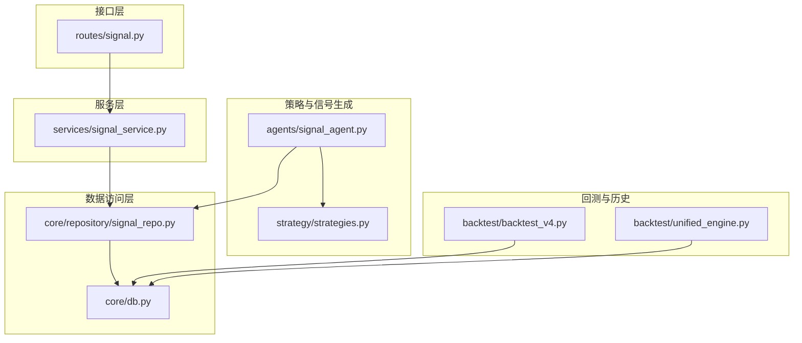
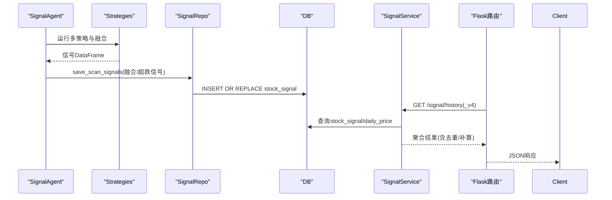
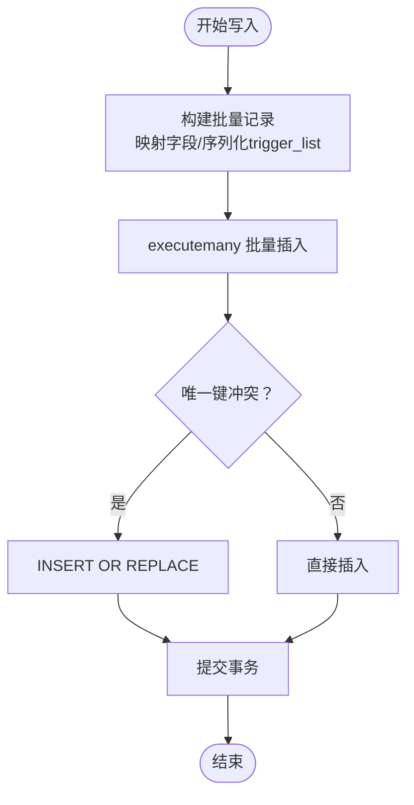
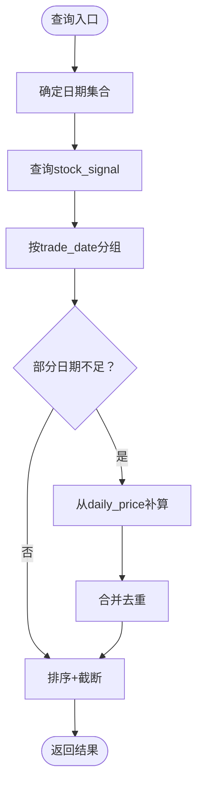
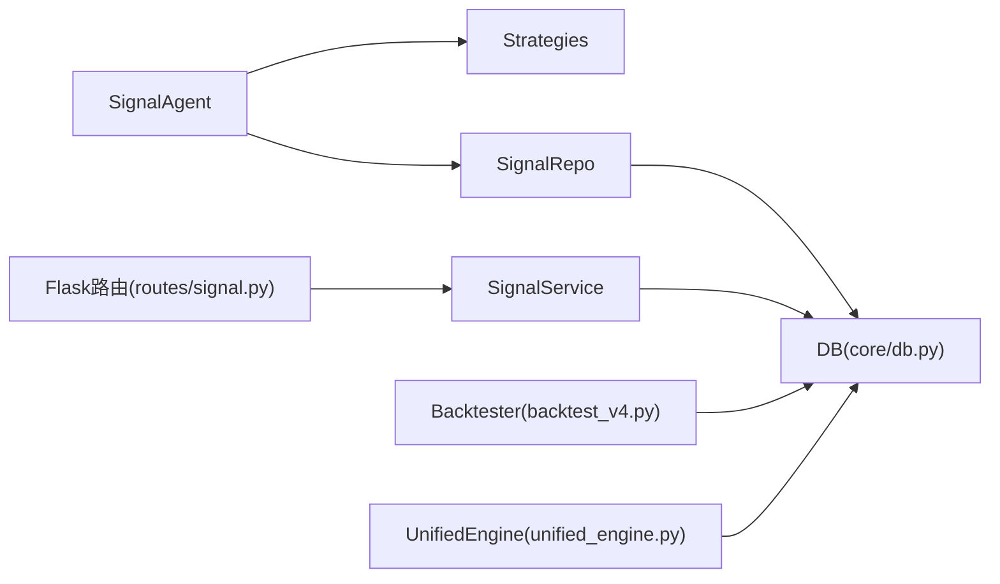

# 策略信号仓库

<cite>
**本文引用的文件**
- [core/repository/signal_repo.py](file://core/repository/signal_repo.py)
- [services/signal_service.py](file://services/signal_service.py)
- [routes/signal.py](file://routes/signal.py)
- [agents/signal_agent.py](file://agents/signal_agent.py)
- [strategy/strategies.py](file://strategy/strategies.py)
- [backtest/backtest_v4.py](file://backtest/backtest_v4.py)
- [core/db.py](file://core/db.py)
- [backtest/unified_engine.py](file://backtest/unified_engine.py)
</cite>

## 目录
1. [简介](#简介)
2. [项目结构](#项目结构)
3. [核心组件](#核心组件)
4. [架构总览](#架构总览)
5. [详细组件分析](#详细组件分析)
6. [依赖分析](#依赖分析)
7. [性能考量](#性能考量)
8. [故障排查指南](#故障排查指南)
9. [结论](#结论)
10. [附录](#附录)

## 简介
本文件面向AIQuant策略信号仓库，聚焦SignalRepo在多策略融合系统中的关键作用与数据流转机制。内容涵盖：
- 信号存储格式与字段设计（信号类型、强度、时间戳等）
- 批量写入优化与并发安全
- 查询多维度筛选（时间范围、股票池、信号类型等）
- 归档策略与存储空间优化
- 信号合并算法与去重逻辑
- 回测数据的特殊处理与历史兼容
- 信号处理API使用示例与性能优化建议

## 项目结构
围绕信号处理的关键模块分布如下：
- 数据访问层：core/repository/signal_repo.py
- 业务服务层：services/signal_service.py
- 路由接口层：routes/signal.py
- 策略与信号生成：agents/signal_agent.py、strategy/strategies.py
- 回测与历史兼容：backtest/backtest_v4.py、backtest/unified_engine.py
- 数据库与索引：core/db.py

图表来源
- [routes/signal.py:12-46](file://routes/signal.py#L12-L46)
- [services/signal_service.py:12-243](file://services/signal_service.py#L12-L243)
- [core/repository/signal_repo.py:14-119](file://core/repository/signal_repo.py#L14-L119)
- [core/db.py:26-40](file://core/db.py#L26-L40)
- [agents/signal_agent.py:41-213](file://agents/signal_agent.py#L41-L213)
- [strategy/strategies.py:367-430](file://strategy/strategies.py#L367-L430)
- [backtest/backtest_v4.py:218-581](file://backtest/backtest_v4.py#L218-L581)
- [backtest/unified_engine.py:59-143](file://backtest/unified_engine.py#L59-L143)

章节来源
- [routes/signal.py:12-46](file://routes/signal.py#L12-L46)
- [services/signal_service.py:12-243](file://services/signal_service.py#L12-L243)
- [core/repository/signal_repo.py:14-119](file://core/repository/signal_repo.py#L14-L119)
- [core/db.py:26-40](file://core/db.py#L26-L40)
- [agents/signal_agent.py:41-213](file://agents/signal_agent.py#L41-L213)
- [strategy/strategies.py:367-430](file://strategy/strategies.py#L367-L430)
- [backtest/backtest_v4.py:218-581](file://backtest/backtest_v4.py#L218-L581)
- [backtest/unified_engine.py:59-143](file://backtest/unified_engine.py#L59-L143)

## 核心组件
- 信号仓库（SignalRepo）：负责将策略扫描结果持久化至stock_signal表，并提供查询接口。
- 信号服务（SignalService）：聚合历史信号，支持融合与超跌反弹两类查询，包含去重与补算逻辑。
- 信号代理（SignalAgent）：运行多策略扫描，生成候选列表并写入数据库。
- 策略框架（Strategies）：定义五类基础策略与融合算法，输出标准化信号列。
- 回测模块：提供超跌反弹策略回测与通用回测引擎框架，支撑历史兼容与性能评估。

章节来源
- [core/repository/signal_repo.py:14-119](file://core/repository/signal_repo.py#L14-L119)
- [services/signal_service.py:12-243](file://services/signal_service.py#L12-L243)
- [agents/signal_agent.py:41-213](file://agents/signal_agent.py#L41-L213)
- [strategy/strategies.py:367-430](file://strategy/strategies.py#L367-L430)
- [backtest/backtest_v4.py:218-581](file://backtest/backtest_v4.py#L218-L581)
- [backtest/unified_engine.py:59-143](file://backtest/unified_engine.py#L59-L143)

## 架构总览
信号在系统中的流转路径如下：
- 策略扫描：SignalAgent调用五类策略与融合算法，生成候选信号。
- 写入仓库：save_scan_signals将融合与超跌反弹信号写入stock_signal表。
- 查询服务：SignalService按时间范围与阈值聚合，必要时从daily_price补算缺失信号。
- 接口暴露：Flask路由将查询结果返回给前端或外部系统。
- 回测验证：Backtester使用stock_signal或daily_price进行历史回测与性能评估。

图表来源
- [agents/signal_agent.py:85-94](file://agents/signal_agent.py#L85-L94)
- [strategy/strategies.py:367-430](file://strategy/strategies.py#L367-L430)
- [core/repository/signal_repo.py:46-99](file://core/repository/signal_repo.py#L46-L99)
- [services/signal_service.py:12-243](file://services/signal_service.py#L12-L243)
- [routes/signal.py:12-46](file://routes/signal.py#L12-L46)

## 详细组件分析

### 信号存储格式与字段设计
- stock_signal表用于存放每日策略扫描推荐，字段覆盖：
  - 时间维度：scan_date（扫描日期）、trade_date（交易日）
  - 基本信息：code、name、price
  - 融合强度：fusion_score（融合总分）、vol_score、ma_score、diverge_score、bottom_score、whale_score
  - 触发条件：trigger_list（JSON数组，如“放量突破”、“均线粘合”等）
  - 交易参数：buy_price、stop_loss、take_profit、buy_volume、buy_money
  - 其他：sent_wechat、created_at
- signal_records表用于兼容旧版筛选记录，字段包含scan_time、trade_date、code、name、price、score、stop_loss、take_profit、buy_volume、buy_money、sent_wechat等。

字段设计要点
- 强度分值：融合分（0-50）、各策略分（0-10）；服务层对融合分进行阈值过滤与排序。
- 触发列表：trigger_list采用JSON字符串存储，便于扩展触发标签。
- 时间戳：scan_date与trade_date分离，便于按扫描日期或交易日聚合。

章节来源
- [core/db.py:112-136](file://core/db.py#L112-L136)
- [core/db.py:138-154](file://core/db.py#L138-L154)
- [core/repository/signal_repo.py:46-99](file://core/repository/signal_repo.py#L46-L99)
- [services/signal_service.py:30-41](file://services/signal_service.py#L30-L41)

### 批量写入优化与并发安全
- 批量插入：使用executemany一次性提交多条记录，减少往返次数。
- 并发控制：连接池采用WAL模式与NORMAL同步级别，提升并发写入吞吐；事务在上下文管理器中自动提交/回滚。
- 去重策略：stock_signal使用scan_date+code唯一索引，INSERT OR REPLACE确保同一天同一股票的信号被替换，避免重复。

图表来源
- [core/repository/signal_repo.py:46-99](file://core/repository/signal_repo.py#L46-L99)
- [core/db.py:26-40](file://core/db.py#L26-L40)

章节来源
- [core/repository/signal_repo.py:46-99](file://core/repository/signal_repo.py#L46-L99)
- [core/db.py:26-40](file://core/db.py#L26-L40)

### 查询多维度筛选
- 时间范围：支持start_date、end_date与min_score、limit参数。
- 过滤条件：
  - 融合历史：按trade_date集合过滤，fusion_score≥阈值，排除“超跌反弹”触发标签。
  - v4超跌反弹：按trade_date集合过滤，fusion_score≥阈值且trigger_list包含“超跌反弹”。
- 补算逻辑：当某交易日stock_signal不足3条时，从daily_price按fusion_score或bottom_score补足，避免面板展示不完整。
- 排序与截断：按日期降序、分数降序排序，并限制每日期限。

图表来源
- [services/signal_service.py:12-122](file://services/signal_service.py#L12-L122)
- [services/signal_service.py:125-243](file://services/signal_service.py#L125-L243)

章节来源
- [services/signal_service.py:12-122](file://services/signal_service.py#L12-L122)
- [services/signal_service.py:125-243](file://services/signal_service.py#L125-L243)

### 信号合并算法与去重逻辑
- 策略融合：fuse_signals对各策略得分进行映射（0-3→0-10）与加权求和，最终得到FUSION_SCORE（0-50），并设置BUY_SIGNAL阈值。
- 去重策略：
  - stock_signal唯一索引：scan_date+code，保证同一天同一股票仅保留一条记录。
  - 补算去重：在v4补算场景中，若daily_price中股票已在分组中出现，则跳过，避免重复。

章节来源
- [strategy/strategies.py:367-430](file://strategy/strategies.py#L367-L430)
- [core/db.py:446-456](file://core/db.py#L446-L456)
- [services/signal_service.py:90-112](file://services/signal_service.py#L90-L112)

### 回测数据的特殊处理与历史兼容
- 超跌反弹策略回测：backtest_v4.py提供v4策略回测，支持参数扫描与择时开关；回测引擎可从stock_signal或daily_price读取信号。
- 历史兼容：当stock_signal中缺失某些日期的信号时，服务层会从daily_price补算，确保回测与展示的一致性。
- 通用回测引擎：unified_engine.py定义了统一的回测框架，未来将逐步替代现有回测实现。

章节来源
- [backtest/backtest_v4.py:218-581](file://backtest/backtest_v4.py#L218-L581)
- [services/signal_service.py:75-112](file://services/signal_service.py#L75-L112)
- [backtest/unified_engine.py:59-143](file://backtest/unified_engine.py#L59-L143)

### 信号处理API使用示例
- 融合历史查询
  - 请求：GET /api/signal/history?start_date=&end_date=&min_score=&limit=
  - 响应：包含start_date、end_date、dates、groups（按日期分组的信号列表）
- v4超跌反弹历史查询
  - 请求：GET /api/signal/history_v4?start_date=&end_date=&min_score=&limit=
  - 响应：包含strategy_scores与triggered字段，便于前端展示各策略触发情况

章节来源
- [routes/signal.py:12-46](file://routes/signal.py#L12-L46)
- [services/signal_service.py:12-122](file://services/signal_service.py#L12-L122)
- [services/signal_service.py:125-243](file://services/signal_service.py#L125-L243)

## 依赖分析
- SignalRepo依赖core/db.py提供的连接管理与表结构。
- SignalService依赖core/db.py执行SQL查询与聚合。
- SignalAgent依赖strategy/strategies.py生成信号，并调用SignalRepo写入。
- 回测模块依赖core/db.py读取历史行情与信号，以及策略模块生成信号。

图表来源
- [agents/signal_agent.py:41-213](file://agents/signal_agent.py#L41-L213)
- [strategy/strategies.py:367-430](file://strategy/strategies.py#L367-L430)
- [core/repository/signal_repo.py:14-119](file://core/repository/signal_repo.py#L14-L119)
- [core/db.py:26-40](file://core/db.py#L26-L40)
- [services/signal_service.py:12-243](file://services/signal_service.py#L12-L243)
- [routes/signal.py:12-46](file://routes/signal.py#L12-L46)
- [backtest/backtest_v4.py:218-581](file://backtest/backtest_v4.py#L218-L581)
- [backtest/unified_engine.py:59-143](file://backtest/unified_engine.py#L59-L143)

## 性能考量
- 批量写入：使用executemany与INSERT OR REPLACE，减少SQL往返与重复写入。
- 并发与一致性：WAL模式与事务上下文管理器保障并发写入与原子性。
- 查询优化：按trade_date建立索引，查询时限定日期集合与阈值，避免全表扫描。
- 补算策略：仅对缺失日期进行补算，降低查询复杂度。
- 历史回测：从stock_signal读取信号可显著提升回测效率；若需更高精度，可从daily_price补算。

章节来源
- [core/repository/signal_repo.py:46-99](file://core/repository/signal_repo.py#L46-L99)
- [core/db.py:26-40](file://core/db.py#L26-L40)
- [services/signal_service.py:12-122](file://services/signal_service.py#L12-L122)
- [services/signal_service.py:125-243](file://services/signal_service.py#L125-L243)

## 故障排查指南
- 写入异常：检查executemany参数映射与JSON序列化；确认唯一索引冲突处理生效。
- 查询无数据：确认start_date/end_date范围与min_score设置；检查stock_signal与daily_price是否存在对应日期。
- 补算缺失：若某日期信号不足，确认daily_price中是否具备fusion_score/bottom_score等字段。
- 回测异常：核对策略返回的DataFrame是否包含open列（T+1执行需要）；检查信号日期与行情日期匹配。

章节来源
- [core/repository/signal_repo.py:46-99](file://core/repository/signal_repo.py#L46-L99)
- [services/signal_service.py:75-112](file://services/signal_service.py#L75-L112)
- [backtest/unified_engine.py:108-132](file://backtest/unified_engine.py#L108-L132)

## 结论
SignalRepo在AIQuant多策略融合系统中承担“信号汇聚与查询”的关键角色。通过标准化的存储格式、批量写入与并发安全机制、多维度查询与补算逻辑，以及与回测模块的历史兼容设计，实现了高效、可靠、可扩展的信号处理链路。建议在生产环境中持续关注索引维护、批量写入参数与阈值设置，并结合回测结果优化策略权重与阈值，以进一步提升信号质量与回测稳定性。

## 附录
- 关键API
  - GET /api/signal/history：融合历史信号查询
  - GET /api/signal/history_v4：超跌反弹历史信号查询
- 关键表
  - stock_signal：每日策略扫描推荐
  - daily_price：行情与策略评分
  - signal_records：兼容旧版筛选记录