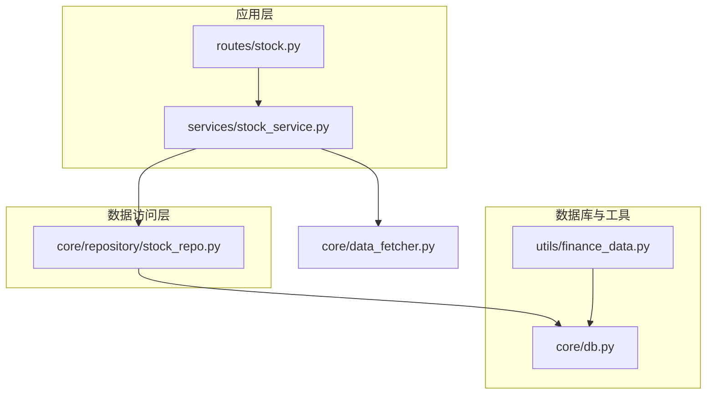
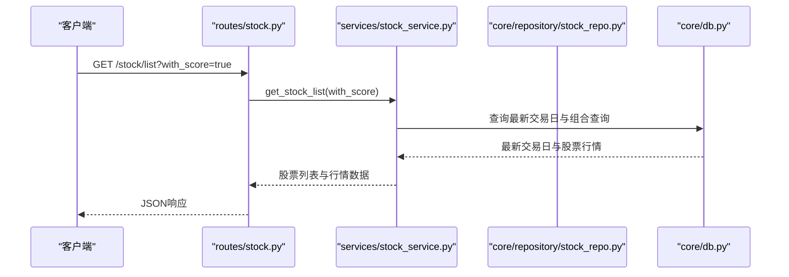
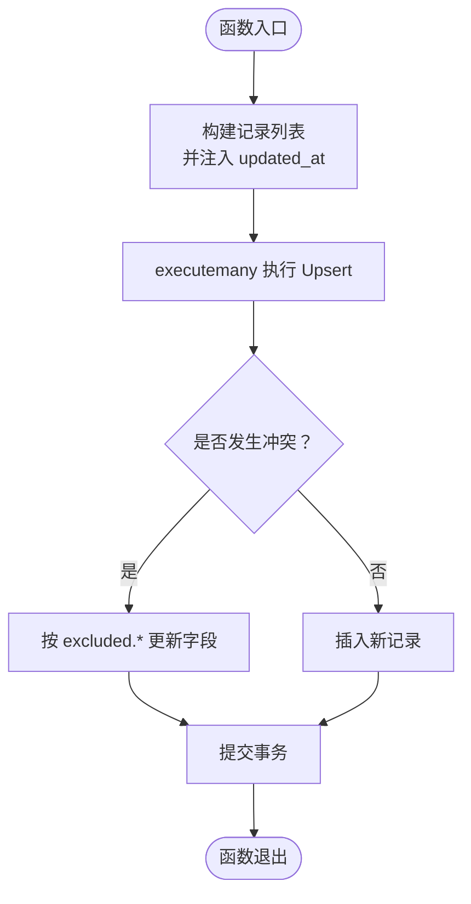
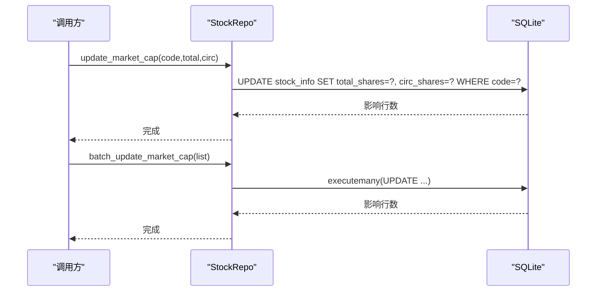
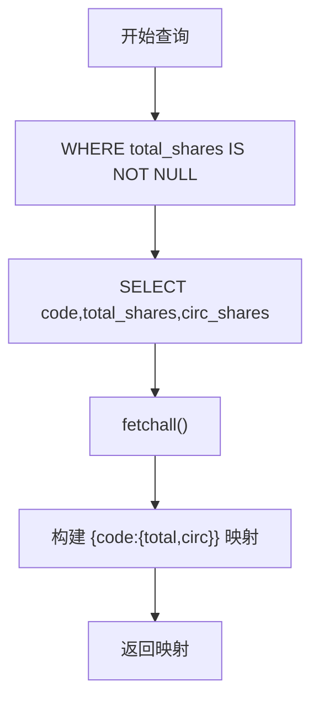
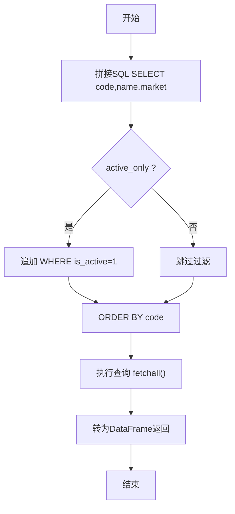
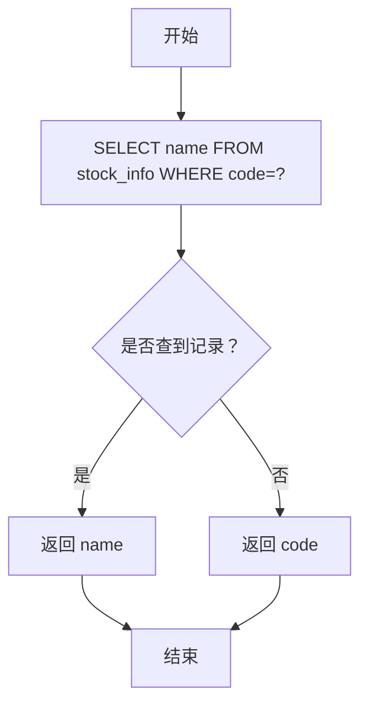
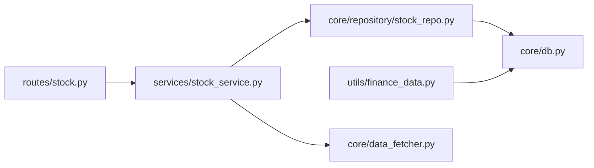

# 股票信息仓库

<cite>
**本文引用的文件**
- [stock_repo.py](file://core/repository/stock_repo.py)
- [db.py](file://core/db.py)
- [finance_data.py](file://utils/finance_data.py)
- [stock_service.py](file://services/stock_service.py)
- [stock.py](file://routes/stock.py)
- [data_fetcher.py](file://core/data_fetcher.py)
- [test_repository.py](file://tests/test_repository.py)
</cite>

## 目录
1. [简介](#简介)
2. [项目结构](#项目结构)
3. [核心组件](#核心组件)
4. [架构总览](#架构总览)
5. [详细组件分析](#详细组件分析)
6. [依赖分析](#依赖分析)
7. [性能考量](#性能考量)
8. [故障排查指南](#故障排查指南)
9. [结论](#结论)
10. [附录](#附录)

## 简介
本文件面向AIQuant量化系统的“股票信息仓库”（StockRepo），系统性阐述其设计目标、在量化体系中的关键作用，并深入解析以下重点功能：
- upsert_stock_list 批量写入/更新股票列表的实现原理，包括 ON CONFLICT 冲突处理机制与时间戳更新策略
- update_market_cap 与 batch_update_market_cap 两种市值更新方式的区别与适用场景
- get_market_cap_map 获取股本映射表的性能优化设计
- get_all_stocks 股票列表查询的过滤条件与排序逻辑
- get_stock_name 股票名称查询的缓存策略与错误处理机制
- 提供完整的API使用示例与最佳实践建议

## 项目结构
围绕“股票信息仓库”的相关模块分布如下：
- 数据访问层：core/repository/stock_repo.py
- 数据库与表结构：core/db.py
- 财务数据缓存与更新：utils/finance_data.py
- 业务服务层：services/stock_service.py
- 接口路由层：routes/stock.py
- 数据源与历史行情：core/data_fetcher.py
- 单元测试：tests/test_repository.py

图表来源
- [stock.py:1-88](file://routes/stock.py#L1-L88)
- [stock_service.py:1-194](file://services/stock_service.py#L1-L194)
- [stock_repo.py:1-80](file://core/repository/stock_repo.py#L1-L80)
- [db.py:1-1213](file://core/db.py#L1-L1213)
- [finance_data.py:1-261](file://utils/finance_data.py#L1-L261)
- [data_fetcher.py:1-200](file://core/data_fetcher.py#L1-L200)

章节来源
- [stock_repo.py:1-80](file://core/repository/stock_repo.py#L1-L80)
- [db.py:1-1213](file://core/db.py#L1-L1213)

## 核心组件
- StockRepo（数据访问层）：提供股票基本信息的批量写入、市值更新、列表查询、名称查询等能力
- 数据库层：stock_info 表承载股票基础信息与市值字段；通过SQLite WAL模式与PRAGMA配置提升并发与性能
- 财务数据缓存：utils/finance_data.py 提供内存缓存与字段迁移，减少对数据库的频繁查询
- 服务与路由：routes/stock.py 与 services/stock_service.py 将仓库能力暴露为HTTP接口

章节来源
- [stock_repo.py:13-79](file://core/repository/stock_repo.py#L13-L79)
- [db.py:63-69](file://core/db.py#L63-L69)
- [finance_data.py:29-68](file://utils/finance_data.py#L29-L68)

## 架构总览
StockRepo在系统中的职责与交互如下：
- 负责 stock_info 表的写入与更新，支持批量Upsert与单条更新
- 通过 get_all_stocks、get_stock_name 等方法为上层服务与路由提供查询能力
- 与数据库层协作，利用SQLite原生的 ON CONFLICT 与索引优化查询性能
- 与财务数据缓存协同，避免重复查询与跨模块重复迁移

图表来源
- [stock.py:27-45](file://routes/stock.py#L27-L45)
- [stock_service.py:23-45](file://services/stock_service.py#L23-L45)
- [db.py:26-39](file://core/db.py#L26-L39)

## 详细组件分析

### upsert_stock_list 批量写入/更新
- 设计目的：统一维护股票清单，避免重复插入，保证字段一致性与更新时间戳
- 实现要点：
  - 使用 executemany 批量执行 INSERT … ON CONFLICT(code) DO UPDATE
  - 在传入记录中统一注入 updated_at 字段，确保每次Upsert都更新时间戳
  - 通过连接上下文管理器确保事务提交或回滚
- 冲突处理机制：当 code 已存在时，按 excluded.* 更新 name、market、updated_at
- 时间戳更新策略：以当前时间作为 updated_at，便于追踪最后变更时间

图表来源
- [stock_repo.py:13-28](file://core/repository/stock_repo.py#L13-L28)
- [db.py:470-486](file://core/db.py#L470-L486)

章节来源
- [stock_repo.py:13-28](file://core/repository/stock_repo.py#L13-L28)
- [db.py:470-486](file://core/db.py#L470-L486)

### update_market_cap 与 batch_update_market_cap
- update_market_cap（单条更新）
  - 适用场景：实时更新某只股票的总股本与流通股本
  - 实现：直接 UPDATE stock_info SET total_shares=?, circ_shares=? WHERE code=?
- batch_update_market_cap（批量更新）
  - 适用场景：从外部数据源批量导入或刷新大量股票的股本数据
  - 实现：使用 executemany 批量执行 UPDATE，显著降低网络与事务开销
- 选择建议：
  - 单次更新：优先 update_market_cap，语义清晰
  - 大规模导入：优先 batch_update_market_cap，吞吐更高

图表来源
- [stock_repo.py:31-50](file://core/repository/stock_repo.py#L31-L50)
- [db.py:488-507](file://core/db.py#L488-L507)

章节来源
- [stock_repo.py:31-50](file://core/repository/stock_repo.py#L31-L50)
- [db.py:488-507](file://core/db.py#L488-L507)

### get_market_cap_map 股本映射表的性能优化
- 设计目标：快速获取所有具备总股本数据的股票映射，用于市值计算与筛选
- 实现要点：
  - 查询 stock_info 中 total_shares IS NOT NULL 的记录
  - 返回字典结构 {code: {"total_shares": ..., "circ_shares": ...}}
- 性能优化设计：
  - 该查询仅在存在总股本数据时返回，避免无效数据参与计算
  - 若需进一步加速，可在 stock_info 上建立针对 total_shares/circ_shares 的索引（当前仓库未显式创建）

图表来源
- [stock_repo.py:53-59](file://core/repository/stock_repo.py#L53-L59)
- [db.py:510-516](file://core/db.py#L510-L516)

章节来源
- [stock_repo.py:53-59](file://core/repository/stock_repo.py#L53-L59)
- [db.py:510-516](file://core/db.py#L510-L516)

### get_all_stocks 股票列表查询
- 过滤条件：
  - active_only=True 时，仅返回 is_active=1 的股票
  - active_only=False 时，返回全部股票
- 排序逻辑：按 code 升序排列
- 输出：返回 pandas DataFrame，包含 code、name、market 三列

图表来源
- [stock_repo.py:62-70](file://core/repository/stock_repo.py#L62-L70)
- [db.py:519-527](file://core/db.py#L519-L527)

章节来源
- [stock_repo.py:62-70](file://core/repository/stock_repo.py#L62-L70)
- [db.py:519-527](file://core/db.py#L519-L527)

### get_stock_name 股票名称查询的缓存策略与错误处理
- 错误处理机制：
  - 当数据库未查到对应 code 时，返回 code 本身，避免抛出异常
- 缓存策略：
  - 仓库层未内置缓存；但 utils/finance_data.py 提供了针对财务字段的内存缓存（total_shares、float_shares、eps、pe_ttm、pb），并在更新时清理对应键值
  - 若上层需要对 get_stock_name 进行缓存，可在业务层引入LRU缓存或进程内缓存，避免高频重复查询

图表来源
- [stock_repo.py:73-79](file://core/repository/stock_repo.py#L73-L79)
- [db.py:530-536](file://core/db.py#L530-L536)
- [finance_data.py:29-68](file://utils/finance_data.py#L29-L68)

章节来源
- [stock_repo.py:73-79](file://core/repository/stock_repo.py#L73-L79)
- [db.py:530-536](file://core/db.py#L530-L536)
- [finance_data.py:29-68](file://utils/finance_data.py#L29-L68)

### API使用示例与最佳实践
- 批量写入/更新股票列表
  - 入参：records 为包含 code、name、market 的字典列表
  - 建议：在数据源更新后统一调用，确保 updated_at 字段被正确更新
  - 参考路径：[stock_repo.py:13-28](file://core/repository/stock_repo.py#L13-L28)
- 单只股票市值更新
  - 入参：code、total_shares、circ_shares
  - 建议：实时性要求高时使用
  - 参考路径：[stock_repo.py:31-37](file://core/repository/stock_repo.py#L31-L37)
- 批量市值更新
  - 入参：records 为包含 code、total_shares、circ_shares 的字典列表
  - 建议：外部数据源导入时使用
  - 参考路径：[stock_repo.py:40-50](file://core/repository/stock_repo.py#L40-L50)
- 获取股本映射表
  - 返回：{code: {"total_shares": ..., "circ_shares": ...}}
  - 建议：用于市值计算与筛选逻辑
  - 参考路径：[stock_repo.py:53-59](file://core/repository/stock_repo.py#L53-L59)
- 获取股票列表
  - 参数：active_only（默认True）、with_score（服务层参数）
  - 建议：结合 is_active 字段进行有效股票筛选
  - 参考路径：[stock_repo.py:62-70](file://core/repository/stock_repo.py#L62-L70)
- 获取股票名称
  - 返回：name 或 code
  - 建议：若频繁调用，可在业务层增加缓存
  - 参考路径：[stock_repo.py:73-79](file://core/repository/stock_repo.py#L73-L79)

最佳实践建议
- 批量写入优先使用 upsert_stock_list，统一注入 updated_at，便于审计与增量同步
- 市值数据更新优先使用 batch_update_market_cap，减少事务次数
- get_all_stocks 默认 active_only=True，确保筛选到活跃股票
- get_stock_name 未内置缓存，建议在上层业务层增加缓存以降低查询压力
- 对于大规模数据导入，建议先清理旧数据再批量Upsert，避免重复冲突

章节来源
- [stock_repo.py:13-79](file://core/repository/stock_repo.py#L13-L79)
- [stock_service.py:23-45](file://services/stock_service.py#L23-L45)

## 依赖分析
- StockRepo 依赖数据库连接管理与表结构定义
- 服务层依赖 StockRepo 与数据源模块
- 路由层依赖服务层
- 财务数据缓存与字段迁移独立于 StockRepo，但与 stock_info 表字段相关

图表来源
- [stock.py:1-88](file://routes/stock.py#L1-L88)
- [stock_service.py:1-194](file://services/stock_service.py#L1-L194)
- [stock_repo.py:1-80](file://core/repository/stock_repo.py#L1-L80)
- [db.py:1-1213](file://core/db.py#L1-L1213)
- [finance_data.py:1-261](file://utils/finance_data.py#L1-L261)
- [data_fetcher.py:1-200](file://core/data_fetcher.py#L1-L200)

章节来源
- [stock_repo.py:1-10](file://core/repository/stock_repo.py#L1-L10)
- [db.py:63-69](file://core/db.py#L63-L69)

## 性能考量
- SQLite WAL模式与PRAGMA配置提升并发与写入性能
- executemany 批量执行减少网络往返与事务开销
- ON CONFLICT(code) DO UPDATE 避免重复插入，减少索引冲突
- 建议：
  - 为 total_shares/circ_shares 建立索引以加速 get_market_cap_map 查询
  - 对 get_stock_name 引入上层缓存，降低热点查询压力
  - 批量导入时控制批次大小，避免一次性过大导致锁竞争

[本节为通用性能建议，不直接分析具体文件]

## 故障排查指南
- 插入冲突
  - 现象：重复 code 导致冲突
  - 处理：使用 Upsert 逻辑自动更新，确认 updated_at 是否正确更新
  - 参考路径：[stock_repo.py:13-28](file://core/repository/stock_repo.py#L13-L28)
- 未找到股票名称
  - 现象：get_stock_name 返回 code
  - 处理：检查 stock_info 中是否存在该 code；如不存在，先调用 upsert_stock_list 写入
  - 参考路径：[stock_repo.py:73-79](file://core/repository/stock_repo.py#L73-L79)
- 市值数据为空
  - 现象：get_market_cap_map 返回空或部分缺失
  - 处理：确认 batch_update_market_cap 是否已执行；检查 total_shares 是否为NULL
  - 参考路径：[stock_repo.py:53-59](file://core/repository/stock_repo.py#L53-L59)
- 路由层异常
  - 现象：HTTP 500
  - 处理：查看 traceback 日志，定位服务层异常；确认数据库连接与表结构
  - 参考路径：[stock.py:30-34](file://routes/stock.py#L30-L34)

章节来源
- [stock_repo.py:13-79](file://core/repository/stock_repo.py#L13-L79)
- [stock.py:30-34](file://routes/stock.py#L30-L34)

## 结论
StockRepo在AIQuant量化系统中承担着股票基础信息与市值数据的统一维护职责。通过 Upsert 批量写入、ON CONFLICT 冲突处理与时间戳更新策略，确保数据一致性与可追溯性；通过批量市值更新与映射表查询，支撑后续的策略计算与筛选。建议在上层业务中引入缓存与索引优化，以进一步提升整体性能与稳定性。

[本节为总结性内容，不直接分析具体文件]

## 附录
- 表结构参考（stock_info）
  - 字段：code（主键）、name、market、is_active、updated_at、total_shares、circ_shares
  - 参考路径：[db.py:63-69](file://core/db.py#L63-L69)
- 单元测试验证
  - 验证 StockRepo 可导入与基本函数可用性
  - 参考路径：[test_repository.py:14-18](file://tests/test_repository.py#L14-L18)

章节来源
- [db.py:63-69](file://core/db.py#L63-L69)
- [test_repository.py:14-18](file://tests/test_repository.py#L14-L18)