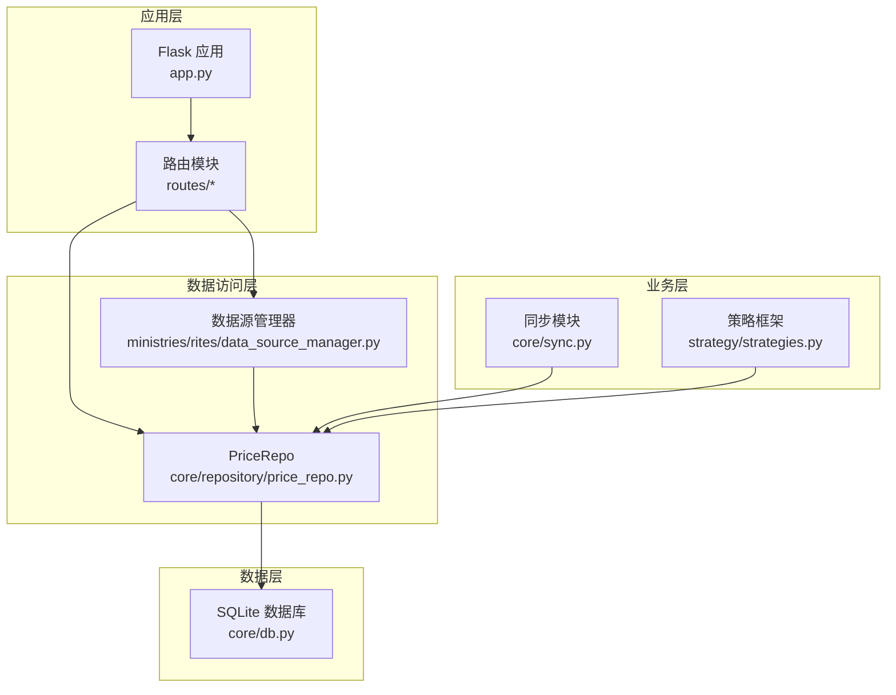
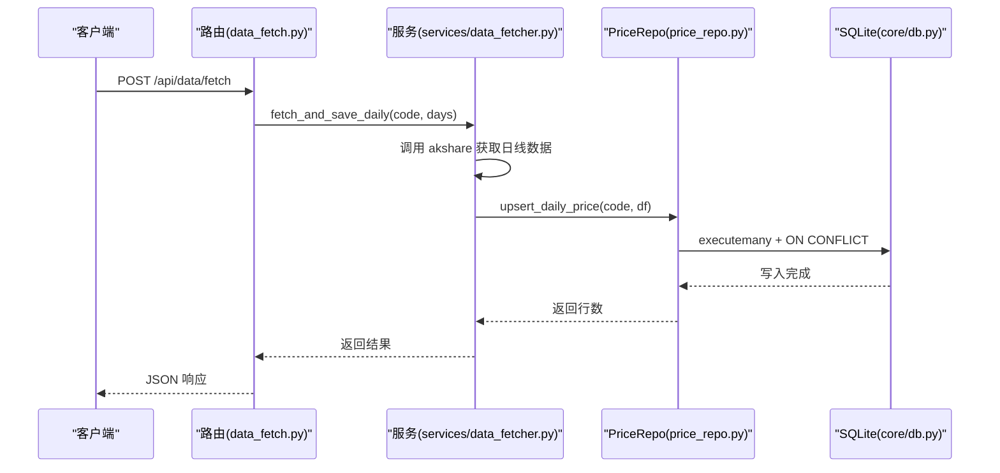
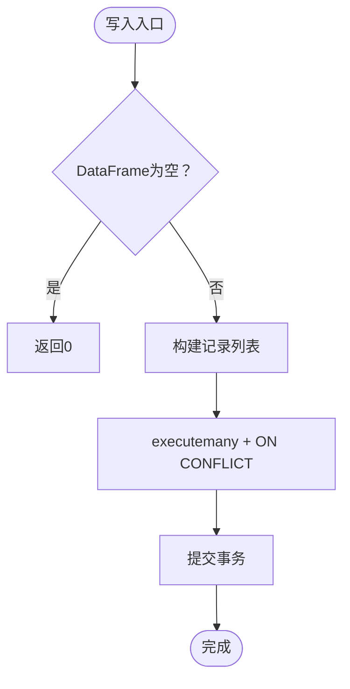
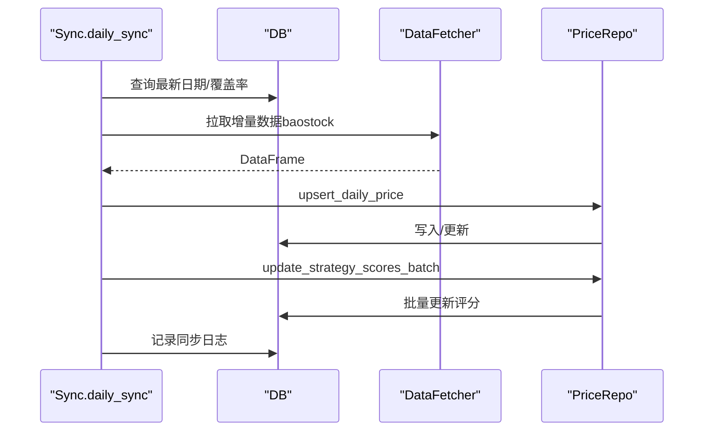
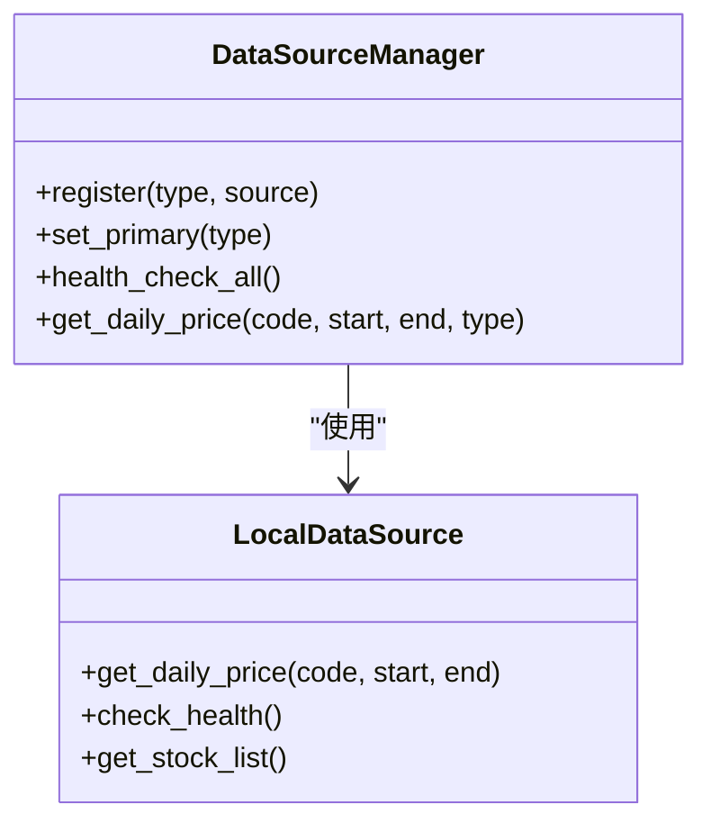
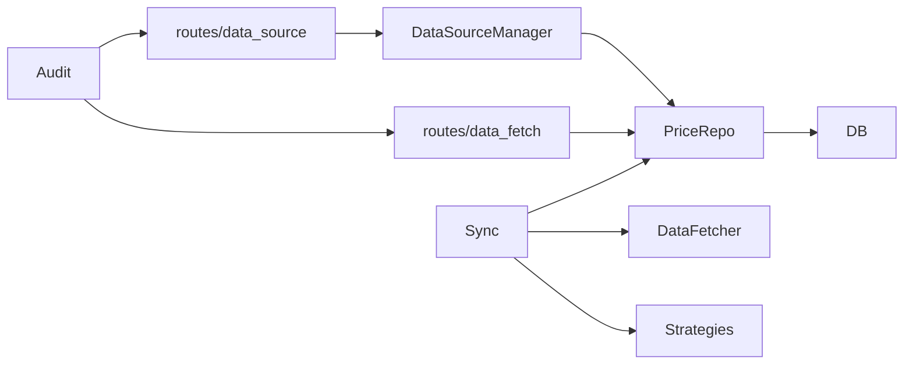

# 行情数据仓库

<cite>
**本文引用的文件**
- [price_repo.py](file://core/repository/price_repo.py)
- [db.py](file://core/db.py)
- [data_fetcher.py](file://core/data_fetcher.py)
- [sync.py](file://core/sync.py)
- [data_fetch.py](file://routes/data_fetch.py)
- [data_source.py](file://routes/data_source.py)
- [data_source_manager.py](file://ministries/rites/data_source_manager.py)
- [strategies.py](file://strategy/strategies.py)
- [app.py](file://app.py)
- [audit.py](file://core/audit.py)
- [test_repository.py](file://tests/test_repository.py)
</cite>

## 目录
1. [简介](#简介)
2. [项目结构](#项目结构)
3. [核心组件](#核心组件)
4. [架构总览](#架构总览)
5. [详细组件分析](#详细组件分析)
6. [依赖关系分析](#依赖关系分析)
7. [性能考量](#性能考量)
8. [故障排查指南](#故障排查指南)
9. [结论](#结论)
10. [附录](#附录)

## 简介
本文件面向AIQuant量化系统的“行情数据仓库”，聚焦PriceRepo在系统中的核心地位与数据流转。文档围绕以下主题展开：
- 日线行情数据的存储结构与索引设计
- 批量导入的性能优化与事务处理
- 历史数据查询的时间范围筛选与完整性校验
- 去重与异常数据处理流程
- 高频访问的缓存策略与内存管理
- 数据同步机制与增量更新
- API使用示例与性能调优建议

## 项目结构
AIQuant采用模块化分层设计，行情数据仓库位于核心层，配合数据源、同步、策略与路由模块协同工作。关键目录与文件如下：
- 核心仓库层：core/repository/price_repo.py
- 数据库层：core/db.py（SQLite建表、索引、连接管理）
- 数据源与抓取：core/data_fetcher.py（baostock/akshare）
- 同步与策略：core/sync.py（初始化/增量同步、策略评分写入）
- 路由与服务：routes/data_fetch.py、routes/data_source.py
- 数据源管理：ministries/rites/data_source_manager.py
- 策略框架：strategy/strategies.py
- 审计日志：core/audit.py
- 测试：tests/test_repository.py

图表来源
- [app.py:1-164](file://app.py#L1-L164)
- [routes/data_fetch.py:1-82](file://routes/data_fetch.py#L1-L82)
- [routes/data_source.py:1-112](file://routes/data_source.py#L1-L112)
- [core/sync.py:1-760](file://core/sync.py#L1-L760)
- [strategy/strategies.py:1-431](file://strategy/strategies.py#L1-L431)
- [core/repository/price_repo.py:1-237](file://core/repository/price_repo.py#L1-L237)
- [core/db.py:1-800](file://core/db.py#L1-L800)
- [ministries/rites/data_source_manager.py:1-190](file://ministries/rites/data_source_manager.py#L1-L190)

章节来源
- [app.py:1-164](file://app.py#L1-L164)
- [routes/data_fetch.py:1-82](file://routes/data_fetch.py#L1-L82)
- [routes/data_source.py:1-112](file://routes/data_source.py#L1-L112)
- [core/sync.py:1-760](file://core/sync.py#L1-L760)
- [strategy/strategies.py:1-431](file://strategy/strategies.py#L1-L431)
- [core/repository/price_repo.py:1-237](file://core/repository/price_repo.py#L1-L237)
- [core/db.py:1-800](file://core/db.py#L1-L800)
- [ministries/rites/data_source_manager.py:1-190](file://ministries/rites/data_source_manager.py#L1-L190)

## 核心组件
- PriceRepo（核心）：封装日线行情与指数行情的写入、查询、去重与时间范围筛选，提供最新交易日、覆盖率统计等便捷方法。
- 数据库层（DB）：负责SQLite连接、WAL模式、索引与迁移、建表脚本。
- 数据源与抓取（DataFetcher）：baostock为主、akshare为备，提供历史行情、指数、实时价格与股票列表。
- 同步模块（Sync）：初始化全量历史、每日增量同步、策略评分批量写入、断点续传与缓存。
- 路由与服务：对外提供HTTP接口，支持单/批量拉取、状态查询与数据源健康检查。
- 策略框架：提供5种独立策略与融合评分，供同步模块批量写入策略分。
- 审计日志：统一记录API调用与关键操作，便于追踪与合规。

章节来源
- [core/repository/price_repo.py:13-237](file://core/repository/price_repo.py#L13-L237)
- [core/db.py:57-467](file://core/db.py#L57-L467)
- [core/data_fetcher.py:79-223](file://core/data_fetcher.py#L79-L223)
- [core/sync.py:319-701](file://core/sync.py#L319-L701)
- [routes/data_fetch.py:17-82](file://routes/data_fetch.py#L17-L82)
- [routes/data_source.py:25-112](file://routes/data_source.py#L25-L112)
- [strategy/strategies.py:367-431](file://strategy/strategies.py#L367-L431)
- [core/audit.py:16-147](file://core/audit.py#L16-L147)

## 架构总览
PriceRepo处于数据访问层的核心位置，向上承接路由与同步模块，向下对接SQLite数据库。数据流的关键节点包括：
- 导入：DataFetcher抓取→PriceRepo批量写入（ON CONFLICT更新）
- 查询：路由/策略通过PriceRepo读取（时间范围过滤、索引利用）
- 同步：Sync模块驱动初始化/增量，策略评分批量写入
- 路由：对外暴露HTTP接口，支持数据源切换与健康检查

图表来源
- [routes/data_fetch.py:17-28](file://routes/data_fetch.py#L17-L28)
- [services/data_fetcher.py:17-74](file://services/data_fetcher.py#L17-L74)
- [core/repository/price_repo.py:13-47](file://core/repository/price_repo.py#L13-L47)
- [core/db.py:26-39](file://core/db.py#L26-L39)

## 详细组件分析

### PriceRepo：日线与指数行情仓库
- 存储结构
  - daily_price：日线OHLCV与指标，含策略评分列（vol_score/ma_score/…/fusion_score），唯一索引(code, trade_date)。
  - index_daily：指数日线OHLCV，唯一索引(code, trade_date)。
- 写入与去重
  - upsert_daily_price：批量executemany + ON CONFLICT(code, trade_date) DO UPDATE，保证幂等与去重。
  - upsert_index_daily：同上，针对指数表。
  - update_strategy_scores_batch：单独更新策略评分列，逐条UPDATE，显式关闭外键约束以避免冲突。
- 查询与筛选
  - get_daily_price/get_index_daily：支持start_date/end_date过滤，自动格式化YYYYMMDD/YYY-MM-DD，返回DataFrame并设置trade_date为索引。
  - get_latest_date/get_latest_date_all/has_today_data/get_stock_count_in_db：提供最新日期、覆盖率与统计。
- 索引设计
  - daily_price：idx_daily_code_date(code, trade_date)，idx_daily_date(trade_date)
  - index_daily：idx_index_code_date(code, trade_date)，idx_index_date(trade_date)
- 事务与并发
  - get_conn使用上下文管理器，自动commit/rollback，WAL模式提升并发写入能力。

图表来源
- [core/repository/price_repo.py:13-47](file://core/repository/price_repo.py#L13-L47)
- [core/db.py:26-39](file://core/db.py#L26-L39)

章节来源
- [core/repository/price_repo.py:13-237](file://core/repository/price_repo.py#L13-L237)
- [core/db.py:57-467](file://core/db.py#L57-L467)

### 数据库层：SQLite建表、索引与连接
- 建表与迁移
  - init_db一次性创建所有表与索引，并对旧表补充策略评分列与唯一索引。
  - WAL模式与NORMAL同步级别平衡性能与可靠性。
- 连接管理
  - get_conn上下文管理器，自动commit/rollback，row_factory=sqlite3.Row便于字典式访问。
- 索引
  - 为高频查询字段建立复合与单列索引，加速按code/trade_date与按日期的查询。

章节来源
- [core/db.py:26-467](file://core/db.py#L26-L467)

### 数据源与抓取：baostock/akshare
- 主数据源：baostock（免费、稳定、无频率限制），备用akshare（多接口降级）。
- 代码格式转换：_to_bs_code/_from_bs_code，适配不同数据源的代码格式。
- 历史行情：_fetch_baostock/_fetch_akshare_fallback，统一列名与类型，过滤无效行。
- 指数数据：get_market_index，支持多数据源与格式标准化。
- 缓存：本地CSV缓存目录，避免重复抓取。

章节来源
- [core/data_fetcher.py:31-223](file://core/data_fetcher.py#L31-L223)

### 同步模块：初始化与增量
- 初始化历史：initial_sync，baostock无频率限制，支持断点续传与批次间隔。
- 增量同步：daily_sync，单线程（baostock不支持多线程），自动计算覆盖率阈值，按交易日推进。
- 策略评分：sync_strategy_score，基于历史全量计算5策略评分并批量写入。
- 指数同步：sync_all_indices，每日同步主要指数至index_daily。
- 断点缓存：.sync_cache目录保存已同步股票集合，支持续传。

图表来源
- [core/sync.py:462-668](file://core/sync.py#L462-L668)
- [core/repository/price_repo.py:50-93](file://core/repository/price_repo.py#L50-L93)
- [core/data_fetcher.py:173-223](file://core/data_fetcher.py#L173-L223)

章节来源
- [core/sync.py:319-701](file://core/sync.py#L319-L701)

### 路由与服务：API与数据源管理
- data_fetch路由：单/批量拉取、状态查询。
- data_source路由：数据源列表、健康检查、切换主数据源。
- 数据源管理器：LocalDataSource直连本地DB；支持扩展其他数据源；自动主备切换。

图表来源
- [ministries/rites/data_source_manager.py:111-178](file://ministries/rites/data_source_manager.py#L111-L178)

章节来源
- [routes/data_fetch.py:17-82](file://routes/data_fetch.py#L17-L82)
- [routes/data_source.py:25-112](file://routes/data_source.py#L25-L112)
- [ministries/rites/data_source_manager.py:72-109](file://ministries/rites/data_source_manager.py#L72-L109)

### 策略评分：融合与写入
- 独立策略：放量突破、均线粘合、量价背离、抄底、主力建仓。
- 融合评分：fuse_signals，将各策略评分映射到0-10再加权融合，输出FUSION_SCORE与BUY_SIGNAL。
- 批量写入：update_strategy_scores_batch，逐条UPDATE，确保历史全量覆盖。

章节来源
- [strategy/strategies.py:36-256](file://strategy/strategies.py#L36-L256)
- [strategy/strategies.py:367-431](file://strategy/strategies.py#L367-L431)
- [core/repository/price_repo.py:50-93](file://core/repository/price_repo.py#L50-L93)

## 依赖关系分析
- PriceRepo依赖DB连接与表结构；同时被Sync与路由模块调用。
- Sync依赖DataFetcher与策略模块，驱动全量/增量与评分写入。
- 路由模块依赖服务层与数据源管理器，提供HTTP接口。
- 审计日志贯穿API调用链，保障可追溯性。

图表来源
- [core/repository/price_repo.py:8-10](file://core/repository/price_repo.py#L8-L10)
- [core/sync.py:17-26](file://core/sync.py#L17-L26)
- [routes/data_fetch.py:12-13](file://routes/data_fetch.py#L12-L13)
- [routes/data_source.py:13-16](file://routes/data_source.py#L13-L16)
- [core/audit.py:16-39](file://core/audit.py#L16-L39)

章节来源
- [core/repository/price_repo.py:1-237](file://core/repository/price_repo.py#L1-L237)
- [core/sync.py:1-760](file://core/sync.py#L1-L760)
- [routes/data_fetch.py:1-82](file://routes/data_fetch.py#L1-L82)
- [routes/data_source.py:1-112](file://routes/data_source.py#L1-L112)
- [core/audit.py:1-147](file://core/audit.py#L1-L147)

## 性能考量
- 批量写入
  - executemany + ON CONFLICT：减少往返次数，避免逐条INSERT带来的锁竞争。
  - 事务：上下文管理器确保原子性，WAL模式提升并发写入吞吐。
- 查询优化
  - 复合索引(idx_daily_code_date)支持按股票+日期范围查询；单列索引(idx_daily_date)支持按日期聚合。
  - 查询时将trade_date转为datetime并设为索引，提升排序与切片效率。
- 增量同步
  - daily_sync按交易日推进，结合覆盖率阈值避免无效重跑；断点缓存减少重复工作。
- 数据源降级
  - baostock为主，akshare为备，自动降级提升稳定性；本地缓存减少重复抓取。
- 策略评分
  - 全量历史评分写入，避免回测时重复计算，提升回测效率。

[本节为通用性能指导，不直接分析具体文件]

## 故障排查指南
- 数据写入失败
  - 检查DataFrame列是否齐全（open/high/low/close/volume/amount/pct_change/turnover）。
  - 确认日期格式（YYYY-MM-DD或YYYYMMDD），避免SQL解析错误。
  - 查看ON CONFLICT是否命中唯一索引(code, trade_date)。
- 查询无数据
  - 确认start_date/end_date范围是否正确；检查是否有索引命中。
  - 使用get_latest_date/get_stock_count_in_db核对数据库状态。
- 同步中断
  - 断点缓存(.sync_cache)是否生成；检查缓存文件内容与权限。
  - 若覆盖率不足，daily_sync会回退到全量补齐，确认min_coverage设置。
- 数据源问题
  - 使用/data/health检查各数据源健康状态；通过/data/switch切换主数据源。
- 审计与日志
  - 通过audit日志定位API调用异常与耗时；关注result字段(success/failed/error)。

章节来源
- [core/repository/price_repo.py:95-129](file://core/repository/price_repo.py#L95-L129)
- [core/sync.py:462-668](file://core/sync.py#L462-L668)
- [routes/data_source.py:46-86](file://routes/data_source.py#L46-L86)
- [core/audit.py:16-147](file://core/audit.py#L16-L147)

## 结论
PriceRepo作为AIQuant行情数据仓库的核心，承担了日线与指数行情的持久化、查询与策略评分写入职责。通过SQLite建表/索引、批量写入与事务管理，实现了高可靠与高性能的数据存储；配合baostock/akshare数据源与Sync模块的初始化/增量同步，形成了完整的数据供应链。路由层提供统一接口与数据源管理，审计日志保障可追溯性。整体架构清晰、职责分离，适合在量化系统中长期演进与扩展。

[本节为总结性内容，不直接分析具体文件]

## 附录

### API使用示例（路径指引）
- 单只股票拉取
  - POST /api/data/fetch
  - 请求体：{"code": "000001", "days": 730}
  - 响应：{"success": true, "code": "000001", "rows": N, "error": ""}
  - 参考：[routes/data_fetch.py:17-28](file://routes/data_fetch.py#L17-L28)
- 批量拉取
  - POST /api/data/fetch_batch
  - 请求体：{"codes": ["000001","600519"], "days": 730}
  - 响应：汇总统计
  - 参考：[routes/data_fetch.py:31-52](file://routes/data_fetch.py#L31-L52)
- 数据库状态
  - GET /api/data/fetch/status
  - 响应：{"success": true, "total_rows": ..., "stock_count": ..., "latest_date": "...", "top_stocks": [...]}
  - 参考：[routes/data_fetch.py:55-82](file://routes/data_fetch.py#L55-L82)
- 数据源健康检查与切换
  - GET /api/data/health
  - GET /api/data/sources
  - POST /api/data/switch
  - 参考：[routes/data_source.py:46-86](file://routes/data_source.py#L46-L86)

### 关键函数与参数
- upsert_daily_price(code, df)
  - df需包含open/high/low/close/volume/amount/pct_change/turnover列，索引为日期
  - 返回实际写入行数
  - 参考：[core/repository/price_repo.py:13-47](file://core/repository/price_repo.py#L13-L47)
- update_strategy_scores_batch(code, scores_df)
  - scores_df需包含各策略评分列（VOL_SCORE/MA_SCORE/…/FUSION_SCORE）
  - 参考：[core/repository/price_repo.py:50-93](file://core/repository/price_repo.py#L50-L93)
- get_daily_price(code, start_date, end_date, min_rows)
  - start_date/end_date支持YYYY-MM-DD或YYYYMMDD
  - 参考：[core/repository/price_repo.py:95-129](file://core/repository/price_repo.py#L95-L129)
- daily_sync(verbose, progress_callback, max_workers, min_coverage)
  - 增量同步入口，单线程（baostock限制），断点续传
  - 参考：[core/sync.py:462-668](file://core/sync.py#L462-L668)

### 测试与验证
- Repository可导入性与签名验证
  - 参考：[tests/test_repository.py:11-82](file://tests/test_repository.py#L11-L82)