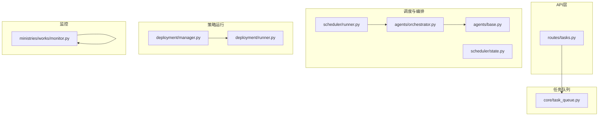
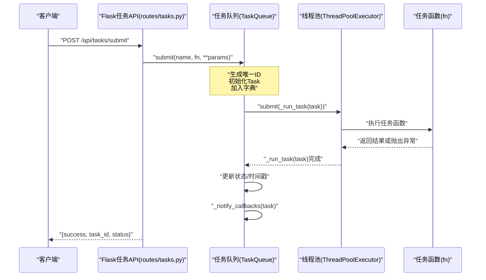
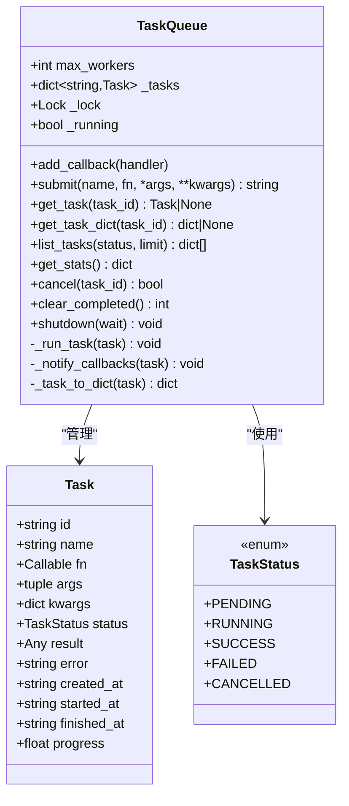
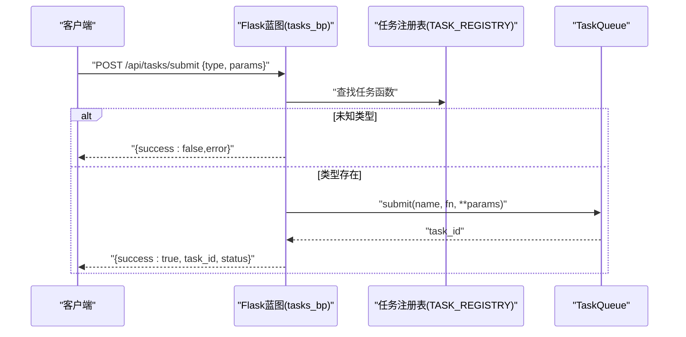
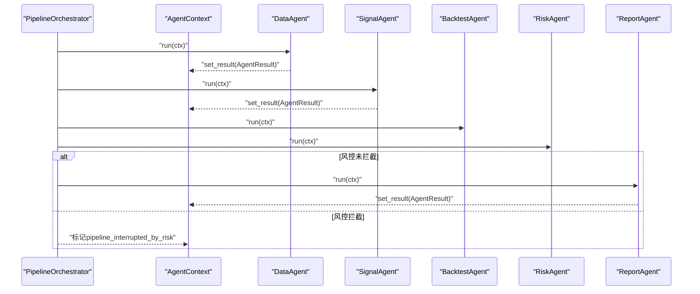
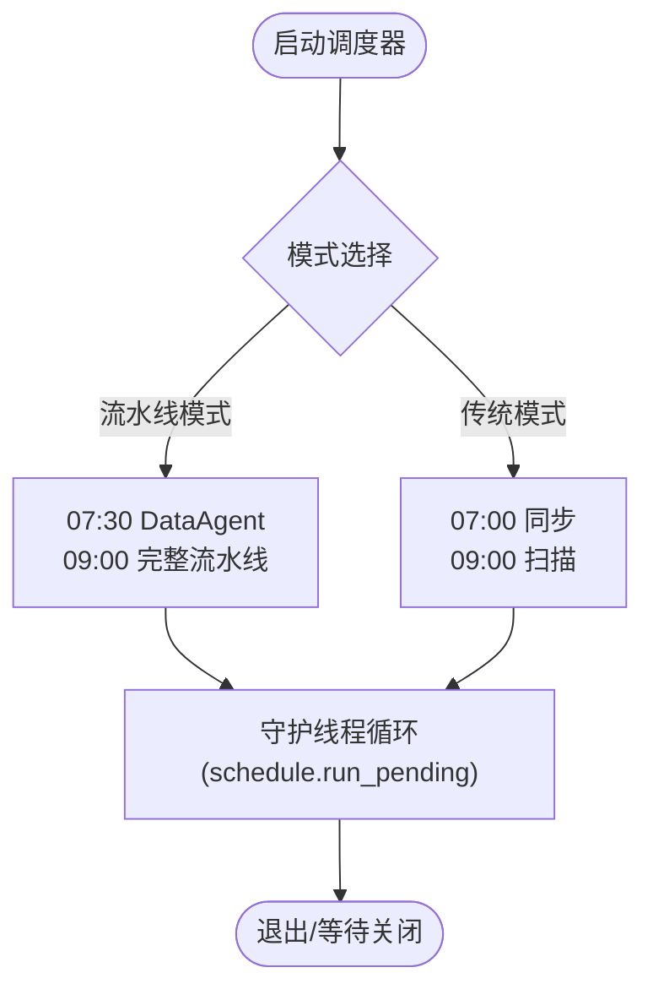
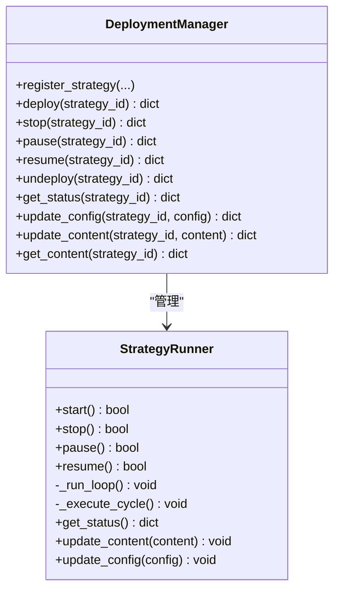
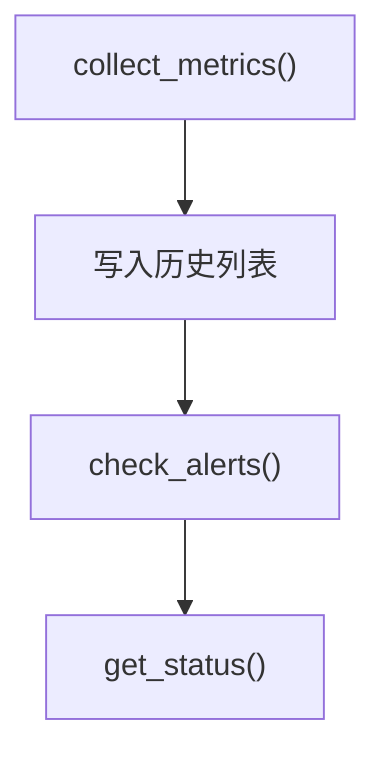
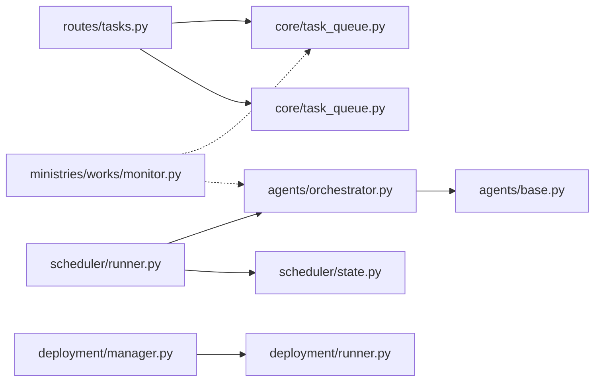

# 任务队列系统

<cite>
**本文引用的文件**
- [core/task_queue.py](file://core/task_queue.py)
- [routes/tasks.py](file://routes/tasks.py)
- [scheduler/runner.py](file://scheduler/runner.py)
- [scheduler/state.py](file://scheduler/state.py)
- [agents/orchestrator.py](file://agents/orchestrator.py)
- [agents/base.py](file://agents/base.py)
- [deployment/manager.py](file://deployment/manager.py)
- [deployment/runner.py](file://deployment/runner.py)
- [ministries/works/monitor.py](file://ministries/works/monitor.py)
</cite>

## 更新摘要
**所做更改**
- 更新了任务队列系统架构说明，反映全新的轻量级内存队列实现
- 新增了异步任务提交、执行、状态跟踪与回调通知的详细说明
- 更新了API层与任务队列的交互流程图
- 补充了任务生命周期管理的完整流程
- 更新了性能考虑与故障排查指南

## 目录
1. [简介](#简介)
2. [项目结构](#项目结构)
3. [核心组件](#核心组件)
4. [架构总览](#架构总览)
5. [详细组件分析](#详细组件分析)
6. [依赖分析](#依赖分析)
7. [性能考虑](#性能考虑)
8. [故障排查指南](#故障排查指南)
9. [结论](#结论)
10. [附录](#附录)

## 简介
本文件面向AIQuant任务队列系统，系统采用全新的轻量级内存队列与线程池实现，提供异步任务提交、执行、状态跟踪与回调通知能力，并通过Flask API对外暴露。系统替代了原有的简单任务执行模式，形成了完整的任务生命周期管理体系。

- **任务队列**：基于内存字典与线程锁，支持任务提交、状态查询、统计、取消与清理。
- **异步执行**：通过ThreadPoolExecutor实现任务的异步执行，支持并发控制。
- **状态跟踪**：完整的任务状态管理，包括pending/running/success/failed/cancelled。
- **回调通知**：任务完成后自动触发回调通知，支持扩展的事件处理机制。
- **API层**：提供任务提交、查询、列表、取消、清理与统计接口。
- **多Agent流水线**：与任务队列系统集成的编排器，支持复杂的业务流程。
- **监控集成**：系统监控模块与任务队列状态的集成。

## 项目结构
围绕任务队列系统的相关模块分布如下：
- **核心队列**：core/task_queue.py（全新实现）
- **API路由**：routes/tasks.py（集成任务队列）
- **调度器**：scheduler/runner.py、scheduler/state.py（状态管理）
- **多Agent流水线**：agents/orchestrator.py、agents/base.py（编排与执行）
- **策略运行**：deployment/manager.py、deployment/runner.py（策略管理）
- **系统监控**：ministries/works/monitor.py（系统指标）

**图表来源**
- [routes/tasks.py:1-178](file://routes/tasks.py#L1-L178)
- [core/task_queue.py:1-222](file://core/task_queue.py#L1-L222)
- [scheduler/runner.py:1-212](file://scheduler/runner.py#L1-L212)
- [scheduler/state.py:1-45](file://scheduler/state.py#L1-L45)
- [agents/orchestrator.py:1-263](file://agents/orchestrator.py#L1-L263)
- [agents/base.py:1-120](file://agents/base.py#L1-L120)
- [deployment/manager.py:1-216](file://deployment/manager.py#L1-L216)
- [deployment/runner.py:1-182](file://deployment/runner.py#L1-L182)
- [ministries/works/monitor.py:1-114](file://ministries/works/monitor.py#L1-L114)

## 核心组件
- **任务队列TaskQueue**：全新的轻量级实现，提供异步任务提交、执行、状态跟踪、统计、取消与清理。
- **任务Task**：封装任务元数据、状态、结果与时间戳，支持完整的生命周期管理。
- **任务状态TaskStatus**：枚举pending/running/success/failed/cancelled，便于统一状态管理。
- **Flask任务API**：routes/tasks.py提供提交、查询、列表、取消、清理与统计接口。
- **多Agent流水线编排器**：agents/orchestrator.py协调复杂业务流程的有序执行。
- **调度器**：scheduler/runner.py基于schedule库定时触发各种任务。
- **策略部署管理器**：deployment/manager.py注册、部署、启停、暂停/恢复策略。
- **策略运行器**：deployment/runner.py在线程中运行策略，记录统计与日志。
- **系统监控**：ministries/works/monitor.py采集CPU/内存/磁盘/数据库大小等指标。

**章节来源**
- [core/task_queue.py:25-51](file://core/task_queue.py#L25-L51)
- [routes/tasks.py:84-88](file://routes/tasks.py#L84-L88)
- [agents/orchestrator.py:36-53](file://agents/orchestrator.py#L36-L53)
- [scheduler/runner.py:158-182](file://scheduler/runner.py#L158-L182)
- [deployment/manager.py:24-31](file://deployment/manager.py#L24-L31)
- [deployment/runner.py:44-64](file://deployment/runner.py#L44-L64)
- [ministries/works/monitor.py:29-61](file://ministries/works/monitor.py#L29-L61)

## 架构总览
任务队列系统采用"API层—任务队列—执行层（线程池）—结果存储（内存）"的全新轻量架构。Flask API接收任务请求，通过get_task_queue()获取单例TaskQueue；TaskQueue通过ThreadPoolExecutor异步调度执行；任务完成后更新状态并通过回调通知；API层提供查询与统计接口。

**图表来源**
- [routes/tasks.py:93-113](file://routes/tasks.py#L93-L113)
- [core/task_queue.py:64-82](file://core/task_queue.py#L64-L82)
- [core/task_queue.py:84-99](file://core/task_queue.py#L84-L99)
- [core/task_queue.py:173-179](file://core/task_queue.py#L173-L179)

## 详细组件分析

### 任务队列与任务模型
**更新** 全新的轻量级实现，提供完整的异步任务管理能力。

- **TaskStatus**：定义任务状态枚举，便于统一状态管理与查询。
- **Task**：包含任务ID、名称、可调用对象、参数、状态、结果、错误、时间戳与进度。
- **TaskQueue**：
  - **提交**：生成唯一ID，初始化Task并加入字典，提交到线程池。
  - **执行**：设置状态为running，捕获异常并设置状态为failed，最终设置完成时间并回调通知。
  - **查询**：支持按ID获取Task或字典形式；支持按状态过滤与限制数量；支持统计。
  - **控制**：取消（仅对PENDING有效）、清理已完成任务、优雅关闭。
  - **回调**：任务完成后逐个通知回调处理器。
  - **单例**：get_task_queue提供全局访问。

**图表来源**
- [core/task_queue.py:25-51](file://core/task_queue.py#L25-L51)
- [core/task_queue.py:51-180](file://core/task_queue.py#L51-L180)

**章节来源**
- [core/task_queue.py:25-180](file://core/task_queue.py#L25-L180)

### Flask任务API
**更新** 与全新任务队列系统深度集成，提供完整的任务管理接口。

- **支持的任务类型**：demo、backtest、batch_score。
- **接口**：
  - POST /api/tasks/submit：提交任务，返回task_id与初始状态。
  - GET /api/tasks/<id>：查询任务详情。
  - GET /api/tasks：列出任务，支持status与limit筛选。
  - POST /api/tasks/<id>/cancel：取消任务（仅PENDING）。
  - POST /api/tasks/clear：清理已完成任务。
  - GET /api/tasks/stats：获取队列统计。
  - GET /api/tasks/types：获取支持的任务类型列表。

**图表来源**
- [routes/tasks.py:93-113](file://routes/tasks.py#L93-L113)
- [routes/tasks.py:84-88](file://routes/tasks.py#L84-L88)

**章节来源**
- [routes/tasks.py:93-178](file://routes/tasks.py#L93-L178)

### 多Agent流水线编排器
**更新** 与任务队列系统协同工作，支持复杂的业务流程编排。

- **PipelineOrchestrator**：
  - **串行阶段**：DataAgent（数据官）→ SignalAgent（策略官）。
  - **并行阶段**：BacktestAgent（回测官）与RiskAgent（风控官）。
  - **风控拦截**：若RiskAgent判定BLOCK，则跳过ReportAgent。
  - **上下文共享**：AgentContext提供set/get与结果存储，支持摘要生成。
  - **并发执行**：使用线程池并行运行指定Agent。
- **Agent基类与结果**：
  - **BaseAgent**：统一run包装，自动计时、异常捕获与结果写入上下文。
  - **AgentResult**：包含agent_name、success、data、error、时间戳与耗时。

**图表来源**
- [agents/orchestrator.py:81-175](file://agents/orchestrator.py#L81-L175)
- [agents/base.py:93-114](file://agents/base.py#L93-L114)

**章节来源**
- [agents/orchestrator.py:36-175](file://agents/orchestrator.py#L36-L175)
- [agents/base.py:20-114](file://agents/base.py#L20-L114)

### 调度器与状态
**更新** 支持两种模式，与任务队列系统协同工作。

- **调度器**：
  - **传统模式**：07:00同步，09:00扫描。
  - **多Agent流水线模式**：07:30 DataAgent，09:00完整流水线。
  - 使用schedule库与守护线程循环，避免阻塞。
- **状态**：
  - **SYNC_STATUS/SCAN_STATUS**：传统同步/扫描状态。
  - **PIPELINE_STATUS**：流水线运行状态、代理状态与结果。
  - **update_pipeline_status**：线程安全更新流水线状态。

**图表来源**
- [scheduler/runner.py:158-182](file://scheduler/runner.py#L158-L182)
- [scheduler/state.py:24-44](file://scheduler/state.py#L24-L44)

**章节来源**
- [scheduler/runner.py:158-212](file://scheduler/runner.py#L158-L212)
- [scheduler/state.py:1-45](file://scheduler/state.py#L1-L45)

### 策略部署管理器与运行器
**更新** 独立于任务队列系统，提供策略生命周期管理。

- **DeploymentManager**：
  - 注册策略（仅注册，不启动）。
  - 部署并启动策略（启动实盘）。
  - 停止、暂停、恢复、注销策略。
  - 热更新配置与策略内容。
  - 持久化部署记录到文件。
- **StrategyRunner**：
  - 在独立线程中运行策略函数。
  - 定时触发（interval）执行信号扫描与交易。
  - 记录运行统计（信号数、交易数、盈亏、最大回撤、错误数与日志）。
  - 支持暂停/恢复与异常处理。

**图表来源**
- [deployment/manager.py:24-184](file://deployment/manager.py#L24-L184)
- [deployment/runner.py:44-181](file://deployment/runner.py#L44-L181)

**章节来源**
- [deployment/manager.py:24-216](file://deployment/manager.py#L24-L216)
- [deployment/runner.py:44-182](file://deployment/runner.py#L44-L182)

### 系统监控
**更新** 与任务队列系统集成，提供全面的系统指标监控。

- **SystemMonitor**：
  - 收集CPU、内存、磁盘使用率与数据库大小。
  - 历史指标保留（示例：最近24小时）。
  - 告警检查（CPU/内存/磁盘阈值）。
  - 系统状态摘要（健康/警告）。

**图表来源**
- [ministries/works/monitor.py:36-101](file://ministries/works/monitor.py#L36-L101)

**章节来源**
- [ministries/works/monitor.py:29-114](file://ministries/works/monitor.py#L29-L114)

## 依赖分析
**更新** 反映了全新的任务队列系统架构。

- **API层依赖任务队列**：routes/tasks.py通过get_task_queue()获取单例并调用submit/list_tasks等方法。
- **编排器依赖Agent基类与上下文**：orchestrator.py通过base.py提供的AgentContext共享数据与结果。
- **调度器依赖编排器与状态模块**：runner.py根据环境变量选择流水线模式并触发orchestrator.run_pipeline。
- **策略运行器与部署管理器相互独立**，均通过线程与锁保证并发安全。
- **监控模块独立于任务队列与编排器**，提供系统级指标采集。

**图表来源**
- [routes/tasks.py:13-18](file://routes/tasks.py#L13-L18)
- [core/task_queue.py:51-61](file://core/task_queue.py#L51-L61)
- [agents/orchestrator.py:36-53](file://agents/orchestrator.py#L36-L53)
- [agents/base.py:39-86](file://agents/base.py#L39-L86)
- [scheduler/runner.py:158-182](file://scheduler/runner.py#L158-L182)
- [scheduler/state.py:15-21](file://scheduler/state.py#L15-L21)
- [deployment/manager.py:24-31](file://deployment/manager.py#L24-L31)
- [deployment/runner.py:44-64](file://deployment/runner.py#L44-L64)
- [ministries/works/monitor.py:36-61](file://ministries/works/monitor.py#L36-L61)

**章节来源**
- [routes/tasks.py:13-18](file://routes/tasks.py#L13-L18)
- [agents/orchestrator.py:36-53](file://agents/orchestrator.py#L36-L53)
- [scheduler/runner.py:158-182](file://scheduler/runner.py#L158-L182)
- [deployment/manager.py:24-31](file://deployment/manager.py#L24-L31)
- [deployment/runner.py:44-64](file://deployment/runner.py#L44-L64)
- [ministries/works/monitor.py:36-61](file://ministries/works/monitor.py#L36-L61)

## 性能考虑
**更新** 基于全新的任务队列系统架构。

- **线程池并发**：max_workers决定最大并发度，应结合CPU核数与I/O密集程度调整。
- **内存存储**：任务状态与结果存储在进程内存，适合单机场景；若需持久化，可在回调中写入数据库或缓存。
- **列表查询**：list_tasks支持按状态过滤与limit限制，避免一次性返回过多数据。
- **清理策略**：定期调用clear_completed释放内存，防止长期运行导致内存膨胀。
- **监控指标**：通过SystemMonitor采集CPU/内存/磁盘与数据库大小，结合告警阈值进行容量规划。
- **回调性能**：回调处理器应在短时间内完成处理，避免阻塞任务队列的执行。

## 故障排查指南
**更新** 针对全新的任务队列系统。

- **任务长时间处于pending**：
  - 检查max_workers是否过小导致队列积压。
  - 查看是否有大量PENDING任务，必要时清理已完成任务。
  - 确认线程池是否正常启动。
- **任务执行失败**：
  - 通过GET /api/tasks/<id>查看error字段定位异常。
  - 检查回调通知是否正常触发（回调异常会被吞掉并打印错误）。
  - 查看任务函数的异常堆栈信息。
- **取消失败**：
  - 仅PENDING状态可取消，若任务已开始则无法取消。
  - 检查任务状态是否正确更新。
- **API不可用**：
  - 检查Flask应用是否启动，确认端口与路由路径正确。
  - 验证任务队列单例是否正确初始化。
- **策略运行异常**：
  - 通过StrategyRunner的logs与stats查看错误与统计信息。
- **监控告警**：
  - CPU/内存/磁盘超过阈值时，检查系统负载与任务队列并发设置。
  - 监控任务队列的统计信息，包括pending/running任务数量。

**章节来源**
- [core/task_queue.py:142-150](file://core/task_queue.py#L142-L150)
- [routes/tasks.py:116-122](file://routes/tasks.py#L116-L122)
- [deployment/runner.py:111-132](file://deployment/runner.py#L111-L132)
- [ministries/works/monitor.py:62-101](file://ministries/works/monitor.py#L62-L101)

## 结论
AIQuant任务队列系统以全新的轻量级内存队列为核心，结合Flask API提供完整的异步任务管理能力；多Agent流水线编排器实现复杂业务流程的有序执行；调度器保障定时任务与流水线的自动化；策略部署与运行器提供策略生命周期管理；系统监控模块提供资源使用情况与健康状态。整体设计简洁高效，支持异步任务提交、执行、状态跟踪与回调通知，适合单机异步任务与数据处理场景。

## 附录

### 任务生命周期管理
**更新** 基于全新的任务队列系统。

- **创建**：API接收请求，注册表匹配任务类型，提交至TaskQueue。
- **排队**：TaskQueue将任务放入内部字典，线程池异步调度。
- **执行**：线程池执行任务函数，更新状态与时间戳。
- **完成**：成功返回结果，失败记录错误；回调通知订阅者；API可查询结果。
- **清理**：定期清理已完成任务，释放内存资源。

**章节来源**
- [routes/tasks.py:93-113](file://routes/tasks.py#L93-L113)
- [core/task_queue.py:84-99](file://core/task_queue.py#L84-L99)

### 任务优先级与负载均衡
**更新** 当前实现建议。

- **当前实现**：未内置优先级队列与动态负载均衡策略。
- **建议**：
  - **优先级**：在TaskQueue中引入带权重的队列或按任务类型分类队列。
  - **负载均衡**：根据CPU/内存使用率动态调整max_workers，或拆分为多个队列实例。
  - **任务分片**：对于大数据任务，考虑将任务分解为多个子任务。

### 任务持久化与状态同步
**更新** 当前实现与建议。

- **当前实现**：任务状态与结果存储在内存，适合短期任务。
- **建议**：
  - 在回调中将任务状态写入数据库或Redis，实现跨进程/跨实例共享。
  - 使用消息队列（如RabbitMQ/Kafka）实现解耦与持久化。
  - 考虑使用分布式缓存（如Redis）存储任务状态。

### 失败处理、重试与死信队列
**更新** 当前实现与建议。

- **当前实现**：任务失败记录error，未内置自动重试与死信队列。
- **建议**：
  - **失败重试**：在回调中判断失败并重新提交任务，限制重试次数。
  - **死信队列**：超过重试上限的任务进入死信队列并报警。
  - **指数退避**：实现指数退避算法，避免雪崩效应。

### 监控指标与性能统计
**更新** 当前实现与建议。

- **指标**：队列统计（总数、pending、running、success、failed、max_workers）、任务耗时、系统CPU/内存/磁盘/数据库大小。
- **建议**：将队列统计与系统指标上报至监控平台，设置阈值告警。
- **新增指标**：任务执行时间分布、回调处理时间、线程池利用率。

**章节来源**
- [core/task_queue.py:125-138](file://core/task_queue.py#L125-L138)
- [ministries/works/monitor.py:36-101](file://ministries/works/monitor.py#L36-L101)

### 配置参数与扩展接口
**更新** 基于全新实现。

- **配置参数**：
  - **TaskQueue.max_workers**：线程池并发数，默认4。
  - **API路由参数**：status、limit。
  - **调度器模式**：环境变量AGENT_MODE=pipeline启用流水线模式。
- **扩展接口**：
  - **注册新任务类型**：在TASK_REGISTRY中添加新任务函数。
  - **自定义回调**：通过TaskQueue.add_callback注册回调处理任务完成事件。
  - **自定义Agent**：继承BaseAgent实现_run_execute，使用AgentContext共享数据。
  - **自定义状态**：扩展TaskStatus枚举以支持更多任务状态。

**章节来源**
- [core/task_queue.py:54-61](file://core/task_queue.py#L54-L61)
- [routes/tasks.py:84-88](file://routes/tasks.py#L84-L88)
- [agents/base.py:88-119](file://agents/base.py#L88-L119)