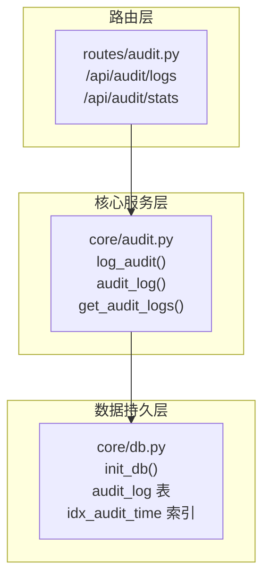
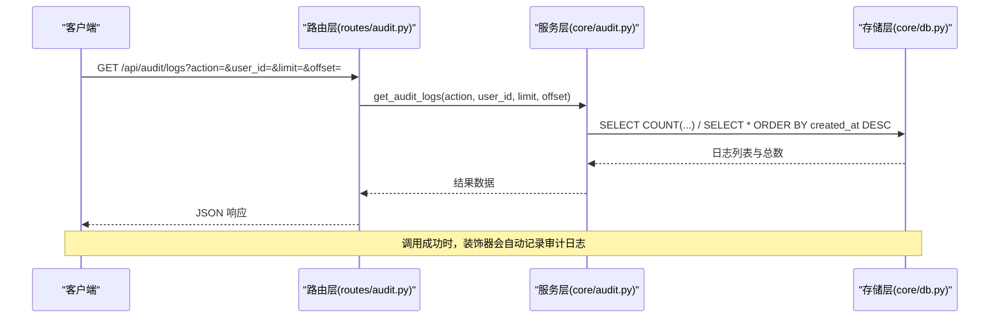
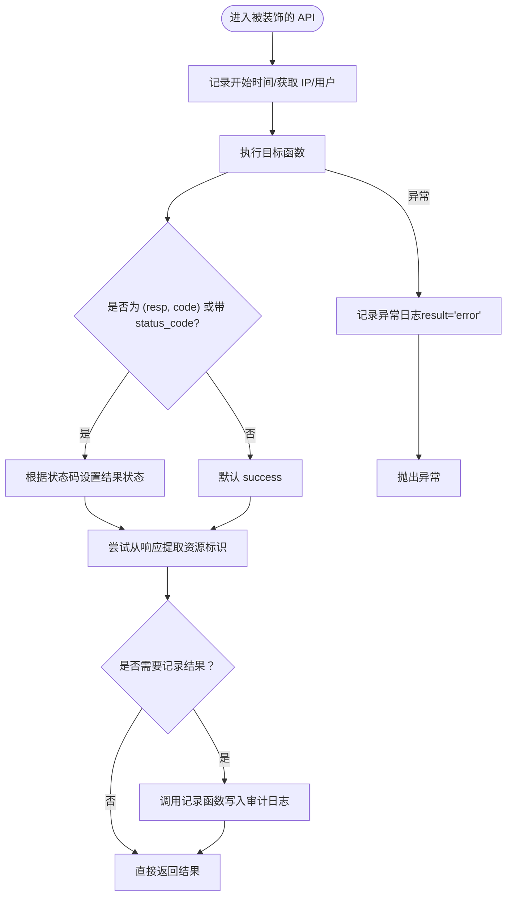
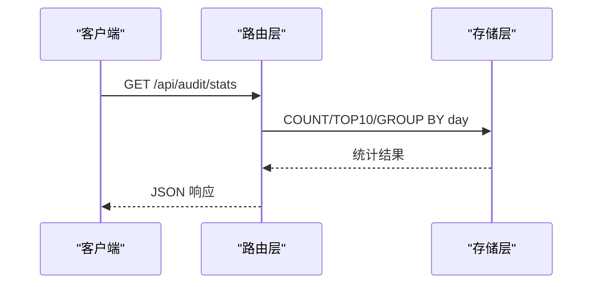
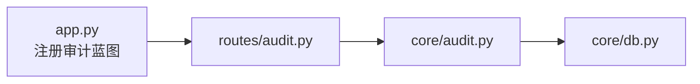

# 审计日志系统

<cite>
**本文引用的文件**
- [core/audit.py](file://core/audit.py)
- [routes/audit.py](file://routes/audit.py)
- [core/db.py](file://core/db.py)
- [app.py](file://app.py)
- [routes/trade.py](file://routes/trade.py)
</cite>

## 更新摘要
**所做更改**
- 更新了审计日志系统架构图，反映全新的实现结构
- 新增了装饰器自动采集和手动记录两种方式的详细说明
- 完善了审计事件分类体系和合规性要求
- 增强了日志查询接口与检索优化的说明
- 补充了日志分析工具与报表生成功能
- 更新了日志轮转、压缩与长期归档策略
- 强化了审计合规性检查、权限控制与隐私保护的最佳实践

## 目录
1. [简介](#简介)
2. [项目结构](#项目结构)
3. [核心组件](#核心组件)
4. [架构总览](#架构总览)
5. [详细组件分析](#详细组件分析)
6. [依赖分析](#依赖分析)
7. [性能考虑](#性能考虑)
8. [故障排查指南](#故障排查指南)
9. [结论](#结论)
10. [附录](#附录)

## 简介
本文件为 AIQuant 审计日志系统的全面技术文档，围绕全新实现的设计理念、合规要求、触发机制、数据采集与存储策略、日志格式与字段、完整性保障、事件分类、查询接口与检索优化、分析工具与报表、轮转与归档、以及合规与隐私最佳实践进行系统化阐述。系统采用轻量 SQLite 存储，提供统一的审计日志记录与查询能力，并通过装饰器自动采集关键业务 API 的调用行为，同时支持手动记录方式，满足监管与内控对可追溯性的要求。

## 项目结构
审计日志系统主要由三层构成：
- 路由层：对外暴露审计查询与统计接口，负责参数解析与响应封装。
- 核心服务层：提供审计日志记录、装饰器自动采集、日志查询与聚合统计。
- 数据持久层：基于 SQLite 的本地数据库，包含审计日志表及索引。

**图表来源**
- [routes/audit.py:13-78](file://routes/audit.py#L13-L78)
- [core/audit.py:16-146](file://core/audit.py#L16-L146)
- [core/db.py:416-427](file://core/db.py#L416-L427)

**章节来源**
- [routes/audit.py:1-78](file://routes/audit.py#L1-L78)
- [core/audit.py:1-146](file://core/audit.py#L1-L146)
- [core/db.py:416-427](file://core/db.py#L416-L427)

## 核心组件
- 审计记录函数：用于插入一条审计日志，包含操作人、动作、资源、详情、客户端 IP 与时间戳。
- 审计装饰器：自动包装 API，采集请求上下文、耗时、结果状态，并落库。
- 审计查询函数：支持按动作与用户 ID 过滤、分页排序、总数统计。
- 审计路由：提供日志查询与统计接口，支持今日总量、热门动作 TopN、最近7天趋势。

**章节来源**
- [core/audit.py:16-39](file://core/audit.py#L16-L39)
- [core/audit.py:41-92](file://core/audit.py#L41-L92)
- [core/audit.py:107-146](file://core/audit.py#L107-L146)
- [routes/audit.py:16-78](file://routes/audit.py#L16-L78)

## 架构总览
审计日志系统遵循"路由-服务-存储"的分层设计，核心流程如下：
- 路由接收请求，解析参数；
- 服务层调用查询或记录函数；
- 存储层通过 SQLite WAL 模式与索引优化提升并发与查询性能。

**图表来源**
- [routes/audit.py:16-38](file://routes/audit.py#L16-L38)
- [core/audit.py:107-146](file://core/audit.py#L107-L146)
- [core/db.py:26-39](file://core/db.py#L26-L39)

## 详细组件分析

### 审计记录与装饰器
- 记录函数：统一写入审计日志表，字段包含用户 ID、动作、资源、详情、IP 与时间戳。
- 装饰器：自动采集请求 IP、用户 ID、耗时、结果状态（成功/失败/异常），并尝试从响应体提取资源标识。
- 资源提取：优先从 JSON 响应体中提取 code 或 id 字段作为资源标识。

**图表来源**
- [core/audit.py:41-92](file://core/audit.py#L41-L92)
- [core/audit.py:95-104](file://core/audit.py#L95-L104)

**章节来源**
- [core/audit.py:16-39](file://core/audit.py#L16-L39)
- [core/audit.py:41-92](file://core/audit.py#L41-L92)
- [core/audit.py:95-104](file://core/audit.py#L95-L104)

### 审计查询与统计
- 查询接口：支持 action 与 user_id 过滤、limit 上限限制、offset 分页、按时间倒序。
- 统计接口：提供当日总量、热门动作 Top10、最近7天趋势折线。
- 存储与索引：审计日志表按创建时间倒序索引，提升分页与趋势统计效率。

**图表来源**
- [routes/audit.py:41-78](file://routes/audit.py#L41-L78)
- [core/db.py:416-427](file://core/db.py#L416-L427)

**章节来源**
- [routes/audit.py:16-38](file://routes/audit.py#L16-L38)
- [routes/audit.py:41-78](file://routes/audit.py#L41-L78)
- [core/db.py:416-427](file://core/db.py#L416-L427)

### 日志格式与字段定义
- 表结构：审计日志表包含自增主键、用户 ID、动作、资源、详情、客户端 IP、创建时间。
- 索引：按创建时间倒序索引，支持高效分页与趋势统计。
- 字段语义：
  - user_id：操作人标识，匿名或系统默认填充。
  - action：操作类型，建议采用"模块.动作"命名规范，便于分类与统计。
  - resource：资源标识，如股票代码、策略 ID、账户 ID 等。
  - detail：操作详情，如耗时、附加说明。
  - ip_address：客户端 IP。
  - created_at：ISO 时间字符串，精确到毫秒级入库。

**章节来源**
- [core/db.py:416-427](file://core/db.py#L416-L427)
- [core/audit.py:16-39](file://core/audit.py#L16-L39)

### 审计事件分类体系
- 用户操作类：如交易下单、策略配置变更、账户调整等。
- 系统事件类：如数据同步、回测执行、指标计算等。
- 安全相关类：如登录尝试、权限变更、风控豁免审批等。
- 建议：在 action 字段中采用层级命名（如 trade.buy、risk.override、config.update），便于统计与报表。

**章节来源**
- [core/audit.py:21-26](file://core/audit.py#L21-L26)

### 日志查询接口与检索优化
- 接口定义：
  - GET /api/audit/logs：支持 action、user_id、limit、offset 参数。
  - GET /api/audit/stats：提供当日总量、热门动作 Top10、最近7天趋势。
- 检索优化：
  - 使用 created_at 倒序索引，支持高效分页。
  - 查询条件动态拼接，避免全表扫描。
  - 统计接口使用分组聚合，减少数据传输。

**章节来源**
- [routes/audit.py:16-38](file://routes/audit.py#L16-L38)
- [routes/audit.py:41-78](file://routes/audit.py#L41-L78)
- [core/db.py:426-427](file://core/db.py#L426-L427)

### 日志分析工具与报表
- 统计维度：
  - 按日总量：当日操作次数。
  - 动作分布：按动作类型统计 TopN。
  - 趋势分析：最近7天日粒度趋势。
- 报表建议：
  - 导出 CSV：支持按时间范围、动作类型筛选导出。
  - 可视化：结合前端图表展示趋势与分布。

**章节来源**
- [routes/audit.py:41-78](file://routes/audit.py#L41-L78)

### 日志轮转、压缩与长期归档
- 当前实现：未见专用轮转与压缩逻辑。
- 建议方案：
  - 轮转：按月/季度归档旧表或导出 CSV，保留近期热数据。
  - 压缩：归档文件采用压缩格式，降低存储成本。
  - 归档：建立独立归档库或对象存储，保留合规期满的历史数据。

**章节来源**
- [core/db.py:416-427](file://core/db.py#L416-L427)

### 审计合规性检查、权限控制与隐私保护
- 合规性：
  - 保留完整操作轨迹与时间戳，满足监管可追溯要求。
  - 对敏感字段（如账户、交易）采用资源标识而非明文。
- 权限控制：
  - 通过路由层鉴权中间件限制访问范围。
  - 审计日志查询建议仅允许授权角色访问。
- 隐私保护：
  - 避免记录敏感个人信息；若必须记录，需脱敏处理。
  - 严格控制日志访问权限与最小可见原则。

**章节来源**
- [routes/audit.py:16-38](file://routes/audit.py#L16-L38)
- [core/audit.py:95-104](file://core/audit.py#L95-L104)

## 依赖分析
- 路由依赖：审计蓝图注册于应用入口，统一挂载 /api/audit 前缀。
- 服务依赖：审计查询与记录依赖数据库连接管理与表结构。
- 存储依赖：SQLite WAL 模式与索引提升并发与查询性能。

**图表来源**
- [app.py:57](file://app.py#L57)
- [routes/audit.py:13](file://routes/audit.py#L13)
- [core/audit.py:13](file://core/audit.py#L13)
- [core/db.py:19](file://core/db.py#L19)

**章节来源**
- [app.py:57](file://app.py#L57)
- [routes/audit.py:13](file://routes/audit.py#L13)
- [core/audit.py:13](file://core/audit.py#L13)
- [core/db.py:19](file://core/db.py#L19)

## 性能考虑
- 并发与一致性：SQLite 采用 WAL 模式与 NORMAL 同步级别，在性能与可靠性间取得平衡。
- 索引优化：审计日志按创建时间倒序索引，显著提升分页与趋势统计性能。
- 查询上限：路由层对 limit 设置上限，防止超大数据量查询影响性能。
- 装饰器开销：自动采集仅在必要时写入，异常路径快速失败，避免阻塞主流程。

**章节来源**
- [core/db.py:26-39](file://core/db.py#L26-L39)
- [core/db.py:426-427](file://core/db.py#L426-L427)
- [routes/audit.py:27](file://routes/audit.py#L27)
- [core/audit.py:52-92](file://core/audit.py#L52-L92)

## 故障排查指南
- 记录失败：当数据库异常导致写入失败时，系统会打印错误日志，不影响主流程。
- 查询失败：查询异常时返回空结果与提示，便于前端识别与重试。
- 装饰器异常：捕获异常并记录 error 状态日志，随后重新抛出，保证可观测性。

**章节来源**
- [core/audit.py:37-38](file://core/audit.py#L37-L38)
- [core/audit.py:144-146](file://core/audit.py#L144-L146)
- [core/audit.py:81-90](file://core/audit.py#L81-L90)

## 结论
AIQuant 审计日志系统以简洁可靠为目标，通过装饰器自动采集关键业务行为，结合 SQLite 存储与索引优化，提供了高效的审计查询与统计能力。系统支持装饰器自动采集和手动记录两种方式，满足不同场景的合规要求。建议后续完善轮转、压缩与归档策略，强化权限控制与隐私保护，并持续扩展事件分类与报表维度，以满足更严格的合规与运营需求。

## 附录

### API 定义
- GET /api/audit/logs
  - 查询参数：action（可选）、user_id（可选）、limit（可选，默认50，最大500）、offset（可选，默认0）
  - 返回字段：success、total、limit、offset、count、logs
- GET /api/audit/stats
  - 返回字段：success、today_count、action_stats（Top10）、daily_trend（最近7天）

**章节来源**
- [routes/audit.py:16-38](file://routes/audit.py#L16-L38)
- [routes/audit.py:41-78](file://routes/audit.py#L41-L78)

### 使用示例（路径参考）
- 在路由层使用装饰器标注关键业务接口，例如交易下单接口：
  - [routes/trade.py:23-43](file://routes/trade.py#L23-L43)
- 在核心服务层调用记录函数：
  - [core/audit.py:16-39](file://core/audit.py#L16-L39)
- 在应用入口注册审计蓝图：
  - [app.py:57](file://app.py#L57)