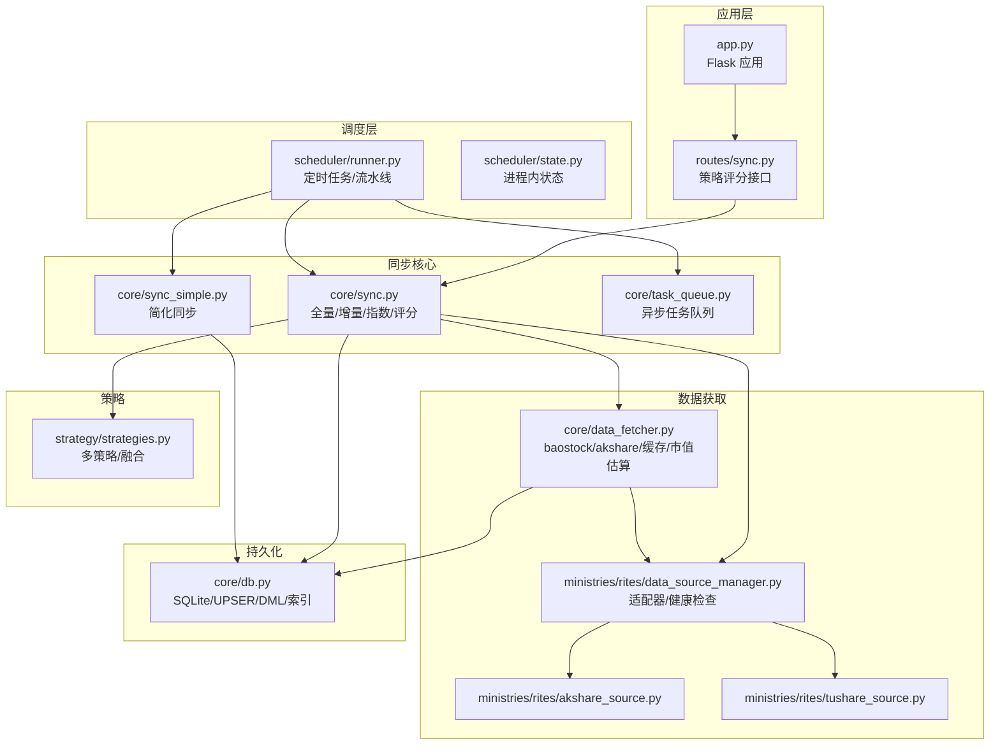
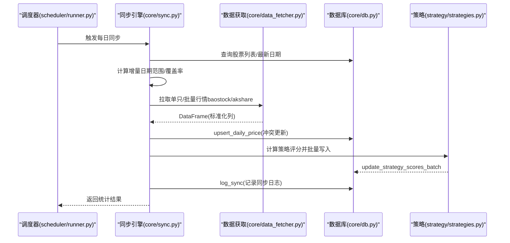
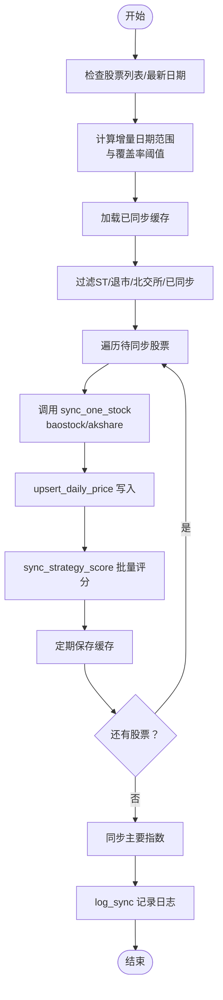
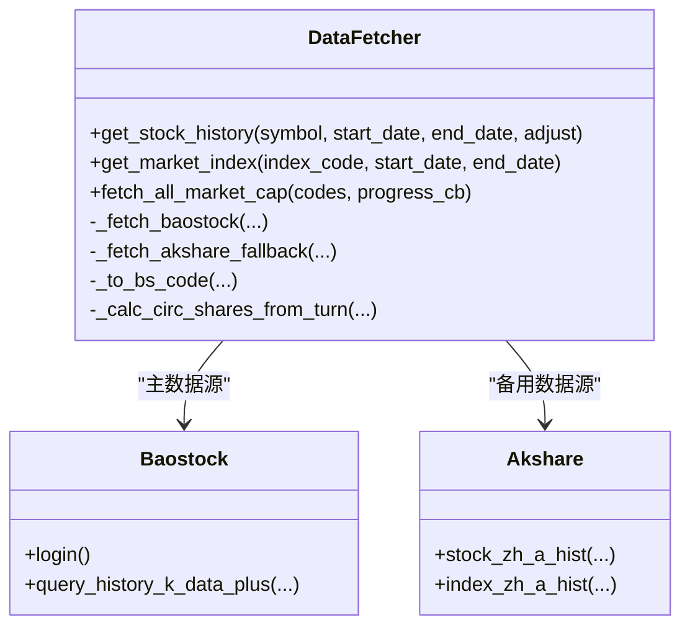
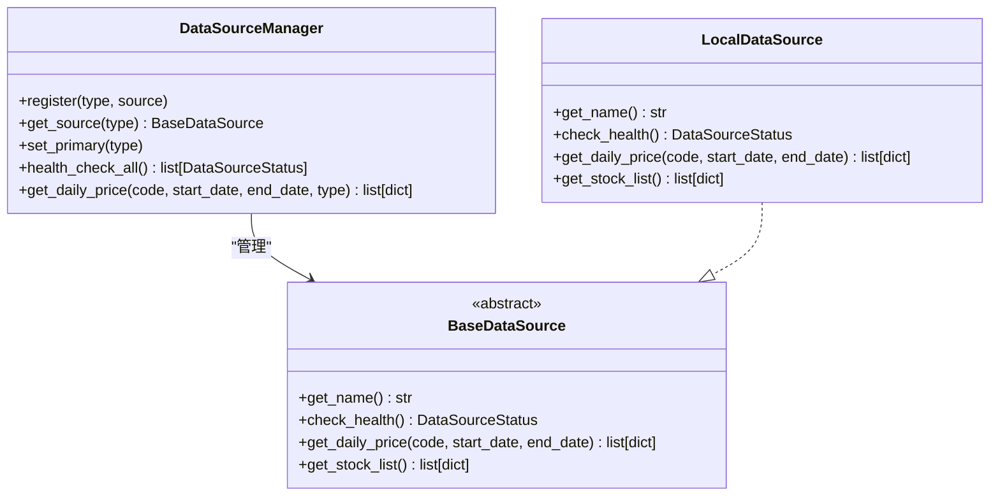
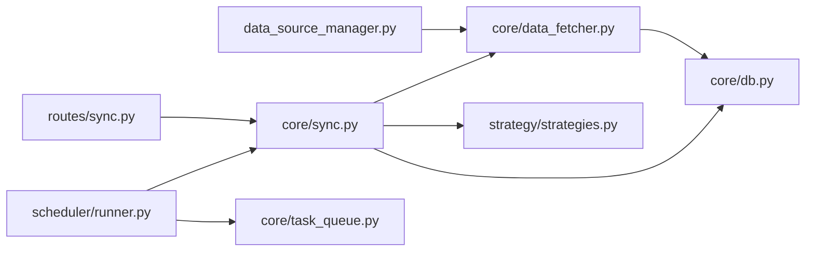

# 数据同步机制

<cite>
**本文引用的文件**
- [core/sync.py](file://core/sync.py)
- [core/sync_simple.py](file://core/sync_simple.py)
- [core/data_fetcher.py](file://core/data_fetcher.py)
- [core/db.py](file://core/db.py)
- [core/task_queue.py](file://core/task_queue.py)
- [ministries/rites/data_source_manager.py](file://ministries/rites/data_source_manager.py)
- [ministries/rites/akshare_source.py](file://ministries/rites/akshare_source.py)
- [ministries/rites/tushare_source.py](file://ministries/rites/tushare_source.py)
- [routes/sync.py](file://routes/sync.py)
- [scheduler/runner.py](file://scheduler/runner.py)
- [scheduler/state.py](file://scheduler/state.py)
- [app.py](file://app.py)
- [strategy/strategies.py](file://strategy/strategies.py)
</cite>

## 目录
1. [简介](#简介)
2. [项目结构](#项目结构)
3. [核心组件](#核心组件)
4. [架构总览](#架构总览)
5. [详细组件分析](#详细组件分析)
6. [依赖分析](#依赖分析)
7. [性能考虑](#性能考虑)
8. [故障排查指南](#故障排查指南)
9. [结论](#结论)
10. [附录](#附录)

## 简介
本文件面向AIQuant项目的“数据同步机制”，系统性阐述从数据源接入、全量/增量同步策略、调度与并发控制、错误重试与断点续传、日志与状态跟踪、一致性保障、性能优化与缓存策略，以及配置管理与监控告警等主题。文档同时给出关键流程的时序图与架构图，帮助读者快速理解并落地实施。

## 项目结构
围绕数据同步的关键模块分布如下：
- 同步主逻辑：core/sync.py（全量/增量同步、策略评分、指数同步、缓存与断点续传）
- 简化同步：core/sync_simple.py（本地缓存导入 + 降频拉新）
- 数据获取层：core/data_fetcher.py（baostock为主、akshare/备用、缓存、市值估算）
- 数据库层：core/db.py（SQLite建表/索引、upsert/查询、策略评分写入、同步日志）
- 任务队列：core/task_queue.py（轻量异步任务队列，状态跟踪）
- 数据源适配器：ministries/rites/data_source_manager.py、akshare_source.py、tushare_source.py（统一接口、健康检查、主备切换）
- 调度与状态：scheduler/runner.py、scheduler/state.py（定时任务、流水线状态）
- Web接口：routes/sync.py（策略评分全量补算接口）、app.py（蓝图注册）
- 策略框架：strategy/strategies.py（多策略评分与融合）

图表来源
- [core/sync.py:1-760](file://core/sync.py#L1-L760)
- [core/sync_simple.py:1-173](file://core/sync_simple.py#L1-L173)
- [core/data_fetcher.py:1-578](file://core/data_fetcher.py#L1-L578)
- [core/db.py:1-1213](file://core/db.py#L1-L1213)
- [core/task_queue.py:1-222](file://core/task_queue.py#L1-L222)
- [ministries/rites/data_source_manager.py:1-190](file://ministries/rites/data_source_manager.py#L1-L190)
- [ministries/rites/akshare_source.py:1-135](file://ministries/rites/akshare_source.py#L1-L135)
- [ministries/rites/tushare_source.py:1-167](file://ministries/rites/tushare_source.py#L1-L167)
- [routes/sync.py:1-140](file://routes/sync.py#L1-L140)
- [scheduler/runner.py:1-212](file://scheduler/runner.py#L1-L212)
- [scheduler/state.py:1-45](file://scheduler/state.py#L1-L45)
- [app.py:1-164](file://app.py#L1-L164)
- [strategy/strategies.py:1-431](file://strategy/strategies.py#L1-L431)

章节来源
- [core/sync.py:1-760](file://core/sync.py#L1-L760)
- [core/sync_simple.py:1-173](file://core/sync_simple.py#L1-L173)
- [core/data_fetcher.py:1-578](file://core/data_fetcher.py#L1-L578)
- [core/db.py:1-1213](file://core/db.py#L1-L1213)
- [core/task_queue.py:1-222](file://core/task_queue.py#L1-L222)
- [ministries/rites/data_source_manager.py:1-190](file://ministries/rites/data_source_manager.py#L1-L190)
- [ministries/rites/akshare_source.py:1-135](file://ministries/rites/akshare_source.py#L1-L135)
- [ministries/rites/tushare_source.py:1-167](file://ministries/rites/tushare_source.py#L1-L167)
- [routes/sync.py:1-140](file://routes/sync.py#L1-L140)
- [scheduler/runner.py:1-212](file://scheduler/runner.py#L1-L212)
- [scheduler/state.py:1-45](file://scheduler/state.py#L1-L45)
- [app.py:1-164](file://app.py#L1-L164)
- [strategy/strategies.py:1-431](file://strategy/strategies.py#L1-L431)

## 核心组件
- 全量/增量同步引擎：负责股票行情、指数行情、策略评分的同步与写入，并提供断点续传与缓存。
- 数据获取层：封装baostock为主、akshare/备用的数据源，提供缓存与市值估算能力。
- 数据库层：SQLite建表/索引、upsert/查询、策略评分批量写入、同步日志记录。
- 数据源适配器：统一接口、健康检查、主备切换，支持扩展更多数据源。
- 调度与状态：定时任务、流水线状态、运行标志与结果记录。
- Web接口：策略评分全量补算接口，便于手动触发与监控。
- 任务队列：轻量异步任务队列，支持状态跟踪与回调。

章节来源
- [core/sync.py:1-760](file://core/sync.py#L1-L760)
- [core/data_fetcher.py:1-578](file://core/data_fetcher.py#L1-L578)
- [core/db.py:1-1213](file://core/db.py#L1-L1213)
- [ministries/rites/data_source_manager.py:1-190](file://ministries/rites/data_source_manager.py#L1-L190)
- [scheduler/runner.py:1-212](file://scheduler/runner.py#L1-L212)
- [routes/sync.py:1-140](file://routes/sync.py#L1-L140)
- [core/task_queue.py:1-222](file://core/task_queue.py#L1-L222)

## 架构总览
数据同步采用“数据源适配器 + 获取层 + 同步引擎 + 数据库”的分层架构。核心特性：
- 多数据源：baostock为主、akshare/备用，自动降级与健康检查。
- 断点续传：缓存已同步股票集合，支持重启后继续。
- 增量优先：盘后全量、盘中增量，兼顾时效与资源消耗。
- 策略评分：同步完成后批量写入策略评分，供回测与信号生成使用。
- 日志与状态：记录同步日志、运行状态、流水线状态，便于监控与排障。

图表来源
- [scheduler/runner.py:1-212](file://scheduler/runner.py#L1-L212)
- [core/sync.py:1-760](file://core/sync.py#L1-L760)
- [core/data_fetcher.py:1-578](file://core/data_fetcher.py#L1-L578)
- [core/db.py:1-1213](file://core/db.py#L1-L1213)
- [strategy/strategies.py:1-431](file://strategy/strategies.py#L1-L431)

## 详细组件分析

### 同步引擎（core/sync.py）
- 全量初始化：首次拉取所有股票历史数据，支持断点续传（.sync_cache目录），过滤ST/退市/北交所。
- 增量同步：每日盘后全量当日，盘中增量补缺；自动计算覆盖率阈值，必要时回补。
- 指数同步：每日同步主要指数（上证/深证/沪深300/中证500/中证1000）。
- 策略评分：对历史全量计算并批量写入，避免重复计算。
- 缓存与断点：基于JSON缓存已同步股票集合，支持重启续传。
- 错误处理：多处try/except，失败记录日志，不影响整体流程。
- 进度回调：支持progress_callback，便于UI/监控展示。

图表来源
- [core/sync.py:319-760](file://core/sync.py#L319-L760)
- [core/db.py:543-706](file://core/db.py#L543-L706)
- [strategy/strategies.py:1-431](file://strategy/strategies.py#L1-L431)

章节来源
- [core/sync.py:1-760](file://core/sync.py#L1-L760)
- [core/db.py:543-706](file://core/db.py#L543-L706)
- [strategy/strategies.py:1-431](file://strategy/strategies.py#L1-L431)

### 数据获取层（core/data_fetcher.py）
- 主数据源：baostock（免费、稳定、无频率限制），统一代码格式转换（sh./sz./bj.）。
- 备用数据源：akshare（多接口降级），自动切换。
- 缓存策略：本地CSV缓存，避免重复网络请求；支持缓存文件命名规范。
- 市值估算：基于baostock换手率反推流通股本，无频率限制。
- 健康检查：登录状态管理与锁，确保线程安全。

图表来源
- [core/data_fetcher.py:1-578](file://core/data_fetcher.py#L1-L578)

章节来源
- [core/data_fetcher.py:1-578](file://core/data_fetcher.py#L1-L578)

### 数据库层（core/db.py）
- 建表与索引：stock_info/daily_price/index_daily/stock_signal/sync_log等表及索引。
- upsert：daily_price/index_daily使用ON CONFLICT更新，保证幂等。
- 查询：get_daily_price/get_index_daily等，支持时间范围与排序。
- 策略评分：update_strategy_scores_batch批量更新策略评分列。
- 同步日志：log_sync记录每次同步的统计与备注。
- 连接管理：WAL模式、PRAGMA配置，提升并发写入性能。

章节来源
- [core/db.py:1-1213](file://core/db.py#L1-L1213)

### 数据源适配器（ministries/rites/data_source_manager.py）
- 抽象基类：BaseDataSource定义统一接口（名称、健康检查、日线/列表获取）。
- 本地数据源：LocalDataSource对接数据库，提供健康检查与数据读取。
- 管理器：DataSourceManager注册/切换数据源，支持主备自动切换与健康检查。
- 扩展性：新增数据源只需实现BaseDataSource并注册。

图表来源
- [ministries/rites/data_source_manager.py:1-190](file://ministries/rites/data_source_manager.py#L1-L190)

章节来源
- [ministries/rites/data_source_manager.py:1-190](file://ministries/rites/data_source_manager.py#L1-L190)

### 调度与状态（scheduler/runner.py、scheduler/state.py）
- 定时任务：schedule库驱动，支持传统模式（07:00同步/09:00扫描）与流水线模式（07:30数据/09:00流水线）。
- 状态管理：SYNC_STATUS/SCAN_STATUS/PIPELINE_STATUS，记录运行状态、最后结果与时间。
- 流水线：多Agent模式，支持单Agent预同步与完整流水线执行。

章节来源
- [scheduler/runner.py:1-212](file://scheduler/runner.py#L1-L212)
- [scheduler/state.py:1-45](file://scheduler/state.py#L1-L45)

### Web接口（routes/sync.py）
- /recalc_all_scores：对全市场股票历史评分进行全量补算，并将融合分高于阈值的日期写入stock_signal表，便于后续信号推送。

章节来源
- [routes/sync.py:1-140](file://routes/sync.py#L1-L140)

### 任务队列（core/task_queue.py）
- 轻量异步任务队列：submit提交任务，线程池执行，支持状态跟踪、结果查询、回调通知、清理完成任务。
- 适用场景：回测、批量评分、数据同步等异步任务。

章节来源
- [core/task_queue.py:1-222](file://core/task_queue.py#L1-L222)

## 依赖分析
- 同步引擎依赖数据获取层与数据库层，同时调用策略框架进行评分写入。
- 数据源适配器为同步引擎与数据获取层提供统一接口，便于扩展与切换。
- 调度器驱动同步引擎与任务队列，状态模块提供共享状态。
- Web接口依赖同步引擎与数据库层，提供策略评分补算能力。

图表来源
- [core/sync.py:1-760](file://core/sync.py#L1-L760)
- [core/data_fetcher.py:1-578](file://core/data_fetcher.py#L1-L578)
- [core/db.py:1-1213](file://core/db.py#L1-L1213)
- [ministries/rites/data_source_manager.py:1-190](file://ministries/rites/data_source_manager.py#L1-L190)
- [scheduler/runner.py:1-212](file://scheduler/runner.py#L1-L212)
- [core/task_queue.py:1-222](file://core/task_queue.py#L1-L222)
- [routes/sync.py:1-140](file://routes/sync.py#L1-L140)

章节来源
- [core/sync.py:1-760](file://core/sync.py#L1-L760)
- [core/data_fetcher.py:1-578](file://core/data_fetcher.py#L1-L578)
- [core/db.py:1-1213](file://core/db.py#L1-L1213)
- [ministries/rites/data_source_manager.py:1-190](file://ministries/rites/data_source_manager.py#L1-L190)
- [scheduler/runner.py:1-212](file://scheduler/runner.py#L1-L212)
- [core/task_queue.py:1-222](file://core/task_queue.py#L1-L222)
- [routes/sync.py:1-140](file://routes/sync.py#L1-L140)

## 性能考虑
- 数据源选择与降级：baostock为主、akshare为备，自动降级减少失败率。
- 缓存策略：本地CSV缓存与baostock/akshare接口缓存，显著降低网络请求。
- 批量写入：upsert_daily_price与update_strategy_scores_batch使用批量SQL，减少往返。
- 并发与锁：baostock登录状态使用锁，避免多线程冲突；任务队列使用线程池。
- 索引与建表：为高频查询建立索引，提升查询效率。
- 增量优先：盘后全量、盘中增量，平衡时效与资源消耗。

[本节为通用性能建议，不直接分析具体文件]

## 故障排查指南
- 网络与数据源问题
  - 检查baostock/akshare接口可用性，查看健康检查结果。
  - 若某数据源失败，系统自动降级至备用数据源。
- 断点续传与缓存
  - 若同步中断，检查.sync_cache目录中的缓存文件，确认已同步股票集合。
  - 如需强制重试，可删除缓存文件后重新运行。
- 数据库一致性
  - 确认unique约束与upsert逻辑，避免重复写入。
  - 检查索引是否存在，必要时重建索引。
- 策略评分异常
  - 使用/routes/sync.py的/recalc_all_scores接口进行全量补算。
  - 检查策略评分列是否正确写入，确认最小长度阈值。
- 调度与状态
  - 查看scheduler/state.py中的状态字典，确认运行状态与最后结果。
  - 检查定时任务是否按预期执行。

章节来源
- [core/sync.py:415-460](file://core/sync.py#L415-L460)
- [core/db.py:543-706](file://core/db.py#L543-L706)
- [routes/sync.py:23-140](file://routes/sync.py#L23-L140)
- [scheduler/state.py:1-45](file://scheduler/state.py#L1-L45)

## 结论
AIQuant的数据同步机制通过“多数据源适配 + 断点续传 + 增量优先 + 策略评分批量写入 + 日志与状态跟踪”的设计，在保证数据一致性的同时，兼顾了性能与可维护性。结合调度器与任务队列，系统能够稳定地支撑日常数据更新与策略回测需求。建议在生产环境中配合监控告警与缓存策略，进一步提升稳定性与可观测性。

[本节为总结性内容，不直接分析具体文件]

## 附录

### 配置管理与监控告警建议
- 环境变量
  - AGENT_MODE：启用流水线模式（pipeline）或传统模式（默认）。
  - TUSHARE_TOKEN：若使用tushare，需设置Token。
- 监控指标
  - 同步成功率/失败率、耗时、覆盖率、策略评分写入条数。
  - 数据源可用性与延迟。
- 告警策略
  - 连续多次失败、覆盖率低于阈值、同步耗时异常增长时触发告警。

[本节为通用建议，不直接分析具体文件]