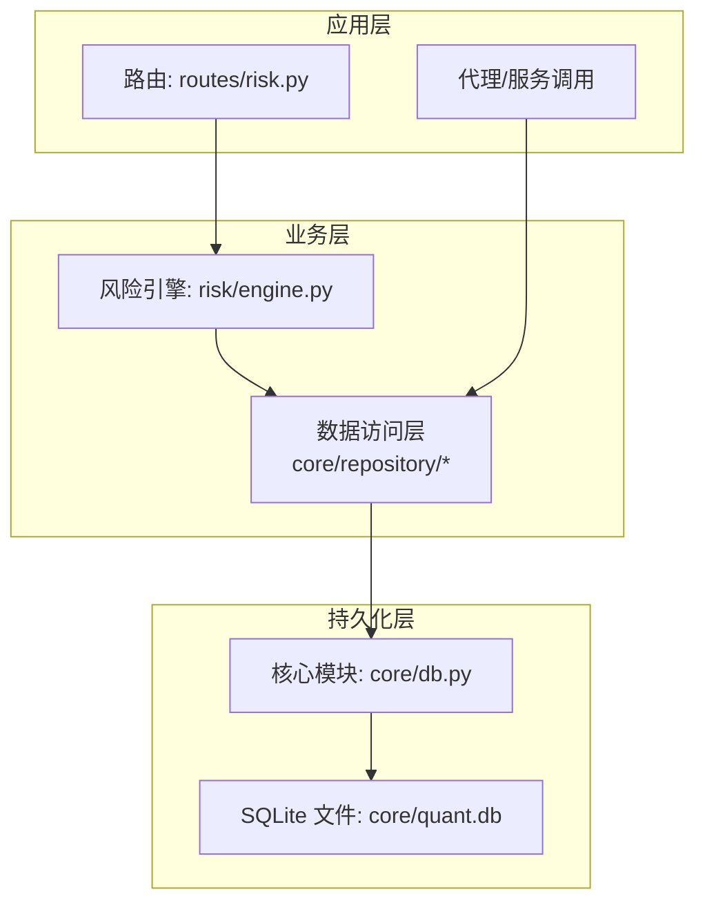
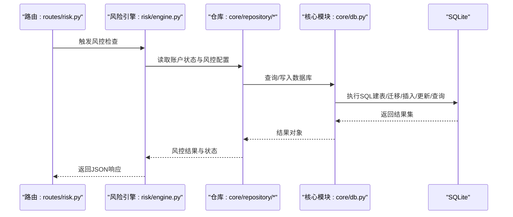
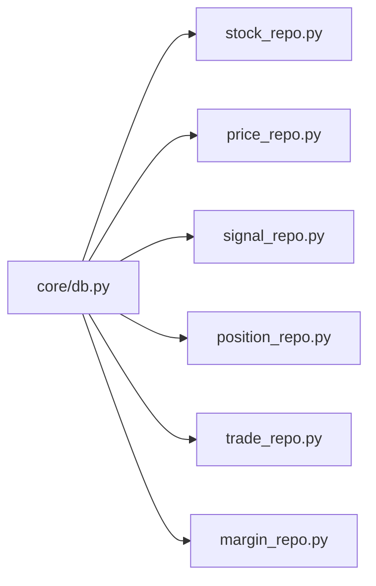

# 数据库设计

<cite>
**本文引用的文件**
- [core/db.py](file://core/db.py)
- [core/repository/__init__.py](file://core/repository/__init__.py)
- [core/repository/stock_repo.py](file://core/repository/stock_repo.py)
- [core/repository/price_repo.py](file://core/repository/price_repo.py)
- [core/repository/signal_repo.py](file://core/repository/signal_repo.py)
- [core/repository/position_repo.py](file://core/repository/position_repo.py)
- [core/repository/trade_repo.py](file://core/repository/trade_repo.py)
- [core/repository/margin_repo.py](file://core/repository/margin_repo.py)
- [routes/risk.py](file://routes/risk.py)
- [risk/engine.py](file://risk/engine.py)
</cite>

## 目录
1. [简介](#简介)
2. [项目结构](#项目结构)
3. [核心组件](#核心组件)
4. [架构总览](#架构总览)
5. [详细组件分析](#详细组件分析)
6. [依赖分析](#依赖分析)
7. [性能考虑](#性能考虑)
8. [故障排查指南](#故障排查指南)
9. [结论](#结论)
10. [附录](#附录)

## 简介
本文件面向AIQuant数据库设计，系统化阐述基于SQLite的本地数据库整体架构与15个核心数据表的设计理念、字段定义、主键/外键约束与索引策略。重点覆盖策略评分表、行情数据表、信号记录表、风控相关表等关键表，并解释数据库初始化流程、表结构迁移机制与版本兼容处理方式。最后提供表关系图与ER图，说明数据完整性约束与业务规则，并给出性能优化建议、索引策略与查询最佳实践。

## 项目结构
AIQuant采用“核心模块 + 分层仓库”的组织方式：
- 核心数据库模块位于 core/db.py，负责数据库连接、初始化、迁移与统一入口。
- 数据访问层按表拆分为多个仓库模块，如 stock_repo、price_repo、signal_repo、position_repo、trade_repo、margin_repo 等，每个仓库封装对应表的CRUD与常用查询。
- 路由层与风险引擎通过仓库接口访问数据库，形成清晰的职责边界。

图表来源
- [core/db.py:57-466](file://core/db.py#L57-L466)
- [core/repository/__init__.py:1-7](file://core/repository/__init__.py#L1-L7)
- [routes/risk.py:73-110](file://routes/risk.py#L73-L110)
- [risk/engine.py:49-71](file://risk/engine.py#L49-L71)

章节来源
- [core/db.py:57-466](file://core/db.py#L57-L466)
- [core/repository/__init__.py:1-7](file://core/repository/__init__.py#L1-L7)

## 核心组件
- 连接管理与事务控制：提供上下文管理器，设置WAL模式、同步级别与行工厂，确保并发与一致性。
- 初始化与迁移：一次性建表脚本 + 迁移辅助函数，支持安全添加列、修正索引与补充唯一索引。
- 仓库层：将每个表的操作封装为独立模块，统一对外暴露函数式接口，便于测试与替换。

章节来源
- [core/db.py:26-40](file://core/db.py#L26-L40)
- [core/db.py:57-466](file://core/db.py#L57-L466)

## 架构总览
数据库采用“单机SQLite + WAL + 业务仓库层”架构，核心表围绕“股票基础信息、日线行情、策略信号、风控、交易与账户快照、特色因子数据”展开，形成完整的量化数据闭环。

```mermaid
erDiagram
STOCK_INFO {
text code PK
text name
text market
integer is_active
text updated_at
}
DAILY_PRICE {
integer id PK
text code
text trade_date
real open
real high
real low
real close
real volume
real amount
real pct_change
real turnover
real vol_score
real ma_score
real diverge_score
real bottom_score
real whale_score
real fusion_score
real strategy_score
text strategy_signal
}
INDEX_DAILY {
integer id PK
text code
text trade_date
real open
real high
real low
real close
real volume
real amount
real pct_change
}
STOCK_SIGNAL {
integer id PK
text scan_date
text trade_date
text code
text name
real price
real fusion_score
real vol_score
real ma_score
real diverge_score
real bottom_score
real whale_score
text trigger_list
real buy_price
real stop_loss
real take_profit
integer buy_volume
real buy_money
integer sent_wechat
text created_at
}
SIGNAL_RECORDS {
integer id PK
text scan_time
text trade_date
text code
text name
real price
integer score
real stop_loss
real take_profit
integer buy_volume
real buy_money
integer sent_wechat
text note
}
SYNC_LOG {
integer id PK
text sync_time
text sync_type
integer total
integer success
integer failed
real duration_s
text note
}
POSITIONS {
integer id PK
text code
text name
text entry_date
real entry_price
integer shares
real current_price
real stop_loss
real take_profit
text position_type
text status
text strategy
text note
text created_at
text updated_at
real commission
}
TRADES {
integer id PK
integer position_id
text code
text name
text trade_date
text direction
real price
integer shares
real amount
real commission
real slippage
text reason
text note
text created_at
}
ACCOUNT_SNAPSHOTS {
integer id PK
text snapshot_date
real total_assets
real cash
real position_value
integer positions_count
real total_cost
real total_pnl
real pnl_pct
text created_at
}
STOCK_MARGIN {
integer id PK
text trade_date
real sse_margin_balance
real sse_margin_buy
real sse_short_balance
real sse_short_volume
real szse_margin_balance
real szse_margin_buy
real szse_short_balance
real szse_short_volume
real szse_margin_ratio
real total_margin_balance
real total_margin_buy
real total_short_balance
real total_margin
}
STOCK_MARGIN_DETAIL {
integer id PK
text code
text trade_date
text name
text exchange
real margin_balance
real margin_buy
real margin_repay
real short_volume
real short_sell
real short_repay
real short_balance
real total_balance
}
STOCK_HSGT_NORTH {
integer id PK
text trade_date
real north_net_buy
real north_buy_amt
real north_sell_amt
real north_cum_net
real north_daily_flow
real north_balance
real north_market_cap
real hgt_net_buy
real hgt_buy_amt
real hgt_sell_amt
real hgt_cum_net
real hgt_daily_flow
real sgt_net_buy
real sgt_buy_amt
real sgt_sell_amt
real sgt_cum_net
real sgt_daily_flow
}
INDEX_FUTURES {
integer id PK
text trade_date
text symbol
text variety
real open
real high
real low
real close
real volume
real open_interest
real turnover
real settle
real pre_settle
}
STOCK_LHB_DETAIL {
integer id PK
text trade_date
text code
text name
real close_price
real pct_change
real net_buy
real buy_amt
real sell_amt
real total_amt
real mkt_total_amt
real net_buy_ratio
real turnover_rate
real float_mkt_cap
text reason
real perf_1d
real perf_2d
real perf_5d
real perf_10d
}
STOCK_MGMT_HOLDING {
integer id PK
text trade_date
text code
text name
text changer
real change_shares
real avg_price
real change_amount
text change_reason
real change_ratio
real shares_after
text share_type
text executive_name
text position
text relation
}
RISK_EVENTS {
integer id PK
text pipeline_id
text rule_name
text category
text level
text message
real metric_value
real threshold
text suggestion
text created_at
}
RISK_STATUS {
text account_id PK
text overall_level
text active_rules
real current_drawdown
integer current_positions
real total_exposure
real available_capital
text last_check
text block_reason
text updated_at
}
BLACKLIST {
integer id PK
text stock_code
text reason
text created_by
text created_at
text expiry_date
text removed_at
}
RISK_OVERRIDES {
integer id PK
text rule_name
text reason
text operator
text approver
text status
text created_at
text expires_at
text approved_at
}
DAILY_PRICE }o--|| STOCK_INFO : "code"
TRADES }o--|| POSITIONS : "position_id"
```

图表来源
- [core/db.py:61-427](file://core/db.py#L61-L427)

## 详细组件分析

### 1) 股票基本信息表 stock_info
- 设计理念：集中维护股票基础元数据，主键为股票代码，便于快速定位与关联。
- 字段与约束：code为主键；name非空；is_active用于启用/停用；updated_at记录变更时间。
- 索引策略：无额外索引，主键即索引；查询常按code或按活跃状态过滤。
- 迁移扩展：新增市值相关字段（总股本、流通股本），支持批量更新。

章节来源
- [core/db.py:63-69](file://core/db.py#L63-L69)
- [core/db.py:442-444](file://core/db.py#L442-L444)
- [core/repository/stock_repo.py:13-28](file://core/repository/stock_repo.py#L13-L28)

### 2) 日线行情表 daily_price
- 设计理念：存储OHLCV与衍生指标，支持多维度策略评分字段，按(code, trade_date)去重。
- 字段与约束：主键自增id；code+trade_date唯一；新增策略评分字段与信号字段。
- 索引策略：复合索引(code, trade_date)与按日期索引，满足按股票范围查询与时间序列回测。
- 迁移机制：动态添加策略评分列与信号列，保证历史数据兼容。

章节来源
- [core/db.py:72-93](file://core/db.py#L72-L93)
- [core/db.py:429-437](file://core/db.py#L429-L437)
- [core/repository/price_repo.py:13-47](file://core/repository/price_repo.py#L13-L47)

### 3) 指数日行情表 index_daily
- 设计理念：存储主要宽基指数日线，供大盘择时与宏观监控使用。
- 字段与约束：主键自增id；code+trade_date唯一；字段与日线一致。
- 索引策略：复合索引(code, trade_date)与按日期索引。

章节来源
- [core/db.py:96-110](file://core/db.py#L96-L110)
- [core/repository/price_repo.py:134-167](file://core/repository/price_repo.py#L134-L167)

### 4) 策略扫描推荐表 stock_signal
- 设计理念：记录每日策略扫描的候选与建议，包含融合分与各子信号分值、止盈止损、买卖金额等。
- 字段与约束：主键自增id；scan_date+code唯一；trigger_list为JSON数组字符串。
- 索引策略：唯一索引(scan_date, code)，trade_date索引，便于按日期检索与推送。

章节来源
- [core/db.py:113-136](file://core/db.py#L113-L136)
- [core/db.py:446-456](file://core/db.py#L446-L456)
- [core/repository/signal_repo.py:46-99](file://core/repository/signal_repo.py#L46-L99)

### 5) 旧策略信号记录表 signal_records
- 设计理念：兼容历史版本的信号记录，保留扫描时间与分数等字段。
- 字段与约束：主键自增id；trade_date索引。
- 使用建议：新逻辑优先使用stock_signal，该表作为历史兼容。

章节来源
- [core/db.py:139-154](file://core/db.py#L139-L154)
- [core/repository/signal_repo.py:14-43](file://core/repository/signal_repo.py#L14-L43)

### 6) 数据同步日志表 sync_log
- 设计理念：记录各类数据源同步的耗时、成功/失败次数与备注。
- 字段与约束：主键自增id；字段直观描述同步过程。

章节来源
- [core/db.py:157-166](file://core/db.py#L157-L166)
- [core/repository/trade_repo.py:12-37](file://core/repository/trade_repo.py#L12-L37)

### 7) 持仓记录表 positions
- 设计理念：记录实盘或模拟交易的持仓状态，支持多策略、多方向与止盈止损。
- 字段与约束：主键自增id；默认状态为持有；新增commission字段。
- 索引策略：按code与status建立索引，便于快速筛选。

章节来源
- [core/db.py:169-186](file://core/db.py#L169-L186)
- [core/db.py:439](file://core/db.py#L439)
- [core/repository/position_repo.py:12-24](file://core/repository/position_repo.py#L12-L24)

### 8) 交易记录表 trades
- 设计理念：记录每笔成交的明细，与positions表通过position_id关联。
- 字段与约束：主键自增id；direction区分多空；新增slippage与reason字段。
- 索引策略：按code与trade_date索引，便于回放与统计。

章节来源
- [core/db.py:191-209](file://core/db.py#L191-L209)
- [core/repository/trade_repo.py:12-24](file://core/repository/trade_repo.py#L12-L24)

### 9) 账户资产快照表 account_snapshots
- 设计理念：按自然日记录总资产、现金、持仓价值、盈亏等关键指标。
- 字段与约束：主键自增id；snapshot_date唯一；支持UPSERT更新。
- 索引策略：按snapshot_date索引，便于时间序列分析。

章节来源
- [core/db.py:211-223](file://core/db.py#L211-L223)
- [core/repository/trade_repo.py:42-57](file://core/repository/trade_repo.py#L42-L57)

### 10) 融资融券汇总表 stock_margin
- 设计理念：记录全市场的融资融券汇总数据，按交易日唯一。
- 字段与约束：主键自增id；trade_date唯一；包含上交所与深交所明细与合计。
- 索引策略：按trade_date索引。

章节来源
- [core/db.py:226-244](file://core/db.py#L226-L244)
- [core/repository/margin_repo.py:29-80](file://core/repository/margin_repo.py#L29-L80)

### 11) 融资融券明细表 stock_margin_detail
- 设计理念：记录个股的融资融券明细，按(code, trade_date)唯一。
- 字段与约束：主键自增id；字段覆盖余额、买入、偿还等关键指标。
- 索引策略：按(code, trade_date)与按日期索引。

章节来源
- [core/db.py:247-263](file://core/db.py#L247-L263)
- [core/repository/margin_repo.py:114-162](file://core/repository/margin_repo.py#L114-L162)

### 12) 北向资金表 stock_hsgt_north
- 设计理念：记录沪深港通北向资金流，包含日度净买、累计净买、额度等。
- 字段与约束：主键自增id；trade_date唯一。
- 索引策略：按trade_date索引。

章节来源
- [core/db.py:266-288](file://core/db.py#L266-L288)
- [core/repository/margin_repo.py:114-162](file://core/repository/margin_repo.py#L114-L162)

### 13) 指数期货表 index_futures
- 设计理念：记录股指期货的主力合约或品种行情，按(trade_date, symbol)唯一。
- 字段与约束：主键自增id；字段覆盖开盘、最高、最低、收盘、成交量、持仓量等。
- 索引策略：按trade_date与按日期+品种索引。

章节来源
- [core/db.py:291-309](file://core/db.py#L291-L309)
- [core/repository/margin_repo.py:114-162](file://core/repository/margin_repo.py#L114-L162)

### 14) 龙虎榜明细表 stock_lhb_detail
- 设计理念：记录个股龙虎榜交易明细，包含净买额、买/卖额、换手率等。
- 字段与约束：主键自增id；(trade_date, code)唯一；包含短期涨跌幅指标。
- 索引策略：按trade_date与按code索引。

章节来源
- [core/db.py:311-334](file://core/db.py#L311-L334)
- [core/repository/margin_repo.py:114-162](file://core/repository/margin_repo.py#L114-L162)

### 15) 高管持股变动表 stock_mgmt_holding
- 设计理念：记录上市公司高管的增减持明细，按多重字段组合唯一。
- 字段与约束：主键自增id；唯一性组合覆盖交易日期、股票、交易人、数量与均价。
- 索引策略：按trade_date与按code索引。

章节来源
- [core/db.py:337-357](file://core/db.py#L337-L357)
- [core/repository/margin_repo.py:114-162](file://core/repository/margin_repo.py#L114-L162)

### 风控相关表
- 风控事件表 risk_events：记录规则触发事件、阈值、建议与等级。
- 风控状态表 risk_status：记录账户整体风控等级、活跃规则、可用资金等。
- 黑名单表 blacklist：记录被限制交易的股票及有效期。
- 风控豁免表 risk_overrides：记录豁免申请与审批状态。

章节来源
- [core/db.py:359-414](file://core/db.py#L359-L414)
- [routes/risk.py:73-110](file://routes/risk.py#L73-L110)
- [risk/engine.py:49-71](file://risk/engine.py#L49-L71)

## 架构总览

图表来源
- [routes/risk.py:73-110](file://routes/risk.py#L73-L110)
- [risk/engine.py:49-71](file://risk/engine.py#L49-L71)
- [core/db.py:57-466](file://core/db.py#L57-L466)

## 详细组件分析

### 数据库初始化流程
- 连接参数：WAL模式、NORMAL同步级别、Row行工厂。
- 建表脚本：一次性执行所有表的DDL，包含主键、唯一约束与索引。
- 迁移步骤：
  - 为daily_price补充策略评分列与信号列。
  - 为positions补充commission列。
  - 为stock_info补充市值字段。
  - 修正stock_signal唯一索引（移除trade_date）。
  - 补建唯一索引以应对重复建表场景。

章节来源
- [core/db.py:26-40](file://core/db.py#L26-L40)
- [core/db.py:57-466](file://core/db.py#L57-L466)

### 表结构迁移机制与版本兼容
- 安全添加列：通过捕获OperationalError避免重复添加列导致异常。
- 唯一索引修正：先尝试删除旧索引，再创建新索引，保证兼容性。
- 补建唯一索引：针对重复建表场景，补充缺失的唯一索引。
- 字段演进：通过条件判断与默认值，逐步引入新字段而不破坏历史数据。

章节来源
- [core/db.py:45-50](file://core/db.py#L45-L50)
- [core/db.py:446-464](file://core/db.py#L446-L464)

### 关键表结构与业务规则
- daily_price：(code, trade_date)唯一，策略评分与行情分离更新，避免重复写入。
- stock_signal：唯一索引(scan_date, code)，trigger_list为JSON数组，便于前端展示。
- positions/trades：通过position_id关联，支持部分平仓与全平仓两种模式。
- risk_events/risk_status：事件驱动式风控，支持按等级与时间排序查询。

章节来源
- [core/db.py:90](file://core/db.py#L90)
- [core/db.py:135](file://core/db.py#L135)
- [core/db.py:187-188](file://core/db.py#L187-L188)
- [core/db.py:375-386](file://core/db.py#L375-L386)

### 仓库层与核心模块的协作
- 仓库层函数统一通过_get_conn()获取连接，减少耦合。
- 核心模块提供兼容层，将旧调用路径映射到新的仓库模块，保障平滑过渡。

章节来源
- [core/repository/stock_repo.py:8-10](file://core/repository/stock_repo.py#L8-L10)
- [core/repository/price_repo.py:8-10](file://core/repository/price_repo.py#L8-L10)
- [core/repository/signal_repo.py:9-11](file://core/repository/signal_repo.py#L9-L11)
- [core/repository/position_repo.py:7-9](file://core/repository/position_repo.py#L7-L9)
- [core/repository/trade_repo.py:7-9](file://core/repository/trade_repo.py#L7-L9)
- [core/db.py:1161-1200](file://core/db.py#L1161-L1200)

## 依赖分析

图表来源
- [core/db.py:1161-1200](file://core/db.py#L1161-L1200)

章节来源
- [core/db.py:1161-1200](file://core/db.py#L1161-L1200)

## 性能考虑
- 并发与一致性：WAL模式提升写入并发能力；NORMAL同步级别在性能与可靠性间取得平衡。
- 索引策略：
  - 日线与指数日线：按(code, trade_date)与按trade_date建立复合索引，满足按股票范围与按日期范围查询。
  - 信号与风控：按日期倒序索引与按等级索引，便于快速筛选高风险事件。
  - 持仓与交易：按code与status索引，支持快速定位活跃持仓与按日期回放。
- 查询优化：
  - 使用UNIQUE索引避免重复写入，减少冲突开销。
  - 对于大表查询，优先使用复合索引覆盖查询列，避免回表。
  - 时间序列查询尽量使用连续日期范围，避免随机点查询。
- 写入优化：
  - 批量写入使用executemany与PRAGMA foreign_keys=OFF（在允许的场景下）降低锁竞争。
  - UPSERT语句替代多次UPDATE，减少往返与锁竞争。

## 故障排查指南
- 建表/迁移失败：确认WAL模式与权限；检查唯一索引是否存在冲突；必要时手动删除旧索引后重试。
- 查询慢：核对是否命中复合索引；避免在索引列上使用函数或隐式转换；使用EXPLAIN QUERY PLAN分析执行计划。
- 数据不一致：检查是否在事务中提交；确认PRAGMA设置与连接池使用；关注FOREIGN KEY约束与UNIQUE约束。
- 风控异常：检查risk_events与risk_status表的写入流程；核对规则等级与阈值配置；确认黑名单与豁免状态。

章节来源
- [core/db.py:26-40](file://core/db.py#L26-L40)
- [core/db.py:446-464](file://core/db.py#L446-L464)

## 结论
AIQuant数据库以SQLite为核心，结合WAL与合理的索引策略，构建了覆盖行情、信号、风控、交易与账户快照的完整数据体系。通过仓库层解耦与核心模块的迁移兼容机制，实现了良好的可维护性与演进能力。建议在生产环境中持续监控索引使用情况与查询计划，配合定期归档与压缩策略，确保长期稳定运行。

## 附录
- 数据库路径：core/quant.db
- 初始化入口：直接运行core/db.py或通过应用启动流程触发init_db()