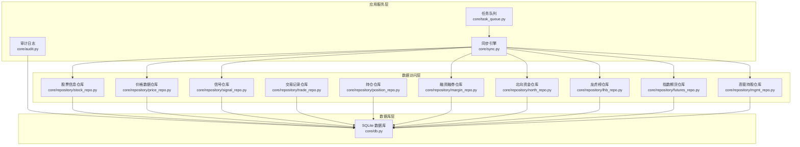
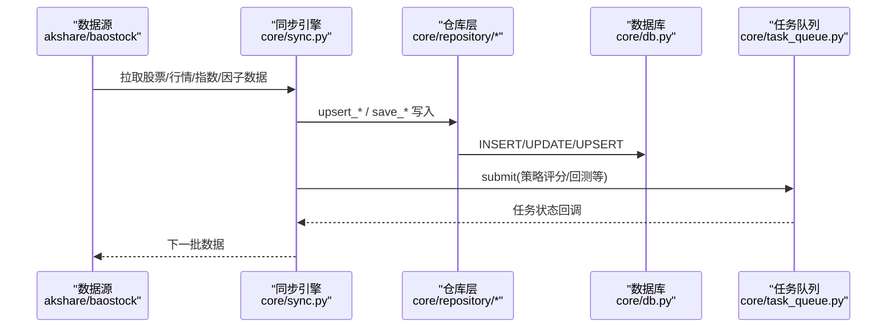
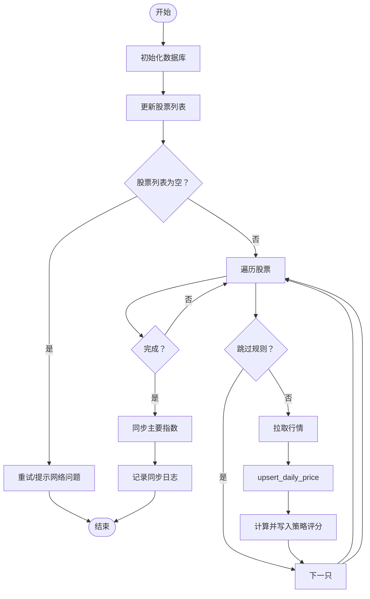
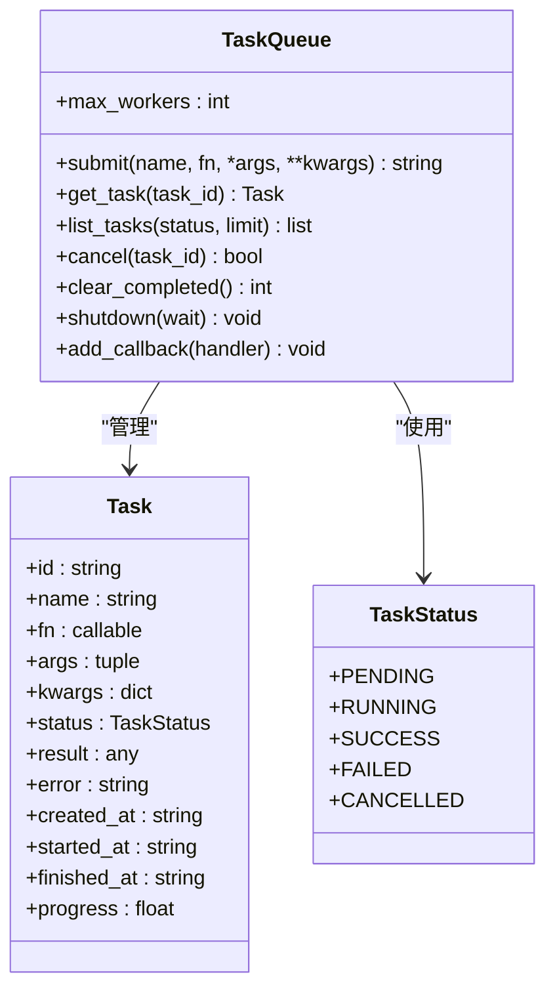
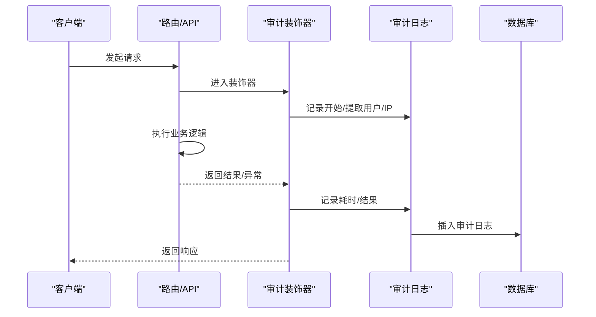
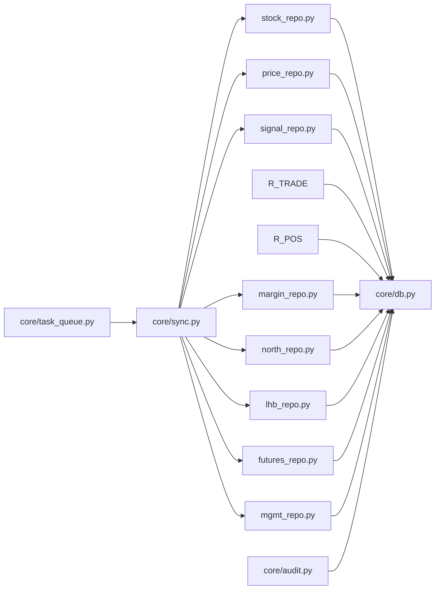

# 数据管理层

<cite>
**本文引用的文件**
- [core/db.py](file://core/db.py)
- [core/sync.py](file://core/sync.py)
- [core/task_queue.py](file://core/task_queue.py)
- [core/audit.py](file://core/audit.py)
- [core/repository/__init__.py](file://core/repository/__init__.py)
- [core/repository/stock_repo.py](file://core/repository/stock_repo.py)
- [core/repository/price_repo.py](file://core/repository/price_repo.py)
- [core/repository/signal_repo.py](file://core/repository/signal_repo.py)
- [core/repository/trade_repo.py](file://core/repository/trade_repo.py)
- [core/repository/position_repo.py](file://core/repository/position_repo.py)
- [core/repository/margin_repo.py](file://core/repository/margin_repo.py)
- [core/repository/north_repo.py](file://core/repository/north_repo.py)
- [core/repository/lhb_repo.py](file://core/repository/lhb_repo.py)
- [core/repository/futures_repo.py](file://core/repository/futures_repo.py)
- [core/repository/mgmt_repo.py](file://core/repository/mgmt_repo.py)
</cite>

## 目录
1. [简介](#简介)
2. [项目结构](#项目结构)
3. [核心组件](#核心组件)
4. [架构总览](#架构总览)
5. [详细组件分析](#详细组件分析)
6. [依赖分析](#依赖分析)
7. [性能考量](#性能考量)
8. [故障排查指南](#故障排查指南)
9. [结论](#结论)
10. [附录](#附录)

## 简介
本文件面向AIQuant数据管理层，系统性阐述仓库模式实现、数据库设计与数据访问层架构，详解各仓库类的职责边界，并结合数据同步机制、任务队列管理与审计日志体系，给出数据模型、索引设计与查询优化策略，以及数据一致性、并发控制与事务管理机制。同时提供数据迁移、备份恢复与性能监控的最佳实践建议。

## 项目结构
数据管理层由三层构成：
- 数据库层：基于SQLite的本地数据库，集中定义表结构、索引与迁移逻辑。
- 数据访问层（Repository）：按表拆分的轻量DAO，封装CRUD与常用查询。
- 应用服务层：同步引擎、任务队列、审计日志等，协调数据采集、处理与记录。

图表来源
- [core/sync.py:1-760](file://core/sync.py#L1-L760)
- [core/task_queue.py:1-222](file://core/task_queue.py#L1-L222)
- [core/audit.py:1-147](file://core/audit.py#L1-L147)
- [core/repository/stock_repo.py:1-80](file://core/repository/stock_repo.py#L1-L80)
- [core/repository/price_repo.py:1-237](file://core/repository/price_repo.py#L1-L237)
- [core/repository/signal_repo.py:1-119](file://core/repository/signal_repo.py#L1-L119)
- [core/repository/trade_repo.py:1-77](file://core/repository/trade_repo.py#L1-L77)
- [core/repository/position_repo.py:1-138](file://core/repository/position_repo.py#L1-L138)
- [core/repository/margin_repo.py:1-186](file://core/repository/margin_repo.py#L1-L186)
- [core/repository/north_repo.py:1-117](file://core/repository/north_repo.py#L1-L117)
- [core/repository/lhb_repo.py:1-99](file://core/repository/lhb_repo.py#L1-L99)
- [core/repository/futures_repo.py:1-109](file://core/repository/futures_repo.py#L1-L109)
- [core/repository/mgmt_repo.py:1-103](file://core/repository/mgmt_repo.py#L1-L103)
- [core/db.py:1-1213](file://core/db.py#L1-L1213)

章节来源
- [core/repository/__init__.py:1-7](file://core/repository/__init__.py#L1-L7)
- [core/db.py:57-467](file://core/db.py#L57-L467)

## 核心组件
- 数据库层（core/db.py）
  - 初始化数据库、建表与索引、迁移辅助、连接管理与事务封装。
  - 提供股票、行情、信号、交易、持仓、风控、审计等表的读写接口。
- 仓库层（core/repository/*）
  - 按表拆分的轻量DAO，封装高频CRUD与查询，屏蔽SQL细节。
  - 以“表名_repo.py”的命名规范组织，职责单一、边界清晰。
- 同步引擎（core/sync.py）
  - 负责全市场/增量数据同步、策略评分计算与落库、指数数据同步、市值数据同步。
  - 支持断点续传、缓存、覆盖率判定与多线程（部分场景）。
- 任务队列（core/task_queue.py）
  - 轻量异步任务队列，支持任务提交、状态跟踪、回调与清理。
- 审计日志（core/audit.py）
  - 统一日志记录与查询，支持装饰器自动审计API调用。

章节来源
- [core/db.py:26-39](file://core/db.py#L26-L39)
- [core/sync.py:136-176](file://core/sync.py#L136-L176)
- [core/sync.py:319-390](file://core/sync.py#L319-L390)
- [core/sync.py:462-668](file://core/sync.py#L462-L668)
- [core/task_queue.py:51-100](file://core/task_queue.py#L51-L100)
- [core/audit.py:16-39](file://core/audit.py#L16-L39)

## 架构总览
数据流向自上游数据源（akshare/baostock）经同步引擎汇聚至数据库，仓库层提供稳定接口供上层业务调用；任务队列承载异步任务，审计日志贯穿关键操作。

图表来源
- [core/sync.py:217-314](file://core/sync.py#L217-L314)
- [core/sync.py:675-701](file://core/sync.py#L675-L701)
- [core/repository/price_repo.py:13-47](file://core/repository/price_repo.py#L13-L47)
- [core/repository/stock_repo.py:13-28](file://core/repository/stock_repo.py#L13-L28)
- [core/task_queue.py:64-82](file://core/task_queue.py#L64-L82)

## 详细组件分析

### 数据库层与表结构
- 连接管理与事务
  - 使用上下文管理器确保连接生命周期与异常回滚。
  - WAL模式与同步级别折中以提升并发与可靠性。
- 表结构概览
  - 股票信息、日行情、指数行情、信号记录、同步日志、持仓、交易、账户快照、融资融券、北向资金、龙虎榜、指数期货、高管持股、风控事件、风控状态、黑名单、风险豁免、审计日志等。
- 索引设计
  - 日行情：code+trade_date唯一索引，trade_date普通索引。
  - 指数行情：code+trade_date唯一索引，trade_date普通索引。
  - 信号：scan_date+code唯一索引，trade_date普通索引。
  - 持仓：code、status索引。
  - 交易：code、trade_date索引。
  - 账户快照：snapshot_date索引。
  - 融资融券：trade_date索引。
  - 北向资金：trade_date索引。
  - 龙虎榜：trade_date、code索引。
  - 指数期货：trade_date、trade_date+variety索引。
  - 高管持股：trade_date索引。
  - 风控事件：created_at降序、level索引。
  - 风控豁免：status、expires_at索引。
  - 审计日志：created_at降序索引。
- 迁移与兼容
  - 提供列安全添加、唯一索引重建、字段补全等迁移能力，保障历史数据平滑演进。

章节来源
- [core/db.py:26-39](file://core/db.py#L26-L39)
- [core/db.py:57-467](file://core/db.py#L57-L467)
- [core/db.py:429-466](file://core/db.py#L429-L466)

### 仓库模式与职责边界
- 仓库层遵循“按表拆分”的单一职责原则，每个仓库专注一张表的CRUD与常用查询。
- 仓库内部通过共享的连接工厂获取连接，避免重复连接管理。
- 仓库方法命名与语义清晰，便于上层业务直接调用。

章节来源
- [core/repository/__init__.py:1-7](file://core/repository/__init__.py#L1-L7)
- [core/repository/stock_repo.py:13-80](file://core/repository/stock_repo.py#L13-L80)
- [core/repository/price_repo.py:13-237](file://core/repository/price_repo.py#L13-L237)
- [core/repository/signal_repo.py:14-119](file://core/repository/signal_repo.py#L14-L119)
- [core/repository/trade_repo.py:12-77](file://core/repository/trade_repo.py#L12-L77)
- [core/repository/position_repo.py:12-138](file://core/repository/position_repo.py#L12-L138)
- [core/repository/margin_repo.py:29-186](file://core/repository/margin_repo.py#L29-L186)
- [core/repository/north_repo.py:27-117](file://core/repository/north_repo.py#L27-L117)
- [core/repository/lhb_repo.py:27-99](file://core/repository/lhb_repo.py#L27-L99)
- [core/repository/futures_repo.py:27-109](file://core/repository/futures_repo.py#L27-L109)
- [core/repository/mgmt_repo.py:27-103](file://core/repository/mgmt_repo.py#L27-L103)

### 股票信息仓库（stock_repo）
- 职责：批量写入/更新股票列表、更新市值数据、查询股票列表与名称。
- 关键点：使用ON CONFLICT更新，确保幂等；支持批量市值更新。

章节来源
- [core/repository/stock_repo.py:13-80](file://core/repository/stock_repo.py#L13-L80)

### 价格数据仓库（price_repo）
- 职责：写入/更新日行情、批量更新策略评分、读取日行情与指数行情、查询最新交易日、是否存在当日数据、全市场股票数量等。
- 关键点：批量UPSERT减少往返；策略评分单独批量更新，避免重复解析行情。

章节来源
- [core/repository/price_repo.py:13-237](file://core/repository/price_repo.py#L13-L237)

### 信号仓库（signal_repo）
- 职责：保存策略筛选记录与每日扫描推荐，查询当日或指定日期信号。
- 关键点：兼容旧表与新表双通道；扫描推荐表采用INSERT OR REPLACE保证幂等。

章节来源
- [core/repository/signal_repo.py:14-119](file://core/repository/signal_repo.py#L14-L119)

### 交易记录仓库（trade_repo）
- 职责：添加交易记录、查询交易流水、保存账户快照、查询最近N天快照与最新快照。
- 关键点：账户快照按日期UPSERT，避免重复写入。

章节来源
- [core/repository/trade_repo.py:12-77](file://core/repository/trade_repo.py#L12-L77)

### 持仓仓库（position_repo）
- 职责：开仓、平仓、部分平仓、更新当前价、查询持仓列表与汇总统计。
- 关键点：部分平仓通过“减仓+新增已平仓记录”实现，保证历史可追溯。

章节来源
- [core/repository/position_repo.py:12-138](file://core/repository/position_repo.py#L12-L138)

### 融资融券仓库（margin_repo）
- 职责：写入全市场融资融券汇总、查询；写入个股明细、查询明细；获取最新日期。
- 关键点：统一日期格式清洗与空值处理，按日期或code+日期UPSERT。

章节来源
- [core/repository/margin_repo.py:29-186](file://core/repository/margin_repo.py#L29-L186)

### 北向资金仓库（north_repo）
- 职责：写入北向资金流数据、查询、获取最新日期。
- 关键点：字段清洗与日期标准化，按trade_date UPSERT。

章节来源
- [core/repository/north_repo.py:27-117](file://core/repository/north_repo.py#L27-L117)

### 龙虎榜仓库（lhb_repo）
- 职责：写入明细、查询、获取最新日期。
- 关键点：按trade_date+code唯一约束，避免重复。

章节来源
- [core/repository/lhb_repo.py:27-99](file://core/repository/lhb_repo.py#L27-L99)

### 指数期货仓库（futures_repo）
- 职责：写入指数期货数据、按品种/日期查询、获取最新日期。
- 关键点：按trade_date+symbol唯一约束。

章节来源
- [core/repository/futures_repo.py:27-109](file://core/repository/futures_repo.py#L27-L109)

### 高管持股仓库（mgmt_repo）
- 职责：写入高管变动明细、查询、获取最新日期。
- 关键点：按多字段唯一约束，避免重复。

章节来源
- [core/repository/mgmt_repo.py:27-103](file://core/repository/mgmt_repo.py#L27-L103)

### 数据同步机制（sync）
- 股票列表：从上游抓取并写入stock_info。
- 历史初始化：断点续传，支持跳过ST/退市/北交所股票。
- 增量同步：单线程（baostock限制）+缓存，按覆盖率动态确定同步区间。
- 策略评分：对历史全量计算并批量写入daily_price策略评分列。
- 指数同步：每日同步主要指数到index_daily。
- 市值同步：批量写入总股本/流通股本。

图表来源
- [core/sync.py:136-176](file://core/sync.py#L136-L176)
- [core/sync.py:319-390](file://core/sync.py#L319-L390)
- [core/sync.py:462-668](file://core/sync.py#L462-L668)
- [core/sync.py:675-701](file://core/sync.py#L675-L701)

章节来源
- [core/sync.py:39-60](file://core/sync.py#L39-L60)
- [core/sync.py:63-72](file://core/sync.py#L63-L72)
- [core/sync.py:91-131](file://core/sync.py#L91-L131)
- [core/sync.py:136-176](file://core/sync.py#L136-L176)
- [core/sync.py:319-390](file://core/sync.py#L319-L390)
- [core/sync.py:462-668](file://core/sync.py#L462-L668)
- [core/sync.py:675-701](file://core/sync.py#L675-L701)

### 任务队列管理（task_queue）
- 职责：异步任务提交、执行、状态跟踪、结果存储、回调通知、清理。
- 关键点：线程池执行器、任务状态枚举、锁保护、回调链路。

图表来源
- [core/task_queue.py:25-50](file://core/task_queue.py#L25-L50)
- [core/task_queue.py:51-100](file://core/task_queue.py#L51-L100)
- [core/task_queue.py:102-161](file://core/task_queue.py#L102-L161)
- [core/task_queue.py:169-180](file://core/task_queue.py#L169-L180)
- [core/task_queue.py:216-222](file://core/task_queue.py#L216-L222)

章节来源
- [core/task_queue.py:51-100](file://core/task_queue.py#L51-L100)
- [core/task_queue.py:102-161](file://core/task_queue.py#L102-L161)
- [core/task_queue.py:169-180](file://core/task_queue.py#L169-L180)
- [core/task_queue.py:216-222](file://core/task_queue.py#L216-L222)

### 审计日志系统（audit）
- 职责：统一记录用户行为、操作结果、耗时、IP等；提供查询接口。
- 关键点：装饰器自动审计API调用，异常捕获与错误日志记录。

图表来源
- [core/audit.py:41-92](file://core/audit.py#L41-L92)
- [core/audit.py:107-147](file://core/audit.py#L107-L147)

章节来源
- [core/audit.py:16-39](file://core/audit.py#L16-L39)
- [core/audit.py:107-147](file://core/audit.py#L107-L147)

## 依赖分析
- 低耦合高内聚：仓库层仅依赖数据库连接工厂，避免跨表复杂依赖。
- 同步引擎聚合多仓库：集中编排数据采集与落库流程。
- 任务队列与审计日志作为横切关注点，被广泛复用。

图表来源
- [core/sync.py:17-26](file://core/sync.py#L17-L26)
- [core/repository/stock_repo.py:8-10](file://core/repository/stock_repo.py#L8-L10)
- [core/repository/price_repo.py:8-10](file://core/repository/price_repo.py#L8-L10)
- [core/repository/signal_repo.py:9-11](file://core/repository/signal_repo.py#L9-L11)
- [core/repository/trade_repo.py:7-9](file://core/repository/trade_repo.py#L7-L9)
- [core/repository/position_repo.py:7-9](file://core/repository/position_repo.py#L7-L9)
- [core/repository/margin_repo.py:7-9](file://core/repository/margin_repo.py#L7-L9)
- [core/repository/north_repo.py:7-9](file://core/repository/north_repo.py#L7-L9)
- [core/repository/lhb_repo.py:7-9](file://core/repository/lhb_repo.py#L7-L9)
- [core/repository/futures_repo.py:7-9](file://core/repository/futures_repo.py#L7-L9)
- [core/repository/mgmt_repo.py:7-9](file://core/repository/mgmt_repo.py#L7-L9)
- [core/task_queue.py:54-56](file://core/task_queue.py#L54-L56)
- [core/audit.py:13](file://core/audit.py#L13)

章节来源
- [core/sync.py:17-26](file://core/sync.py#L17-L26)
- [core/task_queue.py:54-56](file://core/task_queue.py#L54-L56)
- [core/audit.py:13](file://core/audit.py#L13)

## 性能考量
- 连接与事务
  - 使用上下文管理器确保事务原子性与异常回滚；WAL与同步级别折中兼顾并发与可靠性。
- 批量写入
  - 优先使用executemany与UPSERT，减少往返与锁竞争。
- 索引与查询
  - 为高频过滤字段建立索引；避免SELECT *，仅取必要列。
- 并发与限流
  - 同步引擎对上游接口进行基础延迟与批次间隔控制；任务队列限制最大并发。
- 缓存与断点续传
  - 增量同步使用缓存文件记录已同步股票，支持断点续传，降低重复成本。

[本节为通用指导，无需特定文件引用]

## 故障排查指南
- 数据库连接失败
  - 检查数据库路径与权限；确认WAL与同步设置未被外部修改。
- 同步中断/覆盖率不足
  - 查看同步缓存文件与日志；确认交易日判断与覆盖率阈值设置。
- 任务队列堆积
  - 检查max_workers与任务状态；清理已完成任务释放内存。
- 审计日志缺失
  - 确认装饰器使用正确；检查数据库连接与异常吞吐。

章节来源
- [core/db.py:26-39](file://core/db.py#L26-L39)
- [core/sync.py:422-450](file://core/sync.py#L422-L450)
- [core/task_queue.py:151-161](file://core/task_queue.py#L151-L161)
- [core/audit.py:28-39](file://core/audit.py#L28-L39)

## 结论
本数据管理层以仓库模式为核心，配合完善的数据库设计、同步引擎、任务队列与审计日志，构建了高内聚、低耦合且具备良好扩展性的数据基础设施。通过索引优化、批量写入与断点续传等手段，在保证数据一致性的同时提升了整体性能与稳定性。

[本节为总结，无需特定文件引用]

## 附录
- 数据迁移最佳实践
  - 使用迁移辅助函数安全添加列；对唯一索引变更采用先删后建策略；对历史数据进行回填与校验。
- 备份与恢复
  - 定期备份SQLite文件；验证备份完整性；制定恢复演练流程。
- 性能监控
  - 监控同步耗时、任务队列长度、数据库锁等待；对慢查询建立索引与SQL剖析。

[本节为通用指导，无需特定文件引用]