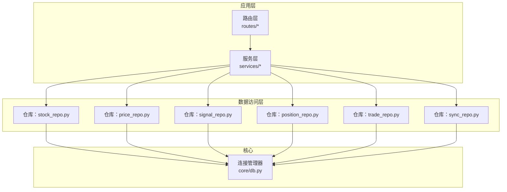
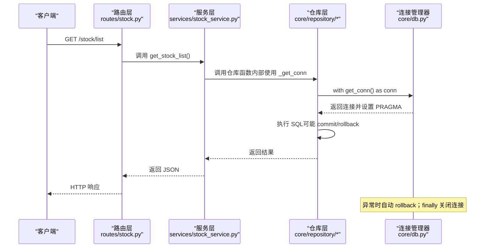
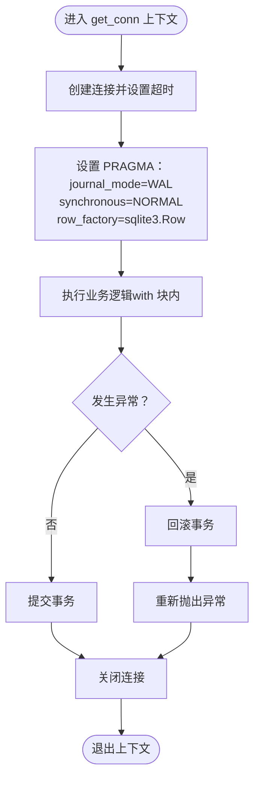
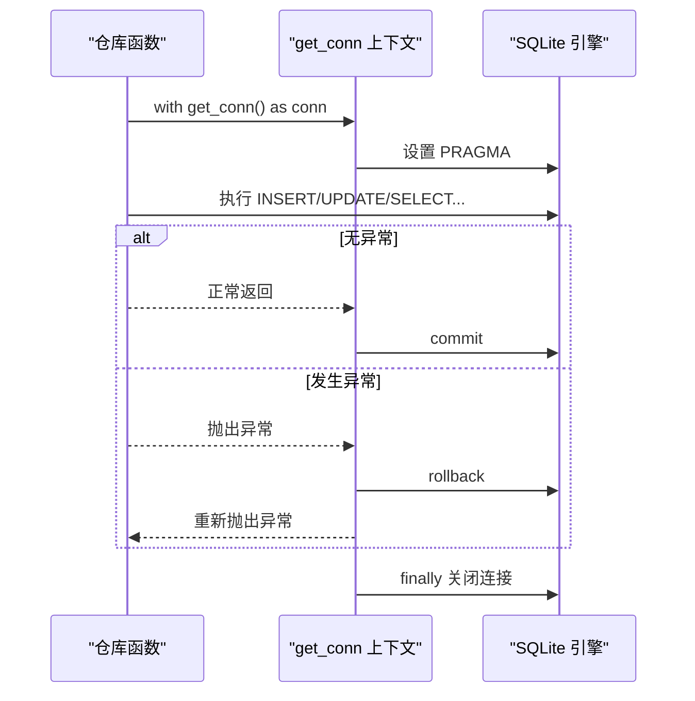
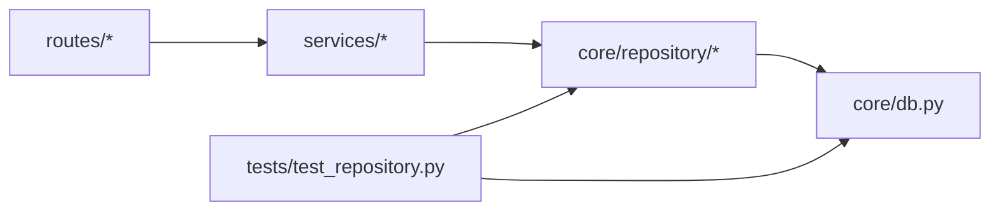

# 连接管理器

<cite>
**本文引用的文件**
- [core/db.py](file://core/db.py)
- [core/repository/__init__.py](file://core/repository/__init__.py)
- [core/repository/stock_repo.py](file://core/repository/stock_repo.py)
- [core/repository/price_repo.py](file://core/repository/price_repo.py)
- [services/stock_service.py](file://services/stock_service.py)
- [ministries/rites/data_source_manager.py](file://ministries/rites/data_source_manager.py)
- [routes/stock.py](file://routes/stock.py)
- [tests/test_repository.py](file://tests/test_repository.py)
</cite>

## 目录
1. [简介](#简介)
2. [项目结构](#项目结构)
3. [核心组件](#核心组件)
4. [架构总览](#架构总览)
5. [组件详解](#组件详解)
6. [依赖关系分析](#依赖关系分析)
7. [性能考量](#性能考量)
8. [故障排查指南](#故障排查指南)
9. [结论](#结论)
10. [附录](#附录)

## 简介
本文件面向“AIQuant”项目的数据库连接管理器，聚焦于本地 SQLite 的连接上下文管理、WAL 模式与同步级别配置、PRAGMA 设置对性能与一致性的权衡、事务处理流程（自动提交与回滚）、以及围绕连接泄漏防护、异常处理与资源清理的最佳实践。文档同时给出使用示例与常见问题的解决方案，并通过图示帮助读者快速理解代码级交互。

## 项目结构
AIQuant 的数据库层采用“连接上下文管理器 + 分层仓库”的设计：
- 核心连接与初始化：位于 core/db.py
- 业务仓库按表拆分：位于 core/repository/*.py
- 上层服务与路由调用仓库：services/* 与 routes/*
- 测试验证仓库可导入性与兼容性：tests/test_repository.py

图表来源
- [core/repository/__init__.py:1-7](file://core/repository/__init__.py#L1-L7)
- [core/repository/stock_repo.py:1-80](file://core/repository/stock_repo.py#L1-L80)
- [core/repository/price_repo.py:1-237](file://core/repository/price_repo.py#L1-L237)
- [services/stock_service.py:1-194](file://services/stock_service.py#L1-L194)
- [routes/stock.py:1-88](file://routes/stock.py#L1-L88)
- [core/db.py:1-1213](file://core/db.py#L1-L1213)

章节来源
- [core/repository/__init__.py:1-7](file://core/repository/__init__.py#L1-L7)
- [core/db.py:1-1213](file://core/db.py#L1-L1213)

## 核心组件
- 连接上下文管理器：提供统一的连接创建、PRAGMA 初始化、自动提交/回滚与资源回收
- 仓库层：按表拆分的数据访问层，封装 SQL 与业务逻辑
- 兼容层导出：将仓库函数重新导出到 core.db，保持旧代码可用性

关键要点
- 使用上下文管理器确保异常时自动回滚与连接关闭
- WAL 模式与同步级别在连接建立时一次性设置，影响并发与持久化安全
- PRAGMA foreign_keys 在批量更新时临时关闭，避免外键约束导致的性能与兼容性问题

章节来源
- [core/db.py:26-39](file://core/db.py#L26-L39)
- [core/db.py:57-467](file://core/db.py#L57-L467)
- [core/repository/price_repo.py:79-92](file://core/repository/price_repo.py#L79-L92)
- [core/repository/stock_repo.py:13-28](file://core/repository/stock_repo.py#L13-L28)

## 架构总览
下图展示从路由到仓库再到连接管理器的整体调用链路与事务控制：

图表来源
- [routes/stock.py:27-34](file://routes/stock.py#L27-L34)
- [services/stock_service.py:23-46](file://services/stock_service.py#L23-L46)
- [core/repository/stock_repo.py:13-28](file://core/repository/stock_repo.py#L13-L28)
- [core/db.py:26-39](file://core/db.py#L26-L39)

## 组件详解

### 连接上下文管理器（get_conn）
- 设计模式：使用上下文管理器，确保资源生命周期可控
- 关键行为：
  - 创建连接并设置超时
  - 设置 WAL 日志模式与同步级别
  - 设置行工厂，便于字典式访问
  - try/except/finally 实现自动提交、回滚与关闭
- 事务语义：
  - 成功退出 with 块：commit
  - 抛出异常：rollback，再抛出异常
  - finally：关闭连接，避免连接泄漏

图表来源
- [core/db.py:26-39](file://core/db.py#L26-L39)

章节来源
- [core/db.py:26-39](file://core/db.py#L26-L39)

### WAL 模式与同步级别
- WAL 模式（journal_mode=WAL）：允许多读并发写，降低锁竞争，适合高频读写场景
- 同步级别（synchronous=NORMAL）：在性能与安全性之间折中，默认 fsync 频度适中
- 适用性：本项目为本地 SQLite，数据体量适中，WAL 提升并发，NORMAL 保证基本可靠性

章节来源
- [core/db.py:29-30](file://core/db.py#L29-L30)

### PRAGMA 设置与性能影响
- journal_mode=WAL：显著提升并发读写能力，减少写入阻塞
- synchronous=NORMAL：降低 fsync 次数，提高吞吐，牺牲极小的崩溃风险
- row_factory=sqlite3.Row：返回可按列名访问的行对象，便于字典式处理
- foreign_keys=OFF：在批量更新策略评分时关闭外键检查，避免不必要的约束开销

章节来源
- [core/db.py:31](file://core/db.py#L31)
- [core/repository/price_repo.py:80](file://core/repository/price_repo.py#L80)

### 事务处理流程与自动提交/回滚
- 自动提交：with 块成功退出即 commit
- 自动回滚：with 块抛出异常即 rollback，随后重新抛出异常
- 事务边界：每个仓库函数内的 with get_conn() 即一次独立事务

图表来源
- [core/db.py:26-39](file://core/db.py#L26-L39)
- [core/repository/price_repo.py:36-47](file://core/repository/price_repo.py#L36-L47)

章节来源
- [core/db.py:26-39](file://core/db.py#L26-L39)
- [core/repository/price_repo.py:36-47](file://core/repository/price_repo.py#L36-L47)

### 连接泄漏防护与资源清理
- 严格使用 with get_conn()：确保异常路径也能关闭连接
- 仓库层统一通过 _get_conn() 获取连接，避免绕过上下文管理器
- 业务层尽量短事务、及时释放资源

章节来源
- [core/repository/stock_repo.py:18-28](file://core/repository/stock_repo.py#L18-L28)
- [core/repository/price_repo.py:36-47](file://core/repository/price_repo.py#L36-L47)

### 数据库初始化与迁移
- 初始化：创建所有表与索引，使用 executescript 一次性执行
- 迁移：安全添加列、修正索引、补充唯一索引，捕获 OperationalError 并忽略“列已存在”等预期错误

章节来源
- [core/db.py:57-467](file://core/db.py#L57-L467)
- [core/db.py:45-51](file://core/db.py#L45-L51)

### 仓库层与兼容层
- 仓库层：按表拆分，每个仓库函数内部使用 _get_conn()，封装 SQL 与业务逻辑
- 兼容层：core.db 将仓库函数重新导出，保持旧代码可用

章节来源
- [core/repository/stock_repo.py:1-80](file://core/repository/stock_repo.py#L1-L80)
- [core/repository/price_repo.py:1-237](file://core/repository/price_repo.py#L1-L237)
- [core/db.py:1161-1201](file://core/db.py#L1161-L1201)

## 依赖关系分析
- 路由层依赖服务层
- 服务层依赖仓库层
- 仓库层依赖连接管理器
- 测试覆盖仓库可导入性与兼容层导出

图表来源
- [routes/stock.py:1-88](file://routes/stock.py#L1-L88)
- [services/stock_service.py:1-194](file://services/stock_service.py#L1-L194)
- [core/repository/__init__.py:1-7](file://core/repository/__init__.py#L1-L7)
- [core/db.py:1161-1201](file://core/db.py#L1161-L1201)
- [tests/test_repository.py:1-86](file://tests/test_repository.py#L1-L86)

章节来源
- [routes/stock.py:1-88](file://routes/stock.py#L1-L88)
- [services/stock_service.py:1-194](file://services/stock_service.py#L1-L194)
- [tests/test_repository.py:1-86](file://tests/test_repository.py#L1-L86)

## 性能考量
- WAL 模式：提升并发读写，适合高频查询与写入
- 同步级别 NORMAL：在可靠性与性能间取得平衡
- PRAGMA foreign_keys=OFF：批量更新时关闭外键检查，减少约束校验开销
- 事务粒度：每个仓库函数一次事务，避免长事务占用锁
- 索引：按查询需求建立索引，减少全表扫描

章节来源
- [core/db.py:29-30](file://core/db.py#L29-L30)
- [core/repository/price_repo.py:80](file://core/repository/price_repo.py#L80)
- [core/db.py:92-93](file://core/db.py#L92-L93)

## 故障排查指南
- 现象：写入失败或异常
  - 排查：确认仓库函数是否在 with get_conn() 块内执行；检查是否抛出异常导致回滚
  - 参考：连接上下文管理器的异常处理与回滚逻辑
- 现象：连接泄漏或句柄过多
  - 排查：确认是否使用了 _get_conn() 或直接使用 get_conn() 的上下文管理器
  - 参考：finally 关闭连接的保障
- 现象：批量更新性能差
  - 排查：确认是否在批量更新前关闭了 foreign_keys 检查
  - 参考：批量更新策略评分时的 PRAGMA 设置
- 现象：迁移失败或重复执行
  - 排查：确认迁移逻辑是否捕获并忽略预期错误（如列已存在）

章节来源
- [core/db.py:26-39](file://core/db.py#L26-L39)
- [core/repository/price_repo.py:79-92](file://core/repository/price_repo.py#L79-L92)
- [core/db.py:45-51](file://core/db.py#L45-L51)

## 结论
AIQuant 的数据库连接管理器通过上下文管理器实现了“自动提交/回滚 + 资源回收”，结合 WAL 与同步级别配置，在本地 SQLite 场景下兼顾了并发与可靠性。仓库层按表拆分，职责清晰，兼容层确保了旧代码的平滑过渡。遵循本文的最佳实践，可在保证数据一致性的同时获得良好的性能表现。

## 附录

### 使用示例（路径指引）
- 获取股票列表（服务层调用仓库）
  - [services/stock_service.py:23-46](file://services/stock_service.py#L23-L46)
- 批量写入日线数据（仓库层）
  - [core/repository/price_repo.py:13-47](file://core/repository/price_repo.py#L13-L47)
- 批量更新策略评分（仓库层）
  - [core/repository/price_repo.py:50-92](file://core/repository/price_repo.py#L50-L92)
- 读取日线数据（仓库层）
  - [core/repository/price_repo.py:95-129](file://core/repository/price_repo.py#L95-L129)
- 本地数据源健康检查（使用仓库函数）
  - [ministries/rites/data_source_manager.py:78-96](file://ministries/rites/data_source_manager.py#L78-L96)
- 路由层调用服务层
  - [routes/stock.py:27-34](file://routes/stock.py#L27-L34)

### 常见问题与解决方案
- 问题：事务未提交
  - 解决：确保在 with get_conn() 块内执行业务逻辑，避免在块外手动 commit
- 问题：连接未关闭
  - 解决：始终使用上下文管理器；避免直接持有连接对象
- 问题：批量更新慢
  - 解决：在批量更新前关闭 foreign_keys 检查；合并多次 UPDATE 为单次循环执行
- 问题：迁移报错
  - 解决：捕获并忽略预期错误（如列已存在），必要时补充索引修复逻辑

章节来源
- [core/db.py:26-39](file://core/db.py#L26-L39)
- [core/repository/price_repo.py:79-92](file://core/repository/price_repo.py#L79-L92)
- [core/db.py:45-51](file://core/db.py#L45-L51)