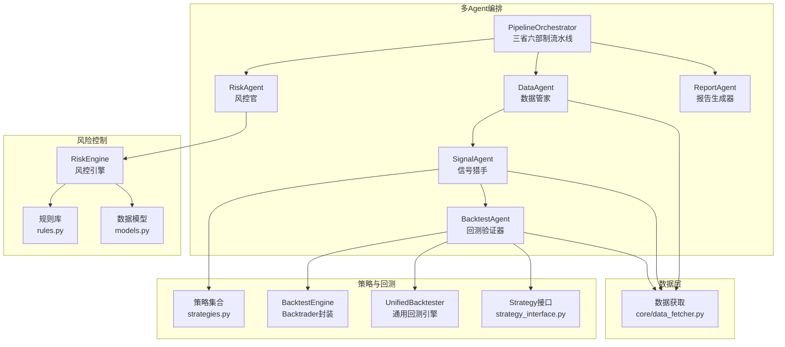
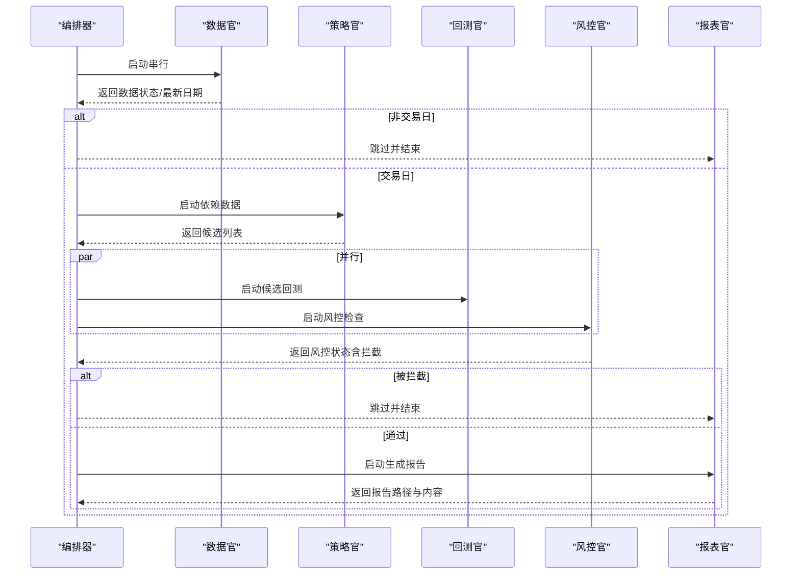
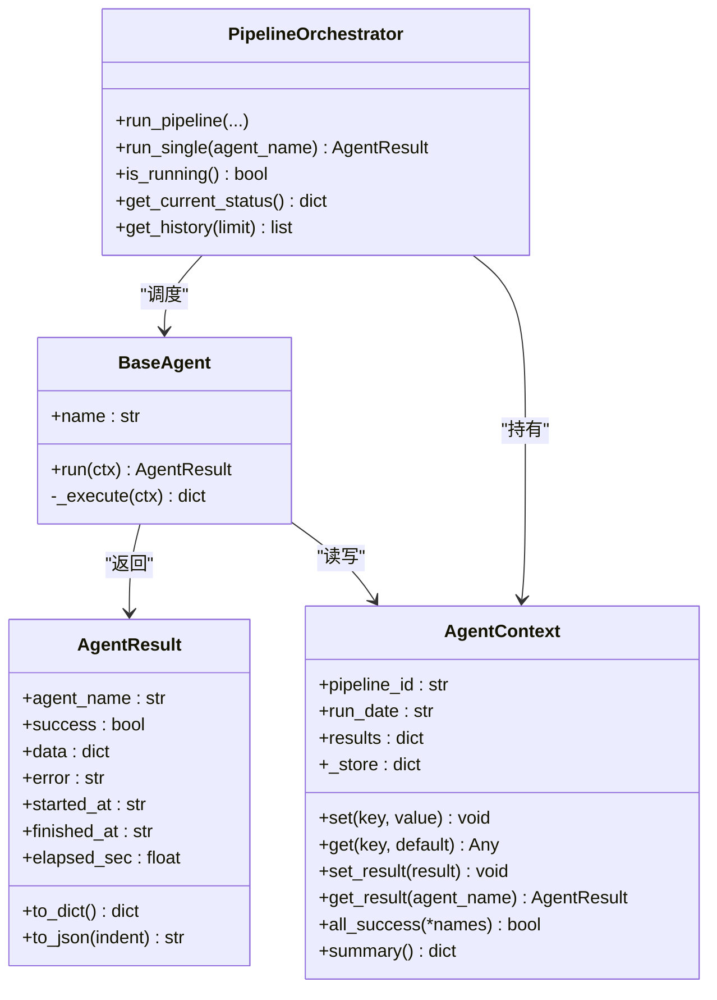
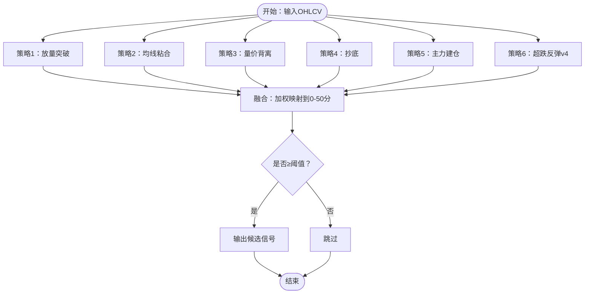
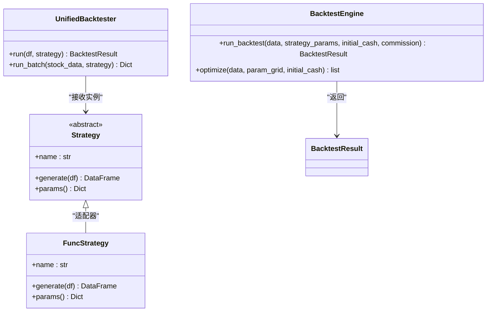
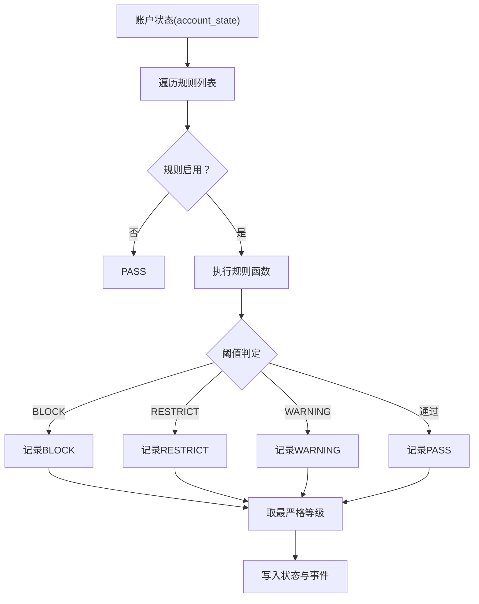
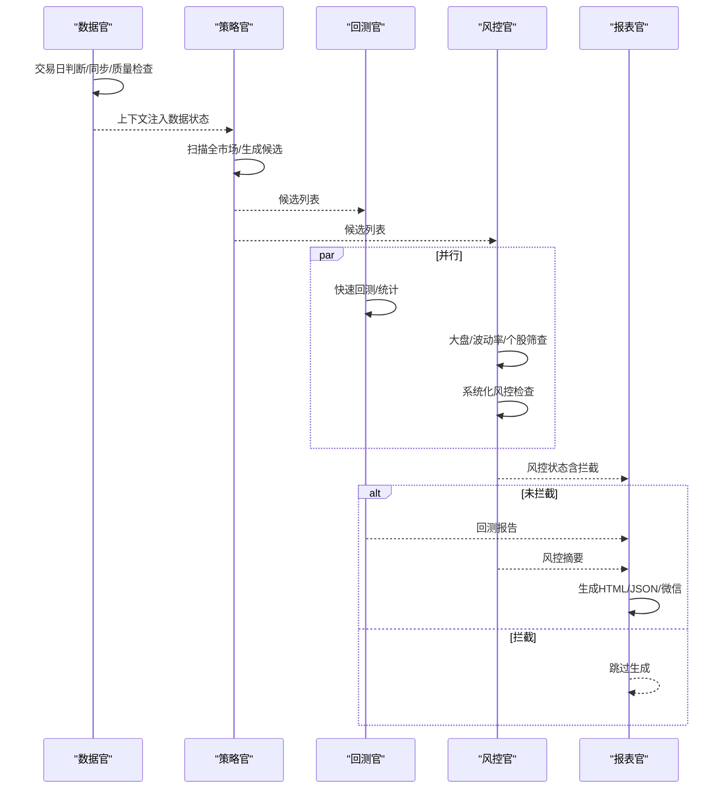
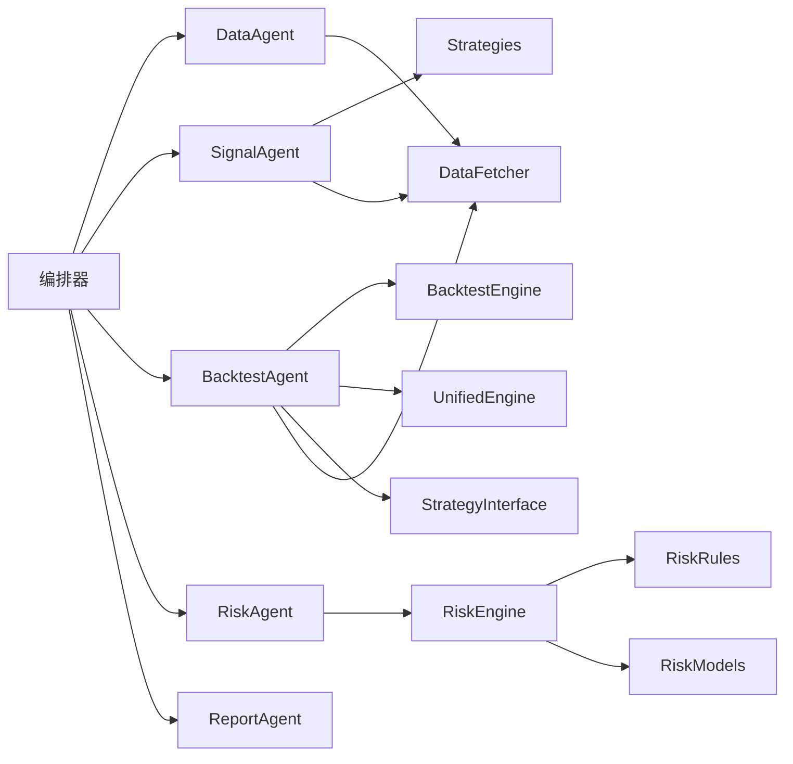

# 核心模块

<cite>
**本文引用的文件**
- [agents/base.py](file://agents/base.py)
- [agents/orchestrator.py](file://agents/orchestrator.py)
- [agents/data_agent.py](file://agents/data_agent.py)
- [agents/signal_agent.py](file://agents/signal_agent.py)
- [agents/backtest_agent.py](file://agents/backtest_agent.py)
- [agents/risk_agent.py](file://agents/risk_agent.py)
- [agents/report_agent.py](file://agents/report_agent.py)
- [backtest/engine.py](file://backtest/engine.py)
- [backtest/unified_engine.py](file://backtest/unified_engine.py)
- [backtest/strategy_interface.py](file://backtest/strategy_interface.py)
- [risk/engine.py](file://risk/engine.py)
- [risk/rules.py](file://risk/rules.py)
- [risk/models.py](file://risk/models.py)
- [core/data_fetcher.py](file://core/data_fetcher.py)
- [strategy/strategies.py](file://strategy/strategies.py)
</cite>

## 目录
1. [简介](#简介)
2. [项目结构](#项目结构)
3. [核心组件](#核心组件)
4. [架构总览](#架构总览)
5. [详细组件分析](#详细组件分析)
6. [依赖分析](#依赖分析)
7. [性能考量](#性能考量)
8. [故障排查指南](#故障排查指南)
9. [结论](#结论)
10. [附录](#附录)

## 简介
本文件面向AIQuant核心模块，系统梳理策略引擎、风险控制系统、回测引擎、多Agent编排系统与数据管理层的职责、实现原理、交互关系与使用方法，并提供配置要点、扩展路径、性能与错误处理建议，帮助开发者快速理解与二次开发。

## 项目结构
AIQuant采用“策略-回测-风控-数据-多Agent编排”的分层设计，围绕统一的Agent上下文在流水线上串联各模块，形成可扩展、可配置、可观测的自动化交易管线。

图表来源
- [agents/orchestrator.py:36-175](file://agents/orchestrator.py#L36-L175)
- [agents/data_agent.py:25-86](file://agents/data_agent.py#L25-L86)
- [agents/signal_agent.py:41-108](file://agents/signal_agent.py#L41-L108)
- [agents/backtest_agent.py:31-68](file://agents/backtest_agent.py#L31-L68)
- [agents/risk_agent.py:25-96](file://agents/risk_agent.py#L25-L96)
- [agents/report_agent.py:20-90](file://agents/report_agent.py#L20-L90)
- [strategy/strategies.py:1-431](file://strategy/strategies.py#L1-L431)
- [backtest/engine.py:72-140](file://backtest/engine.py#L72-L140)
- [backtest/unified_engine.py:59-132](file://backtest/unified_engine.py#L59-L132)
- [backtest/strategy_interface.py:23-85](file://backtest/strategy_interface.py#L23-L85)
- [risk/engine.py:13-71](file://risk/engine.py#L13-L71)
- [risk/rules.py:376-387](file://risk/rules.py#L376-L387)
- [risk/models.py:11-77](file://risk/models.py#L11-L77)
- [core/data_fetcher.py:173-222](file://core/data_fetcher.py#L173-L222)

章节来源
- [agents/orchestrator.py:11-16](file://agents/orchestrator.py#L11-L16)
- [agents/data_agent.py:1-10](file://agents/data_agent.py#L1-L10)
- [agents/signal_agent.py:1-9](file://agents/signal_agent.py#L1-L9)
- [agents/backtest_agent.py:1-9](file://agents/backtest_agent.py#L1-L9)
- [agents/risk_agent.py:1-11](file://agents/risk_agent.py#L1-L11)
- [agents/report_agent.py:1-9](file://agents/report_agent.py#L1-L9)
- [strategy/strategies.py:1-14](file://strategy/strategies.py#L1-L14)
- [backtest/engine.py:1-8](file://backtest/engine.py#L1-L8)
- [backtest/unified_engine.py:1-9](file://backtest/unified_engine.py#L1-L9)
- [backtest/strategy_interface.py:1-6](file://backtest/strategy_interface.py#L1-L6)
- [risk/engine.py:1-4](file://risk/engine.py#L1-L4)
- [risk/rules.py:1-7](file://risk/rules.py#L1-L7)
- [risk/models.py:1-3](file://risk/models.py#L1-L3)
- [core/data_fetcher.py:1-11](file://core/data_fetcher.py#L1-L11)

## 核心组件
- 多Agent编排系统：负责流水线调度、并行执行、状态持久化与拦截控制。
- 策略引擎：提供多策略信号生成与融合，支持函数式策略与Strategy接口适配。
- 回测引擎：提供Backtrader封装与通用回测引擎框架，支持T+1执行、手续费、滑点、止损止盈与熔断。
- 风控系统：规则化风控检查，支持配置化阈值、分级与持久化记录。
- 数据管理层：统一A股行情与指数数据获取、缓存与质量检查。

章节来源
- [agents/orchestrator.py:36-175](file://agents/orchestrator.py#L36-L175)
- [strategy/strategies.py:17-431](file://strategy/strategies.py#L17-L431)
- [backtest/engine.py:72-140](file://backtest/engine.py#L72-L140)
- [backtest/unified_engine.py:59-132](file://backtest/unified_engine.py#L59-L132)
- [risk/engine.py:13-71](file://risk/engine.py#L13-L71)
- [core/data_fetcher.py:173-222](file://core/data_fetcher.py#L173-L222)

## 架构总览
AIQuant采用“三省六部制”流水线：数据官（DataAgent）→ 策略官（SignalAgent）→ 回测官（BacktestAgent）与 风控官（RiskAgent）并行 → 报表官（ReportAgent）。风控官具备一票否决权，拦截后跳过报表生成。

图表来源
- [agents/orchestrator.py:112-153](file://agents/orchestrator.py#L112-L153)
- [agents/backtest_agent.py:37-68](file://agents/backtest_agent.py#L37-L68)
- [agents/risk_agent.py:31-96](file://agents/risk_agent.py#L31-L96)
- [agents/report_agent.py:63-90](file://agents/report_agent.py#L63-L90)

章节来源
- [agents/orchestrator.py:11-16](file://agents/orchestrator.py#L11-L16)
- [agents/orchestrator.py:112-175](file://agents/orchestrator.py#L112-L175)

## 详细组件分析

### 多Agent编排系统
- 设计要点
  - 统一上下文：AgentContext提供共享存储、结果登记与摘要生成。
  - 生命周期：BaseAgent自动计时、异常捕获与结果落盘。
  - 流水线：三省六部制，串行+并行混合，支持拦截与历史记录。
- 关键接口
  - BaseAgent.run(ctx)：统一入口，内部调用_execute。
  - AgentContext.set/get/set_result/get_result/summary/all_success。
  - PipelineOrchestrator.run_pipeline/_run_agent/_run_parallel。
- 使用建议
  - 新增Agent时遵循BaseAgent接口，仅在_execute中实现业务。
  - 通过ctx传递跨Agent数据，避免硬编码耦合。
  - 并行阶段注意资源竞争与幂等性。

图表来源
- [agents/base.py:88-120](file://agents/base.py#L88-L120)
- [agents/base.py:20-85](file://agents/base.py#L20-L85)
- [agents/orchestrator.py:36-262](file://agents/orchestrator.py#L36-L262)

章节来源
- [agents/base.py:20-120](file://agents/base.py#L20-L120)
- [agents/orchestrator.py:36-262](file://agents/orchestrator.py#L36-L262)

### 策略引擎
- 功能职责
  - 提供多策略信号生成（放量突破、均线粘合、量价背离、抄底、主力建仓、超跌反弹v4）。
  - 策略融合：将多策略评分映射到0-50，设定阈值触发。
  - 输出统一列：BUY_SIGNAL/SELL_SIGNAL/SCORE等，供回测与UI使用。
- 关键实现
  - 函数式策略：直接返回DataFrame，包含必要列。
  - 融合策略：fuse_signals按权重加权，映射到0-50分。
  - v4策略：超跌反弹v4，结合RSI与成交量等条件。
- 使用方法
  - 通过SignalAgent扫描全市场股票，生成候选列表。
  - 将候选交由回测Agent进行快速历史回测验证。

图表来源
- [strategy/strategies.py:36-431](file://strategy/strategies.py#L36-L431)

章节来源
- [strategy/strategies.py:17-431](file://strategy/strategies.py#L17-L431)
- [agents/signal_agent.py:47-108](file://agents/signal_agent.py#L47-L108)

### 回测引擎
- Backtrader封装（BacktestEngine）
  - 封装初始化、数据喂入、策略添加、分析器与结果提取。
  - 提供run_backtest与optimize（网格搜索）。
- 通用回测引擎（UnifiedBacktester）
  - 插件化策略接口Strategy.generate，支持T+1执行、手续费、滑点、止损止盈、最大持仓天数、回撤熔断与择时。
  - 提供run与run_batch，统一结果结构BacktestResult。
- 使用建议
  - 新策略优先实现Strategy接口，便于统一接入与测试。
  - 参数优化优先使用网格搜索或贝叶斯优化（可扩展）。

图表来源
- [backtest/strategy_interface.py:23-85](file://backtest/strategy_interface.py#L23-L85)
- [backtest/unified_engine.py:59-143](file://backtest/unified_engine.py#L59-L143)
- [backtest/engine.py:72-174](file://backtest/engine.py#L72-L174)

章节来源
- [backtest/engine.py:72-174](file://backtest/engine.py#L72-L174)
- [backtest/unified_engine.py:59-143](file://backtest/unified_engine.py#L59-L143)
- [backtest/strategy_interface.py:23-85](file://backtest/strategy_interface.py#L23-L85)

### 风控系统
- 风控引擎（RiskEngine）
  - 执行全量规则检查，合并为最严格等级。
  - 持久化检查结果与状态至数据库，提供查询接口。
- 规则库（rules.py）
  - 配置化阈值，支持启用/禁用与热加载。
  - 规则覆盖：最大回撤、单股集中度、大盘择时、连续亏损、日交易频率、波动率、行业集中度、总仓位、节假日提醒、黑名单等。
- 数据模型（models.py）
  - RiskLevel/RiskCategory枚举与RiskCheckResult/RiskStatus数据类。

图表来源
- [risk/engine.py:19-71](file://risk/engine.py#L19-L71)
- [risk/rules.py:34-387](file://risk/rules.py#L34-L387)
- [risk/models.py:28-77](file://risk/models.py#L28-L77)

章节来源
- [risk/engine.py:13-168](file://risk/engine.py#L13-L168)
- [risk/rules.py:14-387](file://risk/rules.py#L14-L387)
- [risk/models.py:11-77](file://risk/models.py#L11-L77)

### 数据管理层
- 数据获取（core/data_fetcher.py）
  - 主数据源：baostock（免费、稳定、无频率限制）。
  - 备用数据源：akshare（多接口降级）。
  - 支持股票历史行情、指数、实时价格、股票列表、热门股票、市值估算等。
  - 缓存机制与异常降级，保证可用性。
- 使用建议
  - 优先使用baostock，失败自动降级akshare。
  - 注意日期格式与复权字段，统一为YYYYMMDD。
  - 批量市值估算使用baostock换手率反推，避免频繁请求。

章节来源
- [core/data_fetcher.py:173-578](file://core/data_fetcher.py#L173-L578)

### Agent流水线详解
- DataAgent：交易日判断、全量/增量同步、质量检查、缓存清理。
- SignalAgent：全市场扫描，融合与v4策略评分，生成Top候选并入库。
- BacktestAgent：对候选做快速历史回测，统计胜率、收益与最大回撤。
- RiskAgent：大盘趋势、波动率、个股筛查、仓位建议与系统化风控检查。
- ReportAgent：整合上游输出，生成HTML与JSON报告及微信推送文本。

图表来源
- [agents/data_agent.py:31-86](file://agents/data_agent.py#L31-L86)
- [agents/signal_agent.py:47-108](file://agents/signal_agent.py#L47-L108)
- [agents/backtest_agent.py:37-68](file://agents/backtest_agent.py#L37-L68)
- [agents/risk_agent.py:31-96](file://agents/risk_agent.py#L31-L96)
- [agents/report_agent.py:63-90](file://agents/report_agent.py#L63-L90)

章节来源
- [agents/data_agent.py:25-167](file://agents/data_agent.py#L25-L167)
- [agents/signal_agent.py:41-213](file://agents/signal_agent.py#L41-L213)
- [agents/backtest_agent.py:31-181](file://agents/backtest_agent.py#L31-L181)
- [agents/risk_agent.py:25-262](file://agents/risk_agent.py#L25-L262)
- [agents/report_agent.py:20-393](file://agents/report_agent.py#L20-L393)

## 依赖分析
- 模块耦合
  - 编排器对Agent模块弱依赖（延迟导入），降低外部依赖对启动的影响。
  - 策略与回测解耦：策略通过Strategy接口或函数式策略输出信号，回测引擎统一消费。
  - 风控与数据解耦：风控引擎通过account_state抽象，不直接依赖具体数据源。
- 外部依赖
  - backtrader：回测封装。
  - pandas/numpy：数据处理与指标计算。
  - baostock/akshare：行情数据源。
- 潜在循环依赖
  - 通过延迟导入与模块边界清晰，未发现循环依赖迹象。

图表来源
- [agents/orchestrator.py:46-52](file://agents/orchestrator.py#L46-L52)
- [agents/signal_agent.py:18-28](file://agents/signal_agent.py#L18-L28)
- [agents/backtest_agent.py:17-28](file://agents/backtest_agent.py#L17-L28)
- [risk/engine.py:8-11](file://risk/engine.py#L8-L11)
- [core/data_fetcher.py:12-23](file://core/data_fetcher.py#L12-L23)

章节来源
- [agents/orchestrator.py:46-52](file://agents/orchestrator.py#L46-L52)
- [agents/signal_agent.py:18-28](file://agents/signal_agent.py#L18-L28)
- [agents/backtest_agent.py:17-28](file://agents/backtest_agent.py#L17-L28)
- [risk/engine.py:8-11](file://risk/engine.py#L8-L11)
- [core/data_fetcher.py:12-23](file://core/data_fetcher.py#L12-L23)

## 性能考量
- 数据获取
  - baostock无频率限制，适合全量批量拉取；akshare存在限速，采用降级策略。
  - 建议：批量同步时避免频繁登录登出，合理设置进度回调。
- 策略与回测
  - 策略融合采用向量化计算，注意内存占用与索引对齐。
  - 回测阶段尽量使用T+1执行与统一手续费/滑点参数，减少偏差。
- 风控
  - 规则检查线性遍历，建议阈值配置化并按需启用，避免冗余计算。
- 并行与锁
  - 编排器使用线程池并行执行，注意共享资源的线程安全（如数据库连接）。

## 故障排查指南
- Agent异常
  - BaseAgent自动捕获异常并记录堆栈，检查AgentResult.error定位问题。
- 数据获取失败
  - 检查baostock登录状态与网络连通性；若失败自动降级akshare。
- 回测失败
  - 确认策略返回列包含open（T+1执行需要）；检查参数合法性与数据完整性。
- 风控拦截
  - 查看RiskEngine保存的风险事件与状态，核对阈值配置与账户状态字段。
- 报表生成
  - 确认上游Agent结果已写入上下文；检查reports目录权限与模板渲染。

章节来源
- [agents/base.py:101-113](file://agents/base.py#L101-L113)
- [core/data_fetcher.py:210-222](file://core/data_fetcher.py#L210-L222)
- [backtest/unified_engine.py:120-125](file://backtest/unified_engine.py#L120-L125)
- [risk/engine.py:73-127](file://risk/engine.py#L73-L127)
- [agents/report_agent.py:228-250](file://agents/report_agent.py#L228-L250)

## 结论
AIQuant通过模块化与插件化设计，实现了从数据获取、策略生成、风控检查到回测验证与报告输出的完整流水线。编排器提供稳定的执行框架，策略与回测引擎强调可扩展与可移植，风控系统支持配置化与持久化，数据层兼顾稳定性与可用性。开发者可在既定接口与流程上快速扩展新策略、新规则与新Agent。

## 附录
- 配置与参数
  - 策略融合权重：可通过DEFAULT_WEIGHTS调整，影响融合评分。
  - 回测参数：手续费、滑点、止损止盈、最大持仓天数等在UnifiedBacktester中集中配置。
  - 风控阈值：通过risk_config.yaml配置，规则函数按阈值自动分级。
- 扩展点
  - 新策略：实现Strategy接口或沿用函数式策略，加入SignalAgent扫描链路。
  - 新Agent：继承BaseAgent，按需读写AgentContext，注册到编排器。
  - 新规则：在rules.py中新增规则函数，纳入DEFAULT_RULES。
- 最佳实践
  - 保持Agent职责单一，通过上下文传递数据。
  - 回测前统一数据清洗与复权处理。
  - 风控规则按风险等级分层，避免过度限制。
  - 批量任务设置进度回调与异常隔离，保障稳定性。