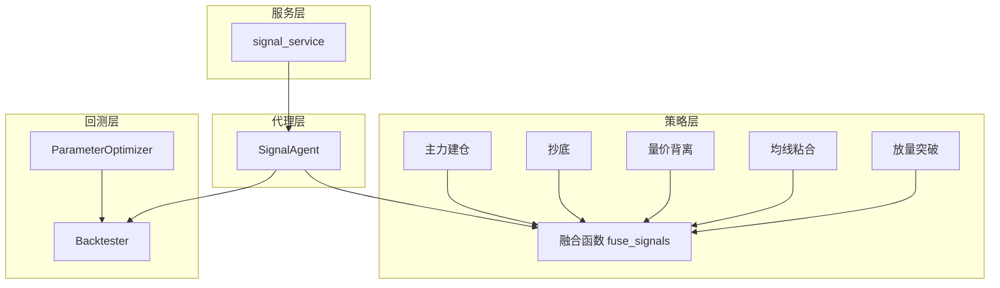
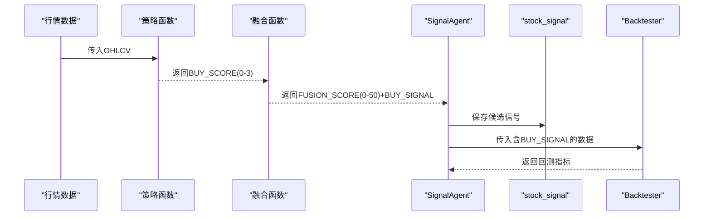
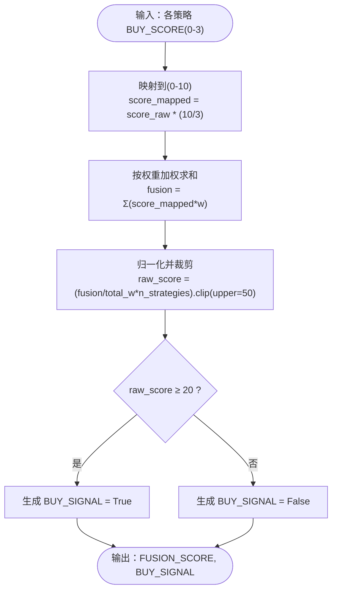
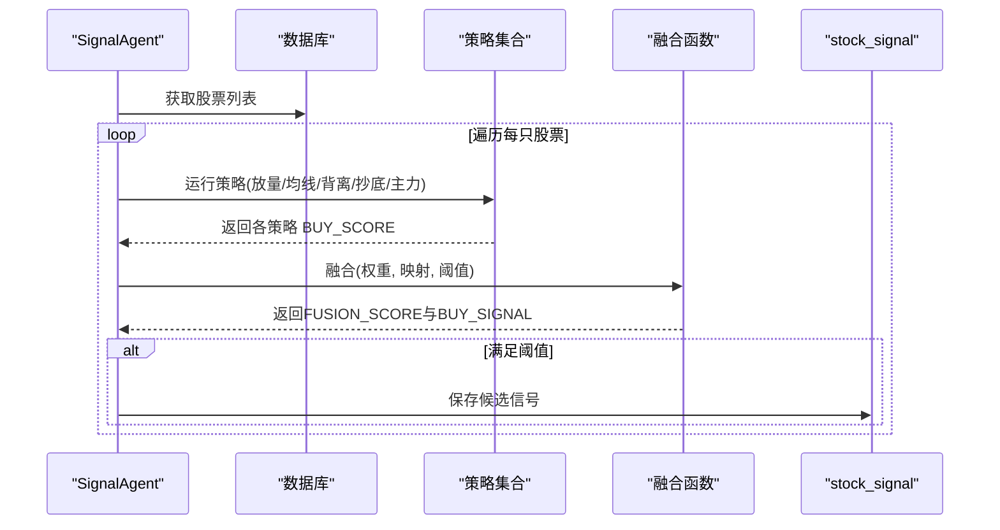
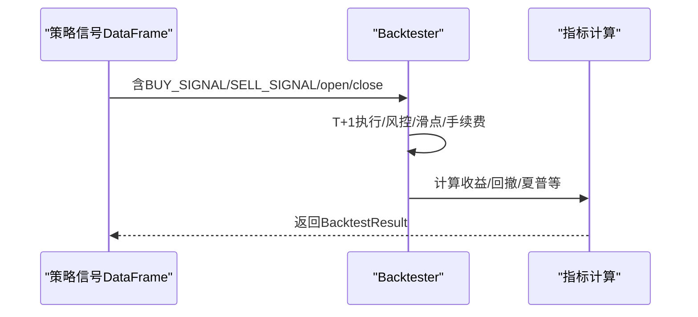
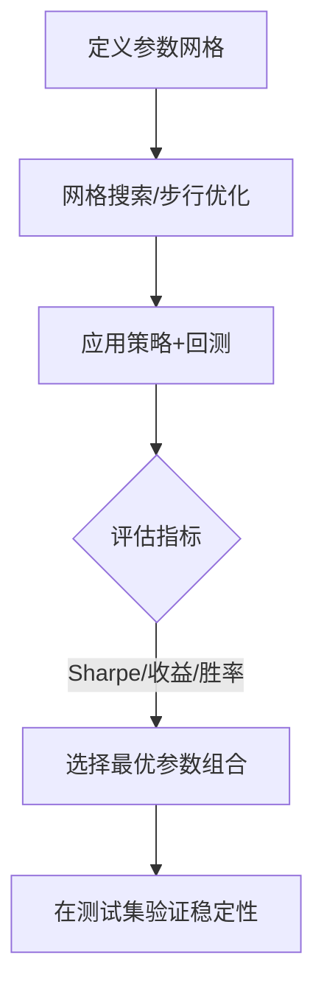
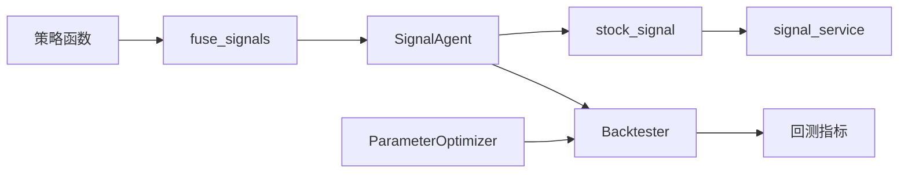

# 信号融合机制

<cite>
**本文引用的文件**
- [strategy/strategies.py](file://strategy/strategies.py)
- [agents/signal_agent.py](file://agents/signal_agent.py)
- [backtest/backtest.py](file://backtest/backtest.py)
- [backtest/param_optimizer.py](file://backtest/param_optimizer.py)
- [services/signal_service.py](file://services/signal_service.py)
- [quant.py](file://quant.py)
- [governance/chancellery/scoring_engine.py](file://governance/chancellery/scoring_engine.py)
- [backtest/unified_engine.py](file://backtest/unified_engine.py)
- [backtest/strategy_interface.py](file://backtest/strategy_interface.py)
</cite>

## 目录
1. [引言](#引言)
2. [项目结构](#项目结构)
3. [核心组件](#核心组件)
4. [架构总览](#架构总览)
5. [详细组件分析](#详细组件分析)
6. [依赖分析](#依赖分析)
7. [性能考量](#性能考量)
8. [故障排查指南](#故障排查指南)
9. [结论](#结论)
10. [附录](#附录)

## 引言
本文件系统化阐述 AIQuant 的“多策略信号融合机制”，覆盖算法原理、权重分配、评分标准化、阈值设定、性能评估与回测验证、参数优化技巧以及最佳实践。文档面向不同技术背景读者，既提供高层概览，也给出代码级图示与路径引用，便于快速定位实现细节。

## 项目结构
围绕信号融合的关键模块分布如下：
- 策略与融合：位于 strategy/strategies.py，包含五类策略与融合函数 fuse_signals
- 信号代理：agents/signal_agent.py 负责扫描与候选生成
- 回测引擎：backtest/backtest.py 提供统一回测框架与指标计算
- 参数优化：backtest/param_optimizer.py 提供网格搜索与步行优化
- 评分引擎：governance/chancellery/scoring_engine.py 提供多因子评分（0-100）
- 服务接口：services/signal_service.py 提供历史信号查询
- 统一引擎与接口：backtest/unified_engine.py、backtest/strategy_interface.py 为策略插件化准备
- 核心调度与阈值：quant.py 统一参数与阈值，驱动扫描与回测

图表来源
- [strategy/strategies.py:368-429](file://strategy/strategies.py#L368-L429)
- [agents/signal_agent.py:110-172](file://agents/signal_agent.py#L110-L172)
- [backtest/backtest.py:121-409](file://backtest/backtest.py#L121-L409)
- [backtest/param_optimizer.py:39-78](file://backtest/param_optimizer.py#L39-L78)
- [services/signal_service.py:12-122](file://services/signal_service.py#L12-L122)

章节来源
- [strategy/strategies.py:1-431](file://strategy/strategies.py#L1-L431)
- [agents/signal_agent.py:1-213](file://agents/signal_agent.py#L1-L213)
- [backtest/backtest.py:1-517](file://backtest/backtest.py#L1-L517)
- [backtest/param_optimizer.py:1-280](file://backtest/param_optimizer.py#L1-L280)
- [services/signal_service.py:1-243](file://services/signal_service.py#L1-L243)
- [quant.py:1-631](file://quant.py#L1-L631)
- [governance/chancellery/scoring_engine.py:1-370](file://governance/chancellery/scoring_engine.py#L1-L370)
- [backtest/unified_engine.py:1-143](file://backtest/unified_engine.py#L1-L143)
- [backtest/strategy_interface.py:1-86](file://backtest/strategy_interface.py#L1-L86)

## 核心组件
- 多策略信号生成：五类策略各自输出 BUY_SCORE（0-3）与 BUY_SIGNAL/SELL_SIGNAL
- 信号融合：fuse_signals 将各策略评分映射至 0-10，按权重加权求和，得到 0-50 的融合分，并设定阈值触发
- 代理扫描：SignalAgent 调用策略与融合，筛选候选并保存到 stock_signal
- 回测验证：Backtester 执行 T+1 交易，计算收益、回撤、夏普等指标
- 参数优化：ParameterOptimizer 支持网格搜索与步行优化，以 Sharpe 等为目标
- 评分引擎：MultiFactorScoringEngine 提供多因子 0-100 标准化评分（与融合分体系并行）

章节来源
- [strategy/strategies.py:36-255](file://strategy/strategies.py#L36-L255)
- [strategy/strategies.py:368-429](file://strategy/strategies.py#L368-L429)
- [agents/signal_agent.py:110-172](file://agents/signal_agent.py#L110-L172)
- [backtest/backtest.py:121-409](file://backtest/backtest.py#L121-L409)
- [backtest/param_optimizer.py:19-78](file://backtest/param_optimizer.py#L19-L78)
- [governance/chancellery/scoring_engine.py:246-314](file://governance/chancellery/scoring_engine.py#L246-L314)

## 架构总览
信号融合贯穿“策略生成 → 融合 → 信号 → 回测 → 优化”的闭环。下图展示关键交互：

图表来源
- [strategy/strategies.py:368-429](file://strategy/strategies.py#L368-L429)
- [agents/signal_agent.py:110-172](file://agents/signal_agent.py#L110-L172)
- [backtest/backtest.py:121-409](file://backtest/backtest.py#L121-L409)

## 详细组件分析

### 融合算法与数学模型
- 原始评分范围：各策略输出 BUY_SCORE ∈ [0, 3]
- 映射到统一尺度：score_mapped = score_raw × (10/3)
- 权重加权求和：fusion = Σ(score_mapped_i × weight_i)
- 归一化与上限裁剪：raw_score = (fusion / total_w × n_strategies).clip(upper=50)
- 阈值触发：当 raw_score ≥ 20 时产生 BUY_SIGNAL

图表来源
- [strategy/strategies.py:404-429](file://strategy/strategies.py#L404-L429)

章节来源
- [strategy/strategies.py:368-429](file://strategy/strategies.py#L368-L429)

### 权重分配方法
- 默认权重：等权分配（五策略各 0.2）
- 可配置权重：fuse_signals 支持传入 weights 列表，要求总和为 1.0
- 优化建议：通过参数优化器在训练集上寻找最优权重组合，目标指标可选 Sharpe、总收益、胜率或 Calmar

章节来源
- [strategy/strategies.py:368-429](file://strategy/strategies.py#L368-L429)
- [backtest/param_optimizer.py:24-37](file://backtest/param_optimizer.py#L24-L37)

### 评分标准化与阈值设定
- 标准化：将各策略 0-3 映射到 0-10，确保不同策略在同一尺度比较
- 融合分：0-50，便于与 v4 超跌反弹策略的 0-50 映射分统一展示
- 阈值：融合阈值 20（回测验证最优），用于过滤低置信度信号
- v4 策略：原生 0-4，映射到 0-50；阈值 1.8（原生）

章节来源
- [strategy/strategies.py:409-420](file://strategy/strategies.py#L409-L420)
- [quant.py:37-51](file://quant.py#L37-L51)
- [quant.py:210-211](file://quant.py#L210-L211)

### 代理扫描与候选生成
- SignalAgent 依次运行五策略与 v4 超跌反弹
- 将各策略 0-3 映射为 0-10，用于展示与触发列表
- 融合阈值 28（回测验证最优），筛选候选
- 保存到 stock_signal，供面板与服务查询

图表来源
- [agents/signal_agent.py:110-172](file://agents/signal_agent.py#L110-L172)
- [quant.py:108-114](file://quant.py#L108-L114)

章节来源
- [agents/signal_agent.py:110-172](file://agents/signal_agent.py#L110-L172)
- [quant.py:108-114](file://quant.py#L108-L114)

### 回测验证与性能评估
- T+1 执行：信号日判定，次日开盘价执行
- 风险控制：止损止盈、最大持仓天数、回撤熔断、动态仓位（可选）
- 指标：总收益、年化收益、最大回撤、夏普比率、胜率、盈亏比、平均持仓天数等
- 信号溯源：记录触发策略标签，便于回测复盘

图表来源
- [backtest/backtest.py:121-409](file://backtest/backtest.py#L121-L409)

章节来源
- [backtest/backtest.py:56-471](file://backtest/backtest.py#L56-L471)

### 参数优化与回测验证流程
- 网格搜索：遍历参数组合，回测评估，选择最优组合
- 步行优化：时间序列折叠，训练集上优化，测试集上验证，评估稳定性
- 目标指标：Sharpe、总收益、胜率、Calmar 等

图表来源
- [backtest/param_optimizer.py:19-78](file://backtest/param_optimizer.py#L19-L78)
- [backtest/param_optimizer.py:250-280](file://backtest/param_optimizer.py#L250-L280)

章节来源
- [backtest/param_optimizer.py:19-78](file://backtest/param_optimizer.py#L19-L78)
- [backtest/param_optimizer.py:250-280](file://backtest/param_optimizer.py#L250-L280)

### 多因子评分引擎（与融合分体系并行）
- 因子：趋势、动量、波动率、成交量、质量
- 评分：每个因子 0-10，权重总和 1.0，最终 0-100
- 用途：独立的多因子打分，与融合分互补

章节来源
- [governance/chancellery/scoring_engine.py:246-314](file://governance/chancellery/scoring_engine.py#L246-L314)

### 统一回测引擎与策略接口
- Strategy 接口：generate 返回含 BUY_SIGNAL/SELL_SIGNAL/SCORE 的 DataFrame
- FuncStrategy 适配器：将函数式策略包装为 Strategy
- UnifiedBacktester：统一回测入口（占位，后续迭代）

章节来源
- [backtest/strategy_interface.py:23-86](file://backtest/strategy_interface.py#L23-L86)
- [backtest/unified_engine.py:59-132](file://backtest/unified_engine.py#L59-L132)

## 依赖分析
- 融合函数依赖各策略输出的 BUY_SCORE 列
- SignalAgent 依赖策略与融合函数，输出候选信号
- 回测引擎依赖 BUY_SIGNAL/SELL_SIGNAL/open/close 列
- 参数优化器依赖策略函数与回测引擎
- 服务层依赖 stock_signal 表进行历史查询

图表来源
- [strategy/strategies.py:368-429](file://strategy/strategies.py#L368-L429)
- [agents/signal_agent.py:110-172](file://agents/signal_agent.py#L110-L172)
- [backtest/backtest.py:121-409](file://backtest/backtest.py#L121-L409)
- [backtest/param_optimizer.py:19-78](file://backtest/param_optimizer.py#L19-L78)
- [services/signal_service.py:12-122](file://services/signal_service.py#L12-L122)

章节来源
- [strategy/strategies.py:368-429](file://strategy/strategies.py#L368-L429)
- [agents/signal_agent.py:110-172](file://agents/signal_agent.py#L110-L172)
- [backtest/backtest.py:121-409](file://backtest/backtest.py#L121-L409)
- [backtest/param_optimizer.py:19-78](file://backtest/param_optimizer.py#L19-L78)
- [services/signal_service.py:12-122](file://services/signal_service.py#L12-L122)

## 性能考量
- 计算复杂度：融合为 O(N_strategies × N_days)，映射与加权常数级
- 数据一致性：确保各策略输出列一致（open/close/volume/BUY_SCORE/BUY_SIGNAL/SELL_SIGNAL）
- 内存与IO：批量扫描与回测时注意分批与缓存清理
- 指标稳定性：使用步行优化评估参数组合在不同时间段的稳定性

## 故障排查指南
- 融合分异常为 0：检查 weights 是否为空或 total_w=0；确认各策略 BUY_SCORE 列存在且非空
- 信号未触发：核对阈值（融合 20，v4 1.8）与映射（0-3→0-10→0-50）
- 回测无交易：确认 BUY_SIGNAL/SELL_SIGNAL 列存在且 T+1 执行逻辑正确
- 参数优化失败：检查参数网格合法性与回测异常捕获

章节来源
- [strategy/strategies.py:379-422](file://strategy/strategies.py#L379-L422)
- [backtest/backtest.py:121-131](file://backtest/backtest.py#L121-L131)
- [backtest/param_optimizer.py:45-48](file://backtest/param_optimizer.py#L45-L48)

## 结论
AIQuant 的信号融合机制通过“统一尺度映射 + 权重加权 + 阈值触发”实现稳健的多策略信号整合。结合回测与参数优化，可在不同市场环境下持续校准权重与阈值，提升策略稳定性与收益风险比。建议在实际应用中：
- 以回测验证确定融合阈值与权重
- 使用步行优化评估参数稳定性
- 与多因子评分引擎并行使用，增强信号置信度
- 严格遵循 T+1 执行与风控规则，避免未来数据泄露

## 附录
- 代码示例路径（不展示具体代码内容）：
  - 融合函数实现：[strategy/strategies.py:368-429](file://strategy/strategies.py#L368-L429)
  - 代理扫描与阈值：[agents/signal_agent.py:110-172](file://agents/signal_agent.py#L110-L172), [quant.py:48-51](file://quant.py#L48-L51)
  - 回测引擎与指标：[backtest/backtest.py:121-471](file://backtest/backtest.py#L121-L471)
  - 参数优化流程：[backtest/param_optimizer.py:19-78](file://backtest/param_optimizer.py#L19-L78), [backtest/param_optimizer.py:250-280](file://backtest/param_optimizer.py#L250-L280)
  - 多因子评分引擎：[governance/chancellery/scoring_engine.py:246-314](file://governance/chancellery/scoring_engine.py#L246-L314)
  - 服务查询接口：[services/signal_service.py:12-122](file://services/signal_service.py#L12-L122)